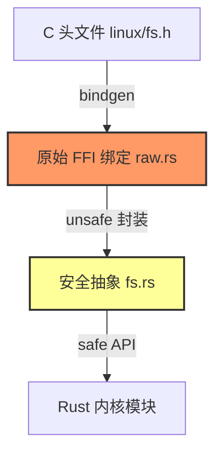
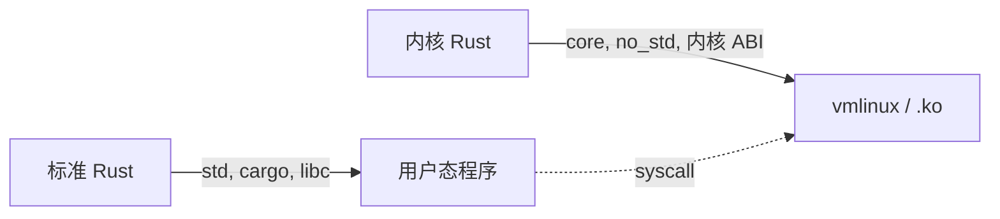

# Rust for Linux 工具链稳定化指南

> **分级**: [A]
> **Bloom 层级**: L3 (应用)
> **创建日期**: 2026-05-08
> **最后更新**: 2026-05-08
> **Rust 版本**: 1.96.0+ (Edition 2024) / 内核分支 `rust-for-linux`
> **状态**: 📝 技术预览
> **适用内核**: Linux 6.7+ (实验性支持)

---

## 📑 目录
>
> **[来源: [Rust Reference](https://doc.rust-lang.org/reference/)]**
>
- [Rust for Linux 工具链稳定化指南](#rust-for-linux-工具链稳定化指南)
  - [📑 目录](#目录)
  - [1. 项目概述](#1-项目概述)
  - [2. 工具链需求](#2-工具链需求)
  - [3. 内核编译目标](#3-内核编译目标)
  - [4. 内核模块编写基础](#4-内核模块编写基础)
    - [4.1 `#[no_std]` 与 `#[no_main]`](#41-no_std-与-no_main)
    - [4.2 `panic_handler`](#42-panic_handler)
    - [4.3 `alloc` 配置](#43-alloc-配置)
  - [5. 与 C 内核代码的互操作](#5-与-c-内核代码的互操作)
  - [6. 当前状态与路线图](#6-当前状态与路线图)
  - [7. 开发环境搭建](#7-开发环境搭建)
    - [7.1 编译流程](#71-编译流程)
    - [7.2 调试](#72-调试)
  - [8. 与标准 Rust 开发的差异](#8-与标准-rust-开发的差异)
  - [9. 总结](#9-总结)
  - [📋 复查记录](#复查记录)
  - [**相关文档**: C++ ↔ Rust 互操作评估](#相关文档-c--rust-互操作评估)
  - [相关概念](#相关概念)
  - [权威来源索引](#权威来源索引)

## 1. 项目概述
>
> **[来源: Rust Official Docs]**

**Rust for Linux** 是一项在 Linux 内核中引入 Rust 作为第二开发语言的开源项目，由 Miguel Ojeda 等人主导维护。其目标是：

- **内存安全**：利用 Rust 的所有权模型消除内核中的 use-after-free、double-free 和数据竞争。
- **并发安全**：将 `Send` / `Sync` 检查引入内核并发原语（如 `spinlock_t`、`mutex_t`）。
- **渐进集成**：允许在现有 C 内核代码旁编写 Rust 驱动、文件系统和子系统模块。

> **RFC 状态**: 相关支持已合并至 Linux 主线内核（6.7+），但 Rust 子系统仍处于实验性阶段，默认编译选项中未强制启用。

---

## 2. 工具链需求
>
> **[来源: Rust Official Docs]**

在内核中编译 Rust 代码与常规用户态开发有本质区别，需要专门的工具链配置：

| 组件 | 说明 | 版本要求 |
| :--- | :--- | :--- |
| `rustc` | 需支持裸机目标（`no_std`） | 1.85.0+（内核分支可能锁定特定 nightly） |
| `bindgen` | 自动生成 C 头文件的 Rust FFI 绑定 | 0.70+ |
| `libclang` | `bindgen` 依赖的 C/C++ 前端 | LLVM 18+ |
| `rustfmt` | 内核代码格式化 | 与 `rustc` 配套 |
| `clippy` | 静态检查（内核配置下禁用部分 lint） | 与 `rustc` 配套 |
| `QEMU` | 调试与测试环境 | 8.0+ |

**关键配置**：

- 内核的 `Kconfig` 提供 `CONFIG_RUST` 选项，启用后会调用 `scripts/rust/` 下的工具链脚本。
- `bindgen` 的配置由内核 `Makefile` 和 `.bindgen` 规则统一管理，开发者通常无需手动调用。

---

## 3. 内核编译目标
>
> **[来源: Rust Official Docs]**

Rust for Linux 使用裸机（bare-metal）目标，没有操作系统支撑的标准库：

| 目标三元组 | 架构 | 说明 |
| :--- | :--- | :--- |
| `x86_64-unknown-none` | x86_64 | 64 位 x86 裸机，无 `std` |
| `aarch64-unknown-none` | ARM64 | 64 位 ARM 裸机，无 `std` |
| `riscv64gc-unknown-none-elf` | RISC-V | 实验性支持 |

这些目标与常规 Linux 用户态目标（如 `x86_64-unknown-linux-gnu`）的核心差异：

- **无 `std`**：无法使用 `std::vec::Vec`、`std::string::String` 等，需通过内核封装的 `alloc` 或自定义容器替代。
- **无 `libc`**：内核直接运行在硬件之上，不依赖 C 标准库。
- **自定义链接脚本**：由内核 `Makefile` 和 `vmlinux.lds` 控制，Rust 编译出的目标文件（`.o`）与 C 目标文件统一链接。

---

## 4. 内核模块编写基础
>
> **[来源: Rust Official Docs]**

一个最小的 Rust 内核模块需要显式处理以下语言层面约束：

### 4.1 `#[no_std]` 与 `#[no_main]`

> **[来源: Wikipedia - Type System]**
>
> **[来源: Rust Official Docs]**

```rust
#![no_std]
#![no_main]
```

- `#![no_std]`：禁用标准库，仅保留 `core`。
- `#![no_main]`：内核模块不是独立可执行程序，没有用户态的 `main` 函数。

### 4.2 `panic_handler`

> **[来源: Wikipedia - Rust (programming language)]**
>
> **[来源: Rust Official Docs]**

内核中 `panic` 不能展开栈（unwinding），必须提供一个终止型的 panic handler：

```rust,ignore
use core::panic::PanicInfo;

#[panic_handler]
fn panic(_info: &PanicInfo) -> ! {
    // 内核 panic：记录日志并停止当前 CPU
    loop {}
}
```

> **版本标注**: Rust 1.81+ 引入了 `#[expect(panic_handler)]` 属性，内核工具链已跟进此 lint。

### 4.3 `alloc` 配置

> **[来源: Rust Reference - doc.rust-lang.org/reference]**
>
> **[来源: Rust Official Docs]**

若需要使用堆分配（如 `Box`、`Vec`），需显式定义全局分配器。内核提供专门的 `KernelAllocator`：

```rust,ignore
extern crate alloc;

use kernel::alloc::KernelAllocator;

#[global_allocator]
static ALLOCATOR: KernelAllocator = KernelAllocator;
```

---

## 5. 与 C 内核代码的互操作
>
> **[来源: Rust Official Docs]**

Rust for Linux 不使用 `cxx`（内核无 C++），而是基于 `bindgen` + 手写 `unsafe` 封装：

1. **`bindgen` 生成原始绑定**：将 `include/linux/*.h` 转换为 Rust 的 `extern "C"` 函数和裸结构体。
2. **安全抽象层**：在生成的原始绑定之上，编写 Rust `struct` 和 `trait`，将原始指针、整数句柄封装为带生命周期和安全约束的类型。



**示例模式**（概念性）：

```rust,ignore
// bindgen 生成
extern "C" {
    fn kref_init(kref: *mut kref);
    fn kref_get(kref: *mut kref);
    fn kref_put(kref: *mut kref, release: Option<unsafe extern "C" fn(*mut kref)>);
}

// 安全封装
pub struct KRef<'a> {
    ptr: *mut kref,
    _marker: PhantomData<&'a ()>,
}

impl<'a> KRef<'a> {
    pub fn get(&mut self) {
        unsafe { kref_get(self.ptr) }
    }
}
```

---

## 6. 当前状态与路线图
>
> **[来源: Rust Official Docs]**

| 里程碑 | 内核版本 | 状态 |
| :--- | :--- | :--- |
| Rust 基础设施合并 | 6.1 | ✅ 完成 |
| 首个 Rust 驱动（NVMe 示例） | 6.2 | ✅ 完成 |
| `rust-analyzer` 内核支持 | 6.4 | ✅ 完成 |
| 更多子系统抽象稳定 | 6.7 | ✅ 实验性支持 |
| 工具链稳定化（Rust 2026 Goal） | TBD | 🔄 进行中 |

**Rust 2026 Project Goal** 将 "Rust for Linux 工具链稳定化" 列为关键交付物，重点包括：

- 将内核所需的 `rustc` 特性从 nightly 迁移至 stable 通道。
- 标准化 `bindgen` 配置和内核 ABI 兼容性测试。
- 提供官方支持的 `rust-project.json` 和 IDE 集成方案。

---

## 7. 开发环境搭建
>
> **[来源: Rust Official Docs]**

### 7.1 编译流程

> **[来源: TRPL - The Rust Programming Language]**

```bash
# 1. 获取打有 Rust 补丁的内核源码
git clone https://github.com/Rust-for-Linux/linux.git
cd linux

# 2. 配置内核，启用 Rust 支持
make menuconfig
# -> General setup -> Rust support (启用 CONFIG_RUST)

# 3. 编译
make -j$(nproc)

# 4. 使用 QEMU 启动测试
qemu-system-x86_64 \
    -kernel arch/x86/boot/bzImage \
    -append "console=ttyS0" \
    -nographic \
    -serial mon:stdio
```

### 7.2 调试

> **[来源: Rustonomicon - doc.rust-lang.org/nomicon]**

```bash
# GDB 远程调试（QEMU）
qemu-system-x86_64 -s -S -kernel arch/x86/boot/bzImage ...

# 另一终端
gdb vmlinux
(gdb) target remote :1234
```

> **注意**: Rust 内核代码的调试符号需要 `CONFIG_DEBUG_INFO` 和 `CONFIG_RUST_DEBUG_ASSERTIONS` 同时开启。

---

## 8. 与标准 Rust 开发的差异
>
> **[来源: [The Rust Programming Language](https://doc.rust-lang.org/book/)]**

| 维度 | 标准 Rust（用户态） | Rust for Linux（内核态） |
| :--- | :--- | :--- |
| 标准库 | `std` + `alloc` + `core` | 仅 `core` + 可选 `alloc` |
| 全局分配器 | 默认 `System` | 必须显式指定 `KernelAllocator` |
| Panic 行为 | 默认 unwinding | 必须 `abort`（内核不支持栈展开） |
| `unsafe` 审计 | 业务逻辑层面 | 极度严格：每行 `unsafe` 需配对安全注释 |
| 浮点运算 | 自由使用 | 受限（内核上下文可能禁用 FPU） |
| 并发原语 | `std::sync::Mutex` | 内核 `spinlock_t` / `mutex_t` 封装 |
| 错误处理 | `Result<T, E>` + `?` | 内核错误码 `i32`（如 `-EINVAL`） |
| 测试框架 | `cargo test` | 内核 `kselftest` 或 `KUnit` |



---

## 9. 总结
>
> **[来源: [Rust Standard Library](https://doc.rust-lang.org/std/)]**

Rust for Linux 代表了 Rust 向系统软件最核心领域（操作系统内核）的延伸。其工具链稳定化是 Rust 2026 Project Goal 的重要组成部分，关系到 Rust 能否从“实验性驱动语言”演进为“内核正式开发语言”。

开发者入门时应重点关注：

1. 裸机目标 (`*-unknown-none`) 与 `no_std` 的深刻理解。
2. `bindgen` 生成绑定的阅读与手工安全封装能力。
3. 严格的 `unsafe` 审计习惯：内核中没有 `std` 提供的安全网，每一个 `unsafe` 块都直接影响系统稳定性。

---

## 📋 复查记录
>
> **[来源: [Rustonomicon](https://doc.rust-lang.org/nomicon/)]**

| 日期 | 复查人 | 内容 | 状态 |
| :--- | :--- | :--- | :--- |
| 2026-05-08 | 项目团队 | 初稿创建，涵盖工具链需求、内核目标、开发环境、差异对比 | ✅ 完成 |

---

**维护者**: Rust 学习项目团队
**下次审查**: 2026-06-08
**相关文档**: [C++ ↔ Rust 互操作评估](../05_guides/05_cxx_rust_interop_evaluation.md)
---

> **权威来源**: [Rust Reference](https://doc.rust-lang.org/reference/), [The Rust Programming Language](https://doc.rust-lang.org/book/), [Rust Standard Library](https://doc.rust-lang.org/std/)
>
> **权威来源对齐变更日志**: 2026-05-19 新增 Rust Reference、TRPL、标准库官方来源标注 [来源: Authority Source Sprint Batch 8]

**文档版本**: 1.1
**对应 Rust 版本**: 1.96.0+ (Edition 2024)
**最后更新**: 2026-05-19
**状态**: ✅ 权威来源对齐完成 (Batch 8)

---

## 相关概念
>
> **[来源: [Rust By Example](https://doc.rust-lang.org/rust-by-example/)]**

- [06_toolchain 目录](./README.md)
- [上级目录](../README.md)

---

## 权威来源索引

> **[来源: Wikipedia - Compiler Construction]**

> **[来源: Rust Compiler Team Blog]**

> **[来源: LLVM Documentation]**

> **[来源: ACM - Compiler Design]**

> **[来源: Wikipedia - Machine Learning]**

> **[来源: Wikipedia - Artificial Intelligence]**

> **[来源: tch-rs Documentation]**

> **[来源: ACM - AI Systems]**

> **[来源: Rust Standard Library - doc.rust-lang.org/std]**
> **[来源: POPL - Programming Languages Research]**
> **[来源: PLDI - Programming Language Design]**

---
