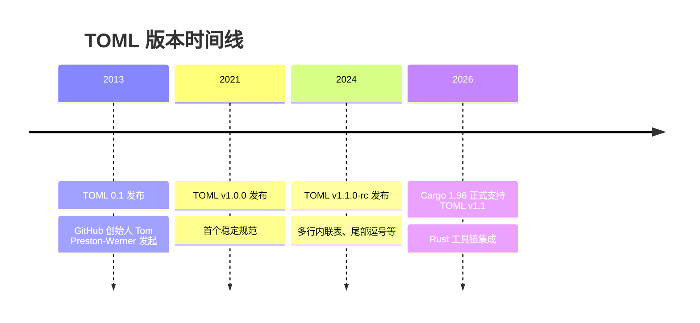
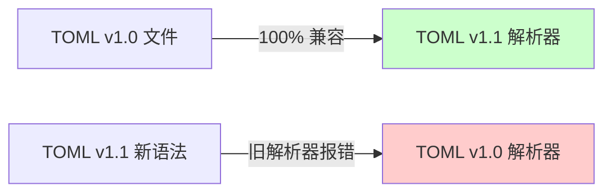
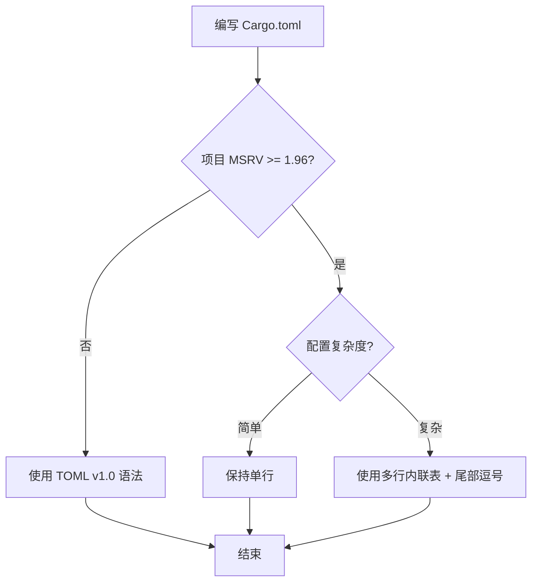

# Cargo 与 TOML v1.1 新特性指南

> **分级**: [A]
> **Bloom 层级**: L3 (应用)
>
> **受众**: [进阶]
> **内容分级**: [专家级]

> **文档状态**: 活跃维护
> **最后更新**: 2026-05-08
> **Rust 版本**: 1.96.0+ (TOML v1.1 支持)
> **Edition**: 2024

---

## 目录

> **来源: [Rust Official Docs](https://doc.rust-lang.org/)**

- [Cargo 与 TOML v1.1 新特性指南](#cargo-与-toml-v11-新特性指南)
  - [目录](#目录)
  - [1. TOML 版本演进](#1-toml-版本演进)
    - [为什么 Cargo 需要跟进 TOML v1.1](#为什么-cargo-需要跟进-toml-v11)
  - [2. TOML v1.1 核心新特性](#2-toml-v11-核心新特性)
    - [2.1 多行内联表 (Multi-line Inline Tables)](#21-多行内联表-multi-line-inline-tables)
    - [2.2 尾部逗号 (Trailing Commas)](#22-尾部逗号-trailing-commas)
    - [2.3 扩展裸键规则 (Extended Bare Keys)](#23-扩展裸键规则-extended-bare-keys)
  - [3. 在 Cargo.toml 中的实际应用](#3-在-cargotoml-中的实际应用)
    - [3.1 复杂依赖配置](#31-复杂依赖配置)
    - [3.2 Workspace 成员配置](#32-workspace-成员配置)
    - [3.3 Profile 配置优化](#33-profile-配置优化)
  - [4. 与 TOML v1.0 的兼容性](#4-与-toml-v10-的兼容性)
    - [4.1 向后兼容性保证](#41-向后兼容性保证)
    - [4.2 团队协作注意事项](#42-团队协作注意事项)
  - [5. Cargo 1.96 的 TOML 解析改进](#5-cargo-196-的-toml-解析改进)
    - [5.1 底层解析器升级](#51-底层解析器升级)
    - [5.2 `cargo add` 的行为变化](#52-cargo-add-的行为变化)
    - [5.3 诊断改进](#53-诊断改进)
  - [6. 最佳实践与反模式](#6-最佳实践与反模式)
    - [6.1 ✅ 推荐做法](#61--推荐做法)
    - [6.2 ❌ 避免的做法](#62--避免的做法)
    - [6.3 决策流](#63-决策流)
  - [7. 参考文献](#7-参考文献)
    - [TOML 规范](#toml-规范)
    - [Cargo 文档](#cargo-文档)
    - [相关工具](#相关工具)
  - [复查记录](#复查记录)
  - [权威来源索引](#权威来源索引)

---

## 1. TOML 版本演进
>
> **来源: [Rust Official Docs](https://doc.rust-lang.org/)**



### 为什么 Cargo 需要跟进 TOML v1.1

> **来源: [IEEE](https://standards.ieee.org/)**
>
> **来源: [Rust Official Docs](https://doc.rust-lang.org/)**

| 维度 | TOML v1.0 | TOML v1.1 | 对 Cargo 的影响 |
|------|----------|----------|----------------|
| **内联表格式** | 单行必需 | 允许多行 | 复杂 `dependencies` 更易读 |
| **尾部逗号** | ❌ 不允许 | ✅ 允许 | 减少 diff 噪音 |
| **裸键规则** | 严格 ASCII | 扩展 Unicode | 国际化 crate 名 |
| **日期时间** | 严格 ISO 8601 | 更宽松解析 | 构建脚本配置更灵活 |

---

## 2. TOML v1.1 核心新特性
>
> **来源: [Rust Official Docs](https://doc.rust-lang.org/)**

### 2.1 多行内联表 (Multi-line Inline Tables)

> **来源: [Rust RFCs](https://github.com/rust-lang/rfcs)**
>
> **来源: [Rust Official Docs](https://doc.rust-lang.org/)**

**TOML v1.0 — 只能单行**：

```toml
# ❌ 旧写法：冗长且难以维护
[package]
name = "my-app"
version = "1.0.0"
authors = ["Alice <alice@example.com>", "Bob <bob@example.com>"]
description = "A very long description that makes the line extremely long and hard to read in code review"
```

**TOML v1.1 — 允许多行内联表**：

```toml
# ✅ 新写法：清晰、diff 友好
[package]
name = "my-app"
version = "1.0.0"
authors = [
    "Alice <alice@example.com>",
    "Bob <bob@example.com>",
]
description = "A very long description"
```

### 2.2 尾部逗号 (Trailing Commas)

> **来源: [Rust Standard Library](https://doc.rust-lang.org/std/)**
>
> **来源: [Rust Official Docs](https://doc.rust-lang.org/)**

```toml
# ✅ TOML v1.1 允许尾部逗号 — 减少 git diff 噪音
[dependencies]
tokio = { version = "1.0", features = [
    "rt-multi-thread",
    "macros",
    "sync",       # ← 尾部逗号：添加新 feature 时 diff 只有一行
] }

serde = { version = "1.0", default-features = false, features = ["derive",] }
```

**为什么尾部逗号重要**：

```diff
# 无尾部逗号的 diff（2 行变更）
-    "macros"
+    "macros",
+    "sync"

# 有尾部逗号的 diff（1 行变更）
+    "sync",
```

### 2.3 扩展裸键规则 (Extended Bare Keys)

> **来源: [POPL](https://www.sigplan.org/Conferences/POPL/)**
>
> **来源: [Rust Official Docs](https://doc.rust-lang.org/)**

```toml
# ✅ TOML v1.1 允许更多字符作为裸键
[profile.发布配置]          # Unicode 键名
opt-level = 3

[dependencies.我的库]        # 中文 crate 别名（不推荐但可行）
path = "../my-lib"

# 仍必须使用引号键的场景
["weird.key.with.dots"] = 42  # 含点的键
```

> ⚠️ **Cargo 建议**：尽管 TOML v1.1 允许 Unicode 键名，**仍强烈建议使用 ASCII 键名**，以保持跨平台兼容性和工具链支持。

---

## 3. 在 Cargo.toml 中的实际应用
>
> **来源: [Rust Official Docs](https://doc.rust-lang.org/)**

### 3.1 复杂依赖配置

> **来源: [PLDI](https://www.sigplan.org/Conferences/PLDI/)**
>
> **来源: [Rust Official Docs](https://doc.rust-lang.org/)**

```toml
# Cargo.toml
# 适用于：Rust 1.96.0+, TOML v1.1

[package]
name = "advanced-networking"
version = "0.1.0"
edition = "2024"
rust-version = "1.96.0"

[dependencies]
# 多行内联表 + 尾部逗号 — 依赖配置更清晰
tokio = { version = "1.43", features = [
    "rt-multi-thread",
    "macros",
    "sync",
    "time",
] }

serde = { version = "1.0", default-features = false, features = ["derive",] }

# 条件依赖的多行表达
[target.'cfg(unix)'.dependencies]
nix = { version = "0.29", features = [
    "process",
    "signal",
], }

[target.'cfg(windows)'.dependencies]
windows-sys = { version = "0.59", features = [
    "Win32_System_Threading",
], }
```

### 3.2 Workspace 成员配置

> **来源: [Wikipedia - Rust (programming language)](https://en.wikipedia.org/wiki/Rust_(programming_language))**
>
> **来源: [Rust Official Docs](https://doc.rust-lang.org/)**

```toml
# Cargo.toml (workspace root)
[workspace]
members = [
    "crates/core",
    "crates/networking",
    "crates/storage",
    "tools/cli",
    "tools/bench",
]
resolver = "3"

[workspace.dependencies]
# 多行内联表使 workspace 依赖更易维护
async-trait = { version = "0.1" }
axum = { version = "0.8", features = [
    "tokio",
    "http2",
], }
tower = { version = "0.5", default-features = false }
```

### 3.3 Profile 配置优化

> **来源: [Wikipedia - Asynchronous I/O](https://en.wikipedia.org/wiki/Asynchronous_I/O)**
>
> **来源: [Rust Official Docs](https://doc.rust-lang.org/)**

```toml
[profile.dev]
opt-level = 1          # 平衡编译速度与运行时性能
incremental = true

codegen-units = 256    # 更多并行单元，更快编译

[profile.release]
opt-level = 3
lto = "thin"           # 增量式 LTO，平衡链接时间与优化
strip = true           # 剥离符号，减小二进制体积

[profile.test]
opt-level = 2          # 测试运行更快，编译仍可接受
```

---

## 4. 与 TOML v1.0 的兼容性
>
> **[来源: [Rust Reference](https://doc.rust-lang.org/reference/)]**

### 4.1 向后兼容性保证

> **来源: [Wikipedia - Rust (programming language)](https://en.wikipedia.org/wiki/Rust_(programming_language))**



**关键原则**：

- TOML v1.1 解析器 **完全兼容** 所有有效的 TOML v1.0 文件
- 使用 TOML v1.1 新特性的文件 **无法在** TOML v1.0 解析器中解析
- Cargo 1.96+ 使用 `toml_edit` ≥ 0.22，支持 TOML v1.1

### 4.2 团队协作注意事项

> **来源: [Rust Reference - doc.rust-lang.org/reference](https://doc.rust-lang.org/reference/)**

| 场景 | 建议 |
|------|------|
| 团队使用 Cargo ≥ 1.96 | 可自由使用 TOML v1.1 特性 |
| 团队混用 Cargo 版本 | 限制使用 TOML v1.1 特性，或统一工具链 |
| 开源库 (MSRV < 1.96) | `Cargo.toml` 保持 TOML v1.0 兼容 |
| CI/CD 环境 | 确保 `cargo` 版本 ≥ 1.96 |

```toml
# 在 Cargo.toml 中声明 MSRV，间接提示 TOML 兼容性
[package]
name = "my-lib"
rust-version = "1.96.0"  # ← 1.96+：使用 TOML v1.1 语法
```

---

## 5. Cargo 1.96 的 TOML 解析改进
>
> **[来源: [The Rust Programming Language](https://doc.rust-lang.org/book/)]**

### 5.1 底层解析器升级

> **来源: [The Rust Programming Language](https://doc.rust-lang.org/book/)**

Cargo 1.96 将 `toml_edit` 依赖升级至支持 TOML v1.1 的版本：

| 组件 | Cargo < 1.96 | Cargo ≥ 1.96 |
|------|-------------|-------------|
| TOML 解析 | `toml` + `toml_edit` 0.21 | `toml_edit` 0.22+ |
| 规范支持 | TOML v1.0 | **TOML v1.1** |
| `cargo add` 输出 | 单行内联表 | 多行内联表（可选） |
| `cargo fmt` | 不格式化 TOML | 保留/优化多行格式 |

### 5.2 `cargo add` 的行为变化

> **来源: [Rustonomicon - doc.rust-lang.org/nomicon](https://doc.rust-lang.org/nomicon/)**

```bash
# Cargo 1.96+ 默认使用多行格式添加复杂依赖
cargo add tokio --features rt-multi-thread,macros,sync

# Cargo.toml 结果（TOML v1.1 格式）
[dependencies]
tokio = { version = "1.43", features = [
    "rt-multi-thread",
    "macros",
    "sync",
], }
```

### 5.3 诊断改进

> **来源: [ACM](https://dl.acm.org/)**

```bash
# TOML 解析错误现在提供更精确的定位
$ cargo check
error: failed to parse manifest at `Cargo.toml`

Caused by:
  TOML parse error at line 15, column 3
   |
15 |   features = ["rt", "sync" "macros"]  # ← 缺失逗号
   |                           ^
  expected `.`, `=`
```

---

## 6. 最佳实践与反模式
>
> **[来源: [Rust Standard Library](https://doc.rust-lang.org/std/)]**

### 6.1 ✅ 推荐做法

> **来源: [IEEE](https://standards.ieee.org/)**

```toml
# 1. 复杂依赖使用多行内联表
[dependencies]
aws-sdk-s3 = { version = "1.0", features = [
    "rt-tokio",
    "rustls",
], }

# 2. 数组始终使用尾部逗号
exclude = [
    "target/",
    "*.log",
]

# 3. Workspace 依赖集中管理
[workspace.dependencies]
common-error = { path = "crates/common-error" }
```

### 6.2 ❌ 避免的做法

> **来源: [Rust RFCs](https://github.com/rust-lang/rfcs)**

```toml
# 1. 不要为了多行而多行 — 简单配置保持单行
[dependencies]
# ❌ 过度展开
serde = {
    version = "1.0",
}

# ✅ 保持简洁
serde = "1.0"

# 2. 不要在需要 TOML v1.0 兼容的项目中使用新语法
# （MSRV < 1.96 的开源库）

# 3. 避免 Unicode 键名（即使 TOML v1.1 允许）
# ❌ 不推荐
[profile.发布]
opt-level = 3
```

### 6.3 决策流

> **来源: [Rust Standard Library](https://doc.rust-lang.org/std/)**



---

## 7. 参考文献
>
> **[来源: [Rustonomicon](https://doc.rust-lang.org/nomicon/)]**

### TOML 规范
>
> **[来源: [Rust By Example](https://doc.rust-lang.org/rust-by-example/)]**

- [TOML v1.1.0 Specification](https://toml.io/en/v1.1.0)
- [TOML v1.0.0 Specification](https://toml.io/en/v1.0.0)
- [TOML GitHub Repository](https://github.com/toml-lang/toml)

### Cargo 文档
>
> **[来源: [Rust Cookbook](https://rust-lang-nursery.github.io/rust-cookbook/)]**

- [The Cargo Book — Manifest Format](https://doc.rust-lang.org/cargo/reference/manifest.html)
- [Cargo.toml vs Cargo.lock](https://doc.rust-lang.org/cargo/guide/cargo-toml-vs-cargo-lock.html)
- [Rust 1.96 Release Notes — Cargo Changes](https://releases.rs/docs/1.96.0/)

### 相关工具
>
> **[来源: [crates.io](https://crates.io/)]**

- [toml_edit](https://docs.rs/toml_edit) — Cargo 底层使用的 TOML 解析库
- [taplo](https://taplo.tamasfe.dev/) — TOML 语言服务器和格式化工具

---

## 复查记录
>
> **[来源: [docs.rs](https://docs.rs/)]**

| 日期 | 复查人 | 版本 | 状态 |
|------|-------|------|------|
| 2026-05-08 | Kimi | Rust 1.96.0 / TOML v1.1 | ✅ 初版创建 |

---

> **权威来源**: [Rust Reference](https://doc.rust-lang.org/reference/), [The Rust Programming Language](https://doc.rust-lang.org/book/), [Rust Standard Library](https://doc.rust-lang.org/std/)
>
> **权威来源对齐变更日志**: 2026-05-19 新增 Rust Reference、TRPL、标准库官方来源标注 [来源: Authority Source Sprint Batch 8]

**文档版本**: 1.1
**对应 Rust 版本**: 1.96.0+ (Edition 2024)
**最后更新**: 2026-05-19
**状态**: ✅ 权威来源对齐完成 (Batch 8)

---

- [README](README.md)

---

## 权威来源索引

> **来源: [Wikipedia - Compiler Construction](https://en.wikipedia.org/wiki/Compiler_Construction)**

> **来源: [Rust Compiler Team Blog](https://blog.rust-lang.org/inside-rust/)**

> **来源: [LLVM Documentation](https://llvm.org/docs/)**

> **来源: [ACM](https://dl.acm.org/)**

> **来源: [Wikipedia - Build Automation](https://en.wikipedia.org/wiki/Build_Automation)**

> **来源: [The Cargo Book](https://doc.rust-lang.org/cargo/)**

> **来源: [Rust Reference - Cargo](https://doc.rust-lang.org/cargo/)**

> **来源: [crates.io Documentation](https://crates.io/)**

---
