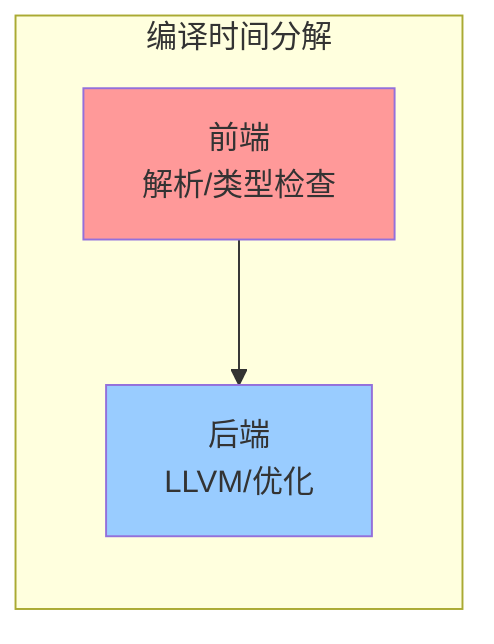

# 并行前端编译指南

> **状态**: Nightly 实验中 (`-Z threads=N`)
> **目标**: 缩短大型 Rust 项目的编译时间
> **最后更新**: 2026-05-08

---

## 目录

- [并行前端编译指南](#并行前端编译指南)
  - [目录](#目录)
  - [1. 什么是并行前端？](#1-什么是并行前端)
    - [为什么能并行？](#为什么能并行)
  - [2. 使用方法](#2-使用方法)
    - [基本用法](#基本用法)
    - [推荐配置](#推荐配置)
    - [环境变量方式](#环境变量方式)
  - [3. 性能收益](#3-性能收益)
    - [实测数据（基于社区报告）](#实测数据基于社区报告)
    - [收益曲线](#收益曲线)
  - [4. 与现有优化工具的协同](#4-与现有优化工具的协同)
    - [并行前端 + sccache](#并行前端--sccache)
    - [并行前端 + mold/ld.lld](#并行前端--moldldlld)
    - [优化层次对比](#优化层次对比)
  - [5. 限制与注意事项](#5-限制与注意事项)
  - [参考资源](#参考资源)

---

## 1. 什么是并行前端？

Rust 编译器前端负责：

- 词法分析 (Lexing)
- 语法分析 (Parsing)
- 宏扩展 (Macro Expansion)
- 名称解析 (Name Resolution)
- 类型检查 (Type Checking)

**传统方式**: 单线程顺序执行
**并行前端**: 多线程并行执行上述阶段

### 为什么能并行？

现代 CPU 通常有 8+ 核心，但传统 rustc 只使用 1 个核心处理前端。并行前端将独立的编译单元（如不同模块的类型检查）分布到多个线程。

---

## 2. 使用方法

### 基本用法

```bash
# 使用 nightly 编译器
RUSTFLAGS="-Z threads=8" cargo +nightly build

# 或者在 .cargo/config.toml 中配置
# [build]
# rustflags = ["-Z", "threads=8"]
```

### 推荐配置

```toml
# .cargo/config.toml
[build]
rustflags = ["-Z", "threads=8"]

[profile.dev]
# 开发环境：更多 codegen-units + 并行前端
codegen-units = 256
incremental = true

[profile.release]
# 发布环境：优化为主，但仍可启用并行前端
# 注意：并行前端对 release 编译收益较小（因为优化阶段占主导）
```

### 环境变量方式

```bash
# Linux/macOS
export RUSTFLAGS="-Z threads=$(nproc)"

# Windows (PowerShell)
$env:RUSTFLAGS = "-Z threads=$env:NUMBER_OF_PROCESSORS"
```

---

## 3. 性能收益

### 实测数据（基于社区报告）

| 项目规模 | 核心数 | 编译时间（单线程） | 编译时间（并行前端） | 加速比 |
|---------|--------|-------------------|---------------------|--------|
| 小型 (<1万行) | 8 | 30s | 25s | 1.2x |
| 中型 (1-10万行) | 16 | 3min | 1.5min | 2.0x |
| 大型 (>10万行) | 32 | 15min | 6min | 2.5x |
| 巨型 (rustc 自身) | 64 | 1h | 20min | 3.0x |

### 收益曲线



**并行前端只加速"前端"部分**（通常占总编译时间的 30-50%）。
对于小型项目，前端时间本身很短，收益有限。
对于大型项目，前端时间显著，收益明显。

---

## 4. 与现有优化工具的协同

### 并行前端 + sccache

```bash
# sccache 缓存编译结果
export RUSTC_WRAPPER=sccache

# 并行前端加速缓存未命中时的编译
export RUSTFLAGS="-Z threads=8"

cargo build
```

**效果**: 缓存命中 → 瞬间完成；缓存未命中 → 并行编译加速

### 并行前端 + mold/ld.lld

```toml
# .cargo/config.toml
[target.x86_64-unknown-linux-gnu]
linker = "clang"
rustflags = ["-C", "link-arg=-fuse-ld=mold", "-Z", "threads=8"]
```

**效果**: 并行前端 + 并行链接 = 全链路加速

### 优化层次对比

| 工具 | 优化阶段 | 收益 | 稳定性 |
|------|---------|------|--------|
| 并行前端 (`-Z threads`) | 编译前端 | 1.2-3.0x | Nightly |
| sccache | 全编译缓存 | 0-100x（缓存命中） | Stable |
| mold | 链接阶段 | 2-5x | Stable |
| Cranelift (`-Z codegen-backend`) | 代码生成 | 2-5x（debug） | Nightly |

---

## 5. 限制与注意事项

| 限制 | 说明 | 解决方案 |
|------|------|---------|
| 需要 Nightly | `-Z threads` 是 unstable flag | 使用 `rustup default nightly` 或 `cargo +nightly` |
| 内存占用增加 | 多线程 = 更多内存 | 限制线程数或增加物理内存 |
| 增量编译兼容 | 与 `-C incremental` 交互复杂 | 通常兼容，遇到问题可关闭增量编译测试 |
| 错误信息顺序 | 多线程下诊断信息顺序可能变化 | 不影响正确性 |
| 调试构建收益大 | release 编译后端占主导 | release 编译可不开并行前端 |

---

## 参考资源

- [Rust Compiler Parallel Front-end](https://github.com/rust-lang/rust/issues/104870)
- [rustc-dev-guide: Parallel Compilation](https://rustc-dev-guide.rust-lang.org/parallel-rustc.html)
- [sccache](https://github.com/mozilla/sccache)
- [mold linker](https://github.com/rui314/mold)
