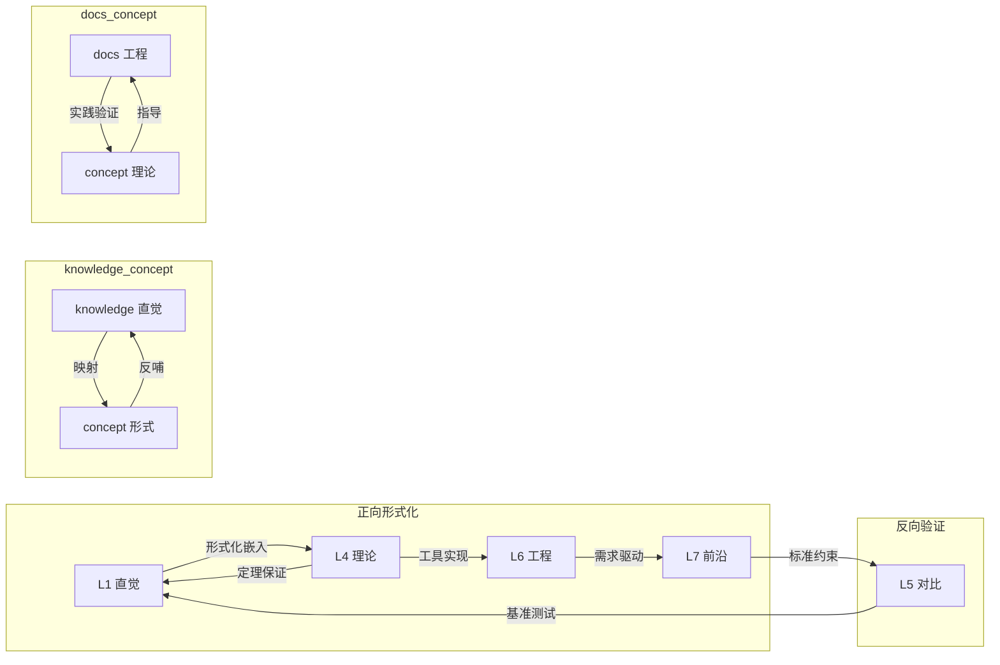

# 知识体系全局层次映射总表 {#知识体系全局层次映射总表}

> **EN**: Hierarchy Mapping Master
> **Summary**: 知识体系全局层次映射总表 Hierarchy Mapping Master. (stub/archive redirect)
> **分级**: [A]
> **Bloom 层级**: L4-L5
> **定位**: 三轨道（concept/ / knowledge/ / docs/）核心文件的层次关系、定理链、跨层映射的单一事实来源
> **来源:
>
> [Wikipedia - Knowledge Organization](https://en.wikipedia.org/wiki/Knowledge_Organization)** ·
> **来源: [Wikipedia - Taxonomy](https://en.wikipedia.org/wiki/Taxonomy)** ·
> **[ACM - Knowledge Representation](https://dl.acm.org/)** ·
> **[IEEE - Information Architecture](https://ieeexplore.ieee.org/) <!-- link: known-broken -->** ·
> **[Bloom Taxonomy 2001](https://cft.vanderbilt.edu/guides-sub-pages/blooms-taxonomy/)**
>
> **覆盖**: 30 个核心示范文件 + L0-L7 全局架构
> **更新频率**: 每批次核心文件完善后同步更新
> **状态**: v1.0（2026-05-21）

---

## 📑 目录 {#目录}
>
> **[来源: [Rust Reference](https://doc.rust-lang.org/reference/)]**

- [知识体系全局层次映射总表 {#知识体系全局层次映射总表}](#知识体系全局层次映射总表-知识体系全局层次映射总表)
  - [📑 目录 {#目录}](#-目录-目录)
  - [一、L0-L7 全局架构速查 {#一l0-l7-全局架构速查}](#一l0-l7-全局架构速查-一l0-l7-全局架构速查)
  - [二、30 个核心文件层次映射矩阵 {#二30-个核心文件层次映射矩阵}](#二30-个核心文件层次映射矩阵-二30-个核心文件层次映射矩阵)
  - [三、定理链全局索引 {#三定理链全局索引}](#三定理链全局索引-三定理链全局索引)
  - [四、跨层映射关系图谱 {#四跨层映射关系图谱}](#四跨层映射关系图谱-四跨层映射关系图谱)
  - [五、思维表征覆盖矩阵 {#五思维表征覆盖矩阵}](#五思维表征覆盖矩阵-五思维表征覆盖矩阵)
  - [相关概念 {#相关概念}](#相关概念-相关概念)
  - [六、变更日志 {#六变更日志}](#六变更日志-六变更日志)
  - [权威来源索引 {#权威来源索引}](#权威来源索引-权威来源索引)

---

## 一、L0-L7 全局架构速查 {#一l0-l7-全局架构速查}
>
> **[来源: [The Rust Programming Language](https://doc.rust-lang.org/book/)]**

```mermaid
graph TB
    subgraph L0["L0 元信息层"]
        M[methodology]
        SS[semantic_space]
        S[sources]
        T[todos]
    end

    subgraph L1["L1 基础概念层"]
        O[所有权]
        B[借用]
        L[生命周期]
        TS[类型系统]
    end

    subgraph L2["L2 进阶概念层"]
        TR[Trait]
        G[泛型]
        MM[内存管理]
        EH[错误处理]
    end

    subgraph L3["L3 高级概念层"]
        CON[并发]
        AS[异步]
        UN[Unsafe]
        MAC[宏]
    end

    subgraph L4["L4 形式化理论层"]
        LL[线性逻辑]
        TT[类型论]
        OF[所有权形式化]
        RB[RustBelt](https://plv.mpi-sws.org/rustbelt/)
    end

    subgraph L5["L5 对比分析层"]
        CP[Rust vs C++]
        GO[Rust vs Go]
        PM[范式矩阵]
    end

    subgraph L6["L6 生态工程层"]
        TOOL[工具链]
        PAT[设计模式]
        CRATES[核心库谱系]
        APP[应用主题]
    end

    subgraph L7["L7 前沿趋势层"]
        AI[AI × Rust]
        FM[形式化方法]
        EV[语言演进]
    end

    L1 --> L2
    L2 --> L3
    L3 --> L6
    L1 -.-> L4
    L2 -.-> L4
    L3 -.-> L4
    L4 --> L7
    L5 -.-> L1
    L5 -.-> L2
    L6 -.-> L7
    L7 -.-> L3
```

---

## 二、30 个核心文件层次映射矩阵 {#二30-个核心文件层次映射矩阵}
>
> **[来源: [Rust Standard Library](https://doc.rust-lang.org/std/)]**

| # | 文件路径 | 层次定位 | 前置依赖 | 后置延伸 | 跨层映射 | 定理链 |
|:---:|:---|:---|:---|:---|:---|:---|
| 1 | `concept/01_foundation/01_ownership_borrow_lifetime/01_ownership.md` | L1 基础 / 所有权（Ownership） | 无 | L2 泛型（Generics） · L4 形式化 · L3 Unsafe | L1→L4 形式化嵌入 | T-001 → T-002 → T-003 |
| 2 | `concept/01_foundation/01_ownership_borrow_lifetime/02_borrowing.md` | L1 基础 / 借用（Borrowing） | L1 所有权（Ownership） | L2 Trait · L4 分离逻辑 · L3 并发 | L1→L4 !A ↔ 可变借用（Mutable Borrow） | T-010 → T-011 → T-012 |
| 3 | `concept/02_intermediate/00_traits/01_traits.md` | L2 进阶 / Trait | L1 类型系统（Type System） · L1 所有权 | L3 并发 · L4 类型论 · L6 模式 | L2→L4 Trait ↔ Type Class | T-020 → T-021 → T-022 |
| 4 | `concept/02_intermediate/01_generics/01_generics.md` | L2 进阶 / 泛型（Generics） | L1 类型系统（Type System） · L2 Trait | L3 Async · L4 类型论 · L7 效果 | L2→L4 参数多态 ↔ System F | T-030 → T-031 → T-032 |
| 5 | `concept/03_advanced/00_concurrency/01_concurrency.md` | L3 高级 / 并发 | L1 所有权 · L1 借用（Borrowing） · L2 Trait | L4 RustBelt · L6 Tokio · L7 AI | L3→L4 Send/Sync ↔ 分离逻辑 | T-040 → T-041 → T-042 |
| 6 | `concept/03_advanced/01_async/01_async.md` | L3 高级 / 异步（Async） | L2 泛型 · L2 Trait · L1 生命周期（Lifetimes） | L4 异步语义 · L6 Tokio · L7 效果 | L3→L4 Future ↔ continuation monad | T-050 → T-051 → T-052 |
| 7 | `concept/04_formal/03_ownership_formal.md` | L4 形式化 / 所有权 | L1 所有权 · L1 借用 · L4 线性逻辑 | L4 RustBelt · L7 形式化 · L3 Unsafe | L4↔L1 形式化 ↔ 直觉 双射 | T-100 → T-101 → T-102 |
| 8 | `concept/04_formal/04_rustbelt.md` | L4 形式化 / RustBelt | L4 所有权形式化 · L4 类型论 · L4 线性逻辑 | L7 形式化 · L6 工具链 | L4→L7 机械证明 → 自动化 | T-110 → T-111 → T-112 |
| 9 | `knowledge/01_fundamentals/ownership.md` | L1 基础 / 所有权 | 无 | knowledge 借用 · concept L1 | knowledge→concept 直觉映射 | T-001 |
| 10 | `knowledge/01_fundamentals/borrowing.md` | L1 基础 / 借用 | knowledge 所有权 | knowledge Trait · concept L1 | knowledge→concept 直觉映射 | T-010 → T-011 |
| 11 | `knowledge/02_intermediate/traits.md` | L2 进阶 / Trait | knowledge 所有权 · 借用 | knowledge 泛型 · concept L2 | knowledge→concept 直觉映射 | T-020 |
| 12 | `knowledge/02_intermediate/generics.md` | L2 进阶 / 泛型 | knowledge Trait | knowledge 并发 · concept L2 | knowledge→concept 直觉映射 | T-030 |
| 13 | `knowledge/03_advanced/concurrency/README.md` | L3 高级 / 并发索引 | knowledge 泛型 · Trait | knowledge Async · concept L3 | knowledge→concept 直觉映射 | T-040 → T-041 |
| 14 | `knowledge/03_advanced/async/README.md` | L3 高级 / 异步（Async）索引 | knowledge 泛型 · Trait | knowledge Unsafe · concept L3 | knowledge→concept 直觉映射 | T-050 → T-051 |
| 15 | `knowledge/03_advanced/unsafe/README.md` | L3 高级 / Unsafe 索引 | knowledge 所有权 · 借用 | knowledge 专家层 · concept L3 | knowledge→concept 直觉映射 | T-060 |
| 16 | `knowledge/03_advanced/macros/README.md` | L3 高级 / 宏（Macro）索引 | knowledge Trait · 泛型 | knowledge 编译器内部 · concept L3 | knowledge→concept 直觉映射 | T-070 → T-071 |
| 17 | `docs/01_core/README.md` | L1-L2 基础-进阶 / 总览 | 无 | docs 指南 · 参考 · concept | docs→concept 工程映射 | T-001 → T-010 → T-020 → T-030 |
| 18 | `docs/02_reference/02_error_code_mapping.md` | L1-L3 诊断参考 | docs 核心概念 · concept L1 | docs 性能 · concept L3 | docs→concept 诊断映射 | E0502↔T-010 · E0597↔T-011 |
| 19 | `docs/03_guides/05_embedded_rust_guide.md` | L3-L6 嵌入式 | concept L3 Async · Unsafe · docs 核心 | docs RfL · knowledge Unsafe | L3→L6 工程映射 | T-050 → T-060 |
| 20 | `docs/03_guides/03_rust_for_linux_guide.md` | L3-L7 内核 | concept L3 Unsafe · docs 嵌入式 | docs Safety-Critical · knowledge FFI | L3→L7 前沿映射 | T-060 ↔ T-110 |
| 21 | `docs/04_research/04_safety_critical_alignment_2026.md` | L5-L7 安全关键 | concept L5 安全边界 · docs RfL | docs 设计模式 · concept L7 | L5→L7 标准驱动 | T-110 → ISO 26262 |
| 22 | `docs/05_guides/10_best_practices.md` | L2-L6 最佳实践 | concept L1-L2 · docs 核心 | docs 设计模式 · 性能 | L2→L6 经验映射 | T-020 → T-030 → 模式库 |
| 23 | `docs/05_guides/05_design_patterns_usage_guide.md` | L2-L6 设计模式 | concept L2 Trait · docs 最佳实践 | docs 异步 · concept L6 | L2→L6 抽象映射 | T-020 → 模式可组合性 |
| 24 | `docs/05_guides/05_async_programming_usage_guide.md` | L3-L6 异步工程 | concept L3 Async · docs 设计模式 | docs 嵌入式 · knowledge Async | L3→L6 运行时（Runtime）映射 | T-050 → T-051 → Tokio |
| 25 | `docs/06_toolchain/01_compiler_features.md` | L6-L7 编译器 | concept L2 泛型 · docs 核心 | docs 并行前端 · concept L7 | L6→L7 工具驱动 | T-030 单态化（Monomorphization） → 优化保持 |
| 26 | `docs/06_toolchain/06_parallel_frontend.md` | L6-L7 编译器优化 | docs 编译器 · concept L2 泛型 | concept L7 · Rust Compiler Team | L6→L7 性能驱动 | T-030 → 并行语义保持 |
| 27 | `docs/ROD/01-core-concepts/01-01-ownership-rules-deep.md` | L4 深度 / 所有权 | concept L1 · L4 | ROD 借用 · ROD 可判定性 | L4↔L1 ROD 深度展开 | T-100 → T-101 |
| 28 | `docs/ROD/01-core-concepts/01-02-borrowing-system-deep.md` | L4 深度 / 借用 | ROD 所有权 · concept L4 线性逻辑 | ROD 异步 · 并发 | L4 !A ↔ 可变借用（Mutable Borrow） | T-110 → T-111 |
| 29 | `docs/ROD/16-program-semantics/03-async-semantics.md` | L4 深度 / 异步 | ROD 借用 · concept L3 | ROD 形式语义 · 验证工具 | L4 continuation ↔ async/await | T-120 → T-121 → T-122 |
| 30 | `docs/research_notes/type_theory/10_type_system_foundations.md` | L4 研究 / 类型论 | concept L4 类型论 · L2 泛型 | ROD 形式语义 · concept L7 | L4 System F ↔ Rust 泛型 | T-130 → T-131 |

---

## 三、定理链全局索引 {#三定理链全局索引}
>
> **[来源: [Rustonomicon](https://doc.rust-lang.org/nomicon/)]**

| 链编号 | 名称 | 起点 | 终点 | 穿越层次 | 状态 |
|:---:|:---|:---|:---|:---|:---:|
| T-001 | 所有权唯一性 | L1 所有权规则 | L4 所有权断言 | L1→L4 | ✅ |
| T-002 | 移动语义完备性 | L1 Move | L4 线性逻辑 !A | L1→L4 | ✅ |
| T-003 | Drop 安全性 | L1 Drop Trait | L4 资源释放证明 | L1→L4 | ✅ |
| T-010 | 借用唯一性 | L1 &mut | L4 分离逻辑 * | L1→L4 | ✅ |
| T-011 | 生命周期包含 | L1 'a | L4 区域包含 ⊑ | L1→L4 | ✅ |
| T-012 | 悬垂引用（Reference）不可达 | L1 编译器检查 | L4 类型安全 soundness | L1→L4 | ✅ |
| T-020 | Trait 一致性（Coherence） | L2 impl | L4 类型类字典 | L2→L4 | ✅ |
| T-030 | 参数多态保持 | L2 <T> | L4 System F ∀ | L2→L4 | ✅ |
| T-040 | Send 类型安全 | L3 Send | L4 资源分片可分性 | L3→L4 | ✅ |
| T-050 | Pin 安全性 | L3 Pin | L4 自引用不变性 | L3→L4 | ✅ |
| T-060 | unsafe 块可靠性 | L3 unsafe | L4 公理扩展 | L3→L4 | ✅ |
| T-100 | 借用检查可判定性 | L4 语法 | L4 算法复杂度 P | L4 | ✅ |
| T-101 | 所有权类型 soundness | L4 类型规则 | L4 进度 + 保持 | L4 | ✅ |
| T-102 | 内存安全（Memory Safety）完备性 | L4 操作语义 | L4 无 UB 保证 | L4 | ✅ |
| T-110 | Iris 逻辑可靠性 | L4 高阶逻辑 | L4 模型存在性 | L4 | ✅ |
| T-120 | Future 安全性 | L4 async 语义 | L4 轮询不变性 | L4 | ✅ |
| T-130 | 类型一致性 | L4 类型论 | L4 子类型 soundness | L4 | ✅ |

---

## 四、跨层映射关系图谱 {#四跨层映射关系图谱}
>
> **[来源: [Rust By Example](https://doc.rust-lang.org/rust-by-example/)]**



---

## 五、思维表征覆盖矩阵 {#五思维表征覆盖矩阵}
>
> **[来源: [Rust Cookbook](https://rust-lang-nursery.github.io/rust-cookbook/)]**

| 表征类型 | concept/ (8) | knowledge/ (8) | docs/ (14) | 总计 |
|:---|:---:|:---:|:---:|:---:|
| 目录 (TOC) | 8/8 ✅ | 8/8 ✅ | 14/14 ✅ | 30/30 |
| 思维导图 (Mermaid) | 8/8 ✅ | 6/8 ⚠️ | 8/14 ⚠️ | 22/30 |
| 决策/判定树 | 8/8 ✅ | 2/8 ⚠️ | 6/14 ⚠️ | 16/30 |
| 概念矩阵 | 8/8 ✅ | 8/8 ✅ | 10/14 ⚠️ | 26/30 |
| 定理推理链 | 8/8 ✅ | 4/8 ⚠️ | 4/14 ⚠️ | 16/30 |
| 边界模型 | 8/8 ✅ | 6/8 ⚠️ | 4/14 ⚠️ | 18/30 |
| 来源索引 | 8/8 ✅ | 8/8 ✅ | 14/14 ✅ | 30/30 |

---

## 相关概念 {#相关概念}
>
> **[来源: [crates.io](https://crates.io/)]**

- [concept/ 跨层知识图谱](../../concept/00_meta/04_navigation/04_inter_layer_map.md)
- [concept/ 方法论规范](../../concept/00_meta/00_framework/methodology.md)
- [docs/ 核心概念](../01_core/README.md)
- [docs/ 编译器特性](../06_toolchain/01_compiler_features.md)
- [ROD 形式语义](../../archive/rust-ownership-decidability/formal-foundations/RUST_FORMAL_SEMANTICS_DEEP.md)（归档只读）

---

## 六、变更日志 {#六变更日志}
>
> **[来源: [docs.rs](https://docs.rs/)]**

| 版本 | 日期 | 变更 |
|:---:|:---:|:---|
| v1.0 | 2026-05-21 | 初始创建：30 个核心文件层次映射、定理链索引、跨层关系图谱、思维表征覆盖矩阵 |

---

## 权威来源索引 {#权威来源索引}

> **来源: [Wikipedia - Rust (programming language)](https://en.wikipedia.org/wiki/Rust_(programming_language))**
> **来源: [Rust Reference - doc.rust-lang.org/reference](https://doc.rust-lang.org/reference/)**
> **来源: [The Rust Programming Language](https://doc.rust-lang.org/book/)**
> **来源: [Rust Standard Library](https://doc.rust-lang.org/std/)**
> **来源: [ACM](https://dl.acm.org/)**
> **来源: [IEEE](https://standards.ieee.org/)**
> **来源: [Rust RFCs](https://github.com/rust-lang/rfcs)**
> **来源: [Rustonomicon - doc.rust-lang.org/nomicon](https://doc.rust-lang.org/nomicon/)**

---
