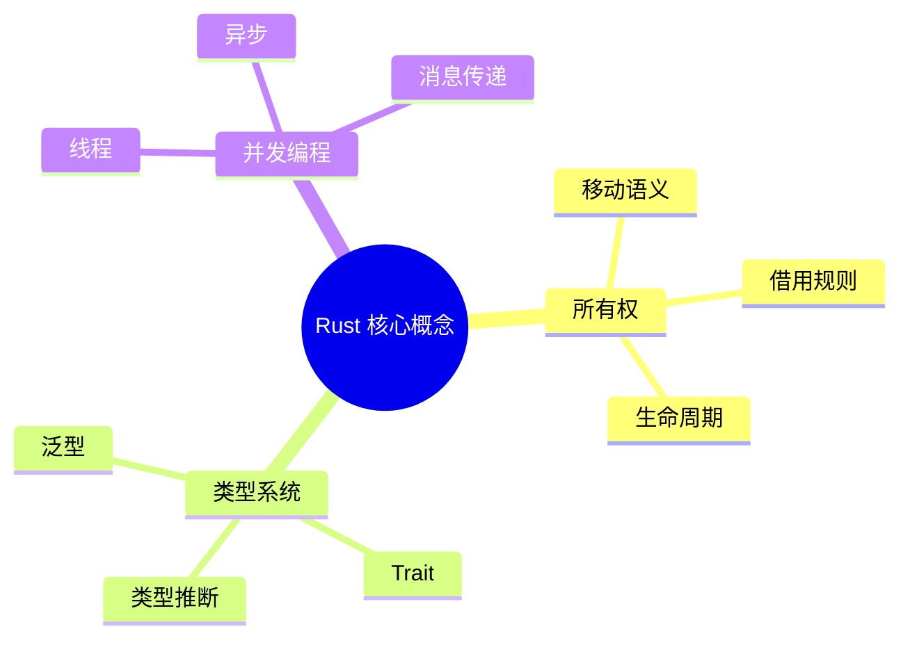
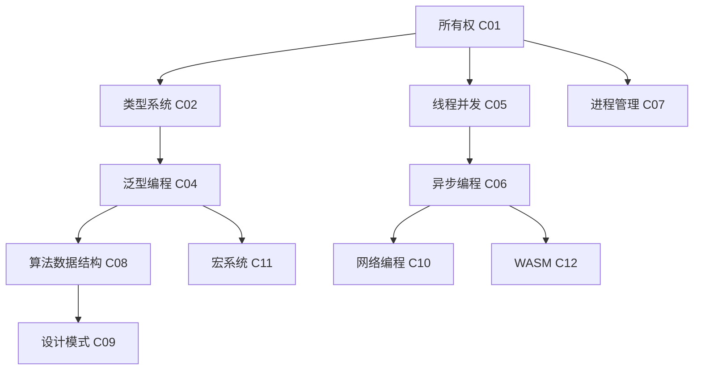

# Rust 知识结构框架文档

> **创建日期**: 2025-12-11
> **最后更新**: 2026-02-15
> **Rust 版本**: 1.93.0+ (Edition 2024)
> **状态**: ✅ 已完成
> **最后对照 releases.rs**: 2026-02-12

---

## 📋 目录

- [Rust 知识结构框架文档](#rust-知识结构框架文档)
  - [📋 目录](#-目录)
  - [🎯 文档概述](#-文档概述)
  - [代码示例](#代码示例)
    - [知识结构建模工具](#知识结构建模工具)
    - [多维矩阵生成器](#多维矩阵生成器)
    - [思维导图文本生成器](#思维导图文本生成器)
  - [形式化链接](#形式化链接)
    - [研究笔记关联](#研究笔记关联)
    - [实施场景](#实施场景)
  - [📐 知识结构体系](#-知识结构体系)
    - [1. 概念定义层](#1-概念定义层)
      - [定义结构模板](#定义结构模板)
      - [示例：所有权（Ownership）](#示例所有权ownership)
    - [2. 属性特征层](#2-属性特征层)
      - [属性结构模板](#属性结构模板)
    - [3. 关系连接层](#3-关系连接层)
      - [关系类型](#关系类型)
      - [关系表示](#关系表示)
    - [4. 解释论证层](#4-解释论证层)
      - [论证结构](#论证结构)
    - [5. 形式证明层](#5-形式证明层)
      - [证明结构](#证明结构)
  - [🗺️ 思维表征方式](#️-思维表征方式)
    - [1. 思维导图](#1-思维导图)
      - [思维导图结构](#思维导图结构)
      - [文本思维导图](#文本思维导图)
    - [2. 多维概念矩阵](#2-多维概念矩阵)
      - [矩阵结构模板](#矩阵结构模板)
      - [示例：同步原语对比矩阵](#示例同步原语对比矩阵)
    - [3. 决策图网](#3-决策图网)
    - [4. 证明图网](#4-证明图网)
    - [5. 知识图谱](#5-知识图谱)
      - [知识图谱结构](#知识图谱结构)
      - [示例知识图谱片段](#示例知识图谱片段)
  - [📊 模块知识结构](#-模块知识结构)
    - [1. C01: 所有权与借用](#1-c01-所有权与借用)
      - [核心概念](#核心概念)
      - [知识结构图](#知识结构图)
    - [2. C02: 类型系统](#2-c02-类型系统)
      - [核心概念](#核心概念-1)
    - [3. C05: 线程与并发](#3-c05-线程与并发)
      - [核心概念](#核心概念-2)
    - [4. C06: 异步编程](#4-c06-异步编程)
      - [核心概念](#核心概念-3)
    - [5. C07: 进程管理](#5-c07-进程管理)
      - [核心概念](#核心概念-4)
    - [6. C08: 算法与数据结构](#6-c08-算法与数据结构)
      - [核心概念](#核心概念-5)
    - [7. C09: 设计模式](#7-c09-设计模式)
      - [核心概念](#核心概念-6)
    - [8. C10: 网络编程](#8-c10-网络编程)
      - [核心概念](#核心概念-7)
    - [9. C11: 宏系统](#9-c11-宏系统)
      - [核心概念](#核心概念-8)
    - [10. C12: WASM](#10-c12-wasm)
      - [核心概念](#核心概念-9)
  - [🔗 知识关联网络](#-知识关联网络)
    - [跨模块关联](#跨模块关联)
    - [知识依赖图](#知识依赖图)
  - [📚 相关文档](#-相关文档)

---

## 🎯 文档概述

本文档建立 Rust 学习项目的知识结构框架，系统化梳理技术主题的内容和知识结构，包括：

1. **概念定义** - 核心概念的准确定义
2. **属性特征** - 概念的关键属性和特征
3. **关系连接** - 概念之间的关联关系
4. **解释论证** - 概念的解释和论证过程
5. **形式证明** - 形式化的证明结构

通过多种思维表征方式（思维导图、多维矩阵、决策图网、证明图网等），构建完整的知识体系。

---

## 代码示例

### 知识结构建模工具

```rust
//! 知识结构框架的 Rust 实现
use std::collections::HashMap;

/// 概念定义层
#[derive(Debug, Clone)]
struct Concept {
    name: String,
    definition: String,
    concept_type: ConceptType,
    category: String,
    rust_version: String,
    related_concepts: Vec<String>,
}

#[derive(Debug, Clone)]
enum ConceptType {
    Basic,      // 基础概念
    Composite,  // 复合概念
    Abstract,   // 抽象概念
}

impl Concept {
    fn new(name: &str, definition: &str, category: &str) -> Self {
        Self {
            name: name.to_string(),
            definition: definition.to_string(),
            concept_type: ConceptType::Basic,
            category: category.to_string(),
            rust_version: "1.0.0".to_string(),
            related_concepts: Vec::new(),
        }
    }

    fn with_version(mut self, version: &str) -> Self {
        self.rust_version = version.to_string();
        self
    }

    fn relates_to(mut self, concept: &str) -> Self {
        self.related_concepts.push(concept.to_string());
        self
    }
}

/// 知识图谱构建器
struct KnowledgeGraph {
    concepts: HashMap<String, Concept>,
    relations: Vec<(String, RelationType, String)>,
}

#[derive(Debug)]
enum RelationType {
    Inheritance,  // is-a
    Composition,  // has-a
    Dependency,   // depends-on
    Implementation, // implements
    Association,  // related-to
}

impl KnowledgeGraph {
    fn new() -> Self {
        Self {
            concepts: HashMap::new(),
            relations: Vec::new(),
        }
    }

    fn add_concept(&mut self, concept: Concept) {
        self.concepts.insert(concept.name.clone(), concept);
    }

    fn add_relation(&mut self, from: &str, relation: RelationType, to: &str) {
        self.relations.push((from.to_string(), relation, to.to_string()));
    }

    fn get_related(&self, concept_name: &str) -> Vec<&String> {
        self.relations.iter()
            .filter(|(from, _, to)| from == concept_name || to == concept_name)
            .map(|(_, _, to)| to)
            .collect()
    }
}

fn main() {
    let mut graph = KnowledgeGraph::new();

    // 添加所有权相关概念
    let ownership = Concept::new(
        "Ownership",
        "每个值都有一个所有者，值在所有者离开作用域时被释放",
        "内存管理"
    ).with_version("1.0.0")
     .relates_to("Borrowing")
     .relates_to("Lifetime");

    let borrowing = Concept::new(
        "Borrowing",
        "通过引用访问值而不获取所有权",
        "内存管理"
    ).relates_to("Ownership");

    graph.add_concept(ownership);
    graph.add_concept(borrowing);

    graph.add_relation("Borrowing", RelationType::Dependency, "Ownership");

    println!("知识图谱构建完成，包含 {} 个概念", graph.concepts.len());
}
```

### 多维矩阵生成器

```rust
//! 概念对比矩阵生成
use std::fmt::Write;

struct ConceptMatrix {
    headers: Vec<String>,
    rows: Vec<Vec<String>>,
}

impl ConceptMatrix {
    fn new(headers: Vec<&str>) -> Self {
        Self {
            headers: headers.iter().map(|h| h.to_string()).collect(),
            rows: Vec::new(),
        }
    }

    fn add_row(&mut self, row: Vec<&str>) {
        self.rows.push(row.iter().map(|c| c.to_string()).collect());
    }

    fn to_markdown(&self) -> String {
        let mut output = String::new();

        // 表头
        output.push_str("| ");
        for h in &self.headers {
            output.push_str(&format!("{} | ", h));
        }
        output.push_str("\n");

        // 分隔符
        output.push_str("|");
        for _ in &self.headers {
            output.push_str(" :--- |");
        }
        output.push_str("\n");

        // 数据行
        for row in &self.rows {
            output.push_str("| ");
            for cell in row {
                output.push_str(&format!("{} | ", cell));
            }
            output.push_str("\n");
        }

        output
    }
}

fn main() {
    let mut matrix = ConceptMatrix::new(
        vec!["同步原语", "线程安全", "性能", "使用场景", "推荐度"]
    );

    matrix.add_row(vec!["Mutex", "✅", "中等", "互斥访问", "⭐⭐⭐⭐"]);
    matrix.add_row(vec!["RwLock", "✅", "高（读多）", "读写分离", "⭐⭐⭐⭐⭐"]);
    matrix.add_row(vec!["原子操作", "✅", "很高", "简单操作", "⭐⭐⭐⭐⭐"]);

    println!("{}", matrix.to_markdown());
}
```

### 思维导图文本生成器

```rust
//! 生成文本格式思维导图
use std::fmt::Write;

struct TextMindMap {
    root: String,
    branches: Vec<(String, Vec<String>)>,
}

impl TextMindMap {
    fn new(root: &str) -> Self {
        Self {
            root: root.to_string(),
            branches: Vec::new(),
        }
    }

    fn add_branch(&mut self, name: &str, sub_branches: Vec<&str>) {
        self.branches.push((
            name.to_string(),
            sub_branches.iter().map(|s| s.to_string()).collect()
        ));
    }

    fn render(&self) -> String {
        let mut output = String::new();
        writeln!(output, "{}", self.root).unwrap();

        let branch_count = self.branches.len();
        for (idx, (branch, subs)) in self.branches.iter().enumerate() {
            let is_last = idx == branch_count - 1;
            let branch_prefix = if is_last { "└── " } else { "├── " };
            writeln!(output, "{}{}", branch_prefix, branch).unwrap();

            let sub_count = subs.len();
            for (sidx, sub) in subs.iter().enumerate() {
                let sub_is_last = sidx == sub_count - 1;
                let sub_prefix = if is_last { "    " } else { "│   " };
                let sub_branch_prefix = if sub_is_last { "└── " } else { "├── " };
                writeln!(output, "{}{}{}", sub_prefix, sub_branch_prefix, sub).unwrap();
            }
        }

        output
    }
}

fn main() {
    let mut map = TextMindMap::new("Rust 核心概念");
    map.add_branch("所有权系统", vec!["移动语义", "借用规则", "生命周期"]);
    map.add_branch("类型系统", vec!["泛型", "Trait", "类型推断"]);
    map.add_branch("并发编程", vec!["线程", "异步", "消息传递"]);

    println!("{}", map.render());
}
```

---

## 形式化链接

### 研究笔记关联

- **形式化证明**: [PROOF_INDEX.md](../research_notes/PROOF_INDEX.md) - 证明索引与公理编号规范
- **证明图网**: [PROOF_GRAPH_NETWORK.md](../04_thinking/PROOF_GRAPH_NETWORK.md) - 形式化证明结构
- **决策图网**: [DECISION_GRAPH_NETWORK.md](../04_thinking/DECISION_GRAPH_NETWORK.md) - 技术选型决策支持
- **类型理论**: [type_system_foundations.md](../research_notes/type_theory/type_system_foundations.md) - 类型理论基础

### 实施场景

| 应用场景 | 实施方法 | 输出 |
| :--- | :--- | :--- |
| **新知识模块开发** | 1. 使用 Concept 结构定义核心概念<br>2. 建立概念间关系<br>3. 生成多维对比矩阵 | 结构化知识文档 |
| **学习路径规划** | 1. 构建知识依赖图<br>2. 拓扑排序生成学习顺序<br>3. 生成思维导图 | 可视化学习路径 |
| **技术选型决策** | 1. 定义评估维度<br>2. 使用 ConceptMatrix 对比<br>3. 生成决策建议 | 对比矩阵文档 |

---

## 📐 知识结构体系

### 1. 概念定义层

#### 定义结构模板

```text
概念名称: [概念名称]
├── 定义: [核心定义]
├── 类型: [概念类型：基础概念/复合概念/抽象概念]
├── 范畴: [所属知识范畴]
├── 版本: [Rust 版本要求]
└── 相关概念: [相关概念列表]
```

#### 示例：所有权（Ownership）

```text
概念名称: 所有权（Ownership）
├── 定义: Rust 中每个值都有一个所有者，值在所有者离开作用域时被释放
├── 类型: 基础概念
├── 范畴: 内存管理
├── 版本: Rust 1.0+
└── 相关概念:
    ├── 借用（Borrowing）
    ├── 生命周期（Lifetime）
    ├── 移动语义（Move Semantics）
    └── 作用域（Scope）
```

### 2. 属性特征层

#### 属性结构模板

```text
概念: [概念名称]
├── 核心属性
│   ├── 属性1: [属性名称]
│   │   ├── 定义: [属性定义]
│   │   ├── 类型: [属性类型]
│   │   └── 约束: [约束条件]
│   └── 属性2: [属性名称]
│       └── ...
├── 行为特征
│   ├── 特征1: [特征名称]
│   │   ├── 描述: [特征描述]
│   │   └── 示例: [示例代码]
│   └── 特征2: [特征名称]
│       └── ...
└── 性能特征
    ├── 时间复杂度: [复杂度]
    ├── 空间复杂度: [复杂度]
    └── 适用场景: [场景描述]
```

### 3. 关系连接层

#### 关系类型

1. **继承关系** - is-a 关系
2. **组合关系** - has-a 关系
3. **依赖关系** - depends-on 关系
4. **实现关系** - implements 关系
5. **关联关系** - related-to 关系

#### 关系表示

```text
概念A --[关系类型]--> 概念B
├── 关系强度: [强/中/弱]
├── 方向性: [单向/双向]
├── 约束: [约束条件]
└── 示例: [关系示例]
```

### 4. 解释论证层

#### 论证结构

```text
论点: [要论证的论点]
├── 前提1: [前提条件1]
│   └── 依据: [依据来源]
├── 前提2: [前提条件2]
│   └── 依据: [依据来源]
├── 推理步骤
│   ├── 步骤1: [推理步骤1]
│   ├── 步骤2: [推理步骤2]
│   └── ...
└── 结论: [最终结论]
    ├── 功能保证: [功能正确性]
    ├── 安全保证: [安全性]
    └── 性能保证: [性能特性]
```

### 5. 形式证明层

#### 证明结构

```text
定理: [要证明的定理]
├── 前提: [前提条件]
│   ├── P1: [前提1]
│   ├── P2: [前提2]
│   └── ...
├── 证明步骤
│   ├── Step 1: [证明步骤1]
│   │   ├── 依据: [依据]
│   │   └── 结论: [中间结论]
│   ├── Step 2: [证明步骤2]
│   │   └── ...
│   └── ...
└── 结论: [最终结论]
    ├── 功能正确性: [证明]
    ├── 类型安全: [证明]
    └── 内存安全: [证明]
```

---

## 🗺️ 思维表征方式

### 1. 思维导图

#### 思维导图结构



#### 文本思维导图

```text
Rust 核心概念
├── 所有权系统
│   ├── 移动语义
│   │   ├── 定义: 值的所有权转移
│   │   ├── 规则: 移动后原变量不可用
│   │   └── 示例: let y = x; // x 被移动
│   ├── 借用规则
│   │   ├── 定义: 通过引用访问值
│   │   ├── 规则: 不可变借用/可变借用
│   │   └── 示例: let r = &x; // 借用
│   └── 生命周期
│       ├── 定义: 引用的有效作用域
│       ├── 规则: 生命周期标注
│       └── 示例: fn f<'a>(x: &'a i32) -> &'a i32
├── 类型系统
│   ├── 泛型编程
│   │   ├── 定义: 类型参数化
│   │   ├── 语法: <T>
│   │   └── 示例: fn f<T>(x: T) -> T
│   ├── Trait 系统
│   │   ├── 定义: 行为抽象
│   │   ├── 语法: trait TraitName
│   │   └── 示例: impl TraitName for Type
│   └── 类型推断
│       ├── 定义: 编译器自动推断类型
│       └── 示例: let x = 42; // 推断为 i32
└── 并发编程
    ├── 线程管理
    │   ├── 定义: 多线程执行
    │   └── 示例: thread::spawn
    ├── 异步编程
    │   ├── 定义: 非阻塞并发
    │   └── 示例: async fn
    └── 消息传递
        ├── 定义: 线程间通信
        └── 示例: mpsc::channel
```

### 2. 多维概念矩阵

#### 矩阵结构模板

| 维度1 | 维度2 | 维度3 | ... | 综合评估 |
| :--- | :--- | :--- | :--- | :--- || 概念A | 属性1 | 属性2 | ... | 评估结果 |
| 概念B | 属性1 | 属性2 | ... | 评估结果 |
| ...   | ...   | ...   | ... | ...      |

#### 示例：同步原语对比矩阵

| 同步原语     | 线程安全 | 性能       | 使用场景 | 复杂度 | 推荐度     |
| :--- | :--- | :--- | :--- | :--- | :--- || **Mutex**    | ✅ 是    | 中等       | 互斥访问 | 低     | ⭐⭐⭐⭐   |
| **RwLock**   | ✅ 是    | 高（读多） | 读写分离 | 中     | ⭐⭐⭐⭐⭐ |
| **原子操作** | ✅ 是    | 很高       | 简单操作 | 低     | ⭐⭐⭐⭐⭐ |
| **通道**     | ✅ 是    | 高         | 消息传递 | 中     | ⭐⭐⭐⭐⭐ |
| **信号量**   | ✅ 是    | 中等       | 资源控制 | 中     | ⭐⭐⭐     |

### 3. 决策图网

决策图网已在 [DECISION_GRAPH_NETWORK.md](../04_thinking/DECISION_GRAPH_NETWORK.md) 中详细定义，包含：

- 决策流程总览
- 模块化决策树
- 特性选择决策
- 性能优化决策
- 安全保证决策

详见: [决策图网文档](../04_thinking/DECISION_GRAPH_NETWORK.md)

### 4. 证明图网

证明图网已在 [PROOF_GRAPH_NETWORK.md](../04_thinking/PROOF_GRAPH_NETWORK.md) 中详细定义，包含：

- 核心证明路径
- 特性组合证明
- 安全性证明
- 性能优化证明

详见: [证明图网文档](../04_thinking/PROOF_GRAPH_NETWORK.md)

### 5. 知识图谱

#### 知识图谱结构

```text
节点类型:
├── 概念节点 (Concept Node)
│   ├── 属性: 名称、定义、类型
│   └── 关系: 与其他概念的关系
├── 属性节点 (Property Node)
│   ├── 属性: 名称、值、类型
│   └── 关系: 所属概念
└── 关系节点 (Relation Node)
    ├── 属性: 关系类型、强度
    └── 关系: 连接的概念
```

#### 示例知识图谱片段

```text
所有权 (Ownership)
├── 属性
│   ├── 唯一性: 每个值只有一个所有者
│   ├── 自动释放: 离开作用域时自动释放
│   └── 移动语义: 所有权可以转移
├── 关系
│   ├── --[实现]--> 内存安全
│   ├── --[包含]--> 借用 (Borrowing)
│   ├── --[包含]--> 生命周期 (Lifetime)
│   └── --[依赖]--> 作用域 (Scope)
└── 应用
    ├── 变量绑定
    ├── 函数参数
    └── 返回值
```

---

## 📊 模块知识结构

### 1. C01: 所有权与借用

#### 核心概念

1. **所有权 (Ownership)**
   - 定义: 每个值都有一个所有者
   - 属性: 唯一性、自动释放、移动语义
   - 关系: 与借用、生命周期、作用域相关

2. **借用 (Borrowing)**
   - 定义: 通过引用访问值而不获取所有权
   - 属性: 不可变借用、可变借用、借用规则
   - 关系: 依赖所有权、与生命周期相关

3. **生命周期 (Lifetime)**
   - 定义: 引用的有效作用域
   - 属性: 生命周期参数、生命周期省略
   - 关系: 与借用、泛型相关

#### 知识结构图

```text
所有权系统
├── 所有权
│   ├── 定义: 值的所有者
│   ├── 规则: 唯一所有者
│   └── 应用: 变量绑定、函数参数
├── 借用
│   ├── 定义: 通过引用访问
│   ├── 规则: 借用检查器规则
│   └── 应用: 函数参数、返回值
└── 生命周期
    ├── 定义: 引用有效作用域
    ├── 规则: 生命周期标注规则
    └── 应用: 泛型生命周期参数
```

### 2. C02: 类型系统

#### 核心概念

1. **泛型 (Generics)**
   - 定义: 类型参数化
   - 属性: 类型参数、约束、特化
   - 关系: 与 Trait、关联类型相关

2. **Trait**
   - 定义: 行为抽象接口
   - 属性: 方法定义、默认实现、关联类型
   - 关系: 与泛型、类型系统相关

3. **类型推断 (Type Inference)**
   - 定义: 编译器自动推断类型
   - 属性: 局部推断、全局推断
   - 关系: 与类型系统相关

### 3. C05: 线程与并发

#### 核心概念

1. **线程 (Thread)**
   - 定义: 并发执行单元
   - 属性: 线程安全、作用域线程
   - 关系: 与并发、同步相关

2. **消息传递 (Message Passing)**
   - 定义: 线程间通过消息通信
   - 属性: 通道、发送者、接收者
   - 关系: 与并发、共享状态相关

3. **同步原语 (Synchronization Primitives)**
   - 定义: 协调并发访问的机制
   - 属性: Mutex、RwLock、信号量、屏障
   - 关系: 与并发、共享状态相关

### 4. C06: 异步编程

#### 核心概念

1. **Future**
   - 定义: 表示异步计算的值
   - 属性: Poll 状态、异步执行
   - 关系: 与 async/await、运行时相关

2. **async/await**
   - 定义: 异步函数语法糖
   - 属性: 异步函数、await 表达式
   - 关系: 与 Future、运行时相关

3. **异步运行时 (Async Runtime)**
   - 定义: 执行异步任务的运行时
   - 属性: 任务调度、事件循环
   - 关系: 与 Future、async/await 相关

### 5. C07: 进程管理

#### 核心概念

1. **进程 (Process)**
   - 定义: 程序的执行实例
   - 属性: PID、状态、资源
   - 关系: 与 IPC、同步相关

2. **IPC (Inter-Process Communication)**
   - 定义: 进程间通信机制
   - 属性: 管道、套接字、共享内存
   - 关系: 与进程、同步相关

3. **同步原语 (Process Synchronization)**
   - 定义: 进程间同步机制
   - 属性: 互斥锁、信号量、条件变量
   - 关系: 与进程、IPC 相关

### 6. C08: 算法与数据结构

#### 核心概念

1. **算法 (Algorithm)**
   - 定义: 解决问题的步骤序列
   - 属性: 时间复杂度、空间复杂度
   - 关系: 与数据结构、复杂度分析相关

2. **数据结构 (Data Structure)**
   - 定义: 数据的组织方式
   - 属性: 线性、树形、图形结构
   - 关系: 与算法、性能相关

3. **复杂度分析 (Complexity Analysis)**
   - 定义: 算法性能的理论分析
   - 属性: 时间复杂度、空间复杂度
   - 关系: 与算法、数据结构相关

### 7. C09: 设计模式

#### 核心概念

1. **创建型模式 (Creational Patterns)**
   - 定义: 对象创建的模式
   - 属性: 单例、工厂、建造者
   - 关系: 与结构型、行为型模式相关

2. **结构型模式 (Structural Patterns)**
   - 定义: 对象组合的模式
   - 属性: 适配器、装饰器、外观
   - 关系: 与创建型、行为型模式相关

3. **行为型模式 (Behavioral Patterns)**
   - 定义: 对象交互的模式
   - 属性: 策略、观察者、命令
   - 关系: 与创建型、结构型模式相关

### 8. C10: 网络编程

#### 核心概念

1. **网络协议 (Network Protocol)**
   - 定义: 网络通信的规则
   - 属性: TCP、UDP、HTTP、WebSocket
   - 关系: 与网络编程、应用层相关

2. **异步 I/O (Async I/O)**
   - 定义: 非阻塞 I/O 操作
   - 属性: 异步读写、事件驱动
   - 关系: 与异步编程、网络编程相关

3. **DNS 解析 (DNS Resolution)**
   - 定义: 域名到 IP 地址的解析
   - 属性: 查询、缓存、超时
   - 关系: 与网络编程、HTTP 相关

### 9. C11: 宏系统

#### 核心概念

1. **声明宏 (Declarative Macros)**
   - 定义: 使用 macro_rules! 定义的宏
   - 属性: 模式匹配、重复展开
   - 关系: 与过程宏、元编程相关

2. **过程宏 (Procedural Macros)**
   - 定义: 使用函数定义的宏
   - 属性: 属性宏、派生宏、函数宏
   - 关系: 与声明宏、元编程相关

3. **元编程 (Metaprogramming)**
   - 定义: 编写生成代码的程序
   - 属性: 编译时计算、代码生成
   - 关系: 与宏系统、类型系统相关

### 10. C12: WASM

#### 核心概念

1. **WebAssembly (WASM)**
   - 定义: 二进制指令格式
   - 属性: 跨平台、高性能、安全
   - 关系: 与 JavaScript、Web 相关

2. **wasm-bindgen**
   - 定义: Rust 与 JavaScript 的绑定工具
   - 属性: 类型转换、互操作
   - 关系: 与 WASM、JavaScript 相关

3. **异步 WASM**
   - 定义: 在 WASM 中使用异步编程
   - 属性: Promise、async/await
   - 关系: 与 WASM、异步编程相关

---

## 🔗 知识关联网络

### 跨模块关联

```text
所有权系统 (C01)
├── --[基础]--> 类型系统 (C02)
│   └── --[应用]--> 泛型编程 (C04)
├── --[应用]--> 线程并发 (C05)
│   └── --[扩展]--> 异步编程 (C06)
│       └── --[应用]--> 网络编程 (C10)
└── --[应用]--> 进程管理 (C07)
    └── --[结合]--> 算法数据结构 (C08)
        └── --[应用]--> 设计模式 (C09)
```

### 知识依赖图



---

## 📚 相关文档

- [全面系统化梳理总览](../research_notes/COMPREHENSIVE_SYSTEMATIC_OVERVIEW.md) - 全局一致性、语义归纳、概念族谱、论证缺口追踪、思维表征全索引
- [决策图网](../04_thinking/DECISION_GRAPH_NETWORK.md) - 技术选型决策支持
- [证明图网](../04_thinking/PROOF_GRAPH_NETWORK.md) - 形式化证明结构
- [项目架构指南](./PROJECT_ARCHITECTURE_GUIDE.md) - 整体架构设计
- [学习路径规划](./LEARNING_PATH_PLANNING.md) - 系统化学习路径

---

**维护者**: Rust 学习项目团队
**状态**: ✅ 持续更新
**最后更新**: 2026-01-26
