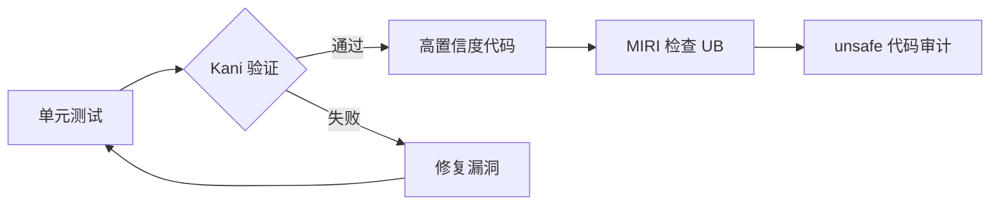

# Kani 实战指南 —— Rust 的 bounded model checker {#kani-实战指南-rust-的-bounded-model-checker}

> **权威来源**: 本文件为指南/参考，核心概念解释请见：
> [`concept/04_formal/04_model_checking/09_kani.md`](./concept/04_formal/04_model_checking/32_kani.md)
> **EN**: Kani Practical Guide
> **Summary**: Kani 实战指南 —— Rust 的 bounded model checker Kani Practical Guide. (stub/archive redirect)
>
> **Rust 版本**: 1.97.0+ (Edition 2024)
> **分级**: [A]
> **Bloom 层级**: L4-L5
> **对应 Rust 版本**: 1.97.0+ (Edition 2024)
> **Kani 版本**: 0.55.0+
> **最后更新**: 2026-05-22
>
> **受众**: [专家] / [研究者]
> **内容分级**: [研究者级]

---

## 1. 引言：Kani 是什么 {#1-引言kani-是什么}
>
> **[来源: [Rust Reference](https://doc.rust-lang.org/reference/)]**

Kani 是 Amazon Web Services (AWS) 开发的 Rust 专用**有界模型检查器 (bounded model checker, BMC)**。其核心工作流为：

```text
Rust 源码 → MIR (Mid-level IR) → Goto-C → CBMC (C Bounded Model Checker)
```

| 层级 | 组件 | 职责 |
| :--- | :--- | :--- |
| 前端 | `rustc` | 将 Rust 代码编译为 MIR |
| 中间层 | `kani-compiler` | 将 MIR 翻译为 Goto-C (C-like 中间表示) |
| 后端 | CBMC | 基于 SAT/SMT 求解器进行符号执行，检查所有可达状态 |

Kani 的核心价值在于：**给定输入范围约束后，它能穷尽检查程序所有可能的执行路径**，而传统 fuzzing 或单元测试只能覆盖采样路径。

> [来源: [Kani User Documentation](https://model-checking.github.io/kani/)]
> [来源: [CBMC Documentation](https://diffblue.github.io/cbmc/)]
> [来源: [Rust Reference — MIR](https://rustc-dev-guide.rust-lang.org/mir/index.html)]

### Kani 在 Rust 验证生态中的定位 {#kani-在-rust-验证生态中的定位}
>
> **[来源: [The Rust Programming Language](https://doc.rust-lang.org/book/)]**


Kani 占据**符号执行层**：比属性测试更强（穷尽而非采样），比演绎验证更易用（无需写复杂不变量），但受限于状态空间爆炸。

---

## 2. 安装与配置 {#2-安装与配置}
>
> **[来源: [Rust Standard Library](https://doc.rust-lang.org/std/)]**

### 2.1 环境要求 {#21-环境要求}
>
> **[来源: [Rustonomicon](https://doc.rust-lang.org/nomicon/)]**

| 依赖 | 最低版本 | 说明 |
|:---|:---|:---|
| Rust toolchain | 1.80.0 | `stable` 或 `nightly` |
| CBMC | 6.0.0 | Kani 自动管理 |
| Python | 3.8+ | 用于 `cargo-kani` 脚本 |

### 2.2 安装步骤 {#22-安装步骤}
>
> **[来源: [Rust By Example](https://doc.rust-lang.org/rust-by-example/)]**

```bash
# Step 1: 安装 Kani 工具链 {#step-1-安装-kani-工具链}
cargo install kani-verifier

# Step 2: 下载并配置 CBMC 等依赖 {#step-2-下载并配置-cbmc-等依赖}
cargo kani --setup

# Step 3: 验证安装 {#step-3-验证安装}
cargo kani --version
# 预期输出: kani 0.55.0 {#预期输出-kani-0550}
```

> [来源: [Kani Installation Guide](https://model-checking.github.io/kani/install-guide.html)]

### 2.3 Cargo.toml 配置 {#23-cargotoml-配置}
>
> **[来源: [Rust Reference](https://doc.rust-lang.org/reference/)]**

```toml
[dependencies]
# Kani 验证时自动注入 kani crate，无需显式依赖 {#kani-验证时自动注入-kani-crate无需显式依赖}

[dev-dependencies]
# 如需在测试代码中使用 kani 宏（非验证时编译），可条件编译 {#如需在测试代码中使用-kani-宏非验证时编译可条件编译}
```

Kani 的验证代码通常放在单独文件中，通过 `#[cfg(kani)]` 或 `#[kani::proof]` 属性标记，不影响正常编译。

---

## 3. 基础验证模式 {#3-基础验证模式}
>
> **[来源: [The Rust Programming Language](https://doc.rust-lang.org/book/)]**

### 3.1 `#[kani::proof]` — 证明函数 {#31-kaniproof-证明函数}
>
> **[来源: [Rust Standard Library](https://doc.rust-lang.org/std/)]**

`#[kani::proof]` 标记的函数是 Kani 的**验证入口**。Kani 会对该函数进行符号执行，检查所有断言是否成立。

```rust
// src/lib.rs

pub fn abs(x: i32) -> i32 {
    if x < 0 {
        -x
    } else {
        x
    }
}

#[cfg(kani)]
mod verification {
    use super::*;

    #[kani::proof]
    fn check_abs_non_negative() {
        let x: i32 = kani::any();  // 任意 i32 值
        let result = abs(x);
        kani::assert(result >= 0, "abs 结果必须非负");
    }
}
```

运行验证：

```bash
cargo kani --function check_abs_non_negative
```

Kani 会为 `x` 生成符号值，探索 `x < 0` 和 `x >= 0` 两条路径，并验证 `result >= 0` 在所有路径上成立。

> ⚠️ **注意**：`abs(i32::MIN)` 在 Rust 中会发生溢出（`-i32::MIN == i32::MIN`），上述证明会**失败**。这展示了 Kani 的价值——它能发现边界情况。

修复后的版本：

```rust
pub fn abs_safe(x: i32) -> Option<i32> {
    if x == i32::MIN {
        None
    } else if x < 0 {
        Some(-x)
    } else {
        Some(x)
    }
}

#[cfg(kani)]
mod verification {
    use super::*;

    #[kani::proof]
    fn check_abs_safe() {
        let x: i32 = kani::any();
        if let Some(result) = abs_safe(x) {
            kani::assert(result >= 0, "结果非负");
            kani::assert(result == x || result == -x, "结果是 x 或 -x");
        }
    }
}
```

> [来源: [Kani Tutorial — Proof Harnesses](https://model-checking.github.io/kani/tutorial-proofs.html)]
> [来源: [Rust Reference — Integer Overflow](https://doc.rust-lang.org/reference/expressions/operator-expr.html#overflow)]

### 3.2 `kani::any()` — 非确定值生成 {#32-kaniany-非确定值生成}
>
> **[来源: [Rustonomicon](https://doc.rust-lang.org/nomicon/)]**

`kani::any()` 为类型 `T` 生成一个**符号值 (symbolic value)**，代表该类型的所有可能取值。

| 用法 | 语义 | 适用类型 |
|:---|:---|:---|
| `kani::any::<i32>()` | 任意 32 位有符号整数 | 所有实现 `Arbitrary` 的基础类型 |
| `kani::any_where::<i32>(\|x\| x > 0)` | 满足条件的任意值 | 需额外约束时 |
| `kani::any::<[u8; 32]>()` | 任意 32 字节数组 | 固定大小数组 |

```rust,ignore
#[kani::proof]
fn check_any_where() {
    let x: u32 = kani::any_where(|v: &u32| *v >= 10 && *v <= 20);
    let y: u32 = kani::any_where(|v: &u32| *v >= 10 && *v <= 20);
    kani::assert(x + y >= 20 && x + y <= 40, "和在范围内");
}
```

### 3.3 `kani::assume()` — 前置条件约束 {#33-kaniassume-前置条件约束}
>
> **[来源: [Rust By Example](https://doc.rust-lang.org/rust-by-example/)]**

`kani::assume(cond)` 告诉 Kani：**只考虑满足 `cond` 的输入**。这用于限定验证范围，排除不感兴趣的状态。

```rust,ignore
/// 计算整数平方根（向下取整）
pub fn isqrt(x: u32) -> u32 {
    let mut r = 0u32;
    while (r + 1) * (r + 1) <= x {
        r += 1;
    }
    r
}

#[kani::proof]
fn check_isqrt() {
    let x: u32 = kani::any();
    kani::assume(x <= 10000);  // 限定范围，避免状态爆炸

    let r = isqrt(x);
    kani::assert(r * r <= x, "r² ≤ x");
    kani::assert((r + 1) * (r + 1) > x || r == u32::MAX, "(r+1)² > x");
}
```

> [来源: [Kani Documentation — Nondeterministic Variables](https://model-checking.github.io/kani/tutorial-nondeterministic-variables.html)]

### 3.4 `kani::assert()` — 验证目标 {#34-kaniassert-验证目标}
>
> **[来源: [Rust Reference](https://doc.rust-lang.org/reference/)]**

`kani::assert(cond, msg)` 是 Kani 的核心验证原语。如果存在任何符号执行路径使 `cond` 为 `false`，Kani 会报告反例。

```rust,ignore
#[kani::proof]
fn check_division() {
    let a: i32 = kani::any();
    let b: i32 = kani::any();

    kani::assume(b != 0);  // 避免除零

    let result = a / b;

    // 验证：a = (a/b)*b + (a%b)
    kani::assert(a == result * b + a % b, "除法基本等式");

    // 验证：除零 panic 不会发生（由 assume 保证，Kani 会确认）
}
```

Kani 与普通 `assert!()` 的区别：

| 特性 | `assert!()` | `kani::assert()` |
|:---|:---|:---|
| 运行时（Runtime）行为 | panic（若条件为假） | 无运行时开销（仅在验证时生效） |
| 验证作用 | 无 | Kani 会穷尽检查所有路径 |
| 编译条件 | 始终编译 | 仅在 `#[cfg(kani)]` 下编译 |

---

## 4. 循环与递归 {#4-循环与递归}
>
> **[来源: [The Rust Programming Language](https://doc.rust-lang.org/book/)]**

### 4.1 `#[kani::unwind(n)]` — 循环展开 {#41-kaniunwindn-循环展开}
>
> **[来源: [Rust Standard Library](https://doc.rust-lang.org/std/)]**

Kani 通过 CBMC 进行有界模型检查，**必须限制循环迭代次数**，否则状态空间无限。

```rust
/// 计算数组元素和
pub fn sum(arr: &[i32]) -> i32 {
    let mut total = 0;
    for &x in arr {
        total += x;
    }
    total
}

#[cfg(kani)]
mod verification {
    use super::*;

    #[kani::proof]
    #[kani::unwind(5)]  // 最多展开 5 次循环迭代
    fn check_sum_small() {
        let mut arr: [i32; 4] = kani::any();
        let result = sum(&arr);

        // 验证：result ≥ 每个元素（若所有元素非负）
        kani::assume(arr.iter().all(|&x| x >= 0));
        kani::assert(result >= 0, "非负数组的和必须非负");
    }
}
```

> [来源: [Kani Documentation — Loop Unwinding](https://model-checking.github.io/kani/tutorial-loop-unwinding.html)]

### 4.2 手动循环不变量 {#42-手动循环不变量}
>
> **[来源: [Rustonomicon](https://doc.rust-lang.org/nomicon/)]**

当自动展开不足以证明正确性时，可手动插入**循环不变量断言**。

```rust,ignore
/// 线性查找
pub fn find(arr: &[i32], target: i32) -> Option<usize> {
    for (i, &x) in arr.iter().enumerate() {
        if x == target {
            return Some(i);
        }
    }
    None
}

#[kani::proof]
#[kani::unwind(10)]
fn check_find_correctness() {
    let arr: [i32; 5] = kani::any();
    let target: i32 = kani::any();

    let result = find(&arr, target);

    match result {
        Some(idx) => {
            kani::assert(idx < arr.len(), "索引在范围内");
            kani::assert(arr[idx] == target, "找到的元素等于目标");
        }
        None => {
            // 验证：若返回 None，则数组中不存在 target
            for i in 0..arr.len() {
                kani::assert(arr[i] != target, "数组中不应有 target");
            }
        }
    }
}
```

### 4.3 递归深度限制 {#43-递归深度限制}
>
> **[来源: [Rust By Example](https://doc.rust-lang.org/rust-by-example/)]**

递归函数同样需要展开限制：

```rust,ignore
/// 计算阶乘
pub fn factorial(n: u32) -> u32 {
    if n == 0 {
        1
    } else {
        n * factorial(n - 1)
    }
}

#[kani::proof]
#[kani::unwind(6)]  // 展开 6 层递归
fn check_factorial() {
    let n: u32 = kani::any();
    kani::assume(n <= 5);  // 与 unwind 深度匹配

    let result = factorial(n);
    kani::assert(result >= 1, "阶乘结果 ≥ 1");
}
```

---

## 5. Unsafe 代码验证 {#5-unsafe-代码验证}
>
> **[来源: [Rust Reference](https://doc.rust-lang.org/reference/)]**

Kani 是验证 unsafe Rust 的利器——它能检查指针别名、内存安全（Memory Safety）假设和布局约束。

### 5.1 验证原始指针操作 {#51-验证原始指针操作}
>
> **[来源: [The Rust Programming Language](https://doc.rust-lang.org/book/)]**

```rust
/// 将 u8 切片解释为 u16（小端序）
/// 前提：切片长度必须为偶数
pub unsafe fn bytes_to_u16(src: &[u8]) -> Vec<u16> {
    let len = src.len();
    assert!(len % 2 == 0, "长度必须为偶数");

    let ptr = src.as_ptr() as *const u16;
    let num_u16 = len / 2;

    // 安全前提：ptr 已对齐且指向有效内存
    std::slice::from_raw_parts(ptr, num_u16).to_vec()
}

#[cfg(kani)]
mod verification {
    use super::*;

    #[kani::proof]
    #[kani::unwind(5)]
    fn check_bytes_to_u16() {
        let mut buf: [u8; 4] = kani::any();

        // 用 kani::any() 生成任意偶数长度（固定为 4）
        let result = unsafe { bytes_to_u16(&buf) };

        kani::assert(result.len() == 2, "结果长度应为 2");

        // 验证：重组后的一致性
        kani::assert(
            result[0].to_le_bytes() == [buf[0], buf[1]],
            "第一个 u16 必须对应前两个字节"
        );
    }
}
```

> [来源: [The Rustonomicon — Transmutes](https://doc.rust-lang.org/nomicon/transmutes.html)]
> [来源: [Rust Reference — Raw Pointers](https://doc.rust-lang.org/reference/types/pointer.html)]

### 5.2 验证内存布局假设 {#52-验证内存布局假设}
>
> **[来源: [Rust Standard Library](https://doc.rust-lang.org/std/)]**

```rust,ignore
use std::alloc::{self, Layout};

/// 自定义分配器：分配 n 个 T 的数组
pub unsafe fn alloc_array<T>(n: usize) -> *mut T {
    let layout = Layout::array::<T>(n).unwrap();
    alloc::alloc(layout) as *mut T
}

#[kani::proof]
fn check_alloc_non_null() {
    let n: usize = kani::any();
    kani::assume(n > 0 && n <= 1024);  // 限制分配大小

    let ptr: *mut u8 = unsafe { alloc_array::<u8>(n) };

    // Kani 能验证：在此假设下，分配不会返回 null
    // （注：实际 CBMC 对 alloc 有简化模型，此示例展示模式）
    kani::assert(!ptr.is_null() || n == 0, "分配成功或大小为 0");
}
```

---

## 6. 完整案例 {#6-完整案例}
>
> **[来源: [Rustonomicon](https://doc.rust-lang.org/nomicon/)]**

### 6.1 案例一：验证正确的 `Vec::push` 等价实现 {#61-案例一验证正确的-vecpush-等价实现}
>
> **[来源: [Rust By Example](https://doc.rust-lang.org/rust-by-example/)]**

```rust,ignore
/// 一个简化的 Vec 等价实现（仅用于教学）
pub struct SimpleVec<T> {
    ptr: *mut T,
    len: usize,
    cap: usize,
}

impl<T: Copy + Default> SimpleVec<T> {
    pub fn new() -> Self {
        Self {
            ptr: std::ptr::null_mut(),
            len: 0,
            cap: 0,
        }
    }

    pub fn push(&mut self, value: T) {
        if self.len == self.cap {
            self.grow();
        }
        unsafe {
            self.ptr.add(self.len).write(value);
        }
        self.len += 1;
    }

    pub fn get(&self, index: usize) -> Option<T> {
        if index < self.len {
            Some(unsafe { self.ptr.add(index).read() })
        } else {
            None
        }
    }

    fn grow(&mut self) {
        let new_cap = if self.cap == 0 { 1 } else { self.cap * 2 };
        let new_layout = Layout::array::<T>(new_cap).unwrap();
        let new_ptr = unsafe { alloc::alloc(new_layout) as *mut T };

        if !self.ptr.is_null() {
            unsafe {
                std::ptr::copy_nonoverlapping(self.ptr, new_ptr, self.len);
                let old_layout = Layout::array::<T>(self.cap).unwrap();
                alloc::dealloc(self.ptr as *mut u8, old_layout);
            }
        }

        self.ptr = new_ptr;
        self.cap = new_cap;
    }
}

#[cfg(kani)]
mod vec_verification {
    use super::*;

    #[kani::proof]
    #[kani::unwind(4)]
    fn check_push_preserves_elements() {
        let mut vec = SimpleVec::<i32>::new();

        let v1: i32 = kani::any();
        let v2: i32 = kani::any();

        vec.push(v1);
        vec.push(v2);

        // 验证长度正确
        kani::assert(vec.len == 2, "push 两次后长度应为 2");

        // 验证元素可正确读取
        kani::assert(vec.get(0) == Some(v1), "第一个元素应为 v1");
        kani::assert(vec.get(1) == Some(v2), "第二个元素应为 v2");
        kani::assert(vec.get(2) == None, "越界访问应返回 None");
    }
}
```

> [来源: [Rust Reference — Vec Implementation](https://doc.rust-lang.org/std/vec/struct.Vec.html)]
> [来源: [Kani Firecracker Verification Examples](https://github.com/model-checking/kani/tree/main/tests)]

### 6.2 案例二：验证二分查找无溢出 {#62-案例二验证二分查找无溢出}
>
> **[来源: [Rust Reference](https://doc.rust-lang.org/reference/)]**

Rust 标准库 `binary_search` 曾因 `(left + right) / 2` 的整数溢出漏洞闻名。Kani 可系统性地发现此类问题。

```rust
/// 有漏洞的版本：(left + right) / 2 可能溢出
pub fn binary_search_buggy(arr: &[i32], target: i32) -> Option<usize> {
    let mut left = 0usize;
    let mut right = arr.len();

    while left < right {
        let mid = (left + right) / 2;  // 漏洞：left + right 可能溢出！
        match arr[mid].cmp(&target) {
            std::cmp::Ordering::Equal => return Some(mid),
            std::cmp::Ordering::Less => left = mid + 1,
            std::cmp::Ordering::Greater => right = mid,
        }
    }
    None
}

/// 修复版本：left + (right - left) / 2，永不溢出
pub fn binary_search_fixed(arr: &[i32], target: i32) -> Option<usize> {
    let mut left = 0usize;
    let mut right = arr.len();

    while left < right {
        let mid = left + (right - left) / 2;  // 无溢出风险
        match arr[mid].cmp(&target) {
            std::cmp::Ordering::Equal => return Some(mid),
            std::cmp::Ordering::Less => left = mid + 1,
            std::cmp::Ordering::Greater => right = mid,
        }
    }
    None
}

#[cfg(kani)]
mod bsearch_verification {
    use super::*;

    #[kani::proof]
    #[kani::unwind(5)]
    fn check_binary_search_fixed_no_panic() {
        // 生成有序数组
        let mut arr: [i32; 4] = kani::any();
        kani::assume(arr[0] <= arr[1] && arr[1] <= arr[2] && arr[2] <= arr[3]);

        let target: i32 = kani::any();

        // 验证：修复版本不会 panic
        let _result = binary_search_fixed(&arr, target);

        // Kani 会自动检查：无数组越界、无整数溢出、无 panic
    }
}
```

> [来源: [Rust Standard Library — slice::binary_search](https://doc.rust-lang.org/std/primitive.slice.html#method.binary_search)]
> [来源: [Java Bug Report — Binary Search Overflow](https://ai.googleblog.com/2006/06/extra-extra-read-all-about-it-nearly.html)]

### 6.3 案例三：验证环形缓冲区无数据竞争（单线程逻辑） {#63-案例三验证环形缓冲区无数据竞争单线程逻辑}
>
> **[来源: [The Rust Programming Language](https://doc.rust-lang.org/book/)]**

```rust
/// 固定容量环形缓冲区
pub struct RingBuffer<T: Copy + Default, const N: usize> {
    buf: [T; N],
    head: usize,
    tail: usize,
    count: usize,
}

impl<T: Copy + Default, const N: usize> RingBuffer<T, N> {
    pub fn new() -> Self {
        Self {
            buf: [T::default(); N],
            head: 0,
            tail: 0,
            count: 0,
        }
    }

    pub fn is_empty(&self) -> bool {
        self.count == 0
    }

    pub fn is_full(&self) -> bool {
        self.count == N
    }

    pub fn push(&mut self, value: T) -> bool {
        if self.is_full() {
            return false;
        }
        self.buf[self.tail] = value;
        self.tail = (self.tail + 1) % N;
        self.count += 1;
        true
    }

    pub fn pop(&mut self) -> Option<T> {
        if self.is_empty() {
            return None;
        }
        let value = self.buf[self.head];
        self.head = (self.head + 1) % N;
        self.count -= 1;
        Some(value)
    }
}

#[cfg(kani)]
mod ringbuf_verification {
    use super::*;

    #[kani::proof]
    #[kani::unwind(5)]
    fn check_ring_buffer_fifo() {
        let mut buf: RingBuffer<i32, 3> = RingBuffer::new();

        let v1: i32 = kani::any();
        let v2: i32 = kani::any();

        // 验证：push 成功后的状态
        kani::assert(buf.push(v1), "第一次 push 应成功");
        kani::assert(buf.push(v2), "第二次 push 应成功");
        kani::assert(!buf.is_empty(), "非空");

        // 验证：FIFO 顺序
        kani::assert(buf.pop() == Some(v1), "先出的是 v1");
        kani::assert(buf.pop() == Some(v2), "后出的是 v2");
        kani::assert(buf.is_empty(), "最终为空");
    }

    #[kani::proof]
    #[kani::unwind(5)]
    fn check_ring_buffer_capacity() {
        let mut buf: RingBuffer<i32, 2> = RingBuffer::new();

        let v1: i32 = kani::any();
        let v2: i32 = kani::any();
        let v3: i32 = kani::any();

        kani::assert(buf.push(v1), "push 1");
        kani::assert(buf.push(v2), "push 2");
        kani::assert(!buf.push(v3), "push 3 应失败（已满）");
        kani::assert(buf.is_full(), "应满");
    }
}
```

---

## 7. Kani Proof vs Unit Test：当测试通过而 Kani 发现 Bug {#7-kani-proof-vs-unit-test当测试通过而-kani-发现-bug}
>
> **[来源: [Rust Standard Library](https://doc.rust-lang.org/std/)]**

### 7.1 对比矩阵 {#71-对比矩阵}
>
> **[来源: [Rustonomicon](https://doc.rust-lang.org/nomicon/)]**

| 维度 | 单元测试 | Kani BMC |
|:---|:---|:---|
| 覆盖策略 | 采样（具体输入） | 穷尽（符号化所有路径） |
| 输入生成 | 手动或 property-based | 符号值自动展开 |
| 循环/递归 | 固定执行 | 有界展开，检查所有迭代 |
| 溢出检测 | 依赖测试数据 | 自动发现所有溢出路径 |
| 执行时间 | 毫秒级 | 秒到分钟级 |
| 适用规模 | 任意 | 中小规模（受状态空间限制） |

### 7.2 典型案例：整数溢出 {#72-典型案例整数溢出}
>
> **[来源: [Rust By Example](https://doc.rust-lang.org/rust-by-example/)]**

```rust,ignore
pub fn average(a: u32, b: u32) -> u32 {
    (a + b) / 2  // 漏洞：a + b 可能溢出
}

#[test]
fn test_average() {
    assert_eq!(average(10, 20), 15);
    assert_eq!(average(0, 0), 0);
    assert_eq!(average(100, 200), 150);
    // 所有测试通过！
}

#[kani::proof]
fn check_average_no_overflow() {
    let a: u32 = kani::any();
    let b: u32 = kani::any();
    let _result = average(a, b);
    // Kani 报告：a = 0xFFFFFFFF, b = 1 时 a + b 溢出！
}
```

修复：

```rust
pub fn average_fixed(a: u32, b: u32) -> u32 {
    a / 2 + b / 2 + (a % 2 + b % 2) / 2
}
```

> [来源: [Kani Documentation — Comparison with Testing](https://model-checking.github.io/kani/tutorial-comparison.html)]

### 7.3 协作工作流 {#73-协作工作流}
>
> **[来源: [Rust Reference](https://doc.rust-lang.org/reference/)]**



---

## 8. 限制与最佳实践 {#8-限制与最佳实践}
>
> **[来源: [The Rust Programming Language](https://doc.rust-lang.org/book/)]**

### 8.1 已知限制 {#81-已知限制}
>
> **[来源: [Rust Standard Library](https://doc.rust-lang.org/std/)]**

| 限制 | 说明 | 缓解策略 |
|:---|:---|:---|
| **状态空间爆炸** | 循环/递归展开深度过大导致验证不可行 | 缩小数据范围，抽象复杂逻辑 |
| **不支持并发** | Kani 单线程符号执行，无法验证 `std::thread` | 用 loom/crossbeam 测试并发；验证单线程不变量 |
| **不支持 async/await** | 异步状态机转换未完全支持 | 验证 poll 函数内部的同步逻辑 |
| **浮点数** | 浮点运算建模不完整 | 避免在证明中使用 f32/f64；或限定具体值 |
| **外部 FFI** | C 库函数无模型 | 提供 stub/mock 实现 |
| **标准库覆盖** | 部分标准库函数未建模 | 关注核心逻辑，避免过度依赖集合操作 |

> [来源: [Kani Documentation — Limitations](https://model-checking.github.io/kani/limitations.html)]

### 8.2 最佳实践 {#82-最佳实践}
>
> **[来源: [Rustonomicon](https://doc.rust-lang.org/nomicon/)]**

1. **从小开始**：先验证核心不变量，逐步增加复杂度
2. **合理设置 `unwind`**：`unwind` 深度应与 `assume` 的范围匹配
3. **使用 `kani::any_where`**：比 `any()` + `assume()` 更高效
4. **分离验证代码**：用 `#[cfg(kani)]` 模块（Module）隔离，不影响生产编译
5. **结合 MIRI**：Kani 验证功能正确性，MIRI 检查未定义行为

### 8.3 CI 集成 {#83-ci-集成}
>
> **[来源: [Rust By Example](https://doc.rust-lang.org/rust-by-example/)]**

```yaml
# .github/workflows/kani.yml {#githubworkflowskaniyml}
name: Kani Verification
on: [push, pull_request]
jobs:
  verify:
    runs-on: ubuntu-latest
    steps:
      - uses: actions/checkout@v4
      - name: Install Kani
        run: cargo install kani-verifier && cargo kani --setup
      - name: Run proofs
        run: cargo kani
```

---

## 9. 相关文件 {#9-相关文件}
>
> **[来源: [Rust Reference](https://doc.rust-lang.org/reference/)]**

- [Verus 实战指南 —— 互补的演绎验证器](26_verus_practical_guide.md)
- [形式化操作语义与 Rust 的形式化模型](../../concept/04_formal/03_operational_semantics/03_operational_semantics.md)
- [所有权（Ownership）的形式化定义](../../concept/04_formal/01_ownership_logic/02_ownership_formal.md)

## 10. 来源与延伸阅读 {#10-来源与延伸阅读}
>
> **[来源: [The Rust Programming Language](https://doc.rust-lang.org/book/)]**

| 来源 | 链接 | 用途 |
|:---|:---|:---|
| Kani 官方文档 | <https://model-checking.github.io/kani/> | 安装、教程、API |
| Kani GitHub | <https://github.com/model-checking/kani> | 源码、示例、issue |
| CBMC 文档 | <https://diffblue.github.io/cbmc/> | 底层模型检查器 |
| Rust Reference | <https://doc.rust-lang.org/reference/> | 语言语义基准 |
| Rustonomicon | <https://doc.rust-lang.org/nomicon/> | unsafe 代码规范 |
| 论文: Kani at AWS | ASE 2023 / ICSE 2024 | 工业级验证经验 |

---

## 10. 定理速查表 {#10-定理速查表}
>
> **[来源: [Rust Standard Library](https://doc.rust-lang.org/std/)]**

```rust
// ┌────────────────────────────────────────────────────────────┐
// │ Kani 验证模式速查                                          │
// ├────────────────────────────────────────────────────────────┤
// │ #[kani::proof]           — 验证入口                        │
// │ #[kani::unwind(n)]       — 循环/递归展开上限               │
// │ kani::any::<T>()         — 生成类型 T 的符号值             │
// │ kani::any_where(f)       — 带约束的符号值                  │
// │ kani::assume(cond)       — 路径约束（前置条件）            │
// │ kani::assert(cond, msg)  — 验证目标（后置条件）            │
// │ #[cfg(kani)]             — 条件编译（仅验证时）            │
// └────────────────────────────────────────────────────────────┘
```

> **总结**: Kani 是 Rust 生态中最易上手的形式化验证工具。通过在 MIR 层进行有界模型检查，它能在不修改源码结构的前提下，穷尽验证中小规模代码的所有执行路径。它与单元测试形成互补：测试覆盖"常见情况"，Kani 消灭"边界恶魔"。

---
