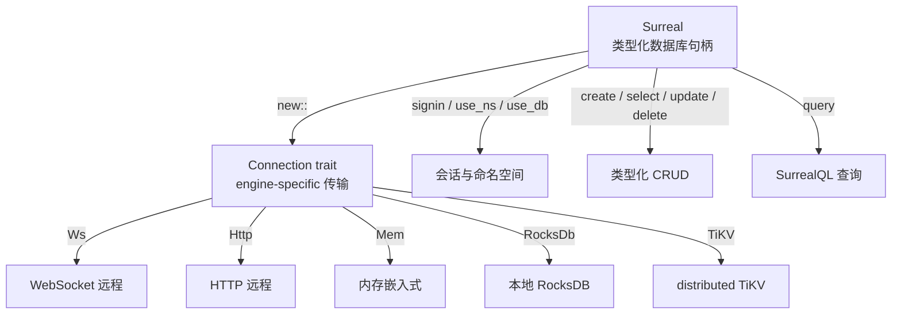

> **Canonical 说明**: 本文件专注 **surrealdb 文档-图数据库的 Connection 抽象与 SurrealQL 架构**。
>
> 若只需要使用指南与生态定位，请优先参考：
>
> - [数据库访问](../../../../concept/06_ecosystem/06_data_and_distributed/02_database_access.md)
> - [数据库系统](../../../../concept/06_ecosystem/06_data_and_distributed/04_database_systems.md)
>
> 本文件保留架构级深度内容，与上述使用指南形成互补。
> **Rust 版本**: 1.97.0+ (Edition 2024)
>
> **状态**: ✅ 已完成
>
> **概念族**: Crate 架构 / surrealdb
>
> **层级**: L3-L5

---

# surrealdb Crate 架构解构 {#surrealdb-crate-架构解构}

> **EN**: Surrealdb Architecture
> **Summary**: surrealdb Crate 架构解构 Surrealdb Architecture.
> **最后更新**: 2026-06-29
>
> **内容分级**: [归档级]
>
> **分级**: [B]
>
> **Bloom 层级**: L3-L5
>
> **知识领域**: 文档数据库、图数据库、异步（Async） IO、分布式存储
>
> **对应 Rust 版本**: 1.97.0+ (Edition 2024)

---

## 1. 引言：Rust SurrealDB 客户端的生态定位 {#1-引言rust-surrealdb-客户端的生态定位}

> **[来源: [surrealdb crates.io](https://crates.io/crates/surrealdb)]**

`surrealdb` crate 是 SurrealDB 官方提供的 Rust 客户端/嵌入式数据库库。SurrealDB 自称是 **"面向实时 web 的分布式协作文档-图数据库"**，它统一了关系型表、文档型集合与图遍历三种模型，并通过 SurrealQL 提供统一的查询语言。

> [来源: [surrealdb docs.rs](https://docs.rs/surrealdb/latest/surrealdb/struct.Surreal.html)]

与专用 MongoDB/DynamoDB 客户端或专用图数据库客户端不同，`surrealdb` 的设计哲学是**"一个连接、多种引擎、统一查询"**：

| 维度 | 设计选择 | 工程价值 |
|:--|:--|:--|
| **部署形态** | 支持远程 WebSocket/HTTP、嵌入式内存、RocksDB、SurrealKV、TiKV 等多种引擎 | 同一套 API 覆盖开发、测试、生产与边缘场景 |
| **数据模型** | 文档 + 图 + 关系混合，使用 `RecordId` 作为记录标识 | 减少多数据库之间的数据同步与转换 |
| **查询语言** | SurrealQL（类 SQL 但支持图遍历与嵌套文档） | 复杂查询可下推到数据库，避免应用层多次往返 |
| **类型安全** | `Surreal<C: Connection>` 泛型（Generics）引擎 + serde 类型参数 | 编译期区分连接类型，读取时反序列化为强类型 |
| **连接恢复** | WebSocket 远程连接默认自动重连 | 提升长连接服务的 resilience |

> [来源: [surrealdb GitHub Repository](https://github.com/surrealdb/surrealdb)]

```rust,ignore
use surrealdb::{engine::remote::ws::Ws, opt::auth::Root, Surreal};

let db = Surreal::new::<Ws>("localhost:8000").await?;
db.signin(Root { username: "root", password: "root" }).await?;
db.use_ns("namespace").use_db("database").await?;

let created: Vec<Person> = db.create("person").content(person).await?;
```

> [来源: [surrealdb Examples](https://github.com/surrealdb/surrealdb/tree/main/examples)]

---

## 2. 核心 API 架构 {#2-核心-api-架构}

> **[来源: [The Rust Programming Language](https://doc.rust-lang.org/book/)]**

### 2.1 引擎抽象：`Surreal<C: Connection>` {#21-引擎抽象surrealc-connection}



> [来源: [surrealdb Connection Docs](https://docs.rs/surrealdb/latest/surrealdb/struct.Surreal.html)]

| 类型 | 职责 | 关键方法 |
|:--|:--|:--|
| `Surreal<C>` | 数据库客户端/嵌入式实例 | `Surreal::new::<C>`, `signin`, `use_ns`, `use_db` |
| `Connection` trait | 定义引擎能力 | 由 `Ws`、`Http`、`Mem`、`RocksDb` 等实现 |
| `Root` / `Namespace` / `Database` | 认证信息 | 用于 `signin` |
| `Response` | 查询结果集 | `take(0)`, `take::<Vec<T>>(0)` |
| `RecordId` / `Thing` | 记录 ID | 用于指定记录主键，如 `("person", "alice")` |

> [来源: [surrealdb Surreal Docs](https://docs.rs/surrealdb/latest/surrealdb/struct.Surreal.html)]

### 2.2 CRUD 操作 {#22-crud-操作}

`surrealdb` 的 CRUD 方法高度泛化，支持动态文档与 serde 强类型两种风格：

```rust,ignore
use serde::{Deserialize, Serialize};

#[derive(Debug, Serialize, Deserialize)]
struct Person {
    name: String,
    age: u8,
}

// 插入（返回 Vec<T>，因为 SurrealDB 可能返回多条）
let created: Vec<Person> = db.create("person").content(Person { name: "Alice".into(), age: 30 }).await?;

// 查询所有
let people: Vec<Person> = db.select("person").await?;

// 按 ID 更新（部分 merge）
let updated: Option<Person> = db.update(("person", "alice")).merge(json!({ "age": 31 })).await?;

// 按 ID 删除
let deleted: Option<Person> = db.delete(("person", "alice")).await?;
```

> [来源: [surrealdb CRUD Docs](https://docs.rs/surrealdb/latest/surrealdb/struct.Surreal.html)]

### 2.3 SurrealQL 查询与参数绑定 {#23-surrealql-查询与参数绑定}

对于复杂查询，使用 `.query()` 并绑定参数以避免字符串拼接和注入风险：

```rust,ignore
let mut result = db
    .query("SELECT * FROM person WHERE age > $min AND name CONTAINS $name")
    .bind(("min", 18))
    .bind(("name", "Ali"))
    .await?;

let adults: Vec<Person> = result.take(0)?;
```

> [来源: [SurrealQL Documentation](https://docs.surrealdb.com/docs/surrealql)]

### 2.4 远程连接：认证、命名空间与数据库 {#24-远程连接认证命名空间与数据库}

SurrealDB 使用三层命名空间：`namespace` → `database` → `table`。`Surreal` 句柄通过 `signin` 获得权限，再通过 `use_ns` / `use_db` 选择上下文：

```rust,ignore
db.signin(Root { username: "root", password: "root" }).await?;
db.use_ns("rust_learning").use_db("c10_networks_demo").await?;
```

> [来源: [surrealdb Authentication Docs](https://docs.rs/surrealdb/latest/surrealdb/struct.Surreal.html)]

### 2.5 嵌入式引擎 {#25-嵌入式引擎}

同一 crate 也支持无需外部服务的嵌入式模式：

```rust,ignore
use surrealdb::engine::local::Mem;

let db = Surreal::new::<Mem>(()).await?;
db.use_ns("test").use_db("test").await?;
```

> [来源: [surrealdb Local Engine Docs](https://docs.rs/surrealdb/latest/surrealdb/struct.Surreal.html)]

---

## 3. 类型系统利用 {#3-类型系统利用}

> **[来源: [Rust Reference](https://doc.rust-lang.org/reference/)]**

| 维度 | API | 类型系统（Type System）价值 |
|:--|:--|:--|
| 引擎类型参数 | `Surreal<C: Connection>` | 编译期区分远程/嵌入式引擎，防止将网络认证代码用于内存引擎 |
| 文档类型参数 | `create<T>`, `select<T>`, `update<T>` | 读写边界由 serde 约束，避免运行时（Runtime）类型不匹配 |
| 查询结果索引 | `Response::take::<Vec<T>>(idx)` | 通过泛型在编译期决定反序列化目标类型 |
| 记录 ID | `RecordId` / `Thing` / tuple `("table", "id")` | 将字符串主键提升为类型化资源标识 |
| 认证类型 | `Root`, `Namespace`, `Database` | 不同权限级别在类型上分离 |

> [来源: [surrealdb API docs](https://docs.rs/surrealdb/latest/surrealdb/struct.Surreal.html)]

---

## 4. 反例边界 {#4-反例边界}

> **[来源: [Rustonomicon](https://doc.rust-lang.org/nomicon/)]**

| 反例 | 错误表现 | 正确做法 |
|:--|:--|:--|
| 未调用 `use_ns` / `use_db` 就执行查询 | 运行时命名空间错误 | 在应用启动时显式选择 namespace 与 database |
| 用 `Vec<T>` 接收单条 `create`/`update` 结果 | 类型不匹配 | 根据操作语义选择 `Vec<T>` 或 `Option<T>` |
| 忽略 `Response::take` 的剩余结果 | 查询结果丢失、内存泄漏 | 按索引依次 `take` 所有结果集 |
| 在查询中直接拼接用户输入 | 注入风险 | 使用 `.bind(...)` 参数化查询 |
| 远程连接未处理断线 | 长时间运行后请求失败 | 利用 WebSocket 自动重连，或在应用层实现重试 |
| 将事务性多操作拆分为多次异步（Async）调用 | 竞态条件 | 在 SurrealQL 中使用事务或单次复杂查询 |
| 嵌入式引擎在多线程间共享未考虑 Send | 编译错误 | 确认所选引擎与 `Surreal` 句柄满足 `Send` |

> [来源: [SurrealDB Best Practices](https://docs.surrealdb.com/docs/deployment/best-practices)]

---

## 5. 代码示例锚点 {#5-代码示例锚点}

> **[来源: [Rust By Example](https://doc.rust-lang.org/rust-by-example/)]**

| 示例 | 文件 | 说明 |
|:--|:--|:--|
| 远程 CRUD 与 SurrealQL | [`crates/c10_networks/examples/surrealdb_basic_crud.rs`](../../../../crates/c10_networks/examples/surrealdb_basic_crud.rs) | signin、use_ns/use_db、create/select/update/query |

> [来源: [c10_networks Crate](../../../../crates/c10_networks/README.md)]

---

## 6. 相关架构与延伸阅读 {#6-相关架构与延伸阅读}

> **[来源: [Rust Cookbook](https://rust-lang-nursery.github.io/rust-cookbook/)]**

- [Tokio 异步运行时架构](06_tokio_architecture.md)
- [mongodb-rust-driver 文档数据库架构](24_mongodb_architecture.md) — 文档模型对比
- [SQLx SQL 工具架构](09_sqlx_architecture.md) — 关系型查询对比
- [Redis 缓存/消息架构](23_redis_architecture.md) — 与缓存层组合
- [异步编程模型](../../../../concept/03_advanced/01_async/01_async.md)
- [数据库与存储生态权威来源对齐](../../01_alignment_matrices/19_database_storage_cloud_alignment.md)

---

## 权威来源索引 {#权威来源索引}

> **[来源: [surrealdb crates.io](https://crates.io/crates/surrealdb)]**
>
> **[来源: [surrealdb docs.rs](https://docs.rs/surrealdb/latest/surrealdb/struct.Surreal.html)]**
>
> **[来源: [surrealdb GitHub](https://github.com/surrealdb/surrealdb)]**
>
> **[来源: [SurrealDB 官方文档](https://docs.surrealdb.com/)]**
>
> **[来源: [The Rust Programming Language](https://doc.rust-lang.org/book/)]**
>
> **权威来源**: [surrealdb crates.io](https://crates.io/crates/surrealdb), [surrealdb docs.rs](https://docs.rs/surrealdb/latest/surrealdb/struct.Surreal.html), [SurrealDB 官方文档](https://docs.surrealdb.com/)
>
> **权威来源对齐变更日志**: 2026-06-29 创建 SurrealDB 生态专题，对齐 surrealdb 2.x 官方文档与 SurrealDB 参考

---

## 权威来源参考 {#权威来源参考}

> **P0（官方/必读）**:
>
> - [来源: [surrealdb Documentation](https://docs.rs/surrealdb/latest/surrealdb/struct.Surreal.html)]
> - [来源: [surrealdb crates.io](https://crates.io/crates/surrealdb)]
> - [来源: [SurrealDB 官方文档](https://docs.surrealdb.com/)]
> - [来源: [SurrealQL Reference](https://docs.surrealdb.com/docs/surrealql)]
> **P1（学术论文/演讲）**:
>
> - [来源: [Graph Databases: New Opportunities for Connected Data](https://www.oreilly.com/library/view/graph-databases/9781491935811/)] — 图数据库模型基础
> - [来源: [FoundationDB: A Distributed Unbundled Transactional Key Value Store (SIGMOD 2021)](https://dl.acm.org/doi/10.1145/3448016.3457559)] — 分布式键值存储权威论文
> **P2（仓库/社区文章）**:
>
> - [来源: [surrealdb GitHub Repository](https://github.com/surrealdb/surrealdb)]
> - [来源: [SurrealDB Blog](https://surrealdb.com/blog)]
> - [来源: [This Week in Rust](https://this-week-in-rust.org/)]

## 学术权威参考 {#学术权威参考}

- [RustBelt](https://plv.mpi-sws.org/rustbelt/popl18/)
- [Aeneas](https://aeneasverif.github.io/)
- [Oxide](https://arxiv.org/abs/1903.00982)
