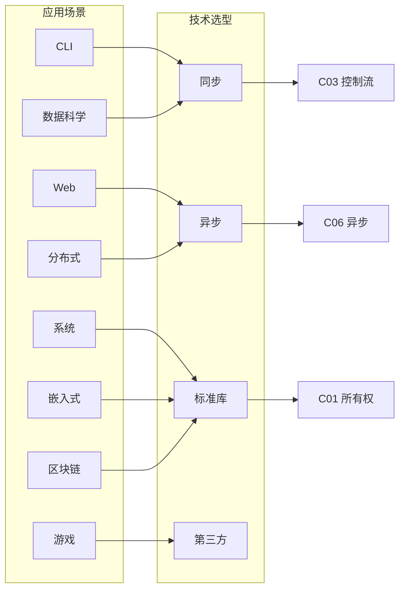

# Rust 应用分析论证视图

> **创建日期**: 2026-02-12
> **Rust 版本**: 1.93.0+
> **用途**: 应用场景 → 技术选型 → 论证依据 的系统化视图

---

## 目录

- [Rust 应用分析论证视图](#rust-应用分析论证视图)
  - [目录](#目录)
  - [CLI 工具](#cli-工具)
  - [Web 服务](#web-服务)
  - [系统编程](#系统编程)
  - [嵌入式](#嵌入式)
  - [分布式系统](#分布式系统)
  - [数据科学](#数据科学)
  - [游戏引擎](#游戏引擎)
  - [区块链与智能合约](#区块链与智能合约)
  - [跨场景选型矩阵](#跨场景选型矩阵)
  - [相关文档](#相关文档)

---

## CLI 工具

| 应用场景 | 技术选型 | 论证依据 |
|----------|----------|----------|
| 参数解析 | clap | 生态成熟、derive 支持、子命令、补全 |
| I/O 模式 | 同步 (std::io) | CLI 通常非高并发、简单直接 |
| 错误处理 | anyhow (应用) / thiserror (库) | 快速原型用 anyhow、库用 thiserror |
| 相关模块 | C03 控制流、C07 进程、C08 算法 | 控制流、子进程、数据处理 |

**公理 / 定理 → 论证**：CLI 选型遵循「单线程主导」公理——CLI 通常顺序执行、无高并发需求。定理：同步 I/O 在单线程下零额外开销；派生：`std::io` 足以满足，`std::process` 管理子进程。错误类型需满足 `Error + Send + Sync` 以支持 `anyhow`/`thiserror`。

---

## Web 服务

| 应用场景 | 技术选型 | 论证依据 |
|----------|----------|----------|
| 异步运行时 | Tokio | 生态最全、生产验证、async-std 备选 |
| Web 框架 | axum / actix-web | axum 与 Tokio 同源、actix 高性能 |
| 相关模块 | C06 异步、C10 网络 | 异步 I/O、TCP/HTTP |

**公理 / 定理 → 论证**：Web 选型遵循「I/O 密集型」公理——大量请求等待网络/磁盘。定理：异步 runtime 在 I/O 等待时复用线程，可支撑更高并发。Tokio 选型依据：M:N 调度、与 async-std 生态对比、生产验证。axum 与 Tokio 同源，减少调度开销。

---

## 系统编程

| 应用场景 | 技术选型 | 论证依据 |
|----------|----------|----------|
| 进程与 IPC | std::process、nix/libc | 标准库足矣、底层用 nix |
| 可能 unsafe | 谨慎使用 | 参考 UNSAFE_RUST_GUIDE |
| 相关模块 | C07 进程、C05 线程 | 进程管理、并发 |

**公理 / 定理 → 论证**：系统编程选型遵循「最小依赖」公理——底层系统库应尽量少依赖。定理：`std::process` 提供可移植的进程抽象；`nix` 提供 Unix 特定 API。unsafe 使用需遵守 Rustonomicon 约束：安全抽象边界、不变式文档化。

---

## 嵌入式

| 应用场景 | 技术选型 | 论证依据 |
|----------|----------|----------|
| 标准库 | no_std 可选 | 参考 Embedded Book |
| 并发 | 裸金属/RTOS | 无 OS 时受限 |
| 相关模块 | C01 所有权、C02 类型、C05 线程 | 内存、类型、并发基础 |

**公理 / 定理 → 论证**：嵌入式选型遵循「资源受限」公理——无 OS 或极小运行时。定理：`no_std` 剔除堆分配与标准库；所有权与借用保证无 GC 下内存安全。并发选型：裸金属用临界区/中断；RTOS 用其提供的同步原语。

---

## 分布式系统

| 应用场景 | 技术选型 | 论证依据 |
|----------|----------|----------|
| 消息传递 | 消息队列、分布式锁 | 跨节点通信 |
| 异步+网络 | Tokio + 网络 crate | 高并发 I/O |
| 相关模块 | C06 异步、C10 网络、C11 宏 | 异步、网络、元编程 |

**公理 / 定理 → 论证**：分布式选型遵循「跨节点通信」公理——网络延迟与故障不可忽视。定理：异步 I/O 适合网络等待；消息传递优于共享状态（避免分布式锁复杂性）。Tokio 与消息队列（如 Kafka、RabbitMQ）配合；宏用于序列化/代码生成。

---

## 数据科学

| 应用场景 | 技术选型 | 论证依据 |
|----------|----------|----------|
| 数值计算 | ndarray / nalgebra | 零成本抽象、SIMD 友好 |
| 并行运算 | rayon | 数据并行、CPU 密集型 |
| 数据管道 | polars / rust-dataframe | 列式存储、内存布局优化 |
| 相关模块 | C02 类型、C05 线程、C08 算法 | 泛型、并行、排序/搜索 |

**公理 / 定理 → 论证**：数据科学选型遵循「数据密集」公理——大量结构化数据在内存中处理。定理：所有权系统保证无 GC 暂停、无数据竞争；rayon 提供数据并行；ndarray 与 SIMD 结合可达到 C/Fortran 级性能。

---

## 游戏引擎

| 应用场景 | 技术选型 | 论证依据 |
|----------|----------|----------|
| 实体组件 | ECS (bevy / hecs) | 面向数据、缓存友好 |
| 渲染 | wgpu / Vulkan | 跨平台、GPU 抽象 |
| 物理 | Rapier / Parry | 确定性、无 GC |
| 相关模块 | C01 所有权、C05 线程、C08 算法 | 内存、并行走图、空间分割 |

**公理 / 定理 → 论证**：游戏引擎选型遵循「实时性」公理——帧率稳定、无停顿。定理：所有权与借用保证无 GC；ECS 与 Rust 的借用规则天然契合；无数据竞争保证多线程安全。

---

## 区块链与智能合约

| 应用场景 | 技术选型 | 论证依据 |
|----------|----------|----------|
| 智能合约 | Solana (Rust) / NEAR | Rust 确定性、Gas 可控 |
| 密码学 | ring / rust-crypto | 安全、可审计 |
| 序列化 | borsh / scale | 确定性编码、无歧义 |
| 相关模块 | C01 所有权、C02 类型、C11 宏 | 内存安全、类型安全、代码生成 |

**公理 / 定理 → 论证**：区块链选型遵循「确定性」公理——全节点共识须一致。定理：Rust 无 GC、无未定义行为，执行可复现；形式化验证可应用到合约逻辑；宏用于序列化/反序列化代码生成。

---

## 跨场景选型矩阵

---

## 相关文档

- [思维表征方式](./THINKING_REPRESENTATION_METHODS.md) - 决策树、转换树
- [多维概念矩阵](./MULTI_DIMENSIONAL_CONCEPT_MATRIX.md) - 技术选型矩阵
- [跨模块集成示例](./CROSS_MODULE_INTEGRATION_EXAMPLES.md)
