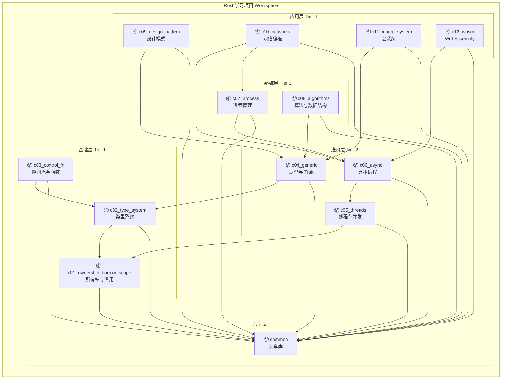
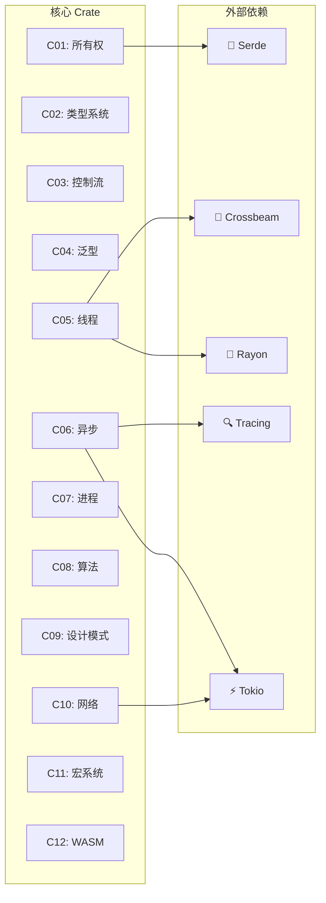
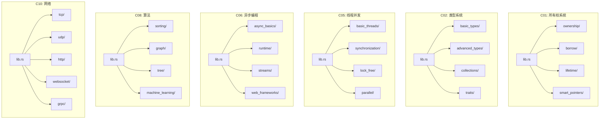
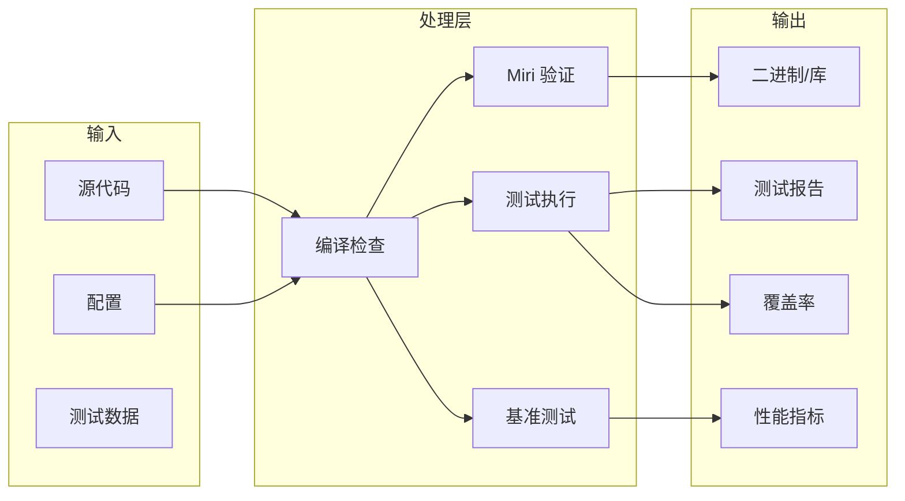
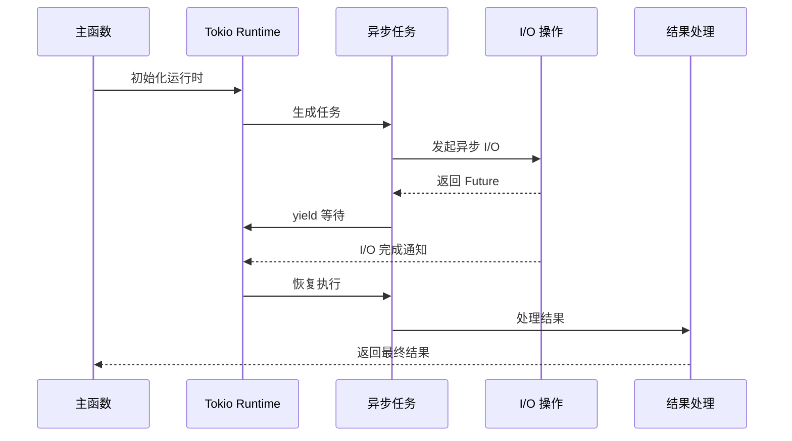

# Rust 学习项目架构文档

> **版本**: Rust 1.96.0  
> **Edition**: 2024  
> **最后更新**: 2026-04-10

---

## 目录

- [项目概述](#项目概述)
- [架构总览](#架构总览)
- [Crate 关系图](#crate-关系图)
- [模块依赖图](#模块依赖图)
- [数据流图](#数据流图)

---

## 项目概述

本项目是一个全面的 Rust 语言系统化学习资源，采用 Workspace 架构组织，包含 12 个核心学习 crate 和 1 个共享库 crate。

### 设计原则

1. **渐进式学习**: 从基础到高级，每个 crate 对应一个学习阶段
2. **独立可运行**: 每个 crate 都可以独立编译和运行
3. **共享抽象**: 通过 `common` crate 提供共享工具
4. **生产就绪**: 完整的测试、基准测试和文档

---

## 架构总览

---

## Crate 关系图

### 详细依赖关系

### Crate 特性矩阵

| Crate | 核心概念 | 外部依赖 | 特性标志 | 示例数量 |
|-------|----------|----------|----------|----------|
| c01_ownership | 所有权、借用、生命周期 | tokio, serde | - | 15+ |
| c02_type_system | 类型系统、泛型 | serde, tokio, futures | - | 20+ |
| c03_control_fn | 控制流、函数、异步 | tokio, tracing | async, std | 12+ |
| c04_generic | 泛型、Trait、GAT | rayon, itertools | - | 18+ |
| c05_threads | 并发、同步、锁 | crossbeam, rayon | std, tokio | 25+ |
| c06_async | 异步运行时、Future | tokio, actix-web, axum | full | 30+ |
| c07_process | 进程、IPC、信号 | nix, memmap2 | async, unix | 15+ |
| c08_algorithms | 算法、数据结构 | rayon, petgraph | bench | 40+ |
| c09_design_pattern | 设计模式 | tokio, rayon | obs-tracing | 20+ |
| c10_networks | 网络协议、WebSocket | tokio, tonic, rustls | tls, sniff | 25+ |
| c11_macro_system | 宏规则、过程宏 | syn, quote | serde_support | 10+ |
| c12_wasm | WebAssembly、WASI | wasm-bindgen, js-sys | ecosystem | 8+ |

---

## 模块依赖图

### 内部模块结构

---

## 数据流图

### 学习路径数据流

### 运行时数据流（以异步模块为例）

---

## 架构决策记录

### ADR-001: Workspace 结构

**状态**: 已接受

**决策**: 使用 Cargo Workspace 组织多个学习 crate。

**原因**:
- 允许独立版本控制
- 支持跨 crate 依赖
- 统一依赖管理
- 并行编译优化

### ADR-002: Common Crate

**状态**: 已接受

**决策**: 创建独立的 `common` crate 提供共享功能。

**原因**:
- 避免代码重复
- 统一错误处理
- 共享测试工具
- 可配置特性标志

### ADR-003: 渐进式特性

**状态**: 已接受

**决策**: 使用 Cargo features 控制高级功能。

**原因**:
- 减少编译时间
- 可选依赖管理
- 平台特定支持
- 灵活的功能组合

---

## 技术栈

### 核心运行时
- **Tokio**: 异步运行时 (v1.51+)
- **Rayon**: 数据并行 (v1.11+)
- **Crossbeam**: 并发原语 (v0.8+)

### 序列化
- **Serde**: 通用序列化 (v1.0+)
- **Serde JSON**: JSON 支持 (v1.0+)

### 网络
- **Hyper**: HTTP 底层 (v1.9+)
- **Tonic**: gRPC 框架 (v0.14+)
- **Tungstenite**: WebSocket (v0.29+)

### 日志与追踪
- **Tracing**: 结构化日志 (v0.1+)
- **Prometheus**: 指标收集 (v0.14+)

---

## 参考资料

- [Cargo Workspace 文档](https://doc.rust-lang.org/cargo/reference/workspaces.html)
- [Rust 模块系统](https://doc.rust-lang.org/book/ch07-00-managing-growing-projects-with-packages-crates-and-modules.html)
- [Tokio 运行时](https://tokio.rs/)
