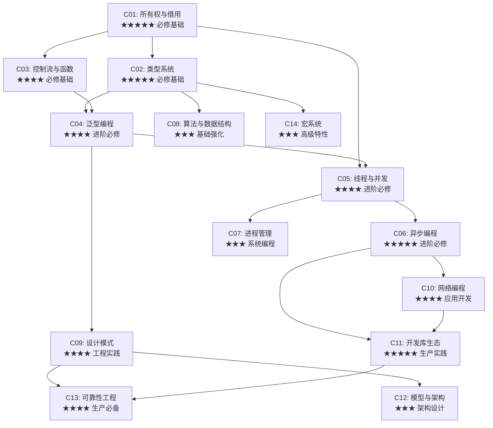

# 🗺️ Rust 学习系统 - 跨模块学习路线图

> **创建日期**: 2025-10-25  
> **文档版本**: v1.0  
> **适用范围**: 全部 14 个核心模块

---

## 📋 文档概述

本文档提供了一个**智能化的跨模块学习路线图**,帮助不同背景的学习者:

- 🎯 **理解模块间的依赖关系** - 知道先学什么,后学什么
- 🚀 **选择最适合的学习路径** - 根据目标定制学习计划
- 💡 **避免重复学习** - 识别模块间的知识重叠
- 🔗 **建立知识关联** - 理解概念如何跨模块连接

---

## 🎯 快速导航

### 按学习目标

| 目标 | 推荐路径 | 预计时间 | 难度 |
|------|---------|---------|------|
| 🌱 **Rust 入门** | [零基础入门路径](#路径1-零基础入门-8-12周) | 8-12周 | ⭐⭐ |
| 🚀 **快速上手** | [有经验开发者路径](#路径2-有经验开发者-4-6周) | 4-6周 | ⭐⭐⭐ |
| ⚡ **性能优化** | [性能工程师路径](#路径4-性能工程师专项) | 6-8周 | ⭐⭐⭐⭐ |
| 🔒 **安全编程** | [安全工程师路径](#路径5-安全工程师专项) | 6-8周 | ⭐⭐⭐⭐ |
| 🌐 **Web 开发** | [Web 开发者路径](#路径6-web-开发者专项) | 8-10周 | ⭐⭐⭐ |
| 🤖 **系统编程** | [系统程序员路径](#路径7-系统程序员专项) | 10-12周 | ⭐⭐⭐⭐⭐ |

### 按当前水平

| 水平 | 建议起点 | 核心模块 |
|------|---------|---------|
| 完全新手 | C01 → C02 → C03 | 前3个模块打基础 |
| 有编程经验 | C01 + C02 (快速) → C04/C05 | 重点理解 Rust 特色 |
| 其他语言专家 | C01 (核心概念) → 按需选择 | 对比学习,快速切换 |

---

## 🧩 模块依赖关系图

### 核心依赖图 (必修路径)



### 知识层级结构

```text
第一层：Rust 核心基础 (必修，3-4周)
┌─────────────────────────────────────┐
│  C01: 所有权与借用 (Week 1-2)        │  ← 最重要!
│  C02: 类型系统 (Week 2-3)           │  ← 最重要!
│  C03: 控制流与函数 (Week 3-4)        │
└─────────────────────────────────────┘
           ↓
第二层：高级语言特性 (进阶，3-4周)
┌─────────────────────────────────────┐
│  C04: 泛型编程 (Week 5-6)           │
│  C05: 线程与并发 (Week 7)           │
│  C06: 异步编程 (Week 8)             │
└─────────────────────────────────────┘
           ↓
第三层：实战应用方向 (选修，按需学习)
┌─────────────────────┬───────────────┐
│ 系统编程分支        │ 应用开发分支   │
├─────────────────────┼───────────────┤
│ C07: 进程管理       │ C10: 网络编程  │
│ C08: 算法数据结构   │ C11: 库生态    │
└─────────────────────┴───────────────┘
           ↓
第四层：工程与生产 (高级，6-8周)
┌─────────────────────────────────────┐
│  C09: 设计模式                      │
│  C12: 模型与架构                    │
│  C13: 可靠性工程                    │
│  C14: 宏系统                        │
└─────────────────────────────────────┘
```

---

## 🛤️ 详细学习路径

### 路径1: 零基础入门 (8-12周)

**适合人群**: 编程新手,或者第一次学习系统级编程语言

#### 阶段 1: Rust 基础 (Week 1-4) ★★★★★

**目标**: 掌握 Rust 核心概念,能编写简单程序

| 周次 | 模块 | 学习重点 | 实践任务 | 完成标准 |
|------|------|---------|---------|---------|
| Week 1 | **C01 Tier 1-2** | 所有权、借用基础 | 完成10个基础练习 | 理解所有权规则 |
| Week 2 | **C01 Tier 3 + C02 Tier 1** | 生命周期、类型基础 | 实现简单结构体 | 不再有借用错误 |
| Week 3 | **C02 Tier 2 + C03 Tier 1-2** | Trait、控制流 | 实现简单 CLI 工具 | 能用 match 和 ? |
| Week 4 | **C03 Tier 3 + 综合复习** | 闭包、错误处理 | 完整小项目(文件处理) | 独立完成300行程序 |

**学习检查点**:

- ✅ 能解释所有权的3条规则
- ✅ 能正确使用 `&` 和 `&mut`
- ✅ 理解生命周期标注的作用
- ✅ 能实现基本的 Trait
- ✅ 熟练使用 `Result` 和 `Option`

#### 阶段 2: 进阶特性 (Week 5-8) ★★★★

**目标**: 掌握泛型和并发,理解 Rust 高级特性

| 周次 | 模块 | 学习重点 | 实践任务 | 完成标准 |
|------|------|---------|---------|---------|
| Week 5 | **C04 Tier 1-2** | 泛型基础、关联类型 | 实现泛型数据结构 | 能写通用函数 |
| Week 6 | **C04 Tier 3 + C08 Tier 1** | 高级 Trait、基础算法 | 实现 Iterator | 理解 Trait bounds |
| Week 7 | **C05 Tier 1-2** | 线程、Arc/Mutex | 多线程程序 | 避免数据竞争 |
| Week 8 | **C06 Tier 1-2** | async/await 基础 | 异步 HTTP 客户端 | 能用 tokio |

**学习检查点**:

- ✅ 能写泛型函数和结构体
- ✅ 理解 Trait 边界和生命周期
- ✅ 能安全地使用多线程
- ✅ 理解 async/await 基本原理
- ✅ 能使用常见异步库

#### 阶段 3: 实战项目 (Week 9-12) ★★★

**目标**: 通过完整项目巩固知识

| 周次 | 项目 | 涉及模块 | 项目描述 |
|------|------|---------|---------|
| Week 9-10 | **Web API 服务** | C06, C10, C11 | 使用 axum 构建 REST API |
| Week 11 | **命令行工具** | C01-C04, C08 | 实现文件搜索/处理工具 |
| Week 12 | **个人选择项目** | 综合运用 | 根据兴趣选择方向 |

**项目建议**:

- 📝 待办事项 CLI (C01-C03)
- 🌐 简单 Web 服务器 (C06, C10)
- 📊 数据分析工具 (C08, C11)
- 🔧 系统监控工具 (C05, C07)

---

### 路径2: 有经验开发者 (4-6周)

**适合人群**: 熟悉 C++/Java/Go 等语言,想快速掌握 Rust

#### 快速通道 (Week 1-2) ★★★★

**策略**: 重点理解 Rust 与其他语言的差异

| 天数 | 学习内容 | 对比重点 | 实践 |
|------|---------|---------|------|
| Day 1-3 | **C01 全部** | vs. C++ RAII、引用 | 修正10个编译错误 |
| Day 4-5 | **C02 Tier 1-3** | vs. Java 接口、Go interface | 实现多态 |
| Day 6-7 | **C03 快速浏览** | vs. 其他语言闭包 | 使用闭包重构 |
| Day 8-10 | **C04 全部** | vs. C++ 模板、Java 泛型 | 实现泛型库 |
| Day 11-14 | **C05 + C06** | vs. Go goroutine、Java Thread | 并发/异步项目 |

#### 深入特定领域 (Week 3-6)

根据工作方向选择:

**方向 A: 后端开发** (推荐: C06 → C10 → C11 → C13)

- Week 3: C06 深入 + C10 Tier 1-2 (Web 框架)
- Week 4: C11 (数据库、缓存、消息队列)
- Week 5: C13 (可观测性、容错)
- Week 6: 实战: 完整微服务

**方向 B: 系统编程** (推荐: C07 → C08 → C13)

- Week 3: C07 全部 (进程、IPC)
- Week 4: C08 Tier 3-4 (高性能算法)
- Week 5: C13 Tier 4 (系统可靠性)
- Week 6: 实战: 高性能服务

**方向 C: 嵌入式/实时系统** (推荐: C05 → C07 → C08)

- Week 3: C05 Tier 3-4 (Lock-free)
- Week 4: C07 + 实时扩展
- Week 5: C08 性能优化
- Week 6: 实战: 实时数据处理

---

### 路径3: Rust 老手进阶 (按需学习)

**适合人群**: 已掌握 Rust 基础,需要深入特定领域

#### 专家级深入

| 专题 | 模块组合 | 学习目标 | 时间投入 |
|------|---------|---------|---------|
| **异步编程大师** | C06 Tier 4 + 实现自定义 Runtime | 理解 Future 内部机制 | 3-4周 |
| **并发专家** | C05 Tier 4 + Lock-free 算法 | 实现无锁数据结构 | 3-4周 |
| **类型系统专家** | C02 Tier 4 + C04 Tier 4 + C14 | 类型理论 + 宏编程 | 4-6周 |
| **系统架构师** | C09 + C12 + C13 全部 | 设计大型系统 | 4-6周 |
| **形式化验证** | C02/C13 Tier 4 | Prusti/Kani/Verus | 6-8周 |

---

### 路径4: 性能工程师专项

**目标**: 掌握 Rust 性能优化的所有技术

#### 学习路线 (6-8周)

```text
Week 1-2: 基础性能认知
├─ C01 Tier 3-4: 零拷贝、所有权优化
├─ C02 Tier 3: 零大小类型、内存布局
└─ C08 Tier 1-2: 算法复杂度分析

Week 3-4: 并发性能优化
├─ C05 Tier 3-4: 原子操作、Lock-free
├─ C06 Tier 3-4: 异步性能调优
└─ 实战: 高并发服务器

Week 5-6: 系统级优化
├─ C07 Tier 4: 进程池、零拷贝 IPC
├─ C10 Tier 3-4: io_uring、DPDK
└─ C08 Tier 4: SIMD、缓存优化

Week 7-8: 生产优化实践
├─ C13 Tier 3: 性能监控与分析
├─ 完整项目性能调优
└─ 性能测试与基准测试
```

**核心技能清单**:

- ✅ 零拷贝技术 (C01, C07, C10)
- ✅ Lock-free 编程 (C05)
- ✅ 异步优化 (C06)
- ✅ SIMD 向量化 (C08)
- ✅ 缓存友好设计 (C08)
- ✅ 内存布局优化 (C02)
- ✅ 性能分析工具 (C13)

---

### 路径5: 安全工程师专项

**目标**: 掌握 Rust 安全编程的最佳实践

#### 学习路线1 (6-8周)

```text
Week 1-2: 内存安全基础
├─ C01 全部: 所有权与内存安全
├─ C02 Tier 3-4: 类型安全、unsafe
└─ 实战: 识别和修复 unsafe 代码

Week 3-4: 并发安全
├─ C05 Tier 3-4: 数据竞争预防
├─ C06 Tier 3: async 安全模式
└─ 实战: 并发代码审计

Week 5-6: 系统安全
├─ C07 Tier 4: 权限隔离、沙箱
├─ C13 Tier 3-4: 容错与恢复
└─ 实战: 安全沙箱实现

Week 7-8: 形式化验证
├─ C02 Tier 4: Prusti 验证
├─ C13 Tier 4: Kani 模型检查
└─ 实战: 关键代码验证
```

**安全检查清单**:

- ✅ 避免所有 unsafe (或正确封装)
- ✅ 预防数据竞争
- ✅ 正确的错误处理
- ✅ 输入验证与边界检查
- ✅ 密码学最佳实践
- ✅ 依赖安全审计
- ✅ 形式化验证关键路径

---

### 路径6: Web 开发者专项

**目标**: 使用 Rust 构建高性能 Web 应用

#### 学习路线 (8-10周)

```text
Week 1-3: Rust 基础速成
├─ C01-C03: 快速掌握语法
├─ C04: 泛型与 Trait
└─ 目标: 能写基本 Rust 程序

Week 4-5: 异步编程
├─ C06 Tier 1-3: async/await、tokio
├─ C10 Tier 1-2: HTTP 基础
└─ 实战: 异步 HTTP 客户端

Week 6-7: Web 框架与生态
├─ C11 Web 部分: axum/actix-web
├─ C11 数据库部分: sqlx/diesel
├─ C11 序列化: serde
└─ 实战: REST API 服务

Week 8-9: 生产实践
├─ C09: Web 相关设计模式
├─ C13 Tier 1-3: 日志、监控、错误处理
└─ 实战: 完整 Web 应用

Week 10: 部署与运维
├─ C13 Tier 3: 容器化、CI/CD
└─ 项目部署上线
```

**技术栈**:

- Web 框架: axum / actix-web
- 数据库: sqlx / diesel
- 序列化: serde
- 模板: askama / tera
- 测试: 集成测试 + 单元测试

---

### 路径7: 系统程序员专项

**目标**: 使用 Rust 进行底层系统编程

#### 学习路线 (10-12周)

```text
Week 1-4: Rust 核心基础
├─ C01-C04: 全面掌握
├─ 重点: 生命周期、unsafe
└─ 目标: 完全理解内存模型

Week 5-6: 并发与进程
├─ C05 全部: 多线程编程
├─ C07 全部: 进程管理、IPC
└─ 实战: 进程池 + IPC 通信

Week 7-8: 系统接口
├─ C07 Tier 4: 系统调用、FFI
├─ C10 Tier 3: 底层网络
└─ 实战: 系统服务实现

Week 9-10: 高级优化
├─ C05 Tier 4: Lock-free
├─ C08 Tier 4: SIMD、缓存
└─ 实战: 高性能组件

Week 11-12: 可靠性工程
├─ C13 全部: 系统可靠性
├─ 完整系统项目
└─ 项目优化与部署
```

**核心技能**:

- ✅ unsafe Rust 的正确使用
- ✅ FFI 与 C 互操作
- ✅ 系统调用封装
- ✅ 进程/线程管理
- ✅ 内存映射与共享内存
- ✅ 信号处理
- ✅ 高性能 I/O (io_uring)

---

## 🔗 模块间知识关联

### 核心概念跨模块映射

| 概念 | 主要模块 | 相关模块 | 知识点连接 |
|------|---------|---------|-----------|
| **所有权** | C01 | C02, C04, C05 | 类型系统依赖所有权,泛型继承所有权规则 |
| **生命周期** | C01 | C04, C06 | 泛型中的生命周期参数,async 中的生命周期 |
| **Trait** | C02 | C04, C09 | 泛型约束,设计模式的基础 |
| **Send/Sync** | C02 | C05, C06 | 并发安全的类型系统保证 |
| **Future** | C06 | C10, C11 | 异步 I/O,Web 框架基础 |
| **错误处理** | C03 | 所有模块 | Result/Option 贯穿整个项目 |
| **智能指针** | C01 | C05, C09 | Arc/Mutex,设计模式中的应用 |
| **宏** | C14 | C02, C09, C11 | 代码生成,库 API 设计 |

### 技能依赖矩阵

```text
                C01 C02 C03 C04 C05 C06 C07 C08 C09 C10 C11 C12 C13 C14
              ┌────────────────────────────────────────────────────────┐
C01: 所有权    │  -   √   √   √   √   √   √   √   √   √   √   √   √   √  │
C02: 类型      │  √   -   √   √   √   √   -   √   √   -   √   √   √   √  │
C03: 控制流    │  √   √   -   √   √   √   √   √   √   √   √   √   √   -  │
C04: 泛型      │  √   √   √   -   √   √   -   √   √   -   √   √   √   √  │
C05: 线程      │  √   √   -   √   -   √   √   √   √   √   √   √   √   -  │
C06: 异步      │  √   √   √   √   √   -   √   -   √   √   √   √   √   -  │
C07: 进程      │  √   -   √   -   √   √   -   -   √   √   √   √   √   -  │
C08: 算法      │  √   √   √   √   √   -   -   -   √   -   √   √   √   -  │
C09: 模式      │  √   √   √   √   √   √   √   √   -   √   √   √   √   √  │
C10: 网络      │  √   √   √   -   √   √   √   -   √   -   √   √   √   -  │
C11: 库生态    │  √   √   √   √   √   √   √   √   √   √   -   √   √   √  │
C12: 架构      │  √   √   √   √   √   √   √   √   √   √   √   -   √   -  │
C13: 可靠性    │  √   √   √   √   √   √   √   √   √   √   √   √   -   -  │
C14: 宏系统    │  √   √   √   √   -   -   -   -   √   -   √   -   -   -  │
              └────────────────────────────────────────────────────────┘
              √ = 需要前置知识   - = 无强依赖
```

---

## 📊 学习进度追踪

### 自我评估表

#### 基础层 (C01-C03)

| 技能 | 未学习 | 了解 | 熟练 | 精通 | 验证方式 |
|------|-------|------|------|------|---------|
| 所有权规则 | ☐ | ☐ | ☐ | ☐ | 能解释为什么代码无法编译 |
| 借用检查器 | ☐ | ☐ | ☐ | ☐ | 无需反复编译就能写正确代码 |
| 生命周期标注 | ☐ | ☐ | ☐ | ☐ | 能为复杂函数添加正确生命周期 |
| Trait 系统 | ☐ | ☐ | ☐ | ☐ | 能实现自定义 Trait |
| 错误处理 | ☐ | ☐ | ☐ | ☐ | 能用 ? 和自定义错误类型 |
| 模式匹配 | ☐ | ☐ | ☐ | ☐ | 能用 match 处理复杂类型 |

#### 进阶层 (C04-C06)

| 技能 | 未学习 | 了解 | 熟练 | 精通 | 验证方式 |
|------|-------|------|------|------|---------|
| 泛型编程 | ☐ | ☐ | ☐ | ☐ | 能写泛型库 |
| 关联类型 | ☐ | ☐ | ☐ | ☐ | 理解与泛型参数的区别 |
| 多线程 | ☐ | ☐ | ☐ | ☐ | 能安全使用 Arc/Mutex |
| 异步编程 | ☐ | ☐ | ☐ | ☐ | 能用 tokio 写异步程序 |
| Future trait | ☐ | ☐ | ☐ | ☐ | 理解 Future 工作原理 |

#### 高级层 (C07-C14)

| 技能 | 未学习 | 了解 | 熟练 | 精通 | 验证方式 |
|------|-------|------|------|------|---------|
| 进程管理 | ☐ | ☐ | ☐ | ☐ | 能实现进程池 |
| IPC 通信 | ☐ | ☐ | ☐ | ☐ | 能用多种 IPC 机制 |
| 网络编程 | ☐ | ☐ | ☐ | ☐ | 能写 TCP/UDP 服务 |
| 设计模式 | ☐ | ☐ | ☐ | ☐ | 能在项目中应用模式 |
| 系统架构 | ☐ | ☐ | ☐ | ☐ | 能设计大型系统 |
| 可靠性工程 | ☐ | ☐ | ☐ | ☐ | 能实现容错机制 |
| 宏编程 | ☐ | ☐ | ☐ | ☐ | 能写声明宏和过程宏 |

### 里程碑检查点

#### 🏁 检查点 1: Rust 入门完成

**条件**:

- ✅ 完成 C01-C03 所有 Tier 1-2 内容
- ✅ 能独立写 300+ 行程序
- ✅ 理解所有权、借用、生命周期
- ✅ 熟练使用 Result 和 Option

**验证项目**: 实现一个命令行文件处理工具

#### 🏁 检查点 2: Rust 进阶达成

**条件**:

- ✅ 完成 C04-C06 所有内容
- ✅ 能写泛型库
- ✅ 能写多线程程序
- ✅ 能写异步程序

**验证项目**: 实现一个多线程 Web 爬虫

#### 🏁 检查点 3: Rust 专家水平

**条件**:

- ✅ 完成所有模块 Tier 1-3
- ✅ 能设计复杂系统
- ✅ 理解性能优化技术
- ✅ 掌握可靠性工程

**验证项目**: 实现一个完整的生产级应用

---

## 💡 学习策略建议

### 高效学习技巧

#### 1. 螺旋式学习法

```text
第一遍: 快速浏览 Tier 1 (了解概念)
   ↓
第二遍: 深入学习 Tier 2 (实践练习)
   ↓
第三遍: 研究 Tier 3 (深入理解)
   ↓
第四遍: 掌握 Tier 4 (专家级)
```

**优点**:

- 快速建立整体认知
- 及时实践避免遗忘
- 逐步深入避免挫折

#### 2. 项目驱动学习法

**步骤**:

1. 选择一个感兴趣的项目
2. 确定需要的模块知识
3. 针对性学习相关内容
4. 立即在项目中实践
5. 遇到问题再深入学习

**适合**: 有经验的开发者

#### 3. 对比学习法

如果你熟悉其他语言:

| Rust 概念 | 对应概念 | 关键差异 |
|----------|---------|---------|
| 所有权 | C++ RAII, Java GC | Rust 编译时检查 |
| 借用 | C++ 引用, Go 指针 | 借用检查器规则 |
| Trait | Java 接口, Go interface | 更强大的约束系统 |
| 生命周期 | - | Rust 独有,编译时保证 |
| async/await | JS Promise, C# async | 零成本抽象 |

#### 4. 刻意练习法

**每日练习计划**:

- 🌅 **早晨 30 分钟**: 阅读文档,理解新概念
- 💻 **中午 30 分钟**: 写小程序练习
- 🌙 **晚上 30 分钟**: 解决 Rustlings 或 Exercism 习题

### 避免的陷生误区

❌ **误区 1: 一开始就写大项目**

- ✅ 正确: 从小练习开始,逐步提升

❌ **误区 2: 只看不练**

- ✅ 正确: 每学一个概念就写代码验证

❌ **误区 3: 遇到错误就放弃**

- ✅ 正确: 借用检查器是最好的老师

❌ **误区 4: 跳过基础直接学高级**

- ✅ 正确: C01-C03 是必须的基础

❌ **误区 5: 不理解就用 clone()**

- ✅ 正确: 深入理解所有权后再优化

---

## 🎯 不同背景开发者的快速入口

### 来自 C/C++

**重点关注**:

- ✅ C01: 所有权 vs. RAII (相似但更严格)
- ✅ C02: 无 NULL,用 Option (最大差异)
- ✅ C05: 线程安全由类型系统保证 (比 C++ 安全)
- ⚠️ 需要改变: 手动内存管理的思维

**快速路径**: C01 (3天) → C02 (2天) → C05 (2天) → 其他按需

### 来自 Java/C#-

**重点关注**:

- ✅ C01: 无 GC,编译时内存管理 (核心差异)
- ✅ C02: Trait vs. Interface (更灵活)
- ✅ C04: 泛型没有类型擦除 (更高效)
- ⚠️ 需要改变: 依赖 GC 的设计思维

**快速路径**: C01 (4天) → C02 (3天) → C04 (2天) → C06 (异步与 Java 差异大)

### 来自 Python/JavaScript

**重点关注**:

- ✅ C01-C03: 静态类型系统 (最大挑战)
- ✅ C02: Trait 系统 (Python Protocol 的增强版)
- ✅ C06: async/await (JS Promise 的类似概念)
- ⚠️ 需要改变: 动态类型的思维,显式错误处理

**快速路径**: C01-C03 (按部就班,不可跳过,2周) → C06 (快速上手异步)

### 来自 Go

**重点关注**:

- ✅ C01: 所有权 vs. GC (核心差异)
- ✅ C02: Trait vs. interface (Rust 更复杂但更强大)
- ✅ C05: 类型系统保证并发安全 vs. goroutine (Rust 更安全)
- ✅ C06: async vs. goroutine (不同的并发模型)
- ⚠️ 需要改变: 依赖简单性的设计

**快速路径**: C01 (3天,重点理解) → C05 (2天,对比 goroutine) → C06 (3天,理解差异)

---

## 📚 补充学习资源

### 在线练习平台

1. **Rustlings** - 交互式练习
   - 网址: <https://github.com/rust-lang/rustlings>
   - 适合: 完成 C01-C03 后练习

2. **Exercism Rust Track** - 题库练习
   - 网址: <https://exercism.org/tracks/rust>
   - 适合: 各个阶段的练习

3. **Rust Quiz** - 深入理解
   - 网址: <https://dtolnay.github.io/rust-quiz>
   - 适合: 进阶学习者测试理解

### 实战项目建议

#### 初级项目 (C01-C03)

1. **待办事项 CLI** (Tier 1-2)
   - 文件 I/O、结构体、错误处理
   - 预计时间: 3-5 天

2. **文本统计工具** (Tier 2)
   - 字符串处理、HashMap、文件读取
   - 预计时间: 2-3 天

3. **Markdown 转 HTML** (Tier 2-3)
   - 解析、模式匹配、字符串处理
   - 预计时间: 5-7 天

#### 中级项目 (C04-C06)

1. **并发下载器** (C05 + C10)
   - 多线程、网络 I/O、进度条
   - 预计时间: 7-10 天

2. **异步聊天服务器** (C06 + C10)
   - tokio、TCP、消息广播
   - 预计时间: 10-14 天

3. **Web API 服务** (C06 + C11)
   - axum/actix-web、数据库、认证
   - 预计时间: 14-21 天

#### 高级项目 (C07-C13)

1. **分布式任务队列** (C05 + C06 + C10)
   - 消息队列、工作池、分布式协调
   - 预计时间: 21-30 天

2. **高性能代理服务器** (C06 + C10 + C13)
   - 异步 I/O、负载均衡、监控
   - 预计时间: 30-45 天

3. **微服务框架** (C09 + C11 + C12 + C13)
   - 服务发现、配置管理、可观测性
   - 预计时间: 45-60 天

---

## 🔄 学习路径调整建议

### 根据学习进度调整

#### 进度超前 (学得快)

**信号**:

- ✅ 每个模块提前完成
- ✅ 练习题全部正确
- ✅ 能扩展文档中的示例

**建议**:

- 跳到 Tier 4 学习高级主题
- 参与开源项目贡献
- 尝试更复杂的实战项目

#### 进度落后 (遇到困难)

**信号**:

- ❌ 反复修正编译错误
- ❌ 理解概念有困难
- ❌ 示例代码看不懂

**建议**:

- 放慢速度,回到 Tier 1
- 多做基础练习
- 查看更多示例代码
- 寻求社区帮助

### 根据目标调整

| 目标 | 最小模块集 | 可选模块 | 总时间 |
|------|-----------|---------|--------|
| 能写 Rust 程序 | C01-C03 | C04 | 4-6 周 |
| Web 后端开发 | C01-C04, C06, C10-C11 | C09, C13 | 8-10 周 |
| 系统编程 | C01-C05, C07-C08 | C13 | 10-12 周 |
| 完整掌握 Rust | 全部模块 | - | 20-24 周 |

---

## ✅ 学习完成标准

### 基础完成标准

**完成 C01-C03 后,你应该能够**:

- ✅ 解释所有权、借用、生命周期
- ✅ 独立编写 500+ 行程序
- ✅ 使用 Result/Option 处理错误
- ✅ 实现基本的 Trait
- ✅ 理解为什么代码无法编译

### 进阶完成标准

**完成 C01-C06 后,你应该能够**:

- ✅ 写泛型函数和数据结构
- ✅ 使用多线程并保证安全
- ✅ 编写异步程序
- ✅ 使用 tokio 等异步运行时
- ✅ 独立开发中型项目 (2000+ 行)

### 专家完成标准

**完成所有模块后,你应该能够**:

- ✅ 设计大型系统架构
- ✅ 进行性能优化
- ✅ 实现复杂的并发算法
- ✅ 贡献开源项目
- ✅ 指导其他 Rust 学习者

---

## 🎊 总结

### 核心建议

1. **打好基础**: C01-C03 是绝对的基础,不可跳过
2. **多写代码**: 理论+实践,每个概念都要写代码验证
3. **循序渐进**: 按照依赖关系学习,不要跳跃
4. **项目驱动**: 通过完整项目巩固知识
5. **持续学习**: Rust 生态在不断演进

### 学习周期参考

| 目标水平 | 总时间 | 每周投入 | 总投入时间 |
|---------|--------|---------|-----------|
| 入门 (C01-C03) | 4-6 周 | 10 小时 | 40-60 小时 |
| 进阶 (C01-C06) | 8-10 周 | 10 小时 | 80-100 小时 |
| 高级 (C01-C10) | 16-20 周 | 10 小时 | 160-200 小时 |
| 专家 (全部) | 24-30 周 | 10 小时 | 240-300 小时 |

### 成功的标志

当你可以:

- 🎯 独立设计和实现复杂项目
- 🎯 快速定位和解决编译错误
- 🎯 理解他人的 Rust 代码
- 🎯 参与 Rust 社区贡献
- 🎯 指导其他学习者

**恭喜你已经成为 Rust 专家!** 🎉

---

## 📞 获取更多帮助

### 项目内资源

- 📖 [主索引](../README.md) - 项目总览
- 🎓 [快速入门](../GETTING_STARTED.md) - 快速开始
- 📚 [文档索引](./MASTER_DOCUMENTATION_INDEX.md) - 完整文档列表
- 🚀 [实践项目路线图](./PRACTICAL_PROJECTS_ROADMAP_2025_10_20.md) - 项目建议

### 社区资源

- **Rust 官方论坛**: <https://users.rust-lang.org/>
- **Rust 中文社区**: <https://rustcc.cn/>
- **GitHub Discussions**: 本项目的讨论区
- **Stack Overflow**: `[rust]` 标签

---

**文档版本**: v1.0  
**创建日期**: 2025-10-25  
**维护状态**: 活跃维护  
**反馈渠道**: GitHub Issues

**祝学习愉快! 🦀**-
