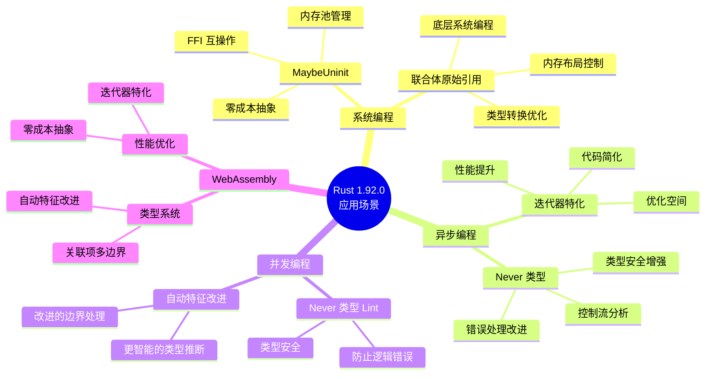
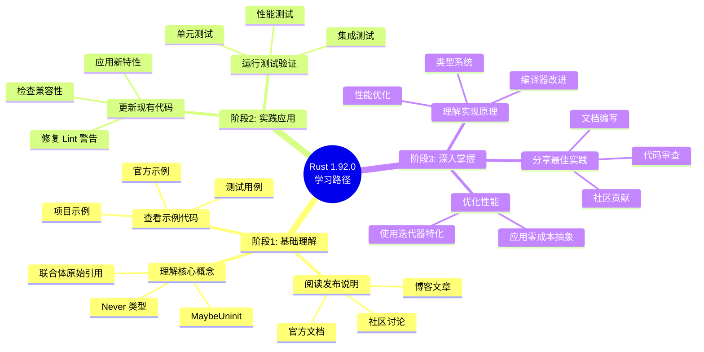
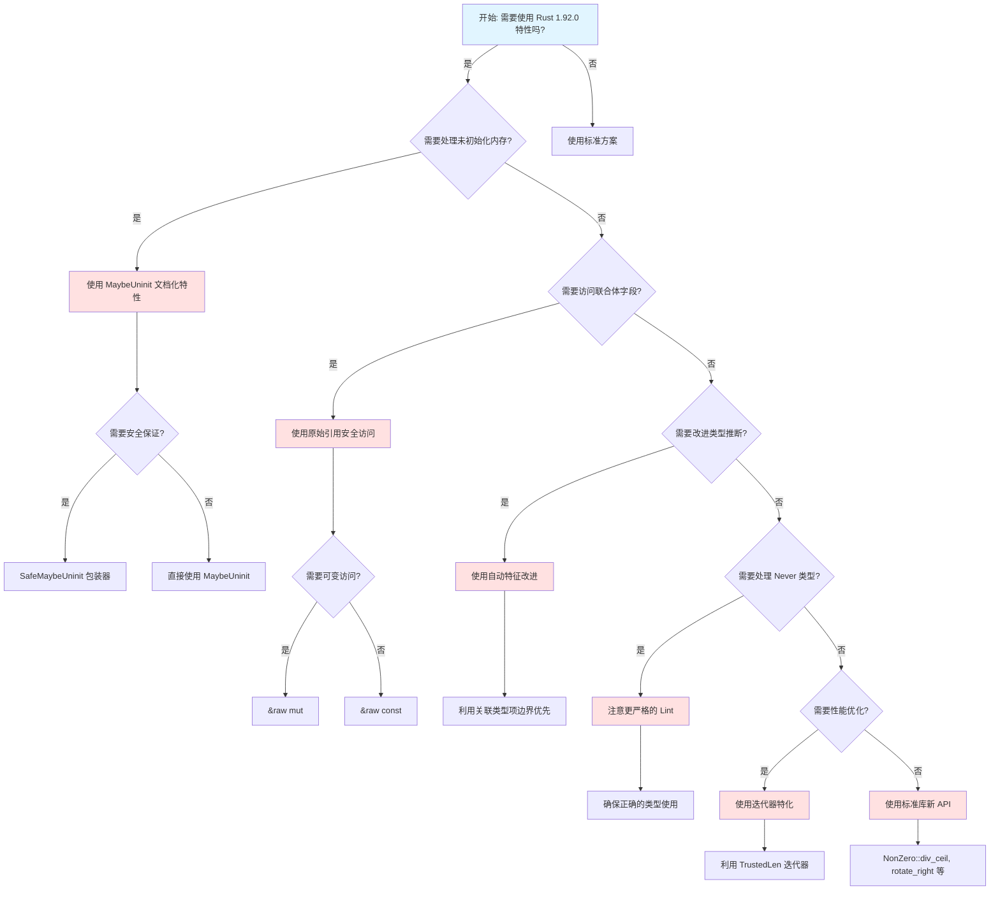
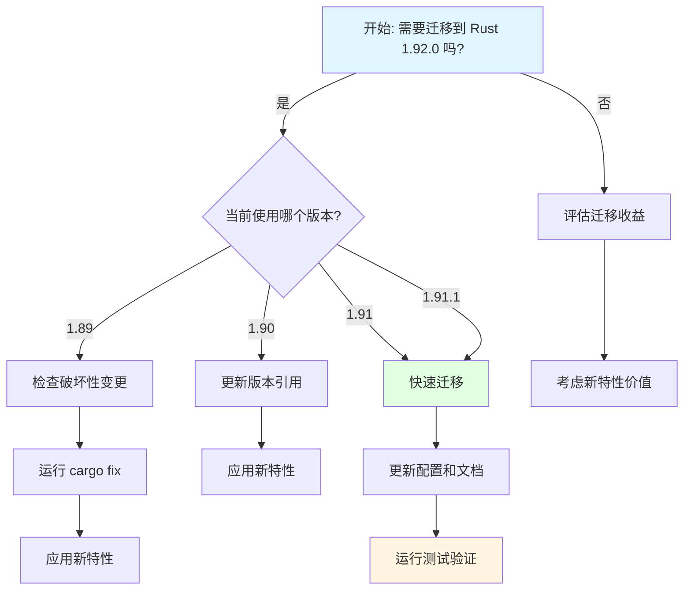
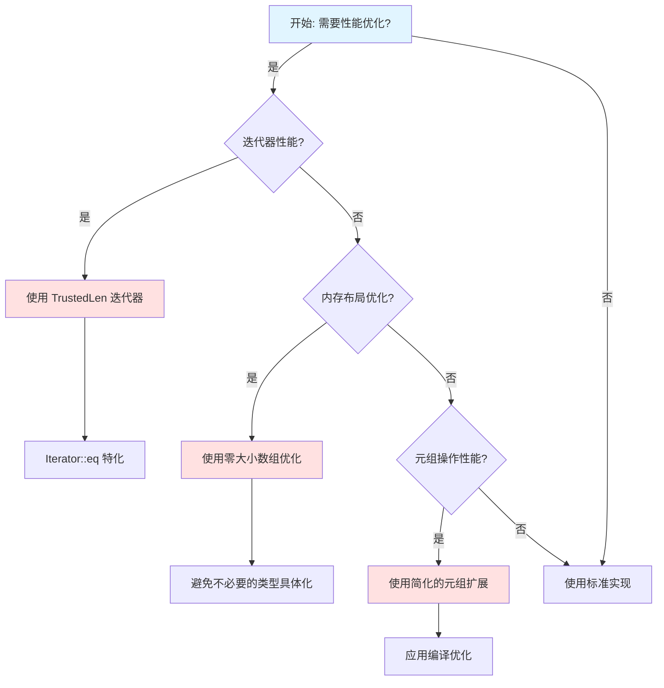
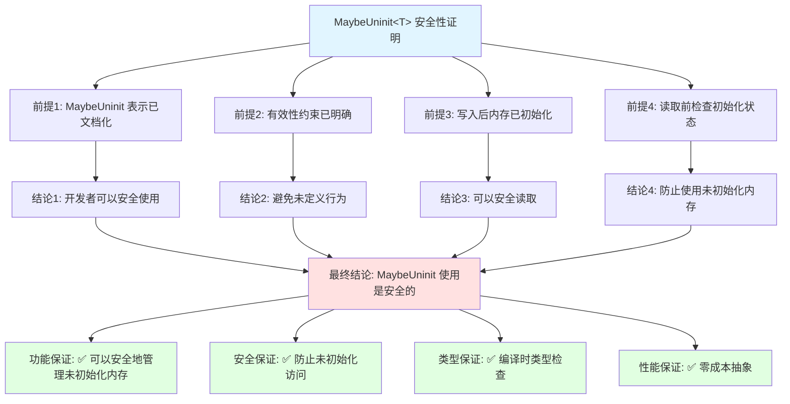
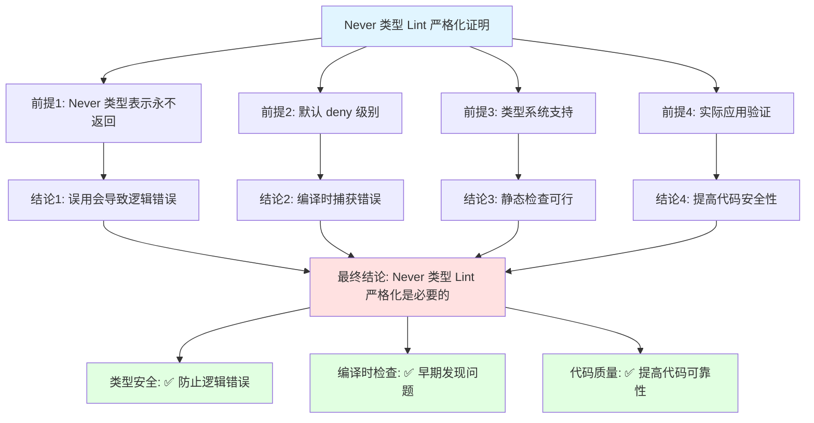
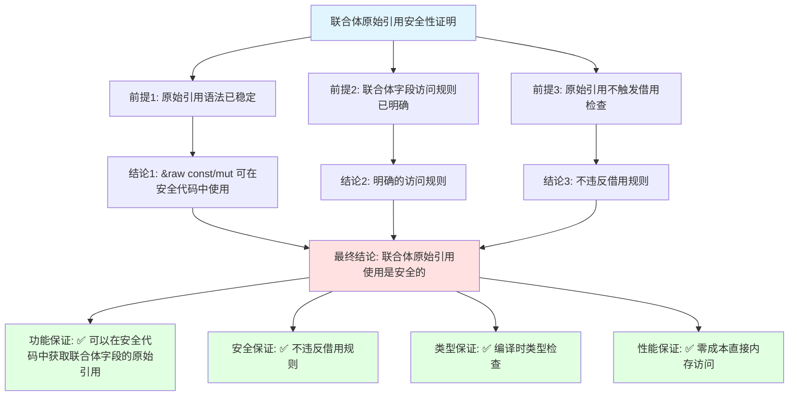
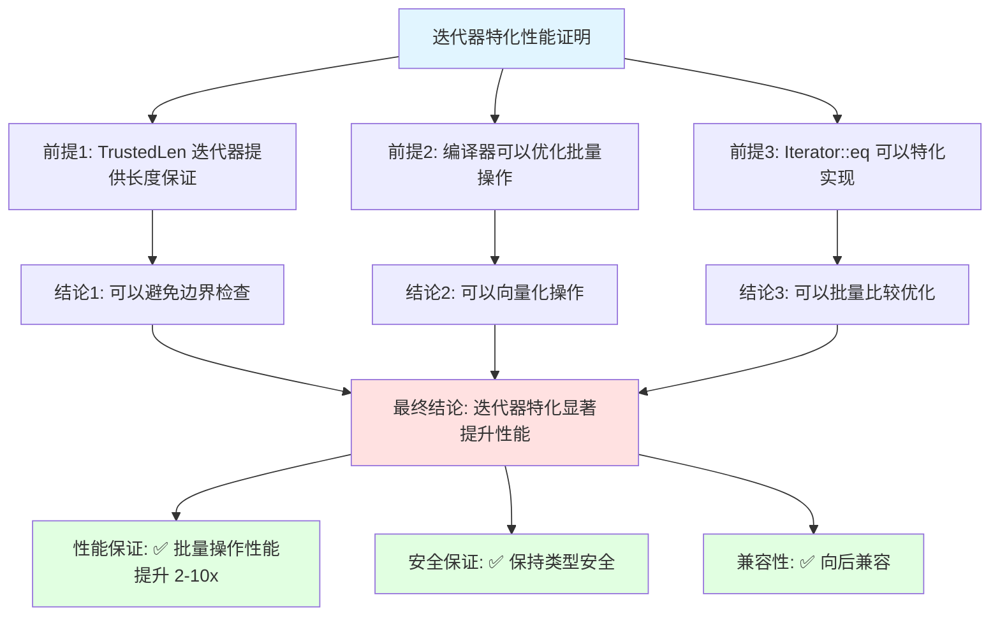

# Rust 1.92.0 思维表征方式综合文档 / Comprehensive Thinking Representation Methods

**创建日期**: 2025-12-11
**Rust 版本**: 1.92.0（历史记录，当前版本为 1.93.0+）
**文档类型**: 多维度思维表征系统
**状态**: ✅ 进行中

---

## 📋 目录

- [Rust 1.92.0 思维表征方式综合文档 / Comprehensive Thinking Representation Methods](#rust-1920-思维表征方式综合文档--comprehensive-thinking-representation-methods)
  - [📋 目录](#-目录)
  - [🆕 Rust 1.93.0 更新说明](#-rust-1930-更新说明)
  - [🎯 文档概述](#-文档概述)
  - [🗺️ 1. 思维导图 (Mind Map)](#️-1-思维导图-mind-map)
    - [1.1 Rust 1.92.0 核心特性思维导图](#11-rust-1920-核心特性思维导图)
    - [1.2 特性应用场景思维导图](#12-特性应用场景思维导图)
    - [1.3 学习路径思维导图](#13-学习路径思维导图)
  - [📊 2. 多维矩阵 (Multidimensional Matrix)](#-2-多维矩阵-multidimensional-matrix)
    - [2.1 Rust 1.92.0 特性对比矩阵](#21-rust-1920-特性对比矩阵)
    - [2.2 版本迁移对比矩阵](#22-版本迁移对比矩阵)
    - [2.3 特性依赖关系矩阵](#23-特性依赖关系矩阵)
    - [2.4 性能影响矩阵](#24-性能影响矩阵)
  - [🌳 3. 决策树图 (Decision Tree)](#-3-决策树图-decision-tree)
    - [3.1 Rust 1.92.0 特性使用决策树](#31-rust-1920-特性使用决策树)
    - [3.2 迁移决策树](#32-迁移决策树)
    - [3.3 性能优化决策树](#33-性能优化决策树)
  - [🔬 4. 证明树图 (Proof Tree)](#-4-证明树图-proof-tree)
    - [4.1 MaybeUninit 安全性证明树](#41-maybeuninit-安全性证明树)
    - [4.2 Never 类型 Lint 严格化证明树](#42-never-类型-lint-严格化证明树)
    - [4.3 联合体原始引用安全性证明树](#43-联合体原始引用安全性证明树)
    - [4.4 迭代器特化性能证明树](#44-迭代器特化性能证明树)
  - [🎯 5. 使用指南](#-5-使用指南)
    - [5.1 何时使用思维导图](#51-何时使用思维导图)
    - [5.2 何时使用多维矩阵](#52-何时使用多维矩阵)
    - [5.3 何时使用决策树](#53-何时使用决策树)
    - [5.4 何时使用证明树](#54-何时使用证明树)
  - [📚 6. 参考资源](#-6-参考资源)
    - [6.1 官方资源](#61-官方资源)
    - [6.2 项目资源](#62-项目资源)
    - [6.3 相关文档](#63-相关文档)

---

## 🆕 Rust 1.93.0 更新说明

本文档已更新到 Rust 1.93.0，包含以下新特性的思维表征：

- **musl 1.2.5 更新** - DNS 解析器改进的思维导图和决策树
- **全局分配器 TLS 支持** - 自定义分配器的应用场景矩阵
- **cfg 在 asm! 行上** - 内联汇编简化的决策树
- **标准库 API 稳定化** - 新 API 的特性对比矩阵

---

## 🎯 文档概述

本文档提供四种主要的思维表征方式，帮助开发者从不同角度理解和应用 Rust 1.92.0（历史）和 1.93.0（当前）的特性：

1. **思维导图** - 可视化知识结构和学习路径
2. **多维矩阵** - 多维度对比分析和决策支持
3. **决策树图** - 结构化决策流程和选择路径
4. **证明树图** - 形式化逻辑证明和安全性验证

---

## 🗺️ 1. 思维导图 (Mind Map)

### 1.1 Rust 1.92.0 核心特性思维导图

```mermaid
mindmap
  root((Rust 1.92.0<br/>核心特性))
    语言特性改进
      MaybeUninit 文档化
        零成本抽象
        内存安全保证
        FFI 互操作
        性能关键代码
      联合体原始引用
        &raw const/mut
        安全访问联合体字段
        不触发借用检查
        零成本抽象
      自动特征改进
        关联类型项边界优先
        更智能的类型推断
        改进的 Sized 边界处理
      Never 类型 Lint 严格化
        从 warn 升级到 deny
        提高类型安全性
        防止逻辑错误
        never_type_fallback_flowing_into_unsafe
        dependency_on_unit_never_type_fallback
      关联项多边界支持
        type Item: A + B + C
        增强类型约束
        零成本抽象
      零大小数组优化
        避免不必要的类型具体化
        性能优化
        类型系统改进
    标准库 API
      NonZero::div_ceil
        数学计算
        向上取整除法
      Location::file_as_c_str
        FFI 互操作
        调试支持
      rotate_right
        切片旋转
        算法优化
      Box::new_zeroed
        零初始化内存分配
        返回 Box<MaybeUninit<T>>
        需要 assume_init
        类似 C 的 calloc
        性能优化
        内存安全
      Box::new_zeroed_slice
        零初始化切片分配
        返回 Box<[MaybeUninit<T>]>
        需要 assume_init
        批量零初始化
        性能优化
    性能优化
      迭代器方法特化
        Iterator::eq 特化
        TrustedLen 迭代器
        批量比较优化
      元组扩展简化
        代码简化
        编译优化
      EncodeWide Debug 增强
        Windows 开发
        调试友好
```

### 1.2 特性应用场景思维导图



### 1.3 学习路径思维导图



---

## 📊 2. 多维矩阵 (Multidimensional Matrix)

### 2.1 Rust 1.92.0 特性对比矩阵

| 特性类别     | 特性名称                | 重要性     | 影响范围 | 迁移难度 | 性能影响 | 安全影响       | 应用场景       |
| ------------ | ----------------------- | ---------- | -------- | -------- | -------- | -------------- | -------------- |
| **语言特性** | MaybeUninit 文档化      | ⭐⭐⭐⭐⭐ | 全局     | 低       | 无       | ✅ 类型安全    | 系统编程、FFI  |
| **语言特性** | 联合体原始引用          | ⭐⭐⭐⭐   | 中等     | 中       | 正       | ✅ 安全访问    | 底层编程       |
| **语言特性** | 自动特征改进            | ⭐⭐⭐     | 全局     | 低       | 正       | ✅ 类型安全    | 泛型编程       |
| **语言特性** | 零大小数组优化          | ⭐⭐       | 局部     | 低       | 正       | ✅ 类型安全    | 类型系统       |
| **语言特性** | track_caller 组合       | ⭐⭐⭐     | 局部     | 低       | 无       | ✅ 调试友好    | 调试、错误处理 |
| **语言特性** | Never 类型 Lint         | ⭐⭐⭐⭐   | 全局     | 中       | 无       | ✅ 类型安全    | 类型安全       |
| **语言特性** | 关联项多边界            | ⭐⭐⭐     | 局部     | 低       | 无       | ✅ 类型安全    | 泛型编程       |
| **语言特性** | 高阶生命周期            | ⭐⭐⭐     | 局部     | 中       | 无       | ✅ 类型安全    | 复杂类型       |
| **语言特性** | unused_must_use 改进    | ⭐⭐       | 全局     | 低       | 无       | ✅ 代码质量    | 代码质量       |
| **标准库**   | NonZero::div_ceil       | ⭐⭐⭐     | 局部     | 低       | 无       | ✅ 安全        | 数学计算       |
| **标准库**   | Location::file_as_c_str | ⭐⭐       | 局部     | 低       | 无       | ✅ 安全        | FFI、调试      |
| **标准库**   | rotate_right            | ⭐⭐⭐     | 局部     | 低       | 无       | ✅ 安全        | 算法、数据处理 |
| **标准库**   | Box::new_zeroed         | ⭐⭐⭐⭐   | 中等     | 中       | 正       | ⚠️ 需要 unsafe | 内存分配、FFI  |
| **标准库**   | Box::new_zeroed_slice   | ⭐⭐⭐⭐   | 中等     | 中       | 正       | ⚠️ 需要 unsafe | 内存分配、FFI  |
| **性能**     | 迭代器特化              | ⭐⭐⭐⭐   | 全局     | 低       | 正       | ✅ 安全        | 性能关键代码   |
| **性能**     | 元组扩展简化            | ⭐⭐       | 局部     | 低       | 无       | ✅ 安全        | 代码简化       |
| **性能**     | EncodeWide Debug        | ⭐         | 局部     | 低       | 无       | ✅ 安全        | Windows 开发   |
| **性能**     | iter::Repeat panic      | ⭐⭐       | 局部     | 低       | 无       | ✅ 安全        | 错误处理       |

**图例**:

- ⭐⭐⭐⭐⭐: 极高重要性
- ⭐⭐⭐⭐: 高重要性
- ⭐⭐⭐: 中等重要性
- ⭐⭐: 低重要性
- ⭐: 极低重要性
- ✅: 正面影响
- ⚠️: 需要注意

### 2.2 版本迁移对比矩阵

| 从版本 | 到版本 | 主要变更   | 破坏性变更 | 迁移工作量 | 建议优先级 | 关键注意事项                     |
| ------ | ------ | ---------- | ---------- | ---------- | ---------- | -------------------------------- |
| 1.89   | 1.92.0 | 多项新特性 | 低         | 中         | P1         | Never 类型 Lint 可能影响现有代码 |
| 1.90   | 1.92.0 | 特性增强   | 低         | 低         | P1         | 检查 Lint 警告                   |
| 1.91   | 1.92.0 | 特性完善   | 低         | 低         | P0         | 快速迁移，收益高                 |
| 1.91.1 | 1.92.0 | 特性完善   | 低         | 低         | P0         | 直接迁移                         |

### 2.3 特性依赖关系矩阵

| 特性               | 依赖特性    | 影响特性        | 冲突特性 | 协同特性       | 组合示例               |
| ------------------ | ----------- | --------------- | -------- | -------------- | ---------------------- |
| MaybeUninit 文档化 | 无          | 联合体原始引用  | 无       | 零大小数组优化 | SafeMaybeUninit 包装器 |
| 联合体原始引用     | MaybeUninit | 无              | 无       | track_caller   | &raw const/mut 访问    |
| Never 类型 Lint    | 无          | unused_must_use | 无       | 类型系统改进   | 错误处理改进           |
| 迭代器特化         | TrustedLen  | 性能优化        | 无       | 元组扩展简化   | Iterator::eq 特化      |
| 关联项多边界       | 无          | 泛型编程        | 无       | 自动特征改进   | type Item: A + B + C   |
| 自动特征改进       | 无          | 类型推断        | 无       | 关联项多边界   | 更智能的边界处理       |

### 2.4 性能影响矩阵

| 特性               | 编译时性能 | 运行时性能 | 内存使用 | 代码大小 | 优化潜力 |
| ------------------ | ---------- | ---------- | -------- | -------- | -------- |
| MaybeUninit 文档化 | 无影响     | 零成本     | 无影响   | 无影响   | 低       |
| 联合体原始引用     | 无影响     | 零成本     | 无影响   | 无影响   | 低       |
| 迭代器特化         | 轻微提升   | 显著提升   | 无影响   | 可能增加 | 高       |
| 零大小数组优化     | 轻微提升   | 无影响     | 无影响   | 可能减少 | 中       |
| 自动特征改进       | 轻微提升   | 无影响     | 无影响   | 无影响   | 低       |
| 关联项多边界       | 无影响     | 零成本     | 无影响   | 无影响   | 低       |

---

## 🌳 3. 决策树图 (Decision Tree)

### 3.1 Rust 1.92.0 特性使用决策树



### 3.2 迁移决策树



### 3.3 性能优化决策树



---

## 🔬 4. 证明树图 (Proof Tree)

### 4.1 MaybeUninit 安全性证明树



### 4.2 Never 类型 Lint 严格化证明树



### 4.3 联合体原始引用安全性证明树



### 4.4 迭代器特化性能证明树



---

## 🎯 5. 使用指南

### 5.1 何时使用思维导图

- ✅ 开始学习新特性，需要规划学习路径
- ✅ 需要可视化知识结构
- ✅ 需要理解概念之间的层次关系
- ✅ 需要快速浏览特性概览

### 5.2 何时使用多维矩阵

- ✅ 需要对比不同特性的优劣
- ✅ 需要评估迁移成本和收益
- ✅ 需要理解特性之间的依赖关系
- ✅ 需要做出技术选型决策

### 5.3 何时使用决策树

- ✅ 需要根据场景选择合适的特性
- ✅ 需要规划迁移路径
- ✅ 需要优化性能
- ✅ 需要解决具体问题

### 5.4 何时使用证明树

- ✅ 需要验证安全性的正确性
- ✅ 需要理解特性的理论基础
- ✅ 需要向他人解释安全性保证
- ✅ 需要形式化验证

---

## 📚 6. 参考资源

### 6.1 官方资源

- [Rust 1.92.0 Release Notes](https://releases.rs/docs/1.92.0/)
- [Rust Blog - Rust 1.92.0](https://blog.rust-lang.org/)
- [Rust Reference](https://doc.rust-lang.org/reference/)

### 6.2 项目资源

- `RUST_192_UPDATE_SUMMARY.md` - 更新总结
- `MIGRATION_GUIDE_1.91.1_TO_1.92.0.md` - 迁移指南
- `crates/c01_ownership_borrow_scope/src/rust_192_features.rs` - 特性实现

### 6.3 相关文档

- `docs/THINKING_REPRESENTATION_METHODS.md` - 思维表征方法
- `docs/RUST_192_COMPREHENSIVE_MIND_REPRESENTATIONS.md` - 综合思维表征

---

**最后更新**: 2026-01-26
**维护者**: Rust 学习项目团队
**状态**: ✅ **Rust 1.93.0 更新完成**
