# 跨领域边界模式：系统边界设计的通用模式研究

## 目录

- [跨领域边界模式：系统边界设计的通用模式研究](#跨领域边界模式系统边界设计的通用模式研究)
  - [目录](#目录)
  - [引言：跨领域边界模式的意义](#引言跨领域边界模式的意义)
  - [边界模式的理论基础](#边界模式的理论基础)
    - [模式语言与边界设计](#模式语言与边界设计)
    - [形式化模式表达](#形式化模式表达)
    - [模式分类框架](#模式分类框架)
  - [基础边界模式](#基础边界模式)
    - [防腐层模式](#防腐层模式)
    - [适配器模式](#适配器模式)
    - [边界接口模式](#边界接口模式)
    - [代理边界模式](#代理边界模式)
  - [数据转换边界模式](#数据转换边界模式)
    - [规范模型转换模式](#规范模型转换模式)
    - [投影映射模式](#投影映射模式)
    - [状态转换管道模式](#状态转换管道模式)
    - [协议转换模式](#协议转换模式)
  - [安全与控制边界模式](#安全与控制边界模式)
    - [边界卫士模式](#边界卫士模式)
    - [沙箱隔离模式](#沙箱隔离模式)
    - [权限转换模式](#权限转换模式)
    - [审计边界模式](#审计边界模式)
  - [跨维度边界模式](#跨维度边界模式)
    - [维度投影模式](#维度投影模式)
    - [维度交叉处理模式](#维度交叉处理模式)
    - [多维度协同模式](#多维度协同模式)
  - [通用边界模式的Rust实现](#通用边界模式的rust实现)
    - [类型驱动的边界模式](#类型驱动的边界模式)
    - [所有权系统中的边界模式](#所有权系统中的边界模式)
    - [代码示例：边界模式库](#代码示例边界模式库)
  - [领域特定边界模式的适应性](#领域特定边界模式的适应性)
    - [从通用到特定的转化策略](#从通用到特定的转化策略)
    - [领域适应性验证方法](#领域适应性验证方法)
  - [跨领域边界模式的应用案例](#跨领域边界模式的应用案例)
    - [软件架构领域](#软件架构领域)
    - [系统集成领域](#系统集成领域)
    - [数据科学领域](#数据科学领域)
    - [分布式系统领域](#分布式系统领域)
  - [未来展望](#未来展望)
    - [自适应边界模式](#自适应边界模式)
    - [智能边界模式发现](#智能边界模式发现)
    - [形式化模式验证](#形式化模式验证)
  - [总结与思维导图](#总结与思维导图)

## 引言：跨领域边界模式的意义

系统边界是现代软件和系统设计中不可或缺的概念，它在不同领域中以各种形式出现：
从软件架构中的层次和模块边界，到微服务中的服务边界，再到数据科学中的数据转换边界。
尽管这些边界的具体表现形式各不相同，但它们在本质上共享着许多共通的设计模式和解决方案。

跨领域边界模式研究旨在识别、形式化和应用这些通用模式，使设计者能够跨领域地借鉴经验和解决方案。
这种跨领域的知识迁移不仅可以加速设计过程，还能提高设计质量和系统鲁棒性。
通过形式化的方式表达这些模式，我们可以更精确地理解它们的适用条件、实现方法和预期效果，
从而支持更严谨的系统设计和验证。

## 边界模式的理论基础

### 模式语言与边界设计

模式语言为边界设计提供了描述和交流的共同词汇：

```math
定义：边界模式是针对系统边界设计中反复出现的问题的可重用解决方案，
包含问题描述、解决方案、适用条件和后果影响等要素。
```

模式语言的核心要素包括：

- **模式名称**：提供简洁而有意义的标识
- **问题描述**：明确该模式要解决的具体问题
- **背景**：描述模式适用的环境和条件
- **解决方案**：提供问题的抽象解决方法
- **结构**：描述解决方案的组成部分及其关系
- **后果**：分析采用该模式的影响和权衡
- **相关模式**：与其他模式的关系和组合方式

### 形式化模式表达

为了使边界模式更加精确和可验证，我们可以采用形式化方法表达模式：

```haskell
-- 模式的形式化描述
data Pattern = Pattern {
    name :: String,
    problem :: Problem,
    context :: Context,
    solution :: Solution,
    consequences :: [Consequence],
    relatedPatterns :: [Relation]
}

-- 问题描述
data Problem = Problem {
    forces :: [Force],
    constraints :: [Constraint]
}

-- 解决方案
data Solution = Solution {
    structure :: Structure,
    behavior :: Behavior,
    implementation :: Implementation
}

-- 模式关系
data Relation = Relation {
    relatedPattern :: Pattern,
    relationType :: RelationType
}

data RelationType = Uses | Refines | Conflicts | Complements
```

形式化表达有助于：

- 精确定义模式的语义
- 支持模式的自动分析和验证
- 促进模式库的规范化和工具化

### 模式分类框架

为了系统性地组织边界模式，我们提出以下分类框架：

```rust
// 模式分类框架
enum PatternCategory {
    // 按目的分类
    Purpose(PurposeCategory),
    // 按结构分类
    Structure(StructureCategory),
    // 按行为分类
    Behavior(BehaviorCategory),
    // 按应用领域分类
    Domain(DomainCategory),
    // 按抽象层次分类
    AbstractionLevel(AbstractionLevelCategory),
}

// 目的分类
enum PurposeCategory {
    Transformation,     // 转换模式
    Protection,         // 保护模式
    Integration,        // 集成模式
    Adaptation,         // 适应模式
    Coordination,       // 协调模式
}

// 结构分类
enum StructureCategory {
    Layer,              // 层次结构模式
    Component,          // 组件结构模式
    Connector,          // 连接器模式
    Composite,          // 复合结构模式
}

// 行为分类
enum BehaviorCategory {
    Synchronous,        // 同步行为模式
    Asynchronous,       // 异步行为模式
    Reactive,           // 响应式模式
    Proactive,          // 主动式模式
}
```

这种多维度分类框架有助于设计者快速找到适合特定问题情境的边界模式。

## 基础边界模式

### 防腐层模式

防腐层（Anti-corruption Layer, ACL）是一种常见的边界模式，用于隔离两个不同上下文或系统：

```rust
// 防腐层模式的形式化表示
struct AntiCorruptionLayer<ExternalModel, InternalModel> {
    // 将外部模型转换为内部模型
    translator: Box<dyn Fn(ExternalModel) -> InternalModel>,
    // 将内部模型转换为外部模型
    reverse_translator: Box<dyn Fn(InternalModel) -> ExternalModel>,
    // 适配外部服务接口
    service_adapters: HashMap<String, Box<dyn ServiceAdapter>>,
}

impl<E, I> AntiCorruptionLayer<E, I> {
    // 创建新的防腐层
    fn new(
        translator: Box<dyn Fn(E) -> I>,
        reverse_translator: Box<dyn Fn(I) -> E>,
    ) -> Self {
        Self {
            translator,
            reverse_translator,
            service_adapters: HashMap::new(),
        }
    }
    
    // 注册服务适配器
    fn register_adapter<S: ServiceAdapter + 'static>(&mut self, name: &str, adapter: S) {
        self.service_adapters.insert(name.to_string(), Box::new(adapter));
    }
    
    // 转换从外部到内部
    fn translate_inward(&self, external: E) -> I {
        (self.translator)(external)
    }
    
    // 转换从内部到外部
    fn translate_outward(&self, internal: I) -> E {
        (self.reverse_translator)(internal)
    }
}

// 服务适配器特质
trait ServiceAdapter {
    type Request;
    type Response;
    
    fn adapt_request(&self, request: Self::Request) -> Vec<u8>;
    fn adapt_response(&self, response: Vec<u8>) -> Self::Response;
}
```

防腐层模式的适用场景：

- 与遗留系统集成时保护新系统的模型完整性
- 与第三方服务集成时隔离外部依赖
- 在不同领域模型之间建立清晰的边界

### 适配器模式

适配器模式用于转换不兼容接口，使其可以协同工作：

```rust
// 适配器模式形式化表示
trait TargetInterface {
    fn request(&self) -> String;
}

struct Adaptee {
    // 已有的不兼容接口
    fn specific_request(&self) -> String {
        "Adaptee's specific request".to_string()
    }
}

struct Adapter {
    adaptee: Adaptee,
}

impl TargetInterface for Adapter {
    fn request(&self) -> String {
        // 转换接口调用
        let specific_result = self.adaptee.specific_request();
        format!("Adapter: (TRANSLATED) {}", specific_result)
    }
}
```

适配器模式的跨领域应用：

- 软件架构：适配不同组件间的接口
- 数据集成：转换不同数据源格式
- API设计：提供向后兼容的接口变更

### 边界接口模式

边界接口模式定义了系统边界处的标准化交互约定：

```rust
// 边界接口模式形式化表示
trait BoundaryInterface<I, O> {
    // 接口方法定义
    fn process(&self, input: I) -> Result<O, BoundaryError>;
    
    // 边界描述
    fn get_boundary_descriptor(&self) -> BoundaryDescriptor;
}

struct BoundaryDescriptor {
    name: String,
    version: String,
    supported_protocols: Vec<String>,
    documentation_url: String,
}

// 具体边界接口实现
struct ConcreteInterface<I, O> {
    processor: Box<dyn Fn(I) -> Result<O, BoundaryError>>,
    descriptor: BoundaryDescriptor,
}

impl<I, O> BoundaryInterface<I, O> for ConcreteInterface<I, O> {
    fn process(&self, input: I) -> Result<O, BoundaryError> {
        (self.processor)(input)
    }
    
    fn get_boundary_descriptor(&self) -> BoundaryDescriptor {
        self.descriptor.clone()
    }
}
```

边界接口模式的关键特性：

- 明确定义系统边界处的交互协议
- 屏蔽内部实现细节
- 支持版本化和演化

### 代理边界模式

代理边界模式在边界处提供间接访问机制：

```rust
// 代理边界模式形式化表示
trait Subject {
    fn request(&self) -> Result<Response, Error>;
}

struct RealSubject {
    // 实际处理请求的组件
}

impl Subject for RealSubject {
    fn request(&self) -> Result<Response, Error> {
        // 实际处理逻辑
        Ok(Response::new())
    }
}

struct BoundaryProxy {
    real_subject: Option<RealSubject>,
    // 边界策略
    boundary_policy: BoundaryPolicy,
}

impl Subject for BoundaryProxy {
    fn request(&self) -> Result<Response, Error> {
        // 边界处理逻辑
        if !self.boundary_policy.allow_request() {
            return Err(Error::AccessDenied);
        }
        
        // 延迟初始化
        let subject = match &self.real_subject {
            Some(s) => s,
            None => {
                // 初始化实际主体
                let s = RealSubject::new();
                self.real_subject = Some(s);
                self.real_subject.as_ref().unwrap()
            }
        };
        
        // 前置处理
        self.boundary_policy.before_request();
        
        // 调用真实主体
        let result = subject.request();
        
        // 后置处理
        self.boundary_policy.after_request(&result);
        
        result
    }
}

struct BoundaryPolicy {
    // 边界策略实现
    fn allow_request(&self) -> bool { /* ... */ }
    fn before_request(&self) { /* ... */ }
    fn after_request(&self, result: &Result<Response, Error>) { /* ... */ }
}
```

代理边界模式的应用：

- 远程服务访问的本地代理
- 缓存代理提高跨边界访问性能
- 访问控制代理实施安全策略

## 数据转换边界模式

### 规范模型转换模式

规范模型转换模式使用中间规范模型实现不同数据模型间的转换：

```rust
// 规范模型转换模式形式化表示
struct CanonicalDataModel {
    // 规范模型定义
    schema: Schema,
    validators: Vec<Box<dyn Validator>>,
}

// 模型转换器接口
trait ModelTransformer<S, T> {
    fn transform(&self, source: &S) -> Result<T, TransformError>;
}

// 基于规范模型的转换器
struct CanonicalModelTransformer<S, C, T> {
    // 源模型到规范模型的转换
    source_to_canonical: Box<dyn ModelTransformer<S, C>>,
    // 规范模型到目标模型的转换
    canonical_to_target: Box<dyn ModelTransformer<C, T>>,
    // 规范模型
    canonical_model: CanonicalDataModel,
}

impl<S, C, T> ModelTransformer<S, T> for CanonicalModelTransformer<S, C, T> {
    fn transform(&self, source: &S) -> Result<T, TransformError> {
        // 转换到规范模型
        let canonical = self.source_to_canonical.transform(source)?;
        
        // 验证规范模型
        for validator in &self.canonical_model.validators {
            validator.validate(&canonical)?;
        }
        
        // 转换到目标模型
        self.canonical_to_target.transform(&canonical)
    }
}
```

规范模型转换模式的优势：

- 减少 N×M 问题为 N+M 问题
- 提供一致的数据验证机制
- 支持系统演化时的灵活适应

### 投影映射模式

投影映射模式通过选择性地映射属性实现跨边界数据转换：

```rust
// 投影映射模式形式化表示
struct ProjectionMap<S, T> {
    // 字段映射规则
    field_mappings: Vec<FieldMapping<S, T>>,
    // 默认值提供者
    default_providers: HashMap<String, Box<dyn Fn() -> FieldValue>>,
}

struct FieldMapping<S, T> {
    source_field: Field<S>,
    target_field: Field<T>,
    transformer: Option<Box<dyn Fn(FieldValue) -> FieldValue>>,
}

impl<S, T> ProjectionMap<S, T> {
    // 执行投影映射
    fn project(&self, source: &S) -> Result<T, ProjectionError> {
        let mut target = T::new();
        
        // 应用字段映射
        for mapping in &self.field_mappings {
            // 获取源字段值
            let source_value = mapping.source_field.get_value(source)?;
            
            // 应用转换（如果存在）
            let target_value = match &mapping.transformer {
                Some(transform) => transform(source_value),
                None => source_value,
            };
            
            // 设置目标字段
            mapping.target_field.set_value(&mut target, target_value)?;
        }
        
        // 应用默认值
        for (field_name, provider) in &self.default_providers {
            if !target.has_field(field_name) {
                target.set_field(field_name, provider())?;
            }
        }
        
        Ok(target)
    }
}
```

投影映射模式的应用场景：

- DTO转换：在表示层和应用层之间转换数据
- 数据集成：映射不同系统间的数据字段
- 领域转换：在不同限界上下文间映射实体

### 状态转换管道模式

状态转换管道模式通过有序的转换步骤处理跨边界的状态变化：

```rust
// 状态转换管道模式形式化表示
struct StatePipeline<S> {
    // 转换阶段
    stages: Vec<Box<dyn StateTransformer<S>>>,
    // 错误处理策略
    error_strategy: ErrorStrategy,
}

// 状态转换器
trait StateTransformer<S> {
    fn transform(&self, state: &mut S) -> Result<(), TransformError>;
    fn name(&self) -> &str;
}

// 错误处理策略
enum ErrorStrategy {
    Fail,               // 失败即停止
    Continue,           // 继续下一阶段
    Retry(usize),       // 重试特定次数
    Compensate,         // 执行补偿操作
}

impl<S> StatePipeline<S> {
    // 执行管道
    fn execute(&self, initial_state: &mut S) -> Result<(), PipelineError> {
        for stage in &self.stages {
            match stage.transform(initial_state) {
                Ok(_) => continue,
                Err(e) => match self.error_strategy {
                    ErrorStrategy::Fail => {
                        return Err(PipelineError::StageFailure(stage.name().to_string(), e));
                    }
                    ErrorStrategy::Continue => {
                        // 记录错误但继续
                        continue;
                    }
                    ErrorStrategy::Retry(count) => {
                        // 实现重试逻辑
                        // ...
                    }
                    ErrorStrategy::Compensate => {
                        // 执行补偿操作
                        // ...
                    }
                }
            }
        }
        
        Ok(())
    }
}
```

状态转换管道的特点：

- 将复杂转换分解为可重用的小步骤
- 支持不同的错误处理策略
- 便于添加、移除或重排转换步骤

### 协议转换模式

协议转换模式处理不同通信协议间的转换：

```rust
// 协议转换模式形式化表示
trait Protocol {
    type Request;
    type Response;
    
    fn serialize_request(&self, request: &Self::Request) -> Result<Vec<u8>, ProtocolError>;
    fn deserialize_request(&self, data: &[u8]) -> Result<Self::Request, ProtocolError>;
    fn serialize_response(&self, response: &Self::Response) -> Result<Vec<u8>, ProtocolError>;
    fn deserialize_response(&self, data: &[u8]) -> Result<Self::Response, ProtocolError>;
}

// 协议转换器
struct ProtocolConverter<P1: Protocol, P2: Protocol> {
    source_protocol: P1,
    target_protocol: P2,
    request_transformer: Box<dyn Fn(&P1::Request) -> Result<P2::Request, ConversionError>>,
    response_transformer: Box<dyn Fn(&P2::Response) -> Result<P1::Response, ConversionError>>,
}

impl<P1: Protocol, P2: Protocol> ProtocolConverter<P1, P2> {
    // 处理请求转换
    fn convert_request(&self, source_request: &P1::Request) -> Result<Vec<u8>, ConversionError> {
        // 转换请求对象
        let target_request = (self.request_transformer)(source_request)?;
        
        // 序列化为目标协议格式
        let serialized = self.target_protocol.serialize_request(&target_request)
            .map_err(|e| ConversionError::SerializationError(e.to_string()))?;
        
        Ok(serialized)
    }
    
    // 处理响应转换
    fn convert_response(&self, target_response_data: &[u8]) -> Result<P1::Response, ConversionError> {
        // 从目标协议格式反序列化
        let target_response = self.target_protocol.deserialize_response(target_response_data)
            .map_err(|e| ConversionError::DeserializationError(e.to_string()))?;
        
        // 转换响应对象
        let source_response = (self.response_transformer)(&target_response)?;
        
        Ok(source_response)
    }
}
```

协议转换模式的应用：

- API网关：转换不同客户端协议
- 集成中间件：连接使用不同协议的系统
- 协议升级：支持新旧协议版本共存

## 安全与控制边界模式

### 边界卫士模式

边界卫士模式在系统边界实施安全控制：

```rust
// 边界卫士模式形式化表示
struct BoundaryGuard<T> {
    validators: Vec<Box<dyn Validator<T>>>,
    access_control: AccessControl,
    rate_limiter: Option<RateLimiter>,
    logger: Logger,
}

// 验证器接口
trait Validator<T> {
    fn validate(&self, input: &T) -> Result<(), ValidationError>;
}

// 访问控制
struct AccessControl {
    policy_provider: Box<dyn PolicyProvider>,
}

impl AccessControl {
    fn check_access(&self, subject: &Subject, resource: &Resource, action: Action) -> bool {
        self.policy_provider.evaluate(subject, resource, action)
    }
}

// 速率限制器
struct RateLimiter {
    limit: usize,
    time_window: Duration,
    store: Box<dyn TokenStore>,
}

impl RateLimiter {
    fn check_limit(&self, key: &str) -> bool {
        // 实现令牌桶或滑动窗口算法
        // ...
    }
}

impl<T> BoundaryGuard<T> {
    // 处理入境请求
    fn process_inbound(&self, input: T, context: RequestContext) -> Result<T, GuardError> {
        // 记录请求
        self.logger.log_request(&context);
        
        // 速率限制检查
        if let Some(limiter) = &self.rate_limiter {
            if !limiter.check_limit(&context.client_id) {
                return Err(GuardError::RateLimitExceeded);
            }
        }
        
        // 访问控制检查
        if !self.access_control.check_access(
            &context.subject,
            &Resource::from_input(&input),
            context.action
        ) {
            return Err(GuardError::AccessDenied);
        }
        
        // 验证输入
        for validator in &self.validators {
            validator.validate(&input)?;
        }
        
        // 通过所有检查
        Ok(input)
    }
}
```

边界卫士模式的关键功能：

- 输入验证和清洗
- 访问控制和授权
- 速率限制和资源保护
- 安全审计和日志记录

### 沙箱隔离模式

沙箱隔离模式在受控环境中执行不受信任的代码或操作：

```rust
// 沙箱隔离模式形式化表示
struct Sandbox<T, R> {
    // 资源限制
    resource_limits: ResourceLimits,
    // 权限集
    permissions: PermissionSet,
    // 代码执行器
    executor: Box<dyn Fn(T) -> Result<R, SandboxError>>,
    // 超时设置
    timeout: Duration,
}

struct ResourceLimits {
    max_memory: usize,
    max_cpu: f64,
    max_file_handles: usize,
    max_network_connections: usize,
}

struct PermissionSet {
    allowed_apis: HashSet<String>,
    allowed_file_paths: HashSet<PathBuf>,
    allowed_network_endpoints: HashSet<SocketAddr>,
}

impl<T, R> Sandbox<T, R> {
    // 在沙箱中执行操作
    fn execute(&self, input: T) -> Result<R, SandboxError> {
        // 准备沙箱环境
        let env = self.prepare_environment()?;
        
        // 设置资源限制
        env.set_resource_limits(&self.resource_limits)?;
        
        // 设置权限
        env.set_permissions(&self.permissions)?;
        
        // 执行带超时的操作
        let result = env.execute_with_timeout(|| {
            (self.executor)(input)
        }, self.timeout)?;
        
        // 清理沙箱环境
        env.cleanup()?;
        
        result
    }
    
    // 准备沙箱环境
    fn prepare_environment(&self) -> Result<SandboxEnvironment, SandboxError> {
        // 创建隔离环境
        // ...
    }
}

struct SandboxEnvironment {
    // 沙箱环境实现
    fn set_resource_limits(&self, limits: &ResourceLimits) -> Result<(), SandboxError> { /* ... */ }
    fn set_permissions(&self, permissions: &PermissionSet) -> Result<(), SandboxError> { /* ... */ }
    fn execute_with_timeout<F, T>(&self, f: F, timeout: Duration) -> Result<T, SandboxError> 
        where F: FnOnce() -> Result<T, SandboxError> { /* ... */ }
    fn cleanup(&self) -> Result<(), SandboxError> { /* ... */ }
}
```

沙箱隔离模式的应用：

- 插件系统：安全执行第三方插件
- 多租户服务：隔离不同租户的操作
- 代码评估：安全执行用户提供的代码

### 权限转换模式

权限转换模式在边界处处理权限级别的转换：

```rust
// 权限转换模式形式化表示
struct PermissionTransformer {
    source_permission_model: PermissionModel,
    target_permission_model: PermissionModel,
    mapping_rules: Vec<PermissionMappingRule>,
    fallback_strategy: FallbackStrategy,
}

struct PermissionModel {
    name: String,
    permissions: HashSet<Permission>,
    roles: HashMap<Role, HashSet<Permission>>,
}

struct PermissionMappingRule {
    source_permission: Permission,
    target_permissions: Vec<Permission>,
    condition: Option<Box<dyn Fn(&Context) -> bool>>,
}

enum FallbackStrategy {
    Deny,                  // 默认拒绝
    Grant(Vec<Permission>), // 默认授予指定权限
    DeferToSource,         // 参考源权限
}

impl PermissionTransformer {
    // 转换权限
    fn transform_permissions(
        &self,
```rust
    // 转换权限
    fn transform_permissions(
        &self,
        source_permissions: &HashSet<Permission>,
        context: &Context
    ) -> HashSet<Permission> {
        let mut target_permissions = HashSet::new();
        
        // 应用映射规则
        for rule in &self.mapping_rules {
            if source_permissions.contains(&rule.source_permission) {
                // 检查条件（如果有）
                let condition_met = match &rule.condition {
                    Some(condition) => condition(context),
                    None => true,
                };
                
                if condition_met {
                    // 添加目标权限
                    for perm in &rule.target_permissions {
                        target_permissions.insert(perm.clone());
                    }
                }
            }
        }
        
        // 如果没有映射，应用回退策略
        if target_permissions.is_empty() {
            match &self.fallback_strategy {
                FallbackStrategy::Deny => {},  // 不添加任何权限
                FallbackStrategy::Grant(permissions) => {
                    for perm in permissions {
                        target_permissions.insert(perm.clone());
                    }
                },
                FallbackStrategy::DeferToSource => {
                    // 尝试直接使用源权限
                    for perm in source_permissions {
                        if self.target_permission_model.permissions.contains(perm) {
                            target_permissions.insert(perm.clone());
                        }
                    }
                }
            }
        }
        
        target_permissions
    }
}
```

权限转换模式的应用场景：

- 身份联盟：跨组织权限映射
- 微服务访问控制：不同服务间的权限转换
- 遗留系统集成：连接不同权限模型的系统

### 审计边界模式

审计边界模式在系统边界处记录和验证所有交互：

```rust
// 审计边界模式形式化表示
struct AuditBoundary<T> {
    // 审计记录器
    auditor: Auditor,
    // 审计策略
    policy: AuditPolicy,
    // 下一处理器
    next_handler: Box<dyn BoundaryHandler<T>>,
}

// 边界处理器接口
trait BoundaryHandler<T> {
    fn handle(&self, request: T, context: &Context) -> Result<T, BoundaryError>;
}

// 审计记录器
struct Auditor {
    // 存储后端
    storage: Box<dyn AuditStorage>,
    // 审计事件编码器
    encoder: Box<dyn AuditEventEncoder>,
}

impl Auditor {
    // 记录审计事件
    fn record(&self, event: AuditEvent) -> Result<(), AuditError> {
        // 编码事件
        let encoded = self.encoder.encode(&event)?;
        
        // 存储事件
        self.storage.store(&encoded)
    }
}

// 审计策略
struct AuditPolicy {
    // 要审计的操作类型
    audited_operations: HashSet<OperationType>,
    // 敏感数据掩码规则
    masking_rules: Vec<MaskingRule>,
    // 采样率（0.0-1.0）
    sampling_rate: f64,
}

impl<T> BoundaryHandler<T> for AuditBoundary<T> {
    fn handle(&self, request: T, context: &Context) -> Result<T, BoundaryError> {
        // 决定是否进行审计
        if self.should_audit(context) {
            // 前置审计
            let pre_event = self.create_audit_event(&request, context, AuditStage::Pre);
            self.auditor.record(pre_event)?;
            
            // 处理请求
            let result = self.next_handler.handle(request, context);
            
            // 后置审计
            let post_event = self.create_audit_event_for_result(&result, context, AuditStage::Post);
            self.auditor.record(post_event)?;
            
            result
        } else {
            // 跳过审计，直接处理
            self.next_handler.handle(request, context)
        }
    }
}

impl<T> AuditBoundary<T> {
    // 决定是否审计此请求
    fn should_audit(&self, context: &Context) -> bool {
        // 检查操作类型
        if !self.policy.audited_operations.contains(&context.operation_type) {
            return false;
        }
        
        // 应用采样率
        if self.policy.sampling_rate < 1.0 {
            let random = rand::random::<f64>();
            if random > self.policy.sampling_rate {
                return false;
            }
        }
        
        true
    }
    
    // 创建审计事件
    fn create_audit_event(&self, request: &T, context: &Context, stage: AuditStage) -> AuditEvent {
        // 创建审计事件
        // ...
    }
    
    // 为结果创建审计事件
    fn create_audit_event_for_result(
        &self,
        result: &Result<T, BoundaryError>,
        context: &Context,
        stage: AuditStage
    ) -> AuditEvent {
        // 创建结果审计事件
        // ...
    }
}
```

审计边界模式的关键特性：

- 完整记录所有边界交互
- 支持合规性和取证要求
- 可配置的审计粒度和数据屏蔽
- 集中式审计事件收集和分析

## 跨维度边界模式

### 维度投影模式

维度投影模式将多维度数据投影到特定维度视图：

```rust
// 维度投影模式形式化表示
struct DimensionProjector<T, V> {
    // 源数据维度
    source_dimensions: Vec<Dimension>,
    // 目标视图维度
    target_dimensions: Vec<Dimension>,
    // 维度映射规则
    mapping_rules: HashMap<Dimension, Vec<ProjectionRule>>,
    // 投影函数
    projector: Box<dyn Fn(&T, &[Dimension]) -> Result<V, ProjectionError>>,
}

// 维度
struct Dimension {
    name: String,
    type_descriptor: TypeDescriptor,
}

// 投影规则
struct ProjectionRule {
    source_dimension: Dimension,
    target_dimension: Dimension,
    transformation: Box<dyn Fn(&DimensionValue) -> DimensionValue>,
}

impl<T, V> DimensionProjector<T, V> {
    // 执行维度投影
    fn project(&self, source: &T) -> Result<V, ProjectionError> {
        // 检查维度兼容性
        self.validate_dimensions()?;
        
        // 执行投影
        (self.projector)(source, &self.target_dimensions)
    }
    
    // 添加维度映射规则
    fn add_projection_rule(&mut self, rule: ProjectionRule) -> Result<(), ProjectionError> {
        // 验证规则维度兼容性
        if !self.source_dimensions.contains(&rule.source_dimension) {
            return Err(ProjectionError::InvalidSourceDimension);
        }
        
        if !self.target_dimensions.contains(&rule.target_dimension) {
            return Err(ProjectionError::InvalidTargetDimension);
        }
        
        // 添加规则
        self.mapping_rules
            .entry(rule.source_dimension.clone())
            .or_insert_with(Vec::new)
            .push(rule);
        
        Ok(())
    }
    
    // 验证维度兼容性
    fn validate_dimensions(&self) -> Result<(), ProjectionError> {
        // 确保每个目标维度都有对应的映射规则
        for target_dim in &self.target_dimensions {
            let has_mapping = self.mapping_rules.values().any(|rules| {
                rules.iter().any(|rule| rule.target_dimension == *target_dim)
            });
            
            if !has_mapping {
                return Err(ProjectionError::MissingDimensionMapping(target_dim.name.clone()));
            }
        }
        
        Ok(())
    }
}
```

维度投影模式的应用：

- 数据仓库：多维数据到特定分析视图的转换
- 可视化系统：高维数据到二维/三维显示的投影
- 领域模型：跨领域的实体映射和转换

### 维度交叉处理模式

维度交叉处理模式处理多个维度交叉区域的复杂性：

```rust
// 维度交叉处理模式形式化表示
struct DimensionCrossProcessor<T> {
    // 维度定义
    dimensions: Vec<Dimension>,
    // 处理规则
    processing_rules: Vec<CrossProcessingRule<T>>,
    // 优先级解析器
    priority_resolver: Box<dyn PriorityResolver>,
}

// 维度交叉处理规则
struct CrossProcessingRule<T> {
    // 适用的维度组合
    applicable_dimensions: HashSet<Dimension>,
    // 匹配条件
    condition: Box<dyn Fn(&T, &DimensionContext) -> bool>,
    // 处理器
    processor: Box<dyn Fn(&mut T, &DimensionContext) -> Result<(), ProcessingError>>,
    // 优先级
    priority: u32,
}

// 优先级解析器
trait PriorityResolver {
    fn resolve_conflicts<T>(
        &self,
        data: &T,
        context: &DimensionContext,
        matching_rules: Vec<&CrossProcessingRule<T>>
    ) -> Vec<&CrossProcessingRule<T>>;
}

impl<T> DimensionCrossProcessor<T> {
    // 处理数据
    fn process(&self, data: &mut T, context: &DimensionContext) -> Result<(), ProcessingError> {
        // 找到所有匹配的规则
        let matching_rules: Vec<&CrossProcessingRule<T>> = self.processing_rules.iter()
            .filter(|rule| {
                // 检查维度匹配
                let dimensions_match = rule.applicable_dimensions.is_subset(
                    &context.active_dimensions.iter().cloned().collect()
                );
                
                // 检查条件
                dimensions_match && (rule.condition)(data, context)
            })
            .collect();
        
        // 如果有冲突，使用优先级解析器
        let rules_to_apply = if matching_rules.len() > 1 {
            self.priority_resolver.resolve_conflicts(data, context, matching_rules)
        } else {
            matching_rules
        };
        
        // 按顺序应用规则
        for rule in rules_to_apply {
            (rule.processor)(data, context)?;
        }
        
        Ok(())
    }
}
```

维度交叉处理模式的优势：

- 明确处理多维度交叉的复杂情况
- 提供冲突解决和优先级机制
- 支持基于上下文的动态处理逻辑

### 多维度协同模式

多维度协同模式协调不同维度间的交互和一致性：

```rust
// 多维度协同模式形式化表示
struct MultiDimensionCoordinator<T> {
    // 维度协调器
    coordinators: HashMap<Dimension, Box<dyn DimensionCoordinator<T>>>,
    // 协调策略
    coordination_strategy: CoordinationStrategy,
    // 一致性验证器
    consistency_validator: Box<dyn ConsistencyValidator<T>>,
}

// 维度协调器
trait DimensionCoordinator<T> {
    // 获取相关维度
    fn dimension(&self) -> &Dimension;
    
    // 处理维度特定变更
    fn process_change(&self, data: &mut T, change: &Change) -> Result<Vec<Change>, CoordinationError>;
    
    // 验证维度一致性
    fn validate_consistency(&self, data: &T) -> Result<(), ConsistencyError>;
}

// 协调策略
enum CoordinationStrategy {
    Sequential,       // 顺序协调各维度
    Parallel,         // 并行协调（需要合并结果）
    Hierarchical,     // 层次化协调（按维度优先级）
}

// 一致性验证器
trait ConsistencyValidator<T> {
    fn validate(&self, data: &T) -> Result<(), Vec<ConsistencyError>>;
}

impl<T> MultiDimensionCoordinator<T> {
    // 处理变更
    fn coordinate_change(&self, data: &mut T, initial_change: Change) -> Result<(), CoordinationError> {
        // 使用适当的策略协调变更
        match self.coordination_strategy {
            CoordinationStrategy::Sequential => {
                self.coordinate_sequential(data, initial_change)
            },
            CoordinationStrategy::Parallel => {
                self.coordinate_parallel(data, initial_change)
            },
            CoordinationStrategy::Hierarchical => {
                self.coordinate_hierarchical(data, initial_change)
            }
        }
    }
    
    // 顺序协调
    fn coordinate_sequential(&self, data: &mut T, initial_change: Change) -> Result<(), CoordinationError> {
        let mut pending_changes = vec![initial_change];
        let mut processed_changes = HashSet::new();
        
        // 处理所有待处理的变更
        while let Some(change) = pending_changes.pop() {
            // 避免循环依赖
            if processed_changes.contains(&change) {
                continue;
            }
            
            // 标记为已处理
            processed_changes.insert(change.clone());
            
            // 对每个维度处理变更
            for (_, coordinator) in &self.coordinators {
                let new_changes = coordinator.process_change(data, &change)?;
                
                // 添加新产生的变更到待处理列表
                for new_change in new_changes {
                    if !processed_changes.contains(&new_change) {
                        pending_changes.push(new_change);
                    }
                }
            }
        }
        
        // 验证最终一致性
        self.consistency_validator.validate(data)
            .map_err(|errors| CoordinationError::ConsistencyErrors(errors))?;
        
        Ok(())
    }
    
    // 并行和层次化协调方法类似，但处理逻辑不同
    // ...
}
```

多维度协同模式的关键特点：

- 协调不同维度间的变更传播
- 确保跨维度的数据一致性
- 支持不同的协调策略和优先级

## 通用边界模式的Rust实现

### 类型驱动的边界模式

Rust的强类型系统为实现通用边界模式提供了强大支持：

```rust
// 类型驱动的边界接口
trait TypedBoundary<I, O> {
    // 处理入境请求
    fn inbound(&self, input: I) -> Result<O, BoundaryError>;
    
    // 处理出境请求
    fn outbound(&self, output: O) -> Result<I, BoundaryError>;
    
    // 获取边界描述符
    fn descriptor(&self) -> &BoundaryDescriptor;
}

// 类型安全的边界组合
struct ComposedBoundary<A, B, C>
where
    A: TypedBoundary<A::Input, B::Input>,
    B: TypedBoundary<B::Input, B::Output>,
    C: TypedBoundary<B::Output, C::Output>,
{
    boundary_a: A,
    boundary_b: B,
    boundary_c: C,
    _phantom: PhantomData<(A::Input, C::Output)>,
}

impl<A, B, C> TypedBoundary<A::Input, C::Output> for ComposedBoundary<A, B, C>
where
    A: TypedBoundary<A::Input, B::Input>,
    B: TypedBoundary<B::Input, B::Output>,
    C: TypedBoundary<B::Output, C::Output>,
{
    fn inbound(&self, input: A::Input) -> Result<C::Output, BoundaryError> {
        // 依次通过各边界
        let intermediate1 = self.boundary_a.inbound(input)?;
        let intermediate2 = self.boundary_b.inbound(intermediate1)?;
        self.boundary_c.inbound(intermediate2)
    }
    
    fn outbound(&self, output: C::Output) -> Result<A::Input, BoundaryError> {
        // 反向依次通过各边界
        let intermediate2 = self.boundary_c.outbound(output)?;
        let intermediate1 = self.boundary_b.outbound(intermediate2)?;
        self.boundary_a.outbound(intermediate1)
    }
    
    fn descriptor(&self) -> &BoundaryDescriptor {
        // 创建复合描述符
        // ...
    }
}
```

类型驱动边界模式的优势：

- 在编译时保证边界交互的类型安全
- 支持边界的组合和嵌套
- 利用Rust的类型系统进行静态验证

### 所有权系统中的边界模式

Rust的所有权系统为边界设计提供了独特视角：

```rust
// 基于所有权的边界转移
struct OwnershipBoundary<T> {
    validator: Box<dyn Fn(&T) -> Result<(), ValidationError>>,
    post_transfer: Box<dyn Fn(T) -> T>,
}

impl<T> OwnershipBoundary<T> {
    // 转移所有权通过边界
    fn transfer(self, value: T) -> Result<T, BoundaryError> {
        // 验证值
        (self.validator)(&value)
            .map_err(|e| BoundaryError::ValidationFailed(e))?;
        
        // 处理转移
        Ok((self.post_transfer)(value))
    }
}

// 基于借用的边界访问
struct BorrowBoundary<T> {
    access_validator: Box<dyn Fn(&T) -> Result<(), AccessError>>,
    modification_validator: Box<dyn Fn(&T, &T) -> Result<(), ModificationError>>,
}

impl<T> BorrowBoundary<T> {
    // 不可变借用通过边界
    fn borrow<'a>(&self, value: &'a T) -> Result<&'a T, BoundaryError> {
        // 验证访问
        (self.access_validator)(value)
            .map_err(|e| BoundaryError::AccessDenied(e))?;
        
        Ok(value)
    }
    
    // 可变借用通过边界
    fn borrow_mut<'a>(&self, value: &'a mut T) -> Result<GuardedMut<'a, T>, BoundaryError> {
        // 验证访问
        (self.access_validator)(value)
            .map_err(|e| BoundaryError::AccessDenied(e))?;
        
        // 返回带验证的守卫引用
        Ok(GuardedMut {
            value,
            original_state: value.clone(), // 假设T实现了Clone
            validator: &self.modification_validator,
        })
    }
}

// 可变引用守卫
struct GuardedMut<'a, T> {
    value: &'a mut T,
    original_state: T,
    validator: &'a dyn Fn(&T, &T) -> Result<(), ModificationError>,
}

impl<'a, T> Drop for GuardedMut<'a, T> {
    fn drop(&mut self) {
        // 在引用离开作用域时验证修改
        if let Err(e) = (self.validator)(&self.original_state, &*self.value) {
            // 验证失败时回滚修改
            *self.value = self.original_state.clone();
            // 可以记录错误或采取其他措施
        }
    }
}

impl<'a, T> Deref for GuardedMut<'a, T> {
    type Target = T;
    
    fn deref(&self) -> &Self::Target {
        &*self.value
    }
}

impl<'a, T> DerefMut for GuardedMut<'a, T> {
    fn deref_mut(&mut self) -> &mut Self::Target {
        &mut *self.value
    }
}
```

所有权系统边界模式的特点：

- 利用Rust的所有权和借用规则实现安全边界
- 在编译时保证边界规则
- 支持细粒度的资源管理和访问控制

### 代码示例：边界模式库

下面展示了一个综合性的边界模式库，集成了多种通用边界模式：

```rust
// 边界模式库
mod boundary_patterns {
    // 通用边界特征
    pub trait Boundary {
        type Input;
        type Output;
        
        fn process(&self, input: Self::Input) -> Result<Self::Output, BoundaryError>;
        fn name(&self) -> &str;
    }
    
    // 防腐层模式
    pub struct AntiCorruptionLayer<I, O> {
        name: String,
        translator: Box<dyn Fn(I) -> Result<O, TranslationError>>,
    }
    
    impl<I, O> Boundary for AntiCorruptionLayer<I, O> {
        type Input = I;
        type Output = O;
        
        fn process(&self, input: I) -> Result<O, BoundaryError> {
            (self.translator)(input)
                .map_err(|e| BoundaryError::TranslationError(e))
        }
        
        fn name(&self) -> &str {
            &self.name
        }
    }
    
    // 边界卫士模式
    pub struct BoundaryGuard<I, O> {
        name: String,
        validators: Vec<Box<dyn Fn(&I) -> Result<(), ValidationError>>>,
        processor: Box<dyn Fn(I) -> Result<O, ProcessingError>>,
    }
    
    impl<I, O> Boundary for BoundaryGuard<I, O> {
        type Input = I;
        type Output = O;
        
        fn process(&self, input: I) -> Result<O, BoundaryError> {
            // 验证输入
            for validator in &self.validators {
                validator(&input)
                    .map_err(|e| BoundaryError::ValidationError(e))?;
            }
            
            // 处理输入
            (self.processor)(input)
                .map_err(|e| BoundaryError::ProcessingError(e))
        }
        
        fn name(&self) -> &str {
            &self.name
        }
    }
    
    // 规范模型转换模式
    pub struct CanonicalModelTransformer<S, C, T> {
        name: String,
        source_to_canonical: Box<dyn Fn(S) -> Result<C, TransformError>>,
        canonical_to_target: Box<dyn Fn(C) -> Result<T, TransformError>>,
        validators: Vec<Box<dyn Fn(&C) -> Result<(), ValidationError>>>,
    }
    
    impl<S, C, T> Boundary for CanonicalModelTransformer<S, C, T> {
        type Input = S;
        type Output = T;
        
        fn process(&self, input: S) -> Result<T, BoundaryError> {
            // 转换到规范模型
            let canonical = (self.source_to_canonical)(input)
                .map_err(|e| BoundaryError::TransformError(e))?;
            
            // 验证规范模型
            for validator in &self.validators {
                validator(&canonical)
                    .map_err(|e| BoundaryError::ValidationError(e))?;
            }
            
            // 转换到目标模型
            (self.canonical_to_target)(canonical)
                .map_err(|e| BoundaryError::TransformError(e))
        }
        
        fn name(&self) -> &str {
            &self.name
        }
    }
    
    // 边界组合器
    pub struct BoundaryComposer<B1, B2>
    where
        B1: Boundary,
        B2: Boundary<Input = B1::Output>,
    {
        name: String,
        first: B1,
        second: B2,
    }
    
    impl<B1, B2> Boundary for BoundaryComposer<B1, B2>
    where
        B1: Boundary,
        B2: Boundary<Input = B1::Output>,
    {
        type Input = B1::Input;
        type Output = B2::Output;
        
        fn process(&self, input: Self::Input) -> Result<Self::Output, BoundaryError> {
            let intermediate = self.first.process(input)?;
            self.second.process(intermediate)
        }
        
        fn name(&self) -> &str {
            &self.name
        }
    }
    
    // 边界错误类型
    #[derive(Debug)]
    pub enum BoundaryError {
        ValidationError(ValidationError),
        TranslationError(TranslationError),
        TransformError(TransformError),
        ProcessingError(ProcessingError),
        CompositionError(String),
    }
}

// 使用边界模式库的示例
fn main() {
    use boundary_patterns::*;
    
    // 创建一个防腐层
    let acl = AntiCorruptionLayer {
        name: "ExternalToInternal".to_string(),
        translator: Box::new(|external: ExternalModel| -> Result<InternalModel, TranslationError> {
            // 转换逻辑
            Ok(InternalModel {
                id: external.external_id,
                name: external.name,
                status: match external.state.as_str() {
                    "A" => Status::Active,
                    "I" => Status::Inactive,
                    _ => return Err(TranslationError::InvalidState),
                },
            })
        }),
    };
    
    // 创建一个边界卫士
    let guard = BoundaryGuard {
        name: "InputValidator".to_string(),
        validators: vec![
            Box::new(|model: &InternalModel| {
                if model.name.is_empty() {
                    return Err(ValidationError::EmptyName);
                }
                Ok(())
            }),
        ],
        processor: Box::new(|model: InternalModel| -> Result<ProcessedModel, ProcessingError> {
            // 处理逻辑
            Ok(ProcessedModel {
                internal_id: model.id,
                display_name: model.name,
                is_active: model.status == Status::Active,
            })
        }),
    };
    
    // 组合边界
    let composed = BoundaryComposer {
        name: "ExternalToProcessed".to_string(),
        first: acl,
        second: guard,
    };
    
    // 使用组合边界
    let external = ExternalModel {
        external_id: 123,
        name: "Example".to_string(),
        state: "A".to_string(),
    };
    
    match composed.process(external) {
        Ok(processed) => {
            println!("Successfully processed: {}", processed.display_name);
        },
        Err(e) => {
            println!("Error processing through boundary: {:?}", e);
        }
    }
}

// 数据模型
struct ExternalModel {
    external_id: i32,
    name: String,
    state: String,
}

struct InternalModel {
    id: i32,
    name: String,
    status: Status,
}

#[derive(PartialEq)]
enum Status {
    Active,
    Inactive,
}

struct ProcessedModel {
    internal_id: i32,
    display_name: String,
    is_active: bool,
}

// 错误类型
#[derive(Debug)]
enum TranslationError {
    InvalidState,
    MissingData,
}

#[derive(Debug)]
enum ValidationError {
    EmptyName,
    InvalidId,
}

#[derive(Debug)]
enum ProcessingError {
    InternalError,
    ResourceNotFound,
}

#[derive(Debug)]
enum TransformError {
    SchemaViolation,
    DataLoss,
}
```

这个边界模式库提供了:

- 可组合的通用边界接口
- 多种边界模式的标准实现
- 类型安全的边界组合机制
- 统一的错误处理框架

## 领域特定边界模式的适应性

### 从通用到特定的转化策略

通用边界模式可以通过以下策略适应到特定领域：

```rust
// 领域特定边界适配
struct DomainSpecificBoundaryAdapter<B, D> {
    // 通用边界
    generic_boundary: B,
    // 领域特定上下文
    domain_context: D,
```rust
    // 领域特定边界适配
    struct DomainSpecificBoundaryAdapter<B, D> {
        // 通用边界
        generic_boundary: B,
        // 领域特定上下文
        domain_context: D,
        // 领域输入适配器
        domain_input_adapter: Box<dyn Fn(&D, B::Input) -> Result<B::Input, AdapterError>>,
        // 领域输出适配器
        domain_output_adapter: Box<dyn Fn(&D, B::Output) -> Result<B::Output, AdapterError>>,
        // 领域特定验证
        domain_validators: Vec<Box<dyn Fn(&D, &B::Input) -> Result<(), ValidationError>>>,
    }

    impl<B, D> DomainSpecificBoundaryAdapter<B, D>
    where
        B: Boundary,
    {
        // 处理领域特定输入
        fn process(&self, input: B::Input) -> Result<B::Output, DomainBoundaryError> {
            // 执行领域特定验证
            for validator in &self.domain_validators {
                validator(&self.domain_context, &input)
                    .map_err(|e| DomainBoundaryError::DomainValidationError(e))?;
            }
            
            // 适配输入
            let adapted_input = (self.domain_input_adapter)(&self.domain_context, input)
                .map_err(|e| DomainBoundaryError::AdapterError(e))?;
            
            // 处理通过通用边界
            let output = self.generic_boundary.process(adapted_input)
                .map_err(|e| DomainBoundaryError::BoundaryError(e))?;
            
            // 适配输出
            (self.domain_output_adapter)(&self.domain_context, output)
                .map_err(|e| DomainBoundaryError::AdapterError(e))
        }
    }

    // 领域边界扩展模式
    trait DomainBoundaryExtension<B: Boundary, D> {
        // 扩展通用边界以添加领域特定行为
        fn extend_with_domain_behavior(
            boundary: B,
            domain_context: D,
            behavior: Box<dyn Fn(&D, B::Input, B::Output) -> Result<B::Output, DomainError>>
        ) -> DomainExtendedBoundary<B, D>;
    }

    // 领域扩展边界
    struct DomainExtendedBoundary<B, D> {
        base_boundary: B,
        domain_context: D,
        domain_behavior: Box<dyn Fn(&D, B::Input, B::Output) -> Result<B::Output, DomainError>>,
    }

    impl<B, D> Boundary for DomainExtendedBoundary<B, D>
    where
        B: Boundary,
        B::Input: Clone,
    {
        type Input = B::Input;
        type Output = B::Output;
        
        fn process(&self, input: Self::Input) -> Result<Self::Output, BoundaryError> {
            // 处理基础边界
            let base_output = self.base_boundary.process(input.clone())?;
            
            // 应用领域特定行为
            (self.domain_behavior)(&self.domain_context, input, base_output)
                .map_err(|e| BoundaryError::DomainError(e.to_string()))
        }
        
        fn name(&self) -> &str {
            self.base_boundary.name()
        }
    }
```

从通用到特定的转化策略包括：

1. **领域适配**：通过适配器将通用边界调整为领域特定边界
2. **领域扩展**：保留通用边界核心，添加领域特定行为
3. **领域约束**：在通用模式基础上添加领域特定约束和验证
4. **领域组合**：将多个通用边界模式组合成特定领域的解决方案

关键转化原则：

- 保持通用模式的核心结构和语义
- 明确领域特定的扩展点和适配层
- 使用领域语言重新表达边界概念
- 添加特定领域的验证和约束

### 领域适应性验证方法

验证边界模式在特定领域是否适用的方法：

```rust
// 领域适应性验证框架
struct DomainAdaptationValidator<D, B> {
    // 领域描述
    domain_descriptor: DomainDescriptor<D>,
    // 边界模式描述
    boundary_descriptor: BoundaryPatternDescriptor<B>,
    // 适应性检查器
    adaptation_checkers: Vec<Box<dyn AdaptationChecker<D, B>>>,
}

// 领域描述
struct DomainDescriptor<D> {
    name: String,
    characteristics: Vec<DomainCharacteristic>,
    constraints: Vec<DomainConstraint>,
    typical_scenarios: Vec<DomainScenario<D>>,
}

// 边界模式描述
struct BoundaryPatternDescriptor<B> {
    name: String,
    intent: String,
    applicability: Vec<ApplicabilityCriterion>,
    structure: PatternStructure,
    behavior: PatternBehavior,
}

// 适应性检查器
trait AdaptationChecker<D, B> {
    fn check_adaptation(
        &self,
        domain: &DomainDescriptor<D>,
        pattern: &BoundaryPatternDescriptor<B>
    ) -> AdaptationCheckResult;
}

// 适应性检查结果
struct AdaptationCheckResult {
    is_adaptable: bool,
    adaptation_score: f64, // 0.0-1.0
    adaptation_issues: Vec<AdaptationIssue>,
    recommended_adaptations: Vec<AdaptationRecommendation>,
}

impl<D, B> DomainAdaptationValidator<D, B> {
    // 验证领域适应性
    fn validate(&self) -> AdaptationValidationResult {
        let mut results = Vec::new();
        
        // 执行所有适应性检查
        for checker in &self.adaptation_checkers {
            let result = checker.check_adaptation(
                &self.domain_descriptor,
                &self.boundary_descriptor
            );
            
            results.push(result);
        }
        
        // 汇总结果
        self.summarize_results(results)
    }
    
    // 汇总检查结果
    fn summarize_results(&self, results: Vec<AdaptationCheckResult>) -> AdaptationValidationResult {
        // 计算总体适应性分数
        let overall_score = results.iter()
            .map(|r| r.adaptation_score)
            .sum::<f64>() / results.len() as f64;
        
        // 收集所有问题
        let all_issues = results.iter()
            .flat_map(|r| r.adaptation_issues.clone())
            .collect();
        
        // 收集所有建议
        let all_recommendations = results.iter()
            .flat_map(|r| r.recommended_adaptations.clone())
            .collect();
        
        // 判断是否可适应
        let is_adaptable = overall_score >= 0.7; // 阈值可调整
        
        AdaptationValidationResult {
            is_adaptable,
            overall_score,
            issues: all_issues,
            recommendations: all_recommendations,
        }
    }
}
```

验证方法的关键步骤：

1. **领域特征分析**：评估领域的特性、约束和典型场景
2. **模式适用性评估**：分析边界模式的意图和适用条件
3. **结构兼容性检查**：验证模式结构是否适合领域需求
4. **行为相关性验证**：确保模式行为满足领域期望
5. **适应成本评估**：评估将通用模式适应到特定领域的工作量

适应性验证的输出指导了边界模式的选择和调整，确保从通用到特定的转化是合理和有效的。

## 跨领域边界模式的应用案例

### 软件架构领域

在软件架构中，跨领域边界模式的应用：

```rust
// 分层架构边界
struct LayerBoundary<Upper, Lower> {
    // 层描述
    upper_layer: LayerDescriptor,
    lower_layer: LayerDescriptor,
    // 依赖规则
    dependency_rule: DependencyRule,
    // 下行转换（上层调用下层）
    downward_processor: Box<dyn Fn(Upper) -> Result<Lower, LayerBoundaryError>>,
    // 上行回调（下层回调上层）
    upward_processor: Option<Box<dyn Fn(Lower) -> Result<Upper, LayerBoundaryError>>>,
}

// 层描述
struct LayerDescriptor {
    name: String,
    responsibility: String,
    abstraction_level: AbstractionLevel,
}

// 依赖规则
enum DependencyRule {
    StrictDownward,            // 仅允许向下依赖
    DownwardWithCallback,      // 允许向下依赖和回调
    DependencyInversion,       // 依赖倒置
    SkipLayer(usize),          // 允许跳过指定层数
}

impl<U, L> LayerBoundary<U, L> {
    // 处理下行请求
    fn process_downward(&self, request: U) -> Result<L, LayerBoundaryError> {
        // 验证依赖规则
        self.validate_downward_dependency()?;
        
        // 执行下行处理
        (self.downward_processor)(request)
    }
    
    // 处理上行回调
    fn process_upward(&self, response: L) -> Result<U, LayerBoundaryError> {
        // 验证回调是否允许
        match self.dependency_rule {
            DependencyRule::StrictDownward => {
                return Err(LayerBoundaryError::UpwardDependencyNotAllowed);
            },
            _ => {}
        }
        
        match &self.upward_processor {
            Some(processor) => processor(response),
            None => Err(LayerBoundaryError::UpwardProcessorNotDefined),
        }
    }
    
    // 验证下行依赖
    fn validate_downward_dependency(&self) -> Result<(), LayerBoundaryError> {
        // 实现依赖规则验证
        // ...
        Ok(())
    }
}
```

软件架构中的应用案例：

1. **分层架构边界**：控制UI层、应用层、领域层和基础设施层之间的交互
   - 使用防腐层模式隔离领域层和基础设施层
   - 应用规范模型转换模式处理层间数据转换

2. **模块边界**：管理模块间的依赖和通信
   - 使用边界接口模式定义模块公共API
   - 应用代理边界模式控制模块访问

3. **组件边界**：规范组件间的集成
   - 使用适配器模式连接异构组件
   - 应用审计边界模式监控组件交互

### 系统集成领域

系统集成中的跨领域边界模式应用：

```rust
// 集成边界
struct IntegrationBoundary<S, T> {
    // 集成类型
    integration_type: IntegrationType,
    // 源系统
    source_system: SystemDescriptor,
    // 目标系统
    target_system: SystemDescriptor,
    // 转换引擎
    transformation_engine: Box<dyn TransformationEngine<S, T>>,
    // 传输通道
    transport_channel: Box<dyn TransportChannel>,
    // 错误处理策略
    error_strategy: ErrorHandlingStrategy,
}

// 集成类型
enum IntegrationType {
    PointToPoint,      // 点对点集成
    MessageBased,      // 基于消息的集成
    FileBased,         // 基于文件的集成
    APIBased,          // 基于API的集成
    DatabaseBased,     // 基于数据库的集成
}

// 转换引擎
trait TransformationEngine<S, T> {
    fn transform(&self, source: S) -> Result<T, TransformationError>;
}

// 传输通道
trait TransportChannel {
    fn send(&self, payload: Vec<u8>, metadata: TransportMetadata) -> Result<(), TransportError>;
    fn receive(&self) -> Result<(Vec<u8>, TransportMetadata), TransportError>;
}

impl<S, T> IntegrationBoundary<S, T> {
    // 执行源到目标的集成
    fn integrate(&self, source_data: S) -> Result<IntegrationResult<T>, IntegrationError> {
        // 转换数据
        let transformed = match self.transformation_engine.transform(source_data) {
            Ok(t) => t,
            Err(e) => {
                // 应用错误处理策略
                return self.handle_transformation_error(e);
            }
        };
        
        // 准备传输
        let (payload, metadata) = self.prepare_transport(transformed.clone())?;
        
        // 发送数据
        match self.transport_channel.send(payload, metadata) {
            Ok(_) => Ok(IntegrationResult::Success(transformed)),
            Err(e) => self.handle_transport_error(e),
        }
    }
    
    // 错误处理和其他方法...
}
```

系统集成中的应用案例：

1. **企业应用集成**：连接不同企业系统
   - 使用防腐层模式隔离遗留系统
   - 应用规范模型转换模式处理不同系统的数据模型

2. **API网关集成**：统一多个服务的访问入口
   - 使用协议转换模式处理不同客户端协议
   - 应用边界卫士模式实施安全控制

3. **数据集成**：整合多源数据
   - 使用投影映射模式处理字段映射
   - 应用状态转换管道模式处理复杂数据转换

### 数据科学领域

数据科学中的跨领域边界模式应用：

```rust
// 数据处理边界
struct DataProcessingBoundary<I, O> {
    // 数据描述
    input_schema: DataSchema,
    output_schema: DataSchema,
    // 处理阶段
    preprocessing: Vec<Box<dyn DataProcessor<I, I>>>,
    transformation: Box<dyn DataProcessor<I, O>>,
    postprocessing: Vec<Box<dyn DataProcessor<O, O>>>,
    // 验证规则
    input_validators: Vec<Box<dyn DataValidator<I>>>,
    output_validators: Vec<Box<dyn DataValidator<O>>>,
    // 数据质量监控
    quality_monitors: Vec<Box<dyn QualityMonitor>>,
}

// 数据处理器
trait DataProcessor<I, O> {
    fn process(&self, input: I) -> Result<O, ProcessingError>;
    fn metadata(&self) -> ProcessorMetadata;
}

// 数据验证器
trait DataValidator<T> {
    fn validate(&self, data: &T) -> Result<(), ValidationError>;
    fn validation_rules(&self) -> Vec<ValidationRule>;
}

// 质量监控
trait QualityMonitor {
    fn monitor<T>(&self, data: &T, stage: ProcessingStage) -> QualityMetrics;
}

impl<I, O> DataProcessingBoundary<I, O> {
    // 处理数据
    fn process(&self, input: I) -> Result<O, DataProcessingError> {
        // 验证输入
        for validator in &self.input_validators {
            validator.validate(&input)?;
        }
        
        // 应用预处理
        let mut current = input;
        for processor in &self.preprocessing {
            // 质量监控
            self.monitor_quality(&current, ProcessingStage::Preprocessing);
            
            // 处理数据
            current = processor.process(current)?;
        }
        
        // 应用主变换
        self.monitor_quality(&current, ProcessingStage::BeforeTransformation);
        let output = self.transformation.process(current)?;
        
        // 应用后处理
        let mut current_output = output;
        for processor in &self.postprocessing {
            self.monitor_quality(&current_output, ProcessingStage::Postprocessing);
            current_output = processor.process(current_output)?;
        }
        
        // 验证输出
        for validator in &self.output_validators {
            validator.validate(&current_output)?;
        }
        
        // 最终质量监控
        self.monitor_quality(&current_output, ProcessingStage::Final);
        
        Ok(current_output)
    }
    
    // 质量监控
    fn monitor_quality<T>(&self, data: &T, stage: ProcessingStage) {
        for monitor in &self.quality_monitors {
            let metrics = monitor.monitor(data, stage);
            // 记录或处理质量指标
        }
    }
}
```

数据科学中的应用案例：

1. **数据预处理管道**：从原始数据到模型输入的转换
   - 使用状态转换管道模式处理数据清洗和转换
   - 应用维度投影模式进行特征抽取和降维

2. **模型部署**：将训练好的模型投入生产环境
   - 使用沙箱隔离模式安全执行模型预测
   - 应用适配器模式连接不同框架训练的模型

3. **数据集成**：整合多源数据进行分析
   - 使用规范模型转换模式统一不同来源的数据
   - 应用边界卫士模式确保数据质量和安全

### 分布式系统领域

分布式系统中的跨领域边界模式应用：

```rust
// 分布式边界
struct DistributedBoundary<M> {
    // 边界类型
    boundary_type: DistributedBoundaryType,
    // 序列化/反序列化
    serializer: Box<dyn Serializer<M>>,
    // 网络传输
    transport: Box<dyn DistributedTransport>,
    // 一致性策略
    consistency_strategy: ConsistencyStrategy,
    // 失败处理
    failure_handler: Box<dyn FailureHandler>,
}

// 分布式边界类型
enum DistributedBoundaryType {
    NodeBoundary,          // 节点边界
    PartitionBoundary,     // 分区边界
    ClusterBoundary,       // 集群边界
    RegionBoundary,        // 区域边界
}

// 序列化器
trait Serializer<M> {
    fn serialize(&self, message: &M) -> Result<Vec<u8>, SerializationError>;
    fn deserialize(&self, data: &[u8]) -> Result<M, SerializationError>;
}

// 分布式传输
trait DistributedTransport {
    fn send(&self, destination: NodeId, data: Vec<u8>) -> Result<(), TransportError>;
    fn receive(&self) -> Result<(NodeId, Vec<u8>), TransportError>;
}

impl<M> DistributedBoundary<M> {
    // 发送消息到另一个节点
    fn send_message(&self, destination: NodeId, message: &M) -> Result<(), DistributedError> {
        // 序列化消息
        let serialized = self.serializer.serialize(message)?;
        
        // 应用一致性策略（如需要）
        let prepared_data = self.apply_consistency_policy(serialized)?;
        
        // 发送数据
        match self.transport.send(destination, prepared_data) {
            Ok(_) => Ok(()),
            Err(e) => {
                // 尝试处理失败
                self.failure_handler.handle_send_failure(destination, message, &e)?;
                Err(DistributedError::from(e))
            }
        }
    }
    
    // 接收消息
    fn receive_message(&self) -> Result<(NodeId, M), DistributedError> {
        // 接收数据
        let (sender, data) = match self.transport.receive() {
            Ok(result) => result,
            Err(e) => {
                self.failure_handler.handle_receive_failure(&e)?;
                return Err(DistributedError::from(e));
            }
        };
        
        // 验证一致性
        let verified_data = self.verify_consistency(data)?;
        
        // 反序列化消息
        let message = self.serializer.deserialize(&verified_data)?;
        
        Ok((sender, message))
    }
    
    // 应用一致性策略
    fn apply_consistency_policy(&self, data: Vec<u8>) -> Result<Vec<u8>, ConsistencyError> {
        // 根据一致性策略处理数据
        match self.consistency_strategy {
            ConsistencyStrategy::StrongConsistency => {
                // 添加序列号、时间戳等
                // ...
            },
            ConsistencyStrategy::EventualConsistency => {
                // 添加版本信息等
                // ...
            },
            // 其他策略...
        }
        
        Ok(data) // 简化示例，实际需要根据策略修改数据
    }
    
    // 验证一致性
    fn verify_consistency(&self, data: Vec<u8>) -> Result<Vec<u8>, ConsistencyError> {
        // 验证数据的一致性
        // ...
        
        Ok(data) // 简化示例
    }
}
```

分布式系统中的应用案例：

1. **微服务边界**：管理服务间的通信和集成
   - 使用协议转换模式处理不同服务协议
   - 应用防腐层模式隔离服务实现细节

2. **分布式数据边界**：处理分布式数据访问和一致性
   - 使用多维度协同模式协调不同数据分区
   - 应用权限转换模式处理跨服务授权

3. **容错边界**：管理故障隔离和恢复
   - 使用沙箱隔离模式限制故障传播
   - 应用边界卫士模式监控系统健康状态

## 未来展望

### 自适应边界模式

未来的边界模式将具有自适应能力，根据运行时条件动态调整行为：

```rust
// 自适应边界
struct AdaptiveBoundary<I, O, C> {
    // 上下文监控器
    context_monitor: Box<dyn ContextMonitor<C>>,
    // 适应性规则
    adaptation_rules: Vec<AdaptationRule<I, O, C>>,
    // 边界模式库
    boundary_patterns: HashMap<String, Box<dyn Boundary<Input = I, Output = O>>>,
    // 当前活动边界
    active_boundary: String,
}

// 上下文监控器
trait ContextMonitor<C> {
    fn current_context(&self) -> C;
    fn register_change_listener(&mut self, listener: Box<dyn Fn(&C)>);
}

// 适应性规则
struct AdaptationRule<I, O, C> {
    // 条件评估器
    condition: Box<dyn Fn(&C) -> bool>,
    // 目标边界模式
    target_pattern: String,
    // 适应性参数
    adaptation_params: AdaptationParams,
}

impl<I, O, C> AdaptiveBoundary<I, O, C> {
    // 初始化自适应边界
    fn new(
        context_monitor: Box<dyn ContextMonitor<C>>,
        default_boundary: String,
        boundaries: HashMap<String, Box<dyn Boundary<Input = I, Output = O>>>
    ) -> Self {
        let instance = Self {
            context_monitor,
            adaptation_rules: Vec::new(),
            boundary_patterns: boundaries,
            active_boundary: default_boundary,
        };
        
        // 设置上下文变化监听器
        instance.setup_context_listener();
        
        instance
    }
    
    // 设置上下文变化监听器
    fn setup_context_listener(&self) {
        let rules = self.adaptation_rules.clone();
        let patterns = self.boundary_patterns.clone();
        let active = Arc::new(Mutex::new(self.active_boundary.clone()));
        
        self.context_monitor.register_change_listener(Box::new(move |context| {
            // 评估规则
            for rule in &rules {
                if (rule.condition)(context) {
                    // 符合条件，切换到目标模式
                    let mut current = active.lock().unwrap();
                    *current = rule.target_pattern.clone();
                    break;
                }
            }
        }));
    }
    
    // 处理请求
    fn process(&self, input: I) -> Result<O, BoundaryError> {
        // 获取当前活动的边界
        let boundary = self.boundary_patterns.get(&self.active_boundary)
            .ok_or(BoundaryError::BoundaryNotFound)?;
        
        // 使用当前边界处理请求
        boundary.process(input)
    }
}
```

自适应边界模式的关键特性：

- 根据上下文自动选择最合适的边界模式
- 在不同模式之间平滑切换
- 支持基于场景的自学习和优化

### 智能边界模式发现

利用机器学习和数据分析发现和改进边界模式：

```rust
// 边界模式发现引擎
struct BoundaryPatternDiscoveryEngine {
    // 系统监控器
    system_monitor: Box<dyn SystemMonitor>,
    // 行为分析器
    behavior_analyzer: Box<dyn BehaviorAnalyzer>,
    // 模式库
    pattern_repository: PatternRepository,
    // 机器学习模型
    ml_model: Box<dyn MLModel>,
}

// 系统监控器
trait SystemMonitor {
    fn collect_interaction_data(&self) -> Vec<InteractionData>;
    fn collect_performance_metrics(&self) -> Vec<PerformanceMetric>;
}

// 行为分析器
trait BehaviorAnalyzer {
    fn analyze_interactions(&self, data: &[InteractionData]) -> BehaviorAnalysis;
    fn identify_patterns(&self, analysis: &BehaviorAnalysis) -> Vec<PatternCandidate>;
}

// 机器学习模型
trait MLModel {
    fn train(&mut self, training_data: &[PatternTrainingData]) -> Result<(), MLError>;
    fn predict_pattern_effectiveness(&self, pattern: &PatternCandidate, context: &Context) -> f64;
}

impl BoundaryPatternDiscoveryEngine {
    // 发现潜在边界模式
    fn discover_patterns(&self) -> Vec<DiscoveredPattern> {
        // 收集交互数据
        let interaction_data = self.system_monitor.collect_interaction_data();
        
        // 分析交互行为
        let behavior_analysis = self.behavior_analyzer.analyze_interactions(&interaction_data);
        
        // 识别模式候选
        let pattern_candidates = self.behavior_analyzer.identify_patterns(&behavior_analysis);
        
        // 评估候选模式
        let mut discovered_patterns = Vec::new();
        for candidate in pattern_candidates {
            // 收集上下文
            let context = self.extract_context(&candidate, &interaction_data);
            
            // 预测有效性
            let effectiveness = self.ml_model.predict_pattern_effectiveness(&candidate, &context);
            
            // 检查是否与已知模式匹配
            let known_pattern = self.pattern_repository.find_matching_pattern(&candidate);
            
            discovered_patterns.push(DiscoveredPattern {
                candidate,
                effectiveness,
                known_pattern,
                suggested_improvements: self.suggest_improvements(&candidate, effectiveness),
            });
        }
        
        discovered_patterns
    }
    
    // 提取上下文
    fn extract_context(&self, candidate: &PatternCandidate, data: &[InteractionData]) -> Context {
        // 提取相关上下文数据
        // ...
    }
    
    // 建议改进
    fn suggest_improvements(&self, candidate: &PatternCandidate, effectiveness: f64) -> Vec<Improvement> {
        // 生成改进建议
        // ...
    }
}
```

智能边界模式发现的关键功能：

- 自动识别系统中的边界模式
- 评估边界模式的有效性和性能
- 推荐模式改进和优化
- 学习新的边界模式变体

### 形式化模式验证

使用
使用形式化方法验证边界模式的正确性和安全性：

```rust
// 形式化边界验证器
struct FormalBoundaryVerifier {
    // 形式化边界模型
    formal_model: FormalModel,
    // 属性描述符
    properties: Vec<Property>,
    // 验证器
    verifier: Box<dyn FormalVerifier>,
    // 反例生成器
    counterexample_generator: Box<dyn CounterexampleGenerator>,
}

// 形式化模型
struct FormalModel {
    // 状态空间定义
    states: StateSpace,
    // 转换关系
    transitions: TransitionRelation,
    // 初始状态
    initial_states: Vec<State>,
    // 不变量
    invariants: Vec<Invariant>,
}

// 属性
enum Property {
    Safety(SafetyProperty),     // 安全性属性
    Liveness(LivenessProperty), // 活性属性
    Fairness(FairnessProperty), // 公平性属性
    Security(SecurityProperty),  // 安全性属性
}

// 形式化验证器接口
trait FormalVerifier {
    fn verify(&self, model: &FormalModel, property: &Property) -> VerificationResult;
}

// 反例生成器
trait CounterexampleGenerator {
    fn generate_counterexample(
        &self,
        model: &FormalModel,
        property: &Property,
        result: &VerificationResult
    ) -> Option<Counterexample>;
}

impl FormalBoundaryVerifier {
    // 验证边界模式
    fn verify_boundary_pattern(&self, pattern: &BoundaryPattern) -> BoundaryVerificationResult {
        // 将边界模式转换为形式化模型
        let model = self.model_boundary_pattern(pattern);
        
        // 验证所有属性
        let mut property_results = Vec::new();
        for property in &self.properties {
            // 验证属性
            let result = self.verifier.verify(&model, property);
            
            // 如果验证失败，生成反例
            let counterexample = if !result.is_verified {
                self.counterexample_generator.generate_counterexample(&model, property, &result)
            } else {
                None
            };
            
            property_results.push(PropertyVerificationResult {
                property: property.clone(),
                is_verified: result.is_verified,
                verification_details: result.details.clone(),
                counterexample,
            });
        }
        
        // 返回验证结果
        BoundaryVerificationResult {
            pattern_name: pattern.name.clone(),
            is_verified: property_results.iter().all(|r| r.is_verified),
            property_results,
        }
    }
    
    // 建模边界模式
    fn model_boundary_pattern(&self, pattern: &BoundaryPattern) -> FormalModel {
        // 将边界模式转换为形式化模型
        // ...
    }
    
    // 分析反例
    fn analyze_counterexample(&self, counterexample: &Counterexample) -> AnalysisResult {
        // 分析反例以找出问题根源
        // ...
    }
    
    // 建议修正
    fn suggest_corrections(&self, result: &BoundaryVerificationResult) -> Vec<Correction> {
        // 基于验证结果建议修正
        // ...
    }
}
```

形式化验证的关键内容：

1. **边界模式形式化**：
   - 将边界模式转换为数学模型（状态机、过程代数等）
   - 定义形式化属性（安全性、活性、公平性等）
   - 指定边界不变量和约束

2. **验证技术**：
   - 模型检查：验证所有可能的执行路径
   - 定理证明：通过逻辑推导证明属性
   - 抽象解释：使用抽象状态空间分析边界行为

3. **验证属性**：
   - 安全性：确保不好的事情永远不会发生（如数据泄露）
   - 活性：确保好的事情最终会发生（如请求响应）
   - 公平性：确保在特定条件下某些行为会无限次发生
   - 数据一致性：确保跨边界的数据满足特定约束

## 总结与思维导图

跨领域边界模式研究揭示了系统边界设计的共通原则和可复用解决方案。通过将这些模式形式化并应用到不同领域，我们可以提高设计效率、系统鲁棒性和边界安全性。

关键发现：

1. **通用性与特殊性的平衡**：成功的边界模式既保持足够的抽象以适用于多个领域，又提供足够的具体细节以解决实际问题。

2. **形式化的价值**：形式化表达边界模式有助于精确理解模式的语义、验证其正确性，并支持自动化分析和优化。

3. **跨领域知识转移**：从一个领域学到的边界模式可以有效地迁移到其他领域，加速创新和问题解决。

4. **实现技术的影响**：如Rust的所有权和类型系统为实现安全边界提供了独特优势，表明语言特性可以显著影响边界模式的实现方式。

5. **自适应和智能化趋势**：未来的边界模式将更加动态和智能，能够自适应地调整行为并从经验中学习。

```mermaid
graph TD
    A[跨领域边界模式] --> B[理论基础]
    A --> C[基础边界模式]
    A --> D[数据转换模式]
    A --> E[安全与控制模式]
    A --> F[跨维度模式]
    A --> G[Rust实现]
    A --> H[领域适应性]
    A --> I[应用案例]
    A --> J[未来展望]
    
    B --> B1[模式语言]
    B --> B2[形式化表达]
    B --> B3[分类框架]
    
    C --> C1[防腐层]
    C --> C2[适配器]
    C --> C3[边界接口]
    C --> C4[代理边界]
    
    D --> D1[规范模型转换]
    D --> D2[投影映射]
    D --> D3[状态转换管道]
    D --> D4[协议转换]
    
    E --> E1[边界卫士]
    E --> E2[沙箱隔离]
    E --> E3[权限转换]
    E --> E4[审计边界]
    
    F --> F1[维度投影]
    F --> F2[维度交叉处理]
    F --> F3[多维度协同]
    
    G --> G1[类型驱动边界]
    G --> G2[所有权系统边界]
    G --> G3[边界模式库]
    
    H --> H1[通用到特定转化]
    H --> H2[适应性验证]
    
    I --> I1[软件架构]
    I --> I2[系统集成]
    I --> I3[数据科学]
    I --> I4[分布式系统]
    
    J --> J1[自适应边界]
    J --> J2[智能边界发现]
    J --> J3[形式化验证]
    
    C1 --> C11[外部适配隔离]
    C1 --> C12[领域保护]
    
    D1 --> D11[中间规范模型]
    D1 --> D12[N+M转换策略]
    
    E1 --> E11[输入验证]
    E1 --> E12[访问控制]
    E1 --> E13[速率限制]
    
    F1 --> F11[多维到特定视图]
    F1 --> F12[维度映射规则]
    
    G1 --> G11[类型安全交互]
    G1 --> G12[泛型边界约束]
    
    H1 --> H11[领域适配器]
    H1 --> H12[领域扩展]
    
    I1 --> I11[分层架构边界]
    I1 --> I12[模块边界]
    
    J1 --> J11[上下文感知]
    J1 --> J12[动态边界选择]
```



通过这个思维导图，我们可以清晰地看到跨领域边界模式的整体结构和关联。
从基础理论到具体实现，从通用模式到特定应用，形成了一个完整的跨领域边界模式知识体系。

未来的研究方向将进一步拓展这一领域，特别是在自适应边界、智能模式发现和形式化验证方面，
将为系统设计和边界管理带来新的突破。
随着系统复杂性的增加和分布式架构的普及，跨领域边界模式的重要性将日益凸显，
成为软件和系统设计中不可或缺的工具和方法。
