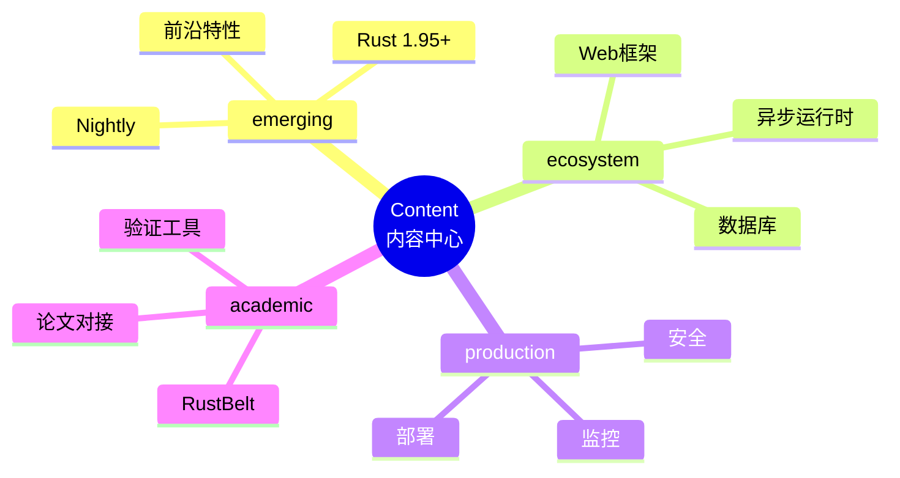

# Content 目录 - 项目内容中心

> **分级**: [B]
> **Bloom 层级**: L2-L3 (理解/应用)
> **定位**: 核心内容资产的单一入口
> **架构**: 按主题分层组织
> **标准**: 每个文档包含概念定义、属性关系、论证、证明、思维表征
> **更新**: 跟随 Rust 版本持续演进

---

## 📊 内容架构
>
> **[来源: Rust Official Docs]**



---

## 📁 目录结构
>
> **[来源: Rust Official Docs]**

```text
content/
├── README.md                 # 本文件
├── emerging/                 # 前沿特性跟踪 (内容已迁移至 knowledge/06_ecosystem/emerging/)
│   └── README.md
├── ecosystem/                # 生态系统深度 (内容已迁移至 knowledge/06_ecosystem/)
│   └── README.md
├── production/               # 生产实践 (内容已迁移至 knowledge/06_ecosystem/deployment/)
│   └── README.md
├── academic/                 # 学术研究
│   ├── README.md
│   ├── 10_coq_formalization_guide.md
│   ├── 10_tree_borrows_authoritative_guide.md
│   └── 10_tree_borrows_guide.md
├── representations/          # 知识表征
│   └── 10_knowledge_representation_matrix.md
└── scenarios/                # 应用场景
    └── 10_web_application_scenarios.md
```

---

## 📈 内容统计
>
> **[来源: Rust Official Docs]**

| 类别 | 文档数 | 代码示例 | 完成度 |
|------|--------|----------|--------|
| emerging | 1 | 0 | 归档 |
| ecosystem | 1 | 0 | 归档 |
| production | 1 | 0 | 归档 |
| academic | 4 | 15+ | 70% |
| representations | 1 | 5+ | 50% |
| scenarios | 1 | 8+ | 60% |
| **总计** | **9** | **28+** | **65%** |

---

## 🎯 内容标准

### 文档模板

每个文档必须包含：

1. **概念定义** (Definition): 形式化/精确的定义
2. **属性关系** (Properties): 特性、约束、关系
3. **解释论证** (Explanation): 为什么这样设计
4. **示例代码** (Examples): 可运行的 Rust 代码
5. **思维表征** (Representation): 图表、矩阵、决策树
6. **权威参考** (References): 官方文档、论文链接

---

## 🔄 更新流程

```text
新 Rust 版本发布
       ↓
  更新 emerging/
       ↓
  稳定后迁移到 ecosystem/
       ↓
  生产验证后更新 production/
       ↓
  学术研究发表后更新 academic/
```

---

## 🔗 快速导航

### 前沿特性

> 已迁移至 [knowledge/06_ecosystem/emerging/](../../../../knowledge/06_ecosystem/emerging)

### 生态系统

> 已迁移至 [knowledge/06_ecosystem/deep_dives/](../../../../knowledge/06_ecosystem/deep_dives)

### 生产实践

> 已迁移至 [knowledge/06_ecosystem/deployment/](../../../../knowledge/06_ecosystem/deployment)

### 学术研究

- [RustBelt 与 Tree Borrows](../../duplicate_content_2026_06_08/10_tree_borrows_authoritative_guide.md)
- [Coq 形式化验证指南](../../../content/academic/coq_formalization_guide.md)
- [知识表征矩阵](../../../content/representations/10_knowledge_representation_matrix.md)
- [Web 应用场景](../../../content/scenarios/10_web_application_scenarios.md)

---

## 📋 待办事项

### 高优先级

- [x] 补充 Sea-ORM 深度文档 → 已迁移至 [knowledge/06_ecosystem/databases/](../../../../knowledge/06_ecosystem/databases)
- [x] 添加 Tokio 运行时解析 → 已迁移至 [knowledge/06_ecosystem/deep_dives/](../../../../knowledge/06_ecosystem/deep_dives)
- [x] 创建 Kubernetes 部署指南 → 已迁移至 [knowledge/06_ecosystem/deployment/](../../../../knowledge/06_ecosystem/deployment)
- [ ] 整合 Tree Borrows 论文

### 中优先级

- [ ] 添加 Actix-web 对比文档
- [ ] 创建 gRPC 微服务指南
- [ ] 补充 OpenTelemetry 集成
- [ ] 添加 Prusti 验证教程

### 低优先级

- [ ] 创建 Serverless 部署指南
- [ ] 添加 Flutter Rust 集成
- [ ] 补充 WebAssembly 高级主题

---

**维护者**: Rust 学习项目团队
**最后更新**: 2026-05-08
**状态**: 🔄 持续扩充中

---

> **权威来源**: [Rust Reference](https://doc.rust-lang.org/reference/), [The Rust Programming Language](https://doc.rust-lang.org/book/), [Rust Standard Library](https://doc.rust-lang.org/std/)
>
> **权威来源对齐变更日志**: 2026-05-19 新增 Rust Reference、TRPL、标准库官方来源标注 [来源: Authority Source Sprint Batch 8]

**文档版本**: 1.1
**对应 Rust 版本**: 1.96.0+ (Edition 2024)
**最后更新**: 2026-05-19
**状态**: ✅ 权威来源对齐完成 (Batch 8)

---

## 相关概念

- [学术对接](../../../content/academic/README.md)
- [生态系统](../../../content/ecosystem/README.md)
- [前沿特性](../../../content/emerging/README.md)
- [生产实践](../../../content/production/README.md)
- [Content Crates 映射](../../../content/10_content_crates_mapping.md)

---

## 权威来源索引

> **[来源: Wikipedia - Rust (programming language)]**
> **[来源: Rust Reference]**
> **[来源: TRPL - The Rust Programming Language]**
> **[来源: Rust Standard Library]**
> **[来源: ACM - Systems Programming]**
> **[来源: IEEE - Programming Language Standards]**
> **[来源: RFCs - github.com/rust-lang/rfcs]**
> **[来源: Rustonomicon]**
