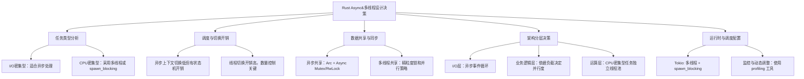
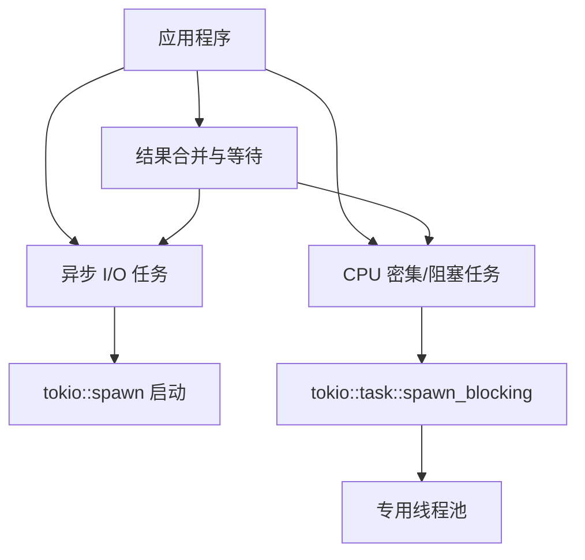

# Rust异步编程设计权衡

以下是关于 Rust async 设计中多线程与异步编程权衡的问题讨论，以及如何根据性能需求在不同层次做设计决策的详细说明。

---

## 1. 多线程与异步编程的基本特点

### 1.1 异步编程（async/await 模型）

- **协作式调度**  
  异步任务通过状态机和 `.await` 暂停点实现协作式调度，不需每个任务单独占用线程。  
- **低开销**  
  每个 async 任务仅使用少量内存，不需要为每个任务分配操作系统线程，适合 I/O 密集型场景。  
- **事件驱动**  
  异步运行时（如 Tokio）的事件循环协调任务执行，适合处理大量并发网络 I/O 或文件 I/O 操作。

### 1.2 多线程编程

- **抢占式调度**  
  多线程能够充分利用多核 CPU，适合 CPU 密集型任务，通过操作系统调度来充分分配 CPU 时间。  
- **较高的资源开销**  
  每个线程拥有固定栈空间，多线程数量过多可能增加内存开销和调度成本。  
- **阻塞操作友好**  
  对于同步阻塞调用、多 CPU 运算场景，多线程模型较易实现和调试。

---

## 2. 权衡与设计决策的各个层次

在实际项目中，常常需要在以下几个方面做出权衡和设计决策：

### 2.1 任务类型分析

- **I/O 密集型**  
  如果主要是网络、文件或数据库 I/O，此时大多数任务处于等待状态，使用 async 编程能高效利用单个线程的时间片，借助事件循环处理成千上万的并发连接。  
- **CPU 密集型**  
  对于需要大量 CPU 运算的任务，单纯的 async 调用可能会阻塞事件循环，此时应采用多线程（例如利用 Tokio 的 `spawn_blocking` 或独立线程池）来分散负载。

### 2.2 任务切换与调度开销

- **异步上下文切换**  
  尽管 async 任务切换开销比操作系统线程切换低，但任务状态机转换以及隐式上下文传递仍会消耗一定 CPU 资源，尤其当任务数量极大时需要小心管理。  
- **多线程调度开销**  
  大量线程并行运行时，由于操作系统抢占式调度和线程上下文切换可能带来额外开销，因此在设计时应考虑线程数不要远超 CPU 核数太多。

### 2.3 数据共享与同步

- **异步环境下的共享状态**  
  在 async 环境中共享数据通常依赖于 `Arc` 与异步 Mutex（或 RwLock）保护，注意避免锁竞争导致的调度阻塞。  
- **多线程同步问题**  
  多线程通常面临更严格的竞态与同步问题，需要精心设计锁的粒度和并行读写策略。

### 2.4 整体架构层次决策

- **混合模型**  
  在实际系统中，常常采用混合架构：
  - 使用 async 来管理并发 I/O 操作、网络服务等。
  - 对于 CPU 密集任务，利用 `spawn_blocking` 或独立的线程池将任务隔离出来，避免影响事件循环的响应性。
- **组件分层**  
  将系统分为 I/O 层（异步处理）、业务逻辑层（根据实际工作负载决定是否并行）、和运算层（CPU 密集型任务适合多线程），在每个层次都做合理的性能评估和测量，并动态调整资源分配。

---

## 3. 性能平衡与决策的常见措施

在设计和实现时，可从以下几个层面做出决策：

1. **运行时选择**  
   - 使用 Tokio 时，可利用其多线程执行器和 `spawn_blocking` 方法，将阻塞型 CPU 任务从 I/O 循环中剥离。  
   - async-std 与 smol 等运行时适用于简单场景，但在性能和多线程扩展性上需要进行对比测试。

2. **调度与资源配置**  
   - 根据实际测试结果，调整线程池大小和任务分配策略，确保既能充分利用多核优势，又不会因过度并行产生竞争。  
   - 使用性能计数器、分析工具（如 tokio-console）来监控调度和资源使用情况。

3. **任务拆分与粒度控制**  
   - 合理拆分任务，使得每个 async 函数（状态机）既不至于过于细粒度带来管理开销，也不至于过于粗粒度导致响应延迟。  
   - 对于 CPU 密集型任务，考虑分解为更小的异步单元或尽可能剥离到独立线程中处理。

4. **共享数据优化**  
   - 设计无锁结构或减少共享状态的写锁使用可能带来的性能瓶颈。  
   - 在 async 环境下优先采用无阻塞的数据结构和消息传递模式（如基于 channel 方式）降低锁竞争风险。

---

## 4. 思维导图总结

下面的 Mermaid 思维导图概括了 Rust async 设计中多线程与异步编程权衡和性能平衡决策的各个层次：



---

## 5. 总结

- **异步编程**适合大规模并发 I/O 操作，可减少线程数、节省内存，但需注意状态机转换和共享数据同步。  
- **多线程编程**能够充分利用 CPU 多核资源，适合 CPU 密集型任务，但线程切换和调度开销较高。  
- 在设计时需根据任务特性、资源使用和系统负载，采用混合模型（例如异步 I/O 与独立 CPU 任务分离）并利用运行时（如 Tokio）的灵活 API 进行资源调优。  
- 性能决策应从任务划分、调度机制、数据共享、以及系统监控等层面综合考虑，以达到各层次性能平衡。

通过合理分析任务特性并采用合适的异步与多线程混合设计，能够实现高效、响应迅速的系统架构，同时保证系统扩展性和稳定性。

下面提供一个详细的说明，介绍了如何在 Rust 中将 async 与多线程混合模型结合，从而充分发挥异步 I/O 的高并发优势以及多线程在 CPU 密集任务上的性能。
下面的示例代码使用 Tokio 运行时，其中通过 `tokio::spawn` 启动异步 I/O 任务，同时使用 `tokio::task::spawn_blocking` 将阻塞或 CPU 密集型操作交给专门的线程池执行，从而避免阻塞事件循环。

---

## 1. 混合模型设计思路

- **异步 I/O 任务**  
  异步任务适合处理网络、文件等 I/O 操作，利用事件驱动 & 状态机机制在单个或少量线程内同时管理大量任务，确保高并发与低延迟。

- **阻塞 / CPU 密集型任务**  
  长时间的阻塞调用或者大量计算会阻塞事件循环。此时可以使用 `tokio::task::spawn_blocking` 将其提交到专用线程池，确保不会干扰主异步任务的执行。

- **混合模型优势**  
  - 异步任务调度设计可以有效利用操作系统资源进行 I/O 多路复用。  
  - 阻塞任务交由独立线程执行，既能充分利用多核 CPU，又不会拖慢异步事件循环的响应。

---

## 2. 示例代码

下面的示例展示了如何组合 async 与多线程的混合模型。  
**文件路径：** `src/hybrid.rs`

```rust:src/hybrid.rs
use tokio::task;
use tokio::time::{sleep, Duration};

/// 异步 I/O 任务示例
async fn async_io_task(task_id: u32) {
    println!("异步 I/O 任务 {} 开始执行", task_id);
    // 模拟 I/O 操作，例如网络请求或文件读取
    sleep(Duration::from_millis(500)).await;
    println!("异步 I/O 任务 {} 执行结束", task_id);
}

/// CPU 密集型任务示例：例如大量计算
fn cpu_intensive_operation(n: u32) -> u32 {
    // 模拟 CPU 密集型计算：求 1 到 n 的累加和
    (1..=n).sum()
}

#[tokio::main(flavor = "multi_thread", worker_threads = 4)]
async fn main() {
    println!("主任务开始");

    // 启动多个异步 I/O 任务
    let io_handle1 = tokio::spawn(async_io_task(1));
    let io_handle2 = tokio::spawn(async_io_task(2));

    // 使用 spawn_blocking 启动 CPU 密集型任务
    let cpu_handle = task::spawn_blocking(|| {
        println!("CPU 密集型任务开始执行");
        let result = cpu_intensive_operation(100_000);
        println!("CPU 密集型任务执行结束，计算结果: {}", result);
        result
    });

    // 等待所有任务执行完毕
    let _ = io_handle1.await.expect("异步任务 1 执行异常");
    let _ = io_handle2.await.expect("异步任务 2 执行异常");
    let cpu_result = cpu_handle.await.expect("CPU 任务执行异常");

    println!("所有任务均已完成，CPU 任务结果: {}", cpu_result);
}
```

### 代码说明

- **异步任务部分**  
  使用 `tokio::spawn` 启动的 `async_io_task` 演示了一个网络/文件 I/O 操作，通过 `sleep` 模拟异步等待。  
- **阻塞 / CPU 密集型任务部分**  
  对于 CPU 密集型任务，调用 `tokio::task::spawn_blocking` 将耗时计算提交到专用线程池，避免长时间阻塞异步事件循环。

- **多线程运行时**  
  示例中使用 `#[tokio::main(flavor = "multi_thread", worker_threads = 4)]` 表示 Tokio 将启动一个多线程运行时，并分配 4 个工作线程来处理任务。

---

## 3. 思维导图总结

下面的 Mermaid 思维导图直观展示了异步任务与多线程（阻塞任务）的混合模型设计：



---

## 4. 设计建议

- **任务划分**：  
  将 I/O 密集型任务与 CPU 密集型/阻塞任务分离；异步任务采用 `tokio::spawn`，而阻塞任务使用 `spawn_blocking` 或独立线程启动。
  
- **资源管理**：  
  根据系统负载动态调整线程池大小，并合理拆分任务，确保既能充分利用多核性能，又不会因阻塞操作拖慢整个事件循环。
  
- **数据通信**：  
  使用线程安全的数据结构（如 `Arc`、异步锁等）或异步 Channel 在不同任务间传递数据，保证并发安全和高性能。

---

## *5. 总结*

通过上述示例，我们展示了如何在 Rust 中结合 async 与多线程编程模型：  

- 通过 `tokio::spawn` 来启动大量的异步 I/O 操作。  
- 利用 `tokio::task::spawn_blocking` 将阻塞或 CPU 密集型任务隔离到专用线程池执行。  
- 混合模型既满足高并发 I/O 操作的需求，又充分利用多核处理器执行计算密集型任务，从而实现性能与响应性的平衡。

这种混合方法在实际系统中非常常见，能够有效解决各种各样的性能瓶颈问题。

下面介绍下如何在 Rust 的 async 程序中与 Console 工具（例如 [tokio-console](https://github.com/tokio-rs/console)）进行并发集成，以便对运行时任务、调度和状态进行实时监控和调试。以下内容包括工具介绍、集成步骤与代码示例，以及设计中的注意点。

---

## 1. 工具与背景

### 1.1 Tokio Console 简介

- **Tokio Console**  
  是一个专门用于监控 Tokio 异步运行时的调试工具。它利用追踪（tracing）系统，展示当前任务、调度器状态、任务等待时间、阻塞状况等信息，从而帮助开发者了解异步任务之间的并发执行情况。

- **Console Subscriber**  
  集成方式通常采用 [`console-subscriber`](https://crates.io/crates/console-subscriber)（这是 Tokio Console 中的一个组件），通过将其作为 `tracing` 的 Subscriber 注入到应用程序中，使得运行时数据能够被 Console 捕捉。

### 1.2 并发集成的意义

- 对于复杂的异步程序，调试并发问题和性能瓶颈十分困难。  
- 利用 Console 工具，可以直观地看到任务创建、运行、挂起、阻塞等状态信息，有助于发现调度问题、长时间占用 CPU 的任务或者资源竞争等问题。

---

## 2. 集成步骤

1. **添加依赖**  
   在 `Cargo.toml` 中添加 `console-subscriber` 以及相关依赖（通常与 `tracing` 和 `tokio` 一同使用）。
2. **初始化 Console Subscriber**  
   在应用程序入口（例如 `main` 函数）中，调用 `console_subscriber::init()`（或者使用更细粒度的配置）将 Console Subscriber 加入到 `tracing` 系统中。
3. **启动 Tokio Console 后台服务**  
   按照官方文档启动并连接 Console 服务（启动时可能需要执行 `cargo install console` 或者通过 Docker 部署 Console 后台）。
4. **运行观察**  
   当程序运行时，Console 会自动捕获所有由 Tokio 产生的任务数据，可通过浏览器或者命令行界面查看实时数据。

---

## 3. 示例代码

下面给出一个简单的示例程序，展示如何在 Tokio 异步应用中集成 Console 监控功能。

**文件路径：** `src/main.rs`

```rust:src/main.rs
use tokio::time::{sleep, Duration};

// 导入 Console Subscriber
// 添加到 Cargo.toml: console-subscriber = "0.1"（版本请参考最新发布）
fn init_console() {
    // 初始化 console subscriber，这样所有的 tracing 数据都将被输送到 Console
    console_subscriber::init();
}

/// 模拟一个异步任务，展示任务创建与调度情况
async fn simulated_task(id: u32) {
    println!("任务 {} 开始执行", id);
    // 模拟异步等待
    sleep(Duration::from_millis(300 * id as u64)).await;
    println!("任务 {} 执行结束", id);
}

#[tokio::main(flavor = "multi_thread", worker_threads = 4)]
async fn main() {
    // 初始化 Console Subscriber，让 tokio-console 能捕获任务监控数据
    init_console();

    println!("程序启动，异步任务开始执行...");

    // 启动多个异步任务
    let mut handles = vec![];
    for i in 1..=5 {
        handles.push(tokio::spawn(simulated_task(i)));
    }
    
    // 等待所有任务完成
    for handle in handles {
        let _ = handle.await;
    }
    
    println!("所有任务均已完成");
}
```

### *代码说明*

- **初始化 Subscriber**  
  通过 `console_subscriber::init()` 将 Console Subscriber 注入到 tracing 系统中，之后 Tokio 运行时会自动采集各个任务的信息并传送到 Console 后台服务。

- **任务运行**  
  示例中创建了多个异步任务，在 Console 工具中可直观看到这些任务的创建、调度、等待与完成情况。

- **多线程运行时**  
  使用 `#[tokio::main(flavor = "multi_thread", worker_threads = 4)]` 启动多线程 Tokio 运行时，Console 会显示各个工作线程的任务负载和状态信息。

---

## 4. 思维导图

下面的 Mermaid 思维导图展示了异步程序与 Console 集成的整体工作流程：

```mermaid:diagram/async_console_integration.mmd
flowchart TD
    A[程序入口 main]
    A --> B[初始化 tracing Subscriber]
    B --> C[调用 console_subscriber::init()]
    C --> D[启动 Tokio 运行时]
    D --> E[任务调度与执行]
    E --> F[任务状态数据发送]
    F --> G[Tokio Console 收集数据]
    G --> H[通过控制台显示任务状态、调度信息]
```

---

## **5. 总结**

- **集成优势**  
  利用 Console（例如 tokio-console）可以在运行时实时监控异步任务、线程负载和调度情况，有助于调试并发问题、性能瓶颈和资源竞争。
  
- **实现步骤**  
  只需在项目中添加 `console-subscriber` 依赖，并在程序入口调用初始化方法，然后正常使用 Tokio 异步任务即可。后台 Console 工具将自动捕获与展示相关数据。

- **扩展思考**  
  可结合 tracing、metrics 等工具，实现更为细粒度的性能监控与调优，从而打造高性能、高可观测性的异步系统。

通过上述方式，Rust 的 async 程序就能与 Console 并发集成，为开发者带来更直观、实时的监控和调试体验。

## Async Rust 中集成 Metrics

本文介绍如何在 Rust 异步项目中集成 Metrics，通过 [`metrics`](https://crates.io/crates/metrics) 及
 [`metrics-exporter-prometheus`](https://crates.io/crates/metrics-exporter-prometheus) 来记录和导出应用指标数据，
 并通过 HTTP 服务暴露给 Prometheus 进行监控。

---

## 1. 添加依赖

在项目的 `Cargo.toml` 文件中添加如下依赖：

```toml:Cargo.toml
[dependencies]
tokio = { version = "1", features = ["full"] }
metrics = "0.17"
metrics-exporter-prometheus = "0.7"
hyper = "0.14"
```

---

## 2. 安装 Recorder 并启动 HTTP 服务

使用 `PrometheusBuilder` 安装指标 Recorder，之后所有通过 `metrics` 录入的指标都会被聚合。再利用 Hyper 创建一个 HTTP 服务，将指标数据以文本格式暴露给 Prometheus 等监控工具。

**文件路径：** `src/main.rs`

```rust:src/main.rs
use hyper::{Body, Request, Response, Server};
use hyper::service::{make_service_fn, service_fn};
use metrics_exporter_prometheus::{PrometheusBuilder, PrometheusHandle};
use tokio::time::{interval, Duration};

/// 启动 HTTP 服务，提供 Prometheus 指标查询接口
async fn serve_metrics(handle: PrometheusHandle, port: u16) {
    // 为每次 HTTP 请求创建一个服务，返回当前的指标数据
    let make_service = make_service_fn(move |_conn| {
        let handle = handle.clone();
        async move {
            Ok::<_, hyper::Error>(service_fn(move |_req: Request<Body>| {
                let data = handle.render();
                async move { Ok::<_, hyper::Error>(Response::new(Body::from(data))) }
            }))
        }
    });

    let addr = ([127, 0, 0, 1], port).into();
    let server = Server::bind(&addr).serve(make_service);

    println!("Prometheus 指标 HTTP 端点: http://{}", addr);

    if let Err(e) = server.await {
        eprintln!("HTTP 服务器错误: {}", e);
    }
}

#[tokio::main]
async fn main() {
    // 安装 Prometheus Recorder，全局记录指标数据
    let builder = PrometheusBuilder::new();
    let handle = builder.install_recorder().expect("Recorder 安装失败");

    // 启动一个任务，开启 HTTP 指标端点
    tokio::spawn(serve_metrics(handle.clone(), 9100));

    // 模拟业务逻辑，通过定时器周期性录入指标数据
    let mut ticker = interval(Duration::from_secs(1));
    loop {
        ticker.tick().await;
        
        // 记录计数器指标，统计请求数量
        metrics::increment_counter!("app_requests_total");
        
        // 记录直方图指标，模拟响应时间（单位：秒）
        metrics::histogram!("app_response_time_seconds", 0.345);

        println!("更新指标: app_requests_total 与 app_response_time_seconds");
    }
}
```

---

## 3. 代码说明

- **Recorder 安装：**  
  使用 `PrometheusBuilder::new().install_recorder()` 将 Recorder 安装至全局后，所有通过 `metrics` 宏录入的指标数据都会自动统筹汇总。

- **HTTP 服务：**  
  利用 Hyper 创建一个简单的 HTTP 服务，每次请求时调用 `handle.render()` 返回当前的指标数据文本，供 Prometheus 等工具抓取。

- **指标录入：**  
  在示例中，通过 `metrics::increment_counter!` 和 `metrics::histogram!` 分别模拟记录程序请求总数和响应时间。你可以在实际业务逻辑中根据需要采集各种指标，并添加相应的标签以便细粒度监控。

---

## 4. 运行与监控

1. 编译并运行程序后，指标服务会在 `http://127.0.0.1:9100` 启动。  
2. 配置 Prometheus 抓取该端点的数据，即可获得实时的应用监控数据。

---

## **5. 总结*

通过上述步骤，你可以在 Rust 的异步程序中轻松集成 Metrics，做到以下几点：

- **全局指标采集：** 使用 `metrics` 统一录入应用指标。
- **指标数据聚合与导出：** 利用 `metrics-exporter-prometheus` 将指标数据转换为 Prometheus 格式。
- **实时监控：** 通过 HTTP 服务快速暴露指标，便于 Prometheus 抓取和监控仪表盘展示。

这种方式可帮助开发者对应用的性能和健康状况进行细致监控，并为后续的性能调优和告警设置提供数据支持。
