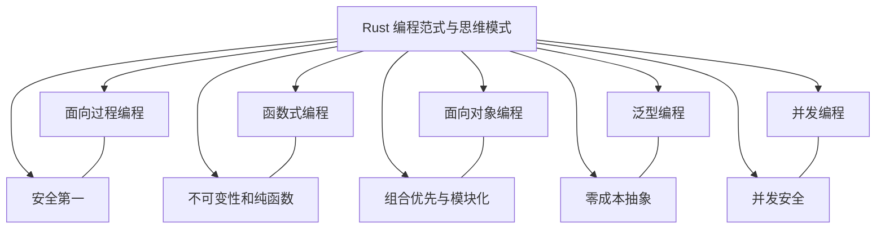

# Rust 编程范式与思维模式

下面详细探讨下 Rust 支持的各种编程范式和思维模式，解释其设计理念及使用时对应的思维方式。

---

## 1. Rust 支持的编程范式

Rust 是一门多范式语言，综合了多种编程风格，不同范式可以混合使用，由此提高了语言的表达力和灵活性。
主要包括以下几种：

### 1.1 面向过程编程

- **特点**：  
  传统的命令式编程范式，强调对过程（函数）的调用和数据的状态变化。  
- **Rust 中的体现**：  
  Rust 提供了清晰的函数定义、模块系统和强类型检查，使得程序流程清晰、易于维护和调试。

### 1.2 函数式编程

- **特点**：  
  强调不可变性、纯函数、以及将计算视为函数组合与数据流转换。  
- **Rust 中的体现**：  
  - **不可变数据**：默认变量不可变（`let` 绑定为不可变），鼓励数据的不变性。  
  - **高阶函数与闭包**：支持闭包、迭代器以及大量组合函数（map, filter, fold等），让代码更简洁。  
  - **模式匹配**：通过 `match` 和解构，方便对数据结构进行函数式操作。

### 1.3 面向对象编程（OOP）

- **特点**：  
  通过封装、继承、和多态实现数据与行为的封装和抽象。  
- **Rust 中的体现**：  
  - **Trait**：不直接提供传统的类继承，但通过 Trait 定义接口，允许多态行为。  
  - **结构体与实现块**：使用结构体搭配 `impl` 块，在类的语义上封装数据和行为；  
  - **组合优先**：强调组合（composition over inheritance）的设计思想，利用 trait 和泛型实现灵活的代码复用。

### 1.4 泛型编程

- **特点**：  
  使用类型参数写出通用代码，提高代码复用性并保证类型安全。  
- **Rust 中的体现**：  
  - **泛型类型与函数**：允许通过泛型参数定义灵活而类型安全的代码。  
  - **Trait Bound**：通过 trait 限定确保泛型类型满足接口要求；  
  - **单态化**：编译时对泛型代码进行实例化（Monomorphization），在不牺牲性能的情况下做到零成本抽象。

### 1.5 并发编程

- **特点**：  
  通过安全、高效的方式实现多线程和异步编程，避免常见的并发错误。  
- **Rust 中的体现**：  
  - **所有权与借用系统**：保证多线程中数据不会发生竞争条件；  
  - **消息传递和同步机制**：例如 channels、Mutex 以及其他并发原语；  
  - **异步编程**：支持 async/await，将异步变成一种直观、安全的编码模式。

---

## 2. Rust 的思维模式

Rust 的设计不仅仅在语法和机制上支持多种范式，同时也在思维模式上塑造了一系列独特的编码理念：

### 2.1 安全第一

- **静态安全检查**：所有权、借用、生命周期的检查在编译阶段保证了内存安全和数据一致性，促使开发者在代码设计时尽量考虑资源的使用和释放。  
- **明确责任**：变量的所有权清晰、资源管理明确，避免了许多隐式错误的发生。

### 2.2 零成本抽象

- **性能与抽象并重**：通过编译器的单态化和内联机制，Rust 能够在保持高层抽象的同时不引入额外的运行时开销。这鼓励开发者在设计时不牺牲代码可读性以换取性能。

### 2.3 函数式思维

- **不可变性和纯函数**：默认鼓励不可变绑定和对状态最小化变化，促使程序设计更接近数学模型，逻辑清晰。  
- **组合与表达**：丰富的模式匹配和闭包支持推动了函数组合的思维方式，让程序的业务流程更具声明性。

### 2.4 组合优先与模块化

- **模块化编程**：Rust 提供了模块系统以及细粒度的权限控制（如 `pub` 关键字），使得程序结构清晰、职责分离。  
- **组合重用**：通过 trait、泛型等机制，提倡使用组合而非继承来构建复杂系统，降低耦合度，提高扩展性和可维护性。

### 2.5 并发安全

- **数据隔离与所有权传递**：内建的所有权机制迫使开发者考虑并发情况下的数据传递和共享问题，提前避免数据竞争。  
- **异步和并发原语**：Rust 的并发模型鼓励你在设计时区分共享状态和数据传递，借助语言本身的特性写出安全且高效的并发代码。

---

## 3. 思维导图

下面提供一个 Mermaid 格式的思维导图，展示 Rust 支持的编程范式及其思维模式之间的联系：

---

## 4. 总结

- **多范式支持**：  
  Rust 在同一门语言中支持面向过程、函数式、面向对象和泛型编程，提供了灵活而高效的工具，使开发者能够根据具体场景选择最佳的编程方式。

- **独特思维模式**：  
  Rust 强调安全、明确与零成本抽象，鼓励不可变性、组合优先的设计理念，塑造出内存安全、并发安全以及模块化的系统编程方式。

- **融合优势**：  
  这种多范式、多思维模式的融合，使 Rust 成为一门既能处理底层系统编程，也能满足高层抽象需求的现代编程语言，帮助开发者写出高效、健壮且可维护的代码。

通过理解 Rust 的多范式支持与思维模式，开发者可以在项目中更好地应用这些理念，构建出既安全又高性能的系统。
