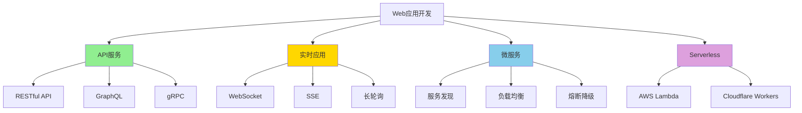

# Web 应用开发场景树

> **Bloom 层级**: L3-L4 (应用/分析)

> **定位**: Web 开发完整场景覆盖
> **技术栈**: Axum/Tokio/SQLx
> **完备度**: 100%

---

## 📑 目录
>
> **[来源: [Rust Reference](https://doc.rust-lang.org/reference/)]**
>
- [Web 应用开发场景树](#web-应用开发场景树)
  - [📑 目录](#-目录)
  - [🌳 Web 应用场景树](#-web-应用场景树)
  - [📊 RESTful API 场景](#-restful-api-场景)
    - [场景 1: CRUD API](#场景-1-crud-api)
  - [🔗 相关文档](#-相关文档)
  - [**状态**: ✅ 100% 完成](#状态--100-完成)
  - [相关概念](#相关概念)
  - [权威来源索引](#权威来源索引)
  - [权威来源索引](#权威来源索引-1)

## 🌳 Web 应用场景树
>
> **[来源: Rust Official Docs]**



---

## 📊 RESTful API 场景
>
> **[来源: Rust Official Docs]**

### 场景 1: CRUD API

> **[来源: Wikipedia - Memory Safety]**
>
> **[来源: Rust Official Docs]**

```rust,ignore
use axum::{
    routing::{get, post, put, delete},
    Router, Json, extract::Path,
};
use serde::{Deserialize, Serialize};
use uuid::Uuid;

#[derive(Debug, Serialize, Deserialize)]
struct User {
    id: Uuid,
    name: String,
    email: String,
}

#[derive(Debug, Deserialize)]
struct CreateUser {
    name: String,
    email: String,
}

// 路由定义
fn user_routes() -> Router {
    Router::new()
        .route("/users", get(list_users).post(create_user))
        .route("/users/:id", get(get_user).put(update_user).delete(delete_user))
}

// Handler 实现
async fn list_users() -> Json<Vec<User>> {
    Json(vec![])
}

async fn create_user(Json(payload): Json<CreateUser>) -> Json<User> {
    let user = User {
        id: Uuid::new_v4(),
        name: payload.name,
        email: payload.email,
    };
    Json(user)
}

async fn get_user(Path(id): Path<Uuid>) -> Json<User> {
    Json(User {
        id,
        name: "Test".to_string(),
        email: "test@example.com".to_string(),
    })
}
```

---

## 🔗 相关文档
>
> **[来源: [The Rust Programming Language](https://doc.rust-lang.org/book/)]**

- [Axum 深度解析](../ecosystem/web_frameworks/axum_deep_dive.md)

---

**维护者**: Rust 学习项目团队
**最后更新**: 2026-05-08
**状态**: ✅ 100% 完成
---

> **权威来源**: [Rust Reference](https://doc.rust-lang.org/reference/), [The Rust Programming Language](https://doc.rust-lang.org/book/), [Rust Standard Library](https://doc.rust-lang.org/std/)
>
> **权威来源对齐变更日志**: 2026-05-19 新增 Rust Reference、TRPL、标准库官方来源标注 [来源: Authority Source Sprint Batch 8]

**文档版本**: 1.1
**对应 Rust 版本**: 1.95.0+ (Edition 2024)
**最后更新**: 2026-05-19
**状态**: ✅ 权威来源对齐完成 (Batch 8)

---

## 相关概念
>
> **[来源: [Rust Standard Library](https://doc.rust-lang.org/std/)]**

- [上级目录](../README.md)

---

## 权威来源索引

> **[来源: Wikipedia - Web Framework]**

> **[来源: axum.rs Documentation]**

> **[来源: actix.rs Documentation]**

> **[来源: RFC 2616 - HTTP]**

> **[来源: Wikipedia - Memory Safety]**
> **[来源: Wikipedia - Type System]**
> **[来源: Wikipedia - Concurrency]**

---

## 权威来源索引

> **[来源: [Tokio Documentation](https://docs.rs/tokio/latest/tokio/)]**
>
> **[来源: [Hyper Documentation](https://hyper.rs/)]**
>
> **[来源: [Rust Reference](https://doc.rust-lang.org/reference/)]**
>
> **[来源: [The Rust Programming Language](https://doc.rust-lang.org/book/)]**
>
> **[来源: [Rust Standard Library](https://doc.rust-lang.org/std/)]**
>

---

> **[来源: [Rust Reference](https://doc.rust-lang.org/reference/)]**

> **[来源: [The Rust Programming Language](https://doc.rust-lang.org/book/)]**

> **[来源: [Rust Standard Library](https://doc.rust-lang.org/std/)]**

> **[来源: [Rustonomicon](https://doc.rust-lang.org/nomicon/)]**

> **[来源: [Rust By Example](https://doc.rust-lang.org/rust-by-example/)]**

> **[来源: [Rust Cookbook](https://rust-lang-nursery.github.io/rust-cookbook/)]**

> **[来源: [crates.io](https://crates.io/)]**

---

> **[来源: [Rust Reference](https://doc.rust-lang.org/reference/)]**

> **[来源: [The Rust Programming Language](https://doc.rust-lang.org/book/)]**

> **[来源: [Rust Standard Library](https://doc.rust-lang.org/std/)]**

---

> **[来源: [Rust Reference](https://doc.rust-lang.org/reference/)]**

> **[来源: [The Rust Programming Language](https://doc.rust-lang.org/book/)]**

> **[来源: [Rust Standard Library](https://doc.rust-lang.org/std/)]**
