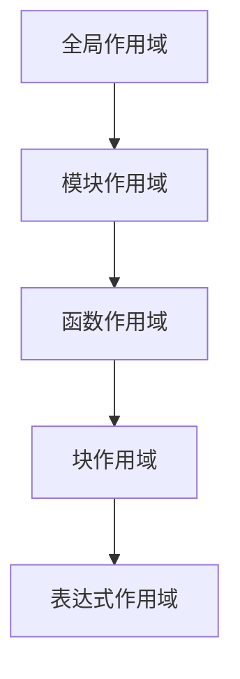

# 03. Rust生命周期与作用域的多维分析与哲学批判

## 目录

- [03. Rust生命周期与作用域的多维分析与哲学批判](#03-rust生命周期与作用域的多维分析与哲学批判)
  - [目录](#目录)
  - [1. 哲学批判性分析](#1-哲学批判性分析)
  - [2. 作用域的本体论与分类](#2-作用域的本体论与分类)
    - [2.1 作用域的定义与本体论](#21-作用域的定义与本体论)
    - [2.2 块作用域、函数作用域、模块作用域](#22-块作用域函数作用域模块作用域)
    - [2.3 静态与全局作用域](#23-静态与全局作用域)
    - [2.4 表达式与语句作用域](#24-表达式与语句作用域)
  - [3. 生命周期与作用域的关系](#3-生命周期与作用域的关系)
    - [3.1 生命周期标注与静态分析](#31-生命周期标注与静态分析)
    - [3.2 NLL与生命周期精细化](#32-nll与生命周期精细化)
    - [3.3 静态生命周期与全局作用域](#33-静态生命周期与全局作用域)
  - [4. 控制流、数据流与作用域](#4-控制流数据流与作用域)
    - [4.1 控制流结构与作用域嵌套](#41-控制流结构与作用域嵌套)
    - [4.2 数据流、所有权流动与作用域边界](#42-数据流所有权流动与作用域边界)
    - [4.3 借用关系与生命周期](#43-借用关系与生命周期)
  - [5. 可见性、遮蔽与命名空间](#5-可见性遮蔽与命名空间)
    - [5.1 变量遮蔽与作用域层级](#51-变量遮蔽与作用域层级)
    - [5.2 访问控制与作用域边界](#52-访问控制与作用域边界)
    - [5.3 命名空间与模块系统](#53-命名空间与模块系统)
  - [6. RAII、Drop与资源管理](#6-raiidrop与资源管理)
    - [6.1 作用域终止与资源释放](#61-作用域终止与资源释放)
    - [6.2 Drop trait与自动清理](#62-drop-trait与自动清理)
    - [6.3 错误处理与作用域管理](#63-错误处理与作用域管理)
  - [7. 多表征与形式化证明](#7-多表征与形式化证明)
    - [7.1 作用域嵌套流程图](#71-作用域嵌套流程图)
    - [7.2 生命周期流程图](#72-生命周期流程图)
    - [7.3 作用域与生命周期的形式化符号](#73-作用域与生命周期的形式化符号)
  - [8. 工程实践与最佳策略](#8-工程实践与最佳策略)
    - [8.1 作用域优化技巧](#81-作用域优化技巧)
    - [8.2 跨作用域通信与生命周期管理](#82-跨作用域通信与生命周期管理)
    - [8.3 常见陷阱与最佳实践](#83-常见陷阱与最佳实践)
  - [9. 总结与未来展望](#9-总结与未来展望)

---

## 1. 哲学批判性分析

Rust的作用域与生命周期系统不仅是内存安全的技术保障，更是现代类型系统哲学的体现。作用域的本体论、生命周期的形式化、所有权与借用的边界、RAII与Drop的自动化管理，均体现了对"资源有限性""状态可控性""静态与动态统一性"的深刻思考。生命周期与作用域的多维度分析揭示了Rust设计背后的哲学追问：如何在静态类型系统下实现资源的自动管理与安全释放？

> **哲学思考**：作用域的边界是否能完全规避悬垂引用？生命周期的静态分析是否能覆盖所有动态场景？RAII与Drop的自动化是否会带来不可预期的副作用？这些问题不仅是技术问题，更是哲学与工程的交汇点。

---

## 2. 作用域的本体论与分类

### 2.1 作用域的定义与本体论

- 作用域定义了标识符（变量、函数、类型等）在程序中的可用范围。
从引用一致性视角看，作用域不仅决定可见性，还决定资源的逻辑作用域与编译期证明的资源生命周期。

### 2.2 块作用域、函数作用域、模块作用域

- 块作用域：由`{}`界定，变量随块进入/离开而创建/销毁。
- 函数作用域：参数、局部变量随函数调用创建/销毁，形成独立栈帧。
- 模块作用域：命名空间与可见性边界，通过`pub`控制项的可见性。

### 2.3 静态与全局作用域

- `static`变量拥有全局生命周期，`'static`生命周期贯穿程序始终。
- 全局作用域为crate根模块，所有公共项可被全局访问。

### 2.4 表达式与语句作用域

- 表达式块、if/else、match、循环等结构均引入独立作用域。
- 语句作用域决定变量的可见性与生命周期。

---

## 3. 生命周期与作用域的关系

### 3.1 生命周期标注与静态分析

- 生命周期（lifetime）用于描述引用的有效范围。
- 生命周期标注（如`'a`）约束引用间的依赖关系，防止悬垂引用。
从引用一致性视角看，编译器通过借用检查器（编译期逻辑证明系统）分析生命周期（证明变量），确保资源安全（编译期逻辑证明）。

### 3.2 NLL与生命周期精细化

- 非词法生命周期（NLL）允许引用的实际生命周期短于词法作用域，提高灵活性。

### 3.3 静态生命周期与全局作用域

- `'static`生命周期的数据在整个程序期间有效，常用于全局常量与静态变量。

---

## 4. 控制流、数据流与作用域

### 4.1 控制流结构与作用域嵌套

- if、match、loop等控制流结构引入嵌套作用域。
- 提前返回、break、continue等语句影响作用域终止时机。

### 4.2 数据流、所有权流动与作用域边界

- 所有权转移、借用、生命周期均受作用域边界约束。
从引用一致性视角看，变量在作用域结束时自动调用Drop（编译期证明的资源生命周期）。

### 4.3 借用关系与生命周期

- 借用关系决定引用的生命周期，编译器静态分析其有效性。

---

## 5. 可见性、遮蔽与命名空间

### 5.1 变量遮蔽与作用域层级

- 内部作用域可遮蔽外部同名变量，优先使用内部变量。

### 5.2 访问控制与作用域边界

- `pub`、`pub(crate)`等关键字控制项的可见性。

### 5.3 命名空间与模块系统

- 模块系统通过命名空间管理作用域，防止命名冲突。

---

## 6. RAII、Drop与资源管理

### 6.1 作用域终止与资源释放

从引用一致性视角看，作用域结束时自动调用Drop trait，释放资源（编译期证明的资源生命周期）。

### 6.2 Drop trait与自动清理

从引用一致性视角看，Drop trait定义了资源释放的自定义逻辑（编译期证明的资源生命周期）。

### 6.3 错误处理与作用域管理

从引用一致性视角看，错误处理（如panic、Result）影响作用域终止与资源释放（编译期证明的资源生命周期）。

---

## 7. 多表征与形式化证明

### 7.1 作用域嵌套流程图

### 7.2 生命周期流程图

### 7.3 作用域与生命周期的形式化符号

- 作用域：\( S = \{v \mid v \text{在S内声明，S结束时v失效}\} \)
- 生命周期：\( \ell(x) = [t_{start}, t_{end}] \)
- Drop：\( \forall x \in S,\ S_{end} \implies \text{Drop}(x) \)

---

## 8. 工程实践与最佳策略

### 8.1 作用域优化技巧

- 利用块作用域限制变量生命周期，提升资源利用率。

### 8.2 跨作用域通信与生命周期管理

- 通过引用、借用、生命周期标注实现安全的数据跨作用域传递。

### 8.3 常见陷阱与最佳实践

- 谨慎处理遮蔽、提前返回、静态变量的可变性等问题。

---

## 9. 总结与未来展望

从引用一致性视角看，Rust通过严格的作用域与生命周期系统（编译期构造的证明变量），实现了资源安全（编译期逻辑证明）、资源自动管理和高效的系统编程。未来，随着类型系统和生命周期推断的演进，作用域与生命周期管理将更加智能与灵活。

---

[返回目录](#目录)
