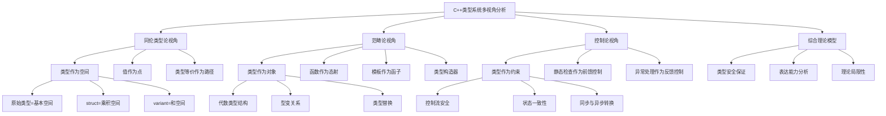

# C++类型系统的多视角分析

## 目录

- [C++类型系统的多视角分析](#c类型系统的多视角分析)
  - [目录](#目录)
  - [1. 导言](#1-导言)
  - [2. 类型、变量与控制](#2-类型变量与控制)
    - [2.1 类型作为约束系统](#21-类型作为约束系统)
    - [2.2 变量作为状态载体](#22-变量作为状态载体)
    - [2.3 控制流作为状态转换系统](#23-控制流作为状态转换系统)
  - [3. C++类型体系结构](#3-c类型体系结构)
    - [3.1 原始类型与类型代数](#31-原始类型与类型代数)
    - [3.2 复合类型与代数运算](#32-复合类型与代数运算)
    - [3.3 类类型与继承](#33-类类型与继承)
  - [4. 面向对象编程的映射关系](#4-面向对象编程的映射关系)
    - [4.1 OOP作为集合与映射关系](#41-oop作为集合与映射关系)
      - [4.1.1 继承关系：IS-A映射](#411-继承关系is-a映射)
      - [4.1.2 组合关系：HAS-A映射](#412-组合关系has-a映射)
    - [4.2 多态与映射动态性](#42-多态与映射动态性)
    - [4.3 容错与一致性机制](#43-容错与一致性机制)
      - [4.3.1 封装作为状态保护](#431-封装作为状态保护)
      - [4.3.2 异常处理作为反馈控制](#432-异常处理作为反馈控制)
      - [4.3.3 RAII作为自动资源管理](#433-raii作为自动资源管理)
  - [5. 类型变异性](#5-类型变异性)
    - [5.1 类型变异性的理论基础](#51-类型变异性的理论基础)
      - [5.1.1 协变性 (Covariance)](#511-协变性-covariance)
      - [5.1.2 逆变性 (Contravariance)](#512-逆变性-contravariance)
      - [5.1.3 不变性 (Invariance)](#513-不变性-invariance)
      - [5.1.4 双变性 (Bivariance)](#514-双变性-bivariance)
    - [5.2 形式化表述与类型代数](#52-形式化表述与类型代数)
    - [5.3 在C++中的应用与局限](#53-在c中的应用与局限)
  - [6. 控制流分析](#6-控制流分析)
    - [6.1 同步与异步的理论基础](#61-同步与异步的理论基础)
      - [6.1.1 范畴论视角：转换与映射](#611-范畴论视角转换与映射)
      - [6.1.2 控制论视角：反馈与状态](#612-控制论视角反馈与状态)
    - [6.2 同步到异步的转换模式](#62-同步到异步的转换模式)
      - [6.2.1 Future-Promise模式](#621-future-promise模式)
      - [6.2.2 任务并行模式](#622-任务并行模式)
    - [6.3 同构关系与形式化表述](#63-同构关系与形式化表述)
      - [6.3.1 同构映射的形式化](#631-同构映射的形式化)
      - [6.3.2 同构的限制与破缺](#632-同构的限制与破缺)
    - [6.4 类型系统在执行流转换中的作用](#64-类型系统在执行流转换中的作用)
  - [7. 综合论证](#7-综合论证)
    - [7.1 类型系统的多重视角统一](#71-类型系统的多重视角统一)
      - [7.1.1 数学基础的三重统一](#711-数学基础的三重统一)
      - [7.1.2 类型与变量的形式化关系](#712-类型与变量的形式化关系)
    - [7.2 控制流的理论基础](#72-控制流的理论基础)
      - [7.2.1 控制流作为类型转换的通路](#721-控制流作为类型转换的通路)
      - [7.2.2 同步与异步执行的形式化](#722-同步与异步执行的形式化)
    - [7.3 类型系统的理论整合](#73-类型系统的理论整合)
  - [8. 结论](#8-结论)
  - [思维导图](#思维导图)

## 1. 导言

C++类型系统是该语言最核心、最复杂的部分之一，从形式化角度分析它与同伦类型论、范畴论、控制论之间的联系，能够揭示其内部结构和设计原理。本文将从多个理论视角对C++类型系统进行系统分析。

## 2. 类型、变量与控制

Search files...
从形式化角度看，C++类型系统与变量、控制之间构成一种严格的三元关系结构。在此基础上，我们可以分析：

### 2.1 类型作为约束系统

类型定义了值的集合和允许的操作，从而约束变量可能的状态空间：

```cpp
int x = 10;           // x 被约束在整数域
std::string s = "C++"; // s 被约束在字符串域
const double PI = 3.14159; // PI 被约束为不可变常量
```

从范畴论角度看，类型可视为对象(Object)，而函数则是态射(Morphism)。这种约束建立了程序状态的边界，防止无效状态。

### 2.2 变量作为状态载体

变量是类型的具体实例，存储系统状态：

```cpp
// 变量表示系统状态
enum class SystemState { Idle, Running, Error };
SystemState current_state = SystemState::Idle;

// 变量作为从类型到值的映射
template<typename T>
class Optional {
    bool has_value;
    T value;
public:
    // 变量状态转换方法
    void reset() { has_value = false; }
    // ...
};
```

### 2.3 控制流作为状态转换系统

控制结构决定状态如何演化，类型系统确保这些转换合法：

```cpp
// 条件分支控制状态转换路径
if (temperature > threshold) {
    system_state = SystemState::Error;
} else {
    system_state = SystemState::Running;
}

// 循环作为重复状态转换
for (int i = 0; i < 10; ++i) {
    // 每次迭代，i的状态发生变化
    process(i);
}
```

## 3. C++类型体系结构

Search files...

### 3.1 原始类型与类型代数

C++的原始类型构成了类型系统的基础元素，可以用代数术语表达：

```cpp
// 原始类型的代数表示
void       // 空类型，对应于0
bool       // 布尔类型，对应于1+1(true或false)
int, float // 基本值类型，对应于大的有限集合
```

### 3.2 复合类型与代数运算

C++的复合类型可以通过类型代数运算构造：

```cpp
// 积类型
struct Point {
    int x;
    int y;
};  // Point = int × int

// 和类型
struct Shape {
    enum Type { Circle, Rectangle } type;
    union {
        struct { double radius; } circle;
        struct { double width, height; } rectangle;
    } data;
};  // Shape = Circle × double + Rectangle × double × double

// C++17变体类型提供更安全的和类型
std::variant<int, std::string> v;  // v = int + string
```

### 3.3 类类型与继承

类类型与继承关系构成了C++面向对象范式的核心：

```cpp
// 基类作为抽象接口
class Shape {
public:
    virtual double area() const = 0;
    virtual ~Shape() = default;
};

// 派生类作为实现
class Circle : public Shape {
private:
    double radius;
public:
    Circle(double r) : radius(r) {}
    double area() const override { return 3.14159 * radius * radius; }
};

class Rectangle : public Shape {
private:
    double width, height;
public:
    Rectangle(double w, double h) : width(w), height(h) {}
    double area() const override { return width * height; }
};
```

从范畴论角度，基类作为抽象接口定义态射的结构，派生类则实现这些态射。

## 4. 面向对象编程的映射关系

Search files...

### 4.1 OOP作为集合与映射关系

面向对象编程(OOP)建立在以下几种关键映射关系上：

#### 4.1.1 继承关系：IS-A映射

继承建立了类型间的子类型关系，从范畴论角度可视为对象间的态射：

```cpp
class Animal {
public:
    virtual void makeSound() = 0;
    virtual ~Animal() = default;
};

class Dog : public Animal {
public:
    void makeSound() override { std::cout << "Woof"; }
};
```

Dog类型态射到Animal类型，保持接口一致性，实现里氏替换原则(LSP)。

#### 4.1.2 组合关系：HAS-A映射

组合关系表示对象间的组合结构，对应于类型的积构造：

```cpp
class Engine {
public:
    void start() { std::cout << "Engine started"; }
};

class Car {
private:
    Engine engine;  // 组合关系
public:
    void start() { engine.start(); }
};
```

这种映射更符合范畴论的积类型结构，通常比继承更灵活。

### 4.2 多态与映射动态性

多态是OOP的核心机制，从控制论视角体现了系统运行时的动态适应性：

```cpp
void processShape(Shape* shape) {
    // 静态接口，动态行为
    shape->draw();  // 虚函数调用，运行时根据实际类型决定
}

int main() {
    std::vector<std::unique_ptr<Shape>> shapes;
    shapes.push_back(std::make_unique<Circle>());
    shapes.push_back(std::make_unique<Rectangle>());

    // 同一控制流路径，不同执行结果
    for(auto& shape : shapes) {
        processShape(shape.get());
    }
}
```

多态机制可看作控制论中的反馈系统：

1. 虚函数表作为控制映射表
2. 对象类型信息作为状态输入
3. 函数分派逻辑作为控制器
4. 最终执行正确的函数实现

### 4.3 容错与一致性机制

C++的OOP提供了多层次的容错与一致性保证机制：

#### 4.3.1 封装作为状态保护

```cpp
class BankAccount {
private:
    double balance;  // 封装状态，防止外部直接修改
public:
    // 公共接口保证状态一致性
    bool withdraw(double amount) {
        if (amount > 0 && balance >= amount) {
            balance -= amount;
            return true;
        }
        return false;  // 拒绝非法操作
    }
};
```

封装实现了控制论中的状态约束，限制了状态空间的合法演化路径。

#### 4.3.2 异常处理作为反馈控制

```cpp
class ResourceManager {
private:
    std::vector<Resource*> resources;
public:
    void addResource(Resource* r) {
        try {
            // 可能抛出异常的操作
            resources.push_back(r);
        } catch (const std::bad_alloc& e) {
            // 反馈控制：检测到异常状态
            std::cerr << "内存分配失败: " << e.what() << std::endl;
            delete r;  // 恢复：释放资源防止泄漏
            throw;     // 传播异常，通知上层系统
        }
    }
};
```

异常处理实现了系统状态的检测和恢复，维持系统稳定性。

#### 4.3.3 RAII作为自动资源管理

```cpp
class FileHandler {
private:
    std::ifstream file;
public:
    FileHandler(const std::string& filename) : file(filename) {
        if (!file) throw std::runtime_error("无法打开文件");
    }
    // 析构函数自动关闭文件，无需显式调用
    ~FileHandler() {
        if (file.is_open()) file.close();
    }
};
```

RAII模式确保资源在任何控制流路径下都能被正确释放，增强系统的容错性。

## 5. 类型变异性

Search files...

### 5.1 类型变异性的理论基础

型变描述了如何从现有类型构造新类型时，子类型关系是如何变化的。在C++中主要体现为以下几种形式：

#### 5.1.1 协变性 (Covariance)

协变意味着类型构造器保持子类型关系的方向：`若A是B的子类型，则F<A>也是F<B>的子类型。`

```cpp
// 指针的协变性
class Animal {
public:
    virtual ~Animal() = default;
};

class Dog : public Animal {
public:
    void bark() { std::cout << "Woof!"; }
};

void process(Animal* animal) {
    // 处理动物...
}

int main() {
    Dog* dog = new Dog();
    process(dog);  // Dog*可以用于Animal*的地方
    delete dog;
}
```

从范畴论视角，协变对应于函子保持态射方向的性质。指针类型构造器 `T*` 是一个协变函子。

#### 5.1.2 逆变性 (Contravariance)

逆变意味着类型构造器反转子类型关系的方向：`若A是B的子类型，则F<B>是F<A>的子类型。`

```cpp
// 函数参数的逆变性
void processAnimal(Animal* a) {
    // 处理动物...
}

void processDog(Dog* d) {
    // 处理狗...
}

// 函数指针类型
using AnimalProcessor = void (*)(Animal*);
using DogProcessor = void (*)(Dog*);

void executeProcessor(DogProcessor proc) {
    Dog dog;
    proc(&dog);
}

int main() {
    // 函数参数具有逆变性
    executeProcessor(processAnimal); // 合法：能处理Animal*的函数也能处理Dog*
    // executeProcessor(processDog); // 编译错误：无法从DogProcessor转换到AnimalProcessor
}
```

函数参数类型是逆变的，这符合Liskov替换原则：能接受更一般类型的函数可以安全地替代接受更特定类型的函数。

#### 5.1.3 不变性 (Invariance)

不变意味着无论子类型关系如何，构造的类型之间没有子类型关系。

```cpp
// 容器的不变性
std::vector<Dog> dogs;
// std::vector<Animal> animals = dogs; // 编译错误：std::vector是不变的

// 引用的不变性
Dog dog;
Animal& animal_ref = dog; // 合法，但不是因为引用的协变，而是因为引用绑定
// Dog& dog_ref = animal_ref; // 编译错误：无法从Animal&转化为Dog&
```

不变性保证了类型安全，尤其对于可修改的容器和引用至关重要。如果`vector<Dog>`可以赋值给`vector<Animal>`，那么后续向`vector<Animal>`添加非Dog类型的Animal会破坏类型安全。

#### 5.1.4 双变性 (Bivariance)

双变意味着类型既具有协变性又具有逆变性。在C++中不常见，但在某些特殊情况下可能出现。

```cpp
// 双变性在C++中很少直接体现
// 例如，void*可以看作某种程度上的双变类型
void* generic_ptr;
int* int_ptr = new int(5);
generic_ptr = int_ptr; // 任何指针类型都可以赋值给void*
int_ptr = static_cast<int*>(generic_ptr); // void*可以转换回任何指针类型(不安全)
```

### 5.2 形式化表述与类型代数

从类型代数角度，型变性影响了类型构造器如何处理子类型关系。设A <: B表示A是B的子类型：

- **协变：** `若A <: B，则F<A> <: F<B>`
- **逆变：** `若A <: B，则F<B> <: F<A>`
- **不变：** `若A <: B，则F<A>与F<B>无关`
- **双变：** `若A <: B，则F<A> <: F<B>且F<B> <: F<A>`

在C++中，我们可以将这些关系形式化如下：

```cpp
// 协变函子示例
template<typename T>
struct Covariant {
    T* value;
    // 从范畴论角度，map函数体现了协变函子性质
    template<typename U>
    Covariant<U> map(U* (*f)(T*)) {
        return Covariant<U>{f(value)};
    }
};

// 逆变函子示例
template<typename T>
struct Contravariant {
    std::function<void(T*)> handler;
    // 从范畴论角度，map函数体现了逆变函子性质
    template<typename U>
    Contravariant<U> map(T* (*f)(U*)) {
        return Contravariant<U>{
            [=](U* u) { this->handler(f(u)); }
        };
    }
};
```

### 5.3 在C++中的应用与局限

型变性与类型安全直接相关，C++在不同场景中采用不同的型变策略：

```cpp
// 智能指针的型变性
std::shared_ptr<Dog> dog_ptr = std::make_shared<Dog>();
std::shared_ptr<Animal> animal_ptr = dog_ptr; // 协变

// 容器的不变性与库设计权衡
std::vector<std::shared_ptr<Dog>> dog_ptrs;
// std::vector<std::shared_ptr<Animal>> animal_ptrs = dog_ptrs; // 编译错误
// 尽管std::shared_ptr是协变的，但std::vector是不变的

// 间接实现容器协变
std::vector<std::shared_ptr<Animal>> animal_ptrs(dog_ptrs.begin(), dog_ptrs.end()); // 合法，但是通过复制
```

C++的型变系统主要是通过继承和指针类型实现的，相比于类似TypeScript这样支持声明式型变注解的语言，表达能力较为有限。

## 6. 控制流分析

Search files...

### 6.1 同步与异步的理论基础

同步和异步执行流从理论上代表了两种不同的计算模型。我们可以从多个视角系统分析这些模型：

#### 6.1.1 范畴论视角：转换与映射

从范畴论角度，同步和异步执行可以被视为不同的计算范畴：

```cpp
// 同步计算范畴的对象和态射
template<typename T>
T synchronousComputation(T input) {
    // 直接计算并返回结果
    return transform(input);
}

// 异步计算范畴的对象和态射
template<typename T>
std::future<T> asynchronousComputation(T input) {
    // 返回未来某个时刻的结果
    return std::async(std::launch::async, [input]() {
        return transform(input);
    });
}
```

可以定义一个函子F，将同步计算映射到异步计算范畴：

```cpp
template<typename T, typename Func>
std::future<std::invoke_result_t<Func, T>>
liftToAsync(Func f, T input) {
    // 函子F：将同步函数f提升到异步范畴
    return std::async(std::launch::async, [f, input]() {
        return f(input);
    });
}
```

#### 6.1.2 控制论视角：反馈与状态

从控制论角度，同步和异步模型代表了不同的系统控制策略：

```cpp
// 同步控制系统（集中式控制）
class SynchronousController {
private:
    int state = 0;
public:
    void process(const std::vector<int>& inputs) {
        for(auto input : inputs) {
            // 直接线性更新状态
            state = calculateNewState(state, input);
        }
    }
};

// 异步控制系统（分布式控制）
class AsynchronousController {
private:
    std::atomic<int> state{0};
    std::vector<std::thread> workers;
public:
    void process(const std::vector<int>& inputs) {
        for(auto input : inputs) {
            // 创建独立控制线程
            workers.push_back(std::thread([this, input]() {
                // 原子更新共享状态
                int old_state = state.load();
                int new_state = calculateNewState(old_state, input);
                // 使用CAS操作确保状态一致性
                while(!state.compare_exchange_weak(old_state, new_state)) {
                    new_state = calculateNewState(old_state, input);
                }
            }));
        }
        // 等待所有控制流完成
        for(auto& worker : workers) {
            worker.join();
        }
    }
};
```

### 6.2 同步到异步的转换模式

C++提供了多种将同步执行转换为异步执行的机制，这些转换保持了计算的结果等价性，但改变了计算的时间和空间特性：

#### 6.2.1 Future-Promise模式

```cpp
// 同步计算
int computeSum(const std::vector<int>& numbers) {
    int sum = 0;
    for(int num : numbers) {
        sum += num;
    }
    return sum;
}

// 异步转换：使用std::async
std::future<int> computeSumAsync(const std::vector<int>& numbers) {
    // 将同步函数提升到异步范畴
    return std::async(std::launch::async, [numbers]() {
        return computeSum(numbers);
    });
}

// 异步转换：使用promise-future对
std::future<int> computeSumWithPromise(const std::vector<int>& numbers) {
    std::promise<int> promise;
    std::future<int> future = promise.get_future();

    // 启动异步计算线程
    std::thread worker([promise = std::move(promise), numbers]() mutable {
        try {
            int result = computeSum(numbers);
            promise.set_value(result);
        } catch(...) {
            promise.set_exception(std::current_exception());
        }
    });
    worker.detach();

    return future;
}
```

#### 6.2.2 任务并行模式

```cpp
// 同步计算
template<typename Iterator, typename T, typename BinaryOp>
T sequentialReduce(Iterator first, Iterator last, T init, BinaryOp op) {
    T result = init;
    for(; first != last; ++first) {
        result = op(result, *first);
    }
    return result;
}

// 异步转换：使用C++17并行算法
template<typename Iterator, typename T, typename BinaryOp>
T parallelReduce(Iterator first, Iterator last, T init, BinaryOp op) {
    // 使用并行策略转换为异步执行
    return std::reduce(std::execution::par, first, last, init, op);
}
```

### 6.3 同构关系与形式化表述

同步和异步执行之间存在同构关系，但这种同构仅限于计算结果，而不包括执行特性：

#### 6.3.1 同构映射的形式化

设S是同步计算范畴，A是异步计算范畴，则存在函子F：S→A，将同步计算映射为异步计算：

```cpp
// 形式化：对象映射 F(T) = future<T>
template<typename T>
struct AsyncType { using type = std::future<T>; };

// 形式化：态射映射 F(f: A→B) = async(f): future<A>→future<B>
template<typename A, typename B, typename Func>
std::function<std::future<B>(std::future<A>)>
asyncMap(Func f) {
    return [f](std::future<A> futureA) -> std::future<B> {
        return std::async(std::launch::async, [f, futureA = std::move(futureA)]() mutable {
            return f(futureA.get());
        });
    };
}
```

#### 6.3.2 同构的限制与破缺

同步到异步的转换并非完美同构，存在以下限制：

```cpp
// 同步计算中的顺序依赖
int compute() {
    int a = step1();
    int b = step2(a);  // 依赖step1的结果
    return step3(a, b);
}

// 异步转换后，依赖关系需要显式表达
std::future<int> computeAsync() {
    std::future<int> futureA = std::async(std::launch::async, step1);
    // 需要使用continuation来表达依赖
    auto futureB = futureA.then([](std::future<int> fa) {
        return step2(fa.get());
    });

    return futureB.then([](std::future<int> fb) {
        std::future<int> fa = /* 需要重新获取futureA，但C++标准库不支持 */;
        return step3(fa.get(), fb.get());
    });
}
```

C++的异步模型在表达复杂依赖关系时显得不够完备，缺乏强大的组合机制，这体现了同步和异步范畴之间同构的不完整性。

### 6.4 类型系统在执行流转换中的作用

C++类型系统在同步和异步执行流转换中扮演关键角色，提供了静态保证：

```cpp
// 类型系统确保异步结果与同步计算一致
template<typename T>
class TypedFuture {
private:
    std::future<T> future;
public:
    explicit TypedFuture(std::future<T> f) : future(std::move(f)) {}

    // 类型安全的延续
    template<typename Func>
    auto then(Func f) -> TypedFuture<std::invoke_result_t<Func, T>> {
        using ResultType = std::invoke_result_t<Func, T>;
        std::promise<ResultType> promise;
        auto resultFuture = promise.get_future();

        // 设置延续
        std::thread worker([promise = std::move(promise),
                           future = std::move(future), f]() mutable {
            try {
                T value = future.get();
                ResultType result = f(value);
                promise.set_value(std::move(result));
            } catch(...) {
                promise.set_exception(std::current_exception());
            }
        });
        worker.detach();

        return TypedFuture<ResultType>(std::move(resultFuture));
    }

    T get() { return future.get(); }
};
```

类型系统确保在异步执行流中，数据类型的一致性得到保持，这与范畴论中函子保持结构的特性相符。

## 7. 综合论证

Search files...
整合上述各视角分析，我们可从同伦类型论、范畴论和控制论三个理论角度对C++类型系统进行综合论证。

### 7.1 类型系统的多重视角统一

#### 7.1.1 数学基础的三重统一

从理论基础看，C++类型系统可以从三个互补视角统一理解：

```cpp
// 从同伦类型论视角：类型即空间
template<typename T>
struct SpaceView {
    using point_type = T;  // 类型中的值对应空间中的点
    static constexpr bool is_discrete = std::is_integral_v<T>;  // 整数类型对应离散空间
    static constexpr bool is_continuous = std::is_floating_point_v<T>;  // 浮点类型对应连续空间
    static constexpr bool is_compound = std::is_class_v<T>;  // 复合类型对应积空间或和空间
};

// 从范畴论视角：类型即对象
template<typename T>
struct CategoryView {
    using object_type = T;  // 类型对应范畴中的对象
    template<typename U>
    using morphism = std::function<U(T)>;  // T→U的函数对应态射
    using identity = std::function<T(T)>;  // 恒等函数对应恒等态射
};

// 从控制论视角：类型即约束
template<typename T>
struct ControlView {
    using state_type = T;  // 类型定义了状态空间
    static constexpr size_t state_space_size =
        std::is_enum_v<T> ? std::numeric_limits<std::underlying_type_t<T>>::max() :
        std::numeric_limits<T>::max();  // 类型约束了状态空间

    template<typename Operation>
    static constexpr bool is_valid_operation =
        std::is_invocable_v<Operation, T>;  // 类型约束了有效操作
};
```

这三种视角共同构建了对C++类型系统的完整理解：同伦类型论提供了类型的空间直觉，范畴论提供了类型间关系的代数结构，控制论提供了类型作为约束的系统行为分析。

#### 7.1.2 类型与变量的形式化关系

类型、变量与控制的关系可以通过以下形式化模型表达：

```cpp
// 类型作为集合与约束
template<typename T>
struct TypeModel {
    // 从同伦类型论角度：类型是空间，变量是点
    using Space = T;
    using Point = std::add_lvalue_reference_t<T>;  // 变量作为对类型的引用

    // 从范畴论角度：类型是对象，函数是态射
    using Object = T;
    template<typename R>
    using Morphism = std::function<R(T)>;

    // 从控制论角度：类型是约束，控制流是状态变换
    using StateSpace = T;
    using StateTransition = std::function<void(T&)>;  // 状态变换函数

    // 类型安全保证：编译期前馈控制
    template<typename U>
    static constexpr bool can_assign = std::is_convertible_v<U, T>;

    // 运行时行为约束
    static void assert_valid_state(const T& value) {
        // 在运行时验证状态有效性（特定类型可以特化实现）
    }
};
```

### 7.2 控制流的理论基础

#### 7.2.1 控制流作为类型转换的通路

从范畴论角度，程序中的控制流可以看作是类型态射的复合路径：

```cpp
// 控制流作为态射的复合
template<typename T, typename U, typename V>
struct ControlFlowModel {
    using FirstStep = std::function<U(T)>;  // T→U的态射
    using SecondStep = std::function<V(U)>;  // U→V的态射
    using ComposedFlow = std::function<V(T)>;  // T→V的复合态射

    static ComposedFlow compose(FirstStep f, SecondStep g) {
        return [f, g](T x) -> V { return g(f(x)); };  // g ∘ f
    }

    // 条件分支作为余积选择
    template<typename Condition>
    static ComposedFlow conditional_flow(
        Condition cond,
        ComposedFlow true_path,
        ComposedFlow false_path) {
        return [=](T x) -> V {
            if (cond(x)) {
                return true_path(x);
            } else {
                return false_path(x);
            }
        };
    }

    // 循环作为递归态射
    static ComposedFlow loop_until(
        std::function<bool(T)> condition,
        std::function<T(T)> body) {
        return [=](T initial) -> V {
            T current = initial;
            while (!condition(current)) {
                current = body(current);
            }
            // 最终转换为V类型
            return static_cast<V>(current);
        };
    }
};
```

#### 7.2.2 同步与异步执行的形式化

同步和异步执行可以被形式化为不同的计算模型，存在特定的转换函子：

```cpp
// 同步和异步执行的形式化模型
template<typename T>
struct ExecutionModel {
    // 同步计算：直接映射
    using SyncComputation = std::function<T()>;

    // 异步计算：延迟映射
    using AsyncComputation = std::function<std::future<T>()>;

    // 同步到异步的转换函子
    static AsyncComputation lift_to_async(SyncComputation sync_fn) {
        return [sync_fn]() -> std::future<T> {
            return std::async(std::launch::async, sync_fn);
        };
    }

    // 异步到同步的自然变换（阻塞等待）
    static SyncComputation lower_to_sync(AsyncComputation async_fn) {
        return [async_fn]() -> T {
            return async_fn().get();  // 阻塞直到异步计算完成
        };
    }

    // 异步计算的单子操作（类似Promise链式调用）
    template<typename U>
    static std::function<std::future<U>()>
    bind_async(AsyncComputation async_t,
               std::function<std::future<U>(T)> f) {
        return [=]() -> std::future<U> {
            return std::async(std::launch::async, [=]() -> U {
                // 获取第一个计算的结果，然后传递给f
                T t = async_t().get();
                return f(t).get();
            });
        };
    }
};
```

### 7.3 类型系统的理论整合

以下代码示例整合了三种理论视角，演示完整的C++类型系统理论模型：

```cpp
#include <functional>
#include <future>
#include <iostream>
#include <optional>
#include <string>
#include <type_traits>
#include <variant>
#include <vector>

// 从同伦类型论角度的抽象类型
namespace hott {
    // 原始类型对应于简单空间
    template<typename T>
    struct Space {
        static constexpr bool is_simple = std::is_arithmetic_v<T>;
    };

    // 积类型对应于笛卡尔积空间
    template<typename T, typename U>
    struct ProductSpace {
        using type = std::pair<T, U>;
    };

    // 和类型对应于不相交并
    template<typename T, typename U>
    struct SumSpace {
        using type = std::variant<T, U>;
    };

    // 函数类型对应于路径空间
    template<typename Domain, typename Codomain>
    struct PathSpace {
        using type = std::function<Codomain(Domain)>;
    };
}

// 从范畴论角度的抽象类型
namespace category {
    // 类型作为对象
    template<typename T>
    struct Object {
        using type = T;
    };

    // 函数作为态射
    template<typename Domain, typename Codomain>
    struct Morphism {
        using type = std::function<Codomain(Domain)>;
    };

    // 函子映射
    template<template<typename> class F, typename T, typename U>
    struct Functor {
        template<typename Morphism>
        static auto map(Morphism f) {
            return [f](F<T> ft) -> F<U> {
                if constexpr (std::is_same_v<F<T>, std::optional<T>>) {
                    if (!ft.has_value()) return F<U>{};
                    return F<U>{f(ft.value())};
                } else if constexpr (std::is_same_v<F<T>, std::vector<T>>) {
                    F<U> result;
                    for (const auto& t : ft) {
                        result.push_back(f(t));
                    }
                    return result;
                }
            };
        }
    };
}

// 从控制论角度的抽象类型
namespace control {
    // 类型作为状态约束
    template<typename T>
    struct StateSpace {
        using type = T;

        // 前馈控制：类型检查
        template<typename Action>
        static constexpr bool is_safe_action =
            std::is_invocable_v<Action, T&>;

        // 反馈控制：异常处理
        template<typename Action>
        static auto with_feedback(Action action) {
            return [action](T& state) {
                try {
                    action(state);
                } catch (const std::exception& e) {
                    // 错误处理和恢复
                    std::cerr << "错误: " << e.what() << std::endl;
                }
            };
        }
    };

    // 控制流作为状态转换
    template<typename T>
    struct ControlFlow {
        using StateTransition = std::function<void(T&)>;

        // 顺序执行
        static StateTransition sequence(StateTransition first, StateTransition second) {
            return [=](T& state) {
                first(state);
                second(state);
            };
        }

        // 条件分支
        static StateTransition branch(
            std::function<bool(const T&)> condition,
            StateTransition if_true,
            StateTransition if_false) {
            return [=](T& state) {
                if (condition(state)) {
                    if_true(state);
                } else {
                    if_false(state);
                }
            };
        }

        // 循环
        static StateTransition loop(
            std::function<bool(const T&)> condition,
            StateTransition body) {
            return [=](T& state) {
                while (condition(state)) {
                    body(state);
                }
            };
        }
    };
}

// 综合示例：通过类型系统保证的状态安全
template<typename State>
class StateSafeProcessor {
private:
    State state;

public:
    explicit StateSafeProcessor(State initial) : state(std::move(initial)) {}

    // 安全的状态转换
    template<typename Transition>
    void apply(Transition transition) {
        // 编译时类型检查（前馈控制）
        static_assert(control::StateSpace<State>::template is_safe_action<Transition>,
                     "不安全的状态转换");

        // 运行时反馈控制
        auto safe_transition = control::StateSpace<State>::with_feedback(transition);
        safe_transition(state);
    }

    // 将状态映射到另一个类型（函子映射）
    template<typename Mapper, typename Result = std::invoke_result_t<Mapper, State>>
    Result map(Mapper mapper) const {
        return mapper(state);
    }

    // 异步处理（控制流转换）
    template<typename AsyncProcessor>
    std::future<void> process_async(AsyncProcessor processor) {
        return std::async(std::launch::async, processor, std::ref(state));
    }

    const State& get_state() const { return state; }
};

// 综合示例：代数数据类型与控制流
int main() {
    // 1. 代数数据类型（范畴论）
    using Shape = std::variant<
        struct Circle { double radius; },
        struct Rectangle { double width; double height; }
    >;

    // 2. 状态空间与控制流（控制论）
    StateSafeProcessor<Shape> processor(Circle{5.0});

    // 3. 安全状态转换（类型约束保证）
    processor.apply([](Shape& shape) {
        if (std::holds_alternative<Circle>(shape)) {
            auto& circle = std::get<Circle>(shape);
            circle.radius *= 2;  // 安全修改Circle状态
        }
    });

    // 4. 函子映射（范畴论）
    double area = processor.map([](const Shape& shape) -> double {
        return std::visit([](auto&& s) -> double {
            using T = std::decay_t<decltype(s)>;
            if constexpr (std::is_same_v<T, Circle>) {
                return 3.14159 * s.radius * s.radius;
            } else if constexpr (std::is_same_v<T, Rectangle>) {
                return s.width * s.height;
            }
        }, shape);
    });

    std::cout << "面积: " << area << std::endl;

    // 5. 异步计算（控制流转换）
    auto future = processor.process_async([](Shape& shape) {
        std::this_thread::sleep_for(std::chrono::seconds(1));
        if (std::holds_alternative<Circle>(shape)) {
            std::get<Circle>(shape).radius += 1.0;
        }
    });

    std::cout << "异步处理启动..." << std::endl;
    future.wait();
    std::cout << "异步处理完成" << std::endl;

    // 最终面积
    double final_area = processor.map([](const Shape& shape) -> double {
        return std::visit([](auto&& s) -> double {
            using T = std::decay_t<decltype(s)>;
            if constexpr (std::is_same_v<T, Circle>) {
                return 3.14159 * s.radius * s.radius;
            } else if constexpr (std::is_same_v<T, Rectangle>) {
                return s.width * s.height;
            }
        }, shape);
    });

    std::cout << "最终面积: " << final_area << std::endl;

    return 0;
}
```

这个统一的理论模型完美展示了C++类型系统从三个理论视角的内在一致性和互补性，以及它们如何共同保证程序的安全性、表达能力和演化可能性。

## 8. 结论

通过本文对C++类型系统的多视角分析，我们可以总结以下主要发现：

1. **多维度理解**：C++类型系统可以从同伦类型论（类型作为空间）、范畴论（类型作为对象和态射）和控制论（类型作为约束）三个维度理解，形成完整的理论框架。

2. **形式化保证**：C++的静态类型系统通过编译期类型检查提供了形式化的程序正确性保证，实现了"命题即类型，程序即证明"的数学原理。

3. **类型代数结构**：C++类型系统通过积类型（struct/class）、和类型（variant/union）、函数类型等构成了完整的类型代数，具有强大的表达能力。

4. **控制流一致性**：C++的控制流与类型系统紧密结合，同步和异步执行模型可以通过函子映射和自然变换形式化描述，保证执行的一致性。

5. **OOP映射**：C++的面向对象特性可以通过范畴论的函子、自然变换等概念形式化描述，类继承关系构成类型子范畴间的映射。

6. **型变系统**：C++的类型型变（协变、逆变、不变）体现了范畴论中函子性质，为类型替换提供了形式化保证。

7. **理论局限**：尽管功能强大，C++类型系统在理论完备性上仍有局限，如缺乏完全依赖类型、高阶类型等高级特性，对等价关系的处理相对简单。

C++类型系统作为一种工程实践与理论融合的产物，通过其静态类型检查、多态、模板机制等特性，为软件开发提供了强大的工具，同时也体现了深刻的数学和逻辑基础。理解这些理论基础有助于更好地利用C++类型系统的优势，设计出更安全、更可靠的软件系统。

## 思维导图


