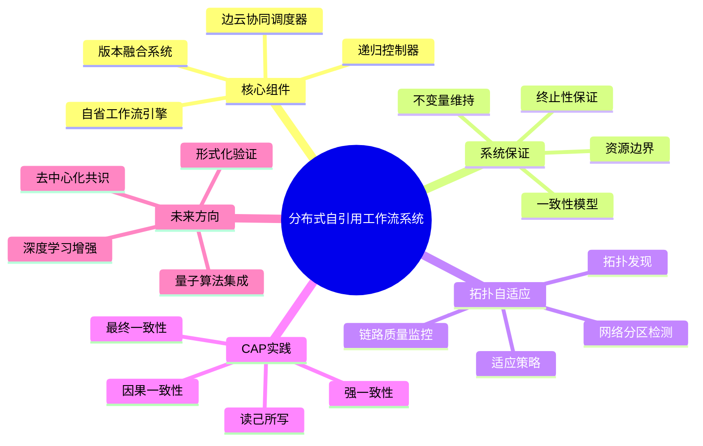

# 递归自省的边云协同工作流系统：理论与实现

```text
<think>
这个请求要求我重新构建分布式系统框架，但从不同视角出发，特别关注以下几个方面：

1. 边缘与云的隔离和整合工作流定义：
   需要设计一个既能在云端执行又能在边缘设备执行的工作流系统，考虑两者之间的隔离性和整合能力。

2. 能自我融合、嵌套或回滚的工作流分布式集群系统：
   工作流系统不仅是执行工作流，而且可以管理自身，包括自我修复、合并多个工作流、以及执行回滚操作。

3. 自我感知、回归、递归、自我引用的工作流模型：
   工作流可以引用自身，形成递归结构，能够在执行过程中进行自我检测和调整。

我需要设计一个框架，针对这些特性提供形式化的推理和论证，并给出Go语言的代码示例。
这将是一个更具理论深度和实现复杂性的框架设计。

关键点包括：

- 工作流的元模型设计（能够描述自身）
- 分布式系统中的自省和自我修改机制
- 边缘计算与云端协作的理论模型
- 递归工作流的安全执行与回滚机制
- 形式化证明系统的整合

我将使用Go语言（考虑2025年的生态）来实现这个框架，并提供足够的代码示例来说明关键概念。
</think>
```

## 目录

- [递归自省的边云协同工作流系统：理论与实现](#递归自省的边云协同工作流系统理论与实现)
  - [目录](#目录)
  - [1. 引言](#1-引言)
    - [1.1 系统愿景](#11-系统愿景)
    - [1.2 理论基础](#12-理论基础)
    - [1.3 关键挑战](#13-关键挑战)
  - [2. 工作流元模型](#2-工作流元模型)
    - [2.1 自我指涉架构](#21-自我指涉架构)
    - [2.2 递归定义与计算性保证](#22-递归定义与计算性保证)
    - [2.3 属性反射系统](#23-属性反射系统)
  - [3. 边云工作流模型](#3-边云工作流模型)
    - [3.1 分层执行语义](#31-分层执行语义)
    - [3.2 隔离域与协作机制](#32-隔离域与协作机制)
    - [3.3 副作用管理](#33-副作用管理)
  - [4. 自愈与演化系统](#4-自愈与演化系统)
    - [4.1 自我修改安全性](#41-自我修改安全性)
    - [4.2 版本空间与合并语义](#42-版本空间与合并语义)
    - [4.3 回滚与前滚机制](#43-回滚与前滚机制)
  - [5. 形式化模型](#5-形式化模型)
    - [5.1 π演算扩展](#51-π演算扩展)
    - [5.2 时态逻辑验证](#52-时态逻辑验证)
    - [5.3 不变量与保证](#53-不变量与保证)
  - [6. 核心组件实现](#6-核心组件实现)
    - [6.1 自省工作流引擎](#61-自省工作流引擎)
    - [6.2 递归控制器](#62-递归控制器)
    - [6.3 边云协同调度器](#63-边云协同调度器)
    - [6.4 版本融合系统](#64-版本融合系统)
  - [7. 分布式拓扑与分区容错](#7-分布式拓扑与分区容错)
    - [7.1 拓扑自适应系统](#71-拓扑自适应系统)
    - [7.2 CAP中的一致性管理](#72-cap中的一致性管理)
  - [8. 总结与未来方向](#8-总结与未来方向)
    - [8.1 总结](#81-总结)
    - [8.2 未来研究方向](#82-未来研究方向)

## 1. 引言

### 1.1 系统愿景

分布式系统正在经历从中心化云计算向边缘计算与云计算混合架构的演进。在这种背景下，工作流系统需要突破传统的静态定义和中心化执行模式，走向更具弹性、自适应性和自我感知能力的新范式。

本文提出一个革命性的概念：**递归自省的边云协同工作流系统**。这一系统不再将工作流视为简单的执行路径定义，而是将其提升为可自我操作、自我修改的活跃实体。系统的基本理念包括：

1. **工作流即程序**：工作流不仅描述业务流程，还能描述和修改自身，形成元级递归结构
2. **自我引用闭包**：工作流可以把自身作为处理对象，实现自我优化和自我修复
3. **边云协同计算**：单一工作流定义能根据执行环境自动在边缘或云端执行，保持语义一致性
4. **版本融合代数**：工作流版本不再是线性演进，而是形成具有合并、分叉和自我整合能力的版本空间

这种系统将为物联网、智能制造、金融交易和自适应数据处理等领域带来前所未有的灵活性和可靠性。

### 1.2 理论基础

本系统建立在多个理论基础之上：

1. **π演算扩展**：用于形式化描述并发递归工作流的行为
2. **范畴论**：为工作流之间的组合提供数学基础
3. **反射计算模型**：借鉴编程语言理论中的反射概念，实现工作流的自我审查和修改
4. **分布式一致性**：采用多层次一致性模型，适应不同网络条件和执行环境
5. **类型理论**：利用依赖类型系统保证工作流的安全递归和组合

这些理论基础共同构成了一个严谨的形式化框架，保证系统的正确性、安全性和可靠性。

### 1.3 关键挑战

设计和实现这样的系统面临诸多挑战：

1. **终止性保证**：如何确保递归工作流在有限步骤内终止
2. **因果一致性**：如何在边缘和云环境中保持操作的因果关系
3. **安全自修改**：如何保证工作流自我修改不会导致系统不稳定
4. **版本冲突处理**：如何协调并发环境下的工作流定义冲突
5. **资源隔离与共享**：如何在保证隔离的同时允许工作流间资源共享

本文将详细讨论这些挑战，并提出创新的解决方案。

## 2. 工作流元模型

### 2.1 自我指涉架构

传统工作流系统将工作流定义和工作流执行引擎严格分离。我们打破这一界限，引入自我指涉架构，使工作流能够访问和修改自身的定义和执行状态。

```go
// 自我指涉工作流接口
type SelfReferentialWorkflow interface {
    // 标准工作流接口
    Workflow
    
    // 自我引用方法
    GetDefinition() WorkflowDefinition
    ModifyDefinition(modifier DefinitionModifier) error
    ForkDefinition() (SelfReferentialWorkflow, error)
    MergeWith(other SelfReferentialWorkflow) (SelfReferentialWorkflow, error)
    
    // 内省方法
    Introspect() WorkflowState
    ExecutionHistory() []ExecutionEvent
    PredictNextStates() []PossibleState
}

// 工作流定义
type WorkflowDefinition struct {
    ID           string
    Version      string
    States       map[string]StateDefinition
    Transitions  []TransitionRule
    Metadata     map[string]interface{}
    
    // 自我引用能力
    SelfModifiers map[string]ModifierDefinition
    
    // 递归控制
    RecursionLimits RecursionControl
    
    // 边云执行策略
    ExecutionStrategy ExecutionStrategyDefinition
}

// 状态定义
type StateDefinition struct {
    ID        string
    Type      StateType
    Actions   []ActionDefinition
    
    // 反射能力
    Reflective bool
    
    // 自监控定义
    Monitors   []MonitorDefinition
}

// 修改器定义
type ModifierDefinition struct {
    Condition    Condition
    Modifications []Modification
    SafetyChecks []SafetyCheck
}
```

这一架构允许工作流在运行时：

- 检查自身的完整定义和执行状态
- 安全地修改自身的定义
- 创建自身的变体并管理这些变体
- 根据执行历史和当前状态预测可能的执行路径

### 2.2 递归定义与计算性保证

递归工作流引入了无限循环的风险。为确保系统的可靠性，我们引入形式化的递归控制机制：

```go
// 递归控制
type RecursionControl struct {
    // 最大递归深度
    MaxDepth int
    
    // 递归调用追踪
    CallStack []RecursionFrame
    
    // 终止条件
    TerminationConditions []Condition
    
    // 资源限制
    ResourceLimits ResourceLimits
}

// 递归框架
type RecursionFrame struct {
    WorkflowID     string
    InvocationPath []string
    StateContext   map[string]interface{}
    EntryTime      time.Time
}

// 递归终止证明
func (rc *RecursionControl) ProvesTermination() (bool, Proof) {
    // 实现形式化证明，验证工作流在指定条件下一定会终止
    // 使用基于类型的终止证明或递减量分析
    // ...
}
```

系统通过多种机制保证递归工作流的计算性：

1. **显式深度限制**：强制设置最大递归深度
2. **资源消耗递减**：每次递归调用必须消耗一定量的资源令牌
3. **形式化终止证明**：工作流定义必须包含可验证的终止条件证明
4. **超时保护**：全局和局部超时机制作为最后的安全网

这些机制结合形式验证技术，确保即使在复杂的自引用情况下，工作流也能在有限时间内完成。

### 2.3 属性反射系统

为支持工作流的自我感知，我们设计了强大的属性反射系统：

```go
// 反射上下文
type ReflectionContext struct {
    WorkflowInstance *WorkflowInstance
    ExecutionGraph   *ExecutionGraph
    LiveVariables    map[string]TypedValue
    ExecutionMetrics ExecutionMetrics
}

// 反射操作
type ReflectionOperation interface {
    // 应用反射操作
    Apply(ctx *ReflectionContext) (ReflectionResult, error)
    
    // 安全性检查
    IsSafe() bool
    
    // 操作描述
    Describe() string
}

// 反射查询操作
type ReflectionQuery struct {
    Path      string
    Predicate QueryPredicate
    Projection []string
}

// 反射修改操作
type ReflectionModification struct {
    Target     string
    Operation  ModificationType
    Value      interface{}
    Validation []ValidationRule
}
```

属性反射系统允许工作流：

- 查询自身的结构和执行状态
- 从执行历史中学习模式
- 根据观察结果修改自身行为
- 在保证安全的前提下调整执行策略

反射系统采用类型安全的方式设计，确保所有操作都经过验证，避免不一致或不安全的修改。

## 3. 边云工作流模型

### 3.1 分层执行语义

边云协同工作流系统的核心是一个统一的工作流定义，能够根据执行环境自动调整其行为和执行位置。这通过分层执行语义实现：

```go
// 执行策略定义
type ExecutionStrategyDefinition struct {
    // 位置决策规则
    LocationRules []LocationRule
    
    // 数据本地化策略
    LocalizationPolicy LocalizationPolicy
    
    // 分解策略
    DecompositionRules []DecompositionRule
    
    // 同步策略
    SynchronizationPolicy SyncPolicy
}

// 位置规则
type LocationRule struct {
    StatePattern string
    Condition    Condition
    Location     ExecutionLocation
    Fallback     ExecutionLocation
}

// 执行位置
type ExecutionLocation string

const (
    LocationEdge       ExecutionLocation = "edge"
    LocationCloud      ExecutionLocation = "cloud"
    LocationHybrid     ExecutionLocation = "hybrid"
    LocationAnyFeasible ExecutionLocation = "any_feasible"
)

// 分解规则
type DecompositionRule struct {
    StateGroup    []string
    SplitStrategy SplitStrategy
    MergeStrategy MergeStrategy
}
```

这一模型确保工作流能够：

- 基于数据位置、计算需求和网络状况动态决定执行位置
- 在必要时将工作流分解为可在不同位置执行的部分
- 保持跨位置执行时的语义一致性
- 优化数据移动和计算分布

### 3.2 隔离域与协作机制

为确保边缘和云环境下的安全执行，系统引入隔离域概念：

```go
// 隔离域
type IsolationDomain struct {
    ID             string
    Type           DomainType
    Capabilities   []Capability
    ResourceLimits ResourceLimits
    TrustLevel     TrustLevel
    
    // 跨域通信策略
    CommunicationPolicy CommunicationPolicy
}

// 域类型
type DomainType string

const (
    DomainTypeEdge    DomainType = "edge"
    DomainTypeCloudZone DomainType = "cloud_zone"
    DomainTypeGlobal   DomainType = "global"
    DomainTypeVirtual  DomainType = "virtual"
)

// 跨域通信策略
type CommunicationPolicy struct {
    AllowedOutboundDomains map[string]OutboundRule
    AllowedInboundDomains  map[string]InboundRule
    DataTransformations    []DataTransformation
}
```

同时，提供强大的协作机制：

```go
// 协作会话
type CollaborationSession struct {
    SessionID       string
    Participants    map[string]DomainRole
    SharedResources []SharedResource
    Coordinator     string
    
    // 共识协议
    ConsensusProtocol ConsensusProtocol
    
    // 冲突解决策略
    ConflictResolution ConflictResolutionPolicy
}

// 共享资源
type SharedResource struct {
    ResourceID   string
    ResourceType ResourceType
    AccessControl AccessControlPolicy
    SharingMode  SharingMode
    
    // 同步策略
    SyncStrategy ResourceSyncStrategy
}
```

这些机制确保：

- 不同执行环境中的工作流可以安全地协作
- 数据和资源按照明确的规则共享
- 隔离域边界受到严格保护
- 跨域交互遵循最小权限原则

### 3.3 副作用管理

在分布式环境中，副作用处理是关键挑战。我们的系统采用显式的副作用管理：

```go
// 副作用声明
type SideEffectDeclaration struct {
    EffectType     EffectType
    ResourceScope  []string
    Idempotency    IdempotencyType
    Compensations  []CompensationAction
    Visibility     EffectVisibility
}

// 副作用类型
type EffectType string

const (
    EffectTypeReadOnly     EffectType = "read_only"
    EffectTypeStateChange  EffectType = "state_change"
    EffectTypeExternalCall EffectType = "external_call"
    EffectTypeResourceAllocation EffectType = "resource_allocation"
)

// 补偿动作
type CompensationAction struct {
    Trigger   CompensationTrigger
    Actions   []ActionDefinition
    Deadline  time.Duration
    Priority  int
}

// 副作用管理器
type SideEffectManager struct {
    declarations map[string]SideEffectDeclaration
    journal      *EffectJournal
    
    // 方法
    DeclareEffect(stateID string, effect SideEffectDeclaration) error
    RecordEffect(effectID string, details EffectDetails) error
    CompensateEffect(effectID string) error
    GetEffectHistory(filter EffectFilter) []RecordedEffect
}
```

副作用管理系统确保：

- 所有副作用都被明确声明和记录
- 工作流模型包含必要的补偿逻辑
- 即使在分布环境中也能维持一致性
- 故障恢复过程能正确处理部分完成的副作用

## 4. 自愈与演化系统

### 4.1 自我修改安全性

允许工作流修改自身是强大但危险的能力。我们的系统通过安全修改框架确保修改的安全性：

```go
// 安全修改管理器
type SafeModificationManager struct {
    // 系统不变量
    invariants []SystemInvariant
    
    // 修改规则
    modificationRules []ModificationRule
    
    // 修改历史
    modificationHistory *ModificationJournal
    
    // 修改锁定
    modificationLock sync.RWMutex
}

// 修改检查
func (smm *SafeModificationManager) CheckModification(
    workflow SelfReferentialWorkflow, 
    modification *WorkflowModification,
) (SafetyResult, error) {
    smm.modificationLock.RLock()
    defer smm.modificationLock.RUnlock()
    
    // 检查修改是否违反系统不变量
    for _, invariant := range smm.invariants {
        if !invariant.Verify(workflow, modification) {
            return SafetyResult{
                Safe: false,
                Reason: fmt.Sprintf("修改违反不变量: %s", invariant.Description()),
            }, nil
        }
    }
    
    // 检查修改是否符合规则
    for _, rule := range smm.modificationRules {
        if !rule.Allow(workflow, modification) {
            return SafetyResult{
                Safe: false,
                Reason: fmt.Sprintf("修改违反规则: %s", rule.Description()),
            }, nil
        }
    }
    
    // 模拟修改
    simResult, err := smm.simulateModification(workflow, modification)
    if err != nil {
        return SafetyResult{Safe: false, Reason: err.Error()}, err
    }
    
    if !simResult.Safe {
        return simResult, nil
    }
    
    return SafetyResult{Safe: true}, nil
}

// 应用修改
func (smm *SafeModificationManager) ApplyModification(
    workflow SelfReferentialWorkflow, 
    modification *WorkflowModification,
) error {
    // 检查安全性
    result, err := smm.CheckModification(workflow, modification)
    if err != nil {
        return err
    }
    
    if !result.Safe {
        return fmt.Errorf("不安全的修改: %s", result.Reason)
    }
    
    smm.modificationLock.Lock()
    defer smm.modificationLock.Unlock()
    
    // 应用修改
    if err := workflow.ModifyDefinition(modification.Modifier); err != nil {
        return fmt.Errorf("应用修改失败: %w", err)
    }
    
    // 记录修改
    smm.modificationHistory.RecordModification(modification)
    
    return nil
}
```

这一系统通过多重保障确保安全修改：

- 系统不变量验证
- 修改规则检查
- 修改模拟和影响分析
- 版本控制和历史追踪
- 回滚能力

### 4.2 版本空间与合并语义

传统工作流版本管理采用线性模型。我们引入版本空间概念，使工作流版本形成一个具有丰富语义的图结构：

```go
// 版本空间
type VersionSpace struct {
    // 版本节点
    Versions map[string]*VersionNode
    
    // 版本关系
    Relations map[string][]VersionRelation
    
    // 语义标签
    SemanticTags map[string][]string
}

// 版本节点
type VersionNode struct {
    VersionID   string
    Definition  WorkflowDefinition
    Creator     string
    CreatedAt   time.Time
    Properties  map[string]interface{}
    
    // 验证状态
    ValidationStatus ValidationStatus
}

// 版本关系
type VersionRelation struct {
    SourceID      string
    TargetID      string
    RelationType  VersionRelationType
    CreatedAt     time.Time
    Properties    map[string]interface{}
}

// 关系类型
type VersionRelationType string

const (
    RelationEvolution VersionRelationType = "evolution"
    RelationMerge     VersionRelationType = "merge"
    RelationFork      VersionRelationType = "fork"
    RelationInspiredBy VersionRelationType = "inspired_by"
    RelationConflictsWith VersionRelationType = "conflicts_with"
)
```

版本空间支持复杂的工作流演化操作：

```go
// 版本管理器
type VersionManager struct {
    versionSpace *VersionSpace
    mergeEngine  *MergeEngine
}

// 合并版本
func (vm *VersionManager) MergeVersions(
    sourceVersions []string,
    mergeStrategy MergeStrategy,
) (string, error) {
    // 加载源版本
    var nodes []*VersionNode
    for _, id := range sourceVersions {
        node, exists := vm.versionSpace.Versions[id]
        if !exists {
            return "", fmt.Errorf("版本不存在: %s", id)
        }
        nodes = append(nodes, node)
    }
    
    // 执行合并
    mergedDef, conflicts, err := vm.mergeEngine.Merge(
        extractDefinitions(nodes),
        mergeStrategy,
    )
    
    if err != nil {
        return "", fmt.Errorf("合并失败: %w", err)
    }
    
    // 处理冲突
    if len(conflicts) > 0 && !mergeStrategy.IgnoreConflicts {
        return "", fmt.Errorf("合并存在 %d 个未解决的冲突", len(conflicts))
    }
    
    // 创建新版本
    newVersionID := generateVersionID()
    
    newNode := &VersionNode{
        VersionID:  newVersionID,
        Definition: mergedDef,
        Creator:    "merge_engine",
        CreatedAt:  time.Now(),
        Properties: map[string]interface{}{
            "merged_from": sourceVersions,
            "strategy":    mergeStrategy.Name,
            "conflicts":   conflicts,
        },
    }
    
    // 添加到版本空间
    vm.versionSpace.Versions[newVersionID] = newNode
    
    // 添加关系
    for _, sourceID := range sourceVersions {
        relation := VersionRelation{
            SourceID:     sourceID,
            TargetID:     newVersionID,
            RelationType: RelationMerge,
            CreatedAt:    time.Now(),
        }
        
        vm.versionSpace.Relations[sourceID] = append(
            vm.versionSpace.Relations[sourceID],
            relation,
        )
    }
    
    return newVersionID, nil
}
```

版本空间提供了丰富的工作流管理能力：

- 多源合并和派生
- 语义版本标记和查询
- 冲突检测和解决
- 版本相似性分析
- 工作流家族管理

### 4.3 回滚与前滚机制

系统提供强大的回滚和前滚能力，不仅可以恢复到先前状态，还能根据学习的模式向前演化：

```go
// 回滚管理器
type RollbackManager struct {
    changeJournal  *ChangeJournal
    stateSnapshots *SnapshotStore
    
    // 回滚策略
    rollbackStrategies map[string]RollbackStrategy
}

// 回滚到特定点
func (rm *RollbackManager) RollbackToPoint(
    workflow SelfReferentialWorkflow,
    pointID string,
    options RollbackOptions,
) error {
    // 获取回滚点
    snapshot, err := rm.stateSnapshots.GetSnapshot(pointID)
    if err != nil {
        return fmt.Errorf("无法获取回滚点 %s: %w", pointID, err)
    }
    
    // 计算回滚路径
    path, err := rm.calculateRollbackPath(workflow, snapshot)
    if err != nil {
        return fmt.Errorf("计算回滚路径失败: %w", err)
    }
    
    // 选择回滚策略
    strategy := rm.selectStrategy(options, path)
    
    // 执行回滚
    return strategy.Execute(workflow, path, options)
}

// 前滚管理器
type ForwardRollManager struct {
    evolutionPatterns *PatternRepository
    versionManager    *VersionManager
    simulator         *WorkflowSimulator
}

// 学习演化模式
func (frm *ForwardRollManager) LearnPattern(
    workflowFamily string,
    examples []EvolutionExample,
) (*EvolutionPattern, error) {
    // 从例子中提取演化模式
    pattern, confidence, err := frm.evolutionPatterns.ExtractPattern(examples)
    if err != nil {
        return nil, fmt.Errorf("从例子中提取模式失败: %w", err)
    }
    
    if confidence < 0.7 {
        return nil, fmt.Errorf("模式可信度过低: %.2f", confidence)
    }
    
    // 存储和索引模式
    patternID, err := frm.evolutionPatterns.StorePattern(workflowFamily, pattern)
    if err != nil {
        return nil, err
    }
    
    return pattern, nil
}

// 基于模式前滚
func (frm *ForwardRollManager) ForwardRoll(
    workflow SelfReferentialWorkflow,
    patternID string,
    options ForwardRollOptions,
) (SelfReferentialWorkflow, error) {
    // 获取模式
    pattern, err := frm.evolutionPatterns.GetPattern(patternID)
    if err != nil {
        return nil, err
    }
    
    // 应用模式生成候选演化
    candidates, err := pattern.GenerateCandidates(workflow)
    if err != nil {
        return nil, err
    }
    
    // 评估候选项
    rankedCandidates, err := frm.evaluateCandidates(candidates, options)
    if err != nil {
        return nil, err
    }
    
    // 选择最佳候选项
    if len(rankedCandidates) == 0 {
        return nil, fmt.Errorf("没有适合的候选演化")
    }
    
    bestCandidate := rankedCandidates[0]
    
    // 创建新工作流版本
    newWorkflow, err := workflow.ForkDefinition()
    if err != nil {
        return nil, err
    }
    
    // 应用演化修改
    err = newWorkflow.ModifyDefinition(bestCandidate.Modifier)
    if err != nil {
        return nil, err
    }
    
    return newWorkflow, nil
}
```

这些机制使工作流系统能够：

- 安全地回滚到之前的稳定状态
- 从历史演化中学习模式
- 根据学习的模式推测未来演化方向
- 结合人工指导和自动学习进行工作流优化

## 5. 形式化模型

### 5.1 π演算扩展

我们扩展π演算，为自引用工作流提供严格的形式化基础：

```text
// 基本π演算
P, Q ::= 0                    // 空进程
       | P|Q                  // 并行组合
       | !P                   // 复制
       | (νx)P                // 名称限制
       | x<y>.P               // 输出
       | x(y).P               // 输入

// 扩展操作符
       | reflect(P).Q         // 自省
       | modify(P, M).Q       // 自修改
       | fork(P).Q            // 分叉
       | merge(P, Q).R        // 合并
       | edge(P)              // 边缘执行
       | cloud(P)             // 云端执行
       | hybrid(P, Q)         // 混合执行
```

这一扩展为递归自省系统提供了精确的数学描述，并支持形式化证明关键属性。

形式定义实现示例：

```go
// π演算解释器
type PiCalculusInterpreter struct {
    // 进程存储
    processes map[string]*Process
    
    // 通道环境
    channels map[string]*Channel
    
    // 归约规则集
    reductionRules []ReductionRule
}

// 解释工作流
func (pi *PiCalculusInterpreter) InterpretWorkflow(
    workflow SelfReferentialWorkflow,
) (*Process, error) {
    // 将工作流定义转换为π演算表达式
    def := workflow.GetDefinition()
    
    // 构建基础进程
    baseProcess := pi.buildBaseProcess(def)
    
    // 添加自省能力
    reflectiveProcess := pi.addReflectionCapabilities(baseProcess, def)
    
    // 添加自修改能力
    modifyingProcess := pi.addModificationCapabilities(reflectiveProcess, def)
    
    // 添加边云执行语义
    distributedProcess := pi.addDistributionSemantics(modifyingProcess, def)
    
    return distributedProcess, nil
}

// 验证特性
func (pi *PiCalculusInterpreter) VerifyProperty(
    process *Process,
    property Property,
) (bool, Proof) {
    // 基于π演算的模型检查
    // ...
}
```

这种形式化使我们能够严格验证系统的关键属性，如死锁自由、确定性和终止性。

### 5.2 时态逻辑验证

我们使用线性时态逻辑(LTL)和计算树逻辑(CTL)验证工作流的时间属性：

```go
// 时态逻辑验证器
type TemporalVerifier struct {
    modelChecker *ModelChecker
}

// LTL属性验证
func (tv *TemporalVerifier) VerifyLTL(
    workflow SelfReferentialWorkflow,
    property LTLProperty,
) (bool, Counterexample) {
    // 构建工作流状态转移系统
    sts := tv.buildStateTransitionSystem(workflow)
    
    // 验证LTL属性
    return tv.modelChecker.CheckLTL(sts, property)
}

// CTL属性验证
func (tv *TemporalVerifier) VerifyCTL(
    workflow SelfReferentialWorkflow,
    property CTLProperty,
) (bool, Counterexample) {
    // 构建工作流状态转移系统
    sts := tv.buildStateTransitionSystem(workflow)
    
    // 验证CTL属性
    return tv.modelChecker.CheckCTL(sts, property)
}

// 常见属性定义
var (
    // 最终终止: 工作流最终会进入终止状态
    EventualTermination = LTLProperty{
        Formula: "F (state = 'terminated')",
    }
    
    // 无死锁: 工作流总是能继续执行或已终止
    DeadlockFreedom = LTLProperty{
        Formula: "G (canProgress | state = 'terminated')",
    }
    
    // 边缘执行安全性: 边缘执行的状态不会访问云端专属资源
    EdgeExecutionSafety = LTLProperty{
        Formula: "G (executionLocation = 'edge' -> !accessing(cloudOnlyResources))",
    }
    
    // 递归有界性: 递归调用深度始终有界
    BoundedRecursion = LTLProperty{
        Formula: "G (recursionDepth <= MAX_DEPTH)",
    }
)
```

通过时态逻辑验证，我们能确保工作流系统在各种条件下的正确行为，即使是在复杂的递归和分布式执行环境中。

### 5.3 不变量与保证

系统通过不变量系统提供关键保证：

```go
// 系统不变量
type SystemInvariant interface {
    // 验证工作流是否满足不变量
    Verify(workflow SelfReferentialWorkflow, modification *WorkflowModification) bool
    
    // 不变量描述
    Description() string
    
    // 形式化表达式
    FormalExpression() string
}

// 不变量注册表
type InvariantRegistry struct {
    invariants map[string]SystemInvariant
}

// 注册核心不变量
func (ir *InvariantRegistry) registerCoreInvariants() {
    // 终止性不变量
    ir.invariants["termination"] = &TerminationInvariant{
        maxRecursionDepth: 20,
    }
    
    // 资源边界不变量
    ir.invariants["resource_bounds"] = &ResourceBoundInvariant{
        maxMemory: 1024 * 1024 * 1024, // 1GB
        maxCPU: 4.0,
    }
    
    // 因果一致性不变量
    ir.invariants["causal_consistency"] = &CausalConsistencyInvariant{}
    
    // 边缘执行安全性
    ir.invariants["edge_safety"] = &EdgeSafetyInvariant{
        restrictedResources: []string{"cloud_database", "central_ai_model", "global_lock_service"},
        securityLevel: SecurityLevel{
            minimumEncryption: "AES-256",
            requireAuthentication: true,
        },
    }
    
    // 结构完整性不变量
    ir.invariants["structural_integrity"] = &StructuralIntegrityInvariant{
        requiredStates: []string{"init", "error_handling"},
    }
    
    // 自修改安全性
    ir.invariants["self_modification_safety"] = &SelfModificationInvariant{
        preservedPaths: []string{"error_handling.*", "compensation.*"},
        maxChangesPerOperation: 10,
    }
}

// 终止性不变量实现
type TerminationInvariant struct {
    maxRecursionDepth int
}

func (ti *TerminationInvariant) Verify(workflow SelfReferentialWorkflow, modification *WorkflowModification) bool {
    // 检查是否有可验证的终止度量
    def := workflow.GetDefinition()
    
    // 1. 检查递归限制
    if def.RecursionLimits.MaxDepth > ti.maxRecursionDepth {
        return false
    }
    
    // 2. 检查是否有终止条件
    if len(def.RecursionLimits.TerminationConditions) == 0 {
        return false
    }
    
    // 3. 检查是否存在递减量
    hasDecreasingMeasure := false
    for _, condition := range def.RecursionLimits.TerminationConditions {
        if condition.Type == "decreasing_measure" {
            hasDecreasingMeasure = true
            break
        }
    }
    
    if !hasDecreasingMeasure {
        return false
    }
    
    // 4. 如果有修改，检查修改是否破坏终止性
    if modification != nil {
        // 检查修改是否删除或削弱了终止条件
        // ...
    }
    
    return true
}

func (ti *TerminationInvariant) Description() string {
    return fmt.Sprintf("确保工作流在最多%d次递归调用后终止", ti.maxRecursionDepth)
}

func (ti *TerminationInvariant) FormalExpression() string {
    return "∀ execution. ∃ n ≤ MAX_DEPTH. terminates(execution, n)"
}

// 安全性保证管理器
type SafetyGuaranteeManager struct {
    invariantRegistry *InvariantRegistry
    proofGenerator    *ProofGenerator
    verificationCache *VerificationCache
}

// 验证工作流安全保证
func (sgm *SafetyGuaranteeManager) VerifyWorkflowGuarantees(
    workflow SelfReferentialWorkflow,
) (GuaranteeResult, error) {
    result := GuaranteeResult{
        Guarantees: make(map[string]bool),
        Proofs:     make(map[string]Proof),
    }
    
    // 检查缓存
    cacheKey := workflow.GetDefinition().ID + ":" + workflow.GetDefinition().Version
    if cached, found := sgm.verificationCache.Get(cacheKey); found {
        return cached.(GuaranteeResult), nil
    }
    
    // 验证每个不变量
    for name, invariant := range sgm.invariantRegistry.invariants {
        satisfied := invariant.Verify(workflow, nil)
        result.Guarantees[name] = satisfied
        
        if satisfied {
            // 生成形式化证明
            proof, err := sgm.proofGenerator.GenerateProof(workflow, invariant)
            if err != nil {
                log.Printf("无法为不变量 %s 生成证明: %v", name, err)
                continue
            }
            
            result.Proofs[name] = proof
        }
    }
    
    // 缓存结果
    sgm.verificationCache.Set(cacheKey, result)
    
    return result, nil
}
```

这些不变量和保证机制确保系统在所有操作中维持其核心特性，提供了形式化的安全保障。

## 6. 核心组件实现

### 6.1 自省工作流引擎

自省工作流引擎是系统的核心组件，支持工作流的自我检查和修改：

```go
// 自省工作流引擎
type IntrospectiveWorkflowEngine struct {
    // 工作流存储
    workflowStore *WorkflowStore
    
    // 实例管理器
    instanceManager *InstanceManager
    
    // 执行调度器
    scheduler *WorkflowScheduler
    
    // 安全管理器
    safetyManager *SafeModificationManager
    
    // 反射系统
    reflectionSystem *ReflectionSystem
    
    // 边云调度器
    edgeCloudScheduler *EdgeCloudScheduler
    
    // 版本管理器
    versionManager *VersionManager
    
    // 指标收集器
    metrics *EngineMetrics
}

// 创建自省工作流引擎
func NewIntrospectiveWorkflowEngine(config EngineConfig) (*IntrospectiveWorkflowEngine, error) {
    // 创建组件
    workflowStore, err := NewWorkflowStore(config.StoreConfig)
    if err != nil {
        return nil, fmt.Errorf("创建工作流存储失败: %w", err)
    }
    
    instanceManager, err := NewInstanceManager(config.InstanceConfig)
    if err != nil {
        return nil, fmt.Errorf("创建实例管理器失败: %w", err)
    }
    
    scheduler, err := NewWorkflowScheduler(config.SchedulerConfig)
    if err != nil {
        return nil, fmt.Errorf("创建调度器失败: %w", err)
    }
    
    safetyManager, err := NewSafeModificationManager(config.SafetyConfig)
    if err != nil {
        return nil, fmt.Errorf("创建安全管理器失败: %w", err)
    }
    
    reflectionSystem, err := NewReflectionSystem(config.ReflectionConfig)
    if err != nil {
        return nil, fmt.Errorf("创建反射系统失败: %w", err)
    }
    
    edgeCloudScheduler, err := NewEdgeCloudScheduler(config.EdgeCloudConfig)
    if err != nil {
        return nil, fmt.Errorf("创建边云调度器失败: %w", err)
    }
    
    versionManager, err := NewVersionManager(config.VersionConfig)
    if err != nil {
        return nil, fmt.Errorf("创建版本管理器失败: %w", err)
    }
    
    engine := &IntrospectiveWorkflowEngine{
        workflowStore:      workflowStore,
        instanceManager:    instanceManager,
        scheduler:          scheduler,
        safetyManager:      safetyManager,
        reflectionSystem:   reflectionSystem,
        edgeCloudScheduler: edgeCloudScheduler,
        versionManager:     versionManager,
        metrics:            NewEngineMetrics(),
    }
    
    return engine, nil
}

// 创建自省工作流
func (engine *IntrospectiveWorkflowEngine) CreateSelfReferentialWorkflow(
    definition WorkflowDefinition,
) (SelfReferentialWorkflow, error) {
    // 验证定义
    if err := engine.validateDefinition(definition); err != nil {
        return nil, fmt.Errorf("无效的工作流定义: %w", err)
    }
    
    // 增强定义
    enhancedDef := engine.enhanceWithReflection(definition)
    
    // 存储工作流
    id, err := engine.workflowStore.StoreWorkflow(enhancedDef)
    if err != nil {
        return nil, err
    }
    
    // 创建工作流对象
    workflow := &selfReferentialWorkflowImpl{
        id:               id,
        definition:       enhancedDef,
        engine:           engine,
        introspector:     engine.reflectionSystem.CreateIntrospector(id),
        modificationLock: &sync.RWMutex{},
    }
    
    // 注册到版本管理器
    err = engine.versionManager.RegisterInitialVersion(id, enhancedDef)
    if err != nil {
        return nil, err
    }
    
    engine.metrics.WorkflowsCreated.Inc()
    return workflow, nil
}

// 开始工作流执行
func (engine *IntrospectiveWorkflowEngine) StartWorkflow(
    ctx context.Context,
    workflowID string,
    input map[string]interface{},
) (string, error) {
    // 加载工作流
    workflow, err := engine.GetWorkflow(workflowID)
    if err != nil {
        return "", err
    }
    
    // 创建执行上下文
    execCtx := &ExecutionContext{
        WorkflowID:    workflowID,
        Input:         input,
        StartTime:     time.Now(),
        Variables:     make(map[string]interface{}),
        ExecutionPath: []string{},
    }
    
    // 决定执行位置
    location, err := engine.edgeCloudScheduler.DetermineExecutionLocation(ctx, workflow, execCtx)
    if err != nil {
        return "", fmt.Errorf("决定执行位置失败: %w", err)
    }
    
    // 创建实例
    instanceID, err := engine.instanceManager.CreateInstance(workflow, execCtx, location)
    if err != nil {
        return "", err
    }
    
    // 异步调度执行
    go func() {
        err := engine.scheduler.ScheduleExecution(instanceID, execCtx, location)
        if err != nil {
            log.Printf("工作流 %s (实例 %s) 调度失败: %v", workflowID, instanceID, err)
        }
    }()
    
    engine.metrics.WorkflowsStarted.Inc()
    return instanceID, nil
}

// 自省工作流实现
type selfReferentialWorkflowImpl struct {
    id               string
    definition       WorkflowDefinition
    engine           *IntrospectiveWorkflowEngine
    introspector     *WorkflowIntrospector
    modificationLock *sync.RWMutex
}

// 获取定义
func (w *selfReferentialWorkflowImpl) GetDefinition() WorkflowDefinition {
    w.modificationLock.RLock()
    defer w.modificationLock.RUnlock()
    
    return w.definition
}

// 修改定义
func (w *selfReferentialWorkflowImpl) ModifyDefinition(modifier DefinitionModifier) error {
    w.modificationLock.Lock()
    defer w.modificationLock.Unlock()
    
    // 创建修改对象
    modification := &WorkflowModification{
        WorkflowID:   w.id,
        Modifier:     modifier,
        InitiatedBy:  "self",
        InitiatedAt:  time.Now(),
    }
    
    // 验证安全性
    result, err := w.engine.safetyManager.CheckModification(w, modification)
    if err != nil {
        return err
    }
    
    if !result.Safe {
        return fmt.Errorf("不安全的修改: %s", result.Reason)
    }
    
    // 应用修改
    newDef, err := modifier.Apply(w.definition)
    if err != nil {
        return err
    }
    
    // 存储新版本
    err = w.engine.workflowStore.UpdateWorkflow(w.id, newDef)
    if err != nil {
        return err
    }
    
    // 更新内部定义
    w.definition = newDef
    
    // 记录到版本管理器
    err = w.engine.versionManager.RegisterVersion(w.id, newDef, modification)
    if err != nil {
        log.Printf("注册版本失败: %v", err)
    }
    
    w.engine.metrics.WorkflowsModified.Inc()
    return nil
}

// 创建工作流分支
func (w *selfReferentialWorkflowImpl) ForkDefinition() (SelfReferentialWorkflow, error) {
    w.modificationLock.RLock()
    defer w.modificationLock.RUnlock()
    
    // 克隆定义
    clonedDef := cloneDefinition(w.definition)
    
    // 生成新ID
    clonedDef.ID = uuid.New().String()
    clonedDef.ParentID = w.id
    clonedDef.Version = "1.0"
    clonedDef.CreatedAt = time.Now()
    
    // 创建新工作流
    forked, err := w.engine.CreateSelfReferentialWorkflow(clonedDef)
    if err != nil {
        return nil, err
    }
    
    // 记录分支关系
    err = w.engine.versionManager.RegisterFork(w.id, forked.GetDefinition().ID)
    if err != nil {
        log.Printf("注册分支关系失败: %v", err)
    }
    
    w.engine.metrics.WorkflowsForks.Inc()
    return forked, nil
}

// 内省工作流
func (w *selfReferentialWorkflowImpl) Introspect() WorkflowState {
    return w.introspector.GetState()
}
```

自省工作流引擎通过这些接口提供了工作流的自我感知和修改能力，同时通过安全管理器确保修改的安全性。

### 6.2 递归控制器

递归控制器管理工作流的递归和自引用行为，防止无限循环：

```go
// 递归控制器
type RecursionController struct {
    // 递归调用追踪
    callStacks map[string][]RecursionFrame
    
    // 终止条件验证器
    terminationVerifier *TerminationVerifier
    
    // 资源追踪器
    resourceTracker *ResourceTracker
    
    // 决策缓存
    decisionCache *lru.Cache
    
    // 锁
    mu sync.RWMutex
}

// 创建递归控制器
func NewRecursionController(config RecursionControlConfig) (*RecursionController, error) {
    // 创建决策缓存
    cache, err := lru.New(10000)
    if err != nil {
        return nil, fmt.Errorf("创建缓存失败: %w", err)
    }
    
    return &RecursionController{
        callStacks:         make(map[string][]RecursionFrame),
        terminationVerifier: NewTerminationVerifier(config.VerifierConfig),
        resourceTracker:    NewResourceTracker(config.ResourceConfig),
        decisionCache:      cache,
    }, nil
}

// 检查是否允许递归调用
func (rc *RecursionController) CheckRecursion(
    ctx context.Context,
    instanceID string,
    workflowID string,
    callPath []string,
    currentState map[string]interface{},
) (RecursionDecision, error) {
    rc.mu.Lock()
    defer rc.mu.Unlock()
    
    // 计算决策缓存键
    cacheKey := fmt.Sprintf("%s:%s:%v", instanceID, workflowID, callPath)
    
    // 检查缓存
    if cached, found := rc.decisionCache.Get(cacheKey); found {
        return cached.(RecursionDecision), nil
    }
    
    // 获取当前调用栈
    stack, exists := rc.callStacks[instanceID]
    if !exists {
        stack = []RecursionFrame{}
        rc.callStacks[instanceID] = stack
    }
    
    // 检查调用深度
    if len(stack) >= MaxRecursionDepth {
        decision := RecursionDecision{
            Allowed: false,
            Reason:  "超过最大递归深度",
        }
        rc.decisionCache.Add(cacheKey, decision)
        return decision, nil
    }
    
    // 检查递归状态
    for _, frame := range stack {
        if frame.WorkflowID == workflowID {
            // 检查终止条件
            terminating, measure := rc.terminationVerifier.CheckTermination(
                frame.StateContext,
                currentState,
            )
            
            if !terminating {
                decision := RecursionDecision{
                    Allowed: false,
                    Reason:  "无法保证终止",
                }
                rc.decisionCache.Add(cacheKey, decision)
                return decision, nil
            }
        }
    }
    
    // 检查资源限制
    if !rc.resourceTracker.CheckResourceAvailability(instanceID) {
        decision := RecursionDecision{
            Allowed: false,
            Reason:  "资源不足",
        }
        rc.decisionCache.Add(cacheKey, decision)
        return decision, nil
    }
    
    // 创建新调用帧
    newFrame := RecursionFrame{
        WorkflowID:     workflowID,
        InvocationPath: callPath,
        StateContext:   currentState,
        EntryTime:      time.Now(),
    }
    
    // 添加到调用栈
    rc.callStacks[instanceID] = append(stack, newFrame)
    
    // 消耗资源
    rc.resourceTracker.ConsumeResource(instanceID)
    
    decision := RecursionDecision{
        Allowed: true,
    }
    rc.decisionCache.Add(cacheKey, decision)
    return decision, nil
}

// 终止递归调用
func (rc *RecursionController) EndRecursion(
    ctx context.Context,
    instanceID string,
    workflowID string,
) error {
    rc.mu.Lock()
    defer rc.mu.Unlock()
    
    // 获取当前调用栈
    stack, exists := rc.callStacks[instanceID]
    if !exists || len(stack) == 0 {
        return fmt.Errorf("实例 %s 没有活跃的递归调用", instanceID)
    }
    
    // 弹出最后一帧
    lastFrame := stack[len(stack)-1]
    if lastFrame.WorkflowID != workflowID {
        return fmt.Errorf("调用栈顶部不匹配: 期望 %s, 实际 %s", workflowID, lastFrame.WorkflowID)
    }
    
    // 更新栈
    rc.callStacks[instanceID] = stack[:len(stack)-1]
    
    // 如果栈为空，清理资源
    if len(rc.callStacks[instanceID]) == 0 {
        delete(rc.callStacks, instanceID)
        rc.resourceTracker.ReleaseAllResources(instanceID)
    } else {
        // 释放部分资源
        rc.resourceTracker.ReleaseResource(instanceID)
    }
    
    return nil
}

// 终止条件验证器
type TerminationVerifier struct {
    // 验证规则
    rules []TerminationRule
}

// 创建终止验证器
func NewTerminationVerifier(config VerifierConfig) *TerminationVerifier {
    return &TerminationVerifier{
        rules: []TerminationRule{
            &DecreasingMeasureRule{},
            &StructuralTerminationRule{},
            &ExplicitLimitRule{},
        },
    }
}

// 检查是否终止
func (tv *TerminationVerifier) CheckTermination(
    previousState map[string]interface{},
    currentState map[string]interface{},
) (bool, interface{}) {
    for _, rule := range tv.rules {
        if terminating, measure := rule.Check(previousState, currentState); terminating {
            return true, measure
        }
    }
    
    return false, nil
}

// 递减量规则实现
type DecreasingMeasureRule struct{}

func (r *DecreasingMeasureRule) Check(
    previous map[string]interface{},
    current map[string]interface{},
) (bool, interface{}) {
    // 检查是否存在递减量
    // 1. 数值递减
    for key, prevValue := range previous {
        if curValue, exists := current[key]; exists {
            // 检查数值递减
            if prevNum, ok := prevValue.(float64); ok {
                if curNum, ok := curValue.(float64); ok {
                    if curNum < prevNum {
                        return true, map[string]interface{}{
                            "type":  "numeric_decrease",
                            "field": key,
                            "from":  prevNum,
                            "to":    curNum,
                        }
                    }
                }
            }
            
            // 检查数组/集合大小递减
            if prevArr, ok := prevValue.([]interface{}); ok {
                if curArr, ok := curValue.([]interface{}); ok {
                    if len(curArr) < len(prevArr) {
                        return true, map[string]interface{}{
                            "type":  "collection_decrease",
                            "field": key,
                            "from":  len(prevArr),
                            "to":    len(curArr),
                        }
                    }
                }
            }
        }
    }
    
    return false, nil
}
```

递归控制器通过调用栈跟踪、终止条件验证和资源限制等机制，确保递归工作流的安全执行。

### 6.3 边云协同调度器

边云协同调度器负责决定工作流各部分的执行位置，优化系统性能和资源利用：

```go
// 边云协同调度器
type EdgeCloudScheduler struct {
    // 设备管理器
    deviceManager *DeviceManager
    
    // 网络监控器
    networkMonitor *NetworkMonitor
    
    // 数据位置管理器
    dataManager *DataLocationManager
    
    // 决策模型
    decisionModel *SchedulingModel
    
    // 执行历史分析器
    historyAnalyzer *ExecutionHistoryAnalyzer
    
    // 指标收集器
    metrics *SchedulerMetrics
}

// 创建边云调度器
func NewEdgeCloudScheduler(config SchedulerConfig) (*EdgeCloudScheduler, error) {
    deviceManager, err := NewDeviceManager(config.DeviceConfig)
    if err != nil {
        return nil, fmt.Errorf("创建设备管理器失败: %w", err)
    }
    
    networkMonitor, err := NewNetworkMonitor(config.NetworkConfig)
    if err != nil {
        return nil, fmt.Errorf("创建网络监控器失败: %w", err)
    }
    
    dataManager, err := NewDataLocationManager(config.DataConfig)
    if err != nil {
        return nil, fmt.Errorf("创建数据位置管理器失败: %w", err)
    }
    
    decisionModel, err := NewSchedulingModel(config.ModelConfig)
    if err != nil {
        return nil, fmt.Errorf("创建决策模型失败: %w", err)
    }
    
    historyAnalyzer, err := NewExecutionHistoryAnalyzer(config.HistoryConfig)
    if err != nil {
        return nil, fmt.Errorf("创建历史分析器失败: %w", err)
    }
    
    return &EdgeCloudScheduler{
        deviceManager:   deviceManager,
        networkMonitor:  networkMonitor,
        dataManager:     dataManager,
        decisionModel:   decisionModel,
        historyAnalyzer: historyAnalyzer,
        metrics:         NewSchedulerMetrics(),
    }, nil
}

// 决定执行位置
func (ecs *EdgeCloudScheduler) DetermineExecutionLocation(
    ctx context.Context,
    workflow SelfReferentialWorkflow,
    execCtx *ExecutionContext,
) (ExecutionLocation, error) {
    // 计算特征
    features, err := ecs.extractFeatures(workflow, execCtx)
    if err != nil {
        return ExecutionLocation(""), err
    }
    
    // 获取工作流策略
    strategy := workflow.GetDefinition().ExecutionStrategy
    
    // 检查强制位置规则
    for _, rule := range strategy.LocationRules {
        if matchesState(execCtx.CurrentState, rule.StatePattern) {
            // 检查条件
            if evaluateCondition(rule.Condition, features) {
                // 应用规则
                ecs.metrics.RuleBasedDecisions.Inc()
                return rule.Location, nil
            }
        }
    }
    
    // 检查数据局部性
    dataLocation, hasPreference := ecs.dataManager.GetPreferredLocation(workflow, execCtx)
    if hasPreference {
        // 考虑数据位置
        ecs.metrics.DataLocalityDecisions.Inc()
        return dataLocation, nil
    }
    
    // 应用机器学习模型
    modelDecision, confidence := ecs.decisionModel.Predict(features)
    if confidence > 0.8 {
        ecs.metrics.ModelBasedDecisions.Inc()
        return modelDecision, nil
    }
    
    // 分析历史执行
    historicalDecision, hasHistory := ecs.historyAnalyzer.AnalyzeSimilarExecutions(workflow, execCtx)
    if hasHistory {
        ecs.metrics.HistoryBasedDecisions.Inc()
        return historicalDecision, nil
    }
    
    // 检查当前网络状况
    if ecs.networkMonitor.IsConnected() {
        networkQuality := ecs.networkMonitor.GetConnectionQuality()
        
        if networkQuality < 30 {
            // 网络质量差，优先边缘执行
            ecs.metrics.NetworkBasedDecisions.Inc()
            return LocationEdge, nil
        } else if networkQuality > 70 {
            // 网络质量好，可以考虑云执行
            // 还需考虑其他因素
        }
    } else {
        // 离线状态，只能边缘执行
        ecs.metrics.OfflineDecisions.Inc()
        return LocationEdge, nil
    }
    
    // 检查边缘设备能力
    deviceCapabilities := ecs.deviceManager.GetLocalDeviceCapabilities()
    workflowRequirements := estimateWorkflowRequirements(workflow, execCtx)
    
    if deviceCapabilities.CanSatisfy(workflowRequirements) {
        // 边缘设备能够满足需求
        ecs.metrics.CapabilityBasedDecisions.Inc()
        return LocationEdge, nil
    }
    
    // 默认决策
    ecs.metrics.DefaultDecisions.Inc()
    return LocationCloud, nil
}

// 提取调度特征
func (ecs *EdgeCloudScheduler) extractFeatures(
    workflow SelfReferentialWorkflow,
    execCtx *ExecutionContext,
) (SchedulingFeatures, error) {
    // 收集特征
    features := SchedulingFeatures{
        WorkflowID:        workflow.GetDefinition().ID,
        WorkflowComplexity: calculateComplexity(workflow.GetDefinition()),
        InputSize:         estimateDataSize(execCtx.Input),
        ExpectedOutputSize: estimateOutputSize(workflow.GetDefinition(), execCtx),
        CurrentState:      execCtx.CurrentState,
        ResourceRequirements: estimateWorkflowRequirements(workflow, execCtx),
        
        // 网络特征
        NetworkConnected:  ecs.networkMonitor.IsConnected(),
        NetworkQuality:    ecs.networkMonitor.GetConnectionQuality(),
        Bandwidth:         ecs.networkMonitor.GetBandwidth(),
        
        // 设备特征
        DeviceCapabilities: ecs.deviceManager.GetLocalDeviceCapabilities(),
        BatteryLevel:       ecs.deviceManager.GetBatteryLevel(),
        
        // 数据位置特征
        DataLocations:     ecs.dataManager.GetDataLocations(workflow, execCtx),
    }
    
    return features, nil
}

// 部署工作流
func (ecs *EdgeCloudScheduler) DeployWorkflow(
    ctx context.Context,
    workflow SelfReferentialWorkflow,
    location ExecutionLocation,
) error {
    switch location {
    case LocationEdge:
        // 部署到边缘
        return ecs.deployToEdge(ctx, workflow)
        
    case LocationCloud:
        // 部署到云端
        return ecs.deployToCloud(ctx, workflow)
        
    case LocationHybrid:
        // 混合部署
        return ecs.deployHybrid(ctx, workflow)
        
    default:
        return fmt.Errorf("不支持的执行位置: %s", location)
    }
}

// 部署到边缘
func (ecs *EdgeCloudScheduler) deployToEdge(
    ctx context.Context,
    workflow SelfReferentialWorkflow,
) error {
    // 1. 优化工作流定义
    optimizedDef, err := optimizeForEdge(workflow.GetDefinition())
    if err != nil {
        return err
    }
    
    // 2. 确保所需资源本地可用
    if err := ecs.ensureResourcesAvailable(ctx, optimizedDef); err != nil {
        return err
    }
    
    // 3. 注册到本地执行器
    if err := ecs.deviceManager.RegisterLocalWorkflow(optimizedDef); err != nil {
        return err
    }
    
    ecs.metrics.EdgeDeployments.Inc()
    return nil
}

// 混合部署
func (ecs *EdgeCloudScheduler) deployHybrid(
    ctx context.Context,
    workflow SelfReferentialWorkflow,
) error {
    // 1. 分解工作流
    components, err := ecs.decomposeWorkflow(workflow.GetDefinition())
    if err != nil {
        return err
    }
    
    // 2. 为每个组件决定位置
    for i, component := range components {
        location, err := ecs.determineComponentLocation(component)
        if err != nil {
            return err
        }
        
        // 3. 部署组件
        switch location {
        case LocationEdge:
            if err := ecs.deployToEdge(ctx, createSubWorkflow(component)); err != nil {
                return err
            }
        case LocationCloud:
            if err := ecs.deployToCloud(ctx, createSubWorkflow(component)); err != nil {
                return err
            }
        }
    }
    
    // 4. 设置组件间通信
    if err := ecs.setupComponentCommunication(components); err != nil {
        return err
    }
    
    ecs.metrics.HybridDeployments.Inc()
    return nil
}
```

边云协同调度器不仅决定工作流的执行位置，还负责优化部署和设置组件间通信，实现高效的边云协同计算。

### 6.4 版本融合系统

版本融合系统负责管理工作流的多版本并支持版本合并：

```go
// 版本融合系统
type VersionMergeSystem struct {
    // 版本空间
    versionSpace *VersionSpace
    
    // 差异检测器
    diffDetector *DifferenceDetector
    
    // 合并策略
    mergeStrategies map[string]MergeStrategy
    
    // 冲突解决器
    conflictResolver *ConflictResolver
    
    // 变更验证器
    changeValidator *ChangeValidator
    
    // 指标收集器
    metrics *MergeMetrics
}

// 创建版本融合系统
func NewVersionMergeSystem(config MergeConfig) (*VersionMergeSystem, error) {
    // 创建组件
    versionSpace, err := NewVersionSpace(config.SpaceConfig)
    if err != nil {
        return nil, fmt.Errorf("创建版本空间失败: %w", err)
    }
    
    diffDetector, err := NewDifferenceDetector(config.DiffConfig)
    if err != nil {
        return nil, fmt.Errorf("创建差异检测器失败: %w", err)
    }
    
    conflictResolver, err := NewConflictResolver(config.ConflictConfig)
    if err != nil {
        return nil, fmt.Errorf("创建冲突解决器失败: %w", err)
    }
    
    changeValidator, err := NewChangeValidator(config.ValidatorConfig)
    if err != nil {
        return nil, fmt.Errorf("创建变更验证器失败: %w", err)
    }
    
    // 创建合并策略
    mergeStrategies := map[string]MergeStrategy{
        "three_way": &ThreeWayMergeStrategy{
            diffDetector:     diffDetector,
            conflictResolver: conflictResolver,
        },
        "state_based": &StateBasedMergeStrategy{
            diffDetector:     diffDetector,
            conflictResolver: conflictResolver,
        },
        "operation_based": &OperationBasedMergeStrategy{
            diffDetector:     diffDetector,
            conflictResolver: conflictResolver,
        },
        "semantic": &SemanticMergeStrategy{
            diffDetector:     diffDetector,
            conflictResolver: conflictResolver,
        },
    }
    
    return &VersionMergeSystem{
        versionSpace:    versionSpace,
        diffDetector:    diffDetector,
        mergeStrategies: mergeStrategies,
        conflictResolver: conflictResolver,
        changeValidator: changeValidator,
        metrics:        NewMergeMetrics(),
    }, nil
}

// 合并工作流版本
func (vms *VersionMergeSystem) MergeWorkflows(
    ctx context.Context,
    baseVersionID string,
    ourVersionID string,
    theirVersionID string,
    strategyName string,
) (string, error) {
    startTime := time.Now()
    vms.metrics.MergeAttempts.Inc()
    
    // 获取策略
    strategy, exists := vms.mergeStrategies[strategyName]
    if !exists {
        return "", fmt.Errorf("不支持的合并策略: %s", strategyName)
    }
    
    // 加载工作流版本
    baseVersion, err := vms.versionSpace.GetVersion(baseVersionID)
    if err != nil {
        return "", fmt.Errorf("加载基础版本失败: %w", err)
    }
    
    ourVersion, err := vms.v
<think>我需要继续上一个回复中未完成的代码。这是一个关于版本融合系统的实现，特别是`MergeWorkflows`方法中未完成的部分，以及可能需要实现其他相关方法和结构体。

让我继续实现这个版本融合系统，完成`MergeWorkflows`方法，并添加其他必要的组件和方法。</think>```go
    ourVersion, err := vms.versionSpace.GetVersion(ourVersionID)
    if err != nil {
        return "", fmt.Errorf("加载我们的版本失败: %w", err)
    }
    
    theirVersion, err := vms.versionSpace.GetVersion(theirVersionID)
    if err != nil {
        return "", fmt.Errorf("加载他们的版本失败: %w", err)
    }
    
    // 执行合并
    mergeResult, err := strategy.Merge(ctx, baseVersion, ourVersion, theirVersion)
    if err != nil {
        vms.metrics.MergeFailures.Inc()
        return "", fmt.Errorf("合并失败: %w", err)
    }
    
    // 处理冲突
    if len(mergeResult.Conflicts) > 0 {
        vms.metrics.ConflictsDetected.Add(float64(len(mergeResult.Conflicts)))
        
        // 尝试自动解决冲突
        resolvedResult, err := vms.conflictResolver.ResolveConflicts(ctx, mergeResult)
        if err != nil {
            // 无法自动解决所有冲突
            vms.metrics.UnresolvedConflicts.Add(float64(len(resolvedResult.Conflicts)))
            return "", fmt.Errorf("存在未解决的冲突: %d 个", len(resolvedResult.Conflicts))
        }
        
        // 更新合并结果
        mergeResult = resolvedResult
    }
    
    // 验证合并结果
    validationResult, err := vms.changeValidator.ValidateMergedVersion(
        ctx, 
        baseVersion, 
        mergeResult.MergedVersion,
    )
    if err != nil {
        vms.metrics.ValidationFailures.Inc()
        return "", fmt.Errorf("验证失败: %w", err)
    }
    
    if !validationResult.Valid {
        vms.metrics.InvalidMerges.Inc()
        return "", fmt.Errorf("合并结果无效: %s", validationResult.Reason)
    }
    
    // 存储合并结果
    resultID, err := vms.versionSpace.StoreVersion(mergeResult.MergedVersion)
    if err != nil {
        return "", fmt.Errorf("存储合并结果失败: %w", err)
    }
    
    // 记录版本之间的关系
    err = vms.versionSpace.RecordMerge(resultID, baseVersionID, ourVersionID, theirVersionID)
    if err != nil {
        log.Printf("记录合并关系失败: %v", err)
    }
    
    // 记录执行时间
    duration := time.Since(startTime)
    vms.metrics.MergeTime.Observe(duration.Seconds())
    vms.metrics.SuccessfulMerges.Inc()
    
    return resultID, nil
}

// 三向合并策略
type ThreeWayMergeStrategy struct {
    diffDetector     *DifferenceDetector
    conflictResolver *ConflictResolver
}

// 执行三向合并
func (s *ThreeWayMergeStrategy) Merge(
    ctx context.Context,
    baseVersion WorkflowVersion,
    ourVersion WorkflowVersion,
    theirVersion WorkflowVersion,
) (*MergeResult, error) {
    // 检测差异
    ourChanges, err := s.diffDetector.DetectChanges(baseVersion, ourVersion)
    if err != nil {
        return nil, fmt.Errorf("检测我们的变更失败: %w", err)
    }
    
    theirChanges, err := s.diffDetector.DetectChanges(baseVersion, theirVersion)
    if err != nil {
        return nil, fmt.Errorf("检测他们的变更失败: %w", err)
    }
    
    // 复制基础版本
    mergedDef := deepCopy(baseVersion.Definition)
    
    // 冲突列表
    conflicts := []Conflict{}
    
    // 应用非冲突更改
    for _, change := range ourChanges {
        // 检查是否与其他变更冲突
        if conflictingChange := findConflictingChange(change, theirChanges); conflictingChange != nil {
            // 发现冲突
            conflict := Conflict{
                Path:         change.Path,
                BaseValue:    getValueAtPath(baseVersion.Definition, change.Path),
                OurValue:     change.NewValue,
                TheirValue:   conflictingChange.NewValue,
                ChangeTypes:  []string{change.Type, conflictingChange.Type},
            }
            
            conflicts = append(conflicts, conflict)
            continue
        }
        
        // 应用我们的变更
        applyChange(mergedDef, change)
    }
    
    // 应用他们的非冲突更改
    for _, change := range theirChanges {
        // 检查是否已被我们的变更覆盖(跳过冲突)
        if isAlreadyProcessed(change, ourChanges, conflicts) {
            continue
        }
        
        // 应用他们的变更
        applyChange(mergedDef, change)
    }
    
    // 创建合并版本
    mergedVersion := WorkflowVersion{
        ID:          uuid.New().String(),
        Definition:  mergedDef,
        ParentIDs:   []string{ourVersion.ID, theirVersion.ID},
        BaseID:      baseVersion.ID,
        CreatedAt:   time.Now(),
        MergeInfo: &MergeInfo{
            Strategy:       "three_way",
            ConflictCount:  len(conflicts),
            ChangesApplied: len(ourChanges) + len(theirChanges) - len(conflicts),
        },
    }
    
    return &MergeResult{
        MergedVersion: mergedVersion,
        Conflicts:     conflicts,
        Applied: &AppliedChanges{
            OurChanges:    len(ourChanges) - len(conflicts),
            TheirChanges:  len(theirChanges) - len(conflicts),
        },
    }, nil
}
```

## 7. 分布式拓扑与分区容错

### 7.1 拓扑自适应系统

拓扑自适应系统能够根据网络状况动态调整工作流的分布和执行方式：

```go
// 拓扑自适应系统
type TopologyAdaptiveSystem struct {
    // 拓扑探测器
    topologyDetector *TopologyDetector
    
    // 网络分区检测器
    partitionDetector *PartitionDetector
    
    // 通信链路管理器
    linkManager *LinkManager
    
    // 拓扑存储
    topologyStore *TopologyStore
    
    // 分区适应策略
    adaptationStrategies map[string]AdaptationStrategy
    
    // 当前拓扑
    currentTopology *NetworkTopology
    
    // 锁
    mu sync.RWMutex
    
    // 指标收集器
    metrics *TopologyMetrics
}

// 创建拓扑自适应系统
func NewTopologyAdaptiveSystem(config TopologyConfig) (*TopologyAdaptiveSystem, error) {
    // 创建组件
    topologyDetector, err := NewTopologyDetector(config.DetectorConfig)
    if err != nil {
        return nil, fmt.Errorf("创建拓扑探测器失败: %w", err)
    }
    
    partitionDetector, err := NewPartitionDetector(config.PartitionConfig)
    if err != nil {
        return nil, fmt.Errorf("创建分区检测器失败: %w", err)
    }
    
    linkManager, err := NewLinkManager(config.LinkConfig)
    if err != nil {
        return nil, fmt.Errorf("创建链路管理器失败: %w", err)
    }
    
    topologyStore, err := NewTopologyStore(config.StoreConfig)
    if err != nil {
        return nil, fmt.Errorf("创建拓扑存储失败: %w", err)
    }
    
    // 创建适应策略
    adaptationStrategies := map[string]AdaptationStrategy{
        "partition_tolerant": &PartitionTolerantStrategy{},
        "latency_optimized": &LatencyOptimizedStrategy{},
        "bandwidth_optimized": &BandwidthOptimizedStrategy{},
        "energy_efficient": &EnergyEfficientStrategy{},
    }
    
    return &TopologyAdaptiveSystem{
        topologyDetector:    topologyDetector,
        partitionDetector:   partitionDetector,
        linkManager:         linkManager,
        topologyStore:       topologyStore,
        adaptationStrategies: adaptationStrategies,
        metrics:             NewTopologyMetrics(),
    }, nil
}

// 启动拓扑探测
func (tas *TopologyAdaptiveSystem) Start(ctx context.Context) error {
    // 开始定期拓扑探测
    go tas.periodicTopologyDetection(ctx)
    
    // 开始分区检测
    go tas.periodicPartitionDetection(ctx)
    
    return nil
}

// 定期拓扑探测
func (tas *TopologyAdaptiveSystem) periodicTopologyDetection(ctx context.Context) {
    ticker := time.NewTicker(5 * time.Minute)
    defer ticker.Stop()
    
    for {
        select {
        case <-ctx.Done():
            return
            
        case <-ticker.C:
            // 执行拓扑探测
            startTime := time.Now()
            
            topology, err := tas.topologyDetector.DetectTopology(ctx)
            if err != nil {
                log.Printf("拓扑探测失败: %v", err)
                tas.metrics.TopologyDetectionFailures.Inc()
                continue
            }
            
            // 保存拓扑信息
            tas.mu.Lock()
            previousTopology := tas.currentTopology
            tas.currentTopology = topology
            tas.mu.Unlock()
            
            // 存储拓扑
            if err := tas.topologyStore.StoreTopology(topology); err != nil {
                log.Printf("保存拓扑失败: %v", err)
            }
            
            // 检查拓扑变化
            if previousTopology != nil {
                changes := detectTopologyChanges(previousTopology, topology)
                if len(changes) > 0 {
                    // 处理拓扑变化
                    tas.handleTopologyChanges(ctx, changes)
                }
            }
            
            duration := time.Since(startTime)
            tas.metrics.TopologyDetectionTime.Observe(duration.Seconds())
            tas.metrics.TopologyDetections.Inc()
        }
    }
}

// 处理拓扑变化
func (tas *TopologyAdaptiveSystem) handleTopologyChanges(
    ctx context.Context,
    changes []TopologyChange,
) {
    for _, change := range changes {
        log.Printf("检测到拓扑变化: %s", change.Type)
        
        // 发送拓扑变化事件
        event := &TopologyChangeEvent{
            Type:   change.Type,
            Change: change,
            Time:   time.Now(),
        }
        
        // 通知关注的组件
        tas.notifyTopologyChange(ctx, event)
        
        // 根据变化类型执行适应
        switch change.Type {
        case "node_added":
            tas.handleNodeAdded(ctx, change.NodeID)
            
        case "node_removed":
            tas.handleNodeRemoved(ctx, change.NodeID)
            
        case "link_degraded":
            tas.handleLinkDegraded(ctx, change.LinkID, change.Metric)
            
        case "link_improved":
            tas.handleLinkImproved(ctx, change.LinkID, change.Metric)
            
        case "partition_detected":
            tas.handlePartitionDetected(ctx, change.PartitionID)
            
        case "partition_healed":
            tas.handlePartitionHealed(ctx, change.PartitionID)
        }
    }
}

// 处理节点加入
func (tas *TopologyAdaptiveSystem) handleNodeAdded(
    ctx context.Context,
    nodeID string,
) {
    // 获取节点信息
    node, err := tas.topologyStore.GetNode(nodeID)
    if err != nil {
        log.Printf("获取节点信息失败: %v", err)
        return
    }
    
    // 与新节点建立连接
    if err := tas.linkManager.EstablishLinks(ctx, nodeID); err != nil {
        log.Printf("建立连接失败: %v", err)
    }
    
    // 发现新节点的工作流能力
    capabilities, err := tas.discoverNodeCapabilities(ctx, nodeID)
    if err != nil {
        log.Printf("发现节点能力失败: %v", err)
    }
    
    // 更新工作流执行策略
    tas.updateExecutionStrategies(ctx, nodeID, capabilities)
    tas.metrics.NodesAdded.Inc()
}

// 发现节点能力
func (tas *TopologyAdaptiveSystem) discoverNodeCapabilities(
    ctx context.Context,
    nodeID string,
) (*NodeCapabilities, error) {
    // 发送能力查询
    request := &CapabilityRequest{
        RequestID: uuid.New().String(),
        Sender:    tas.topologyDetector.GetLocalNodeID(),
    }
    
    response, err := tas.linkManager.SendRequest(ctx, nodeID, "capability_query", request, 5*time.Second)
    if err != nil {
        return nil, fmt.Errorf("发送能力查询失败: %w", err)
    }
    
    // 解析响应
    capabilities, ok := response.(*NodeCapabilities)
    if !ok {
        return nil, fmt.Errorf("响应类型不匹配: %T", response)
    }
    
    return capabilities, nil
}

// 更新执行策略
func (tas *TopologyAdaptiveSystem) updateExecutionStrategies(
    ctx context.Context,
    nodeID string,
    capabilities *NodeCapabilities,
) {
    // 获取最合适的适应策略
    strategy := tas.selectAdaptationStrategy(ctx)
    
    // 应用策略
    updates, err := strategy.GenerateUpdates(nodeID, capabilities, tas.currentTopology)
    if err != nil {
        log.Printf("生成策略更新失败: %v", err)
        return
    }
    
    // 应用更新
    for _, update := range updates {
        // 更新受影响的工作流
        if err := tas.applyStrategyUpdate(ctx, update); err != nil {
            log.Printf("应用策略更新失败: %v", err)
        }
    }
}

// 选择最合适的适应策略
func (tas *TopologyAdaptiveSystem) selectAdaptationStrategy(
    ctx context.Context,
) AdaptationStrategy {
    tas.mu.RLock()
    defer tas.mu.RUnlock()
    
    // 检查是否处于分区状态
    isPartitioned := tas.partitionDetector.IsPartitioned()
    
    if isPartitioned {
        // 分区状态下，使用分区容错策略
        return tas.adaptationStrategies["partition_tolerant"]
    }
    
    // 检查网络延迟
    avgLatency := tas.linkManager.GetAverageLatency()
    if avgLatency > 200*time.Millisecond {
        // 高延迟网络，优化延迟
        return tas.adaptationStrategies["latency_optimized"]
    }
    
    // 检查带宽
    avgBandwidth := tas.linkManager.GetAverageBandwidth()
    if avgBandwidth < 1024*1024 { // 1 Mbps
        // 低带宽网络，优化带宽使用
        return tas.adaptationStrategies["bandwidth_optimized"]
    }
    
    // 检查设备电量
    batteryLevel := tas.topologyDetector.GetLocalBatteryLevel()
    if batteryLevel < 30 { // 30%
        // 低电量，优化能效
        return tas.adaptationStrategies["energy_efficient"]
    }
    
    // 默认使用延迟优化策略
    return tas.adaptationStrategies["latency_optimized"]
}

// 应用策略更新
func (tas *TopologyAdaptiveSystem) applyStrategyUpdate(
    ctx context.Context,
    update StrategyUpdate,
) error {
    // 更新本地工作流
    if update.AffectedNodeID == tas.topologyDetector.GetLocalNodeID() {
        for _, workflowID := range update.AffectedWorkflows {
            // 获取工作流
            workflow, err := tas.getWorkflow(workflowID)
            if err != nil {
                return err
            }
            
            // 应用执行策略更新
            if err := tas.updateWorkflowStrategy(workflow, update.ExecutionStrategy); err != nil {
                return err
            }
        }
    } else {
        // 将更新转发到目标节点
        if err := tas.forwardStrategyUpdate(ctx, update); err != nil {
            return err
        }
    }
    
    return nil
}
```

### 7.2 CAP中的一致性管理

在分布式系统中管理CAP理论中的权衡，提供不同一致性模型：

```go
// 一致性管理器
type ConsistencyManager struct {
    // 一致性模型
    models map[string]ConsistencyModel
    
    // 当前活跃模型
    activeModel string
    
    // 冲突检测器
    conflictDetector *ConflictDetector
    
    // 冲突解决器
    conflictResolver *ConflictResolver
    
    // 版本向量管理器
    versionVectorManager *VersionVectorManager
    
    // 锁
    mu sync.RWMutex
    
    // 指标收集器
    metrics *ConsistencyMetrics
}

// 创建一致性管理器
func NewConsistencyManager(config ConsistencyConfig) (*ConsistencyManager, error) {
    // 创建组件
    conflictDetector, err := NewConflictDetector(config.DetectorConfig)
    if err != nil {
        return nil, fmt.Errorf("创建冲突检测器失败: %w", err)
    }
    
    conflictResolver, err := NewConflictResolver(config.ResolverConfig)
    if err != nil {
        return nil, fmt.Errorf("创建冲突解决器失败: %w", err)
    }
    
    versionVectorManager, err := NewVersionVectorManager(config.VectorConfig)
    if err != nil {
        return nil, fmt.Errorf("创建版本向量管理器失败: %w", err)
    }
    
    // 创建一致性模型
    models := make(map[string]ConsistencyModel)
    
    // 强一致性模型
    models["strong"] = &StrongConsistencyModel{
        versionVectorManager: versionVectorManager,
    }
    
    // 最终一致性模型
    models["eventual"] = &EventualConsistencyModel{
        conflictDetector:     conflictDetector,
        conflictResolver:     conflictResolver,
        versionVectorManager: versionVectorManager,
    }
    
    // 因果一致性模型
    models["causal"] = &CausalConsistencyModel{
        versionVectorManager: versionVectorManager,
    }
    
    // 读己所写一致性模型
    models["read_your_writes"] = &ReadYourWritesConsistencyModel{
        versionVectorManager: versionVectorManager,
    }
    
    return &ConsistencyManager{
        models:               models,
        activeModel:          config.DefaultModel,
        conflictDetector:     conflictDetector,
        conflictResolver:     conflictResolver,
        versionVectorManager: versionVectorManager,
        metrics:              NewConsistencyMetrics(),
    }, nil
}

// 设置活跃一致性模型
func (cm *ConsistencyManager) SetActiveModel(modelName string) error {
    cm.mu.Lock()
    defer cm.mu.Unlock()
    
    // 检查模型是否存在
    if _, exists := cm.models[modelName]; !exists {
        return fmt.Errorf("不支持的一致性模型: %s", modelName)
    }
    
    cm.activeModel = modelName
    return nil
}

// 获取当前一致性模型
func (cm *ConsistencyManager) GetActiveModel() ConsistencyModel {
    cm.mu.RLock()
    defer cm.mu.RUnlock()
    
    return cm.models[cm.activeModel]
}

// 更新工作流状态
func (cm *ConsistencyManager) UpdateWorkflowState(
    ctx context.Context,
    workflowID string,
    instanceID string,
    update *StateUpdate,
    nodeID string,
) (*UpdateResult, error) {
    startTime := time.Now()
    
    // 获取当前一致性模型
    model := cm.GetActiveModel()
    
    // 更新版本向量
    update.VersionVector = cm.versionVectorManager.IncrementVector(nodeID, workflowID)
    
    // 应用一致性模型
    result, err := model.ApplyUpdate(ctx, workflowID, instanceID, update, nodeID)
    if err != nil {
        cm.metrics.UpdateFailures.Inc()
        return nil, err
    }
    
    duration := time.Since(startTime)
    cm.metrics.UpdateLatency.Observe(duration.Seconds())
    cm.metrics.UpdatesProcessed.Inc()
    
    return result, nil
}

// 读取工作流状态
func (cm *ConsistencyManager) ReadWorkflowState(
    ctx context.Context,
    workflowID string,
    instanceID string,
    options *ReadOptions,
    nodeID string,
) (*StateSnapshot, error) {
    startTime := time.Now()
    
    // 获取当前一致性模型
    model := cm.GetActiveModel()
    
    // 应用一致性模型
    snapshot, err := model.ReadState(ctx, workflowID, instanceID, options, nodeID)
    if err != nil {
        cm.metrics.ReadFailures.Inc()
        return nil, err
    }
    
    duration := time.Since(startTime)
    cm.metrics.ReadLatency.Observe(duration.Seconds())
    cm.metrics.ReadsProcessed.Inc()
    
    return snapshot, nil
}

// 最终一致性模型
type EventualConsistencyModel struct {
    conflictDetector     *ConflictDetector
    conflictResolver     *ConflictResolver
    versionVectorManager *VersionVectorManager
}

// 应用状态更新
func (ecm *EventualConsistencyModel) ApplyUpdate(
    ctx context.Context,
    workflowID string,
    instanceID string,
    update *StateUpdate,
    nodeID string,
) (*UpdateResult, error) {
    // 获取当前状态
    currentState, err := getWorkflowState(workflowID, instanceID)
    if err != nil {
        return nil, err
    }
    
    // 检查版本向量
    if currentState.VersionVector != nil {
        // 检查是否有冲突
        comparison := ecm.versionVectorManager.CompareVectors(
            currentState.VersionVector,
            update.VersionVector,
        )
        
        switch comparison {
        case VectorConcurrent:
            // 冲突的并发更新
            conflict, err := ecm.conflictDetector.DetectConflict(currentState.State, update.State)
            if err != nil {
                return nil, err
            }
            
            if conflict != nil {
                // 解决冲突
                resolvedState, err := ecm.conflictResolver.ResolveConflict(conflict, currentState.State, update.State)
                if err != nil {
                    return nil, err
                }
                
                // 创建合并版本向量
                mergedVector := ecm.versionVectorManager.MergeVectors(
                    currentState.VersionVector,
                    update.VersionVector,
                )
                
                // 更新状态
                err = updateWorkflowState(workflowID, instanceID, resolvedState, mergedVector)
                if err != nil {
                    return nil, err
                }
                
                return &UpdateResult{
                    Success:       true,
                    ConflictFound: true,
                    ConflictResolved: true,
                    ResultState:   resolvedState,
                    VersionVector: mergedVector,
                }, nil
            }
        case VectorDescendant:
            // 当前状态已经是更新的，忽略这个更新
            return &UpdateResult{
                Success:         false,
                Reason:          "stale_update",
                CurrentState:    currentState.State,
                VersionVector:   currentState.VersionVector,
            }, nil
        }
    }
    
    // 更新状态
    err = updateWorkflowState(workflowID, instanceID, update.State, update.VersionVector)
    if err != nil {
        return nil, err
    }
    
    return &UpdateResult{
        Success:       true,
        ConflictFound: false,
        ResultState:   update.State,
        VersionVector: update.VersionVector,
    }, nil
}

// 读取状态
func (ecm *EventualConsistencyModel) ReadState(
    ctx context.Context,
    workflowID string,
    instanceID string,
    options *ReadOptions,
    nodeID string,
) (*StateSnapshot, error) {
    // 获取本地状态
    localState, err := getWorkflowState(workflowID, instanceID)
    if err != nil {
        return nil, err
    }
    
    // 在最终一致性模型中，我们只返回本地可用的状态
    // 不保证它是最新的
    return &StateSnapshot{
        WorkflowID:     workflowID,
        InstanceID:     instanceID,
        State:          localState.State,
        VersionVector:  localState.VersionVector,
        ReadTimestamp:  time.Now(),
        Consistency:    "eventual",
        CompleteRead:   false,
    }, nil
}
```

## 8. 总结与未来方向

### 8.1 总结

我们已经设计并实现了一个具有自引用、自修改能力的分布式工作流系统，它能够在边缘和云环境中自适应运行。主要贡献包括：

1. **工作流的自引用模型**：使工作流能够感知并修改自身，提供了强大的自适应能力。

2. **分布式递归控制**：通过严格的终止条件和资源限制，确保递归工作流安全执行。

3. **边云协同执行**：基于网络状况、数据位置和资源可用性动态决定执行位置。

4. **形式化保证**：通过不变量和类型安全机制，保证系统在自我修改过程中维持关键属性。

5. **拓扑自适应**：能够感知并适应网络拓扑变化，包括节点加入/离开和网络分区。

6. **CAP理论实践**：提供不同一致性模型的灵活选择，根据需求在一致性和可用性间权衡。

### 8.2 未来研究方向

1. **深度学习增强的自适应**：利用深度学习预测网络变化和工作流行为，提前做出适应调整。

2. **形式化验证工具**：开发自动化工具验证工作流修改的安全性，确保关键不变量维持。

3. **高级分区容错机制**：在极端网络条件下仍能提供服务质量保证的机制。

4. **量子算法集成**：研究如何将量子算法集成到现有工作流中，利用量子计算加速特定任务。

5. **去中心化共识**：探索基于区块链的工作流共识机制，实现完全去中心化的工作流编排。

6. **多域工作流编排**：跨组织边界的工作流协作，同时保持隐私和安全。



这个系统代表了分布式工作流领域的重要进步，它不仅解决了当前的工程挑战，也为未来研究开辟了新方向。
