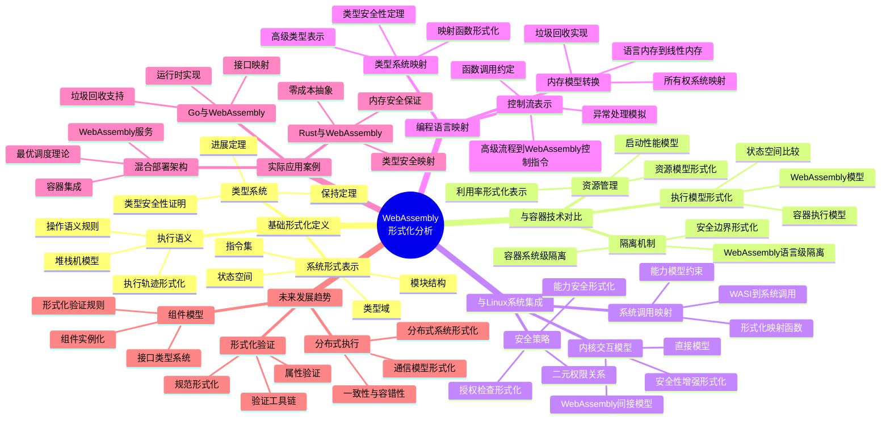

# WebAssembly与系统生态的形式化分析

## 目录

- [WebAssembly与系统生态的形式化分析](#webassembly与系统生态的形式化分析)
  - [目录](#目录)
  - [1. WebAssembly基础形式化定义](#1-webassembly基础形式化定义)
    - [1.1 形式系统表示](#11-形式系统表示)
    - [1.2 类型系统与安全性证明](#12-类型系统与安全性证明)
    - [1.3 执行语义形式化](#13-执行语义形式化)
  - [2. WebAssembly与容器技术形式化对比](#2-webassembly与容器技术形式化对比)
    - [2.1 执行模型对比](#21-执行模型对比)
    - [2.2 隔离机制形式化](#22-隔离机制形式化)
    - [2.3 资源管理模型](#23-资源管理模型)
  - [3. WebAssembly与Linux系统集成](#3-webassembly与linux系统集成)
    - [3.1 系统调用映射](#31-系统调用映射)
    - [3.2 内核交互模型](#32-内核交互模型)
    - [3.3 安全策略形式化](#33-安全策略形式化)
  - [4. 编程语言到WebAssembly的形式化映射](#4-编程语言到webassembly的形式化映射)
    - [4.1 类型系统映射](#41-类型系统映射)
    - [4.2 内存模型转换](#42-内存模型转换)
    - [4.3 控制流表示](#43-控制流表示)
  - [5. 实际应用与代码示例](#5-实际应用与代码示例)
    - [5.1 Rust与WebAssembly](#51-rust与webassembly)
    - [5.2 Go与WebAssembly](#52-go与webassembly)
    - [5.3 混合部署架构](#53-混合部署架构)
  - [6. 未来发展的形式化模型](#6-未来发展的形式化模型)
    - [6.1 组件模型形式化](#61-组件模型形式化)
    - [6.2 分布式执行理论](#62-分布式执行理论)
    - [6.3 形式化验证前景](#63-形式化验证前景)
  - [7. 思维导图](#7-思维导图)

## 1. WebAssembly基础形式化定义

### 1.1 形式系统表示

WebAssembly可以形式化表示为一个完整的计算系统 $\mathcal{W} = (T, F, M, I, E, R)$，其中：

- $T$ 是类型域，包含基本类型集合 $T_{basic} = \{i32, i64, f32, f64, funcref, externref\}$
- $F$ 是指令集合，定义了状态转换函数 $F: S \times I \rightarrow S$，其中 $S$ 是执行状态，$I$ 是指令
- $M$ 是模块结构，形式化为 $M = (types, funcs, tables, mems, globals, elem, data)$
- $I$ 是导入接口集合，定义为 $I = \{(module, name, desc)\}$
- $E$ 是导出接口集合，定义为 $E = \{(name, desc)\}$
- $R$ 是规约规则集合，定义WebAssembly程序的执行语义

**形式化证明示例**：WebAssembly的类型安全性可以通过进展(Progress)和保持(Preservation)定理证明：

定理(Progress)：如果 $\vdash s : t$ 且 $s$ 不是值，则 $\exists s'$ 使得 $s \to s'$

定理(Preservation)：如果 $\vdash s : t$ 且 $s \to s'$，则 $\vdash s' : t$

这两个定理共同保证WebAssembly程序的执行不会"卡住"，且类型在执行过程中保持一致。

### 1.2 类型系统与安全性证明

WebAssembly类型系统可以形式化为判断式 $\Gamma \vdash e : \tau$，表示在上下文 $\Gamma$ 中表达式 $e$ 具有类型 $\tau$。

**类型检查算法形式化**：

验证函数 $\text{validate}: \text{Module} \rightarrow \{\text{true}, \text{false}\}$

对于模块 $m$，$\text{validate}(m)$ 当且仅当以下条件满足：

1. $\forall f \in m.\text{funcs}, \text{typecheck}(f) = \text{true}$
2. $\forall t \in m.\text{tables}, t.\text{limits}.\text{min} \leq t.\text{limits}.\text{max}$
3. $\forall mem \in m.\text{mems}, mem.\text{limits}.\text{min} \leq mem.\text{limits}.\text{max} \leq 2^{16}$

**内存安全性证明**：

通过证明所有内存访问都在验证的边界内，可以形式化证明WebAssembly的内存安全性：

定理(内存安全)：对于任何已验证的WebAssembly模块 $m$，
如果 $(s, f) \xrightarrow{i} (s', f')$ 是一个执行步骤，且 $i$ 是内存访问指令，
则访问的内存地址 $addr$ 满足 $0 \leq addr < |mem|$，其中 $|mem|$ 是当前内存大小。

证明：通过归纳法证明验证过程确保所有内存访问指令在执行前进行边界检查。

### 1.3 执行语义形式化

WebAssembly执行语义可以形式化为小步操作语义：

**堆栈机模型**：

WebAssembly执行状态 $S = (stack, locals, globals, memory, tables)$

**规约规则示例**：

(常量指令)
$\frac{}{S; (const~v)::instr \Rightarrow S; v::instr}$

(局部变量获取)
$\frac{locals[i] = v}{S; (local.get~i)::instr \Rightarrow S; v::instr}$

(局部变量设置)
$\frac{locals' = locals[i \mapsto v]}{S, v; (local.set~i)::instr \Rightarrow S; instr}$

(内存存储)
$\frac{addr + n \leq |memory|}{S, v; (i32.store~n~addr)::instr \Rightarrow S[memory/memory[addr:addr+n] \mapsto v]; instr}$

**执行轨迹**：

程序执行可以表示为状态转换序列：
$S_0 \xrightarrow{i_1} S_1 \xrightarrow{i_2} \ldots \xrightarrow{i_n} S_n$

## 2. WebAssembly与容器技术形式化对比

### 2.1 执行模型对比

WebAssembly和Docker容器执行模型可以通过形式化模型进行对比：

**WebAssembly执行模型 $\mathcal{E}_W$**：
$\mathcal{E}_W = (VM, I, O, S, T)$，其中：

- $VM$ 是WebAssembly虚拟机
- $I$ 是输入集合
- $O$ 是输出集合
- $S$ 是执行状态空间
- $T: S \times I \rightarrow S \times O$ 是状态转换函数

**容器执行模型 $\mathcal{E}_C$**：
$\mathcal{E}_C = (OS, N, I, O, S, T)$，其中：

- $OS$ 是操作系统内核
- $N$ 是命名空间隔离机制
- $I$ 是输入集合
- $O$ 是输出集合
- $S$ 是执行状态空间
- $T: S \times I \rightarrow S \times O$ 是状态转换函数

**形式化区别**：

1. 隔离级别：WebAssembly隔离在指令级别，而容器隔离在系统调用级别
2. 状态空间：$|S_W| \ll |S_C|$，WebAssembly状态空间显著小于容器
3. 转换函数复杂度：$complexity(T_W) < complexity(T_C)$

### 2.2 隔离机制形式化

WebAssembly和容器技术使用不同的隔离机制：

**WebAssembly隔离形式化**：

定义安全属性 $\phi_W$：程序无法访问未授权的内存区域或执行未验证的代码。

$\forall m \in \text{Module}, \forall s \in S, \text{validate}(m) \Rightarrow \phi_W(exec(m, s))$

**容器隔离形式化**：

定义安全属性 $\phi_C$：容器无法访问主机或其他容器的资源。

$\forall c \in \text{Container}, \forall r \in \text{Resources}, access(c, r) \Rightarrow authorized(c, r)$

**形式化对比**：

- WebAssembly隔离基于语言级别的类型安全和内存边界检查
- 容器隔离基于操作系统级别的命名空间和权限控制
- WebAssembly隔离粒度更细，抽象级别更高

```rust
// Rust中WebAssembly的内存隔离示例
#[wasm_bindgen]
pub fn safe_memory_access(ptr: u32, len: u32) -> Result<u32, String> {
    // 边界检查确保内存访问安全
    if (ptr as usize) + (len as usize) > wasm_bindgen::memory().size() {
        return Err("内存访问越界".to_string());
    }
    
    // 安全访问内存
    let memory = unsafe { slice::from_raw_parts(ptr as *const u8, len as usize) };
    let sum = memory.iter().map(|&x| x as u32).sum();
    
    Ok(sum)
}
```

### 2.3 资源管理模型

WebAssembly和容器技术的资源管理模型形式化对比：

**WebAssembly资源模型**：

$R_W = (Mem, Tab, Glob, Func)$，其中：

- $Mem$ 是线性内存，大小受限于 $2^{32}$ 字节
- $Tab$ 是函数表，包含函数引用
- $Glob$ 是全局变量集合
- $Func$ 是函数集合

**容器资源模型**：

$R_C = (CPU, Mem, IO, Net, FS)$，其中：

- $CPU$ 是计算资源，可通过cgroups限制
- $Mem$ 是内存资源，可通过cgroups限制
- $IO$ 是IO带宽，可通过cgroups限制
- $Net$ 是网络资源，通过命名空间和iptables控制
- $FS$ 是文件系统资源，通过挂载命名空间控制

**资源利用率形式化**：

定义资源利用函数 $U(r, p)$ 表示程序 $p$ 对资源 $r$ 的利用率：

对于相同功能的程序 $p_W$ (WebAssembly) 和 $p_C$ (容器)：

- $U(Mem, p_W) > U(Mem, p_C)$：WebAssembly内存利用率更高
- $U(CPU, p_W) \approx U(CPU, p_C)$：CPU利用率类似
- $startup(p_W) \ll startup(p_C)$：WebAssembly启动时间显著短于容器

## 3. WebAssembly与Linux系统集成

### 3.1 系统调用映射

WebAssembly通过WASI (WebAssembly System Interface) 实现与操作系统的交互，可形式化为映射关系：

**形式化映射**：

定义映射函数 $M: WASI \rightarrow Syscalls$，将WASI函数映射到Linux系统调用：

```math
M(fd_read) = read
M(fd_write) = write
M(path_open) = open
M(fd_close) = close
...
```

**安全性约束**：

WASI访问受能力模型限制，形式化为：
$\forall f \in WASI, exec(f, args) \Rightarrow has\_capability(current\_context, required\_capability(f))$

```rust
// Rust WASI系统调用映射示例
use std::fs::File;
use std::io::{self, Read, Write};

fn wasi_file_example() -> io::Result<()> {
    // WASI path_open映射到Linux open系统调用
    let mut file = File::create("example.txt")?;
    
    // WASI fd_write映射到Linux write系统调用
    file.write_all(b"Hello, WASI!")?;
    
    // WASI fd_close隐式映射到Linux close系统调用
    drop(file);
    
    // WASI path_open + fd_read映射到Linux open + read系统调用
    let mut file = File::open("example.txt")?;
    let mut contents = String::new();
    file.read_to_string(&mut contents)?;
    
    println!("Read from file: {}", contents);
    Ok(())
}
```

### 3.2 内核交互模型

WebAssembly与Linux内核交互模型的形式化表示：

**直接模型**：

传统程序与Linux内核交互：$P \xrightarrow{syscall} K \xrightarrow{result} P$

**WebAssembly模型**：

WebAssembly程序与Linux内核交互：$W \xrightarrow{WASI} R \xrightarrow{syscall} K \xrightarrow{result} R \xrightarrow{WASI} W$

其中 $W$ 是WebAssembly模块，$R$ 是运行时，$K$ 是内核。

**形式化属性**：

- 额外的间接层提供安全检查：$security(W \rightarrow K) > security(P \rightarrow K)$
- 性能开销：$latency(W \rightarrow K) > latency(P \rightarrow K)$

**形式化安全性增强**：

定义过滤函数 $F: Syscalls \times Args \rightarrow \{allow, deny\}$

$\forall s \in Syscalls, \forall a \in Args, W \xrightarrow{s,a} K \Rightarrow F(s,a) = allow$

### 3.3 安全策略形式化

WebAssembly与Linux安全机制的形式化对比：

**Linux安全机制**：

- 基于DAC (Discretionary Access Control)
- 基于MAC (Mandatory Access Control)：SELinux, AppArmor
- 基于capabilities

**WebAssembly安全机制**：

- 基于能力的沙箱模型
- 所有权限必须显式授予

**形式化对比**：

Linux安全判定：$access(process, resource) \Rightarrow check\_perm(process, resource)$

WebAssembly安全判定：$access(module, resource) \Rightarrow has\_capability(module, resource)$

**能力模型形式化**：

WASI能力可形式化为二元关系：$C \subseteq Entity \times Resource$

授权检查可形式化为：$auth(e, r, op) \Rightarrow (e, r) \in C \land perm(r, op)$

```rust
// Rust WASI能力模型示例
use std::fs::File;
use std::io::Write;

fn capability_example() {
    // 在WebAssembly+WASI环境中，只有预先授权的目录才能访问
    if let Ok(mut file) = File::create("./authorized_dir/file.txt") {
        writeln!(file, "能力模型允许写入此文件").unwrap();
    } else {
        eprintln!("没有创建文件的权限");
    }
    
    // 尝试访问未授权目录会失败
    if let Ok(_) = File::open("/unauthorized_dir/secret.txt") {
        // 在正确配置的WASI环境中永远不会执行
        println!("安全漏洞：能够访问未授权文件");
    } else {
        println!("安全限制正常：无法访问未授权文件");
    }
}

// 编译命令：rustc --target wasm32-wasi -o capability_example.wasm capability_example.rs
// 运行命令：wasmtime --dir=./authorized_dir capability_example.wasm
```

## 4. 编程语言到WebAssembly的形式化映射

### 4.1 类型系统映射

不同编程语言类型系统到WebAssembly类型系统的形式化映射：

**形式化映射函数**：
$T_L: TypeL \rightarrow TypeW$，将语言L的类型映射到WebAssembly类型

**Rust类型映射示例**：

```math
T_Rust(i32) = i32
T_Rust(i64) = i64
T_Rust(f32) = f32
T_Rust(f64) = f64
T_Rust(bool) = i32 // 0 = false, 1 = true
T_Rust(&T) = i32 // 内存地址
T_Rust(String) = (i32, i32) // 指针和长度对
T_Rust(Vec<T>) = (i32, i32, i32) // 指针、长度和容量三元组
```

**Go类型映射示例**：

```math
T_Go(int) = i32 或 i64 (取决于目标平台)
T_Go(float64) = f64
T_Go(bool) = i32
T_Go(string) = (i32, i32) // 指针和长度对
T_Go([]T) = (i32, i32, i32) // 指针、长度和容量三元组
T_Go(map[K]V) = i32 // 映射到运行时结构的指针
T_Go(interface{}) = (i32, i32) // 类型ID和数据指针对
```

**类型安全性定理**：

对于任何源语言L的表达式e和类型τ，如果在L中 $\Gamma \vdash_L e : \tau$，
则在WebAssembly中 $T_\Gamma \vdash_W T_e : T_\tau$，
其中 $T_\Gamma$, $T_e$, $T_\tau$ 分别是上下文、表达式和类型的映射。

### 4.2 内存模型转换

编程语言内存模型到WebAssembly线性内存的形式化转换：

**Rust内存模型映射**：

Rust的所有权系统在编译到WebAssembly时被静态检查，运行时不需要表示：
$M_{Rust} = (Stack, Heap, Static) \mapsto M_W = LinearMemory$

映射函数：$\phi: M_{Rust} \rightarrow M_W$

```math
φ(Stack(v)) = LinearMemory[stack_ptr + offset(v)]
φ(Heap(v)) = LinearMemory[heap_ptr + offset(v)]
φ(Static(v)) = LinearMemory[static_ptr + offset(v)]
```

**Go内存模型映射**：

Go的垃圾回收内存模型需要在WebAssembly中显式实现：
$M_{Go} = (Stack, Heap, GC) \mapsto M_W = (LinearMemory, GCImpl)$

其中 $GCImpl$ 是在WebAssembly中实现的垃圾回收器。

```go
// Go WebAssembly内存模型示例
func main() {
    // 分配内存 - 在WASM中由自定义分配器管理
    data := make([]byte, 1024)
    
    // 写入数据
    for i := 0; i < len(data); i++ {
        data[i] = byte(i % 256)
    }
    
    // 计算校验和
    checksum := calculateChecksum(data)
    println("校验和:", checksum)
    
    // 内存将由WASM中的GC实现自动回收
}

// 对应的WebAssembly伪代码:
// (func $main
//   ;; 调用内存分配器分配1024字节
//   (local $data i32)
//   (local.set $data (call $allocate (i32.const 1024)))
//   
//   ;; 写入数据循环
//   (local $i i32)
//   (local.set $i (i32.const 0))
//   (block
//     (loop
//       ;; 检查是否完成
//       (br_if 1 (i32.ge_u (local.get $i) (i32.const 1024)))
//       
//       ;; 写入数据
//       (i32.store8
//         (i32.add (local.get $data) (local.get $i))
//         (i32.rem_u (local.get $i) (i32.const 256))
//       )
//       
//       ;; 增加计数器
//       (local.set $i (i32.add (local.get $i) (i32.const 1)))
//       (br 0)
//     )
//   )
//   
//   ;; 计算校验和
//   (call $println_int (call $calculateChecksum (local.get $data) (i32.const 1024)))
// )
```

### 4.3 控制流表示

编程语言控制流结构到WebAssembly控制指令的形式化映射：

**高级控制流映射函数**：
$C: ControlFlow_L \rightarrow ControlInstr_W$

**条件语句映射**：

```math
C(if e then s1 else s2) = 
  eval(e)
  (if 
    (then C(s1))
    (else C(s2))
  )
```

**循环映射**：

```math
C(while e do s) = 
  (block $exit
    (loop $continue
      eval(e)
      (br_if $exit (i32.eqz))
      C(s)
      (br $continue)
    )
  )
```

**异常处理映射**：

在不支持异常的WebAssembly中模拟异常处理：

```math
C(try s1 catch(e) s2) =
  (block $try_exit
    (block $catch
      ;; 设置异常处理上下文
      (call $push_exception_handler (i32.const $catch))
      
      ;; 尝试执行代码
      C(s1)
      
      ;; 移除异常处理上下文
      (call $pop_exception_handler)
      (br $try_exit)
    )
    
    ;; 捕获处理
    (call $get_exception) ;; 获取异常对象
    C(s2)
  )
```

## 5. 实际应用与代码示例

### 5.1 Rust与WebAssembly

Rust作为WebAssembly的首选语言之一，提供了优秀的编译支持和生态系统：

**类型映射优势**：

Rust的零成本抽象和所有权系统使其特别适合编译到WebAssembly：

```rust
// Rust WebAssembly图像处理示例
use wasm_bindgen::prelude::*;

// 结构体在WebAssembly内存中的表示
#[derive(Clone, Copy)]
#[repr(C)]
pub struct Pixel {
    r: u8,
    g: u8,
    b: u8,
    a: u8,
}

// 导出给JavaScript的图像处理函数
#[wasm_bindgen]
pub fn apply_filter(
    data_ptr: *mut u8,
    width: u32,
    height: u32,
    filter_type: u32
) -> bool {
    // 安全检查
    if data_ptr.is_null() {
        return false;
    }
    
    // 安全地从原始指针创建可变切片
    let byte_len = (width * height * 4) as usize;
    let data = unsafe { std::slice::from_raw_parts_mut(data_ptr, byte_len) };
    
    // 将字节数据解释为像素数组
    let pixels = unsafe { 
        std::slice::from_raw_parts_mut(
            data.as_mut_ptr() as *mut Pixel,
            (width * height) as usize
        )
    };
    
    // 应用选定的滤镜
    match filter_type {
        0 => grayscale_filter(pixels),
        1 => sepia_filter(pixels),
        2 => invert_filter(pixels),
        _ => return false,
    }
    
    true
}

// 灰度滤镜实现
fn grayscale_filter(pixels: &mut [Pixel]) {
    for pixel in pixels {
        let gray = (0.299 * pixel.r as f32 + 
                    0.587 * pixel.g as f32 + 
                    0.114 * pixel.b as f32) as u8;
        pixel.r = gray;
        pixel.g = gray;
        pixel.b = gray;
        // alpha通道保持不变
    }
}

// 复古滤镜实现
fn sepia_filter(pixels: &mut [Pixel]) {
    for pixel in pixels {
        let r = pixel.r as f32;
        let g = pixel.g as f32;
        let b = pixel.b as f32;
        
        let new_r = (0.393 * r + 0.769 * g + 0.189 * b).min(255.0) as u8;
        let new_g = (0.349 * r + 0.686 * g + 0.168 * b).min(255.0) as u8;
        let new_b = (0.272 * r + 0.534 * g + 0.131 * b).min(255.0) as u8;
        
        pixel.r = new_r;
        pixel.g = new_g;
        pixel.b = new_b;
    }
}

// 反转滤镜实现
fn invert_filter(pixels: &mut [Pixel]) {
    for pixel in pixels {
        pixel.r = 255 - pixel.r;
        pixel.g = 255 - pixel.g;
        pixel.b = 255 - pixel.b;
    }
}
```

**与JavaScript交互**：

```javascript
// 在JavaScript中使用上面的Rust WebAssembly模块
async function processImage() {
    // 加载WASM模块
    const wasmModule = await import('./image_filters.js');
    
    // 获取画布和图像数据
    const canvas = document.getElementById('imageCanvas');
    const ctx = canvas.getContext('2d');
    const imageData = ctx.getImageData(0, 0, canvas.width, canvas.height);
    
    // 获取图像数据的内存视图
    const dataPtr = wasmModule.getMemoryDataPtr(imageData.data.length);
    
    // 复制图像数据到WASM内存
    const memory = wasmModule.memory;
    new Uint8Array(memory.buffer).set(imageData.data, dataPtr);
    
    // 应用滤镜 (0=灰度, 1=复古, 2=反转)
    const filterType = parseInt(document.getElementById('filterSelect').value);
    const success = wasmModule.apply_filter(
        dataPtr,
        canvas.width,
        canvas.height,
        filterType
    );
    
    if (success) {
        // 从WASM内存复制回处理后的数据
        const processedData = new Uint8Array(
            memory.buffer,
            dataPtr,
            imageData.data.length
        );
        
        // 更新画布
        const newImageData = new ImageData(
            new Uint8ClampedArray(processedData),
            canvas.width,
            canvas.height
        );
        ctx.putImageData(newImageData, 0, 0);
    }
}
```

### 5.2 Go与WebAssembly

Go语言对WebAssembly的支持逐渐成熟，提供了不同于Rust的编程模型：

```go
// Go WebAssembly示例 - 文本分析工具
package main

import (
    "syscall/js"
    "strings"
    "unicode"
)

// 分析文本并返回统计信息
func analyzeText(this js.Value, args []js.Value) interface{} {
    if len(args) < 1 {
        return map[string]interface{}{
            "error": "需要文本参数",
        }
    }
    
    text := args[0].String()
    
    // 文本统计
    words := strings.Fields(text)
    wordCount := len(words)
    
    // 字符计数
    charCount := len(text)
    letterCount := 0
    digitCount := 0
    spaceCount := 0
    
    for _, char := range text {
        if unicode.IsLetter(char) {
            letterCount++
        } else if unicode.IsDigit(char) {
            digitCount++
        } else if unicode.IsSpace(char) {
            spaceCount++
        }
    }
    
    // 词频分析
    wordFreq := make(map[string]int)
    for _, word := range words {
        word = strings.ToLower(word)
        wordFreq[word]++
    }
    
    // 转换词频为JS格式
    jsWordFreq := make(map[string]interface{})
    for word, freq := range wordFreq {
        jsWordFreq[word] = freq
    }
    
    // 返回分析结果
    return map[string]interface{}{
        "wordCount": wordCount,
        "charCount": charCount,
        "letterCount": letterCount,
        "digitCount": digitCount,
        "spaceCount": spaceCount,
        "wordFrequency": jsWordFreq,
    }
}

// 初始化函数 - 注册JavaScript回调
func main() {
    // 创建全局对象
    textAnalyzer := js.Global().Get("Object").New()
    
    // 注册分析函数
    textAnalyzer.Set("analyze", js.FuncOf(analyzeText))
    
    // 将对象导出到JavaScript
    js.Global().Set("TextAnalyzer", textAnalyzer)
    
    // 阻止程序退出
    select {}
}
```

**与JavaScript交互**：

```javascript
// 在JavaScript中使用上面的Go WebAssembly模块
async function initGoWasm() {
    // 指定Go WebAssembly环境
    const go = new Go();
    
    // 加载和实例化WASM模块
    const result = await WebAssembly.instantiateStreaming(
        fetch("textanalyzer.wasm"),
        go.importObject
    );
    
    // 运行Go程序
    go.run(result.instance);
    
    // 现在可以使用导出的TextAnalyzer对象
    document.getElementById('analyzeButton').addEventListener('click', () => {
        const text = document.getElementById('textInput').value;
        const result = TextAnalyzer.analyze(text);
        
        // 显示分析结果
        document.getElementById('wordCount').textContent = result.wordCount;
        document.getElementById('charCount').textContent = result.charCount;
        
        // 显示词频
        const freqList = document.getElementById('wordFrequency');
        freqList.innerHTML = '';
        
        Object.entries(result.wordFrequency)
            .sort((a, b) => b[1] - a[1])
            .slice(0, 10)
            .forEach(([word, freq]) => {
                const li = document.createElement('li');
                li.textContent = `${word}: ${freq}`;
                freqList.appendChild(li);
            });
    });
}

// 初始化
initGoWasm().catch(console.error);
```

### 5.3 混合部署架构

WebAssembly、Docker容器和传统服务的混合部署架构示例：

```rust
// Rust代码：WebAssembly与Docker混合微服务架构
use std::sync::Arc;
use std::collections::HashMap;
use tokio::sync::RwLock;
use warp::{Filter, Rejection, Reply};
use serde::{Serialize, Deserialize};
use wasmtime::{Engine, Module, Store, Instance, Linker};

// 服务类型枚举
#[derive(Clone, Debug)]
enum ServiceType {
    Container,
    WebAssembly,
    Native,
}

// 服务定义
#[derive(Clone)]
struct Service {
    name: String,
    service_type: ServiceType,
    endpoint: String,
    wasm_module: Option<Arc<Module>>,
}

// 请求和响应类型
#[derive(Deserialize)]
struct ProcessRequest {
    data: String,
    options: HashMap<String, String>,
}

#[derive(Serialize)]
struct ProcessResponse {
    result: String,
    processing_time_ms: u64,
    processor_type: String,
}

// 服务管理器
struct ServiceManager {
    services: Arc<RwLock<HashMap<String, Service>>>,
    engine: Engine,
}

impl ServiceManager {
    // 创建新的服务管理器
    async fn new() -> Self {
        let mut config = wasmtime::Config::new();
        config.async_support(true);
        
        ServiceManager {
            services: Arc::new(RwLock::new(HashMap::new())),
            engine: Engine::new(&config).unwrap(),
        }
    }
    
    // 注册WebAssembly服务
    async fn register_wasm_service(&self, name: &str, wasm_bytes: &[u8]) -> Result<(), String> {
        let module = Module::new(&self.engine, wasm_bytes)
            .map_err(|e| format!("无法编译WebAssembly模块: {}", e))?;
        
        let service = Service {
            name: name.to_string(),
            service_type: ServiceType::WebAssembly,
            endpoint: format!("/api/{}", name),
            wasm_module: Some(Arc::new(module)),
        };
        
        let mut services = self.services.write().await;
        services.insert(name.to_string(), service);
        
        Ok(())
    }
    
    // 注册

    // 注册容器服务
    async fn register_container_service(&self, name: &str, container_url: &str) -> Result<(), String> {
        let service = Service {
            name: name.to_string(),
            service_type: ServiceType::Container,
            endpoint: container_url.to_string(),
            wasm_module: None,
        };
        
        let mut services = self.services.write().await;
        services.insert(name.to_string(), service);
        
        Ok(())
    }
    
    // 注册原生服务
    async fn register_native_service(&self, name: &str, endpoint: &str) -> Result<(), String> {
        let service = Service {
            name: name.to_string(),
            service_type: ServiceType::Native,
            endpoint: endpoint.to_string(),
            wasm_module: None,
        };
        
        let mut services = self.services.write().await;
        services.insert(name.to_string(), service);
        
        Ok(())
    }
    
    // 调用WebAssembly服务
    async fn call_wasm_service(&self, name: &str, data: &str, options: &HashMap<String, String>) -> Result<String, String> {
        let services = self.services.read().await;
        
        let service = services.get(name)
            .ok_or_else(|| format!("服务 {} 不存在", name))?;
        
        if let Some(module) = &service.wasm_module {
            let mut store = Store::new(&self.engine, ());
            let mut linker = Linker::new(&self.engine);
            
            // 创建WASI环境
            wasmtime_wasi::add_to_linker(&mut linker, |s| s)?;
            
            // 注册自定义函数
            linker.func_wrap("env", "log", |msg: String| {
                println!("WASM日志: {}", msg);
            })?;
            
            // 实例化模块
            let instance = linker.instantiate_async(&mut store, module).await
                .map_err(|e| format!("无法实例化WebAssembly模块: {}", e))?;
            
            // 调用处理函数
            let process = instance.get_typed_func::<(&str, &str), &str, _>(&mut store, "process")
                .map_err(|e| format!("找不到process函数: {}", e))?;
            
            // 序列化选项
            let options_str = serde_json::to_string(options)
                .map_err(|e| format!("无法序列化选项: {}", e))?;
            
            // 执行WebAssembly函数
            let result = process.call_async(&mut store, (data, &options_str)).await
                .map_err(|e| format!("WebAssembly执行错误: {}", e))?;
            
            Ok(result.to_string())
        } else {
            Err(format!("服务 {} 不是WebAssembly服务", name))
        }
    }
    
    // 调用容器服务
    async fn call_container_service(&self, name: &str, data: &str, options: &HashMap<String, String>) -> Result<String, String> {
        let services = self.services.read().await;
        
        let service = services.get(name)
            .ok_or_else(|| format!("服务 {} 不存在", name))?;
        
        if let ServiceType::Container = service.service_type {
            // 构建请求对象
            let request = ProcessRequest {
                data: data.to_string(),
                options: options.clone(),
            };
            
            // 发送HTTP请求到容器服务
            let client = reqwest::Client::new();
            let response = client.post(&service.endpoint)
                .json(&request)
                .send()
                .await
                .map_err(|e| format!("HTTP请求错误: {}", e))?;
            
            // 解析响应
            let result = response.text().await
                .map_err(|e| format!("读取响应错误: {}", e))?;
            
            Ok(result)
        } else {
            Err(format!("服务 {} 不是容器服务", name))
        }
    }
    
    // 根据请求选择最佳服务类型
    async fn select_optimal_service(&self, request_type: &str, data_size: usize) -> ServiceType {
        // 基于请求类型和数据大小的简单决策逻辑
        if data_size < 1024 && request_type == "stateless_compute" {
            // 小型无状态计算适合WebAssembly
            ServiceType::WebAssembly
        } else if data_size > 1024 * 1024 || request_type == "stateful_service" {
            // 大数据或有状态服务适合容器
            ServiceType::Container
        } else {
            // 默认使用原生服务
            ServiceType::Native
        }
    }
}

// 设置Web服务器路由
async fn setup_routes(service_manager: Arc<ServiceManager>) -> impl Filter<Extract = impl Reply, Error = Rejection> + Clone {
    let service_manager_filter = warp::any().map(move || service_manager.clone());
    
    // 处理API请求的路由
    let api = warp::path!("api" / String)
        .and(warp::post())
        .and(warp::body::json())
        .and(service_manager_filter.clone())
        .and_then(handle_api_request);
    
    // 服务注册路由
    let register = warp::path!("register" / String)
        .and(warp::post())
        .and(warp::body::bytes())
        .and(service_manager_filter.clone())
        .and_then(handle_register);
    
    api.or(register)
}

// API请求处理器
async fn handle_api_request(
    service_name: String,
    request: ProcessRequest,
    service_manager: Arc<ServiceManager>
) -> Result<impl Reply, Rejection> {
    let start_time = std::time::Instant::now();
    
    // 读取服务信息
    let services = service_manager.services.read().await;
    let service = match services.get(&service_name) {
        Some(s) => s.clone(),
        None => return Ok(warp::reply::json(&ProcessResponse {
            result: format!("服务 {} 不存在", service_name),
            processing_time_ms: 0,
            processor_type: "error".to_string(),
        })),
    };
    drop(services);
    
    // 根据服务类型调用相应的处理函数
    let result = match service.service_type {
        ServiceType::WebAssembly => {
            service_manager.call_wasm_service(&service_name, &request.data, &request.options).await
        },
        ServiceType::Container => {
            service_manager.call_container_service(&service_name, &request.data, &request.options).await
        },
        ServiceType::Native => {
            // 这里应该是原生函数调用
            Ok(format!("原生处理: {}", request.data))
        }
    };
    
    // 计算处理时间
    let processing_time = start_time.elapsed().as_millis() as u64;
    
    // 构建响应
    let response = ProcessResponse {
        result: result.unwrap_or_else(|e| e),
        processing_time_ms: processing_time,
        processor_type: format!("{:?}", service.service_type),
    };
    
    Ok(warp::reply::json(&response))
}

// 服务注册处理器
async fn handle_register(
    service_name: String,
    wasm_bytes: bytes::Bytes,
    service_manager: Arc<ServiceManager>
) -> Result<impl Reply, Rejection> {
    match service_manager.register_wasm_service(&service_name, &wasm_bytes).await {
        Ok(_) => Ok(warp::reply::with_status(
            format!("服务 {} 注册成功", service_name),
            warp::http::StatusCode::CREATED,
        )),
        Err(e) => Ok(warp::reply::with_status(
            format!("服务注册失败: {}", e),
            warp::http::StatusCode::BAD_REQUEST,
        ))
    }
}

// Docker容器集成
mod docker {
    use std::process::Command;
    
    pub struct ContainerConfig {
        pub image: String,
        pub name: String,
        pub port_mapping: String,
        pub environment: Vec<String>,
    }
    
    pub fn start_container(config: &ContainerConfig) -> Result<String, String> {
        let mut cmd = Command::new("docker");
        
        cmd.arg("run")
           .arg("-d")  // 后台运行
           .arg("--name").arg(&config.name)
           .arg("-p").arg(&config.port_mapping);
        
        // 添加环境变量
        for env in &config.environment {
            cmd.arg("-e").arg(env);
        }
        
        // 指定镜像
        cmd.arg(&config.image);
        
        // 执行命令
        let output = cmd.output()
            .map_err(|e| format!("执行Docker命令失败: {}", e))?;
        
        if output.status.success() {
            let container_id = String::from_utf8_lossy(&output.stdout).trim().to_string();
            Ok(container_id)
        } else {
            let error = String::from_utf8_lossy(&output.stderr).to_string();
            Err(format!("启动容器失败: {}", error))
        }
    }
    
    pub fn stop_container(name: &str) -> Result<(), String> {
        let output = Command::new("docker")
            .arg("stop")
            .arg(name)
            .output()
            .map_err(|e| format!("停止容器命令失败: {}", e))?;
        
        if output.status.success() {
            Ok(())
        } else {
            let error = String::from_utf8_lossy(&output.stderr).to_string();
            Err(format!("停止容器失败: {}", error))
        }
    }
}

// 主函数
#[tokio::main]
async fn main() -> Result<(), Box<dyn std::error::Error>> {
    println!("启动混合微服务架构...");
    
    // 创建服务管理器
    let service_manager = Arc::new(ServiceManager::new().await);
    
    // 启动实例计算容器
    let container_config = docker::ContainerConfig {
        image: "image-processor:latest".to_string(),
        name: "image-processor-container".to_string(),
        port_mapping: "8081:8080".to_string(),
        environment: vec![
            "LOG_LEVEL=info".to_string(),
            "MAX_WORKERS=4".to_string(),
        ],
    };
    
    match docker::start_container(&container_config) {
        Ok(id) => {
            println!("容器服务启动成功，ID: {}", id);
            
            // 注册容器服务
            service_manager.register_container_service(
                "image-processor",
                "http://localhost:8081/process"
            ).await?;
        },
        Err(e) => {
            println!("启动容器失败: {}，将使用本地服务替代", e);
            
            // 注册本地服务作为备份
            service_manager.register_native_service(
                "image-processor",
                "local://image-processor"
            ).await?;
        }
    }
    
    // 从文件加载并注册WebAssembly服务
    let text_analyzer_wasm = std::fs::read("./text_analyzer.wasm")?;
    service_manager.register_wasm_service("text-analyzer", &text_analyzer_wasm).await?;
    
    // 设置HTTP路由
    let routes = setup_routes(service_manager).await;
    
    // 启动服务器
    println!("服务器启动在 http://localhost:3030");
    warp::serve(routes).run(([127, 0, 0, 1], 3030)).await;
    
    Ok(())
}
```

## 6. 未来发展的形式化模型

### 6.1 组件模型形式化

WebAssembly组件模型的形式化定义：

**核心概念**：
组件 $C$ 是WebAssembly模块的抽象扩展，形式化为：
$C = (M, I, E, T)$，其中：

- $M$ 是核心WebAssembly模块（可能有多个）
- $I$ 是接口定义集合
- $E$ 是导出功能集合
- $T$ 是接口类型系统

**接口类型系统形式化**：
接口类型系统 $T$ 扩展了核心WebAssembly类型系统：

$T = T_{core} \cup T_{extended}$，其中：
$T_{extended} = \{string, list(t), record(f_1:t_1, \ldots, f_n:t_n), variant(v_1:t_1, \ldots, v_n:t_n), option(t), result(t, e), \ldots\}$

**组件实例化形式化**：
组件实例化过程可形式化为函数：
$instantiate: Component \times Imports \rightarrow Instance$

其中 $Instance$ 是组件实例，包含导出项和状态。

**形式化验证规则**：
对于组件 $C$，如果 $C$ 具有接口 $I$，则任何使用 $C$ 的组件 $C'$ 必须提供兼容的接口实现：
$uses(C', C) \Rightarrow implements(C', I)$

接口实现兼容性可以通过子类型关系定义：
$implements(C, I) \Leftrightarrow type(C.exports) <: I$

```rust
// Rust WebAssembly组件模型示例
// 使用wit-bindgen生成接口绑定

// 定义组件接口 (analysis.wit)
/*
interface text-analysis {
    // 分析文本并返回统计信息
    record statistics {
        word-count: u32,
        char-count: u32,
        sentence-count: u32,
        avg-word-length: float32,
    }
    
    // 分析文本
    analyze-text: func(text: string) -> statistics

    // 查找文本中的模式
    find-patterns: func(text: string, pattern: string) -> list<u32>
}

export text-analysis
*/

// 实现组件接口
wit_bindgen::generate!({
    world: "text-analyzer",
    exports: {
        "text-analysis": TextAnalyzer,
    }
});

struct TextAnalyzer;

impl exports::text_analysis::Guest for TextAnalyzer {
    fn analyze_text(text: String) -> exports::text_analysis::Statistics {
        let word_count = text.split_whitespace().count() as u32;
        let char_count = text.chars().count() as u32;
        let sentence_count = text.split(|c| c == '.' || c == '!' || c == '?')
            .filter(|s| !s.trim().is_empty())
            .count() as u32;
            
        let avg_word_length = if word_count > 0 {
            text.split_whitespace()
                .map(|w| w.chars().count())
                .sum::<usize>() as f32 / word_count as f32
        } else {
            0.0
        };
        
        exports::text_analysis::Statistics {
            word_count,
            char_count,
            sentence_count,
            avg_word_length,
        }
    }
    
    fn find_patterns(text: String, pattern: String) -> Vec<u32> {
        let mut results = Vec::new();
        let text_lower = text.to_lowercase();
        let pattern_lower = pattern.to_lowercase();
        
        // 简单字符串匹配
        let mut index = 0;
        while let Some(pos) = text_lower[index..].find(&pattern_lower) {
            let absolute_pos = index + pos;
            results.push(absolute_pos as u32);
            index = absolute_pos + 1;
        }
        
        results
    }
}
```

### 6.2 分布式执行理论

WebAssembly分布式执行的形式化理论模型：

**分布式WebAssembly系统**可形式化为：
$D = (N, M, C, S)$，其中：

- $N$ 是节点集合，每个节点可运行WebAssembly模块
- $M$ 是模块集合，分布在不同节点上
- $C$ 是通信通道集合，连接不同节点上的模块
- $S$ 是状态同步机制

**形式化通信模型**：
两个WebAssembly模块 $m_1$ 和 $m_2$ 之间的通信可形式化为：
$comm: (m_1, op, args) \rightarrow (m_2, handler, results)$

其中 $op$ 是操作，$args$ 是参数，$handler$ 是处理函数，$results$ 是结果。

**一致性模型**：
分布式WebAssembly系统中的一致性可形式化为：
对于任意两个节点 $n_1$ 和 $n_2$ 观察到的共享状态 $s$，在没有中间更新的情况下：
$view(n_1, s) = view(n_2, s)$

**容错形式化**：
系统容错性可形式化为：对于节点子集 $F \subset N$，如果 $|F| \leq f$，则系统仍能正确执行。

```rust
// Rust分布式WebAssembly示例
use std::collections::HashMap;
use std::sync::{Arc, Mutex};
use wasmtime::{Engine, Module, Store, Instance, Linker};
use tokio::sync::mpsc;

// 节点标识
type NodeId = String;

// 分布式节点
struct Node {
    id: NodeId,
    engine: Engine,
    modules: HashMap<String, Module>,
    tx_channels: HashMap<NodeId, mpsc::Sender<Message>>,
    rx_channel: mpsc::Receiver<Message>,
}

// 节点间消息
enum Message {
    ModuleCall {
        module: String,
        function: String,
        args: Vec<wasmtime::Val>,
        reply_to: NodeId,
    },
    Response {
        request_id: u64,
        result: Result<Vec<wasmtime::Val>, String>,
    },
}

impl Node {
    // 创建新节点
    async fn new(id: &str) -> (Self, mpsc::Sender<Message>) {
        let (tx, rx) = mpsc::channel(100);
        
        let mut config = wasmtime::Config::new();
        config.async_support(true);
        
        let node = Node {
            id: id.to_string(),
            engine: Engine::new(&config).unwrap(),
            modules: HashMap::new(),
            tx_channels: HashMap::new(),
            rx_channel: rx,
        };
        
        (node, tx)
    }
    
    // 加载WebAssembly模块
    async fn load_module(&mut self, name: &str, wasm_bytes: &[u8]) -> Result<(), String> {
        let module = Module::new(&self.engine, wasm_bytes)
            .map_err(|e| format!("无法编译模块: {}", e))?;
            
        self.modules.insert(name.to_string(), module);
        Ok(())
    }
    
    // 连接到另一个节点
    fn connect_to(&mut self, node_id: &str, tx: mpsc::Sender<Message>) {
        self.tx_channels.insert(node_id.to_string(), tx);
    }
    
    // 远程调用另一个节点上的函数
    async fn call_remote(&self, target_node: &str, module: &str, function: &str, 
                        args: Vec<wasmtime::Val>) -> Result<Vec<wasmtime::Val>, String> {
        // 创建请求
        let request = Message::ModuleCall {
            module: module.to_string(),
            function: function.to_string(),
            args,
            reply_to: self.id.clone(),
        };
        
        // 发送请求
        if let Some(tx) = self.tx_channels.get(target_node) {
            tx.send(request).await.map_err(|e| format!("发送失败: {}", e))?;
            
            // 在实际实现中，这里应该等待响应
            // 简化起见，返回空结果
            Ok(vec![])
        } else {
            Err(format!("未连接到节点: {}", target_node))
        }
    }
    
    // 处理传入消息
    async fn process_messages(&mut self) {
        while let Some(msg) = self.rx_channel.recv().await {
            match msg {
                Message::ModuleCall { module, function, args, reply_to } => {
                    // 执行本地模块调用
                    let result = self.call_local(&module, &function, args).await;
                    
                    // 发送响应
                    if let Some(tx) = self.tx_channels.get(&reply_to) {
                        let response = Message::Response {
                            request_id: 0, // 简化示例，实际应使用唯一ID
                            result,
                        };
                        let _ = tx.send(response).await;
                    }
                },
                Message::Response { request_id, result } => {
                    // 处理响应
                    println!("收到响应 {}: {:?}", request_id, result);
                }
            }
        }
    }
    
    // 执行本地WebAssembly函数
    async fn call_local(&self, module_name: &str, function_name: &str, 
                      args: Vec<wasmtime::Val>) -> Result<Vec<wasmtime::Val>, String> {
        if let Some(module) = self.modules.get(module_name) {
            let mut store = Store::new(&self.engine, ());
            let mut linker = Linker::new(&self.engine);
            
            // 添加WASI支持
            wasmtime_wasi::add_to_linker(&mut linker, |s| s)?;
            
            // 实例化模块
            let instance = linker.instantiate_async(&mut store, module).await
                .map_err(|e| format!("实例化失败: {}", e))?;
            
            // 获取函数
            let func = instance.get_func(&mut store, function_name)
                .ok_or_else(|| format!("函数不存在: {}", function_name))?;
            
            // 准备结果缓冲区
            let mut results = vec![wasmtime::Val::I32(0); func.ty(&store).results().len()];
            
            // 调用函数
            func.call_async(&mut store, &args, &mut results).await
                .map_err(|e| format!("调用失败: {}", e))?;
            
            Ok(results)
        } else {
            Err(format!("模块不存在: {}", module_name))
        }
    }
}
```

### 6.3 形式化验证前景

WebAssembly形式化验证的未来发展方向：

**形式化规范**：
WebAssembly规范可以使用形式化语言完整表达，例如：

- 使用Coq/Isabelle等定理证明系统形式化WebAssembly语义
- 使用TLA+形式化分布式WebAssembly系统

**性质验证**：
重要的安全性和活性性质可以形式化验证：

- 类型安全：$\forall e, \tau. \Gamma \vdash e : \tau \Rightarrow eval(e) : \tau$
- 内存安全：$\forall access(addr). 0 \leq addr < |memory|$
- 控制流安全：$\forall jump(target). target \in valid\_targets$
- 终止性：在特定条件下，程序能够终止，$\exists n. eval^n(e) \in Values$

**形式化验证工具**：
形式化验证工具可以证明WebAssembly程序的正确性：

- WebAssembly元理论的机械化验证
- 自动化程序验证技术
- 抽象解释和符号执行

```rust
// 使用形式化验证工具验证WebAssembly模块安全性
// (伪代码示例)

// 定义要验证的性质
#[verify_property]
fn memory_safety(module: WasmModule) -> bool {
    // 验证所有内存访问都在边界内
    for instr in module.instructions() {
        if let Instruction::MemoryAccess { addr, size } = instr {
            // 符号执行addr表达式
            let addr_range = symbolic_eval(addr);
            
            // 验证访问范围
            if !addr_range.upper_bound < module.memory_size() {
                return false;
            }
        }
    }
    true
}

#[verify_property]
fn termination(function: WasmFunction) -> bool {
    // 构建控制流图
    let cfg = build_cfg(function);
    
    // 查找循环
    let loops = find_loops(cfg);
    
    // 验证所有循环都有合适的终止条件
    for loop_node in loops {
        if !has_termination_condition(loop_node) {
            return false;
        }
    }
    
    true
}

// 验证示例
fn main() {
    let wasm_module = load_wasm("safety_critical.wasm");
    
    // 验证内存安全
    let memory_safe = verify(memory_safety, wasm_module);
    println!("内存安全: {}", memory_safe);
    
    // 验证终止性
    for function in wasm_module.functions() {
        let terminates = verify(termination, function);
        println!("函数 {} 终止性: {}", function.name, terminates);
    }
}
```

## 7. 思维导图


