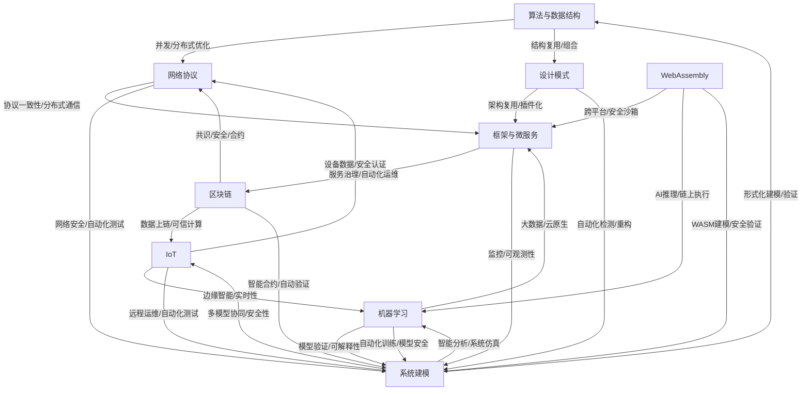

# Rust 形式化工程体系全局知识图谱

```mermaid
graph TD
  A["算法与数据结构"]
  B["设计模式"]
  C["网络协议"]
  D["框架与微服务"]
  E["区块链"]
  F["WebAssembly"]
  G["IoT"]
  H["机器学习"]
  I["系统建模"]

  A -- 并发/分布式优化 --> C
  A -- 结构复用/组合 --> B
  B -- 架构复用/插件化 --> D
  C -- 协议一致性/分布式通信 --> D
  D -- 服务治理/自动化运维 --> E
  E -- 共识/安全/合约 --> C
  E -- 数据上链/可信计算 --> G
  F -- 跨平台/安全沙箱 --> D
  F -- AI推理/链上执行 --> H
  G -- 边缘智能/实时性 --> H
  G -- 设备数据/安全认证 --> C
  H -- 大数据/云原生 --> D
  H -- 模型验证/可解释性 --> I
  I -- 形式化建模/验证 --> A
  I -- 智能分析/系统仿真 --> H
  I -- 多模型协同/安全性 --> G
  F -- WASM建模/安全验证 --> I
  D -- 监控/可观测性 --> I
  C -- 网络安全/自动化测试 --> I
  B -- 自动化检测/重构 --> I
  E -- 智能合约/自动验证 --> I
  G -- 远程运维/自动化测试 --> I
  H -- 自动化训练/模型安全 --> I
```

> 本图谱自动生成，展现 Rust 形式化工程体系各主题间的理论与工程交叉关系，便于全局把控与持续演进。
