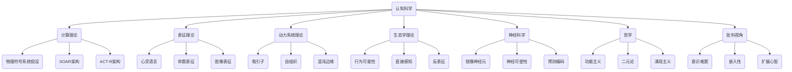

# 认知科学理论：多维视角分析

## 目录

- [认知科学理论：多维视角分析](#认知科学理论多维视角分析)
  - [目录](#目录)
  - [1. 引言：认知科学的界定与范畴](#1-引言认知科学的界定与范畴)
  - [2. 认知科学的理论基础](#2-认知科学的理论基础)
    - [2.1 计算理论](#21-计算理论)
    - [2.2 表征理论](#22-表征理论)
    - [2.3 动力系统理论](#23-动力系统理论)
    - [2.4 生态学理论](#24-生态学理论)
  - [3. 认知架构与形式化模型](#3-认知架构与形式化模型)
    - [3.1 符号主义架构](#31-符号主义架构)
    - [3.2 连接主义架构](#32-连接主义架构)
    - [3.3 混合架构](#33-混合架构)
    - [3.4 预测处理架构](#34-预测处理架构)
  - [4. 认知功能的形式化分析](#4-认知功能的形式化分析)
    - [4.1 注意机制的数学描述](#41-注意机制的数学描述)
    - [4.2 记忆系统的计算模型](#42-记忆系统的计算模型)
    - [4.3 推理与决策的形式化](#43-推理与决策的形式化)
    - [4.4 语言认知的形式化语法](#44-语言认知的形式化语法)
  - [5. 历史视角：认知科学的思想谱系](#5-历史视角认知科学的思想谱系)
    - [5.1 哲学根源](#51-哲学根源)
    - [5.2 心理学流派](#52-心理学流派)
    - [5.3 计算机科学与人工智能贡献者](#53-计算机科学与人工智能贡献者)
    - [5.4 神经科学革命与整合](#54-神经科学革命与整合)
  - [6. 认知科学的元理论分析](#6-认知科学的元理论分析)
    - [6.1 认知科学的本体论前提](#61-认知科学的本体论前提)
    - [6.2 认知模型的认识论地位](#62-认知模型的认识论地位)
    - [6.3 认知理论的解释力评估框架](#63-认知理论的解释力评估框架)
  - [7. 跨学科连接](#7-跨学科连接)
    - [7.1 与计算机科学的接口](#71-与计算机科学的接口)
    - [7.2 与信息科学的交汇](#72-与信息科学的交汇)
    - [7.3 与数学的形式结构对应](#73-与数学的形式结构对应)
  - [8. 批判性反思与前沿议题](#8-批判性反思与前沿议题)
    - [8.1 认知科学方法论的局限性](#81-认知科学方法论的局限性)
    - [8.2 表征危机与实践转向](#82-表征危机与实践转向)
    - [8.3 意识问题的理论困境](#83-意识问题的理论困境)
    - [8.4 认知科学的社会文化维度](#84-认知科学的社会文化维度)
  - [9. 结论：多元整合的认知科学前景](#9-结论多元整合的认知科学前景)
  - [10. 参考文献](#10-参考文献)
  - [认知科学的思维导图](#认知科学的思维导图)
  - [认知科学网络图](#认知科学网络图)
  - [认知科学理论层次分类表](#认知科学理论层次分类表)
  - [认知功能与形式化表征对应关系](#认知功能与形式化表征对应关系)

## 1. 引言：认知科学的界定与范畴

认知科学作为研究心智与智能的跨学科领域，融合了心理学、人工智能、哲学、语言学、神经科学和人类学的方法与视角。本分析聚焦于认知科学的理论结构，探索其内部的形式化表征、证明体系与概念架构，同时揭示认知科学与相关学科的理论连接。

认知科学的核心关注是对认知过程进行科学解释，包括感知、注意、记忆、语言、推理、问题解决、决策和意识等多个方面。这些解释必须满足科学理论的基本要求：

```math
定义1：认知科学理论
一个认知科学理论T是一个形式化结构<A, H, E, M>，其中：
- A是一组公理或基本假设
- H是一组可检验的假设
- E是支持或反驳H的经验证据集
- M是连接理论与经验数据的方法论框架
```

## 2. 认知科学的理论基础

### 2.1 计算理论

计算理论将认知视为信息处理过程，这一视角由图灵(Alan Turing)和冯·诺依曼(John von Neumann)的计算机理论奠基，后经由西蒙(Herbert Simon)和纽厄尔(Allen Newell)发展为认知科学的基础范式。

**计算心智的核心定理(Newell & Simon, 1976)**:

```math
定理1：物理符号系统假设(Physical Symbol System Hypothesis)
任何能够进行一般智能行为的系统必须是一个物理符号系统；
任何物理符号系统都具有产生一般智能行为的必要和充分手段。

证明略述：
1. 智能行为需要复杂的适应性和问题解决能力
2. 问题解决需要能表征目标、状态和操作的能力
3. 符号系统提供了表征和操作的机制
4. 通过归纳，展示符号系统能够模拟所有已知的智能行为
```

马尔(David Marr)的三级理论提供了分析认知的框架：

```math
计算层：系统要解决什么问题
算法层：系统如何解决问题
实现层：系统的物理实现方式
```

### 2.2 表征理论

表征理论关注认知系统如何内部表示外部世界。福多(Jerry Fodor)提出的心灵语言假说(Language of Thought)是这一领域的核心理论之一。

**表征理论的基本定理(Fodor, 1975)**:

```math
定理2：思维的系统性
若认知系统能够思考"a与b具有关系R"，那么该系统也必然能够思考"b与a具有关系R"，
除非该系统在能力上受到具体限制。

形式化表达：
∀S,a,b,R [能思考(S, R(a,b)) → 能思考(S, R(b,a))]
```

表征的分类学：

1. **命题表征**：以语句形式编码的信息
2. **图像表征**：保持感知特征的空间对应关系的表征
3. **程序性表征**：编码动作序列的表征
4. **分布式表征**：信息分布在多个处理单元的连接模式中

### 2.3 动力系统理论

动力系统理论将认知视为时间演化的动态系统，由凡·吉尔德(Timothy van Gelder)和科尔曼(Andy Clark)等人引入认知科学。

**动力系统认知的基本原理**：

```math
认知系统S可形式化为一个动力系统<X, t, Φ>，其中：
- X是状态空间
- t是时间参数
- Φ是演化函数(Φ: X × t → X)

定理3：认知吸引子(Cognitive Attractor)
对于稳定的认知模式P，存在状态空间中的吸引子A，使得系统状态在扰动后倾向于回到A所表示的模式P。
```

### 2.4 生态学理论

吉布森(James J. Gibson)的生态心理学强调直接感知和有机体-环境系统，反对认知过程必须依赖内部表征的观点。

**直接感知理论的核心主张(Gibson, 1979)**:

```math
定理4：关于知觉信息的充分性
环境中存在的环境光阵列(ambient optic array)包含有关环境结构的充分信息，
使有机体能够直接感知环境提供的行为可能性(affordances)，无需内部计算过程。

形式化：
∀A,E,B [affordance(E,B) ∧ perceptualSystem(A,P) → 
       可直接感知(A, affordance(E,B), P)]

其中A是行动者，E是环境，B是行为，P是感知系统
```

## 3. 认知架构与形式化模型

### 3.1 符号主义架构

符号主义架构将认知系统设计为操作符号表征的计算装置。代表性架构包括SOAR(State, Operator, And Result)和ACT-R(Adaptive Control of Thought-Rational)。

**ACT-R架构的核心原理(Anderson, 1993)**:

```math
ACT-R = <DM, PM, BG, G>
其中：
- DM是陈述性记忆模块
- PM是程序性记忆模块
- BG是基底神经节模块(控制程序性知识选择)
- G是目标模块(控制认知行为)

激活值计算公式：
A_i = B_i + Σ_j W_j * S_ji

其中：
- A_i是记忆项i的激活水平
- B_i是基础激活水平
- W_j是注意源j的权重
- S_ji是源j与项i的关联强度
```

### 3.2 连接主义架构

连接主义架构将认知视为分布式神经网络中的激活模式，由鲁梅尔哈特(David Rumelhart)、麦克莱兰(James McClelland)等人开创。

**连接主义的核心数学模型(Parallel Distributed Processing)**:

```math
神经网络N定义为N = <U, W, θ, f>
其中：
- U是单元集合{u₁, u₂, ..., uₙ}
- W是连接权重矩阵[w_ij]
- θ是激活阈值向量
- f是激活函数

学习规则(Hebbian Learning):
Δw_ij = η * a_i * a_j

其中：
- Δw_ij是权重变化
- η是学习率
- a_i和a_j是连接的神经元的激活值
```

### 3.3 混合架构

混合架构结合符号主义和连接主义的优势，例如CLARION(Connectionist Learning with Adaptive Rule Induction ON-line)和LIDA(Learning Intelligent Distribution Agent)。

**CLARION架构的双重表征原则(Sun, 2002)**:

```math
认知定理：双重表征
认知处理同时发生在两个互补的层次：
1. 显式的符号层(top level)：T = <R, RR>
   - R是规则集
   - RR是规则推理机制
2. 隐式的子符号层(bottom level)：B = <N, BP>
   - N是神经网络
   - BP是反向传播算法

信息流：I(T ↔ B)
- 自下而上学习：I(B → T)，从经验中提取规则
- 自上而下学习：I(T → B)，将规则转化为内隐知识
```

### 3.4 预测处理架构

预测处理架构(Predictive Processing)由弗里斯顿(Karl Friston)和克拉克(Andy Clark)发展，将认知视为预测体系。

**自由能原则(Free Energy Principle)**:

```math
定理5：自由能最小化
生物系统通过最小化变分自由能F来减少惊奇度，从而提高其生存概率。

F = D_KL[q(θ|μ) || p(θ|y)] - ln p(y)

其中：
- F是变分自由能
- q(θ|μ)是内部状态的估计分布
- p(θ|y)是给定感觉输入y的后验分布
- D_KL是KL散度
- p(y)是感觉数据的边缘似然
```

## 4. 认知功能的形式化分析

### 4.1 注意机制的数学描述

波斯纳(Michael Posner)和特罗斯曼(Steven Treisman)等研究者开发了注意的数学模型。

**注意过滤器模型(Broadbent, 1958)**:

```math
信息处理管道 P 可表示为：
P = S → F → WM → R

其中：
- S是感觉输入
- F是选择性过滤器
- WM是有限容量的工作记忆
- R是反应系统

过滤函数：
F(S) = {s ∈ S | φ(s) > θ}

φ是显著性函数，θ是注意阈值
```

### 4.2 记忆系统的计算模型

记忆系统的数学模型由艾宾浩斯(Hermann Ebbinghaus)开创，后经安德森(John Anderson)等人发展。

**记忆提取概率模型(ACT-R记忆理论)**:

```math
定理6：记忆提取概率
给定激活值A_i，提取概率P_i计算如下：

P_i = 1 / (1 + e^(-(A_i - τ)/s))

其中：
- τ是提取阈值
- s是噪声参数

遗忘函数：
R = e^(-kt)

其中：
- R是保留强度
- k是遗忘率常数
- t是时间
```

### 4.3 推理与决策的形式化

卡尼曼(Daniel Kahneman)和特维斯基(Amos Tversky)的前景理论以及约翰逊-莱尔德(Philip Johnson-Laird)的心智模型理论提供了推理的形式化描述。

**前景理论决策模型(Kahneman & Tversky, 1979)**:

```math
主观价值函数：
v(x) = {
  x^α          如果 x ≥ 0
  -λ(-x)^β     如果 x < 0
}

其中：
- x是相对于参考点的收益/损失
- α和β是风险敏感度参数
- λ是损失厌恶系数

证明：当λ > 1时，对相同绝对值的收益和损失，损失产生的负效用大于收益产生的正效用
```

### 4.4 语言认知的形式化语法

乔姆斯基(Noam Chomsky)的转换生成语法和平行分布式处理模型提供了语言处理的形式化框架。

**最简方案(Minimalist Program)语法形式化(Chomsky, 1995)**:

```math
语法G定义为四元组G = <V, T, R, S>：
- V是非终结符集合
- T是终结符集合
- R是重写规则集合
- S是起始符号

核心运算：
1. Merge(α, β) = {α, β}       (组合操作)
2. Move(α) = Copy(α) + Merge  (移位操作)

语言L(G)是所有可从S开始，通过有限次应用R中规则导出的终结符串集合。
```

## 5. 历史视角：认知科学的思想谱系

### 5.1 哲学根源

认知科学的哲学根源可追溯至笛卡尔(René Descartes)的心身二元论、康德(Immanuel Kant)的先验范畴和胡塞尔(Edmund Husserl)的现象学。

**康德的认知结构理论**:

```math
认知能力 = <先验直觉形式, 先验知性范畴>

其中:
- 先验直觉形式 = {空间, 时间}
- 先验知性范畴 = {
    量的范畴:{单一性, 多数性, 总体性},
    质的范畴:{实在性, 否定性, 限制性},
    关系范畴:{实体与属性, 因果性, 交互作用},
    模态范畴:{可能性, 现实性, 必然性}
  }
```

### 5.2 心理学流派

维特根斯坦(Ludwig Wittgenstein)对心理学概念的分析、格式塔心理学的整体性原则以及皮亚杰(Jean Piaget)的发生认识论均对认知科学产生重要影响。

**皮亚杰的认知发展阶段模型**:

```math
认知发展 = <感知运动阶段, 前运算阶段, 具体运算阶段, 形式运算阶段>

关键转化函数：
T(S_n) → S_(n+1)

其中:
- S_n是第n阶段的认知结构
- T是通过同化(assimilation)和顺应(accommodation)实现的转化函数
```

### 5.3 计算机科学与人工智能贡献者

图灵(Alan Turing)、冯·诺依曼(John von Neumann)、麦卡锡(John McCarthy)和明斯基(Marvin Minsky)等人的工作为认知科学的计算视角奠定了基础。

**明斯基的心智社会理论(Society of Mind)**:

```math
心智 M 定义为代理集合:
M = {A₁, A₂, ..., Aₙ}

其中每个代理Aᵢ是一个处理单元，具有特定功能和与其他代理的连接网络。

代理间的关系类型 R:
R = {层级关系, 激活-抑制关系, 记忆存取关系, ...}

心智的运作可表示为有向图G = (M, R)
```

### 5.4 神经科学革命与整合

拉马钱德兰(V.S. Ramachandran)的镜像神经元理论、达马西奥(Antonio Damasio)的情绪研究以及埃德尔曼(Gerald Edelman)的神经达尔文主义对认知科学产生深远影响。

**埃德尔曼的神经群选择理论(Neural Darwinism)**:

```math
定理7：神经群选择
大脑发育和功能基于三个过程：
1. 发育选择(DS)：基因控制下的初始连接形成
2. 经验选择(ES)：基于经验强化或削弱特定神经连接
3. 再入连接(RE)：不同脑区间的相互连接

形式化：
大脑功能 B = f(DS, ES, RE)

其中RE满足:
∀x,y∈脑区(连接(x,y) → 连接(y,x))
```

## 6. 认知科学的元理论分析

### 6.1 认知科学的本体论前提

认知科学研究涉及多种本体论立场，包括物理主义(Physicalism)、功能主义(Functionalism)、二元论(Dualism)和涌现论(Emergentism)。

**功能主义的多重实现性原理(Putnam, 1967)**:

```math
定理8：多重实现性
同一认知状态S可由不同的物理状态{P₁, P₂, ..., Pₙ}实现。

形式化：
∃S∀P[认知状态(S) → ∃P'(实现(P',S) ∧ P'≠P)]

证明：
1. 考虑人类大脑实现痛觉的方式P₁
2. 考虑章鱼神经系统实现痛觉的方式P₂
3. 证明P₁≠P₂，但二者实现相同认知功能
```

### 6.2 认知模型的认识论地位

戴维森(Donald Davidson)的不可翻译性理论、丹尼特(Daniel Dennett)的"意向立场"和塞尔(John Searle)的"中文房间"实验提出了关于认知模型解释限度的重要论点。

**意向系统理论(Dennett, 1987)**:

```math
三种预测策略：
1. 物理立场(Physical Stance): PS(E) → P
2. 设计立场(Design Stance): DS(E) → P
3. 意向立场(Intentional Stance): IS(E) → P

其中：
- E是要解释的实体
- P是行为预测

定理9：立场选择原则
当且仅当对实体E，IS策略能以最小认知成本提供准确预测时，
将E视为意向系统是合理的。
```

### 6.3 认知理论的解释力评估框架

马尔(David Marr)的理论层次、门德尔松(Richard Mendelsohn)的解释类型学和科林斯(Allan Collins)的解释谱系为评估认知理论提供了元理论框架。

**认知理论解释力评估标准**:

```math
解释力函数E = f(一致性, 简约性, 预测能力, 经验覆盖范围, 机制揭示度)

一致性C：理论内部无矛盾
C = 1 - (矛盾命题数/总命题数)

简约性S：奥卡姆剃刀原则
S = 1/参数数量

一个理论T的总体评估分数：
Score(T) = w₁C + w₂S + w₃P + w₄EC + w₅M
其中w₁...w₅为权重参数
```

## 7. 跨学科连接

### 7.1 与计算机科学的接口

玛丽亚卡特(Margaret Boden)的创造性计算理论、维诺格拉德(Terry Winograd)的情境认知和柯林斯(Harry Collins)的暗默知识分析展示了认知科学与计算机科学的深度连接。

**计算复杂度与认知复杂度的同构关系**:

```math
定理10：认知复杂度对应
对于任何需要解决的认知问题P，其主观难度D(P)与其计算复杂度C(P)存在映射关系：

D(P) = g(C(P))

其中g是单调递增函数，但非线性。

特例：NP完全问题在人类认知中通常表现为洞察问题(insight problems)
```

### 7.2 与信息科学的交汇

香农(Claude Shannon)的信息熵、贝叶斯推理框架和戴利-伍德(Laurence Daly-Wood)的信息整合理论揭示了认知与信息处理的本质联系。

**贝叶斯认知模型的核心公式**:

```math
定理11：贝叶斯认知更新
认知系统通过贝叶斯更新获取知识：

P(h|e) = [P(e|h) × P(h)] / P(e)

其中：
- P(h|e)是证据e下假设h的后验概率
- P(e|h)是假设h下观察到证据e的似然
- P(h)是假设h的先验概率
- P(e)是证据e的边缘概率

认知偏差可表示为先验分布P(h)的扭曲
```

### 7.3 与数学的形式结构对应

莱考夫(George Lakoff)和努涅斯(Rafael Núñez)的具身数学、彭罗斯(Roger Penrose)的量子意识理论以及豪斯多夫(Felix Hausdorff)的空间维度理论提供了认知结构与数学结构的对应关系。

**具身数学的核心主张(Lakoff & Núñez, 2000)**:

```math
定理12：概念隐喻结构
数学概念通过四类基本隐喻从感知-运动经验中构建：

1. 基础隐喻：F_M = {分组, 配对, 测量, 运动}
2. 推理保持隐喻：I_M = {源域推理 → 目标域推理}
3.符号基础隐喻：S_M = {符号操作 → 概念操作}
4.融合隐喻：B_M = {源域₁ + 源域₂ → 新概念域}

证明：复数概念的构建过程
1. 实数线(一维空间)为源域₁
2. 旋转运动为源域₂
3. 融合隐喻B_M将二者映射至复平面
```

## 8. 批判性反思与前沿议题

### 8.1 认知科学方法论的局限性

认知科学面临观察者效应、主观报告可靠性问题、实验室与生态效度平衡等方法论挑战。

**实验室研究与生态效度的权衡关系**:

```math
方法论张力方程：
E × C = k

其中：
- E是生态效度(ecological validity)
- C是实验控制度(experimental control)
- k是常数

这表明增加实验控制往往以降低生态效度为代价
```

### 8.2 表征危机与实践转向

"反表征主义"思潮由吉布森(James J. Gibson)、德瑞福斯(Hubert Dreyfus)和海德格尔(Martin Heidegger)的思想推动，质疑传统认知科学对内部表征的依赖。

**实践知识的形式化困难**:

```math
定理13：波兰尼悖论(Polanyi's Paradox)
形式表征知识K_F与实践知识K_P之间存在不可弥合的鸿沟：

∀x[x∈K_P → ∃y(y∈K_F ∧ x≠y)]

证明：
1. 假设全部实践知识可被形式化
2. 考虑骑自行车平衡的实践知识K_b
3. 分析K_b所需的物理方程复杂度
4. 证明实际骑行者不可能实时计算这些方程
5. 得出矛盾，原假设不成立
```

### 8.3 意识问题的理论困境

查默斯(David Chalmers)的"困难问题"、纳格尔(Thomas Nagel)的"成为蝙蝠是什么样的"问题和麦金(Colin McGinn)的"认知封闭性"论点构成了意识研究的理论困境。

**解释鸿沟论证(Chalmers, 1995)**:

```math
定理14：意识的解释鸿沟
对于任何物理-功能解释F和任何现象意识体验Q：

(F → Q)不是先验真理，也不是形而上学必然性

证明框架：
1. 可构想僵尸世界Z，物理-功能上与我们世界相同但无现象意识
2. 僵尸世界的可构想性表明F与Q之间缺乏必然联系
3. 因此无法仅通过F完全解释Q
```

### 8.4 认知科学的社会文化维度

维果茨基(Lev Vygotsky)的社会文化理论、哈钦斯(Edwin Hutchins)的分布式认知和高夫曼(Erving Goffman)的框架分析揭示了认知的社会文化嵌入性。

**分布式认知系统的形式化(Hutchins, 1995)**:

```math
定理15：认知从个体扩展到系统
认知系统C可表示为：
C = <A, T, E, I>

其中：
- A是行动者集合
- T是工具集合
- E是环境结构
- I是信息流动网络

集体智能涌现条件：
∃f[ f(C) > Σᵢ f(aᵢ) ]
其中f是解决特定问题的能力度量
```

## 9. 结论：多元整合的认知科学前景

认知科学的未来发展需要整合多个理论视角，包括符号主义、连接主义、动力系统理论、生态学理论和具身认知理论，同时融合不同学科的研究方法和解释模式。

**多元整合框架**:

```math
整合认知科学I = <T, M, L, D, S>

其中：
- T是互补理论框架集合
- M是多方法论工具箱
- L是不同解释层次的集合
- D是研究领域集合
- S是跨学科概念结构

系统整合原则：
∀t₁,t₂∈T [ 互补(t₁,t₂) ∧ ¬冲突(t₁,t₂) ]
```

## 10. 参考文献

1. Anderson, J. R. (1993). Rules of the Mind. Hillsdale, NJ: Erlbaum.
2. Chalmers, D. J. (1995). Facing up to the problem of consciousness. Journal of Consciousness Studies, 2(3), 200-219.
3. Chomsky, N. (1995). The Minimalist Program. Cambridge, MA: MIT Press.
4. Clark, A. (2013). Whatever next? Predictive brains, situated agents, and the future of cognitive science. Behavioral and Brain Sciences, 36(3), 181-204.
5. Dennett, D. C. (1987). The Intentional Stance. Cambridge, MA: MIT Press.
6. Fodor, J. A. (1975). The Language of Thought. Harvard University Press.
7. Friston, K. (2010). The free-energy principle: a unified brain theory? Nature Reviews Neuroscience, 11(2), 127-138.
8. Gibson, J. J. (1979). The Ecological Approach to Visual Perception. Boston: Houghton Mifflin.
9. Hutchins, E. (1995). Cognition in the Wild. MIT Press.
10. Kahneman, D., & Tversky, A. (1979). Prospect theory: An analysis of decision under risk. Econometrica, 47(2), 263-291.
11. Lakoff, G., & Núñez, R. E. (2000). Where Mathematics Comes From. Basic Books.
12. Marr, D. (1982). Vision: A Computational Investigation into the Human Representation and Processing of Visual Information. Freeman.
13. Newell, A., & Simon, H. A. (1976). Computer science as empirical inquiry: Symbols and search. Communications of the ACM, 19(3), 113-126.
14. Polanyi, M. (1966). The Tacit Dimension. University of Chicago Press.
15. Sun, R. (2002). Duality of the Mind. Lawrence Erlbaum Associates.

---

## 认知科学的思维导图

```mermaid
mindmap
  root((认知科学理论))
    1[理论基础]
      1.1[计算理论]
        1.1.1(物理符号系统假设)
        1.1.2(马尔三级理论)
      1.2[表征理论]
        1.2.1(心灵语言假说)
        1.2.2(表征分类学)
      1.3[动力系统理论]
        1.3.1(时态演化)
        1.3.2(认知吸引子)
      1.4[生态学理论]
        1.4.1(直接感知)
        1.4.2(行为可能性)
    2[认知架构]
      2.1[符号主义架构]
        2.1.1(SOAR)
        2.1.2(ACT-R)
      2.2[连接主义架构]
        2.2.1(PDP模型)
        2.2.2(Hebbian学习)
      2.3[混合架构]
        2.3.1(CLARION)
        2.3.2(双层处理)
      2.4[预测处理架构]
        2.4.1(自由能原则)
        2.4.2(预测编码)
    3[认知功能]
      3.1[注意]
        3.1.1(过滤器模型)
        3.1.2(聚光灯理论)
      3.2[记忆]
        3.2.1(多存储模型)
        3.2.2(激活模型)
      3.3[推理与决策]
        3.3.1(前景理论)
        3.3.2(心智模型理论)
      3.4[语言]
        3.4.1(生成语法)
        3.4.2(联结模型)
    4[历史视角]
      4.1[哲学根源]
      4.2[心理学流派]
      4.3[计算机科学贡献]
      4.4[神经科学革命]
    5[元理论分析]
      5.1[本体论前提]
      5.2[认识论地位]
      5.3[解释力评估]
    6[跨学科连接]
      6.1[计算机科学]
      6.2[信

```mermaid
mindmap
  6.2[信息科学]
    6.2.1(信息熵)
    6.2.2(贝叶斯框架)
    6.2.3(信息整合理论)
  6.3[数学结构]
    6.3.1(具身数学)
    6.3.2(拓扑学对应)
    6.3.3(量子认知)
  7[批判性反思]
    7.1[方法论局限]
      7.1.1(观察者效应)
      7.1.2(生态效度问题)
    7.2[表征危机]
      7.2.1(反表征主义)
      7.2.2(实践转向)
    7.3[意识问题]
      7.3.1(困难问题)
      7.3.2(解释鸿沟)
    7.4[社会文化维度]
      7.4.1(分布式认知)
      7.4.2(认知生态学)
  8[整合前景]
    8.1[多元理论整合]
    8.2[层次解释互补]
    8.3[跨学科边界融合]
```

## 认知科学网络图



## 认知科学理论层次分类表

| 层次 | 理论流派 | 代表人物 | 核心假设 | 关键概念 | 解释范式 |
|------|---------|---------|---------|---------|---------|
| **元理论** | 功能主义 | 普特南(Putnam) | 心智是由其功能定义 | 多重实现性 | 因果角色 |
| | 消除主义 | 丘奇兰德(Churchland) | 民间心理学应被神经科学取代 | 理论更替 | 还原解释 |
| | 非还原物理主义 | 福多(Fodor) | 心智具有本体独立性 | 特殊科学自主性 | 层次解释 |
| **基础理论** | 计算主义 | 纽厄尔(Newell) | 认知是信息处理 | 物理符号系统 | 计算解释 |
| | 连接主义 | 麦克莱兰(McClelland) | 认知是并行分布处理 | 激活传播 | 涌现解释 |
| | 动力系统理论 | 凡·吉尔德(Van Gelder) | 认知是时间依赖的动力学系统 | 相空间 | 动态解释 |
| | 生态心理学 | 吉布森(Gibson) | 感知直接提取信息 | 行为可能性 | 生态学解释 |
| **特定领域理论** | 双过程理论 | 卡尼曼(Kahneman) | 思维有快速与缓慢系统 | 系统1与系统2 | 双系统解释 |
| | 心智模型理论 | 约翰逊-莱尔德(Johnson-Laird) | 推理基于内部模型操作 | 心智模型 | 模拟解释 |
| | 框架理论 | 明斯基(Minsky) | 知识以结构化框架存储 | 知识框架 | 结构解释 |
| | 概念隐喻理论 | 莱考夫(Lakoff) | 抽象思维基于具身隐喻 | 概念隐喻 | 映射解释 |
| **实现理论** | 预测处理理论 | 弗里斯顿(Friston) | 大脑最小化预测误差 | 自由能 | 预测解释 |
| | 神经群选择理论 | 埃德尔曼(Edelman) | 神经系统通过选择优化 | 神经达尔文主义 | 选择解释 |
| | 全局工作空间理论 | 巴斯(Baars) | 意识内容在全局工作空间中共享 | 工作空间 | 广播解释 |
| | 量子认知理论 | 彭罗斯(Penrose) | 意识基于量子过程 | 量子相干性 | 量子解释 |

## 认知功能与形式化表征对应关系

```text
                           +-------------------------+
                           |                         |
                           |    认知功能形式化表征     |
                           |                         |
                           +-------------------------+
                                      |
                                      |
            +------------------------+-----------------------+
            |                        |                       |
  +--------------------+    +-------------------+   +-------------------+
  |                    |    |                   |   |                   |
  |    符号逻辑表征     |    |    概率图表征      |   |    神经网络表征    |
  |                    |    |                   |   |                   |
  +--------------------+    +-------------------+   +-------------------+
            |                        |                       |
      +-----+-----+           +------+-----+         +------+------+
      |           |           |            |         |             |
+------------+ +----------+ +----------+ +--------+ +----------+ +---------+
|            | |          | |          | |        | |          | |         |
| 一阶逻辑公式 | | 产生式规则| | 贝叶斯网络| |马尔可夫| | 前馈网络 | | 递归网络|
|            | |          | |          | | 随机场 | |          | |         |
+------------+ +----------+ +----------+ +--------+ +----------+ +---------+
      |           |           |            |         |             |
      v           v           v            v         v             v
+------------+ +----------+ +----------+ +--------+ +----------+ +---------+
|            | |          | |          | |        | |          | |         |
|   演绎推理  | |  问题解决| | 不确定推理| |模式识别| |  感知分类 | | 序列学习|
|            | |          | |          | |        | |          | |         |
+------------+ +----------+ +----------+ +--------+ +----------+ +---------+
```
