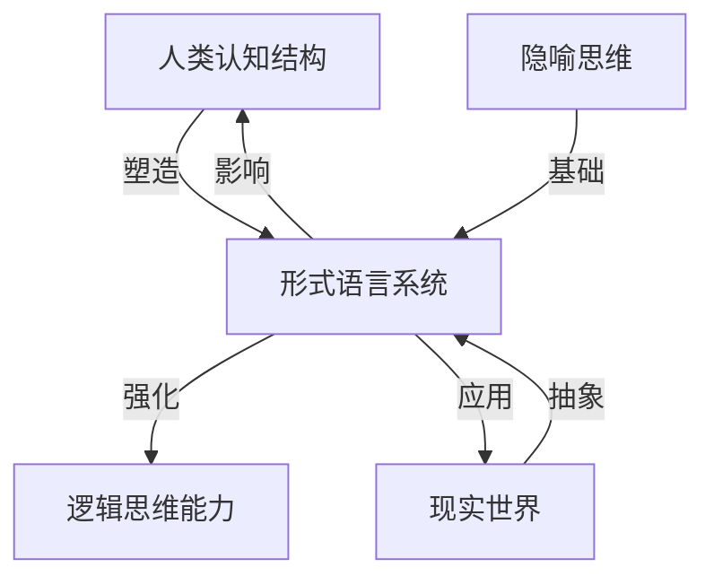

# 形式语言的批判性分析与综合

## 目录

- [形式语言的批判性分析与综合](#形式语言的批判性分析与综合)
  - [目录](#目录)
  - [形式语言的基础理论框架](#形式语言的基础理论框架)
  - [形式语言内部的自洽性分析](#形式语言内部的自洽性分析)
  - [形式语言的认知基础](#形式语言的认知基础)
  - [形式语言的哲学维度](#形式语言的哲学维度)
  - [形式语言的自我解释性](#形式语言的自我解释性)
  - [形式语言与人类认知的关联](#形式语言与人类认知的关联)
  - [形式语言在AI中的意义](#形式语言在ai中的意义)
  - [结论：形式语言的价值与局限](#结论形式语言的价值与局限)

## 形式语言的基础理论框架

形式语言本质上是一种符号系统，由语法规则和语义解释构成。其理论基础主要来自数理逻辑、集合论和递归论。

形式语言的合法性建立在以下几个层面：

1. **语法层面**：通过精确定义的生成规则确保语言的结构性
2. **语义层面**：通过模型论建立符号与意义之间的映射关系
3. **元理论层面**：通过元数学证明系统本身的一致性和完备性

形式语言的核心特征是其精确性和无歧义性，这使其成为数学和计算机科学的基础。然而，这种精确性也是其局限所在，因为它必须剥离自然语言的丰富性和模糊性。

## 形式语言内部的自洽性分析

形式语言的自洽性主要体现在其公理系统的一致性上。根据哥德尔不完备定理，任何包含基本算术的一致形式系统都存在无法在该系统内证明的真命题。

形式语言内部的多层次表征体现为：

| 层次 | 表征方式 | 认知特点 |
|------|---------|---------|
| 语法层 | 符号串与规则 | 结构识别 |
| 语义层 | 模型与解释 | 意义赋予 |
| 推理层 | 证明与演绎 | 逻辑推导 |
| 元理论层 | 关于系统的陈述 | 自我反思 |

形式语言的自洽性依赖于其内部逻辑结构的严密性，但同时也面临着不可避免的不完备性。这种不完备性揭示了形式系统的内在局限，也暗示了数学思维超越形式化的必要性。

## 形式语言的认知基础

形式语言与人类认知之间存在深刻联系。从认知科学角度看，形式语言可视为人类抽象思维能力的产物。

```math
认知结构 → 抽象能力 → 形式符号系统 → 形式语言
```

形式语言中的隐喻作用不容忽视。即使在最抽象的数学中，我们仍依赖空间、容器等基本隐喻来理解集合、函数等概念。这些隐喻构成了形式思维的认知基础。

形式语言的有效性部分源于其与人类认知结构的共振，但这也意味着它受限于人类认知的局限。

## 形式语言的哲学维度

从哲学角度看，形式语言涉及本体论和认识论的基本问题：

1. **本体论问题**：数学对象的存在性质（柏拉图主义、形式主义、直觉主义）
2. **认识论问题**：数学知识的确定性和获取方式

形式语言的哲学基础存在多元观点：

- **逻辑实证主义**：形式语言作为科学语言的理想形式
- **结构主义**：形式语言反映了抽象结构关系
- **自然主义**：形式语言作为人类认知活动的产物

这些哲学视角影响了我们对形式语言合法性的理解和判断。

## 形式语言的自我解释性

形式语言能否自我解释是一个核心问题。根据塔尔斯基的真理理论，语言无法完全描述自身的语义。这导致了形式系统需要元语言来讨论其自身属性的情况。

形式语言的自我解释性面临以下悖论：

1. **自指悖论**：系统无法完全形式化描述自身
2. **元语言需求**：讨论形式系统需要更高层次的语言
3. **无限回归问题**：每个元语言又需要更高层次的元语言

这些问题表明形式语言的自我解释能力有其内在限制，需要人类直觉和非形式化理解作为补充。

## 形式语言与人类认知的关联

形式语言与人类认知之间存在双向关系：



形式语言的发展反映了人类认知能力的扩展，同时也重塑了人类的思维方式。计算机科学的发展尤其体现了形式语言如何转变为改变现实的工具。

## 形式语言在AI中的意义

形式语言为AI提供了理论基础和实现途径：

1. **计算理论**：图灵机、λ演算等形式系统奠定了计算可能性的边界
2. **知识表示**：形式逻辑为知识表示提供了框架
3. **学习理论**：形式化学习理论指导机器学习算法设计

AI系统中形式语言的应用揭示了形式系统的力量与局限：

- **力量**：精确推理、一致性保证
- **局限**：难以处理模糊性、常识推理和语境依赖

大型语言模型的出现挑战了传统形式语言观，表明统计学习可能提供另一种处理语言和知识的途径。

## 结论：形式语言的价值与局限

形式语言作为人类智力的重要产物，具有不可替代的价值：

1. 提供了严格的推理框架
2. 实现了数学和计算机科学的精确表达
3. 推动了人类抽象思维能力的发展

然而，形式语言也存在内在局限：

1. 哥德尔不完备性限制了其表达能力
2. 无法完全摆脱人类认知的隐喻基础
3. 在处理模糊、开放和语境相关问题时力不从心

形式语言的真正价值不在于其完美性，而在于它揭示了人类思维的可能性和局限性。通过认识形式语言的边界，我们才能更好地理解思维本身的性质。
