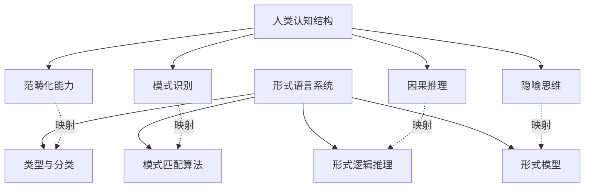
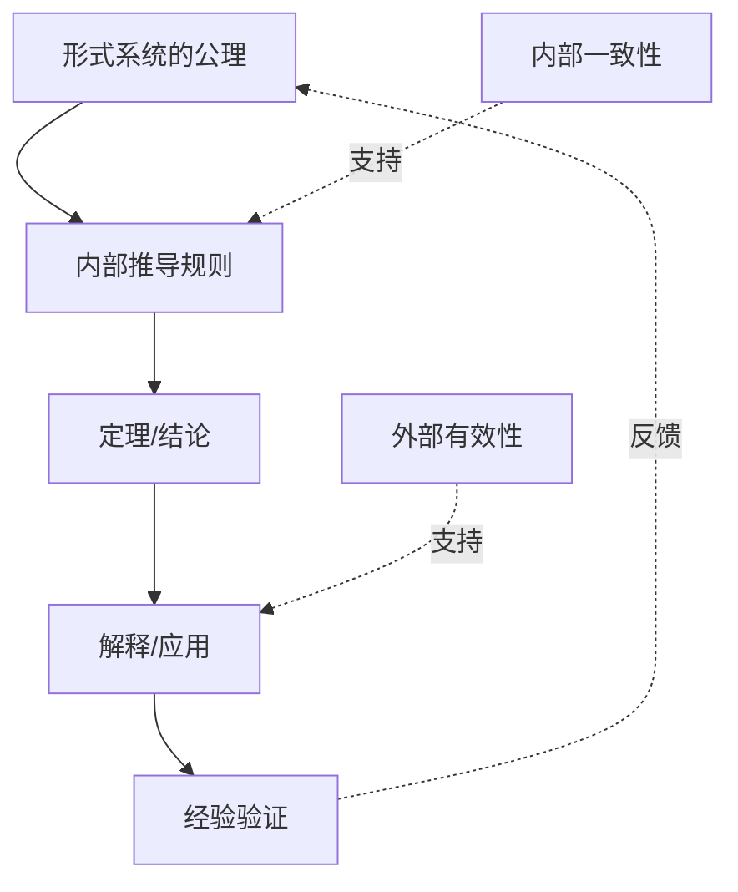

# 形式语言的批判分析与综合

## 目录

- [形式语言的批判分析与综合](#形式语言的批判分析与综合)
  - [目录](#目录)
  - [1. 形式语言的基础理论框架](#1-形式语言的基础理论框架)
    - [1.1 历史发展与关键人物](#11-历史发展与关键人物)
    - [1.2 形式语言的层次结构](#12-形式语言的层次结构)
  - [2. 形式语言的认知维度](#2-形式语言的认知维度)
    - [2.1 表征与隐喻](#21-表征与隐喻)
    - [2.2 认知结构与形式系统](#22-认知结构与形式系统)
  - [3. 形式语言的自洽性分析](#3-形式语言的自洽性分析)
    - [3.1 自指与悖论](#31-自指与悖论)
    - [3.2 不完备性与局限](#32-不完备性与局限)
  - [4. 形式语言的哲学基础](#4-形式语言的哲学基础)
    - [4.1 本体论视角](#41-本体论视角)
    - [4.2 认识论维度](#42-认识论维度)
  - [5. 形式语言的有效性与合法性](#5-形式语言的有效性与合法性)
    - [5.1 内部证明与外部验证](#51-内部证明与外部验证)
    - [5.2 预测能力与解释力](#52-预测能力与解释力)

## 1. 形式语言的基础理论框架

### 1.1 历史发展与关键人物

形式语言理论的发展可追溯至19世纪末20世纪初的数学基础危机。弗雷格、罗素、希尔伯特、哥德尔、图灵和乔姆斯基等人的工作奠定了现代形式语言理论的基础。

| 人物 | 时期 | 主要贡献 | 核心思想 |
|------|------|----------|----------|
| 弗雷格 | 1848-1925 | 概念文字、形式化逻辑 | 通过符号化实现严格的逻辑推理 |
| 罗素 | 1872-1970 | 类型论、《数学原理》 | 解决集合论悖论，建立数学逻辑基础 |
| 希尔伯特 | 1862-1943 | 形式主义、希尔伯特纲领 | 将数学完全形式化，证明其一致性 |
| 哥德尔 | 1906-1978 | 不完备定理 | 揭示形式系统的内在局限性 |
| 图灵 | 1912-1954 | 图灵机、可计算性理论 | 形式化计算过程，定义算法 |
| 乔姆斯基 | 1928- | 形式语言谱系、生成语法 | 语言的层次结构与形式化描述 |

### 1.2 形式语言的层次结构

乔姆斯基谱系将形式语言按照表达能力分为四个层次：

```math
3型：正则语言 → 2型：上下文无关语言 → 1型：上下文相关语言 → 0型：递归可枚举语言
```

每个层次对应不同的自动机模型和表达能力：

| 语言类型 | 文法规则 | 识别器 | 应用领域 |
|----------|----------|--------|----------|
| 3型：正则语言 | 右线性/左线性文法 | 有限状态自动机 | 词法分析、模式匹配 |
| 2型：上下文无关语言 | A → α (A为非终结符) | 下推自动机 | 编程语言语法、句法分析 |
| 1型：上下文相关语言 | αAβ → αγβ | 线性有界自动机 | 自然语言处理、复杂句法 |
| 0型：递归可枚举语言 | 无限制文法 | 图灵机 | 通用计算、不可判定问题 |

## 2. 形式语言的认知维度

### 2.1 表征与隐喻

形式语言作为认知工具，通过符号系统表征现实和抽象概念。这种表征依赖于多层次的隐喻映射：

- **一阶表征**：符号直接对应物理或概念实体
- **二阶表征**：符号之间的关系表征实体间的关系
- **高阶表征**：形式系统整体作为认知模型的隐喻

形式语言的隐喻本质体现在：

1. **容器隐喻**：集合论中的"包含"关系
2. **空间隐喻**：拓扑学中的"连续性"和"邻近性"
3. **路径隐喻**：逻辑推理中的"从前提到结论"

### 2.2 认知结构与形式系统

人类认知与形式系统的对应关系：



## 3. 形式语言的自洽性分析

### 3.1 自指与悖论

形式系统面临的核心挑战是自指问题，即系统内部描述系统自身的能力。这导致了多个著名悖论：

1. **罗素悖论**：不包含自身的集合的集合是否包含自身？
2. **理发师悖论**：为所有不自己刮胡子的人刮胡子的理发师是否给自己刮胡子？
3. **哥德尔句**：构造"这个命题在系统中不可证明"的命题

这些悖论揭示了形式语言的内在张力：足够强大的形式系统必然面临自指带来的不一致性风险。

### 3.2 不完备性与局限

哥德尔不完备定理揭示了形式系统的根本局限：

> **第一不完备定理**：任何包含基本算术的一致的形式系统中，存在真但不可证明的命题。
>
> **第二不完备定理**：足够强的一致形式系统不能证明自身的一致性。

这些定理的隐喻含义：

- 形式化与完备性之间存在根本张力
- 真理超越了形式证明的范围
- 自我理解存在内在限制

## 4. 形式语言的哲学基础

### 4.1 本体论视角

形式语言对数学对象本质的不同哲学立场：

| 哲学立场 | 核心观点 | 代表人物 | 对形式语言的影响 |
|----------|----------|----------|------------------|
| 柏拉图主义 | 数学对象独立存在 | 哥德尔、弗雷格 | 强调形式语言发现真理 |
| 形式主义 | 数学是无意义符号的游戏 | 希尔伯特 | 强调形式语言的规则和操作 |
| 直觉主义 | 数学是心智构造 | 布劳威尔 | 拒绝排中律，限制证明方法 |
| 结构主义 | 数学研究结构关系 | 布尔巴基 | 强调形式系统间的同构关系 |

### 4.2 认识论维度

形式语言作为认识工具的特性：


## 5. 形式语言的有效性与合法性

### 5.1 内部证明与外部验证

形式语言的合法性来源于两个维度：

1. **内部一致性**：系统不产生矛盾
2. **外部有效性**：系统能够有效表征和预测现实

这种双重验证构成了形式语言的完整论证路径：



### 5.2 预测能力与解释力

形式语言的终极价值在于：

1. **预测能力**：通过形式推导预见未知现象
2. **解释能力**：提供现象背后的结构性理解
3. **统一能力**：将表面不同的现象归于共同原理

这些能力构成了形式语言自我辩护的核心：形式语言的有效性不仅体现在其内部结构，更体现在其与认知和现实的互动中。形式语言既是思维的工具，也是思维的对象，在这种双重身份中实现了自我解释和自我证成。
