# 形式语言的综合批判分析

## 目录

- [形式语言的综合批判分析](#形式语言的综合批判分析)
  - [目录](#目录)
  - [引言](#引言)
  - [形式语言的基础理论框架](#形式语言的基础理论框架)
    - [形式语言的定义与分类](#形式语言的定义与分类)
    - [形式语言的语法与语义](#形式语言的语法与语义)
    - [形式语言的层次结构：乔姆斯基谱系](#形式语言的层次结构乔姆斯基谱系)
  - [形式语言的认知基础](#形式语言的认知基础)
    - [符号系统与人脑认知](#符号系统与人脑认知)
    - [形式语言作为思维工具](#形式语言作为思维工具)
    - [抽象与具象的认知转换](#抽象与具象的认知转换)
  - [形式语言的哲学维度](#形式语言的哲学维度)
    - [逻辑实证主义与形式语言](#逻辑实证主义与形式语言)
    - [本体论问题：符号与实在](#本体论问题符号与实在)
    - [认识论视角：形式语言的知识边界](#认识论视角形式语言的知识边界)
  - [形式语言的核心定理与隐喻](#形式语言的核心定理与隐喻)
    - [哥德尔不完备定理的哲学隐喻](#哥德尔不完备定理的哲学隐喻)
    - [图灵停机问题与计算边界](#图灵停机问题与计算边界)
    - [不确定性原理在形式系统中的体现](#不确定性原理在形式系统中的体现)
  - [形式语言的多层次表征](#形式语言的多层次表征)
    - [句法层面：符号与规则](#句法层面符号与规则)
    - [语义层面：指称与真值](#语义层面指称与真值)
    - [语用层面：形式语言的应用情境](#语用层面形式语言的应用情境)
  - [形式语言的历史发展脉络](#形式语言的历史发展脉络)
    - [从亚里士多德到弗雷格：逻辑学的演进](#从亚里士多德到弗雷格逻辑学的演进)
    - [希尔伯特纲领与数学基础危机](#希尔伯特纲领与数学基础危机)
    - [维特根斯坦与语言哲学转向](#维特根斯坦与语言哲学转向)
  - [形式语言的合法性与局限性](#形式语言的合法性与局限性)
    - [形式系统的自我指涉问题](#形式系统的自我指涉问题)
    - [形式语言与自然语言的鸿沟](#形式语言与自然语言的鸿沟)
    - [超越形式主义：直觉与创造性思维](#超越形式主义直觉与创造性思维)
  - [形式语言的当代应用与发展](#形式语言的当代应用与发展)
    - [计算理论与人工智能](#计算理论与人工智能)
    - [形式语言在科学哲学中的地位](#形式语言在科学哲学中的地位)
    - [跨学科视角：认知科学与语言学的交汇](#跨学科视角认知科学与语言学的交汇)
  - [结论：形式语言的综合评价](#结论形式语言的综合评价)

## 引言

形式语言作为人类智识活动的产物，既是数学、逻辑学和计算机科学等领域的基础工具，也是认识世界的一种独特方式。本文旨在对形式语言进行全面的批判性分析，不仅考察其内部理论结构的完备性和一致性，还将其置于更广阔的认知科学、哲学和历史语境中进行审视。通过这种多维度的考察，我们希望能够揭示形式语言的本质特征、认知基础、哲学内涵以及其在人类知识体系中的地位和局限。

## 形式语言的基础理论框架

### 形式语言的定义与分类

形式语言，从本质上讲，是一个由有限符号集合上的字符串构成的集合，这些字符串是按照特定的形式规则（语法）生成的。与自然语言不同，形式语言具有明确的语法规则和精确的语义解释，这使得它成为数学和计算机科学中表达精确概念的理想工具。

形式语言可以根据其生成规则的复杂性进行分类，最经典的分类体系是乔姆斯基谱系（Chomsky hierarchy），它将形式语言分为四类：

1. **0型语言**（无限制文法）：最一般的形式语言，可以由图灵机识别
2. **1型语言**（上下文相关文法）：可以由线性有界自动机识别
3. **2型语言**（上下文无关文法）：可以由下推自动机识别
4. **3型语言**（正则文法）：可以由有限状态自动机识别

这种分类不仅反映了语言的表达能力，也揭示了计算复杂性的层次结构，为我们理解计算能力的本质提供了理论框架。

### 形式语言的语法与语义

形式语言的语法定义了符号串的合法构造方式，而语义则赋予这些符号串以意义。在形式语言理论中，语法通常通过以下方式定义：

- **文法**（Grammar）：一组生成规则，定义如何从起始符号推导出语言中的所有字符串
- **自动机**（Automaton）：一种抽象计算模型，用于识别语言中的字符串

而语义则通常通过以下方式建立：

- **模型论**（Model Theory）：研究形式语言表达式与其指称对象之间的关系
- **证明论**（Proof Theory）：研究形式系统中的推理规则和证明结构

语法与语义的二元关系构成了形式语言的基本框架，也反映了符号与意义之间的深层次联系。

### 形式语言的层次结构：乔姆斯基谱系

乔姆斯基谱系不仅是形式语言的分类体系，更揭示了形式语言的生成能力与计算复杂性之间的内在联系。下表展示了不同类型语言的特征及其对应的自动机模型：

| 语言类型 | 文法特征 | 识别装置 | 计算能力 |
|---------|---------|---------|---------|
| 0型语言 | 无限制文法 | 图灵机 | 图灵完备 |
| 1型语言 | 上下文相关文法 | 线性有界自动机 | 非确定性线性空间 |
| 2型语言 | 上下文无关文法 | 下推自动机 | 非确定性栈空间 |
| 3型语言 | 正则文法 | 有限状态自动机 | 有限状态 |

这种层次结构不仅具有数学上的严格性，也反映了认知复杂性的递进关系，为我们理解语言能力的本质提供了理论基础。

## 形式语言的认知基础

### 符号系统与人脑认知

形式语言作为一种符号系统，其运作方式与人脑的认知加工过程密切相关。认知科学研究表明，人类思维在很大程度上依赖于符号表征和操作。形式语言可以被视为这种符号思维的高度抽象和规范化。

从神经科学的角度看，形式语言的处理涉及大脑多个区域的协同工作：

- 前额叶皮层负责抽象思维和规则应用
- 顶叶区域处理空间关系和符号排列
- 颞叶参与符号意义的解码
- 布罗卡区和韦尼克区参与语言处理

这种多区域协作的神经网络为形式语言的认知基础提供了生物学支持。

### 形式语言作为思维工具

形式语言不仅是表达思想的媒介，更是塑造思维的工具。从认知工具的角度看，形式语言具有以下特性：

1. **抽象化**：将复杂概念简化为符号操作
2. **精确性**：消除自然语言的歧义性
3. **系统性**：提供一致的推理框架
4. **生产性**：通过有限规则生成无限表达

这些特性使形式语言成为人类认知的强大扩展，但同时也限制了思维的某些维度，如模糊性、隐喻性和语境敏感性。

### 抽象与具象的认知转换

形式语言的使用涉及抽象与具象之间的不断转换。这一过程可以通过以下认知模型来理解：

```math
具体问题 → 抽象形式化 → 形式系统内运算 → 结果解释回具体情境
```

这种转换过程依赖于人类的抽象思维能力，同时也反映了形式语言的本质功能：将复杂的现实问题转化为可操作的符号计算。然而，这种转换并非总是无损的，抽象过程中的信息损失可能导致模型与现实之间的偏差。

## 形式语言的哲学维度

### 逻辑实证主义与形式语言

20世纪初，逻辑实证主义者将形式语言视为科学知识的理想表达方式。维也纳学派的哲学家们，如卡尔纳普（Rudolf Carnap）和石里克（Moritz Schlick），试图通过形式化逻辑来重构科学语言，消除形而上学的"伪问题"。

这一哲学立场强调：

- 有意义的陈述必须是可验证的
- 科学语言应当是精确的形式语言
- 形式语言可以消除自然语言的歧义性

然而，这种极端形式主义的立场最终面临了严峻挑战，尤其是来自哥德尔不完备定理和后期维特根斯坦的批判。

### 本体论问题：符号与实在

形式语言引发的核心本体论问题是：符号系统与其所指称的实在之间存在什么样的关系？这一问题可以从以下几个哲学立场来审视：

- **实在论**：形式语言反映了独立于心智的数学实在
- **唯名论**：形式语言仅是人类创造的符号游戏，没有独立的本体地位
- **构造主义**：形式语言的对象只有在被构造出来时才存在
- **结构主义**：形式语言捕捉的是抽象结构关系，而非具体实体

这些不同立场反映了数学哲学中关于形式语言本体地位的持久争论。

### 认识论视角：形式语言的知识边界

从认识论角度看，形式语言既是获取知识的工具，也设定了知识的边界。形式语言的认识论特征包括：

1. **确定性**：在给定公理系统内，结论具有确定性
2. **内部一致性**：避免矛盾是形式系统的基本要求
3. **可证明性**：知识必须通过形式推导获得
4. **不完备性**：任何足够复杂的形式系统都存在不可证明的真命题

哥德尔不完备定理揭示了形式语言作为认识工具的根本局限，表明纯粹形式化的知识追求存在内在边界。

## 形式语言的核心定理与隐喻

### 哥德尔不完备定理的哲学隐喻

哥德尔不完备定理是20世纪数学基础研究中最具震撼力的成果之一，它表明：任何包含基本算术的一致的形式系统，都存在既不能证明也不能反驳的命题。这一定理具有深远的哲学隐喻：

1. **思维超越形式化**：人类思维能力可能超越任何特定形式系统
2. **真理超越证明**：数学真理不等同于形式证明
3. **自我指涉的悖论性**：系统无法完全描述自身
4. **开放性与不确定性**：知识体系本质上是开放和不完备的

哥德尔的成果不仅挑战了希尔伯特的形式主义纲领，也为我们理解认知和知识的本质提供了深刻洞见。

### 图灵停机问题与计算边界

图灵停机问题证明了存在无法通过算法解决的问题，即：不存在通用算法能够判断任意程序是否会在有限时间内终止。这一结果揭示了计算的根本边界，其隐喻意义包括：

- 某些问题本质上不可计算
- 形式化方法存在内在限制
- 算法思维面临不可逾越的障碍

图灵的工作与哥德尔的不完备定理在本质上是一致的，都指向了形式系统的内在局限性。

### 不确定性原理在形式系统中的体现

量子力学中的不确定性原理在形式系统中也有其对应物。形式语言中的不确定性体现在：

1. **表达力与决定性的权衡**：表达能力越强的形式系统，其决定性问题越难解决
2. **完备性与一致性的张力**：根据哥德尔定理，无法同时实现完备性和一致性
3. **精确性与普遍性的对立**：越精确的形式语言，适用范围越窄

这些对立关系揭示了形式语言的内在张力，也反映了知识表征的根本困境。

## 形式语言的多层次表征

### 句法层面：符号与规则

形式语言的句法层面关注符号的组合规则，不涉及意义。这一层面的核心特征包括：

- **形式化**：严格定义的符号集和操作规则
- **递归性**：通过有限规则生成无限结构
- **组合性**：复杂表达式由简单表达式组合而成

句法层面的形式化使得推理过程可以机械化，为自动推理和计算机科学奠定了基础。

### 语义层面：指称与真值

语义层面关注形式语言的解释和意义，核心问题是符号与其所指对象之间的关系。形式语义学的主要方法包括：

- **真值语义学**：通过真值条件定义表达式的意义
- **可能世界语义学**：通过可能世界集合解释模态概念
- **博弈论语义学**：通过对抗性博弈解释量词

语义层面的研究揭示了形式语言如何获得意义，以及如何与世界建立联系。

### 语用层面：形式语言的应用情境

语用层面考察形式语言在实际应用中的使用方式和效果。这一层面涉及：

- **形式语言的交际功能**：如何在科学共同体中传递信息
- **语境依赖性**：形式表达在不同领域的解释差异
- **实用价值**：形式语言如何服务于特定的认知和实践目标

语用层面的分析将形式语言置于更广阔的社会和认知语境中，揭示其作为人类交流工具的实际功能。

## 形式语言的历史发展脉络

### 从亚里士多德到弗雷格：逻辑学的演进

形式语言的历史可以追溯到亚里士多德的三段论，经历了以下关键发展阶段：

- **古典时期**：亚里士多德的三段论逻辑
- **中世纪**：经院哲学对逻辑的发展
- **近代**：莱布尼茨的普遍特征语言设想
- **19世纪**：布尔的代数逻辑
- **现代转折**：弗雷格的概念文字（Begriffsschrift）

弗雷格的工作标志着现代形式逻辑的诞生，他首次提供了一种能够精确表达数学推理的形式语言，为后续的数理逻辑奠定了基础。

### 希尔伯特纲领与数学基础危机

20世纪初，数学基础面临严重危机，集合论中的悖论挑战了数学的确定性。希尔伯特提出了著名的"希尔伯特纲领"，试图通过以下步骤保卫数学的确定性：

1. 将所有数学形式化为精确的公理系统
2. 证明这些系统的一致性
3. 证明这些系统的完备性
4. 证明这些系统的可判定性

然而，哥德尔的不完备定理和图灵的停机问题证明了希尔伯特纲领的不可实现性，这一结果深刻改变了人们对形式语言本质的理解。

### 维特根斯坦与语言哲学转向

维特根斯坦的思想经历了从《逻辑哲学论》到《哲学研究》的重大转变，反映了对形式语言本质理解的深刻变化：

- **早期**：语言是世界的逻辑图像，形式逻辑反映了世界的基本结构
- **后期**：语言是多样化的"语言游戏"，形式语言只是众多语言游戏中的一种

这一转变揭示了形式语言与日常语言的复杂关系，以及形式化方法的局限性。维特根斯坦的后期思想对形式主义构成了强有力的批判，影响了后续的语言哲学发展。

## 形式语言的合法性与局限性

### 形式系统的自我指涉问题

形式语言面临的核心困境之一是自我指涉问题。当形式系统试图描述自身时，往往会导致悖论。著名的例子包括：

- **罗素悖论**：集合论中"不包含自身的集合的集合"
- **理查德悖论**：关于可定义性的悖论
- **说谎者悖论**：自我指涉的真值悖论

这些悖论揭示了形式语言在处理自我指涉时的内在局限，也反映了元语言与对象语言区分的必要性。

### 形式语言与自然语言的鸿沟

形式语言与自然语言之间存在本质差异，这种差异构成了形式化方法的根本局限：

| 形式语言特征 | 自然语言特征 |
|------------|------------|
| 精确性 | 模糊性 |
| 上下文独立 | 上下文敏感 |
| 有限规则 | 开放规则 |
| 明确语义 | 多义性 |
| 静态结构 | 动态演化 |

这种鸿沟意味着，形式语言无法完全捕捉自然语言的丰富性和灵活性，因此形式化方法在处理某些人类认知领域（如隐喻理解、语境推理）时存在内在局限。

### 超越形式主义：直觉与创造性思维

形式主义的局限引发了对直觉和创造性思维重要性的重新认识。数学直觉主义（由布劳威尔提出）强调：

- 数学本质上是心智的创造活动
- 数学真理基于直觉而非形式证明
- 形式系统只是表达数学思想的工具，而非其本质

这一立场与波兰尼（Michael Polanyi）的"默会知识"（tacit knowledge）理论相呼应，后者强调科学发现过程中不可形式化的直觉和隐性知识的重要性。

## 形式语言的当代应用与发展

### 计算理论与人工智能

形式语言理论为计算机科学和人工智能提供了理论基础。其应用包括：

- **编程语言设计**：基于形式语法的语言定义
- **自动推理**：形式逻辑在定理证明中的应用
- **形式验证**：软件和硬件系统的正确性证明
- **机器学习**：统计形式语言在模式识别中的应用

然而，人工智能领域的最新发展也揭示了纯形式方法的局限，促使研究者探索结合符号推理与统计学习的混合方法。

### 形式语言在科学哲学中的地位

形式语言在科学哲学中的地位经历了从绝对化到相对化的转变：

- **逻辑实证主义时期**：形式语言被视为科学知识的理想形式
- **库恩范式转换后**：认识到科学理论的历史和社会维度
- **当代科学哲学**：形式语言被视为科学工具箱中的一种工具，而非唯一标准

这种转变反映了对科学本质更加多元和复杂的理解，形式语言被置于更广阔的认知和社会语境中评估。

### 跨学科视角：认知科学与语言学的交汇

当代研究越来越强调跨学科视角，形式语言研究与认知科学、语言学的交叉产生了丰富成果：

- **认知语言学**：研究语言的概念基础和认知机制
- **计算语言学**：将形式方法应用于自然语言处理
- **生物语言学**：探索语言能力的生物学基础

这些跨学科研究揭示了形式语言与人类认知的复杂关系，为我们理解语言和思维提供了更加丰富的理论框架。

## 结论：形式语言的综合评价

形式语言作为人类智识活动的产物，具有双重性质：一方面，它是数学、逻辑和计算科学的强大工具，提供了精确的表达和推理手段；另一方面，它也存在内在局限，无法完全捕捉人类思维的全部维度。

对形式语言的综合评价应当避免两种极端：既不应当将其绝对化为唯一合法的知识形式，也不应当因其局限而完全否定其价值。形式语言最好被理解为人类认知工具箱中的一种特殊工具，它在特定领域具有无可替代的优势，但需要与其他认知方式（如隐喻思维、叙事理解、直觉洞察）相互补充。

形式语言的研究不仅具有技术意义，也具有深远的哲学和认知意义，它帮助我们理解人类思维的本质、知识的边界以及符号与意义的复杂关系。在这个意义上，形式语言研究是连接数学、逻辑、哲学、认知科学和计算机科学的重要桥梁。

```mermaid
graph TD
    A["形式语言理论体系"] --> B["基础理论框架"]
    A --> C["认知基础"]
    A --> D["哲学维度"]
    A --> E["核心定理与隐喻"]
    A --> F["多层次表征"]
    A --> G["历史发展脉络"]
    A --> H["合法性与局限性"]
    A --> I["当代应用与发展"]
    
    B --> B1["形式语言的定义与分类"]
    B --> B2["语法与语义"]
    B --> B3["乔姆斯基谱系"]
    
    C --> C1["符号系统与人脑认知"]
    C --> C2["形式语言作为思维工具"]
    C --> C3["抽象与具象的认知转换"]
    
    D --> D1["逻辑实证主义"]
    D --> D2["本体论问题"]
    D --> D3["认识论视角"]
    
    E --> E1["哥德尔不完备定理"]
    E --> E2["图灵停机问题"]
    E --> E3["不确定性原理"]
    
    F --> F1["句法层面"]
    F --> F2["语义层面"]
    F --> F3["语用层面"]
    
    G --> G1["从亚里士多德到弗雷格"]
    G --> G2["希尔伯特纲领与危机"]
    G --> G3["维特根斯坦与语言哲学转向"]
    
    H --> H1["自我指涉问题"]
    H --> H2["与自然语言的鸿沟"]
    H --> H3["超越形式主义"]
    
    I --> I1["计算理论与人工智能"]
    I --> I2["科学哲学中的地位"]
    I --> I3["跨学科视角"]
```



```mermaid
classDiagram
    class 形式语言 {
        +符号集
        +语法规则
        +语义解释
        +生成能力()
        +表达能力()
    }
    
    形式语言 <|-- 0型语言
    形式语言 <|-- 1型语言
    形式语言 <|-- 2型语言
    形式语言 <|-- 3型语言
    
    class 0型语言{
        +无限制文法
        +图灵机识别()
    }
    
    class 1型语言{
        +上下文相关文法
        +线性有界自动机识别()
    }
    
    class 2型语言{
        +上下文无关文法
        +下推自动机识别()
    }
    
    class 3型语言{
        +正则文法
        +有限状态自动机识别()
    }
    
    形式语言 -- 认知基础
    形式语言 -- 哲学维度
    形式语言 -- 历史脉络
    
    class 认知基础{
        +符号表征
        +抽象思维
        +认知转换()
    }
    
    class 哲学维度{
        +本体论问题
        +认识论边界
        +逻辑实证主义
    }
    
    class 历史脉络{
        +逻辑学演进
        +数学基础危机
        +语言哲学转向
    }
    ```

```mermaid
flowchart LR
    subgraph 形式语言的认知转换过程
    A["具体问题"] --> B["抽象形式化"]
    B --> C["形式系统内运算"]
    C --> D["结果解释回具体情境"]
    end
    
    subgraph 形式语言的局限性
    E["自我指涉问题"] --> F["悖论产生"]
    G["完备性"] <--> H["一致性"]
    I["表达力"] <--> J["可判定性"]
    end
    
    subgraph 形式语言的哲学隐喻
    K["哥德尔不完备定理"] --> L["思维超越形式化"]
    K --> M["真理超越证明"]
    K --> N["知识的开放性"]
    end
```
