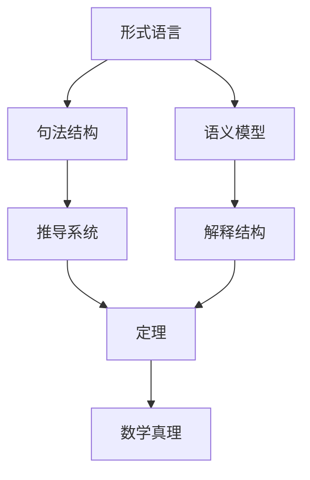

# 形式语言的全面批判分析与综合

## 目录

- [形式语言的全面批判分析与综合](#形式语言的全面批判分析与综合)
  - [目录](#目录)
  - [形式语言的基础理论框架](#形式语言的基础理论框架)
  - [形式语言的合法性与完备性](#形式语言的合法性与完备性)
  - [认知视角下的形式语言](#认知视角下的形式语言)
  - [多层次表征与隐喻](#多层次表征与隐喻)
  - [形式语言的模型关联性](#形式语言的模型关联性)
  - [历史发展与思想脉络](#历史发展与思想脉络)
  - [形式语言的局限性与未来发展](#形式语言的局限性与未来发展)

## 形式语言的基础理论框架

形式语言作为数学和计算机科学的基础，建立在严格的符号系统和规则之上。其核心包括：

- **语法与语义**：形式语言通过精确定义的语法规则构建，并赋予明确的语义解释
- **递归定义**：大多数形式语言采用递归方式定义，允许有限规则生成无限复杂的结构
- **抽象层次**：从符号到表达式，再到语言，形成多层次抽象体系

形式语言理论的基石是乔姆斯基层次结构，将语言分为四类：正则语言、上下文无关语言、上下文相关语言和递归可枚举语言，每一类都有对应的自动机模型。

## 形式语言的合法性与完备性

形式语言的合法性源于其内部一致性和形式化证明系统：

- **公理化方法**：从少量公理出发，通过推理规则导出定理
- **一致性与完备性**：哥德尔不完备定理揭示了足够强大的形式系统不可能同时具备一致性和完备性
- **可判定性问题**：图灵停机问题证明某些形式语言问题本质上不可判定

```math
形式系统的局限性：
1. 任何包含基本算术的一致形式系统中存在真命题无法在系统内证明
2. 这类系统无法证明自身的一致性
```

## 认知视角下的形式语言

从认知科学角度看，形式语言与人类思维的关系复杂而深刻：

- **思维工具**：形式语言作为思维的外部化工具，扩展了人类认知能力
- **认知负荷**：形式符号减轻了工作记忆负担，但需要专门训练才能掌握
- **概念隐喻**：即使在最抽象的形式系统中，人类理解仍依赖于隐喻和具体经验

认知神经科学研究表明，数学形式语言的处理激活了大脑的多个区域，包括负责空间处理、语言和执行功能的区域，暗示形式思维的多模态本质。

## 多层次表征与隐喻

形式语言中的表征呈现多层次特性：

- **句法层**：符号的形式结构和组合规则
- **语义层**：符号与其指称对象的关系
- **语用层**：形式语言在特定领域的应用和解释

隐喻在形式思维中扮演关键角色：

| 隐喻类型 | 示例 | 认知功能 |
|---------|------|---------|
| 结构隐喻 | "函数是映射" | 将抽象概念具体化 |
| 空间隐喻 | "高维空间" | 利用空间直觉理解抽象关系 |
| 容器隐喻 | "集合包含元素" | 边界与归属关系的概念化 |

## 形式语言的模型关联性

形式语言通过多种模型建立关联：

- **同构关系**：不同形式系统之间的结构对应
- **模型论**：研究形式语言与其解释结构之间的关系
- **范畴论**：提供统一不同数学结构的抽象框架



## 历史发展与思想脉络

形式语言的发展反映了人类思维方式的演变：

- **古典时期**：欧几里得几何的公理化方法
- **19世纪**：布尔代数、弗雷格的概念文字、康托尔集合论
- **20世纪早期**：罗素与怀特海的《数学原理》、希尔伯特纲领
- **逻辑转向**：哥德尔不完备定理、图灵机、丘奇λ演算
- **计算理论时代**：乔姆斯基形式语言理论、复杂性理论

关键人物及其贡献：

- **戈特洛布·弗雷格**：首创形式逻辑语言，奠定现代逻辑基础
- **库尔特·哥德尔**：不完备定理彻底改变了形式系统的理解
- **艾伦·图灵**：计算理论和可判定性问题的开创性工作
- **诺姆·乔姆斯基**：形式语言层次结构，连接语言学与计算理论

## 形式语言的局限性与未来发展

形式语言面临的根本挑战：

- **表达力与可计算性的张力**：增强表达力往往导致可判定性降低
- **抽象与直觉的平衡**：过度形式化可能脱离人类直觉理解
- **开放世界问题**：形式系统难以处理模糊性和开放性问题

未来发展方向：

- **交互证明系统**：结合人类直觉与机器验证
- **认知导向的形式语言**：更贴近人类思维模式的形式系统
- **跨学科融合**：与认知科学、人工智能和哲学的深度整合

形式语言作为人类智力成就的结晶，既反映了思维的极限，也展示了抽象思考的无限可能。其发展历程揭示了理性探索的深刻本质，以及符号与意义之间永恒的辩证关系。
