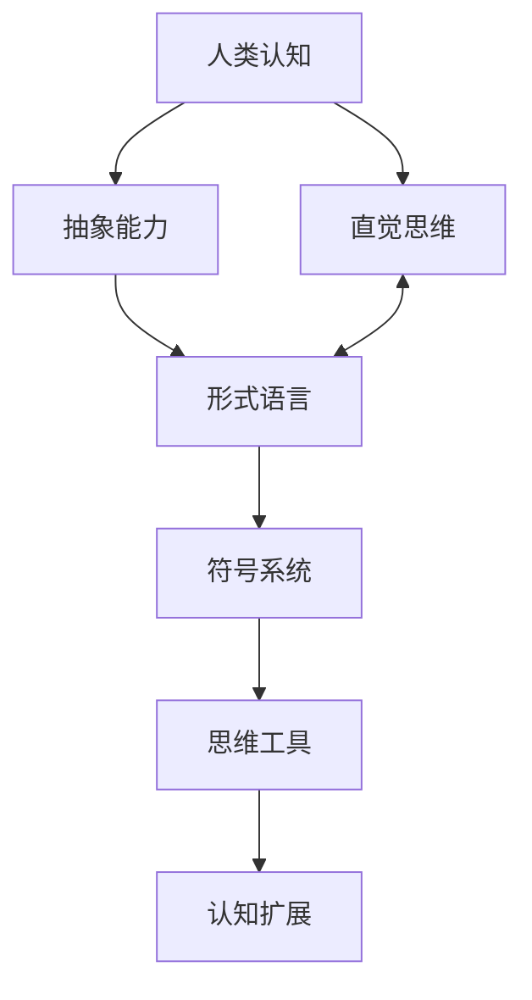
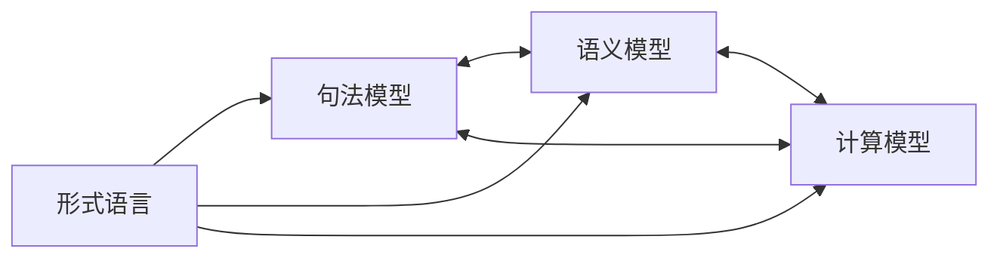

# 形式语言的综合批判分析

## 目录

- [形式语言的综合批判分析](#形式语言的综合批判分析)
  - [目录](#目录)
  - [形式语言概述](#形式语言概述)
  - [理论基础与合法性](#理论基础与合法性)
    - [数学基础](#数学基础)
    - [哲学基础](#哲学基础)
  - [认知视角下的形式语言](#认知视角下的形式语言)
    - [认知结构与形式语言](#认知结构与形式语言)
    - [认知负荷](#认知负荷)
  - [多层次表征与隐喻](#多层次表征与隐喻)
    - [表征层次](#表征层次)
    - [隐喻与形式语言](#隐喻与形式语言)
    - [核心定理的隐喻内涵](#核心定理的隐喻内涵)
  - [形式语言的模型关联性](#形式语言的模型关联性)
    - [模型类型](#模型类型)
    - [模型间关系](#模型间关系)
  - [历史发展与思想脉络](#历史发展与思想脉络)
    - [古典时期](#古典时期)
    - [现代转折](#现代转折)
    - [当代发展](#当代发展)
  - [形式语言的局限性](#形式语言的局限性)
    - [认知局限](#认知局限)
    - [哲学局限](#哲学局限)
    - [实践局限](#实践局限)
  - [结论与展望](#结论与展望)

## 形式语言概述

形式语言是一种由符号和规则构成的系统，用于精确描述语法结构和语义内容。它在数学、计算机科学、逻辑学和语言学中扮演核心角色。形式语言通过抽象化自然语言中的歧义性，创造了一种严格、明确的表达方式。

形式语言的基本要素包括：

- **字母表**：有限符号集合
- **语法规则**：定义合法字符串的规则
- **语义解释**：赋予符号和结构意义的方法

形式语言的分类可按照乔姆斯基谱系划分为：

1. 正则语言（3型）
2. 上下文无关语言（2型）
3. 上下文相关语言（1型）
4. 递归可枚举语言（0型）

## 理论基础与合法性

形式语言的合法性建立在多个理论框架之上：

### 数学基础

- **集合论**：提供了描述语言作为字符串集合的基础
- **数理逻辑**：建立了形式系统的推理规则
- **递归论**：研究可计算性和算法复杂性

### 哲学基础

- **逻辑实证主义**：强调形式化和精确性
- **结构主义**：关注语言的结构而非内容
- **形式主义**：将数学视为符号操作的形式系统

形式语言的完备性可从以下方面评估：

1. **句法完备性**：语法规则能否生成所有合法表达式
2. **语义完备性**：形式系统能否表达其领域内所有真命题
3. **表达完备性**：能否表达特定领域的全部概念

## 认知视角下的形式语言

从认知科学角度看，形式语言与人类认知存在复杂关系：

### 认知结构与形式语言

- 形式语言反映了人类思维的抽象能力
- 符号系统作为思维工具扩展认知能力
- 形式化过程与大脑的范畴化过程相关

### 认知负荷

- 形式语言减轻工作记忆负担
- 外部表征系统作为认知辅助工具
- 符号操作与直觉思维的张力

## 多层次表征与隐喻

形式语言通过多层次表征构建意义：

### 表征层次

1. **句法层**：符号排列规则
2. **语义层**：符号指称的对象或概念
3. **语用层**：符号在特定语境中的应用

### 隐喻与形式语言

- 数学符号系统作为概念隐喻
- 形式语言中的空间隐喻（如集合包含关系）
- 逻辑运算符与日常推理的映射关系

### 核心定理的隐喻内涵

- **哥德尔不完备定理**：揭示形式系统的内在局限，隐喻任何封闭系统的认知边界
- **图灵停机问题**：反映计算与决定性的根本限制，暗示认知过程的不可预测性
- **不确定性原理**：在形式系统中表现为精确性与完备性的权衡

## 形式语言的模型关联性

形式语言通过不同模型建立关联：

### 模型类型

- **句法模型**：描述语言结构的形式规则
- **语义模型**：解释符号意义的理论框架
- **计算模型**：实现语言处理的抽象机器

### 模型间关系

- **同构关系**：不同模型间的结构对应
- **还原关系**：复杂模型简化为基本模型
- **互补关系**：不同模型捕捉系统的不同方面

## 历史发展与思想脉络

形式语言的发展反映了人类思想的演进：

### 古典时期

- **亚里士多德**：形式逻辑的奠基者，建立三段论
- **欧几里得**：《几何原本》展示公理化方法
- **斯多葛学派**：发展命题逻辑

### 现代转折

- **莱布尼茨**：普遍特征语言与演算概念
- **布尔**：代数化逻辑
- **弗雷格**：概念文字与现代逻辑符号系统
- **希尔伯特**：形式主义数学基础
- **罗素与怀特海**：《数学原理》尝试建立数学完备基础

### 当代发展

- **哥德尔**：不完备定理对形式系统的根本限制
- **图灵**：计算理论与可计算性概念
- **乔姆斯基**：形式语言谱系与生成语法
- **克里普克**：可能世界语义学
- **蒙塔古**：形式语义学

## 形式语言的局限性

尽管形式语言具有强大的表达能力，但也存在内在局限：

### 认知局限

- 过度形式化可能脱离直觉理解
- 符号操作与概念理解之间的鸿沟
- 创造性思维难以完全形式化

### 哲学局限

- **哥德尔不完备性**：任何足够强的形式系统无法同时保证一致性和完备性
- **指称问题**：符号与现实世界的关联性挑战
- **本体论假设**：形式系统隐含的存在性假设

### 实践局限

- 形式语言的学习曲线陡峭
- 不同形式系统间的翻译困难
- 应用于复杂现实问题时的简化风险

## 结论与展望

形式语言作为人类智慧的结晶，既展现了思维的精确性和系统性，也反映了认知的局限性。它在数学、逻辑、计算机科学和语言学等领域的应用，推动了人类知识的边界。

未来发展方向：

- 形式语言与自然语言处理的融合
- 认知科学与形式系统的交叉研究
- 新型逻辑系统应对不确定性和模糊性
- 形式语言在人工智能中的应用与限制

形式语言不仅是技术工具，也是人类认知能力的延伸。理解其内在结构、历史脉络和哲学内涵，有助于我们更深入地把握人类思维的本质和边界。
