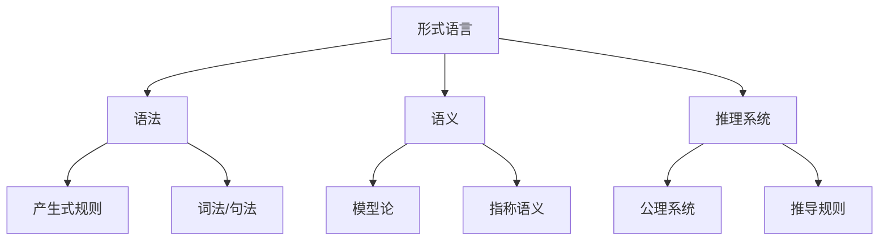
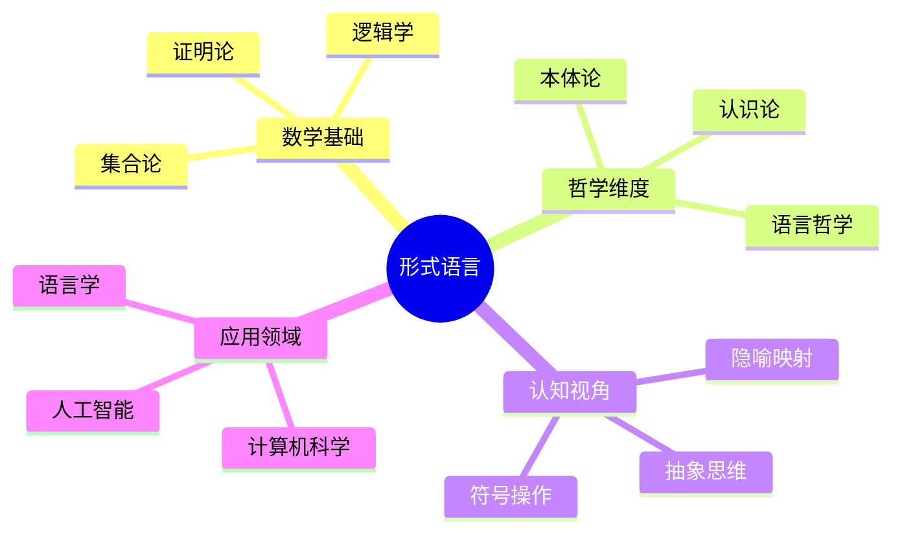

# 形式语言的批判分析与综合

## 目录

- [形式语言的批判分析与综合](#形式语言的批判分析与综合)
  - [目录](#目录)
  - [形式语言的本质与基础](#形式语言的本质与基础)
  - [形式语言的历史发展脉络](#形式语言的历史发展脉络)
  - [形式语言的认知基础](#形式语言的认知基础)
  - [形式语言的多层次表征](#形式语言的多层次表征)
  - [形式语言的哲学维度](#形式语言的哲学维度)
  - [形式语言的局限性与挑战](#形式语言的局限性与挑战)
  - [形式语言的跨学科应用与启示](#形式语言的跨学科应用与启示)

## 形式语言的本质与基础

形式语言本质上是一套符号系统，通过精确定义的规则构建，旨在消除自然语言的歧义性。其合法性基于三个核心支柱：

1. **语法规则**：定义符号串的合法构造方式
2. **语义规则**：赋予符号以明确含义
3. **推理规则**：允许从已知真理推导新真理

形式语言的完备性依赖于其形式系统的一致性与完备性，而哥德尔不完备定理揭示了足够强大的形式系统无法同时满足一致性和完备性。

## 形式语言的历史发展脉络

形式语言的发展体现了人类思维从具象到抽象的演进：

- **古希腊时期**：亚里士多德的三段论开创形式逻辑
- **17世纪**：莱布尼茨梦想创造普遍特征语言
- **19世纪**：布尔代数和弗雷格的概念文字奠定现代逻辑基础
- **20世纪初**：希尔伯特形式主义计划与罗素类型理论
- **20世纪中期**：乔姆斯基形式语言层级与图灵机理论
- **20世纪后期至今**：计算理论与程序语言理论的融合发展

关键人物思想脉络：

| 人物 | 时期 | 核心贡献 | 思想影响 |
|------|------|----------|----------|
| 亚里士多德 | 公元前4世纪 | 三段论逻辑 | 形式推理基础 |
| 莱布尼茨 | 17世纪 | 普遍特征语言 | 符号化思维 |
| 布尔 | 19世纪 | 布尔代数 | 逻辑代数化 |
| 弗雷格 | 19世纪末 | 概念文字 | 现代数理逻辑 |
| 希尔伯特 | 20世纪初 | 形式主义 | 数学基础研究 |
| 哥德尔 | 20世纪初 | 不完备定理 | 形式系统限制 |
| 乔姆斯基 | 20世纪中 | 形式语言层级 | 语言形式化 |
| 图灵 | 20世纪中 | 计算理论 | 可计算性概念 |

## 形式语言的认知基础

形式语言与人类认知的关系体现在多个层面：

1. **抽象能力**：形式语言反映人类将复杂现象抽象为符号操作的能力
2. **范畴化思维**：形式语言中的类型系统映射人类对事物分类的认知倾向
3. **隐喻映射**：数学形式语言常通过空间隐喻理解抽象概念

认知科学视角下，形式语言可视为人类思维的外部工具，通过减轻工作记忆负担扩展认知能力。然而，形式语言的学习与使用依赖于人脑特定的神经网络结构，特别是前额叶皮层的抽象推理能力。

## 形式语言的多层次表征

形式语言的表征呈现多层次结构：

1. **句法层**：符号串的结构关系
2. **语义层**：符号与指称对象的关系
3. **语用层**：形式语言在特定领域的应用

这些层次间存在复杂映射关系，形成了形式语言的多维表征空间。特别值得注意的是，形式语言中的抽象概念往往通过具体领域的隐喻得以理解，如集合论中的"包含"关系借用空间隐喻。

形式语言的模型关联性体现在：

- **同构关系**：不同形式系统间的结构映射
- **元模型关系**：用于描述模型的模型
- **层次结构**：从基础公理到复杂定理的推导链

## 形式语言的哲学维度

形式语言引发的哲学问题涉及多个维度：

1. **本体论**：形式对象的存在性质（柏拉图主义vs形式主义）
2. **认识论**：形式知识的确定性与可靠性
3. **语言哲学**：形式语言与自然语言的关系

不同哲学立场对形式语言的解读：

| 哲学立场 | 对形式语言的解读 | 代表人物 |
|----------|------------------|----------|
| 逻辑实在论 | 数学对象独立存在 | 哥德尔 |
| 形式主义 | 形式语言为无意义符号游戏 | 希尔伯特 |
| 直觉主义 | 形式语言应基于构造性证明 | 布劳威尔 |
| 结构主义 | 形式语言描述结构关系 | 布尔巴基 |

## 形式语言的局限性与挑战

形式语言面临的根本挑战包括：

1. **不完备性**：哥德尔定理揭示的形式系统内在局限
2. **表达力与可判定性的张力**：表达力增强往往导致可判定性降低
3. **与自然认知的差距**：人类思维的模糊性与形式语言的精确性之间的鸿沟

这些局限性不仅是技术问题，也反映了形式化与人类认知方式之间的根本差异。

## 形式语言的跨学科应用与启示

形式语言已超越纯数学领域，在多学科中发挥关键作用：

- **计算机科学**：程序语言理论、形式验证
- **语言学**：形式语法、计算语言学
- **认知科学**：思维形式化模型
- **人工智能**：知识表征、推理系统

形式语言的发展启示我们：

1. 形式化是双刃剑，提供精确性但可能失去直觉洞察
2. 多元认知方式的互补价值
3. 形式与非形式思维的整合是未来发展方向

形式语言作为人类智力成就的结晶，既是思维工具，也是研究对象，其发展历程揭示了人类抽象思维能力的演进，同时也展现了形式化方法的力量与局限。在未来，形式语言理论将继续与认知科学、人工智能等领域深度融合，探索更富表现力且与人类认知相协调的形式系统。
