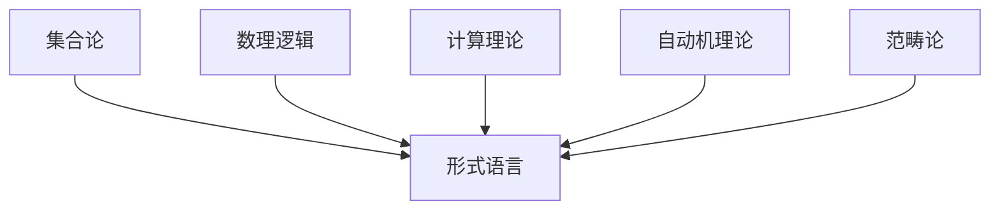
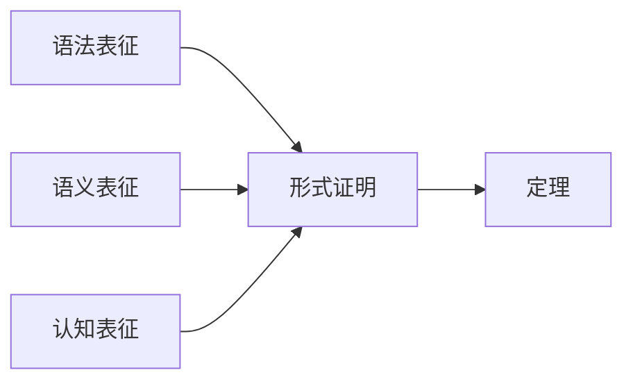
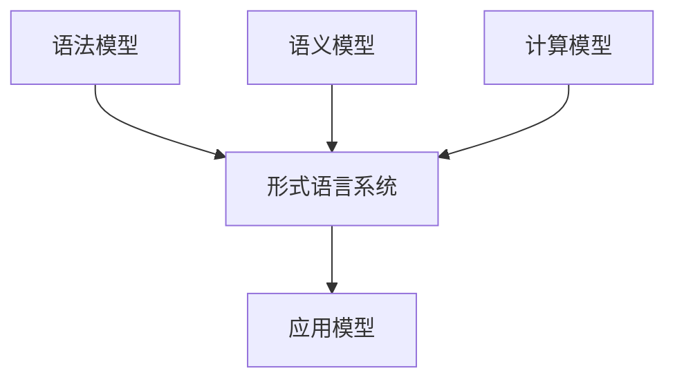

# 形式语言的全面批判分析与综合

## 目录

- [形式语言的全面批判分析与综合](#形式语言的全面批判分析与综合)
  - [目录](#目录)
  - [形式语言的基础理论框架](#形式语言的基础理论框架)
  - [形式语言的合法性与完备性](#形式语言的合法性与完备性)
    - [内部一致性](#内部一致性)
    - [完备性分析](#完备性分析)
  - [定理与证明的多层次表征](#定理与证明的多层次表征)
    - [语法层次](#语法层次)
    - [语义层次](#语义层次)
    - [认知层次](#认知层次)
  - [认知与隐喻在形式语言中的作用](#认知与隐喻在形式语言中的作用)
  - [形式语言中的模型关联性](#形式语言中的模型关联性)
    - [模型间的映射与同构](#模型间的映射与同构)
    - [多层次模型关系](#多层次模型关系)
  - [历史发展与思想脉络](#历史发展与思想脉络)
    - [关键历史阶段](#关键历史阶段)
    - [关键人物及其贡献](#关键人物及其贡献)
  - [形式语言的局限性与未来发展](#形式语言的局限性与未来发展)
    - [局限性](#局限性)
    - [未来发展方向](#未来发展方向)

## 形式语言的基础理论框架

形式语言作为数学和计算机科学的基础，建立在严格的符号系统和规则之上。其理论框架主要包括：

- **符号系统**：由有限或可数无限的符号集合构成
- **语法规则**：定义如何从基本符号构造合法表达式
- **形式系统**：包含公理和推导规则，用于生成定理

形式语言的理论基础主要源于以下几个方面：

## 形式语言的合法性与完备性

形式语言的合法性主要体现在其内部一致性和外部适用性上：

### 内部一致性

- **哥德尔不完备定理**：任何包含基本算术的一致形式系统都存在不可证明的真命题
- **一致性问题**：形式系统不能在自身内部证明其一致性
- **可判定性**：并非所有形式语言问题都是可判定的

### 完备性分析

| 形式系统 | 一致性 | 完备性 | 可判定性 |
|---------|-------|-------|---------|
| 命题逻辑 | 是 | 是 | 是 |
| 一阶谓词逻辑 | 是 | 是（哥德尔完备性定理） | 否 |
| 皮亚诺算术 | 是（假设） | 否（哥德尔不完备定理） | 否 |
| ZFC集合论 | 未知 | 否 | 否 |

## 定理与证明的多层次表征

形式语言中的定理和证明可以通过多种层次进行表征：

### 语法层次

- 符号序列的形式化表示
- 推导步骤的严格规则

### 语义层次

- 模型理论解释
- 真值指派与满足关系

### 认知层次

- 证明作为认知过程
- 直觉与形式化之间的桥梁

## 认知与隐喻在形式语言中的作用

尽管形式语言追求严格性，但认知和隐喻在其发展和理解中扮演重要角色：

- **概念隐喻**：如"集合作为容器"、"函数作为映射"等隐喻帮助理解抽象概念
- **认知基础**：数学直觉作为形式化前的思维基础
- **视觉表征**：图形、图表等作为形式语言的辅助理解工具

莱考夫和努涅兹的研究表明，即使是最抽象的数学概念也依赖于人类的认知结构和隐喻系统。

## 形式语言中的模型关联性

形式语言中的模型关联主要体现在：

### 模型间的映射与同构

- **范畴论视角**：对象之间的态射与函子
- **同构与等价**：不同表达系统间的结构对应
- **模型转换**：在不同形式系统间的翻译机制

### 多层次模型关系

## 历史发展与思想脉络

形式语言的发展历程反映了人类对严格推理的追求：

### 关键历史阶段

1. **古希腊时期**：欧几里得《几何原本》建立公理化系统
2. **19世纪**：布尔代数、弗雷格的概念文字、康托尔的集合论
3. **20世纪初**：希尔伯特形式化项目、罗素与怀特海《数学原理》
4. **20世纪中期**：哥德尔不完备定理、图灵机、乔姆斯基形式语言理论
5. **现代发展**：计算复杂性理论、范畴论、类型论

### 关键人物及其贡献

| 人物 | 时期 | 主要贡献 |
|-----|-----|---------|
| 欧几里得 | 古希腊 | 公理化几何系统 |
| 弗雷格 | 19世纪末 | 现代逻辑符号系统、概念文字 |
| 希尔伯特 | 19-20世纪 | 形式化数学项目、希尔伯特问题 |
| 哥德尔 | 20世纪 | 不完备定理、完备性定理 |
| 图灵 | 20世纪 | 图灵机、可计算性理论 |
| 乔姆斯基 | 20世纪 | 形式语言层次结构、生成语法 |

## 形式语言的局限性与未来发展

### 局限性

- **表达能力限制**：某些直觉概念难以形式化
- **认知鸿沟**：形式系统与人类认知方式的差异
- **实用性挑战**：高度形式化系统在应用中的复杂性

### 未来发展方向

- **交互证明系统**：人机协作的证明验证
- **形式化数学**：完整数学理论的计算机验证
- **认知科学整合**：将认知科学发现融入形式系统设计
- **量子计算模型**：基于量子力学的新型形式语言系统

形式语言作为人类智慧的结晶，既反映了我们对确定性和严格性的追求，也展现了抽象思维的力量。尽管存在固有局限，形式语言仍将继续发展，为科学和哲学探索提供坚实基础。
