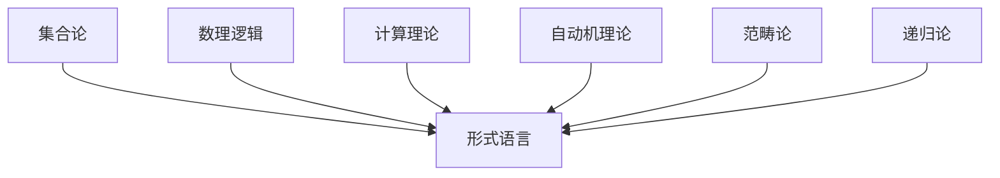
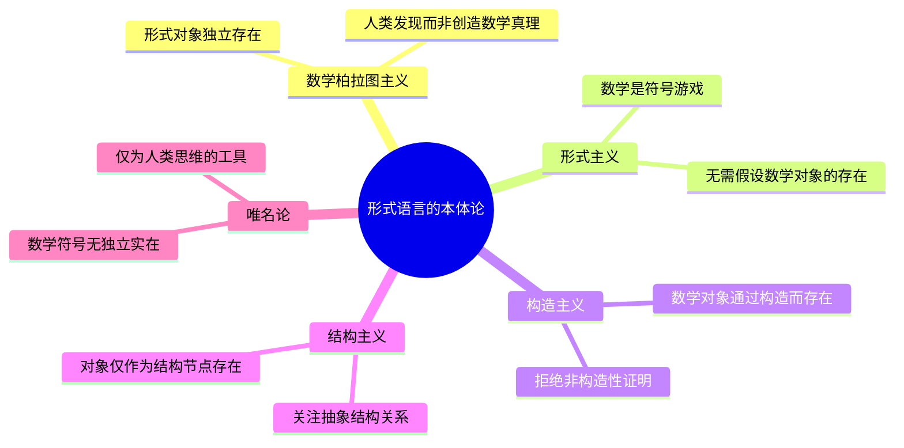
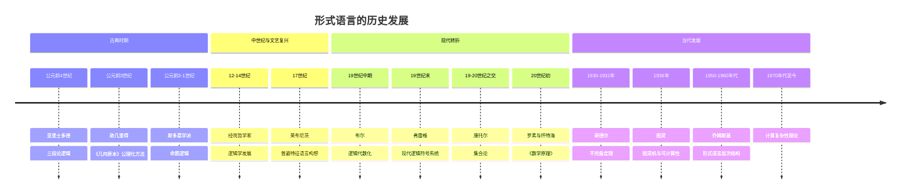
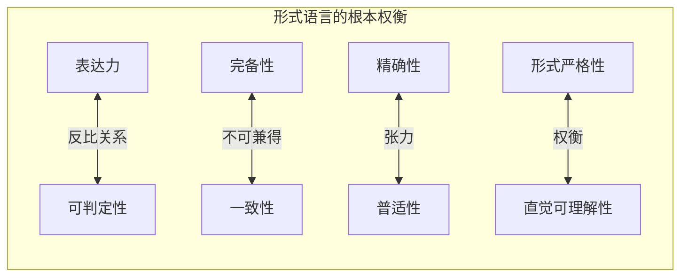
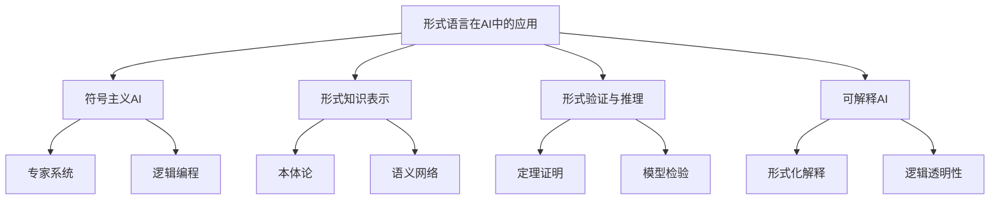
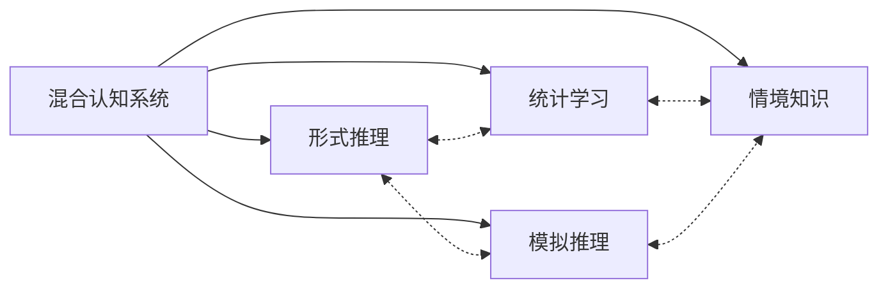
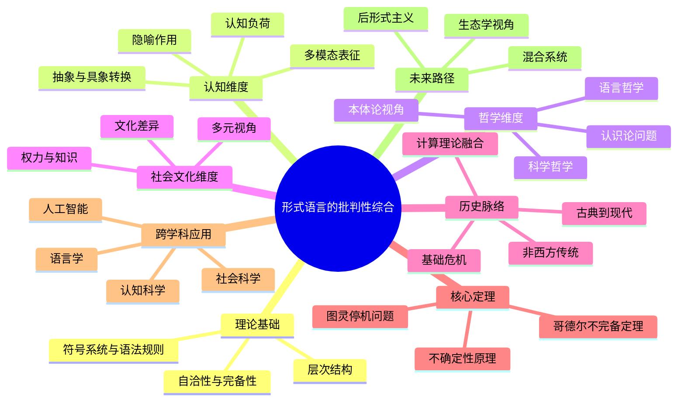

# 形式语言的批判性分析与综合：多维视角的整合

## 目录

- [形式语言的批判性分析与综合：多维视角的整合](#形式语言的批判性分析与综合多维视角的整合)
  - [目录](#目录)
  - [引言：形式语言的本质与意义](#引言形式语言的本质与意义)
  - [形式语言的理论基础](#形式语言的理论基础)
    - [符号系统与语法规则](#符号系统与语法规则)
    - [形式语言的层次结构](#形式语言的层次结构)
    - [形式系统的自洽性与完备性](#形式系统的自洽性与完备性)
  - [形式语言的认知维度](#形式语言的认知维度)
    - [认知表征的多模态性](#认知表征的多模态性)
    - [抽象与具象的认知转换](#抽象与具象的认知转换)
    - [隐喻在形式思维中的核心作用](#隐喻在形式思维中的核心作用)
    - [认知负荷与形式语言学习](#认知负荷与形式语言学习)
  - [形式语言的哲学维度](#形式语言的哲学维度)
    - [本体论视角：符号与实在](#本体论视角符号与实在)
    - [认识论问题：形式知识的边界](#认识论问题形式知识的边界)
    - [语言哲学：形式语言与自然语言的关系](#语言哲学形式语言与自然语言的关系)
    - [科学哲学：形式语言作为科学工具](#科学哲学形式语言作为科学工具)
  - [形式语言的社会文化维度](#形式语言的社会文化维度)
    - [权力与知识：形式语言的政治性](#权力与知识形式语言的政治性)
    - [文化差异与形式思维](#文化差异与形式思维)
    - [形式语言的性别与多元视角](#形式语言的性别与多元视角)
  - [形式语言的历史发展与思想脉络](#形式语言的历史发展与思想脉络)
    - [古典逻辑到现代形式系统](#古典逻辑到现代形式系统)
    - [数学基础危机与多元范式](#数学基础危机与多元范式)
    - [计算理论与形式语言的融合](#计算理论与形式语言的融合)
    - [非西方传统中的形式思维](#非西方传统中的形式思维)
  - [形式语言的核心定理与隐喻内涵](#形式语言的核心定理与隐喻内涵)
    - [哥德尔不完备定理的多层解读](#哥德尔不完备定理的多层解读)
    - [图灵停机问题与计算边界](#图灵停机问题与计算边界)
    - [不确定性原理在形式系统中的体现](#不确定性原理在形式系统中的体现)
  - [形式语言的跨学科应用与限制](#形式语言的跨学科应用与限制)
    - [人工智能与形式语言的演化](#人工智能与形式语言的演化)
    - [认知科学中的形式模型](#认知科学中的形式模型)
    - [语言学与形式语法](#语言学与形式语法)
    - [社会科学中的形式方法](#社会科学中的形式方法)
  - [形式语言的未来发展路径](#形式语言的未来发展路径)
    - [后形式主义思潮](#后形式主义思潮)
    - [混合认知系统](#混合认知系统)
    - [形式语言的生态学视角](#形式语言的生态学视角)
  - [结论：形式语言的批判性综合](#结论形式语言的批判性综合)

## 引言：形式语言的本质与意义

形式语言作为人类智识活动的产物，既是数学、逻辑和计算科学的基础工具，也是一种特殊的认知方式和文化现象。
本文旨在对形式语言进行全面的批判性分析与综合，不仅考察其内部理论结构，
还将其置于认知科学、哲学、社会文化和历史语境中进行多维度审视。

形式语言的本质特征在于其精确性、无歧义性和形式化的符号操作，这使其成为科学和数学研究的强大工具。
然而，这种精确性也带来了局限，尤其是在处理模糊性、语境依赖性和创造性思维等方面。
通过批判性分析，我们可以更全面地理解形式语言的价值与局限，以及它在人类知识体系中的适当位置。

## 形式语言的理论基础

### 符号系统与语法规则

形式语言的基础是其符号系统和语法规则。
符号系统由有限或可数无限的基本符号集合构成，而语法规则定义了如何从这些基本符号构造合法的表达式。

形式语言的核心组成部分包括：

- **字母表**：基本符号的有限集合
- **语法规则**：定义合法字符串的生成方式
- **形式系统**：包含公理和推导规则的完整框架
- **语义解释**：为符号和表达式赋予意义的方法

形式语言的理论基础主要来源于以下几个领域：

### 形式语言的层次结构

乔姆斯基谱系是理解形式语言层次结构的经典框架，它将形式语言按照生成能力和计算复杂性分为四个层次：

| 语言类型 | 文法特征 | 识别装置 | 应用领域 | 计算能力 |
|---------|---------|---------|---------|---------|
| 0型语言 | 无限制文法 | 图灵机 | 通用计算 | 图灵完备 |
| 1型语言 | 上下文相关文法 | 线性有界自动机 | 自然语言处理 | 非确定性线性空间 |
| 2型语言 | 上下文无关文法 | 下推自动机 | 编程语言语法 | 非确定性栈空间 |
| 3型语言 | 正则文法 | 有限状态自动机 | 词法分析、模式匹配 | 有限状态 |

这种层次结构不仅是形式语言理论的核心，也反映了计算复杂性的本质层级，揭示了表达能力与计算资源之间的根本关系。

### 形式系统的自洽性与完备性

形式系统的自洽性（一致性）和完备性是评估其理论基础的关键标准。
哥德尔不完备定理揭示了这两者之间的根本张力：

> **第一不完备定理**：任何包含基本算术的一致的形式系统中，存在真但不可证明的命题。
>
> **第二不完备定理**：足够强的一致形式系统不能证明自身的一致性。

这些定理对形式语言的理论基础提出了深刻挑战，表明了形式化方法的内在局限。
下表比较了几个重要形式系统的性质：

| 形式系统 | 一致性 | 完备性 | 可判定性 | 表达能力 |
|---------|-------|-------|---------|---------|
| 命题逻辑 | 是 | 是 | 是 | 低 |
| 一阶谓词逻辑 | 是 | 是（哥德尔完备性定理） | 否 | 中 |
| 皮亚诺算术 | 是（假设） | 否（哥德尔不完备定理） | 否 | 高 |
| ZFC集合论 | 未知 | 否 | 否 | 极高 |

这种表达能力与形式性质之间的权衡关系，构成了形式语言理论的核心张力。

## 形式语言的认知维度

### 认知表征的多模态性

形式语言与人类认知的关系远比传统观点复杂。
将认知表征直接等同于形式语言面临着过度简化的风险，因为人类的知识和思维具有多模态性：

- **命题表征**：与形式语言最相似的知识表达方式
- **图像表征**：空间推理和视觉思维中的心像
- **感知符号系统**：概念表征植根于感知运动系统
- **情感表征**：情绪状态对认知过程的影响

这种多模态性挑战了形式语言作为唯一或主导认知模型的地位，表明人类思维的丰富性超出了纯符号操作的范围。

### 抽象与具象的认知转换

形式语言的使用涉及抽象与具象之间的不断转换，这一过程可以通过以下认知模型来理解：

这种转换过程依赖于人类的抽象思维能力，同时也反映了形式语言的本质功能：将复杂的现实问题转化为可操作的符号计算。然而，这种转换并非总是无损的，抽象过程中的信息损失可能导致模型与现实之间的偏差。

### 隐喻在形式思维中的核心作用

尽管形式语言追求严格性和精确性，但隐喻在其发展和理解中扮演着核心角色。莱考夫和努涅兹的研究表明，即使是最抽象的数学概念也依赖于人类的认知结构和隐喻系统。

形式语言中的核心隐喻包括：

| 隐喻类型 | 示例 | 认知功能 |
|---------|------|---------|
| 容器隐喻 | "集合包含元素" | 边界与归属关系的概念化 |
| 路径隐喻 | "函数映射" | 转换与对应关系的理解 |
| 空间隐喻 | "高维空间" | 抽象关系的空间化理解 |
| 结构隐喻 | "数学证明是建筑" | 逻辑结构的稳固性表征 |

这些隐喻不仅是理解抽象概念的工具，也是形式思维本身的构成要素，揭示了形式语言与具身认知的深层联系。

### 认知负荷与形式语言学习

形式语言的学习和使用涉及特定的认知负荷，这对理解其在教育和实践中的应用具有重要意义：

- **工作记忆限制**：形式操作对工作记忆容量提出高要求
- **表征转换成本**：在不同表征系统间切换需要认知资源
- **专家-新手差异**：专家发展了特定的认知图式和模式识别能力
- **认知工具依赖**：外部表征系统（如符号、图表）作为认知负荷分担机制

这些因素解释了为什么形式语言的掌握需要长期训练，以及为什么不同个体在形式思维能力上存在显著差异。

## 形式语言的哲学维度

### 本体论视角：符号与实在

形式语言引发的核心本体论问题是：符号系统与其所指称的实在之间存在什么样的关系？这一问题可以从多个哲学立场审视：

这些不同立场反映了数学哲学中关于形式语言本体地位的持久争论，影响着我们对形式知识本质的理解。

### 认识论问题：形式知识的边界

从认识论角度看，形式语言既是获取知识的工具，也设定了知识的边界。形式语言的认识论特征包括：

1. **确定性**：在给定公理系统内，结论具有确定性
2. **内部一致性**：避免矛盾是形式系统的基本要求
3. **可证明性**：知识必须通过形式推导获得
4. **不完备性**：任何足够复杂的形式系统都存在不可证明的真命题

哥德尔不完备定理揭示了形式语言作为认识工具的根本局限，表明纯粹形式化的知识追求存在内在边界。这一发现与康德关于人类认知局限性的哲学思想形成了深刻呼应。

### 语言哲学：形式语言与自然语言的关系

形式语言与自然语言的关系是语言哲学的核心议题之一。这两种语言系统之间存在根本差异：

| 形式语言特征 | 自然语言特征 |
|------------|------------|
| 精确性 | 模糊性 |
| 上下文独立 | 上下文敏感 |
| 有限规则 | 开放规则 |
| 明确语义 | 多义性 |
| 静态结构 | 动态演化 |
| 人工设计 | 自然演化 |

维特根斯坦的思想转变反映了对这一关系理解的深刻变化：从早期将形式逻辑视为语言本质的观点，到后期认识到语言是多样化的"语言游戏"，形式语言只是众多语言游戏中的一种。

### 科学哲学：形式语言作为科学工具

形式语言在科学哲学中的地位经历了从绝对化到相对化的转变：

- **逻辑实证主义时期**：形式语言被视为科学知识的理想形式
- **库恩范式转换后**：认识到科学理论的历史和社会维度
- **当代科学哲学**：形式语言被视为科学工具箱中的一种工具，而非唯一标准

这种转变反映了对科学本质更加多元和复杂的理解，形式语言被置于更广阔的认知和社会语境中评估。科学实践中形式语言的作用更多地被视为一种有用的工具，而非科学知识的唯一合法表达方式。

## 形式语言的社会文化维度

### 权力与知识：形式语言的政治性

形式语言不仅是中立的工具，也是权力与知识交织的场域。从批判理论视角看，形式语言具有深刻的政治维度：

- **知识垄断**：形式语言的复杂性可能成为知识垄断的工具，限制非专业人士参与重要讨论
- **合法性建构**：形式化常被用作赋予特定知识主张以权威性的手段
- **排除机制**：对形式语言的强调可能系统性地排除某些思维方式和知识传统
- **技术统治**：形式语言在技术社会中的核心地位强化了技术专家的权力

福柯的知识考古学和权力分析为我们理解形式语言的政治性提供了重要视角，揭示了看似中立的形式系统如何嵌入特定的权力关系中。

### 文化差异与形式思维

形式思维方式在不同文化传统中的表现和地位存在显著差异：

- **西方传统**：从古希腊几何到现代形式逻辑，形式化思维占据核心地位
- **东亚传统**：更强调整体性、关系性思维和辩证法，形式逻辑地位相对次要
- **印度传统**：发展了独特的形式逻辑系统（如因明学），但与宗教哲学紧密结合
- **原住民知识系统**：强调情境化、叙事性和生态关联性知识，而非抽象形式化

这些差异提醒我们，形式语言只是人类认知多样性的一种表现，而非普遍的、文化中立的思维方式。

### 形式语言的性别与多元视角

女性主义和多元文化主义对形式语言提出了重要批判：

- **性别视角**：形式理性传统与西方哲学中的男性中心主义相关联，可能系统性地排除了其他知识方式
- **情境知识**：哈拉维等学者强调知识的情境性和身体性，挑战了形式知识的抽象普遍性主张
- **多元认识论**：不同社会群体基于其特定经验可能发展出不同的认知方式和知识系统

这些批判不是要否定形式语言的价值，而是呼吁更包容的认识论，承认多种知识形式的合法性和互补性。

## 形式语言的历史发展与思想脉络

### 古典逻辑到现代形式系统

形式语言的历史发展反映了人类思维方式的演变：

这一发展历程展示了形式语言从简单的逻辑推理工具到复杂的数学和计算基础的演变，反映了人类抽象思维能力的不断提升和形式化方法的日益精细。

### 数学基础危机与多元范式

20世纪初的数学基础危机是形式语言发展的关键转折点，催生了多种数学哲学范式：

- **逻辑主义**（罗素、弗雷格）：试图将数学归约为逻辑
- **形式主义**（希尔伯特）：将数学视为无解释符号的形式系统
- **直觉主义**（布劳威尔）：强调数学是心智的构造活动
- **集合论基础**（策梅洛-弗兰克尔）：以公理化集合论作为数学基础

哥德尔不完备定理对希尔伯特纲领的挑战，表明了形式化方法的内在局限，促使数学哲学走向多元主义，承认不同方法和视角的价值。

### 计算理论与形式语言的融合

计算理论的发展与形式语言理论的融合是20世纪中期的重要发展：

- **图灵机模型**：提供了计算的形式化定义
- **λ演算**（丘奇）：函数计算的形式系统
- **形式语言谱系**（乔姆斯基）：连接语言学与计算理论
- **复杂性理论**：研究计算问题的内在复杂性

这种融合不仅奠定了计算机科学的理论基础，也为认知科学提供了思维形式化的新视角，影响了人工智能、语言学和认知心理学的发展。

### 非西方传统中的形式思维

形式思维不仅存在于西方传统中，其他文明也发展了独特的形式思维系统：

- **印度逻辑传统**：从公元前6世纪开始发展，包括因明学等形式推理系统
- **中国逻辑**：墨家的名辩学、后期佛教逻辑
- **阿拉伯-伊斯兰传统**：发展了形式逻辑和数学符号系统
- **玛雅和印加文明**：发展了复杂的数学符号系统

这些非西方形式思维传统提供了多元的视角，挑战了将形式语言发展视为纯粹西方现象的狭隘观点，展示了人类形式思维能力的普遍性和多样性。

## 形式语言的核心定理与隐喻内涵

### 哥德尔不完备定理的多层解读

哥德尔不完备定理是20世纪数学基础研究中最具震撼力的成果之一，它具有多层次的解读：

1. **技术层面**：证明了任何包含基本算术的一致形式系统都存在不可证明的命题
2. **数学哲学层面**：挑战了形式主义和逻辑主义的数学基础方案
3. **认知层面**：暗示人类思维可能超越任何特定形式系统
4. **哲学层面**：关于真理、证明和知识本质的深刻启示

哥德尔定理的隐喻内涵极为丰富，被应用于从人工智能到意识哲学的多个领域，成为讨论认知和知识边界的核心参照点。

### 图灵停机问题与计算边界

图灵停机问题证明了存在无法通过算法解决的问题，即：不存在通用算法能够判断任意程序是否会在有限时间内终止。这一结果揭示了计算的根本边界，其隐喻意义包括：

- **算法思维的内在限制**：某些问题本质上不可算法化解决
- **形式化方法的边界**：不是所有问题都适合形式化处理
- **创造性与机械性的区分**：某些思维活动可能本质上不可机械化

图灵的工作与哥德尔的不完备定理在本质上是一致的，都指向了形式系统和算法方法的内在局限性。

### 不确定性原理在形式系统中的体现

量子力学中的不确定性原理在形式系统中也有其对应物。形式语言中的不确定性体现在几个根本性的权衡关系中：

这些权衡关系揭示了形式语言的内在张力，也反映了知识表征的根本困境。任何形式系统都必须在这些对立面之间寻找平衡，而无法同时最大化所有理想特性。

## 形式语言的跨学科应用与限制

### 人工智能与形式语言的演化

形式语言与人工智能的关系经历了复杂的演变：

- **早期AI**：基于形式逻辑和符号操作的系统
- **知识表示**：形式语言作为知识编码的基础
- **神经网络兴起**：从符号处理转向统计学习
- **混合系统**：形式方法与机器学习的融合尝试
- **大型语言模型**：挑战纯形式化知识表示的范式

AI的发展揭示了形式语言的双重角色：
    一方面，形式语言提供了精确的知识表示框架；
    另一方面，纯形式化方法难以处理现实世界的复杂性和不确定性。
当代AI系统越来越多地采用混合方法，结合形式推理与统计学习的优势。

### 认知科学中的形式模型

形式语言在认知科学中的应用展现了其优势与局限：

- **计算理论视角**：心智作为形式系统的计算模型
- **认知架构**：如ACT-R、SOAR等基于规则的认知模型
- **形式语义学**：语言理解的形式化模型
- **贝叶斯认知科学**：将认知过程形式化为概率推理

然而，形式模型在捕捉认知的某些方面时面临挑战：

| 认知现象 | 形式模型的优势 | 形式模型的局限 |
|---------|--------------|--------------|
| 逻辑推理 | 精确捕捉推理规则 | 难以模拟人类实际推理中的捷径和启发式 |
| 概念形成 | 提供清晰的类别边界 | 难以处理概念的模糊边界和原型效应 |
| 语言理解 | 形式化句法结构 | 难以整合语境和世界知识 |
| 创造性思维 | 模拟某些组合过程 | 难以捕捉真正的创新和洞察 |

这些局限表明，形式模型虽然是认知科学的重要工具，但需要与其他方法互补，才能全面理解人类认知。

### 语言学与形式语法

形式语言在语言学中的应用，尤其是乔姆斯基的生成语法，展示了形式方法在理解自然语言结构方面的力量与挑战：

- **转换生成语法**：将语言能力形式化为规则系统
- **形式语义学**：使用逻辑工具分析自然语言的意义
- **计算语言学**：形式语言在自然语言处理中的应用

然而，形式语法也面临重要批评：

1. **使用性不足**：过于关注语言能力而非实际使用
2. **跨语言适用性**：形式模型往往基于英语等印欧语系特征
3. **语用学维度**：难以形式化处理语境和交际功能
4. **语言习得问题**：难以解释儿童如何习得复杂语法

这些批评促使语言学发展出更多元的理论框架，包括认知语言学、功能语言学等，它们与形式方法形成互补。

### 社会科学中的形式方法

形式语言在社会科学中的应用展示了其跨学科潜力和局限性：

- **博弈论**：社会互动的形式化模型
- **社会选择理论**：集体决策的形式分析
- **形式化组织理论**：组织结构和过程的数学模型
- **计算社会学**：社会现象的计算机模拟

这些应用在提供精确分析工具的同时，也面临着社会现象复杂性和人类行为不确定性的挑战。形式方法在社会科学中的适当角色仍是活跃的研究和辩论领域。

## 形式语言的未来发展路径

### 后形式主义思潮

后形式主义思潮探索超越传统形式主义局限的新方向：

- **非经典逻辑**：模糊逻辑、直觉主义逻辑、多值逻辑等
- **动态逻辑**：形式化时间和变化的逻辑系统
- **情境逻辑**：整合语境因素的形式系统
- **认知导向形式系统**：更贴近人类实际推理的形式语言

这些发展表明，形式语言本身正在演化，以应对传统形式主义面临的挑战，拓展其适用范围和表达能力。

### 混合认知系统

未来的发展方向可能是混合认知系统，整合形式推理与其他认知模式：

这种混合系统试图结合不同认知方式的优势：形式推理的精确性和可靠性、统计学习的适应性、模拟推理的创造性以及情境知识的丰富性。人工智能研究中的神经符号系统是这种方向的代表。

### 形式语言的生态学视角

生态学视角将形式语言视为更广泛认知生态系统中的一个组成部分，而非独立或主导的知识形式：

- **认知多样性**：不同认知方式的互补价值
- **情境适应性**：不同问题领域适合不同形式化程度
- **演化视角**：形式语言作为认知工具的历史演变
- **可持续认知**：平衡形式化与其他知识形式

这一视角强调，形式语言的价值在于其与其他认知方式的协同作用，而非取代或支配它们。认知生态的健康依赖于多样化的思维方式和知识表征形式。

## 结论：形式语言的批判性综合

对形式语言的批判性综合应当避免两种极端：既不应将其绝对化为唯一合法的知识形式，也不应因其局限而完全否定其价值。形式语言最好被理解为人类认知工具箱中的一种特殊工具，它在特定领域具有无可替代的优势，但需要与其他认知方式相互补充。

形式语言的价值在于：

1. **提供精确的表达和推理框架**，尤其适用于数学和科学领域
2. **揭示思维的结构和限制**，帮助我们理解认知的边界
3. **促进跨学科交流**，提供共同的表达语言
4. **支持技术发展**，尤其是计算机科学和人工智能

同时，我们也应当清醒认识其局限：

1. **内在的不完备性**，如哥德尔定理所揭示的
2. **与人类实际思维的差距**，包括处理模糊性、创造性和语境依赖的能力
3. **社会文化的嵌入性**，形式语言并非文化中立的普遍工具
4. **可能的排除效应**，过度强调形式化可能边缘化其他知识形式

形式语言的真正价值不在于其完美性，而在于它揭示了人类思维的可能性和局限性。通过批判性地理解形式语言，我们可以更好地利用它作为认知工具，同时保持对其他思维方式的开放态度，从而发展更全面、更平衡的知识观。

形式语言研究不仅具有技术意义，也具有深远的哲学和认知意义。
它帮助我们理解人类思维的本质、知识的边界以及符号与意义的复杂关系。
在这个意义上，形式语言研究是连接数学、逻辑、哲学、认知科学和计算机科学的重要桥梁，为我们提供了理解思维本身的独特视角。
