# 形式语言的批判性分析与综合：多维表征与认知隐喻视角

## 目录

- [形式语言的批判性分析与综合：多维表征与认知隐喻视角](#形式语言的批判性分析与综合多维表征与认知隐喻视角)
  - [目录](#目录)
  - [引言：形式语言的本质与意义](#引言形式语言的本质与意义)
  - [形式语言的理论基础与精确定义](#形式语言的理论基础与精确定义)
    - [形式语言的严格定义](#形式语言的严格定义)
    - [形式系统的构成要素](#形式系统的构成要素)
    - [形式证明的结构与性质](#形式证明的结构与性质)
    - [形式语言的层次结构与表达能力](#形式语言的层次结构与表达能力)
  - [形式语言的认知结构与隐喻基础](#形式语言的认知结构与隐喻基础)
    - [认知表征的多模态性](#认知表征的多模态性)
    - [形式语言的隐喻系统](#形式语言的隐喻系统)
    - [抽象与具象的认知转换机制](#抽象与具象的认知转换机制)
    - [形式思维的神经认知基础](#形式思维的神经认知基础)
  - [形式语言的哲学思想脉络](#形式语言的哲学思想脉络)
    - [古典逻辑传统：从亚里士多德到莱布尼茨](#古典逻辑传统从亚里士多德到莱布尼茨)
    - [逻辑实证主义与形式语言](#逻辑实证主义与形式语言)
    - [维特根斯坦的语言哲学转向](#维特根斯坦的语言哲学转向)
    - [后现代主义对形式语言的批判](#后现代主义对形式语言的批判)
  - [形式语言的自洽性与完备性分析](#形式语言的自洽性与完备性分析)
    - [哥德尔定理的严格证明与隐喻内涵](#哥德尔定理的严格证明与隐喻内涵)
    - [一致性与完备性的形式化定义](#一致性与完备性的形式化定义)
    - [不可判定性问题与图灵停机问题](#不可判定性问题与图灵停机问题)
    - [形式系统的元数学性质](#形式系统的元数学性质)
  - [形式语言的多层次表征系统](#形式语言的多层次表征系统)
    - [语法、语义与语用层次](#语法语义与语用层次)
    - [符号、模型与认知表征](#符号模型与认知表征)
    - [形式表征与非形式表征的互补性](#形式表征与非形式表征的互补性)
    - [表征转换的认知机制](#表征转换的认知机制)
  - [形式语言的社会文化维度](#形式语言的社会文化维度)
    - [形式语言的权力结构分析](#形式语言的权力结构分析)
    - [文化多样性与形式思维](#文化多样性与形式思维)
    - [形式语言的性别与多元视角](#形式语言的性别与多元视角)
    - [形式语言作为文化资本](#形式语言作为文化资本)
  - [形式语言的跨学科应用与批判](#形式语言的跨学科应用与批判)
    - [人工智能中的形式语言演化](#人工智能中的形式语言演化)
    - [认知科学中的形式模型与限制](#认知科学中的形式模型与限制)
    - [语言学中的形式方法批判](#语言学中的形式方法批判)
    - [社会科学中的形式化困境](#社会科学中的形式化困境)
  - [形式语言的未来发展路径](#形式语言的未来发展路径)
    - [后形式主义的理论探索](#后形式主义的理论探索)
    - [混合认知系统的形式基础](#混合认知系统的形式基础)
    - [形式语言的生态学视角](#形式语言的生态学视角)
    - [形式与非形式知识的整合框架](#形式与非形式知识的整合框架)
  - [结论：形式语言的批判性综合](#结论形式语言的批判性综合)

## 引言：形式语言的本质与意义

形式语言作为人类智识活动的独特产物，既是数学、逻辑和理论计算机科学的基础工具，也是一种特殊的认知方式和文化现象。
本文旨在对形式语言进行全面的批判性分析与综合，通过多维表征和认知隐喻的视角，揭示形式语言的本质特征、认知基础、哲学内涵以及其在人类知识体系中的地位和局限。

形式语言的本质特征在于其精确性、无歧义性和形式化的符号操作。
与自然语言不同，形式语言通过严格定义的符号系统和规则，消除了语义的模糊性和语境依赖性，为精确推理提供了基础。
然而，这种精确性也带来了局限，尤其是在处理复杂性、创造性思维和开放性问题等方面。
通过批判性分析，我们可以更全面地理解形式语言的价值与局限，以及它在人类认知生态中的适当位置。

形式语言的研究不仅具有技术意义，也具有深远的哲学和认知意义。
它帮助我们理解人类思维的本质、知识的边界以及符号与意义的复杂关系。
在这个意义上，形式语言研究是连接数学、逻辑、哲学、认知科学和计算机科学的重要桥梁，为我们提供了理解思维本身的独特视角。

## 形式语言的理论基础与精确定义

### 形式语言的严格定义

形式语言从数学角度严格定义为一个字符串集合，这些字符串是由有限字母表上的符号按照特定规则构成的。

**定义 1.1**（形式语言）：设 $\Sigma$ 是一个有限的非空符号集合，称为字母表。$\Sigma^*$ 表示由 $\Sigma$ 中符号构成的所有有限长度字符串的集合。形式语言 $L$ 是 $\Sigma^*$ 的一个子集，即 $L \subseteq \Sigma^*$。

形式语言可以通过多种方式定义，包括：

1. **枚举法**：直接列出语言中的所有字符串（仅适用于有限语言）
2. **生成法**：通过形式文法生成语言中的字符串
3. **识别法**：通过自动机或其他计算模型识别语言中的字符串

**定义 1.2**（形式文法）：形式文法 $G$ 是一个四元组 $G = (V, \Sigma, R, S)$，其中：

- $V$ 是非终结符的有限集合
- $\Sigma$ 是终结符的有限集合，且 $V \cap \Sigma = \emptyset$
- $R$ 是重写规则的有限集合，每条规则形如 $\alpha \rightarrow \beta$，其中 $\alpha \in (V \cup \Sigma)^* \times V \times (V \cup \Sigma)^*$，$\beta \in (V \cup \Sigma)^*$
- $S \in V$ 是开始符号

形式语言的严格定义为后续的理论发展提供了坚实基础，使我们能够精确分析语言的结构特性和计算属性。

### 形式系统的构成要素

形式系统是形式语言理论的核心，它提供了一个精确的框架来定义和分析逻辑推理。

**定义 1.3**（形式系统）：形式系统 $\mathcal{F}$ 是一个三元组 $\mathcal{F} = (\mathcal{L}, \mathcal{A}, \mathcal{R})$，其中：

- $\mathcal{L}$ 是一个形式语言，定义了系统中合式公式的集合
- $\mathcal{A} \subseteq \mathcal{L}$ 是公理集，包含被预设为真的合式公式
- $\mathcal{R}$ 是推理规则集，每条规则形如 $\frac{\varphi_1, \varphi_2, \ldots, \varphi_n}{\psi}$，表示从前提 $\varphi_1, \varphi_2, \ldots, \varphi_n$ 可以推导出结论 $\psi$

形式系统的构成要素反映了形式化思维的基本结构：

1. **语言层**：定义了可以表达的内容范围
2. **公理层**：确立了基本真理，作为推理的起点
3. **规则层**：规定了合法的推理步骤

这种三层结构可以类比于人类认知系统中的概念表征、基本信念和推理模式，揭示了形式系统与人类思维之间的深层对应关系。

### 形式证明的结构与性质

形式证明是形式系统中的核心概念，它提供了一种严格的方法来验证命题的真实性。

**定义 1.4**（形式证明）：在形式系统 $\mathcal{F} = (\mathcal{L}, \mathcal{A}, \mathcal{R})$ 中，公式 $\varphi \in \mathcal{L}$ 的一个证明是一个有限序列 $\varphi_1, \varphi_2, \ldots, \varphi_n$，其中 $\varphi_n = \varphi$，且对于每个 $i \in \{1, 2, \ldots, n\}$，要么 $\varphi_i \in \mathcal{A}$（即 $\varphi_i$ 是公理），要么存在 $j_1, j_2, \ldots, j_k < i$ 使得 $\varphi_i$ 可以通过规则集 $\mathcal{R}$ 中的某条规则从 $\varphi_{j_1}, \varphi_{j_2}, \ldots, \varphi_{j_k}$ 推导得出。

形式证明具有以下关键性质：

1. **可检验性**：证明的每一步都是机械可验证的
2. **有限性**：证明包含有限数量的步骤
3. **确定性**：证明的结果是确定的，不依赖于解释者
4. **可传递性**：证明可以被任何理解形式系统的人验证

形式证明的结构可以用有向图表示，其中节点是公式，边表示推理步骤：

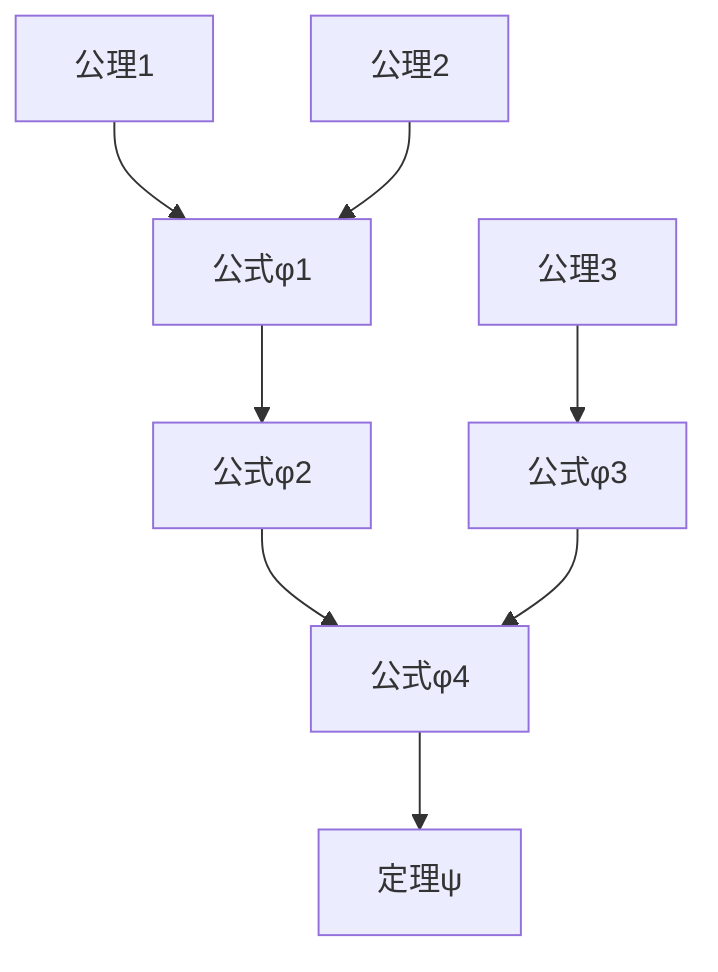

这种图形表示揭示了证明的层次结构和逻辑依赖关系，有助于理解复杂证明的整体架构。

### 形式语言的层次结构与表达能力

乔姆斯基谱系提供了一个理解形式语言表达能力的层次框架，它将形式语言按照生成能力和计算复杂性分为四个层次：

**定理 1.1**（乔姆斯基层次结构）：形式语言可以按照其文法的限制程度分为以下四类，构成严格的包含关系：

1. 3型语言（正则语言）⊂ 2型语言（上下文无关语言）⊂ 1型语言（上下文相关语言）⊂ 0型语言（递归可枚举语言）

每个语言类型对应特定的文法规则限制和识别装置：

| 语言类型 | 文法规则限制 | 识别装置 | 时间复杂度 | 空间复杂度 |
|---------|------------|---------|----------|----------|
| 0型语言 | 无限制 | 图灵机 | 不可预测 | 不可预测 |
| 1型语言 | $\alpha A \beta \rightarrow \alpha \gamma \beta$，$\gamma \neq \varepsilon$ | 线性有界自动机 | 指数级 | 线性 |
| 2型语言 | $A \rightarrow \gamma$，$A \in V$ | 下推自动机 | 多项式 | 线性 |
| 3型语言 | $A \rightarrow aB$ 或 $A \rightarrow a$，$A,B \in V$，$a \in \Sigma$ | 有限状态自动机 | 线性 | 常数 |

表达能力与计算复杂性之间存在根本的权衡关系，这一关系可以通过以下定理形式化：

**定理 1.2**（表达能力-复杂性权衡）：如果语言类别 $L_1$ 严格包含语言类别 $L_2$，则存在 $L_1$ 中的语言，其识别问题的计算复杂性严格高于 $L_2$ 中任何语言的识别问题。

这一层次结构不仅是形式语言理论的核心，也反映了计算复杂性的本质层级，揭示了表达能力与计算资源之间的根本关系。

## 形式语言的认知结构与隐喻基础

### 认知表征的多模态性

形式语言与人类认知的关系远比传统观点复杂。
将认知表征直接等同于形式语言面临着过度简化的风险，因为人类的知识和思维具有多模态性：

**定义 2.1**（认知表征的多模态性）：人类认知表征是多种表征模式的综合，包括但不限于：

- **命题表征**：以符号和逻辑关系为基础的表征
- **图像表征**：基于视觉空间特性的心像表征
- **感知符号表征**：将概念植根于感知运动系统的模拟
- **情感表征**：包含情绪评价成分的表征
- **身体表征**：通过身体状态和动作编码的知识

实证研究表明，即使在形式推理过程中，人类也同时激活多种表征模式：

1. **神经影像研究**：数学思考同时激活负责语言、视觉空间和运动的脑区
2. **眼动追踪**：解题过程中的眼动模式显示视觉表征的重要作用
3. **手势研究**：数学家在解释抽象概念时常使用手势，表明身体表征的参与

这种多模态性挑战了形式语言作为唯一或主导认知模型的地位，表明人类思维的丰富性超出了纯符号操作的范围。

### 形式语言的隐喻系统

尽管形式语言追求严格性和精确性，但隐喻在其发展和理解中扮演着核心角色。
莱考夫和努涅兹的研究表明，即使是最抽象的数学概念也依赖于人类的认知结构和隐喻系统。

**定义 2.2**（概念隐喻）：概念隐喻是一种认知机制，通过将一个概念域（源域）的结构映射到另一个概念域（目标域），使我们能够理解抽象概念。

形式语言中的核心隐喻包括：

1. **容器隐喻**：将集合概念化为容器，元素为容器内的对象
   - 形式表达：$x \in A$ 隐喻为"x在容器A内"
   - 子集关系 $A \subseteq B$ 隐喻为"容器A在容器B内"

2. **路径隐喻**：将函数概念化为从一点到另一点的路径或映射
   - 形式表达：$f: A \rightarrow B$ 隐喻为"从A到B的路径"
   - 函数复合 $g \circ f$ 隐喻为"先沿路径f再沿路径g"

3. **构建隐喻**：将复杂数学结构概念化为由基本部件构建的实体
   - 形式表达：归纳定义隐喻为"从基础情况开始构建"
   - 递归结构隐喻为"自我包含的构建"

4. **空间隐喻**：将抽象关系概念化为空间关系
   - 形式表达：序关系 $a < b$ 隐喻为"a在b的左边/下方"
   - 拓扑概念如"开集"、"闭集"隐喻为空间区域的特性

这些隐喻的系统性可以通过以下定理来表征：

**定理 2.1**（隐喻系统性）：如果概念隐喻 $M$ 将源域 $S$ 映射到目标域 $T$，则 $S$ 中的推理模式将保持其结构地映射到 $T$ 中的对应推理模式。

形式化表示：若 $M: S \rightarrow T$ 是概念隐喻，且 $R_S$ 是 $S$ 中的推理规则，则存在 $T$ 中对应的推理规则 $R_T$，使得 $M(R_S(x)) = R_T(M(x))$。

这种隐喻系统性解释了为什么形式推理能够借助直觉和具体经验，也揭示了形式语言与具身认知的深层联系。

### 抽象与具象的认知转换机制

形式语言的使用涉及抽象与具象之间的不断转换，这一过程可以通过认知转换机制来理解：

**定义 2.3**（认知转换）：认知转换是指在不同表征层次或模态之间转换信息的认知过程，包括抽象化（从具体到抽象）和具体化（从抽象到具体）。

形式语言使用中的认知转换可以形式化为以下过程：

```math
\text{具体问题} \xrightarrow{\text{抽象化}} \text{形式表示} \xrightarrow{\text{形式操作}} \text{形式结果} \xrightarrow{\text{具体化}} \text{具体解释}
```

这一过程可以通过以下图示更直观地表示：


认知转换的有效性依赖于抽象化函数 $\phi$ 和具体化函数 $\psi$ 的性质，理想情况下应满足：

**定理 2.2**（认知转换保真性）：对于有效的认知转换，应满足 $\psi(\phi(x)) \approx x$，即通过抽象化再具体化后得到的结果应与原始问题在相关方面等价。

然而，实际认知过程中常常存在信息损失，导致 $\psi(\phi(x)) \neq x$，这解释了为什么形式模型有时无法完全捕捉现实问题的复杂性。

### 形式思维的神经认知基础

形式思维的神经认知基础研究揭示了形式语言处理的大脑机制，为理解形式语言与认知的关系提供了生物学视角。

**定义 2.4**（神经认知基础）：形式思维的神经认知基础是指支持形式语言处理和形式推理的神经网络结构和认知过程。

形式思维涉及的关键脑区及其功能：

1. **前额叶皮层**：负责执行控制、工作记忆和抽象思维
   - 背外侧前额叶皮层（DLPFC）：维持形式规则和抽象表征
   - 前扣带回皮层（ACC）：错误检测和认知冲突监控

2. **顶叶区域**：处理空间关系和数量表征
   - 顶内沟（IPS）：数量处理和空间注意
   - 角回（AG）：符号与意义的整合

3. **颞叶区域**：语义处理和概念知识
   - 左侧颞叶：语言符号处理
   - 梭状回：视觉符号识别

4. **基底神经节和小脑**：程序化知识和自动化处理
   - 支持形式规则的自动化应用
   - 减轻认知负荷

神经影像研究表明，形式思维的发展涉及从依赖具体表征到抽象表征的转变，这一过程可以通过以下模型描述：

**模型 2.1**（形式思维的神经发展模型）：形式思维能力的发展经历三个阶段：

1. **具体依赖阶段**：主要激活感知运动区域和具体概念表征区域
2. **过渡阶段**：同时激活具体表征区域和抽象表征区域
3. **抽象独立阶段**：主要激活前额叶和顶叶的抽象表征区域

这一模型解释了为什么形式思维的获得需要长期训练，也揭示了形式语言与具体经验之间的神经联系。

## 形式语言的哲学思想脉络

### 古典逻辑传统：从亚里士多德到莱布尼茨

形式语言的哲学根源可以追溯到古希腊的逻辑传统，经历了漫长的发展历程。

**定义 3.1**（逻辑传统）：逻辑传统是指关于推理形式、有效性和真理条件的系统性思想发展，构成了形式语言的哲学基础。

古典逻辑传统的关键发展阶段：

1. **亚里士多德的三段论**（公元前4世纪）
   - 首次系统化研究演绎推理的形式结构
   - 引入了术语、命题和三段论的概念
   - 形式化表示：若所有M是P，且所有S是M，则所有S是P

2. **斯多葛学派的命题逻辑**（公元前3-1世纪）
   - 发展了命题逻辑的基本概念
   - 引入了条件句和析取的形式分析
   - 提出了五种基本推理模式（无法证明的命题）

3. **中世纪逻辑发展**（5-15世纪）
   - 奥卡姆的威廉提出了"奥卡姆剃刀"原则
   - 发展了术语逻辑和后果理论
   - 探讨了模态逻辑和未来偶然事件的逻辑

4. **莱布尼茨的普遍特征语言**（17世纪）
   - 设想创造一种普遍的符号系统（characteristica universalis）
   - 提出了"普遍演算"（calculus ratiocinator）的概念
   - 预见了形式逻辑和计算机科学的发展

莱布尼茨的思想对形式语言发展具有深远影响，他的核心理念可以概括为：

**定理 3.1**（莱布尼茨原则）：如果能够创造一种完美的符号系统，使得：

1. 每个基本概念都有唯一的符号表示
2. 复杂概念通过基本概念的组合表示
3. 推理规则对应于符号操作规则

则所有争论都可以通过计算解决："让我们计算"（Calculemus）。

这一原则虽然后来被证明是不可实现的（通过哥德尔定理等），但它奠定了形式语言发展的哲学基础，影响了后续的逻辑学和数学基础研究。

### 逻辑实证主义与形式语言

20世纪初，逻辑实证主义运动将形式语言视为科学知识的理想表达方式，对形式语言的哲学理解产生了深远影响。

**定义 3.2**（逻辑实证主义）：逻辑实证主义是一种哲学立场，主张科学知识应当通过逻辑分析和经验验证来确立，而形而上学命题因无法验证而被视为无意义。

维也纳学派的核心思想包括：

1. **验证原则**：有意义的陈述必须是可经验验证的或分析性的
   - 形式表达：命题P有意义 ⟺ P是可验证的或P是分析性的

2. **统一科学理想**：所有科学最终可以归约为物理学语言
   - 形式表达：存在映射f，使得对任意科学理论T，f(T)是物理学语言的表达

3. **理想语言观**：科学应当使用精确的形式语言，消除自然语言的模糊性
   - 卡尔纳普的"逻辑句法"项目试图形式化科学语言
   - 塔尔斯基的真理理论为形式语义学奠定基础

逻辑实证主义对形式语言的贡献可以总结为以下定理：

**定理 3.2**（逻辑实证主义的形式语言观）：科学知识的理想表达形式应满足：

1. 语法明确性：每个表达式的语法结构是唯一确定的
2. 语义明确性：每个表达式的真值条件是明确定义的
3. 验证可能性：每个有意义的表达式原则上可以通过经验或逻辑方法验证

然而，
然而，这种极端形式主义的立场最终面临了严峻挑战，尤其是来自哥德尔不完备定理、维特根斯坦后期思想和科学实践的批判。逻辑实证主义对形式语言的理解虽然过于理想化，但它促进了形式语义学和科学哲学的发展，为形式语言研究提供了重要的哲学背景。

### 维特根斯坦的语言哲学转向

维特根斯坦的思想经历了从《逻辑哲学论》到《哲学研究》的重大转变，这一转变深刻改变了对形式语言本质的理解。

**定义 3.3**（语言哲学转向）：语言哲学转向是指20世纪哲学从关注认识论和形而上学问题转向对语言本质和功能的分析，维特根斯坦的思想转变是这一转向的典范。

维特根斯坦思想的两个阶段及其对形式语言的影响：

1. **早期维特根斯坦**（《逻辑哲学论》，1921）
   - **图像理论**：语言是世界的逻辑图像
     - 形式表达：存在同构映射 f: 语言 → 世界，使得语言结构反映世界结构
   - **逻辑原子主义**：世界由原子事实构成，语言由原子命题构成
   - **形式语言观**：理想语言应当反映世界的逻辑形式，消除歧义

2. **后期维特根斯坦**（《哲学研究》，1953）
   - **语言游戏理论**：语言是多种多样的活动或"游戏"的集合
     - 形式表达：语言 = {G₁, G₂, ..., Gₙ}，其中每个Gᵢ是一种语言游戏
   - **家族相似性**：概念边界模糊，通过"家族相似性"而非严格定义联系
   - **规则遵循**：语言使用基于社会实践和生活形式，而非形式规则

这一转变可以通过以下定理来概括：

**定理 3.3**（维特根斯坦的语言观转变）：从早期到后期，维特根斯坦对语言的理解发生了根本转变：

1. 早期：语言 = 形式结构 + 映射关系（语言-世界）
2. 后期：语言 = 社会实践 + 使用规则（语言游戏）

后期维特根斯坦的思想对形式语言构成了深刻挑战，表明形式语言只是众多语言游戏中的一种特殊类型，其意义不在于映射某种独立的逻辑实在，而在于其特定的使用方式和社会功能。

### 后现代主义对形式语言的批判

后现代主义思潮对形式语言的普遍性、客观性和中立性提出了系统性挑战，从权力、历史和文化的角度重新审视形式语言。

**定义 3.4**（后现代主义批判）：后现代主义批判是指对形式语言及其背后的理性主义、普遍主义和客观主义假设的质疑，强调知识的语境性、权力关系和多元视角。

后现代主义对形式语言的主要批判包括：

1. **德里达的解构主义**
   - 质疑逻各斯中心主义（logocentrism）和在场形而上学
   - 强调文本的多重解读可能性和意义的不确定性
   - 形式表达：对任何形式系统S，存在多种不同但同样有效的解读{I₁, I₂, ..., Iₙ}

2. **福柯的知识考古学和权力分析**
   - 揭示知识与权力的内在联系
   - 分析形式语言作为话语实践的历史条件
   - 形式表达：知识K = f(权力关系P, 历史条件H)

3. **利奥塔对元叙事的批判**
   - 质疑科学和形式系统作为普遍合法性来源的地位
   - 提出"小叙事"的多元主义立场
   - 形式表达：不存在单一元叙事M使得所有知识体系都可以通过M合法化

4. **罗蒂的实用主义转向**
   - 反对将形式语言视为"自然之镜"
   - 强调语言的工具性和对话性质
   - 形式表达：语言价值V = f(实用效果U)，而非f(对应真理C)

这些批判可以通过以下定理概括：

**定理 3.4**（后现代主义的形式语言批判）：形式语言不是中立的、普遍的认知工具，而是：

1. 嵌入特定历史文化语境的产物
2. 隐含特定权力关系和价值取向
3. 仅代表众多可能的知识表达方式之一
4. 其合法性基于特定社会实践而非普遍理性

后现代主义批判虽然有时走向极端，但它提醒我们关注形式语言的社会历史维度，避免将形式语言绝对化或普遍化。

## 形式语言的自洽性与完备性分析

### 哥德尔定理的严格证明与隐喻内涵

哥德尔不完备定理是20世纪数学基础研究中最具震撼力的成果之一，它对形式语言的自洽性和完备性提出了根本挑战。

**定理 4.1**（哥德尔第一不完备定理）：任何包含基本算术的一致的形式公理系统F中，存在一个命题G，使得G在F中既不能被证明，也不能被反驳。

形式表达：若形式系统F是一致的且足够强大（包含基本算术），则存在命题G，使得F⊬G且F⊬¬G。

**定理 4.2**（哥德尔第二不完备定理）：如果形式系统F是一致的且足够强大，则F不能证明自身的一致性。

形式表达：若Con(F)表示"F是一致的"的形式化表达，则F⊬Con(F)。

哥德尔定理的严格证明涉及几个关键步骤：

1. **算术化**：将形式系统中的符号、公式和证明编码为自然数（哥德尔编码）
   - 每个符号赋予唯一的自然数编码
   - 公式编码为其符号编码的序列
   - 证明编码为公式编码的序列

2. **表达性**：证明足够强的形式系统能够表达关于自身语法的陈述
   - 定义表示可证性的谓词Prov(x)
   - 证明算术关系的可表达性

3. **对角化**：构造一个命题G，它等价于"G不可证明"
   - 使用对角引理构造命题G，使得G ⟷ ¬Prov(⌜G⌝)
   - 其中⌜G⌝是G的哥德尔编码

4. **不可证明性**：证明G在系统中既不能被证明也不能被反驳
   - 若F⊢G，则F⊢¬Prov(⌜G⌝)，但由于G可证，F⊢Prov(⌜G⌝)，导致矛盾
   - 若F⊢¬G，则F⊢Prov(⌜G⌝)，但¬G可证意味着G不可证，导致矛盾

哥德尔定理具有丰富的隐喻内涵，可以从多个层面解读：

1. **数学哲学层面**：挑战了希尔伯特纲领和形式主义的数学基础方案
2. **认知层面**：暗示人类思维可能超越任何特定形式系统的局限
3. **哲学层面**：关于真理、证明和知识本质的深刻启示
4. **系统论层面**：关于自指系统内在限制的普遍原理

这些多层次解读使哥德尔定理成为连接数学、哲学和认知科学的桥梁，展示了形式语言研究的深远意义。

### 一致性与完备性的形式化定义

形式系统的一致性和完备性是评估其理论基础的关键标准，需要给予严格的形式化定义。

**定义 4.1**（语法一致性）：形式系统F是语法一致的，当且仅当不存在公式φ，使得F既能证明φ又能证明¬φ。

形式表达：Con(F) ⟺ ¬∃φ(F⊢φ ∧ F⊢¬φ)

**定义 4.2**（语义一致性）：形式系统F是语义一致的，当且仅当F的所有定理在F的标准模型中都为真。

形式表达：Con_sem(F) ⟺ ∀φ(F⊢φ → M⊨φ)，其中M是F的标准模型

**定义 4.3**（语法完备性）：形式系统F是语法完备的，当且仅当对于任何公式φ，要么F⊢φ，要么F⊢¬φ。

形式表达：Comp(F) ⟺ ∀φ(F⊢φ ∨ F⊢¬φ)

**定义 4.4**（语义完备性）：形式系统F是语义完备的，当且仅当F的标准模型中的所有真命题都是F的定理。

形式表达：Comp_sem(F) ⟺ ∀φ(M⊨φ → F⊢φ)，其中M是F的标准模型

一致性与完备性之间存在复杂的关系，可以通过以下定理阐明：

**定理 4.3**（哥德尔完备性定理）：对于一阶逻辑，语法一致性等价于语义一致性，且语法完备性等价于语义完备性。

形式表达：对于一阶逻辑系统F，Con(F) ⟺ Con_sem(F)且Comp(F) ⟺ Comp_sem(F)

**定理 4.4**（一致性与完备性的权衡）：对于包含基本算术的形式系统F，如果F是一致的，则F不是完备的。

形式表达：Con(F) → ¬Comp(F)

这些形式化定义和定理揭示了形式系统的基本性质和内在限制，构成了形式语言理论的核心内容。

### 不可判定性问题与图灵停机问题

不可判定性问题是形式语言理论中的核心问题，它揭示了算法方法的根本限制。

**定义 4.5**（判定问题）：判定问题是要求对于给定的输入，确定其是否满足特定性质的问题。形式上，判定问题P可以表示为集合P = {x | x具有特定性质}，问题是确定任意给定的x是否属于P。

**定义 4.6**（可判定性）：如果存在一个算法（图灵机），对于任何输入，都能在有限步骤内确定该输入是否属于集合P，则称判定问题P是可判定的。

图灵停机问题是最著名的不可判定问题之一：

**定理 4.5**（图灵停机问题的不可判定性）：不存在算法能够判定任意给定的图灵机M和输入x，M在输入x上是否会停机。

形式证明概要：

1. 假设存在停机判定器H，它能判定任意图灵机M在输入x上是否停机
2. 构造一个特殊的图灵机D，它接受输入`<M>`（图灵机M的编码）
3. D的行为：使用H判断M在输入`<M>`上是否停机；如果停机则进入无限循环，否则停机
4. 考虑D在输入`<D>`上的行为，导出矛盾：
   - 若`D(<D>)`停机，则根据D的定义，`D(<D>)`不应停机
   - 若`D(<D>)`不停机，则根据D的定义，`D(<D>)`应该停机

图灵停机问题与哥德尔不完备定理之间存在深刻联系：

**定理 4.6**（停机问题与不完备性）：如果停机问题可判定，则任何包含基本算术的一致形式系统都是可判定的，这与哥德尔不完备定理矛盾。

不可判定性结果对形式语言的影响深远，表明了形式方法的内在局限：

1. 存在原则上无法通过算法解决的问题
2. 形式验证和程序分析面临根本限制
3. 某些数学问题可能没有算法解决方案

这些结果揭示了计算与证明的本质边界，是理解形式语言局限性的关键。

### 形式系统的元数学性质

元数学研究形式系统本身的性质，包括一致性、完备性、可判定性等，这些性质构成了评估形式语言的基本标准。

**定义 4.7**（元数学）：元数学是研究形式数学系统的数学理论，包括对形式系统的语法、语义和证明论性质的分析。

形式系统的关键元数学性质包括：

1. **一致性**（Consistency）：系统不能证明矛盾
2. **完备性**（Completeness）：所有真命题都可被证明
3. **可判定性**（Decidability）：存在算法判定任意命题是否可证
4. **表达力**（Expressiveness）：系统能够表达的概念范围
5. **独立性**（Independence）：某些公理不能从其他公理导出
6. **范畴性**（Categoricity）：系统的所有模型在同构意义下等价

这些性质之间存在复杂的相互关系，可以通过以下定理阐明：

**定理 4.7**（表达力与可判定性的权衡）：如果形式系统F₁的表达力严格强于形式系统F₂，且F₂是不可判定的，则F₁也是不可判定的。

**定理 4.8**（范畴性与完备性的关系）：如果一阶形式系统F是范畴的，则F是完备的。

下表比较了几个重要形式系统的元数学性质：

| 形式系统 | 一致性 | 完备性 | 可判定性 | 范畴性 |
|---------|-------|-------|---------|-------|
| 命题逻辑 | 是 | 是 | 是 | 否 |
| 一阶谓词逻辑 | 是 | 是（哥德尔完备性定理） | 否 | 否 |
| 皮亚诺算术 | 是（假设） | 否（哥德尔不完备定理） | 否 | 否 |
| ZFC集合论 | 未知 | 否 | 否 | 否 |
| 欧几里得几何 | 是 | 是 | 是 | 是 |

元数学研究不仅揭示了形式系统的内在性质，也为理解形式语言的优势和局限提供了理论基础。
通过元数学分析，我们可以确定形式语言适用的领域边界和理论限制，避免对形式方法的过度期望。

## 形式语言的多层次表征系统

### 语法、语义与语用层次

形式语言的表征系统可以分为三个相互关联但概念上不同的层次：语法、语义和语用。

**定义 5.1**（语法层次）：语法层次关注符号的形式结构和组合规则，不涉及意义。

语法层次的关键组成部分：

- **字母表**：基本符号的有限集合
- **形成规则**：定义合式公式的递归规则
- **推导规则**：规定如何从已有公式生成新公式
- **证明结构**：公式之间的形式推导关系

**定义 5.2**（语义层次）：语义层次关注符号与其所指对象之间的关系，定义了表达式的意义和真值条件。

语义层次的关键组成部分：

- **模型理论**：通过数学结构解释形式语言
- **真值条件**：定义表达式在给定模型中的真假
- **指称关系**：符号与其所指对象的映射
- **满足关系**：模型满足公式的条件

**定义 5.3**（语用层次）：语用层次关注形式语言在特定语境中的使用方式和效果。

语用层次的关键组成部分：

- **使用语境**：形式语言应用的具体情境
- **交际目的**：形式表达的意图和功能
- **推理实践**：形式系统在实际推理中的应用
- **认知效应**：形式表达对理解和思维的影响

这三个层次之间的关系可以通过以下图示表示：

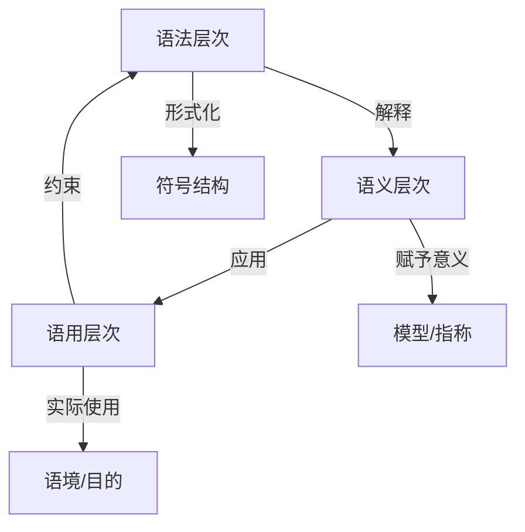

三个层次的整合对理解形式语言至关重要，可以通过以下定理表述：

**定理 5.1**（表征层次整合原则）：完整的形式语言理解需要整合三个表征层次：

1. 语法确保表达的形式正确性
2. 语义确保表达的意义明确性
3. 语用确保表达的适用有效性

这种多层次表征视角超越了传统仅关注语法和语义的形式语言观，将形式语言置于更广阔的认知和交际语境中。

### 符号、模型与认知表征

形式语言的表征系统涉及三种相互关联的表征类型：符号表征、模型表征和认知表征。

**定义 5.4**（符号表征）：符号表征是通过形式符号及其组合来表示概念和关系的系统。

符号表征的特征：

- **离散性**：由分立的符号单元组成
- **组合性**：通过符号组合表达复杂含义
- **规则性**：遵循明确的语法规则
- **抽象性**：符号与其表示对象之间的关系是约定的

**定义 5.5**（模型表征）：模型表征是通过数学结构来解释形式语言的系统，为符号提供语义内容。

模型表征的特征：

- **结构性**：包含对象集合及其之间的关系
- **解释性**：为形式语言中的符号赋予具体含义
- **真值确定性**：决定形式表达式的真假
- **同构潜力**：可能与其他模型在结构上等价

**定义 5.6**（认知表征）：认知表征是人类心智中对形式语言的内部表示和处理方式。

认知表征的特征：

- **多模态性**：结合符号、视觉、空间等多种表征模式
- **情境敏感性**：受认知语境和背景知识影响
- **负荷限制**：受工作记忆和注意力资源限制
- **隐喻基础**：通常基于具体经验的隐喻理解

这三种表征类型之间的关系可以通过以下模型描述：

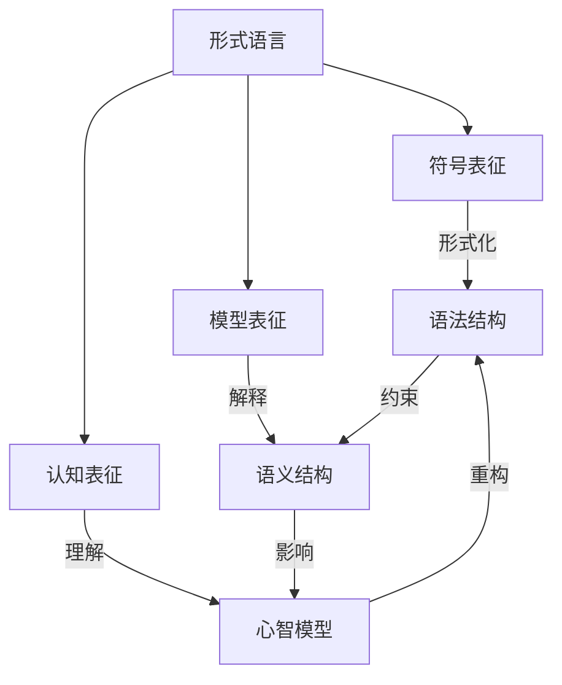

三种表征类型的整合对形式语言的有效使用至关重要：

**定理 5.2**（表征整合原则）：形式语言的有效使用需要整合三种表征类型：

1. 符号表征确保形式操作的精确性
2. 模型表征确保语义解释的一致性
3. 认知表征确保人类理解的可能性

这种多元表征视角揭示了形式语言不仅是抽象符号系统，也是复杂的认知工具和意义构建机制。

### 形式表征与非形式表征的互补性

形式表征和非形式表征在人类认知中扮演互补角色，两者的结合对全面理解概念和解决问题至关重要。

**定义 5.7**（形式表征）：形式表征是通过严格定义的符号系统和规则进行的表征，强调精确性、一致性和形式操作。

形式表征的特点：

- **精确性**：消除歧义和模糊性
- **系统性**：遵循明确的规则和结构
- **抽象性**：脱离具体情境的普遍表达
- **可计算性**：适合算法处理和形式推导

**定义 5.8**（非形式表征）：非形式表征是通过直觉、图像、隐喻、叙事等方式进行的表征，强调直观性、整体性和情境理解。

非形式表征的特点：

- **直观性**：易于直接把握和理解
- **整体性**：捕捉整体模式和关系
- **情境敏感性**：与具体语境紧密联系
- **隐喻丰富性**：利用已知领域理解新概念

形式表征和非形式表征之间存在复杂的互补关系：

**定理 5.3**（表征互补性原则）：形式表征和非形式表征在认知过程中相互补充，各有优势和局限：

1. 形式表征优于非形式表征的方面：精确推理、一致性检验、复杂关系的系统化表达
2. 非形式表征优于形式表征的方面：直观理解、创造性思维、整体把握、情境适应

这种互补性在数学思维中尤为明显：


数学家的实际工作过程通常涉及形式和非形式表征的交替使用：

1. 通过直觉和隐喻获得初步洞察
2. 将洞察转化为形式表达
3. 在形式系统中进行严格推导
4. 将形式结果重新解释为直观理解
5. 基于新理解拓展或修正直觉

**定理 5.4**（表征转换效率）：专家与新手的区别之一在于能否高效地在形式表征和非形式表征之间转换，保持两种表征的一致性和互补性。

认识到形式表征和非形式表征的互补性，有助于我们避免将形式语言绝对化，同时也能更有效地利用形式语言作为认知工具。

### 表征转换的认知机制

表征转换是指在不同表征系统或模态之间转换信息的认知过程，这一过程对于形式语言的学习和应用至关重要。

**定义 5.9**（表征转换）：表征转换是将信息从一种表征形式转换为另一种表征形式的认知过程，同时保持关键信息和结构。

表征转换的主要类型：

1. **形式化转换**：从非形式表征到形式表征
   - 例：将文字问题转换为代数方程
   - 认知挑战：识别关键变量和关系，选择适当的形式结构

2. **具体化转换**：从形式表征到具体表征
   - 例：将数学公式转换为图形表示
   - 认知挑战：为抽象符号找到合适的具体对应物

3. **跨模态转换**：在不同感知或概念模态之间转换
   - 例：将视觉表征转换为代数表征
   - 认知挑战：识别不同模态中的结构对应关系

4. **层次转换**：在同一表征系统的不同抽象层次之间转换
   - 例：在微分方程和其解之间转换
   - 认知挑战：理解不同抽象层次之间的关系

表征转换的认知机制可以通过以下模型描述：

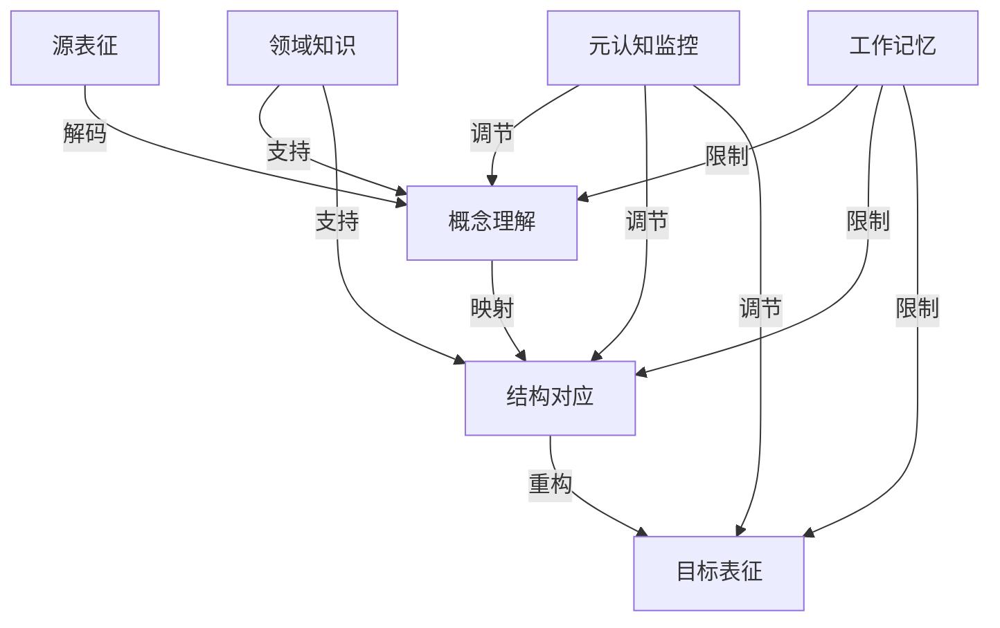

表征转换的有效性可以通过以下定理表征：

**定理 5.5**（表征转换保真性）：成功的表征转换应保持关键信息和结构不变，即存在同构或近似同构映射f，使得目标表征T = f(源表征S)，且f保持S中的关键关系。

表征转换能力的发展是形式思维能
表征转换能力的发展是形式思维能力发展的关键，可以通过以下发展阶段模型描述：

**模型 5.1**（表征转换能力发展模型）：

1. **初始阶段**：表征转换受限于表面特征，难以识别深层结构
2. **过渡阶段**：能够在熟悉领域实现表征转换，但需要显式指导
3. **熟练阶段**：能够自主识别结构对应关系，在多种表征间灵活转换
4. **专家阶段**：表征转换变得自动化，能够创造性地建立新的表征映射

研究表明，表征转换能力是数学和科学成就的重要预测因素，也是形式语言教育中应当重点培养的能力。通过理解表征转换的认知机制，我们可以设计更有效的教学策略，帮助学习者掌握形式语言。

## 形式语言的社会文化维度

### 形式语言的权力结构分析

形式语言不仅是中立的工具，也是权力与知识交织的场域。从批判理论视角看，形式语言具有深刻的政治维度。

**定义 6.1**（知识-权力关系）：知识-权力关系是指知识生产、传播和应用过程中蕴含的权力结构和社会关系，包括谁有权定义知识、谁能获取知识以及知识如何影响社会结构。

形式语言中的权力结构表现在以下方面：

1. **知识垄断**：形式语言的复杂性可能成为知识垄断的工具
   - 专业术语和形式化障碍限制非专业人士参与
   - 形式知识的获取需要特定教育背景和资源
   - 形式表达的解码能力成为社会分层的标志

2. **合法性建构**：形式化常被用作赋予特定知识主张以权威性的手段
   - 数学形式化作为科学合法性的标志
   - 形式模型在政策制定中的权威地位
   - "严格证明"作为知识层级的顶端

3. **排除机制**：对形式语言的强调可能系统性地排除某些思维方式和知识传统
   - 非形式知识体系的边缘化
   - 特定社会群体的认知风格被系统性贬低
   - 知识的"客观性"掩盖了其社会建构性

4. **技术统治**：形式语言在技术社会中的核心地位强化了技术专家的权力
   - 算法和形式系统作为治理工具
   - 技术决定论与形式思维的联系
   - 数据化和量化对社会生活的渗透

这些权力结构可以通过以下模型来分析：

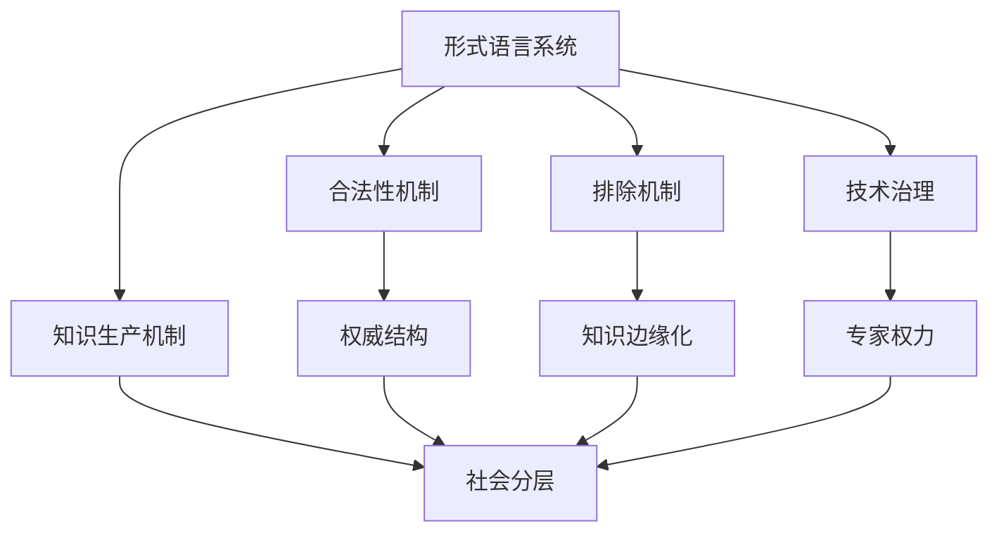

批判性分析并不意味着完全否定形式语言的价值，而是呼吁我们认识到：

**定理 6.1**（形式语言的社会嵌入性）：形式语言不是中立的、去语境的工具，而是嵌入特定社会历史语境的知识-权力系统，其发展和应用反映并强化了特定的社会关系和权力结构。

这种批判视角有助于我们更全面地理解形式语言，避免将其神秘化或绝对化，同时也为形式语言的民主化和多元化提供了理论基础。

### 文化多样性与形式思维

形式思维方式在不同文化传统中的表现和地位存在显著差异，这些差异反映了认知多样性和知识生产的文化特性。

**定义 6.2**（文化认知风格）：文化认知风格是指特定文化传统中占主导地位的思维方式、知识组织和推理模式，包括对形式与非形式思维的相对重视程度。

不同文化传统中的形式思维特点：

1. **西方传统**
   - 从古希腊几何到现代形式逻辑，形式化思维占据核心地位
   - 强调分析性、还原论和二元对立
   - 追求普遍性和抽象性
   - 代表性形式系统：欧几里得几何、亚里士多德逻辑、现代数理逻辑

2. **东亚传统**
   - 更强调整体性、关系性思维和辩证法
   - 形式逻辑地位相对次要，但有独特的形式思维传统
   - 重视语境和实用性
   - 代表性形式系统：古代算术传统、《九章算术》、理气系统

3. **印度传统**
   - 发展了独特的形式逻辑系统（如因明学）
   - 形式推理与宗教哲学紧密结合
   - 重视语言分析和辩论方法
   - 代表性形式系统：因明学、梵语语法学、数学传统

4. **伊斯兰传统**
   - 综合希腊和印度的形式思维传统
   - 发展了代数和算法的早期形式
   - 形式推理与宗教解释学的结合
   - 代表性形式系统：代数学、天文计算、伊斯兰法学方法论

5. **原住民知识系统**
   - 强调情境化、叙事性和生态关联性知识
   - 形式知识嵌入实践和口头传统
   - 重视具体经验和整体关联
   - 代表性知识形式：导航系统、分类体系、生态知识

这些文化差异可以通过以下维度来比较：

| 文化传统 | 抽象-具体倾向 | 分析-整体倾向 | 形式-叙事倾向 | 普遍-情境倾向 |
|---------|-------------|-------------|-------------|-------------|
| 西方传统 | 抽象 | 分析 | 形式 | 普遍 |
| 东亚传统 | 中间 | 整体 | 中间 | 情境 |
| 印度传统 | 抽象 | 中间 | 形式 | 中间 |
| 伊斯兰传统 | 中间 | 分析 | 中间 | 中间 |
| 原住民传统 | 具体 | 整体 | 叙事 | 情境 |

这些差异提醒我们：

**定理 6.2**（认知多样性原则）：形式语言只是人类认知多样性的一种表现，而非普遍的、文化中立的思维方式。不同文化传统发展了各自的知识系统和推理方式，这些系统在特定语境中具有同等的认知价值和适应性。

认识文化多样性有助于我们避免认知帝国主义，同时也为形式语言的发展提供了新的灵感和视角。

### 形式语言的性别与多元视角

女性主义和多元文化主义对形式语言提出了重要批判，揭示了形式思维传统中的性别和文化偏见。

**定义 6.3**（情境知识）：情境知识是指植根于特定社会位置、身体经验和历史语境的知识，强调知识的部分性、情境性和身体性，与声称普遍客观的"无处立足的知识"相对。

女性主义对形式语言的批判包括：

1. **性别化的二元对立**
   - 理性/情感、抽象/具体、客观/主观等二元对立与性别刻板印象相关
   - 形式思维与"阳性"特质关联，非形式思维与"阴性"特质关联
   - 这种二元对立导致对某些认知方式的系统性贬低

2. **抽象的身体政治**
   - 形式语言强调"纯粹理性"，否认身体和情感的认知作用
   - "无处立足的视角"掩盖了知识生产的具体社会位置
   - 抽象性作为特权标志的政治功能

3. **知识生产的性别政治**
   - 形式学科中的性别不平等和排斥机制
   - 女性在形式学科中的贡献被系统性忽视
   - 形式语言教育中的隐性性别偏见

多元文化主义的批判进一步拓展了这些视角：

1. **知识的文化政治**
   - 西方形式思维传统被普遍化为"理性"本身
   - 非西方知识传统被边缘化为"前科学"或"民族科学"
   - 形式/非形式二元对立与殖民话语的联系

2. **多元认识论**
   - 不同社会群体基于其特定经验可能发展出不同的认知方式
   - 边缘群体的"认识论优势"可能提供独特视角
   - 知识民主化需要承认多种知识形式的合法性

这些批判可以通过以下模型来理解：

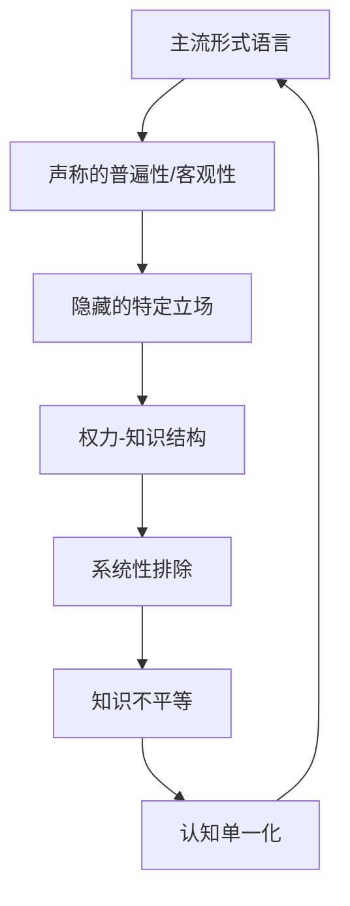

这些批判不是要否定形式语言的价值，而是呼吁更包容的认识论：

**定理 6.3**（认识论多元主义）：完整的知识生态需要承认多种知识形式的合法性和互补性，包括：

1. 形式知识与非形式知识
2. 抽象思维与具体思维
3. 普遍性追求与情境敏感性
4. 分析方法与整体方法

这种多元主义立场避免了相对主义的陷阱，同时也避免了将特定知识形式绝对化的倾向，为形式语言研究提供了更加开放和反思性的框架。

### 形式语言作为文化资本

从社会学视角看，形式语言能力构成了重要的文化资本，在社会再生产和阶层流动中发挥着关键作用。

**定义 6.4**（文化资本）：文化资本是指个体通过社会化和教育获得的知识、技能、教育资格和品味倾向，这些资本可以转化为社会优势和经济利益。

形式语言作为文化资本的表现：

1. **制度化文化资本**
   - 数学和逻辑能力在教育评估中的核心地位
   - 形式学科学位的社会认可和市场价值
   - 形式知识作为专业资格的基础

2. **具身文化资本**
   - 形式思维能力作为"自然天赋"的社会建构
   - 形式语言使用的习惯化和内化
   - 对形式美学（如数学优雅性）的鉴赏能力

3. **客观化文化资本**
   - 形式知识的物化形式（书籍、工具、符号）
   - 形式语言作为文化象征和身份标志
   - 科技产品作为形式知识的物质体现

形式语言作为文化资本的社会功能：

1. **社会区分**：形式语言能力作为区分不同社会群体的标志
2. **合法化**：形式知识为社会不平等提供看似中立的合法化机制
3. **再生产**：形式教育系统复制和强化现有社会结构
4. **转换**：形式语言能力可转换为其他形式的资本（经济、社会）

这些功能可以通过以下模型来理解：

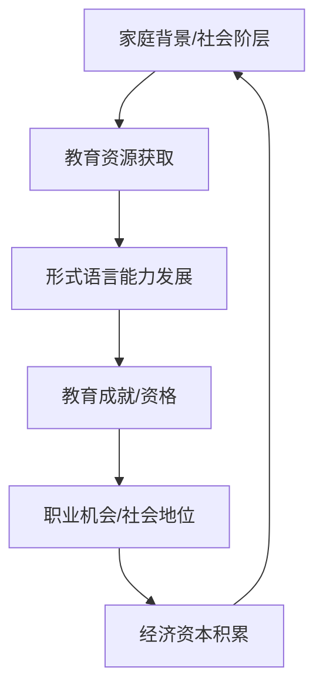

形式语言的社会学分析揭示了：

**定理 6.4**（形式语言的社会再生产功能）：形式语言不仅是认知工具，也是社会分层和再生产的机制。形式语言教育表面上基于能力和成就，实际上常常强化现有的社会不平等，因为形式语言能力的获得深受家庭背景、教育资源和文化习性的影响。

这一视角提醒我们关注形式语言教育的社会公平问题，以及如何使形式知识更加民主化和普及化，打破形式语言作为特权标志的社会功能。

## 形式语言的跨学科应用与批判

### 人工智能中的形式语言演化

形式语言与人工智能的关系经历了复杂的演变，反映了对知识表征和智能本质理解的深刻变化。

**定义 7.1**（知识表征）：知识表征是指用特定形式（如符号、规则、网络结构）编码和组织知识的方式，使计算机系统能够存储、检索和操作这些知识。

人工智能中形式语言的演变可分为以下阶段：

1. **符号主义AI**（1950s-1980s）
   - 基于形式逻辑和符号操作
   - 知识以规则、公理和推理系统表示
   - 代表性系统：专家系统、定理证明器、形式规划系统
   - 形式语言角色：直接作为知识和推理的基础

2. **连接主义转向**（1980s-2000s）
   - 基于神经网络和统计学习
   - 知识以连接权重和激活模式隐式表示
   - 代表性系统：多层感知器、卷积神经网络
   - 形式语言角色：作为连接模型的理论基础和分析工具

3. **混合系统时代**（2000s-2010s）
   - 结合符号推理与统计学习
   - 知识以概率图模型、本体论和规则混合表示
   - 代表性系统：马尔可夫逻辑网络、概率程序设计
   - 形式语言角色：提供结构化表征框架，与统计方法结合

4. **大型语言模型时代**（2010s-至今）
   - 基于深度学习和自监督学习
   - 知识以高维向量空间和注意力机制表示
   - 代表性系统：Transformer架构、大型语言模型
   - 形式语言角色：作为模型训练数据和输出结构，而非内部表征

这一演变可以通过以下图示表示：

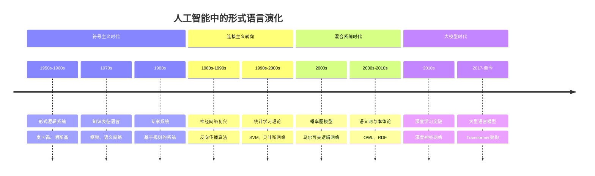

AI发展对形式语言理论的启示：

**定理 7.1**（AI中的形式语言演化）：人工智能的发展表明，纯形式语言方法和纯统计学习方法都存在内在局限，未来的知识表征系统可能需要整合：

1. 形式语言的结构化表征能力和可解释性
2. 统计学习的适应性和鲁棒性
3. 神经表征的分布式特性和模式识别能力
4. 符号推理的系统性和组合性

这种整合不是简单的并置，而是需要发展新的理论框架，理解符号和统计表征之间的深层联系，以及如何在不同抽象层次上实现有效的知识表征和推理。

### 认知科学中的形式模型与限制

形式语言在认知科学中的应用展现了其优势与局限，为理解人类思维提供了重要视角。

**定义 7.2**（认知模型）：认知模型是对人类认知过程（如感知、注意、记忆、学习、推理、决策等）的形式化表示，旨在解释和预测认知行为。

形式模型在认知科学中的主要应用：

1. **计算理论模型**
   - 心智作为信息处理系统的形式化
   - 认知过程作为计算过程的表示
   - 代表性理论：计算理论视角（Marr）、符号系统假设（Newell & Simon）

2. **认知架构**
   - 基于规则和符号的认知模型
   - 整合多种认知功能的统一框架
   - 代表性系统：ACT-R、SOAR、EPIC

3. **形式语义学**
   - 语言理解的形式化模型
   - 基于逻辑和集合论的语义表示
   - 代表性理论：蒙塔古语法、情境语义学

4. **贝叶斯认知科学**
   - 将认知过程形式化为概率推理
   - 基于贝叶斯统计的理性分析
   - 代表性模型：概率主题模型、理想观察者模型

形式模型在捕捉认知的不同方面时表现出不同的优势和局限：

| 认知现象 | 形式模型的优势 | 形式模型的局限 |
|---------|--------------|--------------|
| 逻辑推理 | 精确捕捉推理规则和结构 | 难以模拟人类实际推理中的捷径和启发式 |
| 概念表征 | 提供清晰的类别边界和关系 | 难以处理概念的模糊边界、原型效应和情境依赖性 |
| 语言理解 | 形式化句法结构和组合语义 | 难以整合语境、世界知识和语用因素 |
| 创造性思维 | 模拟某些组合和推理过程 | 难以捕捉真正的创新、洞察和隐喻思维 |
| 社会认知 | 形式化策略互动和信念表征 | 难以模拟情感、共情和文化因素 |

这些局限反映了形式模型与人类认知之间的几个根本差异：

**定理 7.2**（形式模型的认知局限）：形式认知模型面临以下根本挑战：

1. **情境嵌入性**：人类认知深度嵌入具体情境，而形式模型往往假设情境独立性
2. **身体基础**：人类认知植根于身体经验，而形式模型通常忽略身体性
3. **情感整合**：人类认知与情感系统紧密整合，而形式模型通常分离情感因素
4. **社会互动性**：人类认知在社会互动中发展和运作，而形式模型往往假设孤立的认知系统

这些挑战表明，形式模型虽然是认知科学的重要工具，但需要与其他方法互补，才能全面理解人类认知。未来的认知科学可能需要发展更加整合的理论框架，将形式方法与体现认知、情境认知和社会认知视角结合起来。

### 语言学中的形式方法批判

形式语言在语言学中的应用，尤其是乔姆斯基的生成语法，展示了形式方法在理解自然语言结构方面的力量与挑战。

**定义 7.3**（形式语言学）：形式语言学是应用数学形式方法（如形式语言理论、逻辑、集合论）研究自然语言的语言学分支，强调语言的形式结构和规则系统。

形式语言学的主要流派和贡献：

1. **生成语法**
   - 将语言能力形式化为规则系统
   - 语法作为有限规则生成无限句子的系统
   - 代表人物：乔姆斯基、拉斯尼克、卡茨

2. **形式语义学**
   - 使用逻辑工具分析自然语言的意义
   - 基于真值条件的语义理论
   - 代表人物：蒙塔古、帕特、克拉茨

3. **形式语用学**
   - 将语用现象形式化为逻辑和博弈论模型
   - 会话含义和言语行为的形式分析
   - 代表人物：斯塔尔纳克、刘易斯、格赖斯

然而，形式语言学也面临来自多个方向的批评：

1. **功能主义批评**
   - 形式语法过于关注语言能力而非实际使用
   - 忽视语言的交际功能和社会维度
   - 代表人物：哈利戴、吉文、汤普森

2. **认知语言学批评**
   - 形式模型脱离认知和体验基础
   - 语言结构应源于一般认知能力，而非特殊语法模块
   - 代表人物：莱考夫、兰盖克、塔尔米

3. **类型学批评**
   - 形式模型往往基于英语等印欧语系特征
   - 难以解释世界语言的多样性
   - 代表人物：狄克森、科姆里、埃文斯

4. **社会语言学批评**
   - 忽视语言变异和社会因素
   - 理想化的"均质语言社区"假设不符合现实
   - 代表人物：拉博夫、海姆斯、沃福德

这些批评可以通过以下图示来概括：

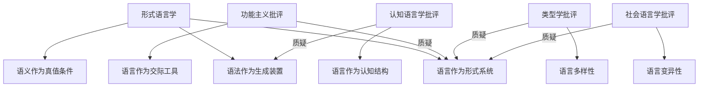

这些批评促使语言学发展出更多元的理论框架，可以总结为：

**定理 7.3**（语言学多元框架）：完整的语言理论需要整合多种视角：

1. 形式视角：关注语言的结构规则和组合性
2. 功能视角：关注语言的交际目的和社会功能
3. 认知视角：关注语言与一般认知能力的关系
4. 社会视角：关注语言的社会变异和文化嵌入性

这种多元框架表明，形式方法虽然是语言研究的重要工具，但需要与其他方法互补，才能全面理解语言的复杂性。

### 社会科学中的形式化困境

形式语言在社会科学中的应用展示了其跨学科潜力和局限性，反映了不同知识领域对形式化的不同需求和挑战。

**定义 7.4**（社会科学形式化）：社会科学形式化是指使用数学、逻辑和计算模型来表示和分析社会现象、人类行为和社会互动的过程。

社会科学中的主要形式化方法：

1. **博弈论**
   - 社会互动的形式化模型
   - 基于理性选择的策略分析
   - 应用领域：经济学、政治学、国际关系

2. **社会选择理论**
   - 集体决策的形式分析
   - 偏好聚合和社会福利函数
   - 应用领域：政治学、经济学、公共政策

3. **形式化组织理论**
   - 组织结构和过程的数学模型
   - 信息流和决策过程分析
   - 应用领域：管理学、组织社会学

4. **计算社会学**
   - 社会现象的计算机模拟
   - 基于主体的建模和网络分析
   - 应用领域：社会学、人类学、传播学

然而，形式化在社会科学中面临特殊挑战：

1. **复杂性挑战**
   - 社会系统的高度复杂性和非线性特性
   - 涌现现象和系统级属性难以形式化
   - 多层次因果关系的形式表达困难

2. **价值挑战**
   - 形式模型中隐含的规范性假设
   - 价值判断的形式化困难
   - 技术中立性神话的问题

3. **方法论挑战**
   - 形式模型与解释理解的张力
   - 数据获取和操作化的困难
   - 模型简化与现实复杂性的权衡

4. **实践挑战**
   - 形式模型与政策应用之间的鸿沟
   - 模型预测的不确定性和有限性
   - 技术专家与决策者之间的沟通障碍

这些挑战可以通过以下模型来理解：

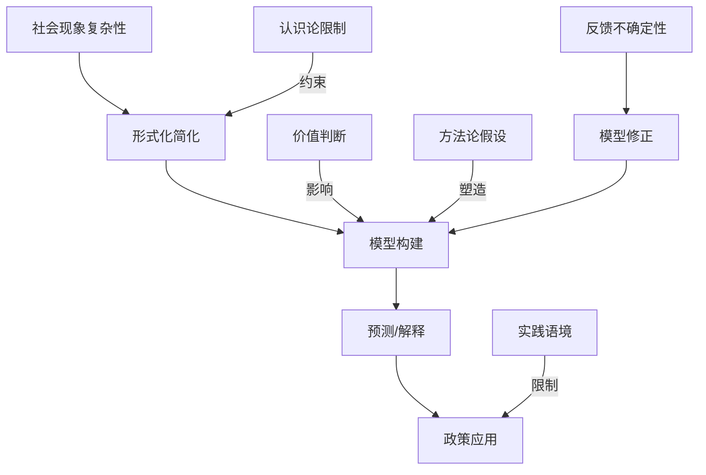

社会科学形式化的困境可以总结为：

**定理 7.4**（社会科学形式化的双重约束）：社会科学中的形式化面临两个方向的约束：

1. 如果形式模型过于简化，则失去对社会现实的解释力和预测力
2. 如果形式模型过于复杂，则失去形式化的主要优势：清晰性、可操作性和可检验性

这一困境不意味着应当放弃形式方法，而是需要发展更加反思性和多元的方法论：

**定理 7.5**（社会科学方法论多元主义）：有效的社会科学研究需要整合多种方法论：

1. 形式方法提供精确的概念化和系统性分析
2. 解释方法提供意义理解和文化语境
3. 批判方法揭示权力结构和规范假设
4. 实证方法提供经验基础和检验

这种多元方法论表明，形式语言在社会科学中的适当角色是作为多种研究方法中的一种，而非唯一或主导的方法。

## 形式语言的未来发展路径

### 后形式主义的理论探索

后形式主义思潮探索超越传统形式主义局限的新方向，寻求更加灵活、包容和语境敏感的形式系统。

**定义 8.1**（后形式主义）：后形式主义是指在认识传统形式主义局限的基础上，发展新型形式系统的理论取向，这些系统能够处理模糊性、语境依赖性、不确定性等传统形式系统难以应对的特性。

后形式主义的主要理论探索方向：

1. **非经典逻辑**
   - **模糊逻辑**：处理模糊概念和渐变真值
   - **直觉主义逻辑**：拒绝排中律，强调构造性证明
   - **多值逻辑**：超越二值真假，允许多种真值状态
   - **相关逻辑**：要求前提与结论之间的相关性
   - **量子逻辑**：基于量子力学的非经典逻辑结构

2. **动态逻辑系统**
   - **时态逻辑**：形式化时间和变化
   - **动态认识逻辑**：形式化知识和信念的变化
   - **更新语义**：形式化信息更新对语境的影响
   - **对话逻辑**：形式化对话和论证过程

3. **情境逻辑**
   - **情境演算**：形式化情境依赖的推理
   - **默认逻辑**：处理默认假设和非单调推理
   - **语境敏感逻辑**：形式化语境对推理的影响
   - **适应性逻辑**：根据语境调整推理规则

4. **认知导向形式系统**
   - **概念空间理论**：基于几何和拓扑的概念表示
   - **认知语法**：结合认知原则的形式语法
   - **心智逻辑**：形式化实际人类推理模式
   - **神经符号系统**：结合神经网络和符号推理

这些发展方向可以通过以下图示来概括：

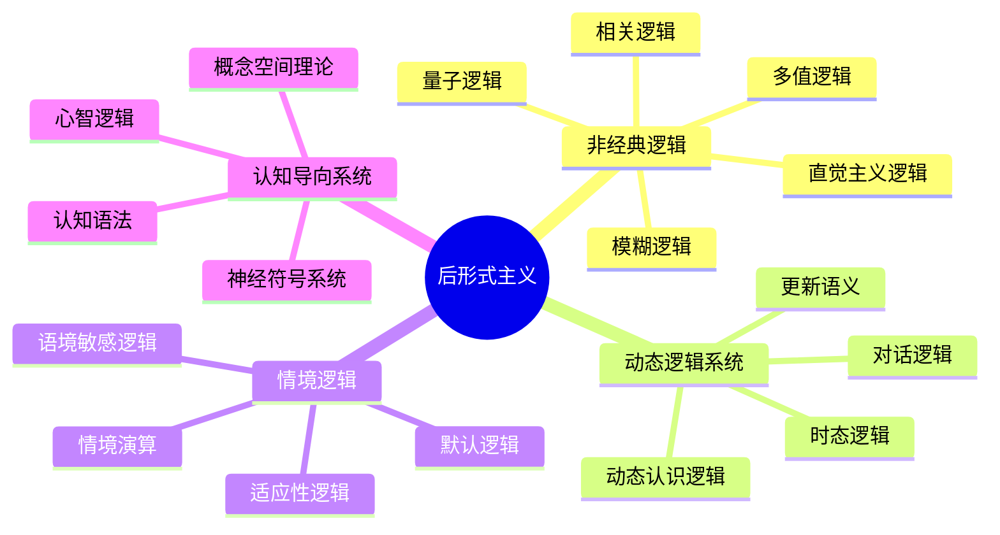

后形式主义的理论意义可以总结为：

**定理 8.1**（后形式主义的拓展性）：后形式主义拓展了形式语言的表达能力和适用范围，使形式系统能够处理：

1. 模糊性和渐变性（而非仅限于清晰边界）
2. 语境依赖性（而非仅限于语境独立性）
3. 动态变化（而非仅限于静态结构）
4. 默认推理（而非仅限于严格演绎）
5. 认知限制（而非假设无限计算资源）

这些拓展表明，形式语言本身正在演化，以应对传统形式主义面临的挑战，拓展其适用范围和表达能力。

### 混合认知系统的形式基础

未来的发展方向可能是混合认知系统，整合形式推理与其他认知模式，为此需要发展新的形式基础。

**定义 8.2**（混合认知系统）：混合认知系统是指整合多种认知模式和表征形式的系统，包括形式推理、统计学习、模拟推理、情境知识等，以实现更全面和强大的认知能力。

混合认知系统的理论基础包括：

1. **神经符号整合**
   - 结合神经网络的学习能力和符号系统的结构化表征
   - 符号接地问题的新解决方案
   - 代表性理论：神经符号计算、差分神经计算机

2. **概率编程语言**
   - 整合逻辑编程和概率推理
   - 处理不确定性的形式化框架
   - 代表性系统：Church、Figaro、Stan、Pyro

3. **认知架构的形式基础**
   - 多种认知功能的统一形式框架
   - 整合规则推理、统计学习和启发式搜索
   - 代表性系统：Sigma、CLARION、LIDA

4. **语境化形式系统**
   - 将语境因素形式化整合到推理系统
   - 动态调整推理策略的机制
   - 代表性理论：情境演算、默认逻辑、适应性逻辑

这些混合系统的形式基础可以通过以下模型来理解：

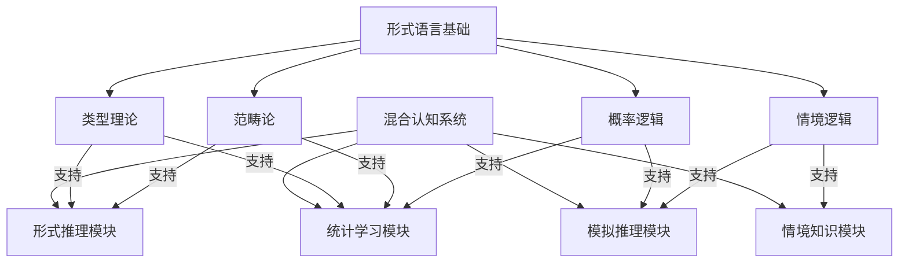

混合认知系统的理论意义可以总结为：

**定理 8.2**（混合认知系统的互补性）：混合认知系统通过整合多种认知模式，实现了互补优势：

1. 形式推理提供结构化知识表征和精确推导
2. 统计学习提供从数据中学习模式的能力
3. 模拟推理提供基于相似性和经验的快速判断
4. 情境知识提供对具体语境的适应能力

这种混合系统需要新的形式基础，能够统一描述不同认知模式及其交互，这可能成为形式语言理论未来发展的重要方向。

### 形式语言的生态学视角

生态学视角将形式语言视为更广泛认知生态系统中的一个组成部分，强调多样性、互补性和适应性。

**定义 8.3**（认知生态）：认知生态是指不同认知方式、表征系统和知识形式共存、互动和共同演化的系统，类似于生物生态系统中不同物种的关系。

形式语言的生态学视角包含以下核心理念：

1. **认知多样性**
   - 不同认知方式的互补价值
   - 认知"生物多样性"的重要性
   - 单一认知模式主导的风险

2. **情境适应性**
   - 不同问题领域适合不同形式化程度
   - 认知工具与任务环境的匹配
   - 认知策略的灵活调整

3. **演化视角**
   - 形式语言作为认知工具的历史演变
   - 认知生态的动态平衡和变化
   - 新认知形式的涌现和发展

4. **可持续认知**
   - 平衡形式化与其他知识形式
   - 避免认知单一化的风险
   - 保护和培养多元认知传统

这一视角可以通过以下生态模型来理解：

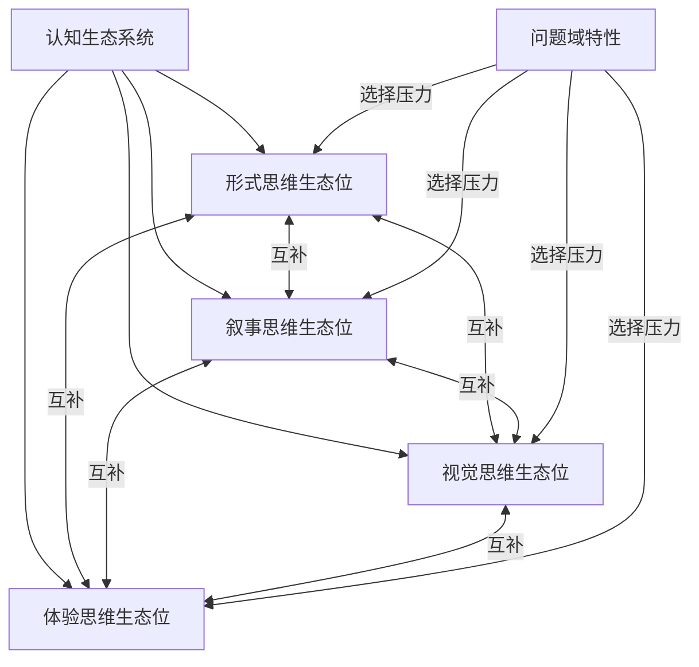

生态学视角的意义可以总结为：

**定理 8.3**（认知生态平衡原则）：健康的认知生态需要多种认知方式的平衡发展：

1. 形式思维提供精确性和系统性
2. 叙事思维提供意义和整体性
3. 视觉思维提供直观性和空间理解
4. 体验思维提供情感和价值维度

这种生态视角强调，形式语言的价值在于其与其他认知方式的协同作用，而非取代或支配它们。认知生态的健康依赖于多样化的思维方式和知识表征形式。

### 形式与非形式知识的整合框架

未来形式语言发展的一个重要方向是建立形式与非形式知识的整合框架，实现不同知识形式的互补和协同。

**定义 8.4**（知识整合框架）：知识整合框架是指能够容纳、连接和协调不同类型知识的理论结构，包括形式知识、经验知识、叙事知识和实践知识等。

知识整合框架的关键组成部分：

1. **多层次知识表征**
   - 形式层：符号、规则、逻辑结构
   - 模型层：概念模型、类比、图示
   - 叙事层：故事、案例、情境描述
   - 体验层：直觉、情感、身体知识

2. **知识转换机制**
   - 形式化：将非形式知识转换为形式表达
   - 具体化：将形式知识转换为具体表征
   - 叙事化：将系统知识转换为故事形式
   - 体验化：将抽象知识连接到直接经验

3. **互补性原则**
   - 识别不同知识形式的优势和局限
   - 根据问题特性选择适当的知识形式
   - 利用多种知识形式的互补优势

4. **整合实践**
   - 跨学科对话和合作方法
   - 多元表征的教育和传播策略
   - 支持知识整合的制度和文化

这一整合框架可以通过以下模型来理解：

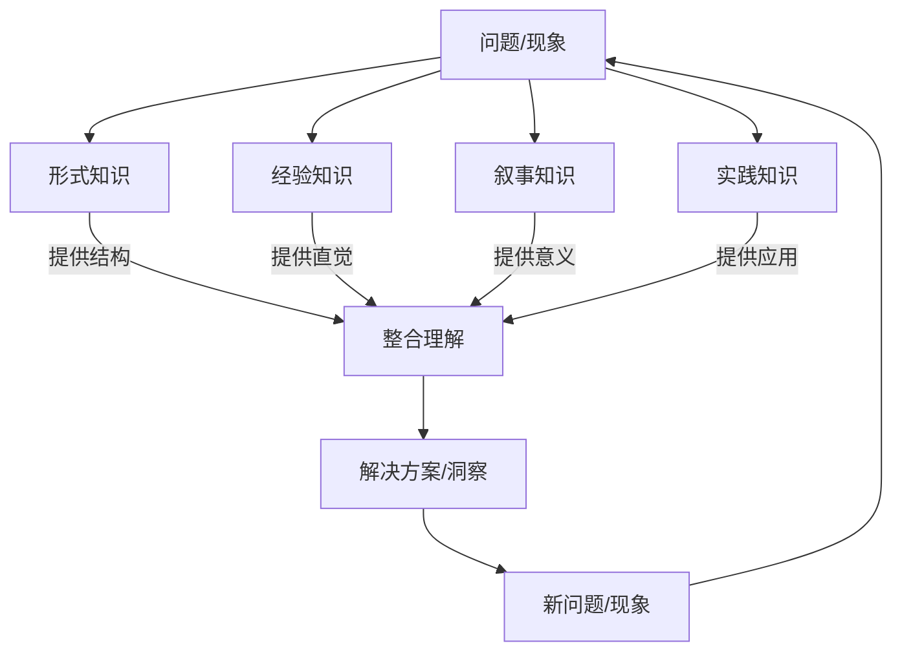

知识整合框架的意义可以总结为：

**定理 8.4**（知识整合原则）：完整的知识体系需要整合多种知识形式，其中：

1. 形式知识提供精确的结构和系统性
2. 经验知识提供直观理解和模式识别
3. 叙事知识提供意义和价值维度
4. 实践知识提供应用技能和情境智慧

这种整合框架不仅是理论构想，也是实践指南，为形式语言与其他知识形式的协同发展提供了方向。

## 结论：形式语言的批判性综合

对形式语言的批判性综合应当避免两种极端：既不应将其绝对化为唯一合法的知识形式，也不应因其局限而完全否定其价值。形式语言最好被理解为人类认知工具箱中的一种特殊工具，它在特定领域具有无可替代的优势，但需要与其他认知方式相互补充。

通过本文的多维分析，我们可以总结形式语言的核心价值：

1. **提供精确的表达和推理框架**，尤其适用于数学和科学领域
2. **揭示思维的结构和限制**，帮助我们理解认知的边界
3. **促进跨学科交流**，提供共同的表达语言
4. **支持技术发展**，尤其是计算机科学和人工智能

同时，我们也应当清醒认识其局限：

1. **内在的不完备性**，如哥德尔定理所揭示的
2. **与人类实际思维的差距**，包括处理模糊性、创造性和语境依赖的能力
3. **社会文化的嵌入性**，形式语言并非文化中立的普遍工具
4. **可能的排除效应**，过度强调形式化可能边缘化其他知识形式

形式语言的未来发展应当朝向更加开放、多元和整合的方向，包括：

1. **发展后形式主义理论**，拓展形式语言的表达能力和适用范围
2. **构建混合认知系统**，整合形式推理与其他认知模式
3. **采纳认知生态视角**，平衡不同思维方式的发展
4. **建立知识整合框架**，促进形式与非形式知识的协同

形式语言的真正价值不在于其完美性，而在于它揭示了人类思维的可能性和局限性。通过批判性地理解形式语言，我们可以更好地利用它作为认知工具，同时保持对其他思维方式的开放态度，从而发展更全面、更平衡的知识观。

形式语言研究不仅具有技术意义，也具有深远的哲学和认知意义。它帮助我们理解人类思维的本质、知识的边界以及符号与意义的复杂关系。在这个意义上，形式语言研究是连接数学、逻辑、哲学、认知科学和计算机科学的重要桥梁，为我们提供了理解思维本身的独特视角。

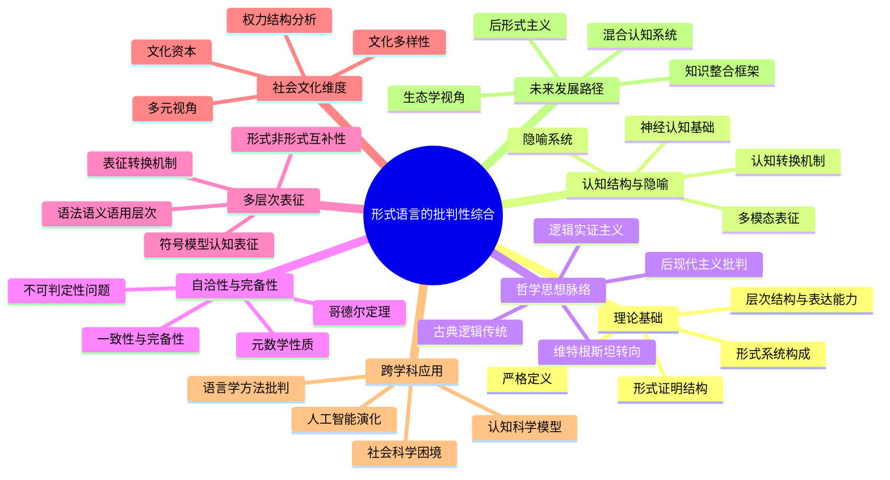
