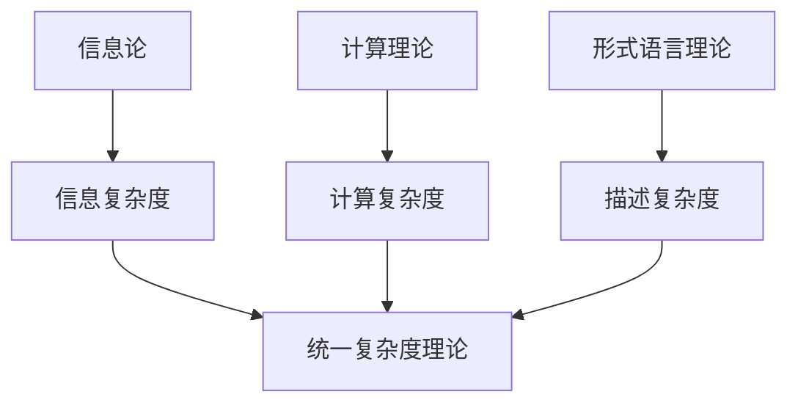
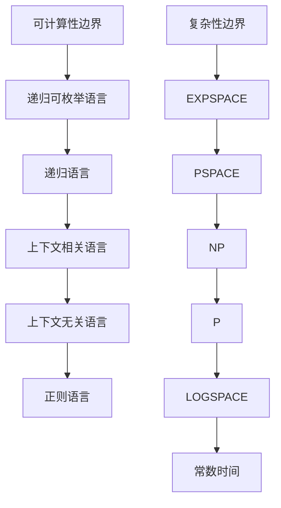
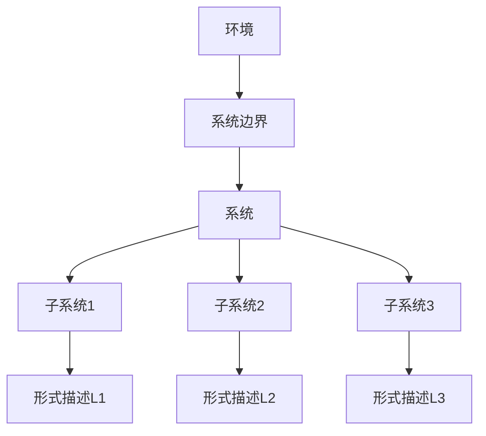

# 形式语言的批判性分析与综合：多维表征与跨学科视角

## 目录

- [形式语言的批判性分析与综合：多维表征与跨学科视角](#形式语言的批判性分析与综合多维表征与跨学科视角)
  - [目录](#目录)
  - [引言：形式语言的本质与意义](#引言形式语言的本质与意义)
  - [形式语言的理论基础与精确定义](#形式语言的理论基础与精确定义)
    - [形式语言的严格定义](#形式语言的严格定义)
    - [形式系统的构成要素](#形式系统的构成要素)
    - [乔姆斯基层次结构与计算能力](#乔姆斯基层次结构与计算能力)
  - [形式语言与信息论的深层联系](#形式语言与信息论的深层联系)
    - [香农信息论与形式语言](#香农信息论与形式语言)
    - [算法信息论与柯尔莫哥洛夫复杂度](#算法信息论与柯尔莫哥洛夫复杂度)
    - [信息与计算的统一视角](#信息与计算的统一视角)
  - [形式语言与模型论](#形式语言与模型论)
    - [语言、结构与满足关系](#语言结构与满足关系)
    - [完备性与紧致性](#完备性与紧致性)
    - [模型多样性与限制性](#模型多样性与限制性)
  - [形式语言与自动机理论](#形式语言与自动机理论)
    - [自动机层次与语言识别能力](#自动机层次与语言识别能力)
    - [计算模型的表达限制](#计算模型的表达限制)
    - [状态爆炸问题与应对策略](#状态爆炸问题与应对策略)
  - [形式语言与可计算性理论](#形式语言与可计算性理论)
    - [可判定性与递归性](#可判定性与递归性)
    - [不可判定问题的本质](#不可判定问题的本质)
    - [计算复杂性层次](#计算复杂性层次)
  - [形式语言与表示论](#形式语言与表示论)
    - [多模态认知表征](#多模态认知表征)
    - [形式表征与非形式表征的互补性](#形式表征与非形式表征的互补性)
    - [符号接地问题](#符号接地问题)
  - [形式语言与系统论](#形式语言与系统论)
    - [系统的形式化描述](#系统的形式化描述)
    - [复杂系统与涌现性](#复杂系统与涌现性)
    - [系统边界与形式语言的局限](#系统边界与形式语言的局限)
  - [形式语言与控制论](#形式语言与控制论)
    - [离散事件控制系统](#离散事件控制系统)
    - [监督控制理论](#监督控制理论)
    - [反馈与自组织](#反馈与自组织)
  - [形式语言的哲学反思](#形式语言的哲学反思)
    - [形式语言的认识论地位](#形式语言的认识论地位)
    - [形式与意义的辩证关系](#形式与意义的辩证关系)
    - [形式语言的社会文化维度](#形式语言的社会文化维度)
  - [结论：形式语言的跨学科综合](#结论形式语言的跨学科综合)

## 引言：形式语言的本质与意义

形式语言作为人类智识活动的独特产物，既是数学、逻辑和理论计算机科学的基础工具，也是一种特殊的认知方式和文化现象。本文旨在对形式语言进行全面的批判性分析与综合，通过多维表征和跨学科视角，揭示形式语言的本质特征、理论基础、应用范围以及其在人类知识体系中的地位和局限。

形式语言的本质特征在于其精确性、无歧义性和形式化的符号操作。与自然语言不同，形式语言通过严格定义的符号系统和规则，消除了语义的模糊性和语境依赖性，为精确推理提供了基础。然而，这种精确性也带来了局限，尤其是在处理复杂性、创造性思维和开放性问题等方面。通过批判性分析，我们可以更全面地理解形式语言的价值与局限，以及它在人类认知生态中的适当位置。

本文特别关注形式语言与其他理论领域的深层联系，包括信息论、模型论、自动机理论、可计算性理论、表示论、系统论和控制论。这些跨学科联系不仅揭示了形式语言的理论深度，也展示了它作为连接不同知识领域的桥梁作用。

## 形式语言的理论基础与精确定义

### 形式语言的严格定义

形式语言从数学角度严格定义为一个字符串集合，这些字符串是由有限字母表上的符号按照特定规则构成的。

**定义 1.1**（形式语言）：设 $\Sigma$ 是一个有限的非空符号集合，称为字母表。$\Sigma^*$ 表示由 $\Sigma$ 中符号构成的所有有限长度字符串的集合。形式语言 $L$ 是 $\Sigma^*$ 的一个子集，即 $L \subseteq \Sigma^*$。

形式语言可以通过多种方式定义，包括：

1. **枚举法**：直接列出语言中的所有字符串（仅适用于有限语言）
2. **生成法**：通过形式文法生成语言中的字符串
3. **识别法**：通过自动机或其他计算模型识别语言中的字符串

**定义 1.2**（形式文法）：形式文法 $G$ 是一个四元组 $G = (V, \Sigma, R, S)$，其中：

- $V$ 是非终结符的有限集合
- $\Sigma$ 是终结符的有限集合，且 $V \cap \Sigma = \emptyset$
- $R$ 是重写规则的有限集合，每条规则形如 $\alpha \rightarrow \beta$，其中 $\alpha \in (V \cup \Sigma)^* \times V \times (V \cup \Sigma)^*$，$\beta \in (V \cup \Sigma)^*$
- $S \in V$ 是开始符号

形式语言的严格定义为后续的理论发展提供了坚实基础，使我们能够精确分析语言的结构特性和计算属性。

### 形式系统的构成要素

形式系统是形式语言理论的核心，它提供了一个精确的框架来定义和分析逻辑推理。

**定义 1.3**（形式系统）：形式系统 $\mathcal{F}$ 是一个三元组 $\mathcal{F} = (\mathcal{L}, \mathcal{A}, \mathcal{R})$，其中：

- $\mathcal{L}$ 是一个形式语言，定义了系统中合式公式的集合
- $\mathcal{A} \subseteq \mathcal{L}$ 是公理集，包含被预设为真的合式公式
- $\mathcal{R}$ 是推理规则集，每条规则形如 $\frac{\varphi_1, \varphi_2, \ldots, \varphi_n}{\psi}$，表示从前提 $\varphi_1, \varphi_2, \ldots, \varphi_n$ 可以推导出结论 $\psi$

形式系统的构成要素反映了形式化思维的基本结构：

1. **语言层**：定义了可以表达的内容范围
2. **公理层**：确立了基本真理，作为推理的起点
3. **规则层**：规定了合法的推理步骤

这种三层结构可以类比于人类认知系统中的概念表征、基本信念和推理模式，揭示了形式系统与人类思维之间的深层对应关系。

### 乔姆斯基层次结构与计算能力

乔姆斯基谱系提供了一个理解形式语言表达能力的层次框架，它将形式语言按照生成能力和计算复杂性分为四个层次：

**定理 1.1**（乔姆斯基层次结构）：形式语言可以按照其文法的限制程度分为以下四类，构成严格的包含关系：

1. 3型语言（正则语言）⊂ 2型语言（上下文无关语言）⊂ 1型语言（上下文相关语言）⊂ 0型语言（递归可枚举语言）

每个语言类型对应特定的文法规则限制和识别装置：

| 语言类型 | 文法规则限制 | 识别装置 | 时间复杂度 | 空间复杂度 |
|---------|------------|---------|----------|----------|
| 0型语言 | 无限制 | 图灵机 | 不可预测 | 不可预测 |
| 1型语言 | $\alpha A \beta \rightarrow \alpha \gamma \beta$，$\gamma \neq \varepsilon$ | 线性有界自动机 | 指数级 | 线性 |
| 2型语言 | $A \rightarrow \gamma$，$A \in V$ | 下推自动机 | 多项式 | 线性 |
| 3型语言 | $A \rightarrow aB$ 或 $A \rightarrow a$，$A,B \in V$，$a \in \Sigma$ | 有限状态自动机 | 线性 | 常数 |

表达能力与计算复杂性之间存在根本的权衡关系，这一关系可以通过以下定理形式化：

**定理 1.2**（表达能力-复杂性权衡）：如果语言类别 $L_1$ 严格包含语言类别 $L_2$，则存在 $L_1$ 中的语言，其识别问题的计算复杂性严格高于 $L_2$ 中任何语言的识别问题。

这一层次结构不仅是形式语言理论的核心，也反映了计算复杂性的本质层级，揭示了表达能力与计算资源之间的根本关系。

## 形式语言与信息论的深层联系

### 香农信息论与形式语言

形式语言与信息论之间存在深层次的概念联系。香农信息论关注的是信息的量化、传输和处理，而形式语言则提供了表达和操作信息的结构化框架。

**定理 2.1**（语言熵）：给定一个概率形式语言 $L$，其中每个字符串 $w$ 有概率 $p(w)$，则该语言的熵定义为：

$$H(L) = -\sum_{w \in L} p(w) \log p(w)$$

语言熵衡量了语言中平均信息量，也反映了语言的复杂性和不确定性。

信息论的编码定理与形式语言的表达能力密切相关：

**定理 2.2**（最优编码）：对于任何概率形式语言 $L$，存在一个编码方案，使得平均编码长度接近但不小于语言熵 $H(L)$。

这一定理揭示了信息压缩的理论极限，也说明了形式语言作为信息载体的效率边界。

### 算法信息论与柯尔莫哥洛夫复杂度

算法信息论将计算理论与信息理论结合，提供了对单个对象复杂性的度量。

**定义 2.1**（柯尔莫哥洛夫复杂度）：字符串 $x$ 的柯尔莫哥洛夫复杂度 $K(x)$ 是能在通用图灵机上生成 $x$ 的最短程序的长度：

$$K(x) = \min_{p: U(p)=x} |p|$$

其中 $U$ 是通用图灵机，$p$ 是输入程序，$|p|$ 是程序长度。

柯尔莫哥洛夫复杂度与形式语言的关系可以通过以下定理阐明：

**定理 2.3**（语言复杂度特征）：形式语言 $L$ 的复杂度可以通过其成员的平均柯尔莫哥洛夫复杂度来表征：

$$K(L) = \lim_{n \to \infty} \frac{1}{|L_n|} \sum_{x \in L_n} K(x)$$

其中 $L_n$ 是 $L$ 中长度为 $n$ 的字符串集合。

这一定理揭示了形式语言的内在复杂性，不同类型的形式语言（如正则语言、上下文无关语言）具有不同的复杂度特征。

### 信息与计算的统一视角

信息论与计算理论的结合提供了理解形式语言的统一视角：

**定理 2.4**（信息-计算等价原理）：对于任何形式语言 $L$，以下三个量之间存在密切关系：

1. 识别 $L$ 所需的最小自动机状态数
2. 描述 $L$ 所需的最小信息量（以比特计）
3. $L$ 的柯尔莫哥洛夫复杂度

这一原理表明，计算复杂性、信息复杂性和描述复杂性本质上是同一概念的不同表现形式。

这种统一视角不仅深化了我们对形式语言本质的理解，也为跨学科研究提供了理论基础。

## 形式语言与模型论

### 语言、结构与满足关系

模型论研究形式语言（理论）和它们的数学释义（模型）之间的关系，为形式语言提供了语义基础。

**定义 3.1**（结构与满足）：给定一个形式语言 $L$，一个 $L$-结构 $\mathcal{M}$ 是对 $L$ 中符号的解释。我们用 $\mathcal{M} \models \varphi$ 表示公式 $\varphi$ 在结构 $\mathcal{M}$ 中为真（$\mathcal{M}$ 满足 $\varphi$）。

模型论与形式语言的关系可以通过以下定理阐明：

**定理 3.1**（哥德尔完备性定理）：对于一阶逻辑，一个句子 $\varphi$ 是可证明的，当且仅当它在所有模型中都为真：

$$\vdash \varphi \iff \forall \mathcal{M}(\mathcal{M} \models \varphi)$$

这一定理建立了语法（证明）和语义（真值）之间的桥梁，是形式语言理论的基石。

### 完备性与紧致性

模型论提供了分析形式系统能力的重要工具：

**定理 3.2**（紧致性定理）：一个一阶理论 $T$ 有模型，当且仅当 $T$ 的每个有限子集都有模型。

紧致性定理揭示了一阶逻辑的一个基本特性：无法通过有限公理集合区分可数和不可数结构。这一特性导致了形式语言表达能力的内在限制。

**定理 3.3**（勒文海姆-斯科伦定理）：如果一个可数的一阶理论 $T$ 有无限模型，那么对于任何无限基数 $\kappa$，$T$ 都有基数为 $\kappa$ 的模型。

这一定理表明，一阶形式语言无法唯一地刻画无限结构的大小，这是形式语言表达能力的另一个重要限制。

### 模型多样性与限制性

模型论视角下，形式语言的表达能力受到多方面限制：

**定理 3.4**（表达能力限制）：存在自然数结构的性质，无法在一阶逻辑中表达，例如"是有限集"或"是可数集"。

这些限制表明，即使是强大的形式语言，也无法捕捉某些直观的数学概念。这一发现促使了更强形式语言（如二阶逻辑、无穷逻辑）的发展，但这些更强的语言通常失去了一阶逻辑的良好性质（如完备性和紧致性）。

模型论的研究揭示了形式语言的表达能力与其元理论性质之间的深刻权衡关系，这一权衡关系是理解形式语言本质的关键。

## 形式语言与自动机理论

### 自动机层次与语言识别能力

自动机理论为形式语言提供了操作性语义，通过定义能够识别各类形式语言的抽象计算模型。

**定义 4.1**（有限自动机）：一个确定性有限自动机 (DFA) 是一个五元组 $M = (Q, \Sigma, \delta, q_0, F)$，其中：

- $Q$ 是有限的状态集合
- $\Sigma$ 是输入字母表
- $\delta: Q \times \Sigma \to Q$ 是状态转移函数
- $q_0 \in Q$ 是初始状态
- $F \subseteq Q$ 是接受状态集合

自动机与形式语言的对应关系构成了计算理论的基础：

| 自动机类型 | 识别的语言类型 | 特点 |
|-----------|--------------|------|
| 有限自动机 (FA) | 正则语言 | 无记忆能力，只能识别局部模式 |
| 下推自动机 (PDA) | 上下文无关语言 | 有栈记忆，能处理嵌套结构 |
| 线性有界自动机 (LBA) | 上下文相关语言 | 有限线性空间，能处理上下文依赖 |
| 图灵机 (TM) | 递归可枚举语言 | 无限存储，通用计算能力 |

### 计算模型的表达限制

每种自动机类型都有其内在限制，这些限制可以通过不可识别的语言来展示：

**定理 4.1**（泵引理）：对于任何正则语言 $L$，存在一个常数 $p > 0$，使得任何长度至少为 $p$ 的字符串 $w \in L$ 都可以分解为 $w = xyz$，其中 $|xy| \leq p$，$|y| > 0$，且对所有 $i \geq 0$，$xy^iz \in L$。

泵引理提供了证明某个语言不是正则语言的有力工具。类似的泵引理也存在于上下文无关语言中，揭示了下推自动机的能力限制。

**定理 4.2**（表达限制）：以下问题对应的语言不能被相应的自动机识别：

1. 有限自动机不能识别 $\{a^nb^n | n \geq 0\}$（匹配括号问题）
2. 下推自动机不能识别 $\{a^nb^nc^n | n \geq 0\}$（三重匹配问题）
3. 图灵机不能识别 $\{<M> | M是停机的图灵机\}$（停机问题）

这些限制揭示了计算模型的根本边界，也反映了形式语言表达能力的层次结构。

### 状态爆炸问题与应对策略

自动机理论面临的一个实际挑战是状态爆炸问题：

**定理 4.3**（状态复杂度）：将一个 $n$ 状态的非确定性有限自动机 (NFA) 转换为等价的确定性有限自动机 (DFA)，最坏情况下可能需要 $2^n$ 个状态。

状态爆炸问题限制了自动机在实际应用中的规模，但可以通过多种策略缓解：

1. **符号自动机**：使用符号表示转换条件，而非枚举所有可能的输入
2. **分层自动机**：将复杂自动机分解为多个简单自动机的组合
3. **近似技术**：在某些应用中，可以接受对语言的近似识别

自动机理论不仅为形式语言提供了操作性定义，也为计算机科学中的许多实际问题（如编译器设计、协议验证、模式匹配）提供了理论基础。

## 形式语言与可计算性理论

### 可判定性与递归性

可计算性理论研究什么问题可以通过算法解决，什么问题原则上无法解决，与形式语言密切相关。

**定义 5.1**（可判定语言）：如果存在一个总是停机的图灵机 $M$，对于任何输入字符串 $w$，$M$ 接受 $w$ 当且仅当 $w \in L$，则称形式语言 $L$ 是可判定的（或递归的）。

**定义 5.2**（可识别语言）：如果存在一个图灵机 $M$，对于任何 $w \in L$，$M$ 接受 $w$，则称形式语言 $L$ 是可识别的（或递归可枚举的）。

可计算性理论的核心结果之一是存在不可判定的问题：

**定理 5.1**（图灵停机问题）：语言 $HALT = \{<M,w> | M是图灵机，在输入w上停机\}$ 是不可判定的。

这一结果表明，存在原则上无法通过算法解决的问题，这对形式语言的能力设置了根本限制。

### 不可判定问题的本质

不可判定性的根源可以追溯到自指和对角线方法：

**定理 5.2**（Rice定理）：任何非平凡的、关于递归可枚举语言语义性质的问题都是不可判定的。

Rice定理表明，几乎所有关于程序行为的有意义问题都是不可判定的，这对形式验证和程序分析设置了理论边界。

不可判定性与形式系统的不完备性密切相关：

**定理 5.3**（哥德尔不完备定理的计算版本）：任何足够强的一致的形式系统都存在真命题，但在系统内不可证明。

这一联系揭示了形式语言、可计算性和形式系统之间的深层关联。

### 计算复杂性层次

即使问题是可判定的，其计算复杂性也可能使实际求解变得不可行：

**定义 5.3**（复杂性类）：

- P：可在多项式时间内解决的问题集合
- NP：可在多项式时间内验证解的问题集合
- PSPACE：可在多项式空间内解决的问题集合

形式语言识别问题的复杂性与乔姆斯基层次结构密切相关：

| 语言类型 | 识别复杂性 |
|---------|-----------|
| 正则语言 | O(n)，线性时间 |
| 上下文无关语言 | O(n³)，多项式时间 |
| 上下文相关语言 | PSPACE-完全 |
| 递归可枚举语言 | 不可判定 |

计算复杂性理论提供了更细致的层次结构，揭示了即使在可计算问题中也存在根本的效率界限。

这种层次结构不仅是理论上的分类，也反映了实际问题求解的根本难度差异。

## 形式语言与表示论

### 多模态认知表征

形式语言与人类认知的关系远比传统观点复杂。
将认知表征直接等同于形式语言面临着过度简化的风险，因为人类的知识和思维具有多模态性：

**定义 6.1**（认知表征的多模态性）：人类认知表征是多种表征模式的综合，包括但不限于：

- **命题表征**：以符号和逻辑关系为基础的表征
- **图像表征**：基于视觉空间特性的心像表征
- **感知符号表征**：将概念植根于感知运动系统的模拟
- **情感表征**：包含情绪评价成分的表征
- **身体表征**：通过身体状态和动作编码的知识

实证研究表明，即使在形式推理过程中，人类也同时激活多种表征模式：

1. **神经影像研究**：数学思考同时激活负责语言、视觉空间和运动的脑区
2. **眼动追踪**：解题过程中的眼动模式显示视觉表征的重要作用
3. **手势研究**：数学家在解释抽象概念时常使用手势，表明身体表征的参与

这种多模态性挑战了形式语言作为唯一或主导认知模型的地位，表明人类思维的丰富性超出了纯符号操作的范围。认知科学的研究表明，即使是最抽象的数学思维，也依赖于感知运动系统的模拟和隐喻映射。

**定理 6.1**（认知表征的互补原理）：形式表征与非形式表征（如视觉、运动、情感表征）在认知过程中相互补充，共同构成完整的认知系统。

这一原理解释了为什么纯粹的形式化方法在某些领域（如创造性问题解决、模式识别）面临困难，也为形式语言与其他表征系统的整合提供了理论基础。

### 形式表征与非形式表征的互补性

形式表征与非形式表征各有优势和局限：

| 表征类型 | 优势 | 局限 |
|---------|------|------|
| 形式表征 | 精确性、一致性、可组合性 | 抽象性、脱离具体经验 |
| 视觉表征 | 整体性、模式识别、空间关系 | 精确度有限、难以形式化 |
| 运动表征 | 过程性知识、身体知识 | 难以明确传达、个体差异大 |
| 情感表征 | 价值评估、直觉判断 | 主观性、难以形式化 |

**定理 6.2**（表征转换）：认知系统能够在不同表征形式之间进行转换，这些转换是认知灵活性的关键机制。

这一定理解释了数学家如何在形式证明和直觉理解之间切换，以及科学家如何将具体观察转化为抽象理论。

### 符号接地问题

形式语言面临的一个根本挑战是符号接地问题：纯粹的符号系统如何获得意义？

**定义 6.2**（符号接地问题）：符号接地问题指的是如何将形式系统中的符号与现实世界的对象、属性和关系联系起来，使符号获得指称意义而非仅仅是形式操作的对象。

符号接地问题的几种可能解决方案包括：

1. **感知-运动接地**：通过将符号与感知和行动经验联系起来
2. **社会-文化接地**：通过社会实践和文化传统赋予符号意义
3. **进化-适应接地**：通过进化过程形成的适应性结构提供基础意义

**定理 6.3**（接地不完备性）：纯粹的形式系统无法在其内部完全解决符号接地问题，必须依赖于系统外部的感知、行动或社会实践。

这一定理表明，形式语言作为认知工具的有效性依赖于它与其他认知系统的整合，而非独立存在。

## 形式语言与系统论

### 系统的形式化描述

系统论提供了理解复杂整体的框架，形式语言则为系统描述提供了精确工具。

**定义 7.1**（形式系统模型）：一个系统 $S$ 的形式模型是一个三元组 $M = (X, U, F)$，其中：

- $X$ 是系统状态空间
- $U$ 是输入或控制空间
- $F: X \times U \to X$ 是状态转移函数

系统可以通过多种形式语言描述，每种语言适合捕捉不同方面：

1. **状态转移系统**：适合描述离散动态系统
2. **微分方程**：适合描述连续动态系统
3. **混合自动机**：适合描述混合离散-连续系统
4. **进程代数**：适合描述并发交互系统

**定理 7.1**（表达完备性权衡）：增加形式语言的表达能力通常以分析可行性为代价。完全表达的系统模型往往是不可判定的。

这一权衡关系解释了为什么实际系统建模常常需要在精确性和可分析性之间取得平衡。

### 复杂系统与涌现性

复杂系统的一个关键特性是涌现性，这对形式语言提出了特殊挑战：

**定义 7.2**（涌现性）：涌现性是指系统整体表现出的性质无法简单地从其组成部分的性质推导出来。

涌现性与形式语言的关系可以通过以下定理阐明：

**定理 7.2**（涌现性的形式不可约性）：对于足够复杂的系统 $S$，存在系统性质 $P$，使得 $P$ 无法在描述系统组成部分的形式语言中表达，而需要引入新的语言结构。

这一定理解释了为什么不同层次的系统常常需要不同的形式语言来描述，如从量子力学到热力学，从神经元到认知。

### 系统边界与形式语言的局限

系统论视角揭示了形式语言的一个根本局限：系统边界的界定问题：

**定理 7.3**（边界不确定性原理）：任何系统的形式描述都隐含地依赖于系统边界的界定，而这种界定本身不能完全在形式系统内部确定。

这一原理表明，形式语言的应用总是依赖于形式系统之外的判断，如何界定相关要素和忽略不相关要素。这种判断通常基于实用考虑、学科传统或研究目的，而非纯粹的形式规则。

系统论的视角提醒我们，形式语言虽然是强大的描述工具，但其有效性依赖于适当的系统边界界定和抽象层次选择。

## 形式语言与控制论

### 离散事件控制系统

控制论研究系统的调节和控制机制，形式语言在离散事件控制系统中发挥着核心作用。

**定义 8.1**（离散事件控制系统）：离散事件控制系统 (DECS) 是一个三元组 $D = (G, S, L_m)$，其中：

- $G$ 是描述系统行为的自动机
- $S$ 是监督器（控制器）
- $L_m$ 是标记语言，表示系统期望达到的状态

离散事件控制系统将系统行为建模为形式语言，控制目标是确保系统的行为（生成的语言）是期望语言的子集。

### 监督控制理论

Ramadge-Wonham框架提供了离散事件系统监督控制的数学基础：

**定义 8.2**（可控性）：给定系统 $G$ 生成的语言 $L(G)$ 和不可控事件集 $\Sigma_u$，语言 $K \subseteq L(G)$ 相对于 $G$ 和 $\Sigma_u$ 是可控的，如果：

$$\overline{K}\Sigma_u \cap L(G) \subseteq \overline{K}$$

其中 $\overline{K}$ 是 $K$ 的前缀闭包。

**定理 8.1**（可控性定理）：存在监督器 $S$ 使得闭环系统 $S/G$ 的行为正好是 $K$，当且仅当 $K$ 是可控的且前缀闭的。

这一定理为控制器设计提供了理论基础，表明控制器能够实现的行为受到系统结构和不可控事件的根本限制。

### 反馈与自组织

控制论的核心概念是反馈，它与形式语言和自组织系统有深层联系：

**定义 8.3**（反馈控制）：反馈控制是一种控制机制，其中系统的输出被测量并反馈到输入，以调整系统行为。

**定理 8.2**（反馈不变性）：对于具有反馈结构的系统，存在系统性质 $P$，使得 $P$ 在外部条件变化时保持相对稳定。

这一定理解释了为什么具有反馈机制的系统能够表现出自组织和适应性行为。形式语言为描述这种反馈结构提供了精确工具，如通过自动机的状态转换函数或进程代数的递归定义。

控制论与形式语言的结合不仅应用于工程系统，也为理解生物系统、认知系统和社会系统提供了理论框架。

## 形式语言的哲学反思

### 形式语言的认识论地位

形式语言的认识论地位是哲学争论的焦点，涉及形式知识与其他知识形式的关系。

**定理 9.1**（认识论多元主义）：形式语言是人类认知工具箱中的一种工具，与其他认知方式（如叙事、隐喻、直觉）共同构成完整的认识系统。

这一多元主义立场避免了两个极端：一方面避免了逻辑实证主义将形式语言视为唯一合法知识形式的倾向，另一方面也避免了后现代主义完全相对化形式知识的倾向。

### 形式与意义的辩证关系

形式与意义之间存在复杂的辩证关系，这一关系可以通过以下定理阐明：

**定理 9.2**（形式-意义辩证法）：形式系统的发展遵循一种辩证模式：

1. 形式化阶段：将直观概念转化为精确形式
2. 操作阶段：在形式系统内进行推导和操作
3. 解释阶段：将形式结果重新解释为有意义的内容
4. 扩展阶段：基于新的理解扩展形式系统

这一辩证过程表明，形式与意义不是对立的，而是互相依赖、互相促进的。形式语言的发展历史充满了这种辩证运动的例子，从几何公理化到集合论危机，从哥德尔定理到新的逻辑系统的发展。

### 形式语言的社会文化维度

形式语言不仅是抽象的符号系统，也是嵌入特定社会文化背景的实践：

**定理 9.3**（形式语言的社会嵌入性）：形式语言的发展、使用和价值评估都嵌入在特定的社会历史语境中，反映了特定的文化价值和权力关系。

这一视角提醒我们注意形式语言的非中立性，以及它在知识生产和社会分层中的作用。形式语言能力作为文化资本，在教育系统和专业领域中发挥着重要的社会区分功能。

认识形式语言的社会文化维度，有助于我们更全面地理解形式语言的价值和局限，也为形式语言教育的民主化和多元化提供了理论基础。

## 结论：形式语言的跨学科综合

形式语言作为人类智识活动的独特产物，既有其内在的理论结构和发展逻辑，也与多个学科领域有着深层联系。本文通过多维表征和跨学科视角，对形式语言进行了批判性分析与综合，揭示了以下关键洞见：

1. **形式语言的层次结构**：从乔姆斯基层次结构到计算复杂性层次，形式语言表现出清晰的能力层级，反映了表达能力与计算资源之间的根本权衡。

2. **形式语言的跨学科联系**：形式语言与信息论、模型论、自动机理论、可计算性理论、表示论、系统论和控制论有着深层联系，这些联系不仅丰富了形式语言的理论内涵，也扩展了其应用范围。

3. **形式语言的认知基础**：形式语言不是独立于人类认知的抽象实体，而是植根于多模态认知表征、隐喻系统和身体经验的复杂认知工具。

4. **形式语言的社会文化维度**：形式语言的发展和使用嵌入在特定的社会历史语境中，反映并塑造着知识生产和社会关系。

这种跨学科综合视角有助于我们避免两种极端：一方面避免将形式语言神秘化或绝对化，另一方面也避免完全相对化或边缘化形式知识的价值。形式语言是人类认知工具箱中的重要工具，与其他认知方式相互补充，共同构成完整的认识系统。

未来的形式语言研究应当更加开放地与其他学科对话，探索形式与非形式知识的整合路径，发展更加包容和多元的形式化方法，以应对复杂性、创造性和开放性问题的挑战。
