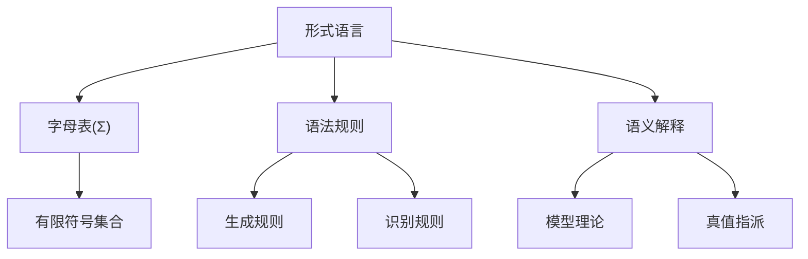
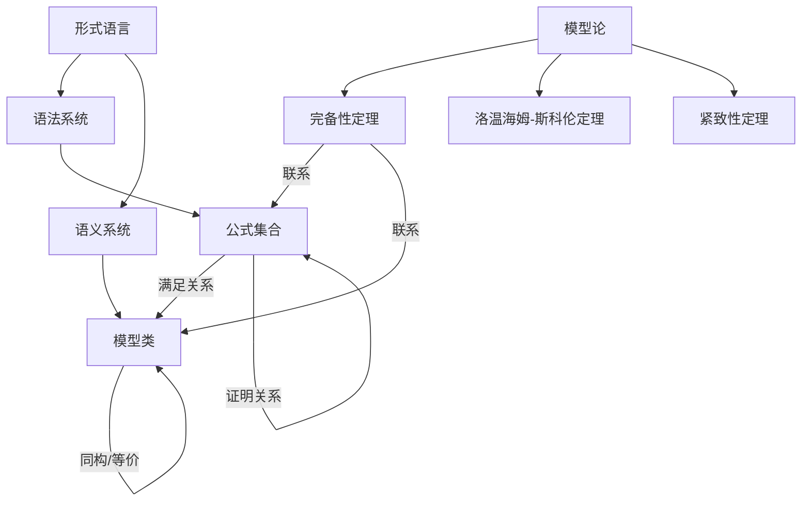
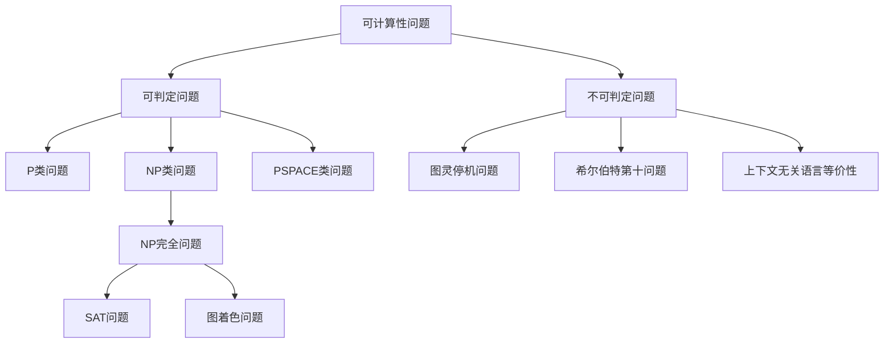
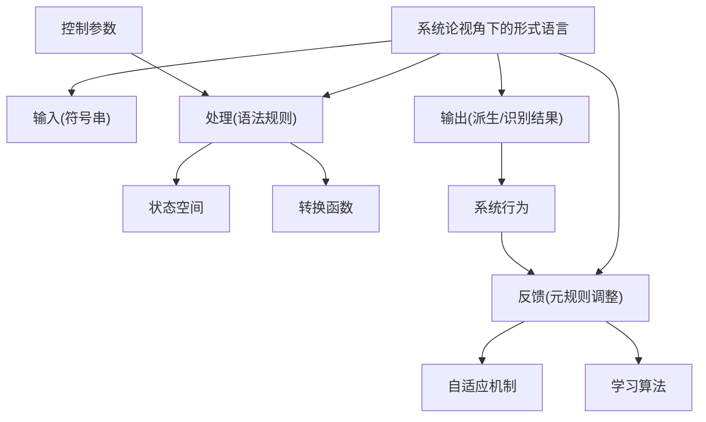
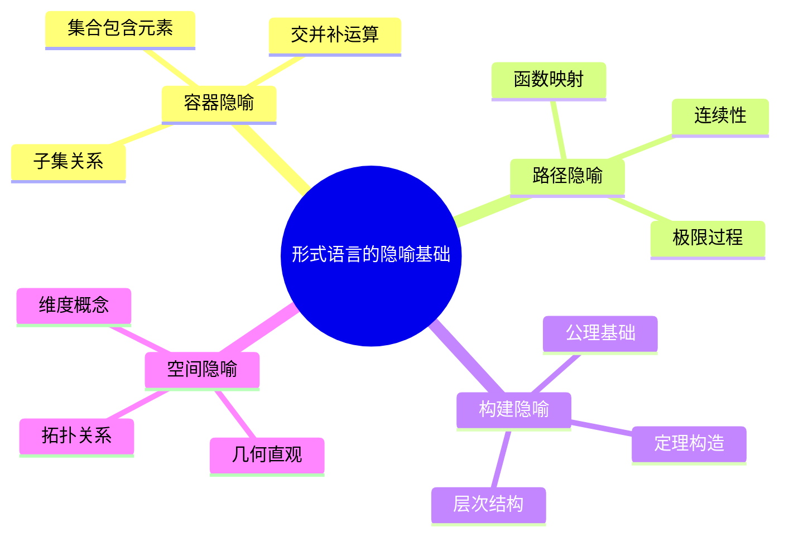
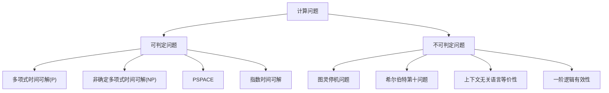
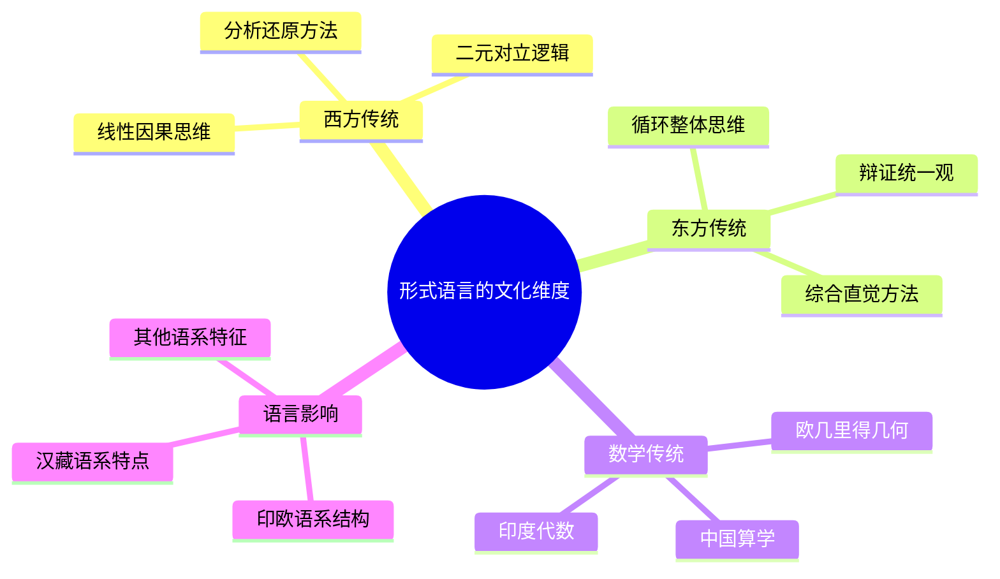
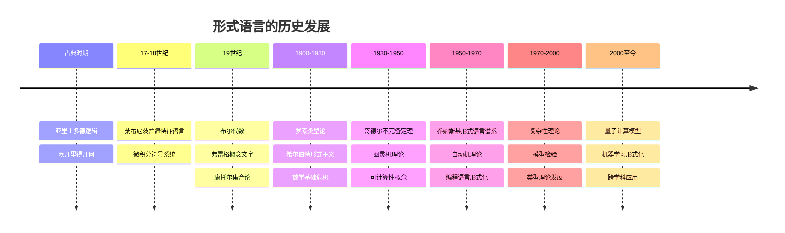
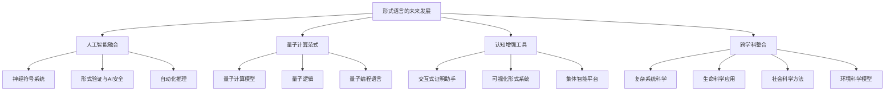

# 形式语言的综合批判分析：多维视角与跨学科整合

## 目录

- [形式语言的综合批判分析：多维视角与跨学科整合](#形式语言的综合批判分析多维视角与跨学科整合)
  - [目录](#目录)
  - [形式语言的理论基础与本质](#形式语言的理论基础与本质)
    - [形式语言的定义与特性](#形式语言的定义与特性)
    - [形式语言的层次结构与表达能力](#形式语言的层次结构与表达能力)
    - [形式语言的公理化与形式化](#形式语言的公理化与形式化)
  - [形式语言的跨学科理论关联](#形式语言的跨学科理论关联)
    - [形式语言与信息论的交互](#形式语言与信息论的交互)
    - [形式语言与模型论的深层关系](#形式语言与模型论的深层关系)
    - [自动机理论与计算边界](#自动机理论与计算边界)
    - [可计算性理论与递归论](#可计算性理论与递归论)
    - [表示论视角下的形式语言](#表示论视角下的形式语言)
    - [系统论与控制论的整合视角](#系统论与控制论的整合视角)
  - [形式语言的认知与哲学基础](#形式语言的认知与哲学基础)
    - [符号系统与认知表征](#符号系统与认知表征)
    - [形式语言的认知限制](#形式语言的认知限制)
    - [隐喻结构与形式思维](#隐喻结构与形式思维)
    - [本体论视角：形式对象的存在性质](#本体论视角形式对象的存在性质)
    - [认识论维度：形式知识的边界](#认识论维度形式知识的边界)
  - [形式语言的不完备性与限制](#形式语言的不完备性与限制)
    - [哥德尔不完备定理的多层次解读](#哥德尔不完备定理的多层次解读)
    - [图灵停机问题与可判定性边界](#图灵停机问题与可判定性边界)
    - [形式系统的自我指涉悖论](#形式系统的自我指涉悖论)
    - [复杂性理论与形式语言的计算限制](#复杂性理论与形式语言的计算限制)
  - [形式语言的社会与文化维度](#形式语言的社会与文化维度)
    - [形式语言与权力结构](#形式语言与权力结构)
    - [形式语言的文化嵌入性](#形式语言的文化嵌入性)
    - [形式语言与知识生产的政治学](#形式语言与知识生产的政治学)
  - [形式语言的历史发展与思想脉络](#形式语言的历史发展与思想脉络)
    - [古典时期的形式思维](#古典时期的形式思维)
    - [现代形式语言的奠基者](#现代形式语言的奠基者)
    - [20世纪的范式转换](#20世纪的范式转换)
    - [当代发展与多元化趋势](#当代发展与多元化趋势)
  - [形式语言的未来展望](#形式语言的未来展望)
    - [形式语言与人工智能的融合](#形式语言与人工智能的融合)
    - [量子计算与后经典形式语言](#量子计算与后经典形式语言)
    - [认知增强与形式语言的演化](#认知增强与形式语言的演化)
    - [跨学科整合的新范式](#跨学科整合的新范式)
  - [结论：形式语言的多维综合视角](#结论形式语言的多维综合视角)

## 形式语言的理论基础与本质

### 形式语言的定义与特性

形式语言本质上是一种精确定义的符号系统，由有限符号集合（字母表）上的字符串构成，这些字符串根据明确的形式规则（语法）生成。
与自然语言不同，形式语言具有无歧义性、精确性和形式化特征，使其成为数学、逻辑学和计算机科学的基础工具。

形式语言的核心特性包括：

- **精确性**：符号和规则明确定义，消除歧义
- **形式化**：操作基于符号形式而非内容
- **递归性**：通过有限规则生成无限复杂的结构
- **组合性**：复杂表达式由简单表达式组合而成
- **抽象性**：脱离具体内容的纯形式结构

形式语言的基本构成要素：



### 形式语言的层次结构与表达能力

乔姆斯基语言谱系提供了形式语言的层次分类，揭示了语法复杂性与表达能力之间的深层关系。
这一分类不仅是语言学的理论框架，也是计算理论的基础。

| 语言类型 | 文法特征 | 识别装置 | 表达能力 | 典型应用 |
|---------|---------|---------|---------|---------|
| 0型：无限制语言 | 任意形式规则 | 图灵机 | 可枚举集合 | 通用计算问题 |
| 1型：上下文相关语言 | αAβ→αγβ | 线性有界自动机 | 上下文依赖关系 | 自然语言部分特性 |
| 2型：上下文无关语言 | A→γ | 下推自动机 | 嵌套结构 | 编程语言语法 |
| 3型：正则语言 | A→aB或A→a | 有限状态自动机 | 有限状态模式 | 词法分析、模式匹配 |

这一层次结构揭示了重要的理论洞见：表达能力的增强伴随着计算复杂性的提高和可判定性的降低。
这种权衡关系是形式语言理论的核心发现，也是计算理论的基础原则。

### 形式语言的公理化与形式化

形式语言的公理化方法源于希尔伯特的形式主义项目，旨在通过明确的公理和推导规则建立自洽的形式系统。
公理化方法的核心步骤包括：

1. 确定基本符号和原始术语
2. 建立形成规则（定义合法表达式）
3. 选择公理（无需证明的基本命题）
4. 确立推导规则（从已知命题推导新命题）
5. 在系统内证明定理

公理化方法的优势在于其严格性和明确性，但同时也面临着哥德尔不完备定理揭示的根本限制。
这种张力构成了形式语言发展的内在动力，推动了替代性理论框架的探索，如直觉主义数学和构造主义逻辑。

## 形式语言的跨学科理论关联

### 形式语言与信息论的交互

形式语言与信息论在多个层面上存在深刻联系，共同构成了计算科学的理论基础。
这种关联主要体现在以下方面：

1. **编码与压缩**：形式语言提供了信息编码的理论框架，而信息论量化了编码效率。香农熵(H)衡量信息内容：

   ```math
   H(X) = -\sum_{i=1}^{n} p(x_i) \log_2 p(x_i)
   ```

   其中形式语言的冗余度与信息熵密切相关

2. **通信复杂性**：形式语言中的表达长度与信息论中的最小描述长度原理相关联

3. **信道容量与语言表达能力**：信息论中的信道容量概念可用于分析形式语言的表达极限

4. **随机过程与随机语言**：随机上下文无关语言将概率理论与形式语言结合，形成了概率形式语言理论

形式语言与信息论的整合产生了诸多重要应用，如数据压缩算法、错误检测与纠正码、密码学系统等。
这种整合也揭示了信息处理的基本限制，如无损压缩的极限与语言复杂度的关系。

### 形式语言与模型论的深层关系

模型论作为数理逻辑的分支，研究形式语言与其解释结构之间的关系，为形式语言提供了语义基础。
这种关系主要体现在：

1. **满足关系**：模型论定义了公式φ在结构A中被满足的条件(A ⊨ φ)，建立了语法与语义的桥梁

2. **完备性与紧致性**：哥德尔完备性定理表明，一阶逻辑中语法推导与语义蕴含等价：

   ```math
   T \vdash \varphi \iff T \models \varphi
   ```

3. **洛温海姆-斯科伦定理**：揭示了形式语言表达能力的局限，表明一阶理论无法区分无限基数

4. **范畴等价与同构**：不同形式系统之间的结构对应关系，揭示了形式语言的深层统一性

模型论不仅为形式语言提供了语义解释，也揭示了形式语言的表达限制，如无法在一阶逻辑中完全表征某些数学结构（如自然数标准模型）。
这些限制推动了更强大形式系统的发展，如二阶逻辑和无穷逻辑。



### 自动机理论与计算边界

自动机理论研究抽象计算机的数学模型，与形式语言理论构成了计算机科学的理论基础。
不同类型的自动机对应于乔姆斯基谱系中的不同语言类型，揭示了计算能力的层次结构：

1. **有限状态自动机(FSA)**：识别正则语言，计算能力最弱但效率最高
   - 状态转换函数: δ: Q × Σ → Q
   - 无法处理需要无限记忆的任务

2. **下推自动机(PDA)**：识别上下文无关语言，增加了栈内存
   - 状态转换函数: δ: Q × (Σ ∪ {ε}) × Γ → P(Q × Γ*)
   - 能处理嵌套结构但不能处理交叉依赖

3. **线性有界自动机(LBA)**：识别上下文相关语言，具有有限但可重写的线性内存

4. **图灵机(TM)**：识别递归可枚举语言，具有无限内存
   - 状态转换函数: δ: Q × Γ → Q × Γ × {L,R}
   - 图灵完备，能模拟任何算法

自动机理论揭示了形式语言与计算复杂性之间的内在联系，表明语法规则的复杂性直接决定了识别该语言所需的计算资源。
这一关联构成了复杂性理论的基础，也为算法设计提供了理论指导。

### 可计算性理论与递归论

可计算性理论（递归论）研究算法可解决问题的范围和限制，与形式语言理论密切相关。
这种关联主要体现在：

1. **可判定性**：形式语言L是可判定的，当且仅当存在算法能够对任意字符串确定其是否属于L
   - 停机问题的不可判定性证明了图灵机的计算极限
   - 许多形式语言问题（如上下文无关语言的等价性）被证明是不可判定的

2. **归约理论**：通过问题间的可计算变换建立复杂度层次
   - 多项式时间归约: `A ≤<sub>p</sub> B`
   - 图灵归约: `A ≤<sub>T</sub> B`

3. **算术层次结构**：将集合按照定义复杂度分类
   - `Σ<sub>0</sub>`和`Π<sub>0</sub>`类（递归集）
   - `Σ<sub>n</sub>`和`Π<sub>n</sub>`类（n阶量词交替）

4. **计算复杂度**：分析解决问题所需的计算资源
   - 时间复杂度类：P、NP、PSPACE等
   - 空间复杂度类：L、NL、PSPACE等

可计算性理论揭示了形式系统的根本限制，表明存在原则上无法通过算法解决的问题，如图灵停机问题和希尔伯特第十问题（丢番图方程的可解性）。
这些不可计算性结果与哥德尔不完备定理在本质上是一致的，都指向了形式方法的内在边界。



### 表示论视角下的形式语言

表示论(Representation Theory)研究抽象结构如何通过具体系统表示，为形式语言提供了重要的理论视角。
在这一框架下，形式语言可视为抽象概念结构的表示系统：

1. **同构表示**：保持结构关系的完美映射
   - 群表示理论中的同态映射: ρ: G → GL(V)
   - 形式语言中的语法同构与语义保持

2. **不完全表示**：捕捉部分结构特征的近似映射
   - 分布式表示与向量空间模型
   - 形式语言的统计近似

3. **多模态表示**：通过不同符号系统的互补表示
   - 形式符号与视觉图形的结合
   - 代数表达与几何直观的互补

表示论视角揭示了形式语言的双重本质：既是表示工具，也是被表示的对象。
这种双重性使形式语言成为元数学研究的核心对象，也为认知科学中的符号接地问题提供了理论框架。

### 系统论与控制论的整合视角

系统论与控制论为形式语言提供了动态系统和反馈机制的视角，拓展了传统的静态形式化观点：

1. **动态系统视角**：形式语言作为状态转换系统
   - 语法生成过程作为状态空间中的轨迹
   - 形式系统的演化与稳定性分析

2. **反馈控制机制**：形式系统中的自我调节
   - 元规则调整基本规则的反馈回路
   - 自适应形式系统与学习算法

3. **复杂性与涌现**：简单规则产生复杂行为
   - 元胞自动机与形式语言的关系
   - 复杂自适应系统中的形式规则演化

4. **信息流与计算**：系统间的信息传递与处理
   - 分布式计算模型与并行形式语言
   - 量子信息系统与量子形式语言

系统论与控制论视角将形式语言置于更广阔的动态框架中，强调了规则、结构与功能之间的相互作用，为理解复杂系统中的形式化过程提供了新的理论工具。



## 形式语言的认知与哲学基础

### 符号系统与认知表征

形式语言作为符号系统，与人类认知的表征机制密切相关。
认知科学研究表明，形式符号操作与大脑的信息处理机制存在深层联系：

1. **双重编码理论**：人类思维同时使用符号编码和模拟编码
   - 形式语言对应符号编码系统
   - 视觉和空间思维对应模拟编码系统

2. **心理表征的层次结构**：
   - 感知层：直接感官输入
   - 概念层：抽象类别和关系
   - 符号层：形式化表示和操作

3. **认知资源分配**：
   - 形式语言减轻工作记忆负担
   - 外部表征系统扩展认知容量
   - 认知负荷理论与形式表示复杂度

神经科学研究显示，形式语言处理激活了大脑的多个区域，特别是前额叶皮层（抽象思维）、顶叶（空间关系）和颞叶（语义处理）。
这种分布式激活模式表明，即使是最抽象的形式思维也依赖于多模态神经网络的协同工作。

### 形式语言的认知限制

尽管形式语言是强大的思维工具，但它也受到人类认知能力的根本限制：

1. **工作记忆容量**：人类工作记忆的有限容量（7±2项）限制了无辅助工具时能处理的形式复杂度

2. **认知经济性原则**：人脑倾向于使用启发式而非完整形式推理，导致在复杂形式系统中的推理错误

3. **模糊容忍度**：人类思维自然适应模糊性和不确定性，而形式语言要求精确性，造成认知不协调

4. **概念整体性**：人类概念往往是整体性的，难以完全分解为形式成分，导致形式化过程中的信息损失

这些认知限制解释了为什么纯形式系统在实际应用中常需要与直觉思维相结合，也说明了为什么数学发现过程通常先有直觉洞察，后有形式证明。

### 隐喻结构与形式思维

认知语言学研究表明，即使是最抽象的形式思维也深植于身体化经验和概念隐喻之中。莱考夫和努涅兹的研究揭示了数学形式语言中的核心隐喻：

1. **容器隐喻**：集合论基于容器经验
   - "元素在集合中"对应物体在容器中
   - "子集"对应容器嵌套关系

2. **路径隐喻**：函数概念基于路径和映射经验
   - "函数映射"对应空间路径
   - "函数组合"对应路径连接

3. **构建隐喻**：数学结构基于物理构建经验
   - "基础"和"构造"术语的广泛使用
   - 自底向上的公理化方法

4. **空间隐喻**：拓扑概念基于空间经验
   - "邻近"、"连续"等概念的空间根源
   - 高维空间通过低维空间经验理解

这些隐喻不仅是教学工具，更是形式思维的认知基础。
即使是最精确的形式系统，其理解和发展也离不开这些根植于身体经验的隐喻结构。



### 本体论视角：形式对象的存在性质

形式语言引发的核心本体论问题是：形式对象的存在性质是什么？对此存在多种哲学立场：

1. **柏拉图主义**：数学对象客观存在于独立的抽象领域
   - 形式语言发现而非创造数学真理
   - 代表人物：哥德尔、弗雷格

2. **形式主义**：数学是无解释符号的形式游戏
   - 形式语言是符号操作的规则系统
   - 代表人物：希尔伯特

3. **直觉主义**：数学对象是心智构造
   - 形式语言表达心智构造过程
   - 代表人物：布劳威尔

4. **结构主义**：数学研究抽象结构关系
   - 形式语言描述结构而非对象
   - 代表人物：布尔巴基学派

5. **拟名论**：数学对象仅是语言构造
   - 形式符号无实在指称
   - 代表人物：古德曼

这些立场影响了形式语言的发展方向和方法论选择。
例如，直觉主义拒绝排中律，导致构造性数学的发展；而结构主义促进了范畴论作为统一数学框架的兴起。

### 认识论维度：形式知识的边界

形式语言作为知识工具面临的认识论问题包括：

1. **确定性与证明**：
   - 形式证明提供确定性知识的理想
   - 哥德尔不完备定理揭示了这一理想的内在限制

2. **先验性与经验性**：
   - 形式知识传统上被视为先验的
   - 现代观点认为形式系统选择受经验考量影响

3. **直觉与形式化之间的张力**：
   - 数学发现通常始于直觉洞察
   - 形式化是后续的严格化过程
   - 波兰尼的"默会知识"概念解释了无法完全形式化的专家知识

4. **形式系统的选择问题**：
   - 多种不同的形式系统可以表达相同领域
   - 系统选择涉及简洁性、表达力和实用性等价值判断

这些认识论问题表明，形式知识不是绝对的，而是受到认知能力、选择标准和实践目标的制约。
形式语言的价值不在于提供绝对真理，而在于提供清晰的思考框架和有效的问题解决工具。

## 形式语言的不完备性与限制

### 哥德尔不完备定理的多层次解读

哥德尔不完备定理是20世纪数学基础研究的里程碑，对形式语言的理解产生了革命性影响。
这一定理可以从多个层次进行解读：

1. **技术层面**：
   - **第一不完备定理**：任何包含基本算术的一致形式系统中，存在既不能证明也不能反驳的命题
   - **第二不完备定理**：这样的系统不能证明自身的一致性

2. **数学哲学层面**：
   - 挑战了希尔伯特形式主义纲领
   - 表明数学真理超越了任何特定形式系统
   - 揭示了公理化方法的内在限制

3. **认知科学层面**：
   - 暗示人类思维可能超越形式化
   - 与卢卡斯-彭罗斯论证相关，质疑强人工智能的可能性
   - 提示了意识与形式系统之间的潜在差异

4. **系统论层面**：
   - 揭示了自指系统的内在悖论性
   - 表明足够复杂的系统无法完全自我描述
   - 与复杂系统的不可约性相关联

哥德尔定理的证明方法本身也具有深远影响，特别是通过哥德尔编码将元数学陈述转换为算术陈述的技术，为后续的计算理论和人工智能研究提供了重要工具。

### 图灵停机问题与可判定性边界

图灵停机问题是计算理论中的基础性不可判定问题，与形式语言理论密切相关：

1. **问题定义**：不存在算法能够判断任意程序和输入组合是否会终止

2. **证明思路**：
   - 假设存在停机检测器H
   - 构造自我应用程序D，当且仅当H预测它会终止时进入无限循环
   - 当D应用于自身时产生矛盾

3. **与形式语言的关系**：
   - 停机问题等价于判定某些形式语言成员资格的问题
   - 特别是0型语言（递归可枚举语言）的成员资格问题一般是不可判定的

4. **不可判定性的扩展**：
   - **莱斯定理**：程序的非平凡语义性质通常是不可判定的
   - **后定理**：上下文无关语言等价性问题是不可判定的
   - **希尔伯特第十问题**：丢番图方程可解性的不可判定性

5. **计算复杂性层次**：
   - 不可判定问题（如停机问题）
   - 可判定但非基本可行问题（如指数时间复杂度问题）
   - 基本可行问题（如多项式时间复杂度问题）

图灵停机问题的不可判定性与哥德尔不完备定理在本质上是一致的，都指向了形式方法的根本限制。
这种限制不仅是技术性的，更揭示了知识和计算的深层边界。



### 形式系统的自我指涉悖论

形式系统面临的核心挑战之一是自我指涉问题，当系统试图描述自身时往往导致悖论：

1. **经典逻辑悖论**：
   - **罗素悖论**：不包含自身的集合的集合是否包含自身？
   - **理发师悖论**：为所有不自己刮胡子的人刮胡子的理发师是否给自己刮胡子？
   - **说谎者悖论**："这个句子是假的"的真值问题

2. **形式系统中的自我指涉**：
   - **哥德尔句**：构造"这个命题在系统中不可证明"的命题
   - **克莱尼的不动点定理**：对任何程序转换，存在等价于其自身转换的程序
   - **塔尔斯基不可定义性定理**：真理谓词不能在系统内部定义

3. **自我指涉的认知意义**：
   - 反思性思维需要某种形式的自我指涉
   - 意识可能涉及自我模型的构建
   - 霍夫施塔特的"奇异回路"概念连接了自我指涉与意识

自我指涉悖论揭示了形式系统的内在张力：足够强大的系统必然面临自指带来的不一致性风险。
这一洞察不仅影响了数学基础研究，也深刻影响了认知科学和人工智能领域对思维本质的理解。

### 复杂性理论与形式语言的计算限制

复杂性理论研究解决问题所需的计算资源，为形式语言的实际应用提供了重要边界：

1. **时间复杂性类**：
   - **P类**：多项式时间可解问题
   - **NP类**：非确定性多项式时间可解问题
   - **NP完全**：NP中最难的问题类（如SAT问题）
   - **EXPTIME**：指数时间可解问题

2. **空间复杂性类**：
   - **L类**：对数空间可解问题
   - **PSPACE**：多项式空间可解问题
   - **EXPSPACE**：指数空间可解问题

3. **形式语言识别的复杂性**：
   - 正则语言：线性时间，常数空间
   - 上下文无关语言：立方时间（通用情况）
   - 上下文相关语言：指数时间（最坏情况）
   - 递归可枚举语言：可能不可判定

4. **近似算法与启发式方法**：
   - 对于NP难问题的实用解决方案
   - 牺牲精确性换取效率
   - 概率形式语言与随机算法

复杂性理论的发展表明，即使问题在理论上可解，实际计算资源的限制也可能使其在实践中不可行。
这种"实用不可计算性"对形式语言的应用构成了重要约束，推动了近似方法和启发式算法的发展。

## 形式语言的社会与文化维度

### 形式语言与权力结构

形式语言不仅是中立的技术工具，也嵌入在特定的社会权力结构中：

1. **知识获取的障碍**：
   - 形式语言的高门槛限制了知识获取
   - 专业术语和形式符号作为学科边界的标志
   - 形式化程度与学科权威性的关联

2. **知识合法性的认定**：
   - 形式表达作为科学合法性的标志
   - 非形式化知识体系的边缘化
   - 福柯的"知识-权力"关系在形式科学中的体现

3. **社会排除机制**：
   - 形式语言能力的不平等分布
   - 教育系统中的形式思维偏好
   - 性别、种族和阶级因素对形式语言获取的影响

4. **技术控制与民主参与**：
   - 算法和形式系统在社会决策中的角色
   - 形式语言的透明度与公众参与
   - "黑箱"问题：不透明的形式系统与民主监督

批判性分析表明，形式语言既可以作为解放工具，提供清晰思考的框架；
也可以作为排除机制，强化现有的知识权力结构。
认识这种双重性对于形式语言的负责任发展和应用至关重要。

### 形式语言的文化嵌入性

形式语言虽然追求普遍性，但实际上深受特定文化背景的影响：

1. **文化隐喻的影响**：
   - 西方形式语言中的线性因果隐喻
   - 东方思维传统中的循环和整体性概念
   - 不同文化对矛盾处理方式的差异（排中律与中道思想）

2. **语言结构的影响**：
   - 印欧语系的主谓结构与形式逻辑的发展
   - 汉藏语系的主题-评论结构与不同推理模式
   - 语言相对论在形式思维中的体现

3. **数学传统的多样性**：
   - 欧几里得几何与中国算学的不同发展路径
   - 印度数学的代数传统与希腊几何传统
   - 不同文明的计数系统与数学思维

4. **跨文化交流的挑战与机遇**：
   - 形式语言作为跨文化交流的桥梁
   - 不同文化视角对形式语言发展的贡献
   - 多元文化背景下的形式语言教育

认识形式语言的文化嵌入性有助于我们避免文化中心主义，促进形式思维的多元发展，也为解决复杂问题提供更丰富的思维工具。



### 形式语言与知识生产的政治学

形式语言在知识生产和传播中的政治维度包括：

1. **学科边界的构建与维护**：
   - 形式语言作为学科身份标志
   - 专业术语与符号系统的排他性
   - 跨学科交流的形式语言障碍

2. **知识殖民主义问题**：
   - 西方形式系统的全球扩张
   - 本土知识体系的边缘化
   - 知识生产中心与外围的权力不平衡

3. **教育政治学**：
   - 形式思维在教育评价中的特权地位
   - 不同认知风格学习者的系统性不利
   - 形式语言教育的社会分层效应

4. **技术治理与算法政治**：
   - 形式系统在社会治理中的应用
   - 算法决策的价值预设与政治后果
   - 形式模型中的隐含意识形态假设

批判性研究表明，形式语言不是价值中立的工具，而是嵌入在特定历史、社会和政治语境中的知识实践。
认识这一点有助于发展更具反思性和包容性的形式语言应用。

## 形式语言的历史发展与思想脉络

### 古典时期的形式思维

形式思维的起源可追溯至古代文明，不同文化传统发展出各自的形式化方法：

1. **希腊传统**：
   - **亚里士多德**：形式逻辑的奠基者，三段论系统
   - **欧几里得**：《几何原本》建立公理化方法
   - **斯多葛学派**：发展命题逻辑

2. **印度传统**：
   - **因明学**：古印度形式逻辑系统
   - **数论与代数**：早期的数学形式化
   - **梵语语法学**：帕尼尼的形式语法系统

3. **中国传统**：
   - **名家**：公孙龙子的逻辑思想
   - **墨家**：名辩思想与逻辑推理
   - **九章算术**：系统化数学方法

4. **阿拉伯传统**：
   - 代数学的形式化发展
   - 逻辑学对亚里士多德传统的扩展
   - 算法概念的早期发展

这些不同传统反映了形式思维的多元起源，也表明形式化是人类认知的普遍倾向，尽管其具体表现形式受文化背景影响。

### 现代形式语言的奠基者

现代形式语言的发展始于17-19世纪，关键人物包括：

1. **莱布尼茨(1646-1716)**：
   - 普遍特征语言(characteristica universalis)的设想
   - 形式逻辑的代数化尝试
   - 微积分符号系统的创立

2. **布尔(1815-1864)**：
   - 逻辑代数化的开创者
   - 《思维的规律》建立布尔代数
   - 为形式逻辑提供数学基础

3. **弗雷格(1848-1925)**：
   - 现代数理逻辑的奠基者
   - 《概念文字》创立谓词逻辑
   - 函数、论元与量词的形式化

4. **康托尔(1845-1918)**：
   - 集合论的创立者
   - 无穷集合的形式化处理
   - 基数理论与连续统假设

5. **皮亚诺(1858-1932)**：
   - 自然数公理化
   - 数学符号系统的改革
   - 形式化数学语言的推广

这些先驱者的工作将形式语言从哲学思辨转向精确的数学工具，为20世纪形式语言理论的蓬勃发展奠定了基础。

### 20世纪的范式转换

20世纪是形式语言理论的黄金时期，经历了多次重要的范式转换：

1. **数学基础危机与应对(1900-1930s)**：
   - **罗素**：类型论解决集合论悖论
   - **希尔伯特**：形式主义纲领
   - **布劳威尔**：直觉主义数学

2. **不完备性与计算理论突破(1930s-1940s)**：
   - **哥德尔**：不完备定理的证明
   - **图灵**：计算机理论基础
   - **丘奇**：λ演算与可计算性

3. **形式语言理论的系统化(1950s-1960s)**：
   - **乔姆斯基**：形式语言层次结构
   - **巴科斯**：BNF表示法
   - **克莱尼**：正则表达式理论

4. **复杂性理论与逻辑扩展(1970s-1980s)**：
   - **库克与卡普**：NP完全性理论
   - **克里普克**：可能世界语义学
   - **科恩**：强制法与集合论独立性

这一时期的重大突破不仅深化了对形式语言本质的理解，也为计算机科学的发展提供了理论基础，形成了现代形式语言理论的核心框架。

### 当代发展与多元化趋势

近几十年来，形式语言理论呈现出多元化发展趋势：

1. **计算机科学中的应用与扩展**：
   - 程序语言理论与形式语义学
   - 形式验证与模型检验
   - 类型理论与函数式编程

2. **认知科学视角的整合**：
   - 认知语言学对形式语言的重新解读
   - 神经科学对形式思维的实证研究
   - 体现认知理论对抽象形式的解释

3. **跨学科融合**：
   - 量子逻辑与量子计算
   - 生物信息学中的形式语言应用
   - 社会复杂系统的形式化模型

4. **形式方法的多元化**：
   - 模糊逻辑与多值逻辑
   - 非单调推理与默认逻辑
   - 概率形式语言与贝叶斯方法

当代形式语言理论不再局限于传统的数学和逻辑领域，而是与多学科交叉融合，应对更复杂的理论和实践挑战。
这种多元化趋势反映了形式语言作为思维工具的适应性和生命力。



## 形式语言的未来展望

### 形式语言与人工智能的融合

形式语言与人工智能的融合正在创造新的研究范式和应用领域：

1. **神经符号系统**：
   - 结合神经网络的连接主义与符号系统的形式推理
   - 可解释AI中的形式化表示
   - 大型语言模型与形式推理的结合

2. **形式验证与AI安全**：
   - AI系统的形式化规范
   - 关键AI系统的验证方法
   - 形式保证与道德约束

3. **程序合成与自动化推理**：
   - 从规范自动生成程序
   - 定理证明中的机器学习辅助
   - 形式化数学知识库

4. **认知架构的形式化**：
   - 认知过程的计算模型
   - 心智理论的形式表示
   - 意识与反思能力的形式化尝试

这一融合趋势不仅推动了AI技术的发展，也为理解人类认知提供了新视角，
同时也引发了关于AI系统可解释性、可验证性和安全性的重要讨论。

### 量子计算与后经典形式语言

量子计算的发展正在催生新型形式语言范式：

1. **量子计算模型**：
   - 量子图灵机与量子电路模型
   - 量子复杂性类（BQP等）
   - 量子算法的形式化描述

2. **量子逻辑与量子信息理论**：
   - 非布尔逻辑结构
   - 量子概率与量子信息度量
   - 量子纠缠的形式化表示

3. **量子编程语言**：
   - 量子算法的高级抽象
   - 量子-经典混合计算模型
   - 量子错误纠正的形式化

4. **量子机器学习的形式基础**：
   - 量子特征空间
   - 量子核方法
   - 量子神经网络模型

量子计算不仅扩展了计算能力边界，也挑战了传统形式语言的基本假设，如确定性、布尔逻辑和经典概率。
这一领域的发展可能导致形式语言理论的根本性重构。

### 认知增强与形式语言的演化

形式语言作为认知工具正在经历技术驱动的演化：

1. **增强认知工具**：
   - 交互式证明助手
   - 可视化形式系统
   - 自适应形式语言界面

2. **形式语言教育的转型**：
   - 体现认知方法在形式思维教学中的应用
   - 多模态学习环境
   - 个性化形式语言学习路径

3. **集体智能与协作形式化**：
   - 大规模协作证明项目
   - 开放形式知识库
   - 众包形式化与验证

4. **生物启发的形式系统**：
   - 神经形态计算的形式化
   - 进化算法与自适应形式语言
   - 生物计算模型的形式表示

这些发展趋势表明，形式语言不仅是静态的符号系统，也是动态演化的认知工具，其发展方向越来越多地考虑人类认知特性和社会协作需求。

### 跨学科整合的新范式

形式语言的未来发展将更加注重跨学科整合：

1. **复杂系统科学的形式化**：
   - 复杂网络的形式表示
   - 涌现现象的形式化描述
   - 自组织系统的计算模型

2. **生命科学与形式语言**：
   - 生物信息学的形式语言工具
   - 基因调控网络的形式模型
   - 系统生物学的计算表示

3. **社会科学的形式化方法**：
   - 社会复杂性的形式模型
   - 经济行为的形式化表示
   - 社会网络动力学的计算分析

4. **环境与可持续性科学**：
   - 气候模型的形式化
   - 生态系统动力学的表示
   - 可持续性指标的形式化框架

这种跨学科整合不仅扩展了形式语言的应用领域，也丰富了形式语言本身的理论基础，推动了更具包容性和适应性的形式化方法的发展。



## 结论：形式语言的多维综合视角

形式语言作为人类智识活动的产物，既是严格的符号系统，也是深刻的认知工具，更是复杂的社会文化实践。对形式语言的综合批判分析揭示了以下核心洞见：

1. **理论多元性**：形式语言不仅与逻辑学和数学紧密相连，也与信息论、模型论、自动机理论、可计算性理论、表示论、系统论和控制论等多个理论框架相互交织，形成了丰富的理论生态系统。

2. **认知双重性**：形式语言既是认知的产物，也是塑造认知的工具。它既受限于人类认知能力的局限，也扩展了人类的思维边界，这种辩证关系构成了形式思维发展的动力。

3. **哲学深度**：形式语言涉及深刻的本体论和认识论问题，不同哲学立场（如柏拉图主义、形式主义、直觉主义等）对形式语言的理解和发展产生了深远影响。

4. **内在限制**：哥德尔不完备定理、图灵停机问题等揭示了形式系统的根本限制，表明纯形式化方法存在内在边界，这些限制不仅具有技术意义，也有深刻的哲学和认知含义。

5. **社会嵌入性**：形式语言不是价值中立的工具，而是嵌入在特定社会文化语境中的知识实践，涉及权力结构、文化传统和知识政治等维度。

6. **历史动态性**：形式语言有着丰富多元的历史发展脉络，不同时期和文化背景下的形式思维传统相互影响，共同塑造了当代形式语言的多元格局。

7. **未来开放性**：形式语言正在经历技术驱动的快速演化，与人工智能、量子计算等新兴领域的融合正在创造新的可能性，同时也面临新的挑战。

形式语言的真正价值不在于其完美性或普遍性，而在于它作为人类认知工具的有效性和启发性。

认识形式语言的多维性质和内在限制，
有助于我们更明智地应用形式方法，
也有助于我们更深入地理解人类思维的本质和边界。

在未来发展中，形式语言理论需要更加开放地吸收多元文化传统和跨学科视角，
更加深入地探索形式思维与其他认知模式的互补关系，
更加负责任地考虑形式化实践的社会和伦理维度。
