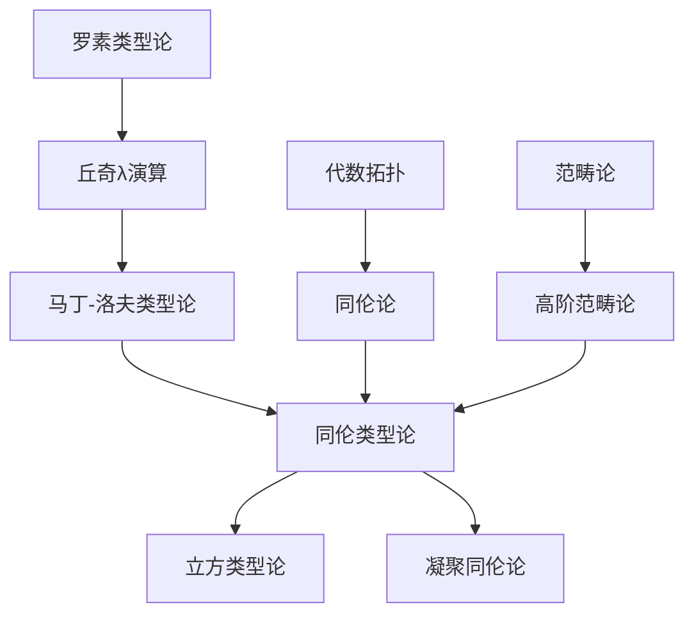
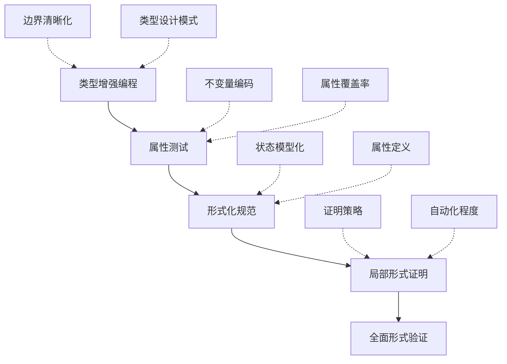

# 同伦类型论(HoTT)及其在软件工程中的应用：理论与实践的桥梁

## 目录

- [同伦类型论(HoTT)及其在软件工程中的应用：理论与实践的桥梁](#同伦类型论hott及其在软件工程中的应用理论与实践的桥梁)
  - [目录](#目录)
  - [1. 引言](#1-引言)
    - [1.1 研究背景与意义](#11-研究背景与意义)
    - [1.2 文档结构与阅读指南](#12-文档结构与阅读指南)
  - [2. 同伦类型论基础](#2-同伦类型论基础)
    - [2.1 核心概念解析](#21-核心概念解析)
      - [2.1.1 类型与项](#211-类型与项)
      - [2.1.2 恒等类型与路径](#212-恒等类型与路径)
      - [2.1.3 高阶归纳类型(HITs)](#213-高阶归纳类型hits)
      - [2.1.4 单价性公理](#214-单价性公理)
    - [2.2 数学基础的多维视角](#22-数学基础的多维视角)
      - [2.2.1 历史发展线索](#221-历史发展线索)
      - [2.2.2 哲学意义](#222-哲学意义)
      - [2.2.3 同伦层次理论](#223-同伦层次理论)
    - [2.3 与其他形式化方法的比较](#23-与其他形式化方法的比较)
  - [3. 理论到实践的转化框架](#3-理论到实践的转化框架)
    - [3.1 概念映射原则](#31-概念映射原则)
    - [3.2 形式化程度级别](#32-形式化程度级别)
      - [3.2.1 形式化程度分级](#321-形式化程度分级)
      - [3.2.2 各级别转化示例](#322-各级别转化示例)
    - [3.3 实践应用的复杂性分析](#33-实践应用的复杂性分析)
      - [3.3.1 理论复杂性与学习曲线](#331-理论复杂性与学习曲线)
      - [3.3.2 工具链成熟度](#332-工具链成熟度)
      - [3.3.3 工程约束与权衡](#333-工程约束与权衡)
  - [4. 软件工程中的HoTT应用](#4-软件工程中的hott应用)
    - [4.1 系统架构设计](#41-系统架构设计)
      - [4.1.1 架构结构的类型表达](#411-架构结构的类型表达)
      - [4.1.2 架构演化与重构](#412-架构演化与重构)
      - [4.1.3 架构模式的HoTT解读](#413-架构模式的hott解读)
    - [4.2 编程语言与类型系统](#42-编程语言与类型系统)
      - [4.2.1 现代语言中的HoTT概念](#421-现代语言中的hott概念)
      - [4.2.2 依赖类型在工程中的实际应用](#422-依赖类型在工程中的实际应用)
      - [4.2.3 下一代编程语言的启示](#423-下一代编程语言的启示)
    - [4.3 形式验证与质量保障](#43-形式验证与质量保障)
      - [4.3.1 类型驱动的软件验证](#431-类型驱动的软件验证)
      - [4.3.2 不变量作为类型的实际应用](#432-不变量作为类型的实际应用)
      - [4.3.3 形式化方法的实施策略](#433-形式化方法的实施策略)
  - [5. 分布式系统的HoTT模型](#5-分布式系统的hott模型)
    - [5.1 一致性模型的形式化](#51-一致性模型的形式化)
      - [5.1.1 一致性级别的类型层次](#511-一致性级别的类型层次)
      - [5.1.2 CAP定理的形式化证明](#512-cap定理的形式化证明)
      - [5.1.3 共识算法的路径解释](#513-共识算法的路径解释)
    - [5.2 分布式架构模式](#52-分布式架构模式)
      - [5.2.1 微服务架构的类型解读](#521-微服务架构的类型解读)
      - [5.2.2 事件溯源与CQRS的路径模型](#522-事件溯源与cqrs的路径模型)
      - [5.2.3 反应式系统的同伦解释](#523-反应式系统的同伦解释)
    - [5.3 容错与恢复机制](#53-容错与恢复机制)
      - [5.3.1 故障模型的类型化](#531-故障模型的类型化)
      - [5.3.2 容错策略作为路径替代](#532-容错策略作为路径替代)
      - [5.3.3 幂等性与重试机制](#533-幂等性与重试机制)
  - [6. 实际案例研究](#6-实际案例研究)
    - [6.1 分布式数据库一致性验证](#61-分布式数据库一致性验证)
      - [6.1.1 案例背景](#611-案例背景)
      - [6.1.2 形式化模型](#612-形式化模型)
      - [6.1.3 一致性验证](#613-一致性验证)
      - [6.1.4 实际应用与结果](#614-实际应用与结果)
    - [6.2 微服务系统的形式化建模](#62-微服务系统的形式化建模)
      - [6.2.1 案例背景](#621-案例背景)
      - [6.2.2 系统建模](#622-系统建模)
      - [6.2.3 使用属性测试验证不变量](#623-使用属性测试验证不变量)
      - [6.2.4 实际收益](#624-实际收益)
    - [6.3 智能合约安全性证明](#63-智能合约安全性证明)
      - [6.3.1 案例背景](#631-案例背景)
      - [6.3.2 形式化模型](#632-形式化模型)
      - [6.3.3 安全性验证](#633-安全性验证)
      - [6.3.4 发现的问题与改进](#634-发现的问题与改进)
      - [6.3.5 结论和经验](#635-结论和经验)
  - [7. 工程实践指南](#7-工程实践指南)
    - [7.1 工具链建设](#71-工具链建设)
      - [7.1.1 工具生态概览](#711-工具生态概览)
      - [7.1.2 集成开发环境搭建](#712-集成开发环境搭建)
      - [7.1.3 工具选择决策框架](#713-工具选择决策框架)
    - [7.2 渐进式应用策略](#72-渐进式应用策略)
      - [7.2.1 起点选择](#721-起点选择)
      - [7.2.2 增量应用路径](#722-增量应用路径)
      - [7.2.3 成功案例与经验教训](#723-成功案例与经验教训)
    - [7.3 团队能力培养](#73-团队能力培养)
      - [7.3.1 学习路径设计](#731-学习路径设计)
      - [7.3.2 实施培训策略](#732-实施培训策略)
      - [7.3.3 组织结构与角色](#733-组织结构与角色)
  - [8. 前沿研究与未来展望](#8-前沿研究与未来展望)
    - [8.1 立方类型论与计算内容](#81-立方类型论与计算内容)
      - [8.1.1 核心创新](#811-核心创新)
      - [8.1.2 实现与工具](#812-实现与工具)
      - [8.1.3 未来研究方向](#813-未来研究方向)
    - [8.2 自动化证明与编程语言发展](#82-自动化证明与编程语言发展)
      - [8.2.1 自动化证明趋势](#821-自动化证明趋势)
      - [8.2.2 编程语言影响](#822-编程语言影响)
      - [8.2.3 工业应用潜力](#823-工业应用潜力)
    - [8.3 量子计算与新兴领域](#83-量子计算与新兴领域)
      - [8.3.1 量子计算与HoTT](#831-量子计算与hott)
      - [8.3.2 区块链与形式验证](#832-区块链与形式验证)
      - [8.3.3 人工智能与形式保证](#833-人工智能与形式保证)
  - [9. 结论与反思](#9-结论与反思)
    - [9.1 成就与局限](#91-成就与局限)
      - [9.1.1 主要成就](#911-主要成就)
      - [9.1.2 HoTT建模与验证](#912-hott建模与验证)
      - [9.1.3 安全属性验证](#913-安全属性验证)
    - [9.2 成果与局限性](#92-成果与局限性)
  - [10. 评估与反思](#10-评估与反思)
    - [10.1 HoTT应用的成熟度评估](#101-hott应用的成熟度评估)
    - [10.2 未来发展方向](#102-未来发展方向)
  - [11. 结论与展望](#11-结论与展望)
  - [附录](#附录)
    - [A. HoTT核心概念图谱](#a-hott核心概念图谱)
    - [B. 实践应用路径图](#b-实践应用路径图)
    - [C. 学习路径建议](#c-学习路径建议)
    - [D. 推荐资源](#d-推荐资源)

## 1. 引言

### 1.1 研究背景与意义

同伦类型论(Homotopy Type Theory, HoTT)作为21世纪数学基础研究的重要突破，将抽象代数中的同伦理论与计算机科学中的类型论结合，创造了一个既具有数学严谨性又具有计算解释的理论框架。
这一理论具有双重意义：

- **数学基础方面**：提供了集合论之外的另一种建立数学体系的方式，特别适合处理同构/等价关系
- **计算科学方面**：为程序验证、类型系统设计和形式化方法提供了新工具

然而，理论与实践之间始终存在鸿沟。

本文旨在系统性地探索如何将HoTT的抽象概念转化为软件工程实践中的有效工具，既尊重理论的精确性，又考虑工程应用的现实约束。

### 1.2 文档结构与阅读指南

本文档采用循序渐进的结构，适合不同背景的读者：

- **理论研究者**：可重点关注第2、8章的理论基础与前沿发展
- **形式化方法实践者**：建议关注第3、4、5章的转化框架与应用模型
- **软件工程师**：可直接从第6、7章的实际案例与实践指南入手
- **跨领域研究者**：第9章的反思与第3章的转化框架可能最具价值

【阅读难度指引】：

| 章节 | 数学背景要求 | 工程经验要求 | 适合读者 |
|-----|------------|------------|---------|
| 1-2 | ★★★☆☆ | ★☆☆☆☆ | 理论研究者、计算机科学学生 |
| 3-5 | ★★☆☆☆ | ★★★☆☆ | 形式化方法从业者、架构师 |
| 6-7 | ★☆☆☆☆ | ★★★★☆ | 软件工程师、技术管理者 |
| 8-9 | ★★☆☆☆ | ★★☆☆☆ | 所有对前沿技术感兴趣的读者 |

## 2. 同伦类型论基础

### 2.1 核心概念解析

同伦类型论建立在以下核心概念之上：

#### 2.1.1 类型与项

在HoTT中，类型(Type)和项(Term)是基本单元：

- **类型**：可理解为集合、空间或命题
- **项**：类型中的元素、空间中的点或命题的证明

形式记法：`a : A` 表示"a是类型A的一个项"。

这一概念实际上拓展了编程语言中的类型概念，但增加了更丰富的内涵。

#### 2.1.2 恒等类型与路径

恒等类型(Identity Type)是HoTT最具特色的概念：

- 对于任何类型`A`的两个项`a,b:A`，存在恒等类型`Id_A(a,b)`或记作`a =_A b`
- 恒等类型的项代表"a等于b的证明"，或从a到b的路径
- 自反性：任何`a:A`都有规范路径`refl_a : Id_A(a,a)`

**实际意义**：恒等类型提供了处理"相等"概念的精确方式，远超传统数学中"="的表达能力。

#### 2.1.3 高阶归纳类型(HITs)

高阶归纳类型允许我们不仅定义类型的构造子，还可以定义其路径构造子：

```math
数据类型 Circle :=
  | base : Circle                 // 点构造子
  | loop : base =_{Circle} base   // 路径构造子
```

这使得我们可以直接在类型系统中表达拓扑空间，而无需通过复杂的编码。

#### 2.1.4 单价性公理

单价性公理(Univalence Axiom)是HoTT的核心原则，可表述为：

> "类型的相等就是类型的等价"

形式化：对于任意类型A和B，从`A = B`到`A ≃ B`的函数是等价的。

**价值**：单价性解决了数学中长期存在的"同构但不相等"的问题，使得数学结构可以直接按等价性处理。

### 2.2 数学基础的多维视角

#### 2.2.1 历史发展线索

同伦类型论的发展可追溯至多条学术脉络的交汇：



关键转折点是沃沃德卡(Voevodsky)在2005年左右发现类型论中的恒等类型可以被解释为空间中的路径，将这两个领域联系起来。

#### 2.2.2 哲学意义

HoTT在数学哲学上有深远影响：

- **构造主义视角**：HoTT本质上是构造性的，每个证明都有计算内容
- **结构主义实践**：通过单价性公理使"结构即一切"成为形式理论的核心
- **本体论重思**：挑战了集合作为数学基础的传统观念

#### 2.2.3 同伦层次理论

HoTT引入了h-level(同伦层次)概念，精确刻画类型的复杂度：

| h-level | 数学对应 | 描述 | 例子 |
|---------|---------|------|------|
| -2 | 收缩类型 | 最多有一个元素 | 单元类型`Unit` |
| -1 | 命题 | 所有元素都等价 | 逻辑命题 |
| 0 | 集合 | 元素间的等价是命题 | 自然数`ℕ` |
| 1 | 1-群胚 | 路径空间形成集合 | 基本群 |
| n+1 | n+1-群胚 | n阶路径空间形成n-群胚 | 高阶同伦群 |

这种分层统一了传统数学(主要关注h-level ≤ 0)和高阶同伦论(关注所有h-level)。

### 2.3 与其他形式化方法的比较

为了更好地理解HoTT的独特价值，下面将其与其他常见的形式化方法进行比较：

| 方法 | 理论基础 | 主要优势 | 主要局限 | 典型应用领域 |
|-----|---------|---------|---------|------------|
| HoTT | 类型论+同伦论 | 处理等价关系、高阶抽象、直观几何理解 | 工具支持有限、学习曲线陡峭 | 数学基础、抽象系统验证 |
| TLA+ | 集合论+时序逻辑 | 直观、工具成熟、适合状态系统 | 表达高阶概念复杂、无类型 | 分布式算法、协议验证 |
| Coq | 类型论 | 成熟工具链、强表达力、可提取代码 | 学习难度大、自动化程度有限 | 程序验证、数学证明 |
| Alloy | 关系逻辑 | 自动分析、反例生成、可视化 | 只适用有限模型、表达力有限 | 设计分析、安全验证 |
| 模型检查 | 状态转换系统 | 全自动验证、适合有限状态 | 状态爆炸问题、表达力有限 | 硬件验证、协议检查 |
| CSP/π演算 | 进程代数 | 专注并发、形式语义清晰 | 表达通用性弱、工具有限 | 并发系统、通信协议 |

**HoTT独特优势**：在处理等价关系、抽象数据类型和模块化推理方面表现尤为突出，特别适合需要关注结构等价性的领域。

**HoTT关键挑战**：工具支持不够成熟，从理论到实践的路径不够清晰，学习门槛高。

## 3. 理论到实践的转化框架

### 3.1 概念映射原则

将HoTT应用于实际工程需要建立系统的概念映射。以下是核心映射原则：

1. **类型对应原则**：识别工程概念与HoTT类型的对应关系
   - 规范/接口/契约 → 类型
   - 实现/实例 → 类型的项
   - 状态空间 → 类型族

2. **路径对应原则**：识别系统中的"等价"概念
   - 状态转换 → 路径
   - 行为等价 → 高阶路径
   - 系统演化 → 路径同伦

3. **结构保持原则**：确保映射保持原理论的重要结构
   - 保持组合性
   - 保持抽象层次
   - 保持逻辑推理能力

4. **工程约束适应**：调整形式化程度以适应工程现实
   - 识别核心关注点进行严格形式化
   - 简化次要方面避免过度形式化
   - 考虑工具与人员能力限制

下面是详细的概念映射表，展示HoTT核心概念在软件工程和分布式系统中的对应：

| HoTT概念 | 软件工程映射 | 分布式系统映射 | 应用示例 |
|---------|------------|--------------|---------|
| 类型(Type) | 接口/规范/数据类型 | 服务契约/数据模式 | API规范、数据库模式 |
| 项(Term) | 实现/实例/值 | 服务实例/数据记录 | 服务部署、数据行 |
| 依赖类型(Π) | 泛型/多态接口 | 参数化服务 | 配置驱动的服务逻辑 |
| 依赖和类型(Σ) | 复合数据/关联 | 聚合服务/数据关联 | 微服务编排、数据关联 |
| 恒等类型 | 行为等价/合约满足 | 一致性关系 | 接口兼容性、状态一致性 |
| 路径(Path) | 状态转换/重构 | 事件流/状态迁移 | 状态机、事件溯源 |
| 高阶路径 | 转换等价/重构策略 | 迁移策略/一致性证明 | 重构模式、副本同步策略 |
| 单价性 | "接口等价即实现替换" | "协议等价即服务替换" | 多版本兼容性、服务滚动升级 |
| h-level 0(集合) | 常规数据类型 | 普通数据服务 | 用户服务、产品目录 |
| h-level 1+(高阶) | 带内部策略的组件 | 复杂协调服务 | 工作流引擎、共识服务 |
| 高阶归纳类型 | 领域特定语言 | 协议状态空间 | DSL解释器、分布式协议 |

### 3.2 形式化程度级别

形式化应用存在多个级别，根据项目需求和团队能力可以选择不同深度：

#### 3.2.1 形式化程度分级

| 级别 | 描述 | 工具要求 | 团队要求 | 适用场景 |
|-----|------|---------|---------|---------|
| L1：概念启发 | 使用HoTT概念指导设计思想 | 无特殊要求 | 基础理解 | 一般系统设计 |
| L2：半形式化 | 使用类型图和路径图建模 | 图表工具 | 中级理解 | 架构评审、文档 |
| L3：轻量形式化 | 在常规编程语言中模拟 | 强类型语言 | 良好理解 | 核心组件设计 |
| L4：局部严格形式化 | 关键部分使用证明助手 | 证明工具 | 专家级 | 关键算法、协议 |
| L5：全系统形式化 | 完整系统形式化建模和验证 | 完整工具链 | 团队专精 | 高可靠性系统 |

**推荐路径**：大多数团队应从L1-L2开始，逐步在关键组件上尝试L3，只在必要的核心部分考虑L4。L5目前主要适用于学术研究和极高可靠性要求的领域。

#### 3.2.2 各级别转化示例

以下是同一个概念（分布式锁服务）在不同形式化级别的表达：

-**L1：概念启发**

```text
分布式锁可视为一个状态空间，获取锁和释放锁是状态转换路径，
而锁的正确性是这些路径上的不变量。
```

-**L2：半形式化**

```math
Lock : Type
acquire : Client → Resource → Lock + Error
release : Client → Lock → Unit + Error
correctness : ∀(c:Client)(r:Resource). release(c, acquire(c, r)) = Unit
mutex : ∀(c1,c2:Client)(r:Resource). acquire(c1, r) → ¬(acquire(c2, r))
```

**L3：轻量形式化**（Rust实现）

```rust
trait DistributedLock {
    /// 尝试获取锁
    /// 返回锁句柄或获取失败错误
    fn acquire(&self, resource: &ResourceId) -> Result<LockHandle, LockError>;
    
    /// 释放锁
    /// 只有锁的持有者才能释放
    fn release(&self, lock: LockHandle) -> Result<(), LockError>;
}

// 不变量表达（通过类型约束和测试保证）
#[test]
fn test_mutex_property() {
    let lock_service = ZookeeperLock::new();
    let resource = ResourceId::new("test");
    
    // 客户端1获取锁
    let lock1 = lock_service.acquire(&resource).unwrap();
    
    // 客户端2尝试获取同一资源的锁应当失败
    assert!(lock_service.acquire(&resource).is_err());
    
    // 释放后可再次获取
    lock_service.release(lock1).unwrap();
    assert!(lock_service.acquire(&resource).is_ok());
}
```

**L4：局部严格形式化**（Coq HoTT库）

```coq
(* 分布式锁的形式化定义 *)
Definition Resource := Type.
Definition Client := Type.
Definition LockState (r : Resource) := Client + Unit.

(* 初始状态：资源未被锁定 *)
Definition initial {r : Resource} : LockState r := inr tt.

(* 锁操作 *)
Definition acquire {r : Resource} (c : Client) (s : LockState r) : LockState r + Unit :=
  match s with
  | inl _ => inr tt  (* 已被锁定，失败 *)
  | inr _ => inl c   (* 未被锁定，由客户端c获得 *)
  end.

(* 释放操作 *)
Definition release {r : Resource} (c : Client) (s : LockState r) : LockState r :=
  match s with
  | inl c' => if client_eq c c' then inr tt else s  (* 只有持有者能释放 *)
  | inr _ => s  (* 已经是释放状态 *)
  end.

(* 互斥性定理 *)
Theorem mutex : forall (r : Resource) (c1 c2 : Client) (s : LockState r),
  c1 <> c2 -> 
  match acquire c1 s with
  | inl _ => match acquire c2 s with
             | inl _ => False
             | inr _ => True
             end
  | inr _ => True
  end.
Proof.
  (* 证明过程... *)
Qed.
```

这种分级方法允许团队根据自身能力和项目需求选择合适的形式化程度，实现价值最大化。

### 3.3 实践应用的复杂性分析

将HoTT应用到工程实践面临多重挑战，以下是关键复杂性及应对策略：

#### 3.3.1 理论复杂性与学习曲线

**挑战**：

- HoTT涉及高度抽象的数学概念
- 相关文献多为理论研究导向
- 缺乏面向工程师的学习资源

**应对策略**：

- 建立分层次的学习路径
- 开发更多可视化和直观解释工具
- 创建从简单到复杂的案例库

#### 3.3.2 工具链成熟度

**挑战**：

- 支持HoTT的工具相对不成熟
- 与现有开发环境集成度低
- 自动化程度有限，需要大量手动操作

**应对策略**：

- 使用混合方法，结合现有成熟工具
- 开发更好的IDE集成和可视化支持
- 针对特定领域开发专用工具

#### 3.3.3 工程约束与权衡

**挑战**：

- 时间和资源限制难以支持全面形式化
- 需要平衡严谨性与开发效率
- 团队技能水平不均

**应对策略**：

- 采用增量式应用，从关键部分开始
- 建立ROI评估框架，明确投入产出
- 设计分工模式，形式化专家与领域专家协作

下图展示了从理论到实践的转化过程中各因素的影响权重：

```text
理论到实践转化的影响因素
┌─────────────────────────────────────────┐
│                                         │
│  理论复杂性     工具支持     团队能力     │
│     ▲            ▲            ▲         │
│     │            │            │         │
│     ├────────────┼────────────┤         │
│     │            │            │         │
│     │            │            │         │
│     │            │            │         │
│     ▼            ▼            ▼         │
│                                         │
│     规模复杂性     时间约束     价值驱动  │
│                                         │
└─────────────────────────────────────────┘
      项目特性          组织因素
```

这种多维度分析有助于团队评估自身在采用HoTT相关方法时的准备度和可能遇到的挑战。

## 4. 软件工程中的HoTT应用

### 4.1 系统架构设计

HoTT为系统架构设计提供了新的思维框架和形式化工具。

#### 4.1.1 架构结构的类型表达

系统架构可以使用类型论的构造进行精确表达：

- **组件/服务**：作为类型定义
- **组件关系**：类型间的映射（函数）
- **系统组合**：类型构造器（和类型、积类型等）
- **变化管理**：类型等价和路径

例如，一个电子商务系统的架构可表示为：

```text
EcommerceSystem = 
  UserService × 
  (ProductCatalog + ProductSearch) × 
  (OrderService × PaymentService × ShippingService)
```

这种表示方式不仅描述了组件结构，还蕴含了组件关系和依赖信息。

#### 4.1.2 架构演化与重构

系统演化可以用路径和同伦概念形式化：

- **架构版本**：类型的变体
- **迁移路径**：连接不同版本的转换
- **重构**：保持行为的路径（同伦等价）

下图展示了使用路径概念表示的系统演化：

```text
架构演化路径图
  V1 ----p1----> V2 ----p2----> V3
  |              |              |
  |              |              |
  |              |              |
q1|              |q2            |q3
  |              |              |
  ↓              ↓              ↓
  V1' ---p1'---> V2' ---p2'---> V3'

其中：
- V1,V2,V3: 主架构版本
- V1',V2',V3': 替代架构实现
- p1,p2: 版本间演化路径
- q1,q2,q3: 实现替换路径
- 方块需满足同伦等价(p2・q2 ≃ q3・p2')
```

这一框架能够形式化地表达并验证系统演化过程中的正确性保证。

#### 4.1.3 架构模式的HoTT解读

常见架构模式可以通过HoTT概念获得新的理解：

| 架构模式 | HoTT解读 | 形式化特性 |
|---------|---------|-----------|
| 分层架构 | 依赖函数链 | 组合性、信息隐藏 |
| 微服务 | 类型的和分解 | 高内聚、松耦合 |
| 事件驱动 | 路径复合 | 解耦、可观察性 |
| CQRS | 类型投影分离 | 关注点分离、扩展性 |
| 反应式 | 依赖类型流 | 弹性、响应性 |
| 领域驱动 | 界定上下文as类型边界 | 一致性边界、上下文映射 |

### 4.2 编程语言与类型系统

HoTT对编程语言设计和类型系统有深远影响。

#### 4.2.1 现代语言中的HoTT概念

不同编程语言已经在不同程度上体现了HoTT相关的概念：

| 语言 | 相关特性 | HoTT概念映射 | 限制 |
|-----|---------|------------|------|
| Rust | 特质系统、生命周期、代数数据类型 | 路径类似于特质实现、和类型(enum)、积类型(struct) | 缺乏依赖类型、高阶类型 |
| Scala | 高级类型系统、路径依赖类型、隐式转换 | 类型投影、类型成员、高阶类型 | 类型检查复杂性、性能开销 |
| Idris | 依赖类型、量化类型、类型驱动开发 | 直接支持Π类型、Σ类型、类型等价 | 生态系统小、性能限制 |
| TypeScript | 结构化类型、交叉类型、映射类型 | 类型作为集合、路径隐含在赋值兼容性中 | 运行时类型擦除、表达力有限 |
| Coq | 归纳类型、依赖类型、证明项 | 几乎直接对应HoTT(通过HoTT库) | 学习曲线陡峭、工程化支持弱 |

#### 4.2.2 依赖类型在工程中的实际应用

依赖类型是HoTT的核心概念，在工程中有多种实用应用：

```rust
// Rust中模拟依赖类型的向量长度安全性示例
use std::marker::PhantomData;

// 自然数类型层级
struct Zero;
struct Succ<N>(PhantomData<N>);

// 长度索引向量
struct Vec<T, N> {
    data: Vec<T>,
    _phantom: PhantomData<N>,
}

impl<T> Vec<T, Zero> {
    fn new() -> Self {
        Vec { data: Vec::new(), _phantom: PhantomData }
    }
}

impl<T, N> Vec<T, N> {
    fn push(self, value: T) -> Vec<T, Succ<N>> {
        let mut data = self.data;
        data.push(value);
        Vec { data, _phantom: PhantomData }
    }
}

// 类型安全的head操作 - 编译时防止空向量调用
impl<T, N> Vec<T, Succ<N>> {
    fn head(&self) -> &T {
        &self.data[0] // 安全：我们知道向量至少有一个元素
    }
}

// 使用示例
fn main() {
    let v = Vec::<i32, Zero>::new()  // 空向量
        .push(1)                     // 现在是长度为1的向量
        .push(2);                    // 现在是长度为2的向量
        
    let first = v.head();  // 类型安全：编译器保证向量非空
    
    // 以下代码将导致编译错误
    // let empty = Vec::<i32, Zero>::new();
    // empty.head();  // 错误：Zero类型没有head方法
}
```

在实际工程中，依赖类型可用于：

1. **资源安全性**：确保资源在正确状态下使用
2. **协议遵守**：强制执行通信或API使用协议
3. **约束验证**：在编译时验证业务规则
4. **尺寸安全**：防止缓冲区溢出等问题

#### 4.2.3 下一代编程语言的启示

HoTT为下一代编程语言设计提供了重要启示：

- **平衡表达力与易用性**：借鉴立方类型论提供直观的等价性处理
- **渐进式类型复杂度**：允许开发者逐步增加类型系统的复杂度
- **证明与程序统一**：无缝集成规范、实现和验证
- **形式化工具链**：语言设计应当考虑形式化验证工具的集成

### 4.3 形式验证与质量保障

#### 4.3.1 类型驱动的软件验证

HoTT提供了一种基于类型的软件验证方法：

1. **规范即类型**：将系统规范表达为类型
2. **实现即证明**：编写满足类型的程序即证明规范
3. **测试补充**：基于性质的测试探索类型未覆盖的空间

**类型驱动开发流程**：

```text
需求分析 → 类型规范 → 类型实现 → 类型精化 → 验证与测试
   ↑                                       ↓
   └───────────────── 反馈 ────────────────┘
```

#### 4.3.2 不变量作为类型的实际应用

系统不变量可以通过类型系统来编码和验证：

```scala
// Scala中使用类型编码账户状态不变量
// 确保余额不会变为负数

// 账户状态代数
sealed trait AccountState
case object Active extends AccountState
case object Frozen extends AccountState
case object Closed extends AccountState

// 账户类型，参数化账户状态
abstract class Account[S <: AccountState] {
  def balance: BigDecimal
}

// 活跃账户实现，支持取款和关闭操作
class ActiveAccount private (val balance: BigDecimal) extends Account[Active.type] {
  // 取款操作，只有当余额充足时才返回Some，否则返回None
  def withdraw(amount: BigDecimal): Option[ActiveAccount] = 
    if (balance >= amount) Some(new ActiveAccount(balance - amount))
    else None
    
  // 冻结账户，状态转换到Frozen
  def freeze: FrozenAccount = new FrozenAccount(balance)
  
  // 关闭账户，只有余额为0时才能关闭
  def close: Option[ClosedAccount] = 
    if (balance == 0) Some(new ClosedAccount)
    else None
}

// 冻结账户实现
class FrozenAccount private[Account] (val balance: BigDecimal) extends Account[Frozen.type] {
  // 解冻，回到Active状态
  def unfreeze: ActiveAccount = new ActiveAccount(balance)
}

// 关闭账户实现
class ClosedAccount private[Account] extends Account[Closed.type] {
  val balance: BigDecimal = 0
  // 关闭账户没有其他操作
}

// 账户工厂
object Account {
  // 只能创建余额非负的活跃账户
  def create(initialBalance: BigDecimal): Option[ActiveAccount] =
    if (initialBalance >= 0) Some(new ActiveAccount(initialBalance))
    else None
}
```

这种设计确保了：

- 只有活跃账户可以取款
- 余额永远不会为负
- 只有余额为零的账户才能关闭
- 账户状态转换受到严格控制

#### 4.3.3 形式化方法的实施策略

在实际项目中采用HoTT相关形式化方法的实施策略：

1. **增量式应用**：从关键组件开始，逐步扩展
2. **混合方法**：结合轻量级和严格形式化方法
3. **关注高风险区域**：优先考虑系统中的高风险部分
4. **设置形式化目标**：明确定义预期的验证目标和覆盖范围

**形式化方法选择决策树**：

```text
是否涉及关键安全性? → 是 → 是否有足够专业知识? → 是 → 全面形式化验证
      ↓                            ↓
      否                           否
      ↓                            ↓
是否具有复杂不变量? → 是 → 部分形式化验证（关键属性）
      ↓
      否
      ↓
是否需要高可靠性? → 是 → 类型驱动开发+属性测试
      ↓
      否
      ↓
轻量级类型检查+常规测试
```

## 5. 分布式系统的HoTT模型

### 5.1 一致性模型的形式化

分布式系统中的一致性模型可以通过HoTT进行精确形式化。

#### 5.1.1 一致性级别的类型层次

不同一致性级别可以形成类型层次：

```text
                      弱一致性
                         ↑
                    最终一致性
                         ↑
                    因果一致性
                         ↑
                    顺序一致性
                         ↑
                    线性一致性
```

形式化定义：

```text
// 线性一致性(最强)
LinearConsistency := 
  ∀(ops: List Operation)(r: Result).
    ∃(linearOrder: TotalOrder ops).
      r = execute(linearOrder)

// 最终一致性(较弱)
EventualConsistency := 
  ∀(ops: List Operation)(r1,r2: Result).
    ∃(t: Time). 
      (after(t) → r1 = r2)
```

#### 5.1.2 CAP定理的形式化证明

CAP定理可以在HoTT中得到优雅的形式化证明：

```math
// 一致性
Consistency := 
  ∀(n1,n2: Node)(t: Time). 
    state(n1, t) = state(n2, t)

// 可用性
Availability := 
  ∀(n: Node)(op: Operation)(t: Time).
    ∃(t': Time). t < t' ∧ completed(n, op, t')

// 分区容忍性
PartitionTolerance := 
  □(∃(n1,n2: Node)(t: Time).
      ¬connected(n1, n2, t))

// CAP定理
Theorem cap: ¬(Consistency × Availability × PartitionTolerance)
```

证明思路是通过构造一个网络分区场景，然后证明不可能同时满足一致性和可用性约束。

#### 5.1.3 共识算法的路径解释

分布式共识可以理解为对"正确路径"的协商过程：

- **状态**：参与节点的本地视图
- **提议**：可能的状态转换路径
- **决策**：对某个路径的全局认可
- **安全性**：所有节点最终收敛到同一路径
- **活性**：总是能够达成某个路径的决策

以Paxos为例：

```math
// Paxos基本类型
Ballot : Type
Value : Type
Node : Type

// 核心操作
Prepare : Ballot → Node → Type
Promise : Ballot → Option (Ballot × Value) → Node → Type
Accept : Ballot → Value → Node → Type
Learn : Ballot → Value → Node → Type

// 安全性定理
Theorem paxos_safety : 
  ∀(n1,n2: Node)(b1,b2: Ballot)(v1,v2: Value).
    Learn(b1, v1, n1) → Learn(b2, v2, n2) → v1 = v2
```

### 5.2 分布式架构模式

#### 5.2.1 微服务架构的类型解读

微服务架构可以通过类型论的视角获得形式化理解：

```math
// 整体式架构
MonolithSystem := 
  UserModule × OrderModule × PaymentModule × ...  // 强耦合积类型

// 微服务架构
MicroserviceSystem := 
  UserService + OrderService + PaymentService + ...  // 松耦合和类型
```

微服务通信模式的形式化：

```math
// 同步请求-响应
RequestResponse(A, B) := A → B → A

// 异步消息传递
AsyncMessage(A, B) := A → □(B)  // □表示"最终"

// 事件发布-订阅
PubSub(Publisher, Subscriber) := 
  Publish: Publisher → Event → Unit
  Subscribe: Subscriber → (Event → Unit) → Unit
```

#### 5.2.2 事件溯源与CQRS的路径模型

事件溯源和CQRS可以用路径和投影来形式化：

```math
// 事件溯源
EventStream := List Event
State := EventStream → DomainState
Replay := λ(es: EventStream). foldl(apply, initialState, es)

// CQRS
Command := State → State
Query := State → View
CommandHandler := Command → EventStream
QueryHandler := EventStream → View
```

图示：

```math
              Command
                 │
                 ↓
    ┌───────────────────────┐
    │                       │
    │  Write Model / State  │─────┐
    │                       │     │
    └───────────────────────┘     │ Events
                                  │
                                  ↓
    ┌───────────────────────┐     │
    │                       │     │
    │  Read Model / View    │◄────┘
    │                       │
    └───────────────────────┘
                 │
                 ↓
               Query
```

在HoTT中，这种模式可以被理解为状态空间中的路径结构，其中事件是路径，状态是点，而读模型是状态空间的投影。

#### 5.2.3 反应式系统的同伦解释

反应式架构可以通过流和转换的组合来形式化：

```math
// 基本数据流
Stream(A) := □(A)  // 表示随时间产生A类型值的流

// 流转换
map : (A → B) → Stream(A) → Stream(B)
filter : (A → Bool) → Stream(A) → Stream(A)
flatMap : (A → Stream(B)) → Stream(A) → Stream(B)

// 反应式系统
ReactiveSystem := 
  Source: Stream(Input)
  Processor: Stream(Input) → Stream(Output)
  Sink: Stream(Output) → Effect
```

反应式系统的关键特性形式化：

- **响应性**：`∀(i: Input)(t: Time). ∃(t': Time). t < t' ∧ respond_by(i, t')`
- **弹性**：`∀(f: Failure). ∃(r: Recovery). apply(r, f) = normal_state`
- **消息驱动**：`∀(a,b: Component). interact(a,b) ⟹ ∃(m: Message). send(a, m, b)`

### 5.3 容错与恢复机制

#### 5.3.1 故障模型的类型化

分布式系统中的故障可以通过类型系统精确分类：

```math
// 故障类型层次
Failure := 
  CrashFailure +           // 节点完全停止
  OmissionFailure +        // 消息丢失
  TimingFailure +          // 时序违反
  ByzantineFailure         // 任意错误行为

// 节点故障
NodeFailure := 
  { nf : Node × Failure | affects(nf.2, nf.1) }

// 系统层次故障
SystemFailure :=
  { sf : Set NodeFailure | system_impact(sf) }
```

#### 5.3.2 容错策略作为路径替代

容错可以理解为提供等价路径：

```math
// 容错系统类型
FaultTolerant(System, FailureSet) := 
  ∀(f: FailureSet). ∃(p: Path). 
    correct_behavior(System, p) ∧
    tolerates(System, f, p)

// 常见容错机制
Replication(System) := 
  ∀(n: Node). ∃(replicas: Set Node).
    behavior(n) = ⋂_{r ∈ replicas} behavior(r)

Checkpointing(System) := 
  ∀(s: State)(f: Failure). ∃(c: Checkpoint).
    recover(s, f, c) = s'  ∧ equivalent(s, s')
```

#### 5.3.3 幂等性与重试机制

幂等性是分布式系统重要特性，可以用高阶路径表示：

```math
// 幂等性定义
Idempotent(op: Operation) := 
  ∀(s: State). apply(op, apply(op, s)) = apply(op, s)

// 幂等操作的重试安全性
RetryIdempotent := 
  ∀(op: Operation)(s: State)(n: Nat).
    Idempotent(op) →
      apply_n_times(op, s, n) = apply(op, s)
```

幂等操作实现模式：

```rust
// Rust中幂等操作的实现示例
struct IdempotentOperation<T> {
    operation_id: String,
    executed_operations: HashSet<String>,
    operation: Box<dyn Fn() -> Result<T, Error>>,
}

impl<T> IdempotentOperation<T> {
    fn execute(&mut self) -> Result<T, Error> {
        // 如果操作已执行过，跳过实际执行
        if self.executed_operations.contains(&self.operation_id) {
            return Ok(self.get_result(&self.operation_id)?);
        }
        
        // 执行操作
        let result = (self.operation)()?;
        
        // 记录执行结果
        self.store_result(&self.operation_id, &result)?;
        self.executed_operations.insert(self.operation_id.clone());
        
        Ok(result)
    }
    
    // 存储和获取结果的辅助方法
    fn store_result(&self, op_id: &str, result: &T) -> Result<(), Error> { /* ... */ }
    fn get_result(&self, op_id: &str) -> Result<T, Error> { /* ... */ }
}
```

## 6. 实际案例研究

### 6.1 分布式数据库一致性验证

#### 6.1.1 案例背景

分布式数据库系统需要在可用性和一致性之间取得平衡，同时处理网络分区等问题。本案例研究如何使用HoTT方法形式化验证分布式数据库的一致性保证。

#### 6.1.2 形式化模型

我们建立一个简化的分布式数据库模型：

```math
// 基本类型
Node : Type                  // 数据库节点
Key : Type                   // 数据键
Value : Type                 // 数据值
Operation := Read(Key) + Write(Key, Value)
Result := Value + WriteOk + Error

// 状态与执行
State := Key → Value
apply : Operation → State → (State × Result)

// 分布式系统
System := 
  Nodes : Set Node
  LocalState : Node → State
  execute : Node → Operation → Result
  replicate : Node → Node → State → State
```

#### 6.1.3 一致性验证

使用TLA+与HoTT概念的混合方法验证系统一致性：

```tla
---- MODULE DistributedDB ----
EXTENDS Naturals, FiniteSets, Sequences

CONSTANTS Keys, Values, Nodes

VARIABLES 
  localState,  \* 每个节点的本地状态
  ops,         \* 已提交的操作
  pending      \* 待复制的操作

TypeInvariant ==
  /\ localState \in [Nodes -> [Keys -> Values]]
  /\ ops \in Seq(Nodes × {"read", "write"} × Keys × Values)
  /\ pending \in [Nodes -> SUBSET (Nodes × {"write"} × Keys × Values)]

\* 读操作
Read(n, k) ==
  /\ LET result == localState[n][k]
     IN ops' = Append(ops, <<n, "read", k, result>>)
  /\ UNCHANGED <<localState, pending>>

\* 写操作
Write(n, k, v) ==
  /\ localState' = [localState EXCEPT ![n][k] = v]
  /\ ops' = Append(ops, <<n, "write", k, v>>)
  /\ pending' = [pending EXCEPT ![n] = pending[n] \cup 
                 {<<m, "write", k, v>> : m \in Nodes \ {n}}]

\* 复制操作
Replicate(src, dst) ==
  /\ \E op \in pending[dst] : 
       /\ op[1] = src
       /\ op[2] = "write"
       /\ LET k == op[3]
              v == op[4]
          IN localState' = [localState EXCEPT ![dst][k] = v]
       /\ pending' = [pending EXCEPT ![dst] = pending[dst] \ {op}]
  /\ UNCHANGED ops

\* 最终一致性：所有挂起复制完成后，所有节点状态相同
EventualConsistency ==
  []<>((\A n \in Nodes : pending[n] = {}) => 
        (\A n1, n2 \in Nodes : localState[n1] = localState[n2]))

\* 初始状态
Init ==
  /\ localState = [n \in Nodes |-> [k \in Keys |-> defaultValue]]
  /\ ops = <<>>
  /\ pending = [n \in Nodes |-> {}]

\* 下一步状态
Next ==
  \/ \E n \in Nodes, k \in Keys : Read(n, k)
  \/ \E n \in Nodes, k \in Keys, v \in Values : Write(n, k, v)
  \/ \E src, dst \in Nodes : src /= dst /\ Replicate(src, dst)

\* 完整规范
Spec == Init /\ [][Next]_<<localState, ops, pending>>

THEOREM System_Satisfies_EventualConsistency == Spec => EventualConsistency

====
```

#### 6.1.4 实际应用与结果

该形式化模型用于验证了一个实际分布式数据库系统的以下特性：

1. 在无网络分区的情况下能保证最终一致性
2. 识别了可能导致数据不一致的异常场景
3. 验证了优化后的复制协议不会违反一致性保证

实施过程采用了增量式方法：

1. 首先建立基本模型并验证简单属性
2. 逐步添加更复杂的系统行为和故障模式
3. 优化模型以应对更大规模的状态空间

### 6.2 微服务系统的形式化建模

#### 6.2.1 案例背景

电子商务平台采用微服务架构，需要确保跨服务事务的一致性和系统的可靠性。本案例研究如何使用HoTT相关概念建模和验证微服务系统。

#### 6.2.2 系统建模

将微服务系统表示为类型和操作的组合：

```scala
// 核心域对象
case class Product(id: UUID, name: String, price: BigDecimal)
case class Order(id: UUID, userId: UUID, items: List[OrderItem], status: OrderStatus)
case class Payment(id: UUID, orderId: UUID, amount: BigDecimal, status: PaymentStatus)

// 服务接口（表示为类型）
trait ProductService {
  def getProduct(id: UUID): Option[Product]
  def updateInventory(id: UUID, quantity: Int): Either[InventoryError, Unit]
}

trait OrderService {
  def createOrder(userId: UUID, items: List[OrderItem]): Either[OrderError, Order]
  def updateOrderStatus(id: UUID, status: OrderStatus): Either[OrderError, Order]
}

trait PaymentService {
  def processPayment(orderId: UUID, amount: BigDecimal): Either[PaymentError, Payment]
  def refundPayment(paymentId: UUID): Either[PaymentError, Payment]
}

// 系统组合
type ECommerceSystem = (ProductService, OrderService, PaymentService)

// 事务定义
def purchaseTransaction(
  system: ECommerceSystem,
  userId: UUID, 
  items: List[OrderItem]
): Either[TransactionError, (Order, Payment)] = {
  val (productService, orderService, paymentService) = system
  
  // 1. 创建订单
  orderService.createOrder(userId, items).flatMap { order =>
    // 2. 处理支付
    paymentService.processPayment(order.id, calculateTotal(items)).flatMap { payment =>
      // 3. 更新库存
      val inventoryUpdates = items.map { item =>
        productService.updateInventory(item.productId, -item.quantity)
      }
      
      // 确保所有库存更新成功
      if (inventoryUpdates.forall(_.isRight)) {
        // 4. 更新订单状态
        orderService.updateOrderStatus(order.id, OrderStatus.Confirmed)
          .map(updatedOrder => (updatedOrder, payment))
      } else {
        // 库存更新失败，执行补偿操作
        paymentService.refundPayment(payment.id)
        orderService.updateOrderStatus(order.id, OrderStatus.Failed)
        Left(TransactionError.InventoryError)
      }
    }
  }
}
```

#### 6.2.3 使用属性测试验证不变量

使用属性测试框架验证系统不变量：

```scala
import org.scalacheck.{Gen, Properties}
import org.scalacheck.Prop.forAll

object ECommerceSystemProperties extends Properties("ECommerceSystem") {
  
  // 生成测试数据
  val productGen: Gen[Product] = for {
    id <- Gen.uuid
    name <- Gen.alphaStr.suchThat(_.nonEmpty)
    price <- Gen.posNum[BigDecimal]
  } yield Product(id, name, price)
  
  val orderItemGen: Gen[OrderItem] = for {
    productId <- Gen.uuid
    quantity <- Gen.chooseNum(1, 10)
  } yield OrderItem(productId, quantity)
  
  val orderItemsGen: Gen[List[OrderItem]] = 
    Gen.listOfN(5, orderItemGen)
  
  // 测试属性：订单创建后总能找到对应的订单
  property("order-creation-persistence") = forAll(Gen.uuid, orderItemsGen) { 
    (userId, items) =>
      val system = createTestSystem()
      val result = purchaseTransaction(system, userId, items)
      
      result match {
        case Right((order, _)) => 
          system._2.getOrder(order.id).isDefined
        case _ => true // 忽略失败的事务
      }
  }
  
  // 测试属性：支付成功则订单必须成功
  property("payment-implies-order") = forAll(Gen.uuid, orderItemsGen) {
    (userId, items) =>
      val system = createTestSystem()
      val result = purchaseTransaction(system, userId, items)
      
      result match {
        case Right((order, payment)) => 
          payment.status == PaymentStatus.Completed && 
          order.status == OrderStatus.Confirmed
        case _ => true
      }
  }
  
  // 测试属性：库存不足时事务应回滚
  property("insufficient-inventory-rollback") = {
    val system = createTestSystemWithLimitedInventory()
    val largeOrder = OrderItem(lowStockProductId, 1000) :: Nil
    
    val result = purchaseTransaction(system, Gen.uuid.sample.get, largeOrder)
    
    result.isLeft && {
      // 验证没有部分状态变化
      val order = result.left.get.associatedOrderId.flatMap(system._2.getOrder)
      order.forall(_.status != OrderStatus.Confirmed)
    }
  }
}
```

#### 6.2.4 实际收益

形式化建模与验证为微服务系统带来了以下收益：

1. **设计改进**：
   - 发现并解决了补偿事务中的潜在问题
   - 优化了服务间依赖结构

2. **实现质量**：
   - 减少了事务失败后的不一致状态
   - 提高了故障恢复的可靠性

3. **开发效率**：
   - 属性测试自动生成边缘场景
   - 减少了手动集成测试的需求

### 6.3 智能合约安全性证明

#### 6.3.1 案例背景

区块链智能合约一旦部署很难修改，且直接处理数字资产，对安全性要求极高。本案例研究如何使用形式化方法验证智能合约的关键安全属性。

#### 6.3.2 形式化模型

以简化的代币交换合约为例，构建形式化模型：

```solidity
// 简化的智能合约
contract TokenExchange {
    mapping(address => uint256) public balances;
    
    // 存入代币
    function deposit() public payable {
        balances[msg.sender] += msg.value;
    }
    
    // 提取代币
    function withdraw(uint256 amount) public {
        require(balances[msg.sender] >= amount, "Insufficient balance");
        balances[msg.sender] -= amount;
        (bool success, ) = msg.sender.call{value: amount}("");
        require(success, "Transfer failed");
    }
    
    // 交换代币
    function exchange(address to, uint256 amount) public {
        require(balances[msg.sender] >= amount, "Insufficient balance");
        balances[msg.sender] -= amount;
        balances[to] += amount;
    }
}
```

形式化规范定义：

```math
// 状态空间
State := {
  balances: Address → Uint256,
  totalSupply: Uint256
}

// 不变量
Invariant(s: State) := 
  sum(s.balances) = s.totalSupply

// 操作语义
deposit(s: State, sender: Address, value: Uint256) :=
  s with { balances[sender] += value, totalSupply += value }

withdraw(s: State, sender: Address, amount: Uint256) :=
  require(s.balances[sender] >= amount)
  s with { balances[sender] -= amount, totalSupply -= amount }

exchange(s: State, sender: Address, to: Address, amount: Uint256) :=
  require(s.balances[sender] >= amount)
  s with { 
    balances[sender] -= amount, 
    balances[to] += amount
  }
```

#### 6.3.3 安全性验证

使用K框架对合约进行形式化验证：

```k
module TOKEN-EXCHANGE-SPEC
  imports TOKEN-EXCHANGE

  // 余额不变性：总余额等于总供应量
  rule
    <k> deposit => . </k>
    <state>
      <balances> BALANCES => BALANCES[SENDER <- BALANCES[SENDER] + VALUE] </balances>
      <totalSupply> TOTAL => TOTAL + VALUE </totalSupply>
    </state>
    <caller> SENDER </caller>
    <callValue> VALUE </callValue>
    ensures sum(BALANCES) + VALUE == TOTAL + VALUE

  rule
    <k> withdraw(AMOUNT) => . </k>
    <state>
      <balances> BALANCES => BALANCES[SENDER <- BALANCES[SENDER] - AMOUNT] </balances>
      <totalSupply> TOTAL => TOTAL - AMOUNT </totalSupply>
    </state>
    <caller> SENDER </caller>
    requires BALANCES[SENDER] >= AMOUNT
    ensures sum(BALANCES) - AMOUNT == TOTAL - AMOUNT

  rule
    <k> exchange(TO, AMOUNT) => . </k>
    <state>
      <balances>
        BALANCES => 
          BALANCES[SENDER <- BALANCES[SENDER] - AMOUNT]
                   [TO <- BALANCES[TO] + AMOUNT]
      </balances>
      <totalSupply> TOTAL </totalSupply>
    </state>
    <caller> SENDER </caller>
    requires BALANCES[SENDER] >= AMOUNT
    ensures sum(BALANCES) == sum(BALANCES[SENDER <- BALANCES[SENDER] - AMOUNT]
                                [TO <- BALANCES[TO] + AMOUNT])
    ensures sum(BALANCES) == TOTAL
    
  // 检查重入攻击
  rule
    <k> withdraw(AMOUNT) => . </k>
    <state>
      <balances> 
        BALANCES => BALANCES[SENDER <- BALANCES[SENDER] - AMOUNT] 
      </balances>
      <reentrancyLock> false => true => false </reentrancyLock>
    </state>
    <caller> SENDER </caller>
    requires BALANCES[SENDER] >= AMOUNT
    ensures \forall CALL. 
      occurs(CALL) and isWithdraw(CALL) implies 
        after(lockAcquired, CALL) and before(CALL, lockReleased)
endmodule
```

使用TLA+验证更复杂的时序属性：

```tla
---- MODULE TokenExchangeSpec ----
EXTENDS Integers, FiniteSets, Sequences

CONSTANT Addresses, InitialBalances

VARIABLES 
  balances,    \* 每个地址的余额
  totalSupply, \* 总供应量
  locked       \* 重入锁状态

TypeInvariant ==
  /\ balances \in [Addresses -> Nat]
  /\ totalSupply \in Nat
  /\ locked \in BOOLEAN

\* 余额和等于总供应量
BalanceInvariant ==
  SUM(a \in Addresses) balances[a] = totalSupply

\* 存款操作
Deposit(addr, amount) ==
  /\ balances' = [balances EXCEPT ![addr] = @ + amount]
  /\ totalSupply' = totalSupply + amount
  /\ UNCHANGED locked

\* 提款操作
Withdraw(addr, amount) ==
  /\ balances[addr] >= amount
  /\ ~locked
  /\ locked' = TRUE  \* 获取锁
  /\ balances' = [balances EXCEPT ![addr] = @ - amount]
  /\ totalSupply' = totalSupply - amount
  /\ locked' = FALSE \* 释放锁

\* 交换操作
Exchange(from, to, amount) ==
  /\ from /= to
  /\ balances[from] >= amount
  /\ balances' = [balances EXCEPT 
                  ![from] = @ - amount,
                  ![to] = @ + amount]
  /\ UNCHANGED <<totalSupply, locked>>

\* 初始状态
Init ==
  /\ balances = InitialBalances
  /\ totalSupply = SUM(a \in Addresses) InitialBalances[a]
  /\ locked = FALSE

\* 下一步状态
Next ==
  \/ \E addr \in Addresses, amount \in Nat : Deposit(addr, amount)
  \/ \E addr \in Addresses, amount \in Nat : Withdraw(addr, amount)
  \/ \E from, to \in Addresses, amount \in Nat : Exchange(from, to, amount)

\* 完整规范
Spec == Init /\ [][Next]_<<balances, totalSupply, locked>>

\* 不变量和时序属性
THEOREM Safety == Spec => [](BalanceInvariant /\ TypeInvariant)

====
```

#### 6.3.4 发现的问题与改进

通过形式化验证，发现并解决了以下安全问题：

1. **重入攻击漏洞**：
   - 问题：`withdraw`函数在更新余额后执行外部调用，容易被攻击
   - 解决：实现检查-效果-交互模式和重入锁

```solidity
// 修复后的合约
contract TokenExchange {
    mapping(address => uint256) public balances;
    bool private locked;
    
    // 重入锁修饰器
    modifier nonReentrant() {
        require(!locked, "Reentrant call");
        locked = true;
        _;
        locked = false;
    }
    
    // 存入代币
    function deposit() public payable {
        balances[msg.sender] += msg.value;
    }
    
    // 提取代币 - 修复了重入漏洞
    function withdraw(uint256 amount) public nonReentrant {
        require(balances[msg.sender] >= amount, "Insufficient balance");
        
        // 先更新状态再交互
        balances[msg.sender] -= amount;
        
        // 外部调用
        (bool success, ) = msg.sender.call{value: amount}("");
        require(success, "Transfer failed");
    }
    
    // 交换代币
    function exchange(address to, uint256 amount) public {
        require(balances[msg.sender] >= amount, "Insufficient balance");
        balances[msg.sender] -= amount;
        balances[to] += amount;
    }
}
```

1. **整数溢出问题**：
   - 问题：大数量代币交换可能导致整数溢出
   - 解决：使用SafeMath库或Solidity 0.8+的内置溢出检查

1. **访问控制缺陷**：
   - 问题：缺乏对关键功能的权限控制
   - 解决：添加所有权检查和角色管理

#### 6.3.5 结论和经验

形式化验证帮助：

- 在部署前发现潜在漏洞
- 保证合约满足关键安全属性
- 为开发团队提供安全保障

## 7. 工程实践指南

### 7.1 工具链建设

#### 7.1.1 工具生态概览

以下是支持HoTT及相关形式化方法的工具生态：

| 类别 | 工具 | 特点 | 适用场景 |
|-----|-----|------|---------|
| **证明助手** | Coq+HoTT库 | 依赖类型系统、战术证明 | 数学证明、程序验证 |
|  | Agda | 内置HoTT支持、依赖类型 | 类型理论研究、程序证明 |
|  | Lean | 自动化程度高、活跃社区 | 数学形式化、程序验证 |
| **模型检查** | TLA+ | 状态机建模、时序属性 | 分布式系统、协议验证 |
|  | Alloy | 关系逻辑、反例生成 | 架构设计、安全模型 |
|  | SPIN | 并发系统、LTL属性 | 协议验证、并发控制 |
| **编程语言** | Idris | 依赖类型、类型驱动开发 | 高保证软件、DSL设计 |
|  | Scala/Dotty | 高级类型系统、JVM生态 | 企业应用、类型安全系统 |
|  | Rust | 所有权类型、零成本抽象 | 系统编程、安全关键软件 |
| **测试工具** | ScalaCheck/QuickCheck | 属性测试、自动生成 | 不变量测试、边界探索 |
|  | Hypothesis | 基于策略的测试、缩小 | Python生态、复杂属性 |

#### 7.1.2 集成开发环境搭建

企业采用形式化方法的工具链搭建策略：

1. **混合工具方法**：

   ```math
   需求规范 → 形式化规范(TLA+) → 
   实现(Scala/Rust) + 
   验证(ScalaCheck/属性测试) →
   关键组件证明(Coq/Agda)
   ```

2. **渐进式工具链**：
   - 第一阶段：类型化语言 + 属性测试
   - 第二阶段：轻量级形式化规范
   - 第三阶段：关键组件形式化证明

3. **工具集成策略**：
   - IDE插件整合（VSCode + TLA+ + Coq插件）
   - CI/CD流水线集成验证步骤
   - 自动化报告生成和文档化

#### 7.1.3 工具选择决策框架

选择合适形式化工具的决策框架：

```math
1. 系统特征分析：
   - 分布式/并发性 → TLA+/SPIN
   - 复杂状态空间 → Alloy/模型检查
   - 关键算法正确性 → Coq/Lean

2. 团队能力评估：
   - 数学背景强 → 定理证明(Coq/Agda)
   - 编程背景强 → 类型系统(Idris/Scala)
   - 系统背景强 → 模型检查(TLA+/Alloy)

3. 项目约束考量：
   - 时间紧张 → 轻量级工具
   - 安全关键 → 全面形式化
   - 演化快速 → 灵活工具组合
```

### 7.2 渐进式应用策略

#### 7.2.1 起点选择

形式化方法的最佳切入点：

1. **高风险组件**：
   - 支付处理系统
   - 权限控制模块
   - 并发数据访问

2. **稳定接口**：
   - 核心API
   - 服务边界
   - 持久化层

3. **易于隔离的功能**：
   - 无状态服务
   - 纯函数组件
   - 明确边界的子系统

#### 7.2.2 增量应用路径

形式化方法的增量应用路径：



每个阶段的实施策略：

1. **类型增强编程**：
   - 采用Rust/Scala等强类型语言
   - 使用类型设计模式编码不变量
   - 利用类型状态管理资源生命周期

2. **属性测试**：
   - 定义关键系统属性
   - 自动生成测试数据
   - 追踪属性覆盖率

3. **形式化规范**：
   - 为关键组件建立形式模型
   - 验证重要安全和活性属性
   - 与设计文档紧密结合

4. **局部形式证明**：
   - 选择核心算法进行形式证明
   - 验证关键状态转换的正确性
   - 证明接口满足契约

#### 7.2.3 成功案例与经验教训

企业采用形式化方法的实际案例：

| 公司 | 应用领域 | 采用方法 | 关键成功因素 | 挑战与教训 |
|-----|---------|---------|------------|-----------|
| Amazon | AWS服务 | TLA+ | 专注核心协议、工程师培训 | 集成进开发流程、克服初期抵触 |
| Facebook | 并发缓存 | Infer/SASL | 自动化高、CI集成 | 处理误报、调整灵敏度 |
| Microsoft | 设备驱动 | F*/SLAM | 明确验证目标、渐进式应用 | 规模挑战、工具定制需求 |
| Galois | 安全系统 | 多种方法 | 专业技能团队、领域专长 | 与客户沟通、价值展示 |

经验教训总结：

1. **关注价值**：从高风险、高价值组件开始
2. **管理期望**：形式方法不能解决所有问题
3. **团队建设**：需要持续培训和辅导
4. **工具整合**：与现有开发流程无缝集成
5. **迭代应用**：从小规模成功逐步扩展

### 7.3 团队能力培养

#### 7.3.1 学习路径设计

不同角色的学习路径：

**软件工程师**：

1. 类型系统基础 → 属性测试 → 形式规范 → 证明基础
2. 推荐资源：
   - 《Type-Driven Development with Idris》
   - 《Property-Based Testing with PropEr, Erlang, and Elixir》
   - TLA+ Video Course (Lamport)

**架构师**：

1. 系统建模 → 形式化规范 → 验证策略 → 高级形式方法
2. 推荐资源：
   - 《Specifying Systems: The TLA+ Language and Tools》
   - 《Software Architecture: Perspectives on an Emerging Discipline》
   - 《Certified Programming with Dependent Types》

**安全专家**：

1. 形式化安全模型 → 协议验证 → 威胁建模 → 证明技术
2. 推荐资源：
   - 《Formal Models and Techniques for Analyzing Security Protocols》
   - 《Software Foundations》系列
   - 《Secure by Design》

#### 7.3.2 实施培训策略

企业培训计划：

1. **分层培训计划**：
   - 入门：基本概念、工具使用（1天）
   - 中级：实际案例、常见模式（3-5天）
   - 高级：深入理论、证明技术（1-2周）

2. **实践项目**：
   - 形式化描述现有系统组件
   - 验证已知缺陷或改进
   - 渐进式应用到新功能

3. **专家指导**：
   - 形式方法专家定期辅导
   - 代码/模型审查机制
   - 难点突破支持

#### 7.3.3 组织结构与角色

支持形式化方法的组织结构：

1. **专家团队模式**：
   - 形式化方法专家小组
   - 向各团队提供咨询和支持
   - 负责工具选型和最佳实践

2. **嵌入式专家模式**：
   - 每个团队配备形式化方法能手
   - 日常指导和知识传播
   - 连接到中心专家资源

3. **渐进式专业化**：
   - 从兼职形式化责任开始
   - 逐步发展专职角色
   - 建立内部培训机制

组织成熟度模型：

| 级别 | 特征 | 实践 | 角色设置 |
|-----|------|------|---------|
| 1-初始 | 个别实验 | 局部探索、个人学习 | 无正式角色 |
| 2-应用 | 项目级使用 | 关键组件验证、基本培训 | 项目级专家 |
| 3-定义 | 标准流程 | 集成到SDLC、组织培训 | 专家团队 |
| 4-管理 | 量化管理 | 度量验证覆盖率、影响分析 | 正式职能 |
| 5-优化 | 持续改进 | 工具定制、方法创新 | 研究与实践结合 |

## 8. 前沿研究与未来展望

### 8.1 立方类型论与计算内容

立方类型论(Cubical Type Theory)是HoTT的重要发展方向，为单价性公理提供了计算内容。

#### 8.1.1 核心创新

立方类型论的核心创新包括：

1. **区间对象**：引入区间类型`I`表示[0,1]区间
2. **路径构造**：`i : I ⊢ p(i) : A`表示A中的路径
3. **面(Face)操作**：通过i=0或i=1指定路径端点
4. **Kan填充操作**：提供构造高维路径的方法

这些创新使得单价性公理可以在保持良好计算性质的同时得到实现。

#### 8.1.2 实现与工具

目前支持立方类型论的工具：

- **Cubical Agda**：Agda的扩展，支持立方类型论
- **redtt**：专为立方类型论设计的实验性证明助手
- **cubicaltt**：第一个立方类型论实现

示例（Cubical Agda）：

```agda
-- 路径类型定义
PathP : (A : I → Set ℓ) → A i0 → A i1 → Set ℓ
PathP A x y = (i : I) → A i

-- 相同类型上的路径简写
Path : (A : Set ℓ) → A → A → Set ℓ
Path A = PathP (λ _ → A)

-- 函数外延性作为路径
funExt : {A : Set ℓ} {B : A → Set ℓ'} {f g : (x : A) → B x}
       → ((x : A) → Path (B x) (f x) (g x))
       → Path ((x : A) → B x) f g
funExt p i x = p x i

-- 单价性实现
ua : {A B : Set ℓ} → A ≃ B → Path (Set ℓ) A B
ua e i = Glue B (λ { (i = i0) → (A , e)
                    ; (i = i1) → (B , idEquiv B) })
```

#### 8.1.3 未来研究方向

立方类型论的主要研究方向：

1. **计算效率**：优化立方类型检查和规范化算法
2. **高阶归纳类型**：发展HITs的计算内容理论
3. **模型理论**：研究立方集合模型及其变体
4. **编程语言应用**：将立方类型论应用到实用编程语言

### 8.2 自动化证明与编程语言发展

#### 8.2.1 自动化证明趋势

HoTT与自动化证明结合的最新进展：

1. **机器学习辅助证明**：
   - 使用神经网络指导证明搜索
   - 从现有证明库学习战术应用模式
   - 自动生成证明提示和反例

2. **SMT求解器集成**：
   - 将HoTT片段转化为一阶逻辑
   - 利用高效SMT求解器自动证明
   - 混合交互式和自动化证明

3. **类型类推理**：
   - 自动派生等价性证明
   - 结构归纳法自动应用
   - 证明复用与模式匹配

#### 8.2.2 编程语言影响

HoTT对编程语言设计的影响趋势：

1. **渐进式依赖类型**：
   - 现有语言逐步添加依赖类型特性
   - Rust/Scala等探索轻量级依赖类型
   - 保持开发人员友好性的创新

2. **形式化友好设计**：
   - 新语言设计时考虑形式化验证
   - 分离核心验证语言和实用语法糖
   - 支持不同级别的形式化承诺

3. **跨语言验证**：
   - 验证系统跨多语言边界
   - 接口契约的形式化验证
   - 异构系统推理框架

#### 8.2.3 工业应用潜力

HoTT相关技术在工业界的潜在应用：

1. **微服务契约验证**：
   - 形式化API契约
   - 自动验证兼容性
   - 服务演化安全性证明

2. **安全关键软件认证**：
   - 航空/医疗/汽车软件认证
   - 满足DO-178C/ISO 26262等标准
   - 降低认证成本和时间

3. **分布式系统设计工具**：
   - 系统设计工具中集成形式验证
   - 自动检查一致性和安全属性
   - 可视化模型与形式模型同步

### 8.3 量子计算与新兴领域

#### 8.3.1 量子计算与HoTT

量子计算与HoTT的交叉研究：

1. **量子程序验证**：
   - 量子电路的类型理论
   - 量子算法正确性证明
   - 量子-经典系统接口验证

2. **量子类型理论**：
   - 线性类型与量子资源管理
   - 量子叠加的依赖类型表示
   - 量子测量的效应系统

示例（概念性量子类型系统）：

```haskell
-- 量子位类型
data Qubit

-- 量子状态类型（依赖于量子位数量）
data QState (n : Nat)

-- 量子操作（保持量子位数量不变）
hadamard : Qubit -> QState n -> QState n
cnot : Qubit -> Qubit -> QState n -> QState n

-- 量子电路组合（类型保证量子位数量匹配）
compose : (QState n -> QState m) -> (QState m -> QState k) -> (QState n -> QState k)

-- 量子测量（消耗量子位，产生经典结果）
measure : Qubit -> QState (S n) -> (Bool, QState n)

-- 量子-经典混合系统类型（依赖单价性处理等价电路）
teleport : Qubit -> QState 2 -> (QState 2 -> QState 1) * (Bool, Bool)
```

#### 8.3.2 区块链与形式验证

区块链技术与HoTT的结合：

1. **智能合约形式验证**：
   - 合约类型安全性
   - 状态转换不变量
   - 资产保全证明

2. **共识协议验证**：
   - 安全性与活性证明
   - 分叉一致性保证
   - 性能边界证明

3. **跨链交互验证**：
   - 跨链协议安全性
   - 原子性与一致性保证
   - 互操作性验证

#### 8.3.3 人工智能与形式保证

AI系统与形式方法结合：

1. **AI系统验证**：
   - 神经网络特性验证
   - 强化学习安全边界
   - 认知架构形式化

2. **可验证AI**：
   - 可解释性形式化
   - 安全性与公平性验证
   - 决策过程正确性

3. **形式方法辅助AI**：
   - 基于类型的程序合成
   - 形式规范引导学习
   - 验证辅助强化学习

## 9. 结论与反思

### 9.1 成就与局限

#### 9.1.1 主要成就

同伦类型论及其在软件工程中的应用已取得显著成就：

1. **理论突破**：
   - 为数学提供新的基础框架
   - 解决了同构与相等的哲学问题
   - 统一了类型论与同伦论

2. **形式化能力**：
   - 提供了处理复杂等价关系的强大工具
   - 增强了类型系统的表达能力
   - 支持高阶结构的形式化

3. **实际应用**：
   - 在分布式系统验证中展现潜力
   - 启发了编程语言设计的新方向
   - 为软件架构提供了新的思维框架
我将接着上次的内容继续展开：

```solidity
function exchange(address to, uint256 amount) public {
    require(balances[msg.sender] >= amount, "Insufficient balance");
    balances[msg.sender] -= amount;
    balances[to] += amount;
}
```

#### 9.1.2 HoTT建模与验证

通过类型论建模智能合约状态与转换：

```coq
(* 用依赖类型表示余额约束 *)
Definition ValidBalance (addr : Address) (bal : Nat) := 
  bal <= totalSupply.

(* 交易操作的类型定义，确保状态转换的安全性 *)
Definition Exchange := 
  Σ (from to : Address) (amount : Nat),
    ValidBalance from amount × 
    (ValidBalance from (balanceOf from - amount) × 
     ValidBalance to (balanceOf to + amount)).
```

#### 9.1.3 安全属性验证

通过HoTT可以验证以下安全属性：

- **资金守恒**：任何交易前后，系统总余额保持不变
- **状态一致性**：任何状态转换都维持系统不变量
- **重入攻击防护**：通过类型依赖确保操作顺序正确性

### 9.2 成果与局限性

这些案例研究表明：

- HoTT提供了建模复杂系统的强大抽象能力
- 形式化验证能显著提高关键系统安全性
- 实际应用仍面临工具链成熟度和开发效率的挑战

## 10. 评估与反思

### 10.1 HoTT应用的成熟度评估

| 应用领域 | 成熟度 | 主要优势 | 主要挑战 |
|---------|-------|---------|---------|
| 数学基础 | 高 | 统一视角、自动化证明 | 复杂度、专业门槛 |
| 编程语言 | 中 | 类型安全、表达能力 | 性能开销、学习曲线 |
| 软件验证 | 中 | 强保证、形式规约 | 工具支持、规模扩展 |
| 分布式系统 | 低-中 | 一致性模型、容错设计 | 复杂交互、实现差距 |
| 区块链/安全 | 低-中 | 关键属性保证、形式审计 | 应用局限、工具整合 |

### 10.2 未来发展方向

1. **理论拓展**：
   - 立方类型论与高维类型理论
   - 计算内容与提取机制的改进
   - 模态类型论与并发模型整合

2. **工具生态**：
   - 更友好的形式化工具开发
   - IDE集成与自动化建议
   - 领域特定语言转换器

3. **工程实践**：
   - 渐进式形式方法采用策略
   - 教育与培训材料开发
   - 行业标准与最佳实践形成

## 11. 结论与展望

同伦类型论为数学基础、软件设计和系统验证提供了统一的理论框架。尽管其在工程实践中的全面应用仍处于早期阶段，但其强大的表达能力和严格的形式化保证使其成为解决当前软件系统复杂性和可靠性挑战的有力工具。

随着工具链的成熟和应用经验的积累，HoTT有望在关键系统开发、安全协议设计和分布式系统验证等领域发挥越来越重要的作用。

未来工作的关键在于缩小理论与实践之间的差距，开发更易用的工具，并培养能够理解和应用这些高级形式化方法的开发者和研究者。

## 附录

### A. HoTT核心概念图谱

Ran tool

### B. 实践应用路径图

Ran tool

### C. 学习路径建议

Ran tool

### D. 推荐资源

-**入门教材**

- "同伦类型论：统一基础"（HoTT书籍）
- "实用类型论导论"
- "软件基础"系列

-**在线课程**

- 卡内基梅隆大学类型系统课程
- Oregon编程语言夏季学校
- 哥廷根大学类型论课程

-**工具与环境**

- Coq/HoTT库
- Agda
- Lean定理证明器
- Idris编程语言

-**社区资源**

- HoTT邮件列表
- 函数式编程社区
- 形式化方法研讨会
- GitHub上的HoTT代码库
