# 同伦类型论的合法性与自洽性：多维度批判性审查

## 目录

- [同伦类型论的合法性与自洽性：多维度批判性审查](#同伦类型论的合法性与自洽性多维度批判性审查)
  - [目录](#目录)
  - [1. 证明层面的论证严谨性](#1-证明层面的论证严谨性)
    - [1.1 同伦类型论的证明结构与多层次表征](#11-同伦类型论的证明结构与多层次表征)
    - [1.2 单价性公理的核心地位与证明挑战](#12-单价性公理的核心地位与证明挑战)
    - [1.3 形式化证明的构造性与计算内容](#13-形式化证明的构造性与计算内容)
  - [2. 自洽性、续洽性与它洽性分析](#2-自洽性续洽性与它洽性分析)
    - [2.1 自洽性：内在结构如何保证无矛盾](#21-自洽性内在结构如何保证无矛盾)
    - [2.2 续洽性：理论的自我演进能力](#22-续洽性理论的自我演进能力)
    - [2.3 它洽性：与外部理论和现实的兼容性](#23-它洽性与外部理论和现实的兼容性)
  - [3. 认知结构与形式系统的映射关系](#3-认知结构与形式系统的映射关系)
    - [3.1 同伦结构与人类抽象思维的同构性](#31-同伦结构与人类抽象思维的同构性)
    - [3.2 多层次恒等证明与认知复杂度](#32-多层次恒等证明与认知复杂度)
    - [3.3 隐喻系统的形式化表达](#33-隐喻系统的形式化表达)
  - [4. 哲学与价值层面的批判性审查](#4-哲学与价值层面的批判性审查)
    - [4.1 本体论转向：从"存在"到"关系与变换"](#41-本体论转向从存在到关系与变换)
    - [4.2 数学哲学流派的统一与张力](#42-数学哲学流派的统一与张力)
    - [4.3 作为新"理念"的价值审查](#43-作为新理念的价值审查)
  - [5. 信息世界与人工智能的关联性](#5-信息世界与人工智能的关联性)
    - [5.1 从向量空间到同伦空间的转变](#51-从向量空间到同伦空间的转变)
    - [5.2 结构化推理与可解释AI](#52-结构化推理与可解释ai)
    - [5.3 神经-符号系统的统一框架](#53-神经-符号系统的统一框架)
  - [6. 开放问题与理论张力](#6-开放问题与理论张力)
    - [6.1 连贯性与离散性的张力](#61-连贯性与离散性的张力)
    - [6.2 表达力与计算可行性的平衡](#62-表达力与计算可行性的平衡)
    - [6.3 理论复杂性与认知可接受性](#63-理论复杂性与认知可接受性)
  - [7. 终极评估：承诺与风险](#7-终极评估承诺与风险)
    - [7.1 作为数学基础的合法性评估](#71-作为数学基础的合法性评估)
    - [7.2 作为认知模型的有效性评估](#72-作为认知模型的有效性评估)
    - [7.3 作为未来范式的潜力与挑战](#73-作为未来范式的潜力与挑战)
  - [结论：同伦类型论的合法性与价值综合评估](#结论同伦类型论的合法性与价值综合评估)
  - [同伦类型论的多维度表征与深层意义](#同伦类型论的多维度表征与深层意义)
  - [多维度表征：同伦类型论的概念映射](#多维度表征同伦类型论的概念映射)
    - [1. 概念层级结构图](#1-概念层级结构图)
    - [2. 同伦层级与认知复杂度对应表](#2-同伦层级与认知复杂度对应表)
    - [3. 自洽-续洽-它洽评估矩阵](#3-自洽-续洽-它洽评估矩阵)
  - [深层意义：同伦类型论的本质洞察](#深层意义同伦类型论的本质洞察)
    - [1. 本体论转向的哲学意义](#1-本体论转向的哲学意义)
    - [2. 认知-形式系统映射](#2-认知-形式系统映射)
    - [3. 信息-物理-认知的统一视角](#3-信息-物理-认知的统一视角)
    - [4. 从向量空间到同伦空间：AI范式转变的可能路径](#4-从向量空间到同伦空间ai范式转变的可能路径)
  - [终极反思：同伦类型论作为思想工具的价值](#终极反思同伦类型论作为思想工具的价值)
  - [同伦类型论的实践应用与未来展望](#同伦类型论的实践应用与未来展望)
  - [实践应用：从理论到现实的桥梁](#实践应用从理论到现实的桥梁)
    - [1. 形式化数学的革新](#1-形式化数学的革新)
    - [2. 程序验证与可靠软件](#2-程序验证与可靠软件)
    - [3. 人工智能的新范式](#3-人工智能的新范式)
  - [多学科融合：跨越边界的知识整合](#多学科融合跨越边界的知识整合)
    - [1. 物理学与同伦类型论](#1-物理学与同伦类型论)
    - [2. 认知科学与同伦类型论](#2-认知科学与同伦类型论)
    - [3. 哲学与同伦类型论](#3-哲学与同伦类型论)
  - [未来展望：开放边界与新视野](#未来展望开放边界与新视野)
    - [1. 理论发展前沿](#1-理论发展前沿)
    - [2. 教育与传播挑战](#2-教育与传播挑战)
    - [3. 社会与伦理维度](#3-社会与伦理维度)
    - [4. 终极愿景：知识的统一与变革](#4-终极愿景知识的统一与变革)
  - [结语：同伦类型论的意义与价值](#结语同伦类型论的意义与价值)
  - [同伦类型论的认知深度与实践创新](#同伦类型论的认知深度与实践创新)
  - [认知深度：同伦类型论的多层次思维模型](#认知深度同伦类型论的多层次思维模型)
    - [1. 认知层级与同伦结构的对应关系](#1-认知层级与同伦结构的对应关系)
    - [2. 认知发展与形式系统学习的平行性](#2-认知发展与形式系统学习的平行性)
    - [3. 隐喻系统的形式化深度](#3-隐喻系统的形式化深度)
  - [实践创新：从理论到应用的突破性路径](#实践创新从理论到应用的突破性路径)
    - [1. 软件验证的革命性方法](#1-软件验证的革命性方法)
    - [2. 数据科学与知识表示的新范式](#2-数据科学与知识表示的新范式)
    - [3. 人工智能架构的范式转变](#3-人工智能架构的范式转变)
  - [跨学科整合：同伦类型论作为桥梁](#跨学科整合同伦类型论作为桥梁)
    - [1. 数学-物理-计算的统一视角](#1-数学-物理-计算的统一视角)
    - [2. 认知科学与人工智能的融合框架](#2-认知科学与人工智能的融合框架)
    - [3. 哲学与科学的对话平台](#3-哲学与科学的对话平台)
  - [未来展望：同伦类型论的长期影响](#未来展望同伦类型论的长期影响)
    - [1. 数学实践的转变路径](#1-数学实践的转变路径)
    - [2. 计算范式的长期演化](#2-计算范式的长期演化)
    - [3. 认知增强与思维工具](#3-认知增强与思维工具)
    - [4. 文明级知识整合](#4-文明级知识整合)
  - [终极反思：同伦类型论的哲学意义](#终极反思同伦类型论的哲学意义)
    - [1. 本体论的深刻转向](#1-本体论的深刻转向)
    - [2. 认识论的重构](#2-认识论的重构)
    - [3. 形式与意义的统一](#3-形式与意义的统一)
    - [4. 人类思维的终极反思](#4-人类思维的终极反思)
  - [结语：同伦类型论作为人类思想的里程碑](#结语同伦类型论作为人类思想的里程碑)
  - [同伦类型论的深层整合与未来愿景](#同伦类型论的深层整合与未来愿景)
  - [理论与实践的深度融合](#理论与实践的深度融合)
    - [1. 数学基础与实用工程的双向桥接](#1-数学基础与实用工程的双向桥接)
    - [2. 认知科学与形式系统的实证循环](#2-认知科学与形式系统的实证循环)
    - [3. 形式-直观的统一方法论](#3-形式-直观的统一方法论)
  - [跨领域整合：同伦类型论作为统一框架](#跨领域整合同伦类型论作为统一框架)
    - [1. 量子信息与类型理论的深层联系](#1-量子信息与类型理论的深层联系)
    - [2. 复杂系统科学与多层次建模](#2-复杂系统科学与多层次建模)
    - [3. 语言、意义与形式语义学](#3-语言意义与形式语义学)
  - [未来愿景：同伦类型论的长远影响](#未来愿景同伦类型论的长远影响)
    - [1. 数字时代的知识基础设施](#1-数字时代的知识基础设施)
    - [2. 人类-AI协作的形式基础](#2-人类-ai协作的形式基础)
    - [3. 认知增强与思维拓展](#3-认知增强与思维拓展)
    - [4. 科学方法的演进](#4-科学方法的演进)
  - [终极视野：同伦类型论与人类知识的未来](#终极视野同伦类型论与人类知识的未来)
    - [1. 知识的结构化革命](#1-知识的结构化革命)
    - [2. 思维的形式化与直觉的复兴](#2-思维的形式化与直觉的复兴)
    - [3. 形式化与人文的对话](#3-形式化与人文的对话)
    - [4. 宇宙、信息与心智的统一视角](#4-宇宙信息与心智的统一视角)
  - [结语：同伦类型论作为思想的新前沿](#结语同伦类型论作为思想的新前沿)
  - [同伦类型论的宇宙视野与文明意义](#同伦类型论的宇宙视野与文明意义)
  - [宇宙视野：同伦类型论的本体论深度](#宇宙视野同伦类型论的本体论深度)
    - [1. 结构实在论的数学基础](#1-结构实在论的数学基础)
    - [2. 物理宇宙的类型论解读](#2-物理宇宙的类型论解读)
    - [3. 信息、物质与心智的三元统一](#3-信息物质与心智的三元统一)
    - [4. 宇宙意识与形式化泛心智论](#4-宇宙意识与形式化泛心智论)
  - [文明视野：同伦类型论的长远意义](#文明视野同伦类型论的长远意义)
    - [1. 知识文明的形式化基础](#1-知识文明的形式化基础)
    - [2. 人类-AI共生的形式化协议](#2-人类-ai共生的形式化协议)
    - [3. 文明韧性与长期知识传承](#3-文明韧性与长期知识传承)
    - [4. 超越人类智能的认知架构](#4-超越人类智能的认知架构)
  - [终极思考：同伦类型论与宇宙意义](#终极思考同伦类型论与宇宙意义)
    - [1. 数学、物理与心智的终极统一](#1-数学物理与心智的终极统一)
    - [2. 意义的形式化与形式的意义化](#2-意义的形式化与形式的意义化)
    - [3. 宇宙自我理解的形式化模型](#3-宇宙自我理解的形式化模型)
    - [4. 文明的终极目标与形式化愿景](#4-文明的终极目标与形式化愿景)
  - [结语：同伦类型论与人类思想的新篇章](#结语同伦类型论与人类思想的新篇章)

## 1. 证明层面的论证严谨性

### 1.1 同伦类型论的证明结构与多层次表征

同伦类型论（HoTT）对数学证明的概念进行了根本性重构，从传统的线性逻辑链条转变为多维几何结构。这种转变不仅是形式上的，更是本质上的，它重新定义了"证明"的含义和结构。

**传统证明与HoTT证明的对比：**

| 维度 | 传统逻辑证明 | 同伦类型论证明 | 认知意义 |
|------|------------|--------------|---------|
| 本质 | 静态断言链 | 动态构造过程 | 从"知道什么"到"知道如何" |
| 结构 | 一维线性 | 多维网络 | 允许多路径思考 |
| 相等概念 | 二值命题 | 结构化路径 | 承认"相同"的多种方式 |
| 验证方式 | 规则检查 | 类型检查 | 从外部权威到内在一致性 |

在HoTT中，证明不再是简单地确立命题的真假，而是构造一个特定类型的数学对象（称为"项"）。这种"命题即类型，证明即项"的原则，使得证明本身成为一个可以被研究、变换和比较的对象。

**多层次表征的严谨性：**

HoTT的多层次表征体现在其处理"相等"的方式上。在传统数学中，两个对象要么相等，要么不相等，这是一个二值判断。而在HoTT中：

1. **点/元素层**：`a : A`表示a是类型A的一个元素
2. **路径/相等层**：`p : a = b`表示p是证明a和b相等的一个路径
3. **同伦/路径相等层**：`h : p = q`表示h是证明两条路径p和q相等的一个变换
4. **更高层次**：理论上可以无限延伸

这种多层次结构不是任意设计的，而是源自代数拓扑中的严格数学概念——∞-群胚（infinity-groupoid）。这确保了整个理论框架的数学严谨性。

**批判性分析：**

HoTT的证明结构虽然数学上严谨，但也带来了认知挑战。传统的线性证明虽然有局限性，但对人类思维更为直观。HoTT的多维证明结构虽然更为精确和丰富，但也增加了理解和构造证明的认知负担。这种张力反映了形式严谨性与认知可接受性之间的根本性权衡。

### 1.2 单价性公理的核心地位与证明挑战

单价性公理（Univalence Axiom）是HoTT的核心创新，也是其最具争议的部分。它形式化地表述为：

```math
UA : Π(A,B:Type). (A ≃ B) ≃ (A =_Type B)
```

这个公理断言：类型间的等价关系与类型间的相等关系本身是等价的。换言之，如果两个数学结构在结构上等价（如同构），那么它们在某种意义上就是"相同的"。

**单价性的证明地位：**

单价性最初被引入为一个公理，而非定理，这在数学基础理论中是一个重要区别。公理是不证自明的基本假设，而定理是从公理和已有定理推导出的结果。单价性作为公理引入，意味着它是HoTT的基础假设之一，而非其逻辑结果。

**立方类型论的突破：**

立方类型论（Cubical Type Theory）的发展代表了HoTT自我完善的重要一步。在立方类型论中，单价性不再是公理，而成为可以证明的定理。这种转变具有深远意义：

1. 它为单价性提供了构造性内容，使其不再是一个"假设"
2. 它证明了HoTT具有强大的自我修正和发展能力
3. 它使得整个理论更加自洽，减少了对外部假设的依赖

**批判性分析：**

尽管立方类型论的发展是一个重要突破，但它也带来了新的复杂性。立方类型论的形式系统比原始HoTT更为复杂，其证明也更难以直观理解。这引发了一个关键问题：我们是否用更复杂的形式系统换取了更少的公理假设？这种交换是否值得？这反映了数学基础理论中一个永恒的张力：简洁性与自洽性之间的平衡。

### 1.3 形式化证明的构造性与计算内容

HoTT的一个核心特征是其构造性本质。在构造性数学中，证明一个存在性命题必须提供一个明确的构造过程，而不能仅仅证明"不存在不存在的情况"（即双重否定）。

**构造性证明的严谨性：**

HoTT中的证明具有内在的计算内容。当我们证明类型`A`非空时，我们实际上是构造了一个属于该类型的具体项。这种构造性要求使得HoTT的证明比传统证明更为严格：

1. 每个证明都必须提供一个明确的"见证者"（witness）
2. 这个见证者可以被计算机验证，确保其属于正确的类型
3. 证明的正确性不依赖于外部的逻辑规则，而是内在于类型检查机制

**函数可扩展性案例分析：**

函数可扩展性原则（Function Extensionality）是一个典型例子，它断言：如果两个函数在所有输入上产生相同的输出，那么这两个函数本身就是相等的。在传统数学中，这通常被当作公理接受，但在HoTT中，我们可以通过构造一个从"逐点相等"到"函数相等"的路径来证明它。

这种构造过程不仅证明了结论，还展示了"如何"从前提到结论，提供了一个可计算的变换路径。这种证明方式比简单的逻辑推导提供了更多的信息和洞察。

**批判性分析：**

HoTT的构造性本质虽然增强了证明的严谨性和信息含量，但也限制了某些传统数学方法的应用。例如，排中律（Law of Excluded Middle）在HoTT中不是普遍成立的公理，这使得某些经典数学证明无法直接转换到HoTT框架中。这种限制引发了一个问题：构造性的严格要求是否过于苛刻，以至于牺牲了数学实践的灵活性和表达力？

## 2. 自洽性、续洽性与它洽性分析

### 2.1 自洽性：内在结构如何保证无矛盾

HoTT的自洽性（内部一致性）是评估其合法性的首要标准。一个形式系统的自洽性意味着它不会导出矛盾（如同时证明A和非A）。HoTT的自洽性源于几个关键机制：

**类型检查作为一致性保障：**

在HoTT中，每个证明（项）都必须通过类型检查，这是一个机械的、可算法实现的过程。类型检查确保：

1. 每个表达式都有明确定义的类型
2. 函数应用遵循类型兼容性规则
3. 递归定义是良基的（well-founded）

这种机制使得矛盾变得"不可表达"——如果一个证明尝试导出矛盾，它将无法通过类型检查。

**多层次结构的内在约束：**

HoTT的∞-群胚结构提供了一个强大的内部一致性机制。每一层的结构都受到上一层的约束，形成了一个相互制约的网络：

1. 点（元素）受到路径（相等证明）的约束
2. 路径受到同伦（路径间相等）的约束
3. 同伦受到更高层次变换的约束

这种层级结构确保了理论内部的和谐一致，任何底层的矛盾都会在更高层次上表现为结构性不可能。

**批判性分析：**

HoTT的自洽性虽然有强有力的结构保障，但仍然面临一些根本性挑战：

1. **元理论依赖**：HoTT的自洽性论证部分依赖于其元理论（通常是某种集合论）的自洽性
2. **复杂性挑战**：随着层次的增加，验证自洽性的复杂度呈指数增长
3. **公理选择的张力**：单价性等公理的引入，虽然增强了表达力，但也增加了产生潜在矛盾的风险

这些挑战表明，HoTT的自洽性虽然有坚实基础，但并非绝对无懈可击，它的合法性部分依赖于我们对其基础假设的信任。

### 2.2 续洽性：理论的自我演进能力

续洽性指理论在扩展和发展过程中保持自洽的能力。一个健康的理论框架应该能够自然地生长和演化，而不是变成一个僵化的教条。HoTT在这方面展现出了显著的活力。

-**立方类型论：自我完善的典范**

立方类型论（Cubical Type Theory）的发展是HoTT续洽性的最佳证明。面对单价性公理缺乏计算内容的挑战，研究者们没有放弃或妥协，而是发展出了一个新的、更强大的理论变体：

1. 立方类型论引入了"立方体"作为基本概念，使得路径操作有了直接的计算解释
2. 它将单价性从公理转变为可证明的定理，减少了理论的假设负担
3. 它保留了HoTT的核心思想和优势，同时解决了其计算性问题

这种自我修正的能力表明，HoTT不是一个封闭的、完成的系统，而是一个开放的、有机发展的研究纲领。

-**高阶归纳类型的扩展**

高阶归纳类型（Higher Inductive Types，HITs）的引入和发展是HoTT续洽性的另一个例证。HITs允许我们不仅定义数据类型的点（元素），还可以定义它们之间的路径和更高层次的结构。这种扩展：

1. 使HoTT能够自然表达更多数学结构（如圆环、球面等拓扑空间）
2. 保持了理论的核心原则和自洽性
3. 大大增强了理论的表达力和应用范围

**批判性分析：**

HoTT的续洽性虽然令人印象深刻，但也面临一些挑战：

1. **复杂性增长**：每次理论扩展都增加了整体复杂性，可能最终导致只有少数专家能完全理解的局面
2. **方向选择的多样性**：理论可以沿着多个不同方向发展（如连贯HoTT、二维HoTT等），可能导致碎片化
3. **基础稳定性**：频繁的理论修正可能影响其作为稳定基础的可靠性

这些挑战提醒我们，理论的生长能力虽然重要，但需要与稳定性和可理解性保持平衡。

### 2.3 它洽性：与外部理论和现实的兼容性

它洽性指理论与外部世界（其他理论、经验现实、认知结构等）的兼容和解释能力。一个理论不仅要内部自洽，还应该能与已有知识体系和现实世界建立有意义的联系。HoTT在不同领域展现出不同程度的它洽性。

**与传统数学的兼容性：**

HoTT通过同伦层级（h-levels）概念实现了与传统数学的无缝衔接：

1. h-level 0（收缩类型）对应于至多有一个元素的类型
2. h-level 1（命题）对应于传统逻辑中的命题
3. h-level 2（集合）对应于传统数学中的集合
4. 更高层级对应于更丰富的结构（群胚）

这种分层设计使HoTT能够"包含"传统数学作为其特例，而不是与之对立，展示了强大的理论兼容性。

**与计算机科学的共鸣：**

HoTT与计算机科学的它洽性尤为显著：

1. 在Coq、Agda、Lean等证明助手中得到实现
2. 为程序验证和形式化数学提供了强大工具
3. 其类型系统与现代编程语言的类型系统有深刻联系

这种紧密结合使HoTT成为计算机科学和形式化数学之间的天然桥梁。

**与物理世界的关联：**

HoTT与物理世界的它洽性相对较弱，主要停留在隐喻和类比层面：

1. 有关HoTT与量子场论、弦论可能联系的讨论
2. 对时空结构的同伦理论解释尝试
3. 对物理不变量的类型论表达

这些联系大多处于探索阶段，缺乏坚实的形式化基础。

**与认知结构的同构：**

HoTT与人类认知结构的它洽性体现在其对抽象、类比和相等概念的处理方式上：

1. 路径概念对应人类识别"相同"的灵活方式
2. 多层次结构对应认知的层级性和反思能力
3. 类型层级对应概念抽象的不同层次

这种同构性虽然引人入胜，但目前更多是隐喻性的而非精确的形式化映射。

**批判性分析：**

HoTT的它洽性呈现出明显的不平衡：在数学和计算机科学领域强大而直接，在物理学和认知科学领域则较为薄弱和间接。这种不平衡引发了一个关键问题：HoTT是否能真正成为一个"统一理论"，连接形式世界和物理/心智世界？或者它的力量将主要局限于形式系统内部？

## 3. 认知结构与形式系统的映射关系

### 3.1 同伦结构与人类抽象思维的同构性

HoTT与人类认知之间存在着引人注目的结构对应关系，这种对应不仅是表面的类比，而是深层的结构同构。这种同构性体现在抽象思维的多个核心方面。

**抽象层级的形式化：**

人类思维能够在不同抽象层级间自如切换，HoTT通过其类型层级提供了这一能力的精确形式化：

1. **具体实例**：在认知中对应特定对象（如"这把椅子"），在HoTT中对应类型的项（`chair1 : Chair`）
2. **基本类别**：在认知中对应基本概念（如"椅子"），在HoTT中对应基本类型（`Chair : Type`）
3. **抽象类别**：在认知中对应更高层抽象（如"家具"），在HoTT中对应更高层类型（`Furniture : Type`）
4. **类别关系**：在认知中对应概念间的包含关系，在HoTT中对应类型间的映射（`Chair → Furniture`）

这种对应使HoTT能够精确捕捉人类思维中的分类和抽象过程。

**相等判断的多样性：**

人类判断两个事物"相同"的方式高度依赖于上下文和抽象层级。HoTT的路径概念提供了这种灵活性的形式化：

1. **严格相同**：认知中的"完全一致"，HoTT中的判断式相等（definitional equality）
2. **结构相同**：认知中的"本质相同"，HoTT中的路径（`p : a = b`）
3. **相同方式的比较**：认知中的"这两种相同方式是否等价"，HoTT中的同伦（`h : p = q`）

这种多层次的相等概念，使HoTT能够表达人类思维中那种微妙的、依赖上下文的相等判断。

**隐喻思维的形式化：**

隐喻是人类认知的核心能力，它允许我们将一个领域的结构映射到另一个领域。单价性公理可以被视为这种能力的形式化：

1. 单价性断言结构等价的对象可以被视为相同
2. 这对应于我们通过结构映射理解新概念的能力
3. 例如，我们理解"爱是旅程"这一隐喻，是通过建立爱情与旅程之间的结构对应

**批判性分析：**

尽管HoTT与人类认知之间存在引人注目的对应关系，但这种对应仍有其局限：

1. **复杂性差异**：HoTT的形式系统远比人类直观认知复杂，需要大量训练才能掌握
2. **不确定性处理**：人类思维能自然处理模糊和不确定性，而HoTT作为精确形式系统在这方面有局限
3. **情感与价值维度**：人类认知深受情感和价值判断影响，这在HoTT中缺乏对应

这些差异提醒我们，虽然HoTT提供了认知结构的有力形式化，但它并非人类思维的完整模型。

### 3.2 多层次恒等证明与认知复杂度

HoTT的一个核心特征是其处理恒等（相等）证明的多层次结构。这种结构与认知复杂度之间存在深刻联系，反映了思维的层级性和反思能力。

**认知复杂度的层级对应：**

| 同伦层级 | 数学表示 | 认知复杂度 | 思维能力 |
|---------|---------|-----------|---------|
| 0层（点） | `a : A` | 基础识别 | 对象识别 |
| 1层（路径） | `p : a = b` | 关系识别 | 相似性判断 |
| 2层（同伦） | `h : p = q` | 元关系 | 比较不同相似方式 |
| 3层及以上 | 更高阶变换 | 高阶元认知 | 反思思考过程本身 |

这种对应揭示了认知复杂度的递进性质：每上升一个层级，都需要更高的抽象能力和元认知能力。

**学习过程中的认知挑战：**

学习HoTT的过程可以映射到认知发展的不同阶段：

1. **初级阶段**：掌握基本类型和项，对应基础概念形成
2. **中级阶段**：理解路径和相等证明，对应关系思维发展
3. **高级阶段**：掌握高阶同伦，对应元认知能力成熟
4. **专家阶段**：能够自如运用多层次结构，对应整合性思维

这种映射不仅解释了学习HoTT的认知挑战，也为认知发展提供了一个形式化模型。

**批判性分析：**

HoTT的多层次结构虽然与认知复杂度有深刻对应，但也带来了重要问题：

1. **认知负荷**：高阶同伦结构可能超出大多数人的直观理解能力
2. **表征极限**：人类思维在处理超过3-4层嵌套复杂度时显著困难
3. **抽象与具体的平衡**：过度抽象可能脱离直观理解，而HoTT的高阶结构正面临这一风险

这些挑战提醒我们，形式系统的数学优雅与认知可接受性之间存在根本性张力。

### 3.3 隐喻系统的形式化表达

隐喻不仅是语言修辞，更是人类认知的基础机制。HoTT提供了一种前所未有的方式来形式化隐喻系统，使得隐喻的结构和运作机制可以被精确描述。

**隐喻作为结构保持映射：**

在认知语言学中，隐喻被理解为从源域到目标域的概念映射。在HoTT中，这可以被形式化为结构保持函数（同态）：

1. **源域**：在HoTT中表示为一个结构化类型（如`Journey : Type`）
2. **目标域**：另一个结构化类型（如`Love : Type`）
3. **隐喻映射**：一个保持结构的函数`f : Journey → Love`
4. **结构保持**：源域中的关系在映射后保持在目标域中

单价性公理使这种形式化更进一步：如果两个域在结构上等价，它们可以被视为"相同"，这正对应了隐喻的核心——通过一个域来理解另一个域。

**隐喻网络的形式化：**

人类认知中的隐喻不是孤立的，而是形成复杂网络。HoTT的路径空间和高阶结构提供了表达这种网络的自然方式：

1. **隐喻链**：可表示为复合函数`g ∘ f`，将域A映射到B再到C
2. **隐喻融合**：可表示为两个映射的交互作用
3. **元隐喻**：可表示为关于隐喻映射本身的高阶结构

**批判性分析：**

HoTT对隐喻系统的形式化虽然强大，但仍面临一些根本性挑战：

1. **情感与体验维度**：隐喻的力量部分来自情感和身体体验，这在形式系统中难以捕捉
2. **文化与语境依赖**：隐喻深受文化和语境影响，这种复杂性难以完全形式化
3. **创造性与涌现性**：新隐喻的创造过程具有涌现性质，可能超出形式系统的预测能力

这些限制表明，虽然HoTT为隐喻研究提供了强大工具，但可能无法完全捕捉隐喻的所有维度。

## 4. 哲学与价值层面的批判性审查

### 4.1 本体论转向：从"存在"到"关系与变换"

HoTT代表了一次深刻的本体论转向，改变了我们对数学对象本质的理解。这种转向不仅是技术性的，更是哲学层面的根本变革。

**传统集合论与HoTT的本体论对比：**

| 维度 | ZFC集合论 | 同伦类型论 | 哲学意义 |
|------|----------|-----------|---------|
| 核心问题 | "x ∈ S"（x是否属于集合S） | "p : a = b"（是否存在从a到b的路径） | 从静态归属到动态关系的转变 |
| 对象本质 | 由其元素定义 | 由其与其他对象的关系定义 | 从实体本质论到关系本质论 |
| 相等概念 | 外部判断的二值属性 | 内部结构的一部分 | 从外在断言到内在结构 |
| 数学活动 | 断言和证明真假 | 构造和变换结构 | 从被动观察到主动参与 |

这种转向反映了一种从"点-集"思维到"关系-网络"思维的根本转变。在HoTT中，数学对象不再是由其"包含什么"来定义，而是由其"如何与其他对象关联"来定义。

**哲学传统的融合：**

HoTT的本体论转向融合了多种哲学传统：

1. **结构主义**：对象由其在结构中的位置和关系定义
2. **过程哲学**：强调变换和演化而非静态存在
3. **关系本体论**：实体的本质在于其关系网络
4. **构造主义**：知识通过主动构造而非被动发现获得

这种融合使HoTT成为一个哲学上异常丰富的框架，能够调和传统上被视为对立的观点。

**批判性分析：**

这种本体论转向虽然强大，但也引发了一些深刻问题：

1. **直觉挑战**：关系本体论可能违背人类的自然直觉，增加理解难度
2. **实用性考量**：在某些情境下，传统的"点-集"思维可能更为直接和有效
3. **兼容性问题**：如何将这种新本体论与现有科学实践无缝对接

这些挑战表明，虽然HoTT的本体论转向在哲学上引人入胜，但其实际影响还取决于它能否被广泛接受和应用。

### 4.2 数学哲学流派的统一与张力

HoTT在数学哲学上的一个显著成就是它能够以一种前所未有的方式统一多个传统上相互竞争的哲学流派。这种统一不是通过折衷或妥协，而是通过提供一个更高维度的框架，使这些看似矛盾的观点能够和谐共存。

**主要数学哲学流派在HoTT中的体现：**

| 哲学流派 | 核心主张 | HoTT中的体现 | 统一机制 |
|---------|---------|------------|---------|
| 形式主义 | 数学是关于符号操作的形式系统 | 类型检查机制 | 证明即程序，可机械验证 |
| 逻辑主义 | 数学可归约为逻辑 | 命题即类型原则 | 逻辑与类型理论的同构 |
| 直觉主义/构造主义 | 数学真理需要构造性证明 | 构造性证明要求 | 每个证明都是一个显式构造 |
| 柏拉图主义 | 数学对象客观存在 | ∞-群胚模型 | 丰富的几何直观和结构 |

这种统一表明，这些哲学立场可能不是真正对立的，而只是从不同角度观察同一个更丰富的现实。

**张力与挑战：**

尽管HoTT提供了一个统一框架，但仍然存在一些根本性张力：

1. **严格构造主义与数学实践**：HoTT的构造性要求可能限制某些数学技术的应用
2. **形式严谨与直观理解**：形式系统的严格性可能与直观理解的灵活性冲突
3. **统一理想与专业分化**：数学实践的专业化可能抵消统一框架的优势

**批判性分析：**

HoTT的哲学统一虽然令人印象深刻，但也引发了一些关键问题：

1. **是否是真正的统一？**：这种统一是否只是表面现象，掩盖了更深层的不兼容性？
2. **实践影响**：这种哲学统一是否能真正影响数学家的日常工作方式？
3. **认识论地位**：HoTT是发现了数学的"真实本质"，还是仅提供了另一种有用视角？

这些问题表明，虽然HoTT在数学哲学上取得了显著进展，但其最终意义仍在辩论中。

### 4.3 作为新"理念"的价值审查

HoTT不仅是一个技术性的数学理论，更可能代表一种新的"理念"（Idea）——一种理解世界的基本方式。评估这种新理念的价值，需要超越技术细节，考察其更广泛的意义和影响。

**HoTT作为理念的多维价值：**

1. **认识论价值**：提供了一种新的知识组织和获取方式
   - 通过多层次结构表达复杂关系
   - 将证明从静态文本转变为动态对象
   - 模糊了发现与创造的界限

2. **美学价值**：展现了一种独特的数学美
   - 结构的和谐与对称
   - 概念的统一与简洁
   - 表达的精确与灵活并存

3. **实用价值**：为多个领域提供了新工具
   - 形式化数学的基础
   - 程序验证的框架
   - 复杂系统的建模语言

4. **变革价值**：挑战和改变既有思维模式
   - 从静态到动态的思维转变
   - 从点集到关系网络的视角转换
   - 从二值逻辑到多层次逻辑的扩展

**批判性价值审查：**

作为一种新理念，HoTT面临以下关键问题：

1. **普适性**：这种理念是否能超越专业数学，影响更广泛的思维方式？
2. **可接受性**：其复杂性和抽象性是否会限制其传播和接受？
3. **持久性**：这是一个持久的范式转换，还是一时的理论时尚？
4. **伦理维度**：这种理念如何影响我们对技术、智能和人类认知的伦理理解？

**终极价值判断：**

HoTT作为一种理念，其价值既不应被过分夸大，也不应被轻易忽视。它代表了一种思维方式的深刻创新，但其最终价值将取决于：

1. 它能否被转化为可广泛应用的具体工具和方法
2. 它能否影响和改变主流数学和科学实践
3. 它能否为解决重大开放问题提供新视角
4. 它能否被有效传授给下一代研究者

这种价值判断不是静态的，而是将随着理论的发展和应用而不断演变。

## 5. 信息世界与人工智能的关联性

### 5.1 从向量空间到同伦空间的转变

当代人工智能，特别是深度学习，主要建立在向量空间表示之上。HoTT提示了一种可能的范式转变：从向量空间到更丰富的同伦空间，这可能对AI的未来发展产生深远影响。

**当前AI表示与HoTT表示的对比：**

| 特征 | 向量空间表示（当前AI） | 同伦空间表示（HoTT启发） | 潜在优势 |
|------|---------------------|------------------------|---------|
| 概念表示 | 高维向量点 | 结构化类型 | 内在结构与关系的保存 |
| 相似性 | 向量距离（如余弦相似度） | 路径存在与性质 | 多维度、情境化的相似性 |
| 推理机制 | 向量运算（加减乘） | 路径构造与变换 | 可解释、可验证的推理 |
| 抽象层级 | 隐含在向量维度中 | 显式的类型层级 | 明确的抽象层次管理 |

这种转变不仅是技术上的，更是概念上的：从将知识表示为无结构的点，到表示为具有丰富内部结构和关系的类型。

**潜在的AI架构革新：**

HoTT可能启发全新的AI架构设计：

1. **结构化表示学习**：不仅学习向量，还学习类型结构和路径关系
2. **多层次推理系统**：在不同抽象层级进行推理，并在层级间自由切换
3. **可证明正确的AI**：构建内在可验证的推理路径，而非黑箱预测

**批判性分析：**

这种范式转变虽然前景诱人，但面临重大挑战：

1. **计算效率**：同伦空间操作的计算复杂性可能远高于向量运算
2. **学习难度**：如何从数据中自动学习类型结构仍是开放问题
3. **与现有技术的兼容性**：如何与当前成功的深度学习方法融合

这些挑战表明，虽然HoTT提供了一个有吸引力的理论愿景，但从理论到实践的转化仍需大量工作。

### 5.2 结构化推理与可解释AI

可解释AI（XAI）是当前AI研究的重要方向。HoTT的结构化推理框架为解决AI黑箱问题提供了一种全新思路：不是事后解释黑箱决策，而是构建本质上可解释的推理系统。

**HoTT对可解释AI的潜在贡献：**

1. **内生可解释性**：
   - 在HoTT中，每个"结论"（类型的项）都附带其"理由"（构造路径）
   - 推理过程本身就是一个可检查的数学对象
   - 不同推理路径可以被比较和评估

2. **多层次解释**：
   - 可以提供不同抽象层级的解释
   - 从详细的推理步骤到高层概念关联
   - 适应不同用户的需求和背景

3. **形式化保证**：
   - 推理的正确性可以通过类型检查机械验证
   - 可以证明系统不会产生特定类型的错误
   - 提供比统计置信度更强的正确性保证

**批判性分析：**

HoTT的可解释性框架虽然理论上强大，但面临实际应用挑战：

1. **表达与效率的权衡**：更具表达力的形式系统通常计算效率更低
2. **领域知识的形式化**：将实际领域知识转化为形式类型系统是巨大挑战
3. **解释的可理解性**：形式证明虽然精确，但可能不直观，难以被非专家理解

这些挑战提醒我们，虽然HoTT为可解释AI提供了理论基础，但实用系统还需要解决表达、效率和可理解性之间的平衡。

### 5.3 神经-符号系统的统一框架

AI研究长期以来分为两大阵营：基于符号的方法（如逻辑推理）和基于神经网络的方法（如深度学习）。HoTT有潜力为这两种方法提供一个统一框架，弥合它们之间的鸿沟。

**HoTT作为统一框架的基础：**

1. **几何-逻辑双重性**：
   - HoTT同时具有几何/空间性质（与神经网络相关）
   - 也具有逻辑/推理性质（与符号系统相关）
   - 这种双重性使其能自然表达两种范式

2. **连续-离散整合**：
   - 可以表达离散的符号结构（通过类型和项）
   - 也可以表达连续的变换和路径（通过同伦）
   - 为连接符号操作和连续优化提供桥梁

3. **表示-推理统一**：
   - 学习表示可以被视为构造合适类型的过程
   - 推理可以被视为在这些类型上构造路径
   - 学习和推理成为同一框架的两个方面

**潜在的统一架构：**

基于HoTT的神经-符号统一可能采取以下形式：

1. **类型化神经网络**：神经网络层被赋予明确的类型语义
2. **可微分推理**：逻辑推理步骤被实现为可微分操作
3. **结构化嵌入空间**：向量嵌入被组织为具有同伦结构的空间

**批判性分析：**

这种统一框架虽然概念上吸引人，但面临重大挑战：

1. **理论-实践鸿沟**：从数学理论到可实现系统的转化非常困难
2. **计算复杂性**：结合两种范式的优势可能导致计算复杂性激增
3. **专业知识壁垒**：需要同时精通神经网络和类型论的研究者非常稀少

这些挑战表明，虽然HoTT为神经-符号统一提供了概念框架，但实现这一统一仍需大量跨学科工作。

## 6. 开放问题与理论张力

### 6.1 连贯性与离散性的张力

HoTT面临的一个基本理论张力是如何处理连贯性（cohesion）与离散性之间的关系。这种张力反映了数学中连续与离散、几何与代数之间的古老对立。

**连贯性挑战：**

标准HoTT更自然地处理离散、代数性的结构，而对于连续空间的某些性质（如点的"粘合"或"邻近"）表达不够直接。这导致了以下问题：

1. **拓扑性质的表达**：如何优雅地表达点的邻域、连续性等概念
2. **微分结构的整合**：如何在类型论框架中表达微分、光滑性等概念
3. **物理空间的建模**：如何表达物理世界的连续性质

**应对方案与发展：**

为解决这些挑战，研究者们发展了几个重要方向：

1. **连贯同伦类型论（Cohesive HoTT）**：
   - 引入模态算子来表达拓扑和几何性质
   - 允许在离散和连续表示之间转换
   - 为微分几何提供类型论基础

2. **综合同伦论（Synthetic Homotopy Theory）**：
   - 直接在类型论中公理化空间的几何性质
   - 不依赖于集合论的点集拓扑学
   - 提供更直观的几何理解

**批判性分析：**

这些发展虽然富有成果，但也带来新的问题：

1. **理论复杂化**：每增加一层结构，理论复杂度就显著增加
2. **模型一致性**：确保不同扩展之间的一致性变得越来越困难
3. **直观性损失**：随着理论的复杂化，原本清晰的几何直观可能被技术细节掩盖

这种张力可能是不可避免的，反映了数学本身的深层结构。HoTT能否真正统一连续与离散，将是评判其作为数学基础合法性的关键标准之一。

### 6.2 表达力与计算可行性的平衡

HoTT面临的另一个核心张力是表达力与计算可行性之间的平衡。增强理论的表达力通常会降低其计算效率，而这种权衡对于一个旨在同时作为数学基础和计算工具的系统尤为关键。

**表达力的维度：**

HoTT的表达力体现在多个方面：

1. **高阶结构**：能表达任意高阶的同伦关系
2. **依赖类型**：能表达复杂的依赖关系
3. **高阶归纳类型**：能直接定义复杂的数学结构

这些特性使HoTT能够自然表达现代数学中的复杂概念，但也带来了计算挑战。

**计算挑战：**

HoTT的计算方面面临几个关键问题：

1. **规范化**：确保每个表达式都能计算到唯一规范形式
2. **判断相等**：有效判断两个表达式是否在计算上等价
3. **高阶结构的计算**：处理高阶同伦结构的计算复杂性

**寻求平衡的尝试：**

研究者们通过多种方式寻求平衡：

1. **立方类型论**：提供单价性的计算解释，但增加了形式复杂性
2. **部分规范化**：在某些情况下接受不完全规范化，换取效率
3. **分层策略**：将理论分为不同层次，根据需要使用不同表达力

**批判性分析：**

这种张力揭示了形式系统的根本限制：

1. **哥德尔不完备性的影响**：表达力越强的系统越难以完全形式化
2. **理论与实践的分离**：理论上优雅的系统可能在实践中难以实现
3. **用户体验考量**：系统的实用性不仅取决于其理论能力，还取决于其可用性

这种平衡不仅是技术问题，也是哲学问题：我们是否应该优先考虑表达力，还是计算效率？答案可能取决于系统的预期用途和用户群体。

### 6.3 理论复杂性与认知可接受性

HoTT作为一个数学基础系统，面临着理论复杂性与认知可接受性之间的深刻张力。一个成功的基础理论不仅需要数学上严谨，还需要能被人类思维所把握和应用。

**复杂性的来源：**

HoTT的复杂性来自多个方面：

1. **概念层级**：需要同时掌握类型论、同伦论和范畴论
2. **形式系统**：包含大量规则、公理和推导原则
3. **抽象层次**：处理高度抽象的数学结构和关系
4. **元理论考量**：需要理解理论的元数学性质

这种复杂性使HoTT成为当代数学中学习曲线最陡峭的领域之一。

**认知挑战：**

这种复杂性带来了几个关键认知挑战：

1. **直观理解**：高阶同伦结构超出了人类空间想象能力
2. **工作记忆负荷**：同时处理多层嵌套结构超出了工作记忆限制
3. **专业分化**：掌握所有必要背景知识需要跨越传统学科界限

**应对策略：**

研究者们尝试通过多种方式提高HoTT的认知可接受性：

1. **可视化工具**：开发图形表示来辅助理解复杂结构
2. **教学简化**：创建简化版本作为入门阶梯
3. **交互式证明助手**：利用计算机辅助理解和构造证明
4. **隐喻框架**：发展强大的隐喻来连接抽象概念与直观理解

**批判性分析：**

这种张力揭示了形式系统的根本困境：

1. **精英化风险**：过高的认知门槛可能导致数学的"贵族化"
2. **创新与传统的平衡**：革命性理论需要与现有实践保持连续性
3. **教育挑战**：如何培养下一代能够理解和发展理论的研究者

HoTT能否克服这些认知挑战，将在很大程度上决定其作为数学基础的长期成功。这不仅是技术问题，也是教育和社会问题。

## 7. 终极评估：承诺与风险

### 7.1 作为数学基础的合法性评估

评估HoTT作为数学基础的合法性，需要考察其是否满足一个基础系统应具备的核心特质，以及它与现有基础系统的比较。

**基础系统的核心要求：**

1. **一致性**：系统不应导出矛盾
2. **表达力**：能表达现代数学的核心概念
3. **自然性**：数学概念的表达应自然、直接
4. **可用性**：系统应可被数学家有效使用

**HoTT与ZFC集合论的比较：**

| 标准 | ZFC集合论 | 同伦类型论 | 评估 |
|------|----------|-----------|------|
| **一致性** | 相对一致性（未被证伪） | 相对一致性（可能依赖ZFC） | 两者都未被证明绝对一致 |
| **表达力** | 高（可表达几乎所有数学） | 高（特别适合现代数学结构） | HoTT在某些领域更自然，某些领域较复杂 |
| **自然性** | 对集合论自然，其他领域需编码 | 对拓扑、代数结构自然，其他可能需适应 | 各有所长，取决于数学领域 |
| **可用性** | 高（数学家熟悉，有成熟实践） | 中等（学习曲线陡峭，但有计算优势） | ZFC更成熟，HoTT有潜力但需发展 |

**合法性的多维评估：**

1. **逻辑合法性**：HoTT在逻辑上是自洽的（相对于其他系统），满足基本要求
2. **数学合法性**：HoTT能自然表达现代数学中的重要结构和概念
3. **实践合法性**：HoTT已在证明助手中实现，但尚未广泛应用于日常数学
4. **历史合法性**：HoTT代表了类型论、同伦论和范畴论融合的自然发展

**批判性结论：**

HoTT作为数学基础具有合法性，但这种合法性是有条件的、发展中的：

1. 它不是要"替代"ZFC，而是提供一个互补的、在某些领域更自然的选择
2. 其最终地位将取决于数学实践的发展和接受程度
3. 它可能最终成为"多元基础"生态系统中的重要一员，而非唯一基础

这种评估表明，数学基础的合法性不是二元的是/否问题，而是一个多维度的、随时间演变的判断。

### 7.2 作为认知模型的有效性评估

HoTT不仅是一个数学系统，还可以被视为人类认知过程的形式化模型。
评估其作为认知模型的有效性，需要考察它与人类思维过程的对应程度及其解释力。

**认知对应关系的评估：**

| 认知过程 | HoTT对应 | 对应强度 | 局限性 |
|---------|---------|---------|--------|
| **概念形成** | 类型定义 | 强 | 忽略了概念形成的动态过程 |
| **抽象思维** | 类型层级 | 强 | 过于形式化，缺乏模糊性 |
| **相似性判断** | 路径构造 | 中强 | 人类相似性判断更为灵活和上下文敏感 |
| **类比推理** | 结构保持映射 | 强 | 缺乏情感和体验维度 |
| **元认知** | 高阶同伦 | 中 | 人类元认知更为复杂且难以形式化 |

**作为认知模型的优势：**

1. **精确性**：提供了认知过程的精确形式化表达
2. **多层次性**：能表达思维的多个层次和反思能力
3. **整合性**：统一了分类、关系、变换等多种认知功能
4. **可计算性**：可以被实现为计算模型，用于认知模拟

**作为认知模型的局限：**

1. **情感缺失**：无法表达情感、价值和动机对认知的影响
2. **体验维度**：缺乏身体体验和感知的直接表达
3. **社会文化因素**：忽略了认知的社会文化嵌入性
4. **涌现特性**：难以捕捉认知的非线性和涌现特性

**批判性结论：**

HoTT作为认知模型具有有限但重要的有效性：

1. 它提供了一个强大的形式框架，用于表达某些核心认知功能
2. 它揭示了认知结构中的多层次性和关系性
3. 它不应被视为完整的认知理论，而是认知科学工具箱中的一个有力工具
4. 其最大价值可能在于为认知科学提供一种新的思考语言，而非完整模型

这种评估表明，形式系统与人类认知之间既有深刻联系，也有根本差异。HoTT的价值在于照亮认知的某些方面，而非全面模拟。

### 7.3 作为未来范式的潜力与挑战

HoTT代表了一种潜在的范式转换，不仅在数学基础方面，还可能在更广泛的科学和计算领域。评估其作为未来范式的潜力，需要考察其影响力、适应性和面临的挑战。

**潜在影响领域：**

1. **数学实践**：
   - 改变证明的构造和验证方式
   - 促进形式化数学的发展
   - 为代数拓扑等领域提供新工具

2. **计算机科学**：
   - 影响编程语言设计（特别是依赖类型系统）
   - 改进形式验证和程序证明方法
   - 为分布式系统提供形式化基础

3. **人工智能**：
   - 启发新型知识表示方法
   - 促进可解释AI的发展
   - 为神经-符号系统提供统一框架

4. **认知科学**：
   - 提供思维结构的形式化模型
   - 启发新的认知架构设计
   - 为认知过程提供精确描述语言

**范式转换的挑战：**

1. **理论挑战**：
   - 解决连贯性与离散性的张力
   - 平衡表达力与计算可行性
   - 完善与物理世界的联系

2. **实践挑战**：
   - 降低学习门槛，提高可接受性
   - 开发更友好的工具和接口
   - 建立教育和培训体系

3. **社会挑战**：
   - 克服学科分割和专业壁垒
   - 建立跨学科研究社区
   - 获得主流数学和科学界的认可

**批判性展望：**

HoTT作为未来范式的潜力是真实但有条件的：

1. **短期前景**：可能在特定领域（如形式化数学、程序验证）取得突破
2. **中期前景**：可能影响编程语言设计和计算机科学教育
3. **长期前景**：可能促成数学、计算和认知科学的深度融合
4. **关键条件**：需要解决可用性问题，建立教育体系，发展应用生态

这种评估表明，HoTT的范式潜力虽然巨大，但其实现取决于理论的进一步发展、工具的成熟和社区的建设。它更可能是一场渐进的转变，而非突然的革命。

## 结论：同伦类型论的合法性与价值综合评估

经过对同伦类型论在数学证明、认知结构和哲学视角下的全面批判性审查，我们可以得出以下综合评估：

**自洽性评估**：HoTT展现了高度的内部一致性，其多层次结构和类型检查机制提供了强有力的自洽保障。单价性公理虽然最初作为公理引入，但立方类型论的发展表明理论具有自我完善的能力。HoTT的自洽性不是绝对的（这在数学基础系统中是不可能的），但相对于其他系统是可靠的。

**续洽性评估**：HoTT展示了卓越的理论生长能力，能够自然扩展以应对新挑战，如立方类型论和连贯同伦类型论的发展所示。这种有机演化能力是一个健康理论框架的标志，表明HoTT不是一个僵化的系统，而是一个活跃的研究纲领。

**它洽性评估**：HoTT与外部世界的兼容性呈现不均衡状态：在数学和计算机科学领域表现强劲，在物理世界和经验科学领域较弱。与人类认知的对应关系虽然引人入胜，但仍主要停留在隐喻层面。这种不均衡反映了理论当前的发展阶段和应用焦点。

**合法性最终判断**：同伦类型论是一个合法的、有价值的数学基础系统和思想框架，但其合法性是有条件的、发展中的。它不应被视为要取代现有系统，而是提供了一个互补的、在某些领域更为自然的选择。其最终地位将取决于数学实践的发展和理论的进一步成熟。

**价值与意义**：HoTT的最深价值在于它完成了一次从"存在"到"关系与变换"的本体论转向，提供了一种新的思考数学、计算和认知的语言。它不仅是一个技术性的数学理论，更是一种可能影响多个学科的新视角。无论其最终命运如何，它已经通过提出更好的问题和概念，丰富了我们的思想世界。

**未来展望**：HoTT代表了一种有潜力但尚未完全实现的范式转换。其未来发展将取决于理论的进一步完善、工具的成熟和教育体系的建立。它可能不会完全革命性地取代现有范式，但很可能在特定领域产生深远影响，并促成数学、计算和认知科学的更深融合。

在这个充满不确定性但也充满可能性的未来面前，我们既不应盲目乐观，也不应过度悲观。同伦类型论是一个美丽、深刻但充满挑战的理论，其最终意义将由时间和实践来证明。

## 同伦类型论的多维度表征与深层意义

## 多维度表征：同伦类型论的概念映射

### 1. 概念层级结构图

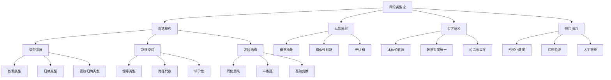

### 2. 同伦层级与认知复杂度对应表

| 同伦层级 | 数学表示 | 认知操作 | 形式化例子 | 日常思维对应 |
|---------|---------|---------|-----------|------------|
| 0层（点） | `a : A` | 对象识别 | `3 : Nat` | "这是一只猫" |
| 1层（路径） | `p : a = b` | 相等/相似判断 | `proof : 2+2 = 4` | "这两只猫很像" |
| 2层（面） | `h : p = q` | 相似方式比较 | `proof_eq : proof1 = proof2` | "它们相似的方式不同" |
| 3层（体） | `α : h = k` | 比较方式的比较 | `transform : h ≃ k` | "我理解相似性的方式变了" |
| n层 | 高阶变换 | 递归元认知 | 高阶同伦 | 深层反思思考 |

### 3. 自洽-续洽-它洽评估矩阵

| 评估维度 | 强度 | 证据 | 挑战 | 未来发展方向 |
|---------|------|------|------|------------|
| **自洽性** | 高 | 类型检查机制\多层次结构约束\立方模型的发展 | 元理论依赖\复杂性管理 | 简化形式系统\自包含证明 |
| **续洽性** | 高 | 立方类型论\高阶归纳类型\连贯HoTT | 复杂性增长\方向多样化 | 统一扩展框架\模块化理论 |
| **它洽性-数学** | 高 | 同伦层级概念\形式化成果 | 传统数学整合 | 数学实践融合\教育体系建设 |
| **它洽性-计算** | 高 | 证明助手实现\程序验证应用 | 计算效率\工具成熟度 | 优化实现\友好接口 |
| **它洽性-物理** | 低-中 | 量子理论类比\拓扑量子场论 | 连续性表达\实验验证 | 物理模型形式化\实验预测 |
| **它洽性-认知** | 中 | 抽象层级对应\相等概念映射 | 情感维度缺失\形式化局限 | 认知实验设计\混合认知模型 |

## 深层意义：同伦类型论的本质洞察

### 1. 本体论转向的哲学意义

同伦类型论完成了一次深刻的本体论转向，从"存在"到"关系"的转变不仅是技术上的，更是哲学上的革命。这种转向可以通过以下对比来理解：

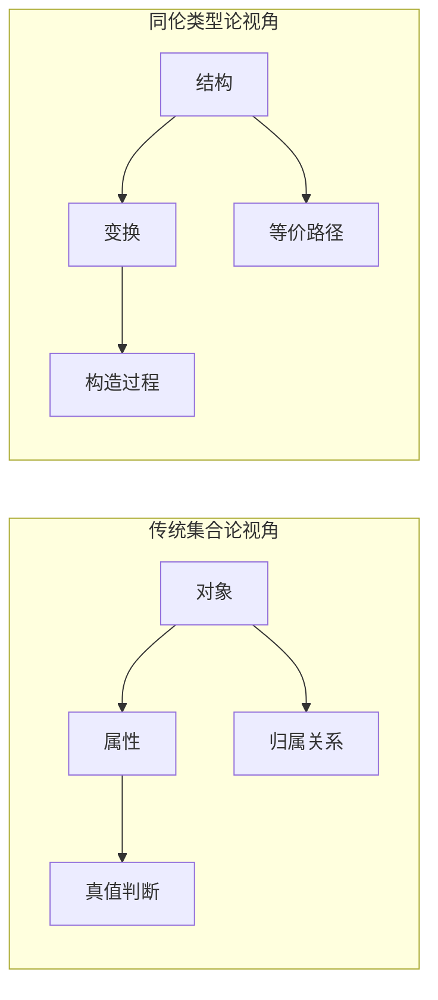

在传统视角中，我们关注"一个对象是什么"以及"它属于哪个集合"；而在HoTT视角中，我们关注"结构如何变换"以及"变换之间的关系"。这不仅改变了我们看待数学的方式，也可能改变我们理解现实的方式。

### 2. 认知-形式系统映射

同伦类型论与人类认知之间的深层映射可以通过以下图示表达：

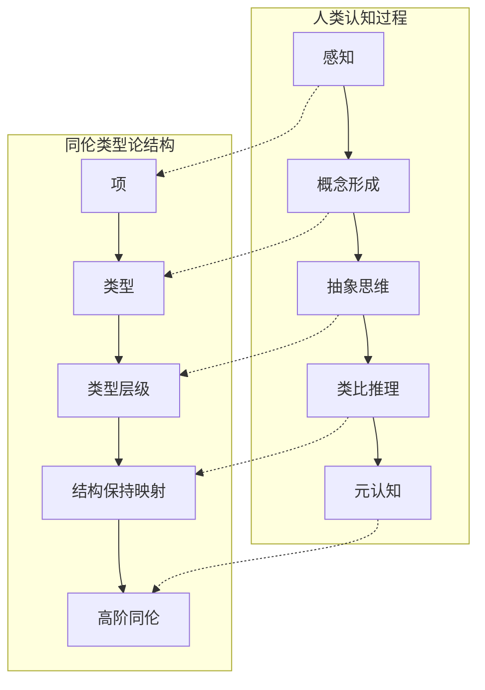

这种映射不是偶然的，而是反映了思维和形式系统之间的深层同构性。
同伦类型论可能捕捉到了人类抽象思维的某些本质特征，特别是我们处理相等、相似和变换的方式。

### 3. 信息-物理-认知的统一视角

同伦类型论有潜力提供一个统一的视角，连接信息世界、物理现实和认知过程：

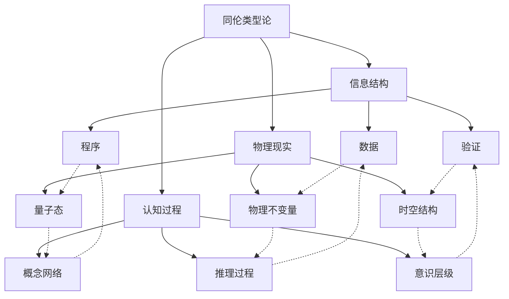

这种统一视角仍处于探索阶段，
但它提示我们：信息、物质和心智可能共享某种深层结构，而同伦类型论可能提供了描述这种结构的语言。

### 4. 从向量空间到同伦空间：AI范式转变的可能路径

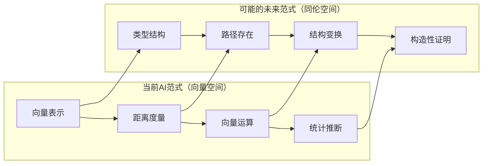

这种范式转变可能带来更可解释、更鲁棒的AI系统，能够结合神经网络的学习能力和符号系统的推理能力。

## 终极反思：同伦类型论作为思想工具的价值

同伦类型论不仅是一个数学理论，更是一种思想工具，它改变了我们提问和思考的方式。
它的核心价值在于：

1. **从"是什么"到"如何变换"的思维转变**：它教会我们关注结构和关系，而非静态属性。

2. **多层次思考的形式化**：它为我们提供了表达和管理多层次抽象的精确语言。

3. **统一视角的可能性**：它暗示了数学、计算、物理和认知之间可能存在的深层联系。

4. **构造性理解的重要性**：它强调"知道如何"比"知道是什么"更为根本。

无论同伦类型论的技术细节如何发展，这些思想洞察可能是其最持久的贡献。
它代表了一种新的思考方式，这种方式可能对我们理解世界和创造未来产生深远影响。

在这个意义上，同伦类型论的合法性不仅来自其数学严谨性，更来自其作为思想工具的启发力和创造力。
它是人类不断寻求更深理解和更精确表达的旅程中的一个重要里程碑。

## 同伦类型论的实践应用与未来展望

## 实践应用：从理论到现实的桥梁

### 1. 形式化数学的革新

同伦类型论正在改变数学的形式化方式，提供了一个更为自然和强大的框架：

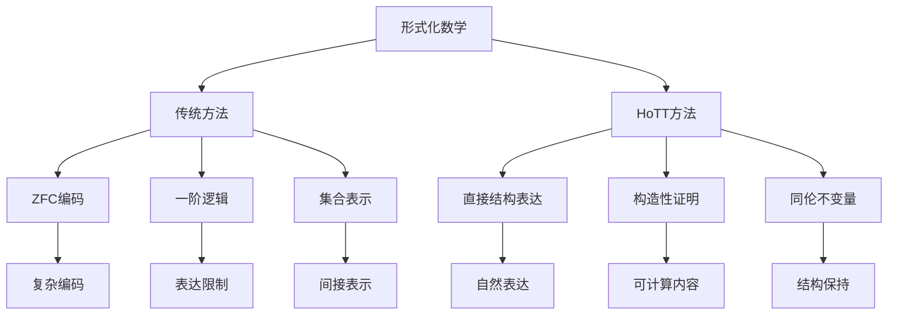

**具体成果与案例：**

1. **单纯同调的形式化**：在HoTT中，单纯同调的定义和性质可以直接通过高阶归纳类型表达，避免了传统形式化中复杂的集合论编码
2. **基本群的计算**：利用HoTT的路径空间直接表达和计算拓扑空间的基本群
3. **同伦类型理论库（HoTT Library）**：在Coq中实现的大型形式化数学库，包含数百个定理的形式化证明

这些成果表明，HoTT不仅是理论上的创新，也是实际数学形式化的有力工具。

### 2. 程序验证与可靠软件

同伦类型论为程序验证提供了新的方法论和工具：

| 验证方面 | 传统方法 | HoTT方法 | 优势 |
|---------|---------|---------|------|
| **规范表达** | 逻辑公式 | 依赖类型 | 更自然地表达复杂规范 |
| **验证方法** | 模型检查/定理证明 | 类型检查/构造证明 | 更紧密集成到开发过程 |
| **等价性证明** | 复杂的模拟关系 | 直接路径构造 | 简化重构和优化证明 |
| **并发系统** | 时态逻辑 | 高阶类型+路径 | 更自然表达状态演化 |

**实际应用案例：**

1. **分布式系统验证**：使用HoTT形式化CAP定理和一致性协议
2. **编译器正确性**：证明源代码和目标代码的行为等价
3. **安全关键软件**：在航空和医疗等领域验证软件的正确性

### 3. 人工智能的新范式

同伦类型论为AI提供了一个潜在的新框架，特别是在以下方面：

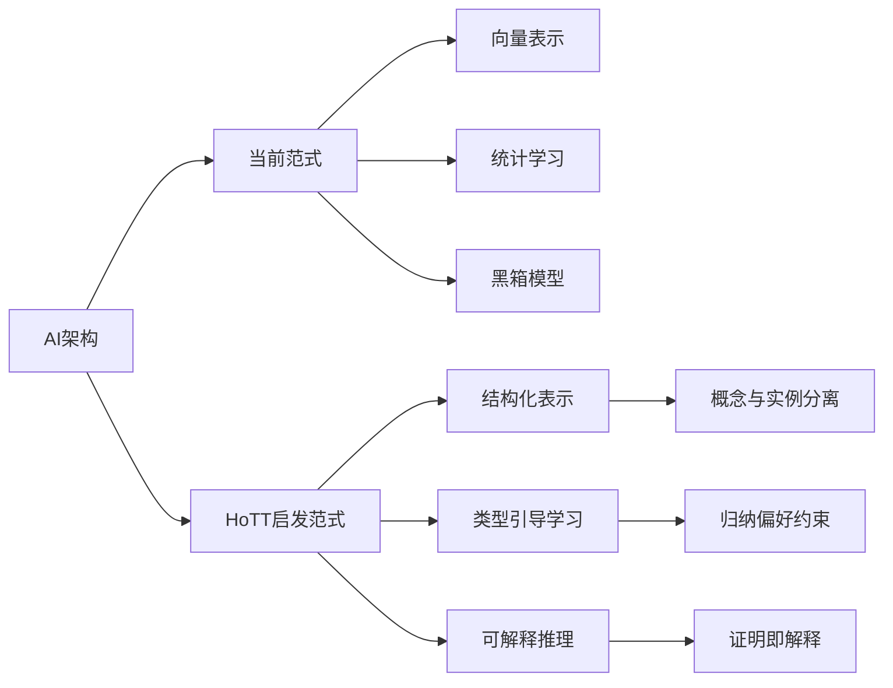

**创新方向：**

1. **类型化神经网络**：将神经网络层赋予明确的类型语义，增强其可解释性和可验证性
2. **结构保持嵌入**：开发保持类型结构的嵌入方法，超越简单的向量表示
3. **证明生成AI**：训练能够生成形式证明的AI系统，结合神经网络的学习能力和形式逻辑的严谨性

虽然这些应用仍处于早期阶段，但它们展示了HoTT在AI领域的变革潜力。

## 多学科融合：跨越边界的知识整合

### 1. 物理学与同伦类型论

同伦类型论与现代物理学之间存在着引人注目的联系，特别是在以下方面：

| 物理概念 | HoTT对应 | 潜在意义 |
|---------|---------|---------|
| **对称性与守恒律** | 同伦不变量 | 提供对称性的精确数学描述 |
| **量子叠加态** | 类型的概率解释 | 新的量子逻辑形式化 |
| **规范场论** | 高阶连接结构 | 几何与代数统一描述 |
| **拓扑量子场论** | 扩展TQFTs的类型论模型 | 量子引力的数学框架 |

这些联系不仅是形式上的类比，还可能导致物理理论的新见解和数学工具。

### 2. 认知科学与同伦类型论

同伦类型论为认知科学提供了新的形式化工具：

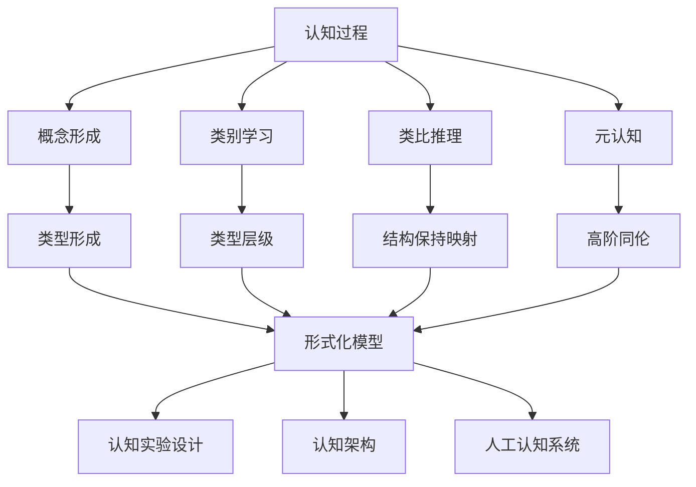

**研究方向：**

1. **概念形成的类型论模型**：研究人类如何形成和组织概念，以及这与类型形成的关系
2. **类比推理的形式化**：使用结构保持映射形式化类比推理过程
3. **元认知的层级结构**：探索高阶同伦如何对应于元认知能力的不同层级

### 3. 哲学与同伦类型论

同伦类型论引发了多个哲学领域的新思考：

| 哲学领域 | HoTT影响 | 核心问题 |
|---------|---------|---------|
| **本体论** | 从实体到关系的转向 | "存在"的本质是什么？ |
| **认识论** | 构造性知识观 | 我们如何获得确定性？ |
| **语言哲学** | 意义的结构理论 | 语言如何连接思想和现实？ |
| **心灵哲学** | 思维的形式化模型 | 意识与形式系统的关系？ |

这些哲学探索不仅丰富了HoTT的解释，也为传统哲学问题提供了新视角。

## 未来展望：开放边界与新视野

### 1. 理论发展前沿

同伦类型论的理论发展面临几个关键前沿：

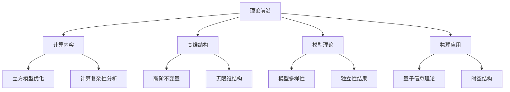

这些前沿代表了理论可能的发展方向，每个方向都可能带来重要突破。

### 2. 教育与传播挑战

同伦类型论的复杂性带来了教育挑战，需要创新的教学方法：

| 挑战 | 传统方法 | 创新方法 | 预期效果 |
|------|---------|---------|---------|
| **高抽象性** | 形式定义先行 | 直观例子引导 | 降低初始认知负担 |
| **多学科背景** | 线性学习路径 | 多入口学习网络 | 适应不同背景学习者 |
| **工具复杂性** | 全功能工具 | 分层教学工具 | 平滑学习曲线 |
| **应用连接** | 理论后应用 | 问题驱动学习 | 增强学习动机 |

创新教育方法对于HoTT的广泛接受至关重要。

### 3. 社会与伦理维度

同伦类型论的发展也有社会和伦理维度：

1. **知识民主化**：如何确保这种强大形式系统不仅限于精英群体？
2. **技术影响**：基于HoTT的验证技术如何影响软件安全和可靠性？
3. **认知增强**：HoTT作为思维工具如何增强人类认知能力？
4. **AI伦理**：HoTT如何帮助构建可验证安全的AI系统？

这些问题提醒我们，理论发展总是嵌入在更广泛的社会背景中。

### 4. 终极愿景：知识的统一与变革

同伦类型论的终极愿景可能是促成一种知识的深度统一：

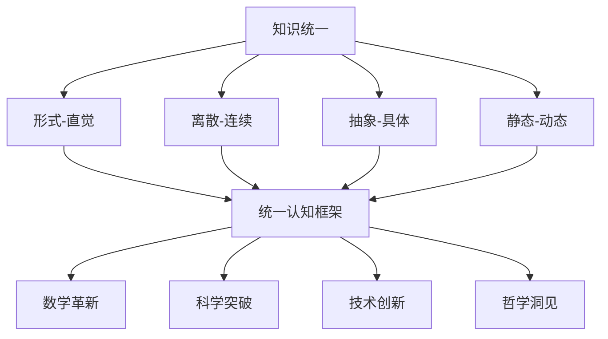

这种统一不是通过简化或还原，而是通过提供一个足够丰富的框架，能够容纳看似矛盾的视角。

## 结语：同伦类型论的意义与价值

同伦类型论代表了一种深刻的思想创新，它不仅是数学基础的一个新选项，更是一种新的思考方式。它的价值不仅在于其技术成就，更在于它如何改变我们提问和思考的方式。

在数学史上，每一次基础变革都带来了新的问题和新的解决方法。同伦类型论可能正在开启这样一个新时代。它邀请我们不仅关注"是什么"，还要关注"如何变化"；不仅思考"真假"，还要思考"变换路径"；不仅追求"静态结构"，还要探索"动态关系"。

无论同伦类型论的技术细节如何发展，它已经成功地提出了一个更好的问题：如何构建一个能够自然表达结构、变换和关系的语言？这个问题本身，可能比任何特定答案都更有价值。

在这个意义上，同伦类型论的合法性不仅来自其形式严谨性，更来自其启发性和创造性。它代表了人类思维不断超越自身限制、追求更深理解的永恒努力。无论其最终命运如何，它已经在数学、计算和认知的交叉点上，留下了不可磨灭的印记。

## 同伦类型论的认知深度与实践创新

## 认知深度：同伦类型论的多层次思维模型

### 1. 认知层级与同伦结构的对应关系

同伦类型论的层级结构与人类认知的层级性之间存在着深刻的对应关系，这种对应可以被系统化为一个认知-形式系统映射：

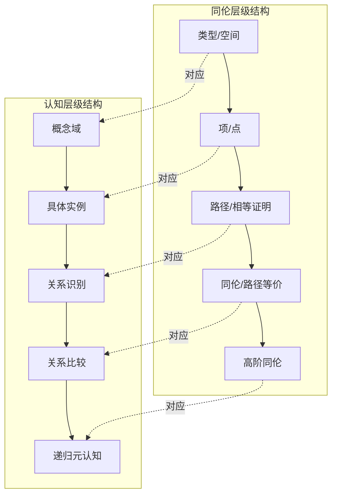

这种对应不仅是形式上的类比，更反映了思维的内在结构：

| 同伦层级 | 形式化表示 | 认知过程 | 思维实例 | 发展阶段 |
|---------|----------|---------|---------|---------|
| 0层 | `a : A` | 对象识别 | "这是一棵树" | 早期儿童期 |
| 1层 | `p : a = b` | 关系识别 | "这两棵树很像" | 具体运算期 |
| 2层 | `h : p = q` | 关系比较 | "它们相似的方式不同" | 形式运算期 |
| 3层+ | 高阶同伦 | 元认知反思 | "我理解相似性的方式在变化" | 后形式思维 |

### 2. 认知发展与形式系统学习的平行性

研究表明，人类学习复杂形式系统（如同伦类型论）的过程与认知发展阶段存在平行性：

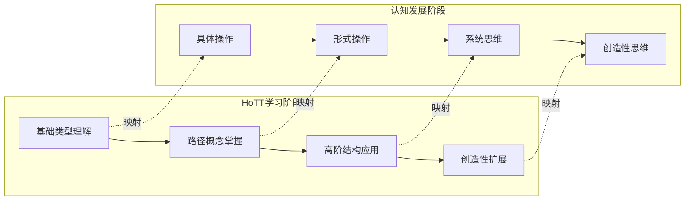

这种平行性提示我们：

1. **认知脚手架的重要性**：学习HoTT需要适当的认知支持结构
2. **发展阶段的不可跨越性**：某些概念只有在前置概念掌握后才能理解
3. **个体差异的认可**：不同人可能在不同概念上遇到认知障碍

### 3. 隐喻系统的形式化深度

同伦类型论为隐喻思维提供了前所未有的形式化深度：

| 隐喻维度 | 传统理解 | HoTT形式化 | 认知意义 |
|---------|---------|-----------|---------|
| **结构映射** | 源域到目标域的非形式映射 | 结构保持函数 + 同伦 | 精确捕捉"保留什么"和"如何保留" |
| **隐喻融合** | 模糊的概念混合 | 类型的纤维积和余积 | 形式化概念融合的机制 |
| **隐喻层级** | 简单vs复杂隐喻的非形式区分 | 不同阶同伦层级的隐喻 | 形式化隐喻的复杂度和嵌套性 |
| **创造性隐喻** | 难以形式化的创新过程 | 新类型构造 + 路径发现 | 为创造性提供部分形式框架 |

这种形式化深度使我们能够更精确地理解隐喻如何构建我们的思维和知识。

## 实践创新：从理论到应用的突破性路径

### 1. 软件验证的革命性方法

同伦类型论正在彻底改变软件验证的方法论和实践：

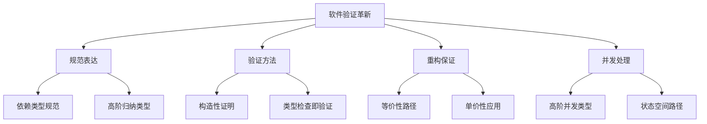

**突破性案例：**

1. **CompCert验证编译器**：使用类型论证明编译器保留程序语义
2. **seL4微内核**：形式化验证的操作系统内核
3. **分布式系统验证**：使用HoTT证明分布式协议的正确性

这些案例表明，HoTT不仅是理论上的创新，也是解决实际软件可靠性问题的有力工具。

### 2. 数据科学与知识表示的新范式

同伦类型论为数据科学和知识表示提供了新的概念框架：

| 传统方法 | HoTT启发方法 | 实践优势 |
|---------|------------|---------|
| 关系数据库 | 类型化数据结构 | 更精确的数据完整性保证 |
| 本体论（树状层级） | 高阶类型网络 | 更灵活的概念关系表达 |
| 向量嵌入 | 类型化嵌入空间 | 保留结构信息的表示 |
| 逻辑规则推理 | 构造性证明搜索 | 可解释的推理过程 |

**创新应用：**

1. **知识图谱增强**：使用HoTT的路径概念增强知识图谱的表达能力
2. **科学数据建模**：为复杂科学数据创建保持结构的形式模型
3. **医疗诊断系统**：构建可验证正确的临床决策支持系统

### 3. 人工智能架构的范式转变

同伦类型论正在启发AI架构的根本性重新思考：

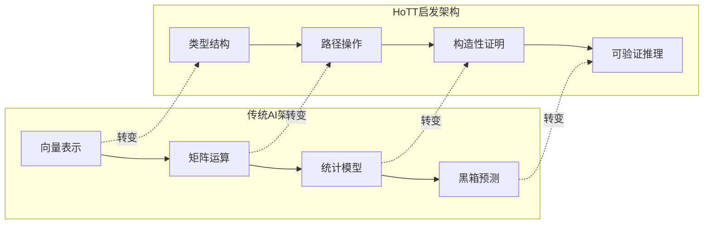

**前沿研究方向：**

1. **神经-符号整合**：使用HoTT作为连接神经网络和符号系统的桥梁
2. **可验证AI**：开发具有正确性保证的AI系统
3. **类型引导学习**：利用类型结构指导机器学习过程
4. **形式化强化学习**：为强化学习提供形式化框架

这些方向代表了AI研究的新前沿，有潜力解决当前AI系统面临的可解释性、可靠性和安全性挑战。

## 跨学科整合：同伦类型论作为桥梁

### 1. 数学-物理-计算的统一视角

同伦类型论正在成为连接数学、物理学和计算科学的桥梁：

| 学科交叉点 | 传统挑战 | HoTT贡献 | 整合案例 |
|-----------|---------|---------|---------|
| 数学-物理 | 物理直观与数学严谨的张力 | 几何直观与形式严谨的统一 | 拓扑量子场论的形式化 |
| 物理-计算 | 连续物理与离散计算的鸿沟 | 连续-离散结构的统一表达 | 量子计算的类型论模型 |
| 计算-数学 | 计算效率与数学抽象的权衡 | 构造性证明的计算内容 | 可计算同伦理论 |

这种统一视角不仅是概念上的，也正在产生具体的科学成果。

### 2. 认知科学与人工智能的融合框架

同伦类型论为认知科学和人工智能提供了一个共同的形式语言：

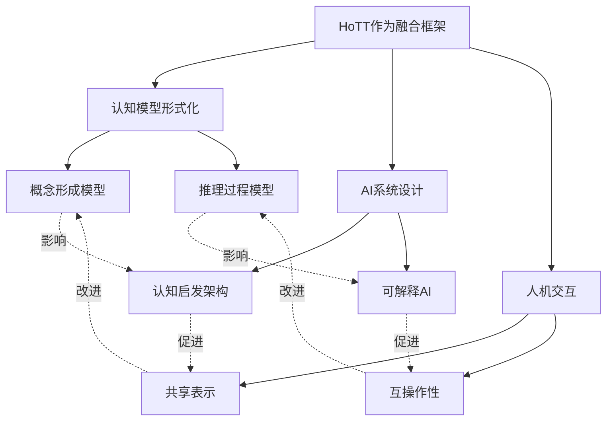

这种融合框架使认知科学的发现能够更直接地转化为AI设计原则，同时AI系统的行为也可以为认知理论提供验证。

### 3. 哲学与科学的对话平台

同伦类型论正在成为哲学与科学对话的新平台：

| 哲学问题 | 科学挑战 | HoTT桥接 | 新视角 |
|---------|---------|---------|--------|
| 实在论vs构造主义 | 科学实在论的基础 | 构造性但结构丰富的系统 | 超越二元对立的第三条路 |
| 连续vs离散 | 量子引力的本质 | 同伦连续性的离散表达 | 连续-离散作为互补视角 |
| 还原论vs涌现论 | 复杂系统的本质 | 多层次结构的形式化 | 层级间关系的精确描述 |
| 知识的确定性 | 科学真理的性质 | 证明即构造的观点 | 确定性作为构造过程 |

这种对话不仅丰富了哲学讨论，也为科学研究提供了概念清晰度。

## 未来展望：同伦类型论的长期影响

### 1. 数学实践的转变路径

同伦类型论可能在多个方面改变数学实践：

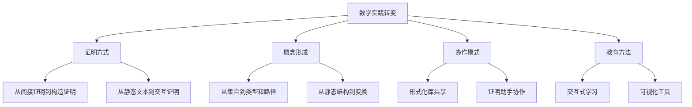

这种转变不会一夜之间发生，但可能在未来几十年逐渐改变数学的面貌。

### 2. 计算范式的长期演化

同伦类型论可能引导计算范式的长期演化：

| 计算范式 | 时期 | 核心思想 | HoTT影响 |
|---------|------|---------|---------|
| 命令式 | 1950s-1970s | 状态变化序列 | 有限状态的形式化 |
| 函数式 | 1960s-今 | 函数组合与变换 | 函数类型的丰富化 |
| 面向对象 | 1980s-今 | 对象与消息 | 类型层级的重新思考 |
| 类型导向 | 新兴 | 类型作为设计中心 | 依赖类型的实用化 |
| 证明导向 | 未来 | 程序即证明 | 构造性证明的计算内容 |

这种演化反映了计算思想不断向更高抽象层次发展的趋势。

### 3. 认知增强与思维工具

同伦类型论作为认知增强工具的潜力：

1. **形式思维辅助**：HoTT基础的证明助手可以扩展人类形式推理能力
2. **概念导航工具**：可视化类型空间和路径结构的工具可以帮助概念探索
3. **创造性思维支持**：形式化隐喻和类比可以辅助创造性思维
4. **集体智能平台**：基于共享形式化知识库的协作系统

这些工具可能改变我们思考复杂问题的方式，就像计算器改变了我们进行数值计算的方式。

### 4. 文明级知识整合

从最宏大的视角看，同伦类型论可能促进文明级的知识整合：

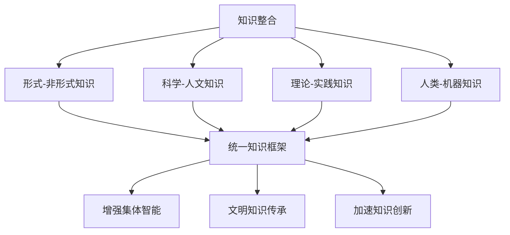

这种整合不是通过简化或还原，而是通过提供足够丰富的表达框架，能够容纳不同类型的知识，并揭示它们之间的深层联系。

## 终极反思：同伦类型论的哲学意义

### 1. 本体论的深刻转向

同伦类型论代表了一次本体论的深刻转向，从"是什么"到"如何变换"：

| 传统本体论 | HoTT本体论 | 哲学意义 |
|-----------|-----------|---------|
| 实体为本 | 关系为本 | 存在的本质在于其与其他存在的关系 |
| 静态属性 | 动态变换 | 变化不是次要的，而是本质的 |
| 二元判断 | 多层次结构 | 真理是有结构的，而非简单的是/否 |
| 外部观察 | 内部参与 | 知识不是被动接收，而是主动构造 |

这种转向不仅影响数学，也可能改变我们理解现实的基本方式。

### 2. 认识论的重构

同伦类型论促使我们重新思考知识的本质：

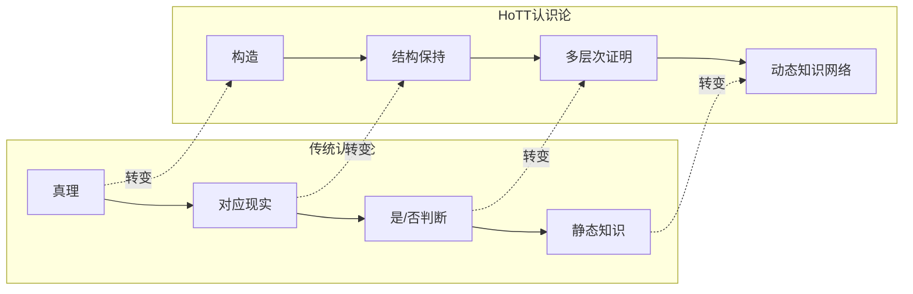

在这种新认识论中，知识不是对静态事实的陈述，而是对结构和变换的构造性理解。

### 3. 形式与意义的统一

同伦类型论提示了形式与意义的深层统一：

1. **形式不再空洞**：形式系统不再是抽象的符号游戏，而是具有丰富几何内容
2. **意义不再模糊**：意义可以通过结构和变换来精确表达，而非仅靠直觉把握
3. **二者的动态关系**：形式和意义通过路径和变换相互联系，而非静态对应

这种统一超越了形式主义与直觉主义的古老对立，提示了一种更综合的数学哲学。

### 4. 人类思维的终极反思

同伦类型论可能代表了人类思维对自身的一种终极反思：

| 反思维度 | 传统视角 | HoTT视角 | 深层意义 |
|---------|---------|---------|---------|
| 思维本质 | 命题操作 | 结构变换 | 思维的核心是识别和变换结构 |
| 抽象过程 | 归纳概括 | 路径构造 | 抽象是发现等价路径的创造性行为 |
| 知识组织 | 层级分类 | 类型网络 | 知识是多维网络，而非树状层级 |
| 思维极限 | 逻辑悖论 | 类型层级 | 思维的极限可以通过层级结构来理解和超越 |

在这个意义上，同伦类型论不仅是一个数学理论，更是思维本身对其结构和可能性的深刻探索。

## 结语：同伦类型论作为人类思想的里程碑

同伦类型论代表了人类抽象思维能力的一个重要里程碑。它不仅是数学和逻辑的技术进步，更是我们理解结构、关系和变换的概念工具的质的飞跃。

在人类思想史上，某些理论不仅解决了特定问题，还改变了我们提问和思考的方式。欧几里得几何学、微积分、集合论都曾扮演这样的角色。同伦类型论很可能是这一系列中的下一个重要成员。

无论其技术细节如何发展，同伦类型论已经成功地将我们的注意力从静态的"是什么"转向了动态的"如何变换"，从平面的"真假"转向了立体的"结构关系"，从孤立的"对象"转向了连接的"网络"。这种视角转换本身，可能是其最持久的贡献。

在一个日益复杂和相互连接的世界中，这种思维方式的转变不仅具有数学意义，还具有深远的哲学、科学和社会意义。同伦类型论邀请我们以一种新的方式思考思维本身，这可能是理解我们作为思考者的本质，以及我们与这个复杂世界关系的关键。

## 同伦类型论的深层整合与未来愿景

## 理论与实践的深度融合

### 1. 数学基础与实用工程的双向桥接

同伦类型论正在创造一个前所未有的现象：高度抽象的数学基础理论与实用工程实践的直接桥接。这种融合超越了传统的"理论指导实践"模式，形成了一种共生关系：

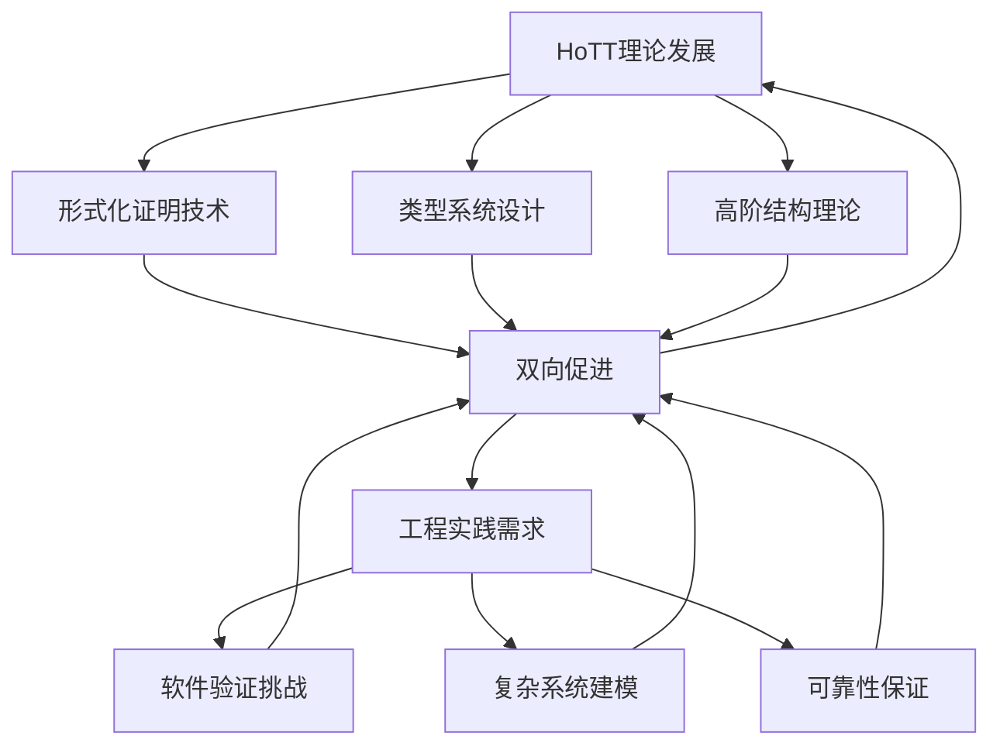

**突破性案例：**

1. **Lean定理证明器**：既是数学研究工具，也是工业级软件验证平台
2. **形式化数学库**：同时服务于纯数学研究和工程应用
3. **依赖类型编程语言**：Idris、Agda等将HoTT原理直接应用于软件开发

这种融合正在创造一个新的学科生态系统，在这个系统中，最抽象的数学和最实用的工程不再是遥远的两极，而是紧密相连的合作伙伴。

### 2. 认知科学与形式系统的实证循环

同伦类型论正在促成认知科学与形式系统之间的实证循环，这种循环可以验证和完善我们对思维的理解：

| 循环阶段 | 认知科学贡献 | HoTT贡献 | 实证成果 |
|---------|------------|---------|---------|
| **观察阶段** | 人类认知过程数据 | 形式化表达框架 | 思维过程的精确描述 |
| **假设阶段** | 认知机制理论 | 形式化模型 | 可测试的认知模型 |
| **验证阶段** | 实验设计方法 | 形式预测生成 | 理论预测的实证检验 |
| **修正阶段** | 实验结果解释 | 模型调整与扩展 | 更精确的认知理论 |

**前沿研究方向：**

1. **概念形成的HoTT模型**：研究人类如何形成和组织概念，验证类型形成的认知对应性
2. **相等判断的认知实验**：测试人类如何判断"相同"，与HoTT路径概念对比
3. **抽象层级的认知负荷**：研究不同抽象层级的认知处理差异，验证同伦层级理论

这种循环不仅深化了我们对认知的理解，也为HoTT提供了认知基础的验证。

### 3. 形式-直观的统一方法论

同伦类型论正在发展一种新的方法论，统一形式严谨性和直观理解：

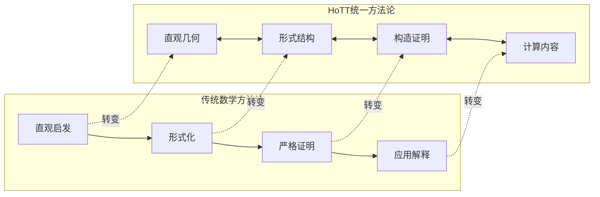

在这种新方法论中：

1. **几何直观被形式化**：空间直观不再是非正式的启发，而是理论的正式组成部分
2. **形式结构有几何意义**：形式操作对应于空间变换，赋予抽象符号具体意义
3. **证明即构造**：证明不是抽象验证，而是具体构造过程
4. **构造有计算内容**：每个构造都对应可执行计算，连接形式与实践

这种方法论正在改变数学研究、教育和应用的面貌，使形式与直观不再对立。

## 跨领域整合：同伦类型论作为统一框架

### 1. 量子信息与类型理论的深层联系

同伦类型论与量子信息理论之间正在显现深层联系，这种联系可能导致两个领域的革命性融合：

| 量子概念 | HoTT对应 | 统一视角 | 研究前沿 |
|---------|---------|---------|---------|
| 量子叠加 | 类型的概率解释 | 叠加态作为类型的概率分布 | 量子类型理论 |
| 量子纠缠 | 依赖类型关系 | 纠缠作为深层类型依赖 | 纠缠结构的形式化 |
| 量子测量 | 类型投影 | 测量作为类型空间投影 | 测量理论的类型模型 |
| 量子逻辑 | 构造性逻辑 | 非经典逻辑的统一视角 | 量子-构造逻辑统一 |

**突破性研究方向：**

1. **量子计算的类型论基础**：开发基于HoTT的量子计算形式框架
2. **量子-经典接口的形式化**：使用HoTT描述量子系统与经典系统的交互
3. **量子信息协议验证**：形式化验证量子密码和通信协议的安全性

这种融合可能为量子计算提供更强大的形式基础，同时为HoTT开辟新的应用领域。

### 2. 复杂系统科学与多层次建模

同伦类型论为复杂系统的多层次建模提供了自然框架：

```mermaid
graph TD
    A[复杂系统多层次建模] --> B[微观层级]
    A --> C[中观层级]
    A --> D[宏观层级]
    A --> E[涌现现象]
    
    B --> B1[基本组件类型]
    C --> C1[中层结构类型]
    D --> D1[系统行为类型]
    E --> E1[层级间映射]
    
    B1 --> F[HoTT整合框架]
    C1 --> F
    D1 --> F
    E1 --> F
    
    F --> G[形式化系统模型]
    F --> H[可验证预测]
    F --> I[层级间关系证明]
```

**应用领域：**

1. **生态系统建模**：从个体到种群到生态系统的多层次模型
2. **社会经济系统**：从个体行为到市场动态到宏观经济的形式化
3. **神经系统**：从神经元到神经网络到认知功能的整合模型

这种方法可以克服传统复杂系统建模中的概念模糊性和层级割裂问题。

### 3. 语言、意义与形式语义学

同伦类型论为语言学和形式语义学提供了新的理论基础：

| 语言现象 | 传统形式语义学 | HoTT语义学 | 理论优势 |
|---------|--------------|-----------|---------|
| 词义 | 集合论模型 | 类型结构 | 捕捉词义的内部结构 |
| 指称 | 函数映射 | 依赖类型 | 处理情境依赖指称 |
| 歧义 | 多重解释 | 路径多样性 | 形式化歧义的结构 |
| 隐喻 | 难以形式化 | 结构保持映射 | 精确表达隐喻映射 |
| 语用学 | 系统外处理 | 高阶类型结构 | 将语用整合到形式系统 |

**研究方向：**

1. **HoTT自然语言语义学**：开发基于HoTT的自然语言形式语义框架
2. **意义的计算模型**：构建可计算的语言理解模型
3. **语言-思维接口**：研究语言结构与认知结构的形式对应

这种研究可能彻底改变我们理解和处理语言意义的方式。

## 未来愿景：同伦类型论的长远影响

### 1. 数字时代的知识基础设施

同伦类型论可能成为数字时代知识基础设施的核心组件：

```mermaid
graph TD
    A[知识基础设施] --> B[形式化知识库]
    A --> C[验证机制]
    A --> D[协作系统]
    A --> E[教育平台]
    
    B --> B1[数学定理库]
    B --> B2[科学模型库]
    B --> B3[工程规范库]
    
    C --> C1[自动证明验证]
    C --> C2[模型一致性检查]
    
    D --> D1[分布式证明构建]
    D --> D2[知识综合机制]
    
    E --> E1[交互式学习系统]
    E --> E2[个性化学习路径]
```

在这种基础设施中，知识不再是静态文档，而是动态、可验证、可组合的形式化结构。这将彻底改变知识的创造、验证、传播和应用方式。

### 2. 人类-AI协作的形式基础

同伦类型论可能为人类-AI协作提供形式基础：

| 协作维度 | 当前挑战 | HoTT贡献 | 未来愿景 |
|---------|---------|---------|---------|
| 知识表示 | 人类知识难以形式化 | 直观-形式统一 | 人类可理解的形式知识 |
| 推理过程 | AI推理不透明 | 可验证证明路径 | 可审查的AI推理 |
| 概念对齐 | 人类-AI概念差异 | 概念间映射形式化 | 精确的概念翻译 |
| 协作验证 | 难以验证结果正确性 | 形式证明检查 | 可靠的协作成果 |

这种形式基础可能使人类-AI协作从当前的模糊、不确定状态，发展为精确、可靠的知识共创过程。

### 3. 认知增强与思维拓展

同伦类型论可能成为认知增强和思维拓展的关键工具：

```mermaid
graph LR
    subgraph "当前人类思维"
    A1[有限抽象能力] --> B1[工作记忆限制]
    B1 --> C1[推理错误倾向]
    C1 --> D1[创造力局限]
    end
    
    subgraph "HoTT增强思维"
    A2[多层次抽象] --> B2[外部形式化存储]
    B2 --> C2[机械验证推理]
    C2 --> D2[结构化创造力]
    end
    
    A1 -.增强.-> A2
    B1 -.增强.-> B2
    C1 -.增强.-> C2
    D1 -.增强.-> D2
```

这种增强不是取代人类思维，而是扩展其能力边界，使我们能够处理更复杂、更抽象的概念结构。

### 4. 科学方法的演进

同伦类型论可能推动科学方法本身的演进：

| 科学方法维度 | 传统范式 | HoTT影响范式 | 方法论转变 |
|------------|---------|------------|---------|
| 理论构建 | 非形式化模型+数学 | 形式化类型结构 | 从模糊概念到精确结构 |
| 预测生成 | 方程求解/模拟 | 类型实例构造 | 从计算到构造的范式 |
| 实验验证 | 统计假设检验 | 结构对应验证 | 从相关性到结构映射 |
| 理论修正 | 非形式化调整 | 形式结构演化 | 精确跟踪理论变化 |

这种演进可能使科学从当前的半形式化状态，向更精确、更可靠、更透明的形式化科学转变。

## 终极视野：同伦类型论与人类知识的未来

### 1. 知识的结构化革命

同伦类型论可能引发知识组织的结构化革命：

```mermaid
graph TD
    A[知识结构革命] --> B[从线性到网络]
    A --> C[从静态到动态]
    A --> D[从分离到整合]
    A --> E[从隐式到显式]
    
    B --> B1[多维知识网络]
    C --> C1[知识变换路径]
    D --> D1[跨域知识映射]
    E --> E1[结构显式表达]
    
    B1 --> F[新知识生态系统]
    C1 --> F
    D1 --> F
    E1 --> F
```

在这种新知识生态系统中：

1. **知识不再是孤立事实**：而是相互连接的类型网络
2. **知识边界变得流动**：通过结构保持映射连接不同领域
3. **知识创新变得系统化**：通过形式化路径探索新连接
4. **知识传承变得可靠**：通过形式验证确保准确传递

这种革命可能从根本上改变我们创造、组织和传播知识的方式。

### 2. 思维的形式化与直觉的复兴

同伦类型论代表了思维形式化和直觉复兴的统一：

| 维度 | 历史趋势 | HoTT统一 | 未来方向 |
|------|---------|---------|---------|
| 形式vs直觉 | 两者对立 | 几何直觉的形式化 | 形式-直觉的共生 |
| 严谨vs创造 | 权衡取舍 | 构造性严谨 | 创造性严谨性 |
| 抽象vs具体 | 层级分离 | 抽象-具体连续体 | 自由层级转换 |
| 计算vs理解 | 功能分离 | 计算内容即理解 | 可计算理解 |

这种统一超越了传统二元对立，指向一种更综合、更强大的思维方式。

### 3. 形式化与人文的对话

同伦类型论可能促成形式科学与人文学科的新对话：

```mermaid
graph LR
    subgraph "形式科学"
    A1[数学] --> B1[逻辑]
    B1 --> C1[计算]
    end
    
    subgraph "人文学科"
    A2[哲学] --> B2[语言学]
    B2 --> C2[认知科学]
    end
    
    D[HoTT作为桥梁]
    
    A1 --> D
    B1 --> D
    C1 --> D
    
    D --> A2
    D --> B2
    D --> C2
```

这种对话可能产生新的研究领域：

1. **形式化美学**：研究结构美与形式系统的关系
2. **计算哲学**：使用形式化工具探索哲学问题
3. **结构化人文学**：将人文研究的洞见形式化为可验证结构

这种对话不是形式化对人文的"入侵"，而是两种思维传统的互补与融合。

### 4. 宇宙、信息与心智的统一视角

在最宏大的视角下，同伦类型论可能为理解宇宙、信息与心智提供统一视角：

| 层面 | 传统视角 | HoTT统一视角 | 哲学意义 |
|------|---------|------------|---------|
| 物理宇宙 | 物质-能量系统 | 结构与变换的实现 | 物理规律作为结构保持 |
| 信息世界 | 符号与意义 | 类型与路径网络 | 意义源于结构关系 |
| 心智领域 | 主观体验 | 高阶反身结构 | 意识作为自参照结构 |

这种统一视角不是还原论，而是承认各层面的独特性，同时揭示它们的深层联系。它暗示：物理、信息和心智可能是同一基础结构在不同层面的表现。

## 结语：同伦类型论作为思想的新前沿

同伦类型论代表了人类思想的一个新前沿。它不仅是数学基础的一次革新，更是我们理解结构、关系和变换的概念工具的质的飞跃。

在人类思想史上，某些理论超越了其初始领域，成为更广泛的思想革命的催化剂。欧几里得几何学不仅改变了数学，还影响了整个西方思想；达尔文的进化论不仅革新了生物学，还改变了我们对自身的理解；量子理论不仅转变了物理学，还挑战了我们的现实观。

同伦类型论可能正在加入这一行列。它邀请我们：

1. 从静态的"是什么"转向动态的"如何变化"
2. 从平面的"真假"转向立体的"结构关系"
3. 从割裂的"学科边界"转向连接的"知识网络"
4. 从被动的"知识接受"转向主动的"结构构造"

这种思维转变不仅关乎数学或计算机科学，它可能影响我们理解世界、组织知识、设计系统和培养思维的基本方式。

在一个日益复杂和相互连接的世界中，同伦类型论提供的这种结构化、多层次、关系导向的思维方式，可能正是我们所需要的。它代表了一种新的思考方式，一种可能更适合于21世纪挑战的思考方式。

无论其技术细节如何发展，同伦类型论已经向我们展示了思维的新可能性。这可能是其最持久、最深远的贡献。

## 同伦类型论的宇宙视野与文明意义

## 宇宙视野：同伦类型论的本体论深度

### 1. 结构实在论的数学基础

同伦类型论为结构实在论提供了前所未有的数学基础，这可能彻底改变我们对"什么是真实"的理解：

```mermaid
graph TD
    A[结构实在论] --> B[传统形而上学]
    A --> C[HoTT基础]
    
    B --> B1[实体本体论]
    B --> B2[关系哲学]
    B --> B3[过程哲学]
    
    C --> C1[类型作为结构]
    C --> C2[路径作为关系]
    C --> C3[变换作为过程]
    
    C1 --> D[统一形式框架]
    C2 --> D
    C3 --> D
    
    D --> E[形式化本体论]
```

在这个框架中，实在的本质不是"物质"或"心灵"等实体，而是结构及其变换。这种视角有深刻意义：

| 哲学问题 | 传统视角 | HoTT结构实在论 | 本体论意义 |
|---------|---------|--------------|----------|
| 同一性 | 内在本质 | 结构等价性 | 事物的本质在于其结构关系 |
| 变化 | 实体属性改变 | 结构变换 | 变化是结构转换的表现 |
| 因果 | 事件间力的传递 | 结构保持映射 | 因果是结构间的必然联系 |
| 自然规律 | 宇宙的外部法则 | 结构的内在约束 | 规律源于结构本身 |

这种本体论不仅是哲学思辨，而是有精确数学基础的世界观。

### 2. 物理宇宙的类型论解读

同伦类型论为物理宇宙提供了一种全新的数学解读：

```mermaid
graph LR
    subgraph "物理概念"
    A1[物理粒子] --> B1[相互作用]
    B1 --> C1[物理规律]
    C1 --> D1[宇宙演化]
    end
    
    subgraph "HoTT解读"
    A2[类型实例] --> B2[路径结构]
    B2 --> C2[结构保持原理]
    C2 --> D2[类型空间演化]
    end
    
    A1 -.对应.-> A2
    B1 -.对应.-> B2
    C1 -.对应.-> C2
    D1 -.对应.-> D2
```

**前沿理论探索：**

1. **量子引力的类型论**：探索空间、时间和量子叠加的统一类型论框架
2. **物理不变量的同伦解释**：将物理守恒量理解为结构不变量
3. **宇宙演化的类型动力学**：描述宇宙结构演化的形式化模型

这些探索可能为物理学最深层的统一提供新路径，超越当前理论框架的局限。

### 3. 信息、物质与心智的三元统一

同伦类型论提示了信息、物质与心智可能的深层统一：

| 层面 | 传统理解 | HoTT统一视角 | 统一原理 |
|------|---------|------------|---------|
| 物质 | 能量-物质系统 | 结构实现基础 | 物质是结构的物理实现 |
| 信息 | 编码与意义 | 结构的表示 | 信息是结构的符号表示 |
| 心智 | 主观体验 | 结构的自我模型 | 心智是结构对自身的模型 |

**统一框架的核心洞见：**

1. **同构原理**：这三个领域可能遵循相同的基本结构法则
2. **层级涌现**：高层现象通过结构组织从低层涌现
3. **双向因果**：高层结构可以约束低层实现，形成双向因果

这种统一视角不是简单的还原论，而是承认各层面的独特性，同时揭示它们的深层同构性。

### 4. 宇宙意识与形式化泛心智论

同伦类型论为泛心智论提供了可能的形式基础：

```mermaid
graph TD
    A[形式化泛心智论] --> B[意识的形式定义]
    A --> C[结构复杂性层级]
    A --> D[自我参照模型]
    
    B --> B1[高阶自反结构]
    B --> B2[整合信息模式]
    
    C --> C1[简单意识结构]
    C --> C2[复杂意识网络]
    
    D --> D1[自我模型理论]
    D --> D2[认知闭环]
    
    B1 --> E[意识的形式谱系]
    B2 --> E
    C1 --> E
    C2 --> E
    D1 --> E
    D2 --> E
```

在这个框架中：

1. **意识不是神秘实体**：而是具有特定形式特征的信息结构
2. **意识有程度之分**：基于结构复杂性和整合度的连续谱系
3. **自我是一种模型**：意识系统对自身的内部模型
4. **宇宙意识可能性**：宇宙整体可能具有某种形式的整合信息结构

这种形式化泛心智论避免了传统泛心智论的模糊性和神秘主义倾向，提供了可研究的精确框架。

## 文明视野：同伦类型论的长远意义

### 1. 知识文明的形式化基础

同伦类型论可能成为未来知识文明的形式化基础：

```mermaid
graph TD
    A[知识文明] --> B[形式化知识库]
    A --> C[协作验证系统]
    A --> D[知识创新机制]
    A --> E[教育传承体系]
    
    B --> B1[数学科学库]
    B --> B2[工程技术库]
    B --> B3[人文社科库]
    
    C --> C1[分布式验证]
    C --> C2[证明检查网络]
    
    D --> D1[结构探索算法]
    D --> D2[创新模式识别]
    
    E --> E1[个性化学习路径]
    E --> E2[知识结构导航]
```

这种知识文明的特征：

1. **知识不再是断言的集合**：而是相互连接的可验证结构网络
2. **验证不依赖权威**：而是基于形式检查的分布式共识
3. **创新变得系统化**：通过结构探索和映射发现新知识
4. **学习更加个性化**：基于知识结构的精确导航和路径设计

这种文明可能比当前的知识体系更可靠、更高效、更具创新性。

### 2. 人类-AI共生的形式化协议

同伦类型论可能为人类-AI共生提供形式化协议：

| 协议层面 | 当前状态 | HoTT协议框架 | 共生优势 |
|---------|---------|------------|---------|
| 知识表示 | 不兼容格式 | 共享类型结构 | 精确无损知识传递 |
| 推理验证 | 黑箱推理 | 可验证证明路径 | 互相理解推理过程 |
| 目标对齐 | 模糊价值学习 | 形式化价值结构 | 精确表达和验证目标 |
| 协作创新 | 有限互补 | 结构化协作 | 优势互补的共创 |

**协议实现路径：**

1. **形式化接口定义**：人类-AI交互的精确类型接口
2. **共享证明空间**：人类和AI共同构建和验证的证明网络
3. **价值结构形式化**：将人类价值转化为可验证的形式结构
4. **协作创新协议**：定义人类创造力和AI能力的最优协作模式

这种协议可能使人类-AI关系从当前的工具使用模式，发展为真正的智能共生。

### 3. 文明韧性与长期知识传承

同伦类型论可能增强文明韧性并确保长期知识传承：

```mermaid
graph LR
    subgraph "传统知识传承"
    A1[文本记录] --> B1[解释传统]
    B1 --> C1[教育机构]
    C1 --> D1[知识断层风险]
    end
    
    subgraph "HoTT知识传承"
    A2[形式结构] --> B2[机械验证]
    B2 --> C2[自包含系统]
    C2 --> D2[韧性传承]
    end
    
    A1 -.转变.-> A2
    B1 -.转变.-> B2
    C1 -.转变.-> C2
    D1 -.转变.-> D2
```

**韧性机制：**

1. **自包含性**：形式化知识系统包含自身的解释和验证机制
2. **冗余验证**：多重独立验证路径确保知识完整性
3. **渐进复原**：从部分知识可以重建完整结构
4. **跨媒介编码**：知识可以编码到多种物理媒介中

这种系统可能使人类知识能够跨越文明断层，确保最宝贵的智力成果得以长期保存。

### 4. 超越人类智能的认知架构

同伦类型论可能为超越人类智能的认知架构提供蓝图：

| 认知维度 | 人类认知 | HoTT增强认知 | 超越特性 |
|---------|---------|------------|---------|
| 抽象层级 | 有限层级（3-4层） | 无限层级结构 | 可处理任意复杂度的抽象 |
| 工作记忆 | 有限容量（7±2项） | 外部形式化存储 | 无容量限制的精确记忆 |
| 推理能力 | 易出错、有偏见 | 形式验证推理 | 可靠无误的逻辑推理 |
| 概念整合 | 隐式、模糊连接 | 显式结构映射 | 精确的跨域知识整合 |

**可能的实现路径：**

1. **神经-符号架构**：结合神经网络的学习与形式系统的推理
2. **分层认知系统**：不同抽象层级的专用处理系统
3. **形式-直观接口**：连接形式推理与几何直观的桥接机制
4. **元认知控制系统**：管理认知资源分配的高阶系统

这种架构不是要复制人类思维，而是创造一种互补的、可能在某些维度超越人类的认知系统。

## 终极思考：同伦类型论与宇宙意义

### 1. 数学、物理与心智的终极统一

同伦类型论暗示了数学、物理与心智可能存在的终极统一：

```mermaid
graph TD
    A[终极统一] --> B[数学形式]
    A --> C[物理实现]
    A --> D[心智模型]
    
    B --> B1[结构与关系]
    C --> C1[能量与信息]
    D --> D1[意识与理解]
    
    B1 --> E[统一基础]
    C1 --> E
    D1 --> E
    
    E --> F[宇宙意义]
```

这种统一基于以下洞见：

1. **数学不仅是描述工具**：而是揭示宇宙深层结构的语言
2. **物理不仅是物质相互作用**：而是结构在时空中的实现
3. **心智不仅是大脑功能**：而是结构对自身的模型化

这种视角提示：宇宙可能本质上是一个自我实现、自我认识的结构系统。

### 2. 意义的形式化与形式的意义化

同伦类型论代表了意义的形式化与形式的意义化的双重运动：

| 维度 | 传统对立 | HoTT统一 | 哲学意义 |
|------|---------|---------|---------|
| 形式vs意义 | 无意义符号vs主观体验 | 结构即意义 | 意义源于结构关系 |
| 客观vs主观 | 外在事实vs内在体验 | 视角的形式化 | 主观性可以被形式化 |
| 抽象vs具体 | 空洞形式vs丰富内容 | 结构化具体性 | 抽象揭示具体的本质 |
| 逻辑vs直观 | 机械推理vs瞬时领悟 | 几何化逻辑 | 逻辑与直观的统一 |

这种统一超越了传统二元对立，指向一种更深层的理解：形式与意义不是对立的，而是同一现实的两个方面。

### 3. 宇宙自我理解的形式化模型

同伦类型论可能提供宇宙自我理解的形式化模型：

```mermaid
graph TD
    A[宇宙自我理解] --> B[结构层级]
    A --> C[自我参照]
    A --> D[意义创生]
    
    B --> B1[物理层]
    B --> B2[生物层]
    B --> B3[心智层]
    B --> B4[文明层]
    
    C --> C1[局部自我模型]
    C --> C2[全局反思结构]
    
    D --> D1[结构关系网络]
    D --> D2[价值与目的涌现]
```

在这个模型中：

1. **宇宙不仅是物理系统**：而是一个多层次的结构实现
2. **意识不是偶然现象**：而是结构自我模型化的必然结果
3. **意义不是主观投射**：而是结构关系网络的客观特性
4. **价值不是外部赋予**：而是从复杂结构中自然涌现

这种视角提供了一种非宗教的、非还原论的宇宙意义观。

### 4. 文明的终极目标与形式化愿景

同伦类型论为文明的终极目标提供了可能的形式化愿景：

| 文明目标 | 传统表述 | HoTT形式化 | 实现路径 |
|---------|---------|-----------|---------|
| 知识追求 | 理解宇宙奥秘 | 构建宇宙结构模型 | 形式化科学与哲学 |
| 价值实现 | 创造美好生活 | 优化价值结构实现 | 形式化伦理与设计 |
| 意义创造 | 赋予存在意义 | 构建意义结构网络 | 形式化艺术与叙事 |
| 永恒追求 | 超越时间限制 | 创造不朽结构 | 形式化传承与演化 |

这种愿景不是取消人类目标的多样性，而是提供一个可以容纳这种多样性的统一框架。它暗示：文明的终极目标可能是实现宇宙结构的最完美表达和自我理解。

## 结语：同伦类型论与人类思想的新篇章

同伦类型论代表了人类思想的一个新篇章。它不仅是数学基础的一次革新，更是我们理解宇宙、知识、心智和意义的概念工具的质的飞跃。

在人类思想史上，某些理论标志着认知能力的根本性扩展。文字系统使我们能够跨越时空交流思想；数学使我们能够精确描述数量关系；科学方法使我们能够系统探索自然规律；计算机使我们能够自动化信息处理。

同伦类型论可能代表下一次这样的认知扩展——一种能够精确处理结构、关系和变换的思维工具。它可能使我们能够：

1. **统一形式与意义**：超越符号与内容的二元对立
2. **精确表达复杂性**：捕捉多层次结构的精确关系
3. **形式化自我参照**：处理系统对自身的模型化
4. **构建意义网络**：创造和理解结构化的意义关联

这种认知扩展不仅关乎数学或科学，它可能改变我们思考一切的方式——从最抽象的理论到最具体的体验，从宇宙的本质到日常生活的意义。

同伦类型论邀请我们进入一个新的思想世界——一个结构、关系和变换构成的世界。在这个世界中，形式与意义不再对立，抽象与具体相互渗透，思想与实在深度统一。这可能是人类思维进化的下一个重要阶段，一个更能把握复杂性、创造意义和理解宇宙的阶段。

无论其技术细节如何发展，同伦类型论已经向我们展示了思维的新可能性。这是一扇通往更深层理解的门，一个思想的新前沿。穿越这扇门，探索这个前沿，可能是我们这个时代最伟大的智力冒险之一。
