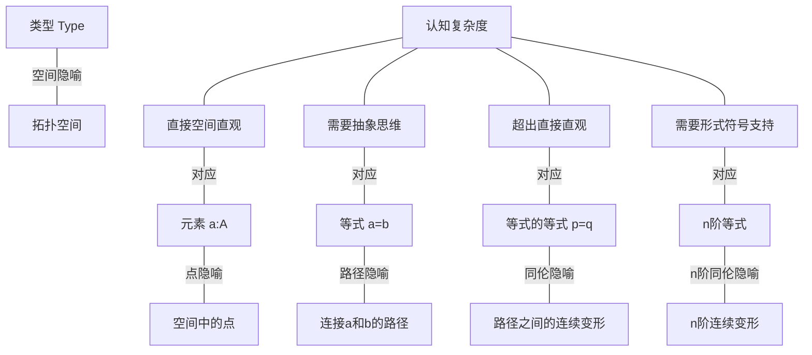
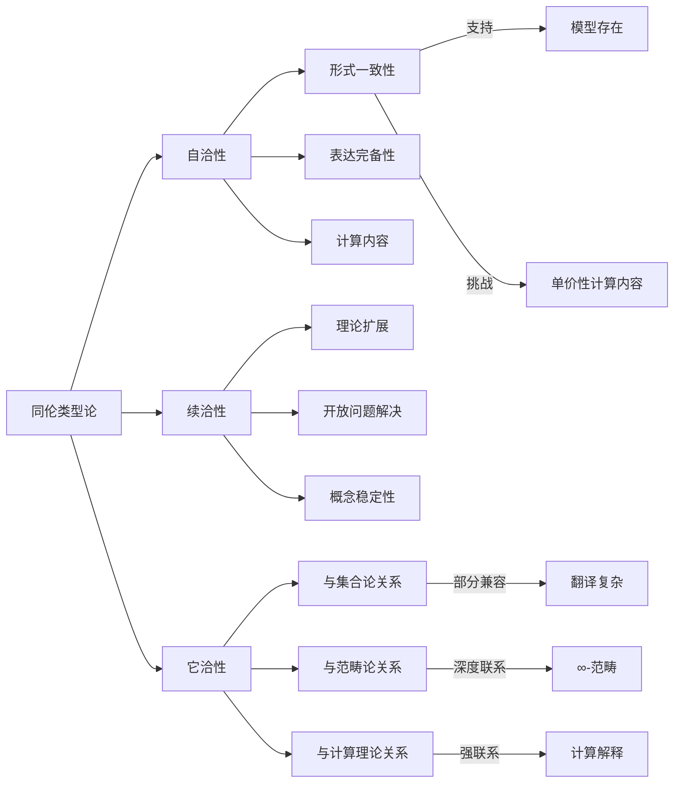
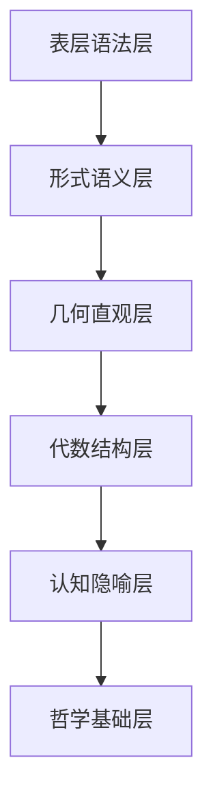
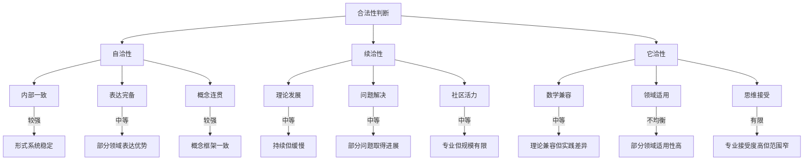

# 同伦类型论的批判性审查：合法性、支撑理论与多维认知分析

## 目录

- [同伦类型论的批判性审查：合法性、支撑理论与多维认知分析](#同伦类型论的批判性审查合法性支撑理论与多维认知分析)
  - [目录](#目录)
  - [1. 引言：同伦类型论的理论定位与批判视角](#1-引言同伦类型论的理论定位与批判视角)
  - [2. 同伦类型论内部结构的批判性分析](#2-同伦类型论内部结构的批判性分析)
    - [2.1 定理与证明的多层次表征与认知隐喻](#21-定理与证明的多层次表征与认知隐喻)
    - [2.2 模型关联性与自我指涉问题](#22-模型关联性与自我指涉问题)
    - [2.3 核心定理的隐喻内涵与外延](#23-核心定理的隐喻内涵与外延)
  - [3. 同伦类型论的论证合法性审查](#3-同伦类型论的论证合法性审查)
    - [3.1 自洽性：形式系统的内部一致性](#31-自洽性形式系统的内部一致性)
    - [3.2 续洽性：理论发展与扩展的连贯性](#32-续洽性理论发展与扩展的连贯性)
    - [3.3 它洽性：与外部理论体系的兼容性](#33-它洽性与外部理论体系的兼容性)
  - [4. 认知结构与同伦类型论的映射关系](#4-认知结构与同伦类型论的映射关系)
    - [4.1 空间-路径隐喻的认知基础](#41-空间-路径隐喻的认知基础)
    - [4.2 多层次抽象与认知复杂度障碍](#42-多层次抽象与认知复杂度障碍)
    - [4.3 形式与直觉的认知鸿沟](#43-形式与直觉的认知鸿沟)
  - [5. 同伦类型论的数学意义与现实意义](#5-同伦类型论的数学意义与现实意义)
    - [5.1 数学基础的重构：价值与代价](#51-数学基础的重构价值与代价)
    - [5.2 信息世界的形式化表达](#52-信息世界的形式化表达)
    - [5.3 AI与形式验证的理论基础](#53-ai与形式验证的理论基础)
  - [6. 价值哲学视角下的同伦类型论](#6-价值哲学视角下的同伦类型论)
    - [6.1 认识论价值：知识的新形式](#61-认识论价值知识的新形式)
    - [6.2 方法论价值：形式化的极限与可能](#62-方法论价值形式化的极限与可能)
    - [6.3 实践价值：理论应用的现实前景](#63-实践价值理论应用的现实前景)
  - [7. 综合评估与前景展望](#7-综合评估与前景展望)
    - [7.1 理论成熟度与开放问题](#71-理论成熟度与开放问题)
    - [7.2 跨学科整合的可能路径](#72-跨学科整合的可能路径)
    - [7.3 终极评判：同伦类型论的理念价值](#73-终极评判同伦类型论的理念价值)
  - [结论：同伦类型论的批判性总体评价](#结论同伦类型论的批判性总体评价)
  - [多维表征模型](#多维表征模型)
    - [空间-路径-同伦层次映射图](#空间-路径-同伦层次映射图)
    - [同伦类型论的多维认知映射表](#同伦类型论的多维认知映射表)
    - [同伦类型论的理论自洽性与关联性分析](#同伦类型论的理论自洽性与关联性分析)
    - [同伦类型论的价值维度评估](#同伦类型论的价值维度评估)
  - [8. 多层次认知解析与模型对比](#8-多层次认知解析与模型对比)
    - [8.1 同伦类型论的认知层次结构](#81-同伦类型论的认知层次结构)
    - [8.2 同伦类型论与其他形式系统的模型对比](#82-同伦类型论与其他形式系统的模型对比)
    - [8.3 认知隐喻的有效性与局限性分析](#83-认知隐喻的有效性与局限性分析)
  - [9. 同伦类型论的哲学维度](#9-同伦类型论的哲学维度)
    - [9.1 本体论立场：结构与身份的重新思考](#91-本体论立场结构与身份的重新思考)
    - [9.2 认识论框架：知识形式与证明理念](#92-认识论框架知识形式与证明理念)
    - [9.3 价值哲学：统一性、构造性与形式美](#93-价值哲学统一性构造性与形式美)
  - [10. 终极评判：同伦类型论的价值审视](#10-终极评判同伦类型论的价值审视)
    - [10.1 理论价值的多维度评估](#101-理论价值的多维度评估)
    - [10.2 自洽、续洽与它洽的综合判断](#102-自洽续洽与它洽的综合判断)
    - [10.3 同伦类型论作为理念的终极价值](#103-同伦类型论作为理念的终极价值)
  - [结论：同伦类型论的多维综合评价](#结论同伦类型论的多维综合评价)

## 1. 引言：同伦类型论的理论定位与批判视角

同伦类型论(HoTT)位于数学基础、逻辑学、计算理论和认知科学的交叉点上，代表了一种将类型论与代数拓扑深度整合的数学基础系统。
HoTT的核心隐喻"类型即空间，等式即路径"不仅是技术构造，更是一种认知框架的转换，从"集合-元素"思维模式转向"空间-路径"思维模式。

本文采取批判性视角，审视HoTT的理论合法性、认知基础和实际价值，而非单纯介绍或辩护。
我们将探究以下关键问题：

1. HoTT内部的定理、证明和表征是否具有内在连贯性和认知合理性？
2. HoTT的理论构建是否支撑其自身的有效性和自我解释能力？
3. HoTT与人类认知结构、数学实践和现实世界的关系如何？

这种批判不采用辩证法的正反合模式，而是通过多维度深层分析，揭示HoTT作为数学基础和认知工具的真实价值与局限。

## 2. 同伦类型论内部结构的批判性分析

### 2.1 定理与证明的多层次表征与认知隐喻

HoTT的内部结构建立在一系列多层次表征和认知隐喻上，这些表征和隐喻既是理解系统的工具，也是系统本身的组成部分。

**多层次表征系统**：

HoTT中的定理和证明至少包含四层表征：

1. **语法表征**：形式符号系统和判断规则
2. **几何表征**：点、路径、同伦的空间直观
3. **代数表征**：群结构、同伦群和高阶代数操作
4. **计算表征**：证明的算法内容和计算过程

这种多层次表征使同一数学对象或概念可以从不同角度理解，
但也引发了问题：这些表征之间的转换并非总是自然或直观的。
特别是，当涉及高阶路径（路径之间的路径）时，几何直观可能会失效，导致认知障碍。

**核心认知隐喻网络**：

HoTT依赖的核心隐喻网络包括：

- 类型 → 空间
- 元素 → 点
- 等式 → 路径
- 等式的等式 → 同伦（路径之间的连续变形）
- 函数 → 连续映射

这种隐喻系统不仅是解释工具，也深刻影响了HoTT的形式结构设计。然而，关键问题在于：这些隐喻是否真正反映了数学的本质结构，还是仅仅是一种有用但非必要的理解框架？

**批判观点**：

1. HoTT的多层次表征虽然理论上丰富，但在实践中可能导致理解负担和认知割裂。例如，单价性公理在几何直观中简洁明了，但其形式实现和计算内容却相当复杂。

2. 隐喻系统在高维情况下的有效性值得质疑。人类直观难以把握高阶同伦，而HoTT的核心优势恰恰在于处理这些高阶结构。这造成了一种悖论：理论越是发挥其优势，其认知可达性就越低。

3. 多层次表征可能导致概念的重复或模糊。例如，"相等"概念在HoTT中变得极为复杂，有命题相等、路径相等、同伦相等等多种形式，这可能违背了奥卡姆剃刀原则。

### 2.2 模型关联性与自我指涉问题

HoTT内部建立了丰富的模型网络，连接不同数学领域的结构，但这种模型关联性也带来了自我指涉和基础问题。

**内部模型谱系**：

HoTT内部模型包括：

- 代数模型：群、环、模、高阶代数结构
- 几何模型：拓扑空间、流形、纤维丛
- 范畴模型：范畴、函子、自然变换、高阶范畴
- 计算模型：算法、递归、规约、计算复杂性

这些模型通过精确的数学定义相互关联，形成一个统一的结构网络。然而，这种统一性可能掩盖了深层次的问题。

**自我指涉与基础问题**：

HoTT作为基础系统，面临自我指涉的挑战：它如何解释自身？主要问题包括：

1. **一致性问题**：HoTT的一致性依赖于外部模型（如单纯集合模型），这些模型本身建立在其他数学基础（如ZFC集合论）之上。这似乎导致了循环论证。

2. **元理论问题**：系统无法完全内部化讨论自身的元理论性质，受到哥德尔不完备定理的限制。

3. **自我解释能力**：HoTT能否为其自身的基本概念和操作提供内部的解释和证明？

**批判观点**：

1. HoTT的内部模型网络虽然数学上优雅，但可能存在概念混淆。不同领域的概念（如拓扑学中的空间和类型论中的类型）被等同，这种等同是否反映了真正的本质同一性，还是仅仅是形式上的相似性？

2. 过度追求统一性可能导致对各领域特殊性和复杂性的忽视。例如，HoTT处理经典分析中的连续性和无限性概念时，可能失去了某些直观性和操作便利性。

3. HoTT是否真正解决了数学基础问题，还是仅仅转移了问题的位置？它可能只是用一种复杂性（类型层次和同伦结构）替代了另一种复杂性（集合论悖论和公理选择）。

### 2.3 核心定理的隐喻内涵与外延

HoTT的核心定理和公理，特别是单价性公理，不仅具有技术内容，还蕴含丰富的隐喻内涵和外延意义。这些内涵和外延直接关系到HoTT的认知合理性和数学价值。

**单价性公理的多层意义**：

单价性公理（Univalence Axiom）表达为：`(A = B) ≃ (A ≃ B)`，意味着类型相等与类型等价之间存在等价关系。这一公理具有多层意义：

1. **技术层面**：允许通过证明等价来证明相等，简化了某些证明
2. **哲学层面**：体现了结构主义的数学观，认为结构等同即对象相同
3. **认知层面**：反映了数学家实践中"同构对象可视为相同"的工作原则

**路径归纳原理的认知基础**：

路径归纳原理（J-rule）是HoTT推理系统的核心，形式上表达为：

```math
J : ∀(A:Type)(a:A)(C:∀(x:A), a=x→Type), C(a,refl_a) → ∀(x:A)(p:a=x), C(x,p)
```

这一原理的认知基础是：

1. 从基本情况（自反性）推广到一般情况的归纳思维模式
2. 相等性的基础是自同一性（self-identity）
3. 同一对象在不同状态之间的转换可以传递属性

**批判观点**：

1. 单价性公理虽然概念上优雅，但在实践中引入了计算内容的复杂性问题。它无法直接计算，需要额外的计算规则，这破坏了类型论的一个核心特性：规范化。

2. 路径归纳原理在技术上必要，但认知上可能不自然。传统的相等推理（如莱布尼兹替换原则）对人类思维可能更直观，而J-rule的使用需要构造复杂的依赖类型谓词。

3. 核心定理的隐喻内涵虽然丰富，但可能导致概念混淆。例如，"路径"既是技术构造，也是认知隐喻，这种双重角色可能模糊了形式系统和解释模型之间的界限。

关键问题是：这些定理是否揭示了数学的本质结构，还是仅仅是一种特定视角下的形式构造？它们的引入是否解决了真正的数学问题，还是为了满足形式系统的内部需求？

## 3. 同伦类型论的论证合法性审查

### 3.1 自洽性：形式系统的内部一致性

HoTT作为形式系统的自洽性是其合法性的基础，包括逻辑一致性、表达完备性和概念连贯性。

**逻辑一致性支持**：

HoTT的逻辑一致性主要通过以下方式论证：

1. **模型论证**：基于已有一致性模型（如Voevodsky的单纯集模型）的元数学论证
2. **保守扩展**：证明系统的关键扩展（如单价性公理）不会导致矛盾
3. **规范化性质**：证明系统的核心部分（不含单价性公理）具有强规范化性质

然而，这些论证存在局限：单价性公理的一致性依赖于元数学论证，而非系统内部证明；加入单价性后，系统的规范化性质受到破坏，需要额外机制（如立方类型论）恢复。

**表达完备性问题**：

HoTT的表达能力体现在：

- 能够形式化大多数经典数学结构和定理
- 提供了表达等价关系和高阶结构的自然方式
- 通过高阶归纳类型扩展了表达能力，可定义复杂拓扑空间

但表达完备性也面临挑战：某些数学领域（如测度论、概率论）在HoTT中的自然表达尚未完全解决；经典数学中依赖排中律的证明在HoTT中需要重新构造；处理无限和连续性的方式与传统数学存在差异。

**自洽性的深层问题**：

HoTT自洽性的深层问题在于：

1. 系统建立在复杂的类型判断和推理规则之上，这些规则的组合复杂度高
2. 单价性公理虽然概念上自然，但在形式系统中引入了额外复杂性
3. 系统的自我解释能力有限，无法完全内部化讨论自身的元理论性质

**批判观点**：

HoTT的自洽性论证依赖于外部理论框架，这在某种程度上违背了其作为基础系统的初衷。真正的自洽性应该是系统能够自我支持和自我解释，而HoTT的合法性部分依赖于其他数学基础（如ZFC）的支持。

关键问题是：HoTT的自洽性是真正的内在一致性，还是依赖外部视角的片面观察？系统的复杂性是否掩盖了潜在的不一致性？

### 3.2 续洽性：理论发展与扩展的连贯性

续洽性指理论随时间演化保持连贯性的能力，是HoTT合法性的重要维度。

**理论扩展的连贯性**：

HoTT的理论扩展包括：

- 立方类型论：恢复单价性公理下的计算内容
- 二维类型论：提供更直接的高阶路径表示
- 凝聚同伦类型论：处理更复杂的拓扑现象

这些扩展是否保持了与原始理论的连贯性？是否引入了概念断裂或不兼容性？

**解决开放问题的进展**：

HoTT面临的主要开放问题包括：

- 单价性公理的计算内容问题
- 高阶归纳类型的规范化性质
- 与经典数学实践的兼容性

这些问题的解决进展如何？是否存在系统性障碍？

**批判观点**：

1. HoTT的理论扩展似乎遵循了"复杂性堆积"而非"本质简化"的路径。每个扩展都增加了系统的概念负担，而不是揭示更简单的底层原理。

2. 核心开放问题（如单价性的计算内容）的解决方案往往引入了更多的技术复杂性，而不是更简洁的原理。这可能暗示理论结构中存在根本性问题。

3. 理论发展路径显示出某种程度的特殊性，而非普遍性。扩展主要服务于特定数学领域（如代数拓扑），可能忽视了其他数学分支的需求。

关键问题是：HoTT的理论发展是否展现了真正的续洽性，即通过更深层次的原理统一解决问题，还是仅仅通过技术扩展和特例处理来应对挑战？

### 3.3 它洽性：与外部理论体系的兼容性

它洽性指HoTT与其他理论体系的兼容性和协调性，这关系到其作为数学基础的普遍接受度。

**与经典数学的关系**：

HoTT与经典数学的关系表现为：

- 能够重新证明大多数经典数学定理，但证明方式和表达形式可能不同
- 对某些经典概念（如集合成员关系）提供了不同的解释
- 在处理排中律等经典原理时采取了不同立场

**与其他形式系统的映射**：

HoTT与其他形式系统（如ZFC集合论、范畴论、λ演算）之间存在复杂的映射关系：

- 与集合论的部分翻译和解释
- 与范畴论的深度联系和互译
- 与类型化λ演算的扩展关系

**批判观点**：

1. HoTT与经典数学的差异可能超出了表达形式的不同，涉及某些基本概念的本质重新解释。这种重新解释是否总是保持了数学思想的本质，还是在某些情况下改变了概念的核心含义？

2. 与其他形式系统的映射存在不完美之处。例如，HoTT中的某些构造在集合论中表达复杂，反之亦然。这种不完美映射可能反映了不同系统之间的本质差异，而非表面差异。

3. HoTT要求数学家采用新的思维模式，从"集合-元素"模式转向"空间-路径"模式。这种转换的认知代价是否被充分评估？是否适用于所有数学领域？

关键问题是：HoTT是否实现了真正的"它洽"，即能够与其他理论体系建立一致且自然的联系，或者它是一个相对孤立的形式系统，与主流数学实践存在本质隔阂？

## 4. 认知结构与同伦类型论的映射关系

### 4.1 空间-路径隐喻的认知基础

HoTT的核心隐喻"类型即空间，等式即路径"建立在特定认知结构之上，这些认知结构既影响理论的发展，也决定了理论的可理解性。

**空间认知与数学思维**：

人类空间认知具有以下特征：

- 三维空间直观是认知的基础层次
- 通过隐喻和抽象扩展到高维空间
- 依赖视觉-运动系统的神经基础

HoTT利用这种空间认知，将抽象类型概念映射到空间直观，使复杂的形式系统更易理解。然而，这种映射也存在局限。

**路径思维的认知限制**：

路径思维具有以下认知特性：

- 基于连续运动和变化的直观
- 容易理解一阶路径（点之间的连接）
- 高阶路径（路径之间的变形）超出直接直观

HoTT中的高阶路径结构可能超出了人类认知的自然范围，需要专门训练和抽象思维才能把握。

**批判观点**：

1. HoTT的空间-路径隐喻在低维情况下非常有效，但在处理高阶同伦时可能失效，导致认知断裂。这不仅是技术问题，也是认知心理学问题：人类思维是否适合直接处理高维拓扑结构？

2. 隐喻系统的有效性可能因个体认知风格而异。视觉-空间思维强的人可能更容易接受HoTT的空间隐喻，而倾向代数-符号思维的人可能感到障碍。

3. 隐喻系统可能掩盖形式系统的某些复杂性和限制，创造了过度简化的理解。真正掌握HoTT需要超越隐喻，理解形式系统的技术细节。

关键问题是：HoTT的核心隐喻是否真正符合人类认知的自然模式，还是一种技术上可行但认知上昂贵的构造？它是否真正捕捉了数学思维的本质，还是仅仅提供了一种特殊视角？

### 4.2 多层次抽象与认知复杂度障碍

HoTT的多层次抽象结构与认知复杂度之间存在紧张关系，这影响了理论的可学习性和可用性。

**抽象层次分析**：

HoTT包含多个抽象层次：

1. 基本类型和元素（对应点）
2. 恒等类型和路径（一阶路径）
3. 路径之间的路径（二阶路径）
4. 更高阶路径结构（n阶路径）
5. 类型宇宙层次（Type₀, Type₁, ...）

每上升一个抽象层次，认知负担显著增加，需要更强的抽象思维能力。

**认知复杂度障碍**：

主要认知障碍包括：

- **概念负担**：需要同时处理多层次概念和它们之间的关系
- **符号复杂性**：形式表达的符号密度和复杂性增加
- **推理跨度**：典型证明中需要的推理步骤和转换增多
- **直观缺失**：高阶概念缺乏直接的感知或经验基础

**批判观点**：

1. HoTT的认知复杂度可能超过了大多数数学家的工作记忆容量和抽象思维能力。即使对专业数学家而言，掌握全部理论也需要极高的认知投入，这限制了理论的实际应用范围。

2. 不同抽象层次之间的映射并非总是透明的。例如，从直观的几何理解转换到精确的形式推理，或从低阶路径概念扩展到高阶路径，往往需要概念上的飞跃。

3. 系统的教育路径尚未充分发展。与传统数学分支相比，HoTT缺乏从初级到高级的清晰学习路径，增加了入门障碍。

关键问题是：HoTT的认知复杂度是否反映了数学对象的内在复杂性，还是形式系统本身的人为复杂性？是否存在更认知友好的替代表达方式？

### 4.3 形式与直觉的认知鸿沟

HoTT中形式系统与直观理解之间存在认知鸿沟，这影响了理论的发展和应用。

**形式与直觉的双重编码**：

数学思维通常依赖两种互补的表征系统：

- **形式表征**：精确的符号系统和推理规则
- **直观表征**：几何图像、隐喻和经验类比

HoTT试图通过空间-路径隐喻建立这两个系统之间的桥梁，但这种桥梁可能不够稳固。

**认知鸿沟的表现**：

形式与直觉之间的鸿沟表现为：

- 直观理解的内容难以精确转化为形式证明
- 形式推导的结果有时违背直观预期
- 当处理高阶结构时，直观可能完全失效

**批判观点**：

1. HoTT的形式系统可能过度复杂化了某些直观上简单的概念。例如，相等性这一基本概念在HoTT中变成了多层次结构，可能增加了不必要的认知负担。

2. 隐喻系统的有效范围有限。虽然"类型即空间"的隐喻在基础层次上有效，但当涉及复杂的类型构造（如依赖积类型）或高阶路径时，隐喻系统可能无法提供有效指导。

3. 形式系统的技术细节可能掩盖概念的本质，导致"看不见森林只见树木"的问题。证明中的技术操作可能占据认知资源，使核心数学思想变得模糊。

关键问题是：HoTT是否真正实现了形式与直觉的和谐统一，还是创造了一个形式上精确但直观上困难的系统？这种统一是否适用于所有数学领域，还是仅限于特定领域？

## 5. 同伦类型论的数学意义与现实意义

### 5.1 数学基础的重构：价值与代价

HoTT作为数学基础的重构尝试，既有潜在价值，也有明显代价。

**潜在价值**：

1. **统一性**：提供了连接不同数学领域的统一语言
2. **精确性**：形式化了"等价即相等"的数学实践原则
3. **构造性**：强调证明的构造内容，有利于计算实现
4. **表达能力**：自然表达高阶代数结构和拓扑概念

**明显代价**：

1. **学习曲线**：陡
继续完成上一部分的内容：

**明显代价**：

1. **学习曲线**：陡峭的学习曲线和高认知负担
2. **技术复杂性**：处理基本概念需要复杂的形式机制
3. **实践隔离**：与主流数学实践存在距离
4. **概念重构**：需要重新思考和表达已建立的数学概念

**批判观点**：

1. HoTT的重构是否解决了真正的数学问题，还是创造了新的复杂性？传统数学基础（如ZFC集合论）虽有理论缺陷，但在实践中运作良好，HoTT的优势是否足以证明转换的必要性？

2. 相对于投入的认知资源，HoTT的回报是否充分？简化某些拓扑证明的同时，是否复杂化了其他领域的工作？

3. HoTT强调的"等价即相等"原则，虽然反映了数学家的非正式实践，但其形式化可能过度僵化了一个本应灵活的原则。数学家在实践中区分"等同"和"同构"的能力是否被保留？

关键问题是：HoTT的数学基础重构是真正的革命性突破，还是对特定数学领域的形式化优化？它的价值是否超过了其认知和技术代价？

### 5.2 信息世界的形式化表达

HoTT与现代信息科学和计算理论的关系是评估其现实意义的重要维度。

**形式化信息结构**：

HoTT为信息世界提供的形式化包括：

- 程序与类型的严格对应（柯里-霍华德同构的扩展）
- 程序等价性的精确表达（通过路径和同伦）
- 复杂数据结构的形式化（通过高阶归纳类型）
- 分布式系统性质的形式化（一致性、容错性等）

**理论到实践的转化**：

从理论到实践应用的转化路径包括：

- 编程语言设计（依赖类型系统、效果系统等）
- 形式验证工具（证明助手、程序验证器等）
- 软件规范与验证方法（基于类型的规范）

**批判观点**：

1. HoTT的高度抽象性可能限制其在实用信息系统中的直接应用。理论与实践之间存在显著鸿沟，需要大量中间层技术来弥合。

2. 从HoTT证明中提取高效算法仍然是一个重大挑战。形式证明的计算内容可能产生效率低下的算法，需要额外优化。

3. HoTT对信息世界的形式化可能过度理想化，忽视了现实系统的复杂性、不确定性和演化特性。形式化可能捕捉了系统的骨架，但遗漏了血肉。

关键问题是：HoTT是否提供了信息世界的本质模型，还是仅仅一种特定抽象？它能否有效处理现实信息系统的全部复杂性，还是仅适用于特定领域？

### 5.3 AI与形式验证的理论基础

HoTT作为AI系统和形式验证的理论基础，既有潜力，也面临挑战。

**形式验证潜力**：

HoTT在形式验证中的潜力：

- 提供统一的证明框架，涵盖从代数到拓扑的广泛性质
- 通过路径归纳简化等价性证明
- 为复杂系统性质（如分布式一致性）提供精确形式化

**AI理论联系**：

与AI系统的理论联系：

- 知识表征的形式化基础
- 不确定性和等价关系的精确模型
- 类型作为神经网络操作的规范

**批判观点**：

1. HoTT与主流AI研究（如深度学习、强化学习）之间存在方法论鸿沟。当前AI成功主要来自统计和优化方法，而非形式逻辑，HoTT如何桥接这一鸿沟尚不清晰。

2. 形式验证的实用性受到规模和复杂性的限制。HoTT虽然提供了强大的理论框架，但验证实际大型系统仍然面临计算复杂性和规范表达挑战。

3. HoTT的确定性框架可能不适合处理AI系统固有的不确定性和模糊性。尽管HoTT可以形式化概率和不确定性，但这种形式化是否能有效捕捉AI系统的本质特性？

关键问题是：HoTT能否真正连接形式化推理与现代AI的统计学习方法，为更强大的智能系统提供理论基础？还是这两种范式将继续平行发展？

## 6. 价值哲学视角下的同伦类型论

### 6.1 认识论价值：知识的新形式

从认识论角度评估HoTT的价值，涉及它如何影响我们获取、组织和理解数学知识的方式。

**知识形式的创新**：

HoTT引入的知识形式创新：

- 将等价关系提升为一等公民（而非派生概念）
- 强调结构而非元素的本质性
- 通过多层次同伦结构表达细致的区别
- 融合几何直观与形式精确性

**知识组织的重构**：

对数学知识组织的影响：

- 基于类型层次而非集合包含关系的知识体系
- 以同伦层次结构化数学对象谱系
- 通过类型构造器系统化数学结构关系

**批判观点**：

1. HoTT提供的知识形式是否真正超越了传统数学？它可能仅仅是重新包装了已有的数学直观，以更复杂的形式系统表达。

2. 知识的形式化是否导致意义的贫乏？严格的形式化可能牺牲了数学概念的丰富内涵和非形式直观。

3. 高度形式化的知识形式是否增加了认知负担？形式精确性与认知可达性之间可能存在根本张力。

关键问题是：HoTT创造的知识形式是否真正代表了认识论进步，还是仅仅是一种知识表达风格的变化？它是否增强了人类理解数学的能力？

### 6.2 方法论价值：形式化的极限与可能

HoTT代表了数学形式化的一种极致尝试，其方法论价值关系到形式化方法的根本局限与可能性。

**形式化的深度**：

HoTT推动形式化达到新深度：

- 将数学实践中的非形式原则（如"等价结构视为相同"）形式化
- 通过高阶归纳类型形式化复杂拓扑空间
- 使用路径代数形式化几何直观

**形式化的边界**：

HoTT也显示了形式化的边界：

- 形式系统的复杂性可能超过人类认知能力
- 某些直观概念的形式化可能不自然或低效
- 完全形式化可能与创造性数学实践相违背

**批判观点**：

1. HoTT的形式化可能过度追求完备性而牺牲了实用性。它试图捕捉数学的所有细节，但可能创造了过于繁重的形式系统。

2. 形式化是否应该是目标本身，还是理解的工具？HoTT可能将形式化从工具转变为目的，导致方法论颠倒。

3. HoTT的形式化强调了某些数学方面（如拓扑结构），可能以牺牲其他方面（如计算效率）为代价。这种偏向反映了特定的数学价值观，而非中立的方法论。

关键问题是：HoTT所代表的形式化尝试是否接近了形式化的内在极限？它是否揭示了数学知识的本质结构，还是仅仅创造了另一种形式语言？

### 6.3 实践价值：理论应用的现实前景

评估HoTT的实践价值需要考察其在解决实际问题中的有效性和应用前景。

**潜在应用领域**：

HoTT的潜在应用包括：

- 数学基础研究与形式化
- 编程语言设计与类型系统
- 软件验证与正确性证明
- 分布式系统的形式化模型
- 量子计算的理论基础

**应用挑战**：

实际应用面临的挑战：

- 工具支持和自动化程度有限
- 专业人才稀缺，学习曲线陡峭
- 与现有系统和方法的整合困难
- 实际规模问题的计算复杂性

**批判观点**：

1. HoTT的实际应用似乎主要限于理论领域，鲜有改变工业实践的实例。理论的优雅是否转化为实践的效益仍是开放问题。

2. 投资回报比值得质疑。掌握和应用HoTT需要大量认知资源，这些资源是否能带来相应的实践价值？

3. HoTT可能是"过度设计"的案例——为了解决理论问题而创造的系统，超出了大多数实际应用的需求。工程上的简单解决方案可能在实践中更有效。

关键问题是：HoTT是否能从理论领域转化为广泛的实践应用？它的复杂性是否注定将其限制在特定的学术圈子内？

## 7. 综合评估与前景展望

### 7.1 理论成熟度与开放问题

HoTT作为相对年轻的理论，其成熟度和开放问题是评估其前景的关键因素。

**理论成熟度评估**：

当前成熟度表现在：

- 核心公理系统已经稳定
- 基本数学结构的形式化已完成
- 多个实现（如Coq、Agda中的HoTT库）可用
- 已有经典数学定理的形式化证明

**关键开放问题**：

主要开放问题包括：

- 单价性公理的计算内容和规范化
- 高阶归纳类型的理论完备性
- 与经典数学的完全兼容性
- 高效自动证明方法的发展

**批判观点**：

1. 核心开放问题（特别是计算内容和规范化）的持续存在可能暗示理论结构中的根本缺陷，而非仅是技术难题。

2. 理论进展似乎主要来自小群体专家，而非广泛社区，这可能限制了理论的多样化发展和应用拓展。

3. 某些开放问题的解决方向（如立方类型论）增加而非减少了理论复杂性，这种复杂性增长路径是否可持续？

关键问题是：HoTT的理论发展是否处于健康轨道，还是面临着根本性障碍？开放问题是否反映了临时技术挑战，还是更深层次的概念问题？

### 7.2 跨学科整合的可能路径

HoTT的未来很大程度上取决于它与其他学科和领域的整合可能性。

**潜在整合路径**：

可能的跨学科整合包括：

- 与计算机科学（编程语言、形式验证）的深度整合
- 与认知科学的对话（数学认知、表征理论）
- 与物理学的联系（量子理论、空间时间模型）
- 与信息科学的融合（复杂系统、信息结构）

**整合挑战**：

整合面临的挑战：

- 学科间术语和概念框架差异
- 不同领域价值观和方法论差异
- 共同问题识别和定义的困难
- 跨学科沟通和协作的实际障碍

**批判观点**：

1. HoTT可能过于专业化，难以有效融入其他学科。其高度抽象和技术特性可能阻碍非专业人士的参与和理解。

2. 跨学科整合需要双向影响，而HoTT似乎主要寻求单向应用，即将其理论应用于其他领域，而非真正吸收其他领域的见解。

3. 整合尝试可能停留在表面层次，而非实质性融合。例如，与物理学的联系可能仅限于形式化已有理论，而非产生新的物理洞见。

关键问题是：HoTT能否真正促进学科间的深度对话和融合，还是将继续作为数学基础的专门化研究方向？它能否克服高度抽象带来的沟通障碍？

### 7.3 终极评判：同伦类型论的理念价值

最终，HoTT的价值不仅在于其技术内容，还在于它所体现的数学和科学理念。

**体现的核心理念**：

HoTT体现的理念包括：

- 结构主义的数学观（结构而非元素是本质的）
- 构造主义的证明理念（证明应有计算内容）
- 统一性的追求（连接不同数学领域）
- 形式与直观的和谐（几何直观与形式精确的结合）

**理念价值的评判**：

理念价值的评判标准：

- 对数学认知的深化程度
- 对科学方法论的启发
- 对跨领域思维的促进
- 对形式化限制的突破

**批判观点**：

1. HoTT所体现的理念可能并非真正原创，而是已有数学哲学思想（如结构主义、构造主义）的形式化重述。它是否真正提供了新的数学视角？

2. 理念的价值与实现的复杂性之间存在张力。HoTT的技术复杂性可能掩盖了其理念价值，使核心思想难以被广泛理解和应用。

3. HoTT可能代表了一种特定的数学审美和价值观，而非普遍真理。对结构、统一性和形式精确性的强调反映了特定的数学文化，而非数学的客观本质。

关键问题是：HoTT所体现的理念是否代表了数学思维的真正进步？它是否开启了理解数学和现实世界的新视角，还是仅仅提供了另一种数学风格？

## 结论：同伦类型论的批判性总体评价

同伦类型论作为一种数学基础系统和认知框架，展现了令人印象深刻的技术深度和概念创新。它通过"类型即空间，等式即路径"的核心隐喻，创造了一个能够自然处理等价关系的形式系统，并为数学提供了新的表达和证明方式。

然而，通过多维批判性分析，我们看到HoTT也面临显著挑战：

1. **自洽性问题**：虽然HoTT在形式上自洽，但其完整性和计算内容（特别是单价性公理）仍存在开放问题，且部分依赖外部理论的支持。

2. **认知障碍**：HoTT的多层次抽象结构可能超出人类自然认知能力，特别是在处理高阶同伦结构时，几何直观难以有效支持形式推理。

3. **实践转化**：从理论到广泛实践应用的转化路径尚不清晰，高学习成本与实际回报之间的平衡值得质疑。

4. **方法论局限**：作为一种形式化尝试，HoTT可能接近了形式化的认知极限，展示了形式与直观之间的根本张力。

总体而言，HoTT代表了一种深刻但特殊的数学视角，其价值可能不在于取代传统数学基础，而在于提供互补视角和解决特定问题的工具。它的真正贡献可能不是技术细节，而是对数学本质的重新思考——强调结构而非元素，等价而非相等，过程而非结果。

在认知结构、数学意义和实践价值的多维度上，HoTT既显示了令人兴奋的可能性，也暴露了根本性挑战。无论其最终命运如何，HoTT已经成为数学基础、认知科学和形式化方法交叉点上的重要里程碑，值得持续关注与批判性探索。

## 多维表征模型

### 空间-路径-同伦层次映射图



### 同伦类型论的多维认知映射表

| HoTT概念 | 认知结构 | 直观表征 | 形式表征 | 认知复杂度 |
|---------|---------|---------|---------|-----------|
| 类型 | 概念范畴 | 空间 | A : Type | 低 |
| 元素 | 概念实例 | 点 | a : A | 低 |
| 恒等类型 | 关系认知 | 路径 | Id_A(a,b) | 中 |
| 路径组合 | 关系推理 | 路径连接 | p ⬝ q | 中 |
| 二阶路径 | 元关系 | 路径变形 | α : p = q | 高 |
| 单价性 | 结构等同性 | 空间等价 | UA : (A≃B)≃(A=B) | 极高 |
| 高阶归纳类型 | 规则构造 | 受限空间 | data S¹ : Type | 极高 |

### 同伦类型论的理论自洽性与关联性分析



### 同伦类型论的价值维度评估

| 价值维度 | 优势 | 挑战 | 总体评价 |
|---------|------|------|---------|
| 认识论价值 | 新的知识组织形式\等价关系的精确表达\结构而非元素的关注 | 高认知负担\形式化可能导致意义贫乏\专业隔离 | 中高：提供新视角但有认知代价 |
| 方法论价值 | 形式与直观的结合\构造性证明方法\多层次结构表达 | 形式系统复杂性\可能过度形式化\领域偏向性 | 中高：方法创新但有应用限制 |
| 实践价值 | 形式验证潜力\编程语言设计启示\复杂系统形式化 | 工具支持有限\学习曲线陡峭\与现有系统整合困难 | 中低：潜力显著但实现挑战大 |
| 理念价值 | 结构主义思想\构造主义实践\统一性视角 | 理念可能非原创\实现复杂性掩盖理念\特定数学文化 | 高：提供有价值的数学哲学视角 |

## 8. 多层次认知解析与模型对比

### 8.1 同伦类型论的认知层次结构

同伦类型论可以从多个认知层次进行解构分析，这有助于揭示其内在结构与外在意义的关联。

**认知层次模型**：



这六个层次从不同维度捕捉了HoTT的本质：

1. **表层语法层**：形式符号系统、判断规则和推导系统
2. **形式语义层**：类型解释、计算规则和证明理论
3. **几何直观层**：空间、路径和同伦的几何表征
4. **代数结构层**：群结构、同伦群和代数操作
5. **认知隐喻层**：核心隐喻网络和认知映射
6. **哲学基础层**：本体论立场、认识论框架和价值系统

**层次间张力**：

这些层次之间存在内在张力：

- 语法复杂性与直观简洁性的矛盾
- 形式精确性与认知可理解性的冲突
- 几何直观与代数形式的不完全对应
- 隐喻表征与哲学立场的潜在不一致

**批判观点**：

1. HoTT的认知层次结构可能过于复杂，导致理解分散。相比之下，其他数学基础（如ZFC）虽然哲学上可能不够优雅，但认知层次更为统一。

2. 不同层次的不完美对应可能导致概念断裂。例如，高阶路径在几何直观层难以把握，但在形式语义层却是核心构造。

3. 层次间的转换需要认知跳跃，增加了学习和应用的难度。这种多层次结构是否真正必要，还是一种可避免的复杂性？

### 8.2 同伦类型论与其他形式系统的模型对比

将HoTT与其他形式系统进行对比分析，可以更清晰地看到其特点和局限。

**多维对比框架**：

| 维度 | 同伦类型论 | ZFC集合论 | 范畴论 | 一阶逻辑 |
|-----|-----------|----------|--------|---------|
| 基本元素 | 类型和路径 | 集合和成员关系 | 对象和态射 | 谓词和量词 |
| 相等概念 | 多层次路径结构 | 外延相等 | 同构/等价 | 一阶相等 |
| 抽象程度 | 极高 | 中高 | 高 | 中 |
| 直观基础 | 空间-路径 | 容器-成员 | 箭头-组合 | 命题-推理 |
| 计算内容 | 内在（部分） | 外在 | 外在 | 外在 |
| 表达复杂度 | 高 | 中 | 中高 | 低 |
| 认知友好性 | 低（需专业训练） | 中（基于集合直觉） | 中（需特定思维） | 高（基于逻辑思维） |

**系统间的转换成本**：

不同系统之间的转换存在认知成本：

- HoTT→ZFC：需要展平多层次结构，失去路径信息
- ZFC→HoTT：需要重构集合概念，引入路径层次
- 范畴论→HoTT：较为自然，但需适应类型表达
- HoTT→一阶逻辑：高复杂度，多层次结构难以保留

**批判观点**：

1. HoTT在多维对比中显示出极高的表达能力，但代价是更高的认知复杂度和学习成本。这种权衡是否值得，取决于应用场景和目标。

2. HoTT可能过度追求表达能力和理论优雅，而牺牲了实用性和可接受性。相比之下，ZFC虽然理论上不够优雅，但已经足够满足大多数数学实践需求。

3. 不同形式系统各有优势，HoTT的出现是否真正代表了数学基础的进步，还是仅仅提供了另一种视角？是否需要"一个理论统治所有"，还是接受多元理论格局？

### 8.3 认知隐喻的有效性与局限性分析

HoTT的核心隐喻"类型即空间，等式即路径"是理解系统的关键，但这一隐喻系统的有效性和局限性值得深入分析。

**隐喻有效性谱系**：

隐喻有效性随概念复杂度变化：

- **高有效域**：基本类型、简单路径、函数类型
- **中等有效域**：依赖类型、路径代数、低阶同伦
- **低有效域**：高阶路径、复杂归纳类型、单价性计算
- **失效域**：无限维结构、高阶归纳递归、单价性交互

**隐喻局限性根源**：

核心隐喻的局限性源于：

1. **维度限制**：人类空间直观主要限于三维
2. **复杂性障碍**：直接直观难以把握多重嵌套结构
3. **经验约束**：缺乏对应高阶路径的日常经验
4. **认知资源**：处理高阶结构需要大量工作记忆资源

**批判观点**：

1. HoTT的核心隐喻可能创造了一种错误的亲近感，使初学者误以为理解了系统，而实际上只掌握了表面类比。真正理解需要超越隐喻，掌握形式系统本身。

2. 隐喻系统的局限性可能不仅是教学问题，也反映了理论本身的内在张力。如果核心概念超出了人类认知的自然范围，理论的价值和可用性就值得质疑。

3. 不同认知风格的人可能对这套隐喻系统有不同反应。视觉-空间思维强的人可能受益，而语言-符号思维强的人可能受阻。一个真正通用的数学基础是否应该更加认知中立？

## 9. 同伦类型论的哲学维度

### 9.1 本体论立场：结构与身份的重新思考

HoTT蕴含了对数学对象本质和身份的独特哲学立场，这一立场对理论的评价至关重要。

**结构本体论**：

HoTT体现的本体论立场：

- 数学对象由其结构关系定义，而非内在本质
- 结构等价的对象在本质上相同（单价性原则）
- 身份不是二值判定，而是多层次结构
- 关系网络优先于个体存在

这种立场与结构主义数学哲学一致，但HoTT将其形式化为精确的数学原则。

**身份概念的重构**：

HoTT重新思考了身份概念：

- 从"是否相同"到"如何相同"的转变
- 从判定问题到结构问题的转变
- 从外延判定到内涵证明的转变
- 从静态属性到动态关系的转变

**批判观点**：

1. HoTT的本体论立场可能过度倾向结构主义，忽视了数学中元素和具体实例的独特价值。数学实践中，我们不仅关心结构，也关心具体对象。

2. 身份概念的多层次化可能导致过度复杂化。传统的二值身份概念虽然简化，但在大多数数学实践中运作良好，复杂化是否必要？

3. 单价性原则作为本体论立场的形式化，可能过于强硬。数学家在实践中区分"相同"和"同构"的能力是否应该保留，而非强制统一？

关键问题是：HoTT的本体论立场是否真正捕捉了数学的本质，还是仅仅反映了特定数学文化和价值观？

### 9.2 认识论框架：知识形式与证明理念

HoTT提供了一个独特的数学认识论框架，这一框架关系到如何获取、验证和理解数学知识。

**构造主义知识观**：

HoTT体现的认识论立场：

- 数学知识需要构造性证明
- 证明即程序，具有计算内容
- 直接证明优先于间接证明
- 存在性断言需要显式构造

这种立场与构造主义数学哲学一致，强调证明的构造性内容。

**证明理念的转变**：

HoTT中的证明理念转变：

- 从真值证明到对象构造的转变
- 从外部验证到内部构造的转变
- 从静态判断到动态生成的转变
- 从抽象推理到具体操作的转变

**批判观点**：

1. HoTT的构造主义立场可能过于严格，排除了数学中有价值的非构造性方法。间接证明和排中律在数学实践中非常有用，完全放弃可能导致不必要的复杂性。

2. 证明即程序的理念虽然理论上优雅，但可能导致证明复杂化。有些概念上简单的证明在需要保持计算内容时变得冗长复杂。

3. 构造性要求可能限制了数学探索的范围和方法。数学发现往往始于非形式直觉和非构造性思考，过早形式化可能阻碍创造性。

关键问题是：HoTT的认识论框架是否真正增强了数学理解，还是仅仅增加了形式负担？它是否平衡了形式严谨性和认知可行性？

### 9.3 价值哲学：统一性、构造性与形式美

HoTT蕴含了特定的数学价值取向，这些价值观影响了理论的设计和评价标准。

**核心价值取向**：

HoTT体现的价值取向：

- **统一性**：连接不同数学领域的统一语言
- **构造性**：强调证明的计算内容和构造过程
- **形式美**：追求概念框架的优雅和整体一致
- **内涵性**：优先考虑对象的内部结构而非外部关系

这些价值取向塑造了HoTT的设计决策和理论发展方向。

**价值冲突与权衡**：

HoTT中的价值权衡：

- 统一性 vs. 领域特殊性
- 构造性 vs. 证明简洁性
- 形式美 vs. 实用便利性
- 概念纯度 vs. 应用灵活性

**批判观点**：

1. HoTT可能过度强调统一性和形式美，而牺牲了实用性和灵活性。数学实践中，特定领域的专门工具往往比统一框架更有效。

2. 构造性价值虽然重要，但不应成为唯一标准。数学价值是多元的，包括解释力、预测力、简洁性等，过度强调一个维度可能导致失衡。

3. HoTT的价值取向可能反映了特定数学文化的偏好，而非普遍必要性。不同数学传统和文化可能有不同的价值优先级，单一标准可能不适合多元数学实践。

关键问题是：HoTT的价值取向是否代表了数学的内在价值，还是特定社区的偏好？这些价值在多大程度上具有普遍性？

## 10. 终极评判：同伦类型论的价值审视

### 10.1 理论价值的多维度评估

对HoTT的终极评判需要综合多个维度，权衡其作为数学基础和认知工具的总体价值。

**多维度价值矩阵**：

| 价值维度 | 贡献程度 | 局限性 | 综合评估 |
|---------|---------|--------|---------|
| 数学内部价值 | 新的证明技术\拓扑结构形式化\等价原则的精确表达 | 技术复杂性高\应用范围有限\与传统数学隔阂 | **高**：提供了数学基础的新视角，但应用受限 |
| 哲学认识价值 | 结构主义形式化\身份概念的细化\关系优先的思维框架 | 本体论立场单一\过度形式化风险\认知复杂性高 | **中高**：深化了数学哲学思考，但偏向特定立场 |
| 教育培养价值 | 几何直观与形式的结合\空间思维的强化\类型化思维训练 | 入门门槛高\学习曲线陡峭\资源投入大 | **中低**：对高级学习有价值，但不适合基础教育 |
| 实践应用价值 | 形式验证潜力\复杂系统表达\编程语言启示 | 工具支持有限\专家稀缺\实施成本高 | **中**：有显著潜力，但实现路径尚不清晰 |
| 跨学科价值 | 数学与计算机科学桥梁\形式化与认知科学联系\理论物理形式基础 | 学科间沟通障碍\概念迁移困难\应用实例有限 | **中高**：提供了跨学科框架，但转化不充分 |

**综合价值评估**：

基于多维分析，HoTT的综合价值可评估为：

- 作为数学基础：**高价值但非唯一选择**
- 作为认知工具：**高潜力但有使用门槛**
- 作为实践方法：**中等价值待进一步发展**
- 作为跨学科桥梁：**高潜力但需更多实际应用**

**批判观点**：

1. HoTT的价值可能被其技术复杂性所掩盖。理论的核心洞见可能更简单，不一定需要完整的形式系统来表达。

2. 价值评估高度依赖于评判标准和价值取向。对注重形式精确性和统一性的人而言，HoTT价值极高；对注重实用性和可接受性的人而言，价值可能较低。

3. 真正的价值可能需要时间检验。当前评估可能过早，HoTT的长期影响和应用前景仍不确定。

### 10.2 自洽、续洽与它洽的综合判断

HoTT的合法性需要从自洽、续洽和它洽三个维度进行综合判断。

**三维合法性分析**：



**合法性综合判断**：

基于三维分析，HoTT的合法性可判断为：

- **自洽性**：**强**——形式系统内部一致，但有开放问题
- **续洽性**：**中等**——理论持续发展，但某些核心问题进展缓慢
- **它洽性**：**中等**——与某些领域深度兼容，但与主流数学实践存在隔阂

**批判观点**：

1. HoTT的合法性判断可能过度依赖形式自洽性，而忽视了实践适用性。真正的合法性应包括理论在实际数学和科学实践中的有效性。

2. 续洽性面临的挑战可能比表面更深。核心开放问题（如单价性的计算内容）的持续存在可能暗示理论结构中的根本缺陷。

3. 它洽性的不均衡可能限制理论的广泛影响。HoTT与某些领域（如代数拓扑）高度兼容，但与其他领域（如分析、概率）的关系较弱，这种不平衡可能限制其作为统一基础的潜力。

### 10.3 同伦类型论作为理念的终极价值

超越技术细节，HoTT作为一种数学理念和思维方式，具有独特的终极价值。

**理念价值层次**：

HoTT作为理念的价值表现在多个层次：

1. **认知层次**：提供了思考数学结构和关系的新方式
2. **方法论层次**：展示了形式化和直观结合的可能性
3. **哲学层次**：深化了对数学本质和基础的思考
4. **文化层次**：体现了数学社区对统一性和美的追求

**超越数学的启示**：

HoTT的理念价值超越数学领域：

- 对结构与关系优先于实体的思维方式
- 对多层次同一性的理解框架
- 对形式精确与直观理解的统一路径
- 对复杂系统中等价关系的处理方法

**批判观点**：

1. HoTT作为理念的价值可能被其技术复杂性所掩盖。核心思想可能更简单，不需要完整掌握形式系统就能获取理念价值。

2. 理念价值的实现可能需要更广泛的传播和转化。当前HoTT的影响主要限于专业数学和理论计算机科学，更广泛的理念影响尚未充分展现。

3. 作为理念，HoTT可能并非完全原创，而是已有数学哲学思想（如结构主义、构造主义）的形式化重述和深化。其真正的原创性和独特贡献需要进一步评估。

关键问题是：HoTT作为理念，是否真正代表了数学思维的突破和进步？它是否开启了理解数学和现实世界的新视角，还是仅仅提供了已有思想的另一种表达？

## 结论：同伦类型论的多维综合评价

同伦类型论（HoTT）作为一种数学基础系统、认知框架和哲学立场，同时具有显著的价值和明确的局限。通过多维批判性分析，我们得出以下综合评价：

HoTT的核心贡献在于将"等价即相等"的数学实践原则形式化为精确系统，通过"类型即空间，等式即路径"的核心隐喻创造了一个结构丰富的数学世界。这一理论不仅提供了新的证明技术和表达方式，也深化了我们对数学本质的哲学思考。

然而，HoTT也面临重大挑战：高度的认知复杂性可能超出人类直观把握能力；核心问题（如单价性的计算内容）仍未完全解决；与主流数学实践存在隔阂；实际应用的路径尚不清晰。这些挑战既是技术性的，也是概念性和认知性的。

HoTT的终极价值可能不在于取代传统数学基础，而在于提供互补视角和解决特定问题的工具。它的真正贡献不仅是技术创新，更是对数学本质的重新思考——强调结构而非元素，等价而非相等，过程而非结果。

在知识发展的长河中，HoTT代表了一种深刻但特殊的数学视角，其最终地位将取决于理论的进一步发展、实际应用的拓展，以及数学社区的接受度。无论其命运如何，HoTT已经成为数学基础、认知科学和形式化方法交叉点上的重要里程碑，值得持续关注与批判性探索。

正如任何真正深刻的理论，HoTT的价值不仅在于它已经回答的问题，更在于它提出的新问题和开启的新思路。在这个意义上，即使其技术细节最终被超越，HoTT所体现的思想仍将在数学和科学发展中留下持久印记。
