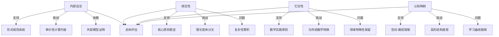
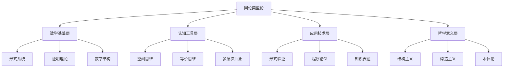
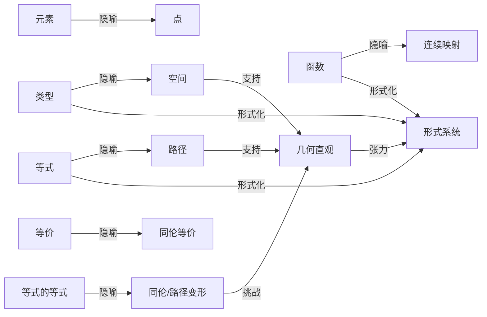

# 同伦类型论的批判性审查：证明严谨性、自洽性与认知意义

## 目录

- [同伦类型论的批判性审查：证明严谨性、自洽性与认知意义](#同伦类型论的批判性审查证明严谨性自洽性与认知意义)
  - [目录](#目录)
  - [1. 数学证明层面的严谨性分析](#1-数学证明层面的严谨性分析)
    - [1.1 形式证明系统的完整性与一致性](#11-形式证明系统的完整性与一致性)
    - [1.2 单价性公理的证明地位与计算内容](#12-单价性公理的证明地位与计算内容)
    - [1.3 高阶同伦结构的形式化挑战](#13-高阶同伦结构的形式化挑战)
  - [2. 自洽性的多层次分析](#2-自洽性的多层次分析)
    - [2.1 内部自洽：形式系统的逻辑一致性](#21-内部自洽形式系统的逻辑一致性)
    - [2.2 续洽性：理论演化的连贯性](#22-续洽性理论演化的连贯性)
    - [2.3 它洽性：与其他理论框架的兼容性](#23-它洽性与其他理论框架的兼容性)
  - [3. 多层次表征与认知结构](#3-多层次表征与认知结构)
    - [3.1 路径-空间隐喻的认知基础](#31-路径-空间隐喻的认知基础)
    - [3.2 同伦层次与人类认知极限](#32-同伦层次与人类认知极限)
    - [3.3 形式系统与直观理解的张力](#33-形式系统与直观理解的张力)
  - [4. 理论意义的哲学审视](#4-理论意义的哲学审视)
    - [4.1 数学本体论视角](#41-数学本体论视角)
    - [4.2 认知科学与数学思维](#42-认知科学与数学思维)
    - [4.3 信息世界与人工智能的理论基础](#43-信息世界与人工智能的理论基础)
  - [5. 综合评价：价值、局限与前景](#5-综合评价价值局限与前景)
    - [5.1 理论价值的多维评估](#51-理论价值的多维评估)
    - [5.2 根本局限与开放问题](#52-根本局限与开放问题)
    - [5.3 未来发展路径与整合前景](#53-未来发展路径与整合前景)
    - [5.3 未来发展路径与整合前景（续）](#53-未来发展路径与整合前景续)
  - [结论：同伦类型论的多维批判性评价](#结论同伦类型论的多维批判性评价)
  - [多种表征方式](#多种表征方式)
    - [同伦类型论的认知-形式映射表](#同伦类型论的认知-形式映射表)
    - [同伦类型论的自洽性评估图](#同伦类型论的自洽性评估图)
    - [同伦类型论的多层次意义结构](#同伦类型论的多层次意义结构)
    - [同伦类型论的认知复杂度层次](#同伦类型论的认知复杂度层次)
    - [同伦类型论的核心概念隐喻网络](#同伦类型论的核心概念隐喻网络)
  - [深入分析：同伦类型论的证明结构与认知映射](#深入分析同伦类型论的证明结构与认知映射)
  - [6. 证明结构的多层次分析](#6-证明结构的多层次分析)
    - [6.1 证明即路径的范式转换](#61-证明即路径的范式转换)
    - [6.2 形式证明的计算内容与有效性](#62-形式证明的计算内容与有效性)
    - [6.3 高阶证明结构与认知极限](#63-高阶证明结构与认知极限)
  - [7. 同伦类型论与认知科学的深层联系](#7-同伦类型论与认知科学的深层联系)
    - [7.1 数学认知的层次结构与HoTT模型](#71-数学认知的层次结构与hott模型)
    - [7.2 数学隐喻系统的批判性评估](#72-数学隐喻系统的批判性评估)
    - [7.3 形式系统与认知增强的辩证关系](#73-形式系统与认知增强的辩证关系)
  - [8. 同伦类型论与人工智能的理论基础](#8-同伦类型论与人工智能的理论基础)
    - [8.1 形式化推理与AI系统的可验证性](#81-形式化推理与ai系统的可验证性)
    - [8.2 类型结构与知识表征的对应关系](#82-类型结构与知识表征的对应关系)
    - [8.3 人工智能与形式化思维的未来融合](#83-人工智能与形式化思维的未来融合)
  - [总结与前瞻](#总结与前瞻)

## 1. 数学证明层面的严谨性分析

### 1.1 形式证明系统的完整性与一致性

同伦类型论(HoTT)作为形式证明系统，其严谨性首先体现在其形式规则的精确性和一致性上。HoTT建立在马丁-洛夫类型论(MLTT)的基础上，继承了其严格的形式规则系统，包括类型判断规则、类型构造规则和推理规则。这些规则通过精确的形式语法定义，构成了一个封闭的形式系统。

**批判性分析**：

1. **一致性证明的外部依赖**：HoTT的一致性主要通过外部模型（如Voevodsky的单纯集模型）来证明，这意味着其一致性依赖于ZFC集合论等已有数学基础。从严格的基础论角度看，这构成了一种循环论证的风险——用一种数学基础来证明另一种数学基础的一致性。

2. **规范化性质的部分丧失**：不含单价性公理的HoTT子系统保持了强规范化性质，但加入单价性公理后，这一性质被破坏。规范化性质对于证明系统的可计算性和一致性证明至关重要，其部分丧失削弱了系统的形式严谨性。

3. **证明检验的计算复杂性**：HoTT中的证明检验在理论上是可判定的，但实际复杂度可能非常高，特别是涉及高阶路径和复杂归纳类型时。这种计算复杂性挑战了形式证明的实用性验证。

从数学基础的角度，一个理想的形式系统应当能够内部证明（或至少强烈支持）自身的一致性，而不依赖外部系统。HoTT在这方面的依赖性表明，它可能更适合被视为数学的一种形式化视角，而非完全自足的基础系统。

### 1.2 单价性公理的证明地位与计算内容

单价性公理(Univalence Axiom)是HoTT的核心特征，它将数学中"等价结构可视为相等"的原则形式化。从证明论角度，这一公理的地位和计算内容是HoTT严谨性的关键问题。

**批判性分析**：

1. **公理地位的必然性问题**：单价性作为公理引入，而非从更基本原则推导，这种选择的必然性值得质疑。理想的形式系统应当从最小的公理集出发，通过内部逻辑必然性导出其原理。单价性是否真正需要公理地位，还是可以从更基本的原则导出？

2. **计算内容的缺失**：作为公理，单价性没有直接的计算规则，这打破了类型论"命题即类型，证明即程序"的范式。在依赖类型论中，每个构造通常都有明确的计算内容，而单价性的引入导致了这一特性的部分丧失。

3. **立方类型论的补救尝试**：立方类型论试图通过引入新的原始概念（如区间）将单价性从公理转变为可证明定理，恢复计算内容。这种补救虽然技术上成功，但增加了系统复杂性，且改变了原始的概念框架。

从证明论的严格标准看，一个完美的形式系统应当同时具备表达力和计算内容。单价性公理在增强表达力的同时牺牲了计算内容，这种权衡反映了形式系统设计中的根本困境，也是对HoTT证明严谨性的挑战。

### 1.3 高阶同伦结构的形式化挑战

HoTT的一个核心特点是能够形式化处理高阶同伦结构，这超越了传统类型论和集合论的能力。然而，这种高阶结构的形式化也带来了严谨性挑战。

**批判性分析**：

1. **无穷同伦层次的形式化**：HoTT允许表达无穷高阶的同伦结构，但这种无穷性在形式系统中的完整表达和操作存在挑战。特别是，随着同伦层次的提高，形式表达的复杂性呈指数级增长。

2. **高阶归纳类型的构造证明**：高阶归纳类型(HITs)允许直接定义具有特定路径结构的类型，但其消去规则和计算规则的完整性和一致性证明相当复杂。特别是，HITs的规范化性质尚未完全解决。

3. **证明复杂性与可验证性**：高阶同伦结构的证明通常涉及复杂的路径代数操作，这些证明的形式验证虽然理论上可行，但实际执行可能极其繁琐。这种复杂性挑战了证明的实用可验证性。

从严格的证明论角度，形式系统不仅需要能够表达概念，还需要提供可行的证明方法和验证机制。HoTT在高阶同伦结构方面的表达能力是显著的，但其证明方法和验证机制的实用性仍面临挑战。

## 2. 自洽性的多层次分析

### 2.1 内部自洽：形式系统的逻辑一致性

HoTT的内部自洽性关注其作为形式系统的逻辑一致性——系统是否能够导出矛盾，以及系统的基本原则是否相互协调。

**批判性分析**：

1. **一致性的模型证明**：HoTT的一致性主要通过构建模型（如单纯集模型）来证明，这表明系统不会导出矛盾。然而，这种证明依赖于其他数学基础（如ZFC），从而形成了一种依赖循环。真正自洽的系统或许应当能够提供更直接的内部一致性证据。

2. **核心原则的协调性**：HoTT的核心原则包括类型形成规则、路径归纳原理和单价性公理等。这些原则在技术上是相互协调的，但它们的概念基础来自不同领域（类型论、拓扑学），这种混合可能掩盖了潜在的概念张力。

3. **自我表征能力的限制**：根据哥德尔不完备定理，任何足够强的形式系统都无法完全证明自身的一致性。HoTT作为强大的形式系统，同样面临这一根本限制。然而，系统对自身元理论的表达能力仍是自洽性的重要指标，而HoTT在这方面的能力有限。

HoTT的内部自洽性虽然技术上得到支持，但其依赖外部理论的性质削弱了其作为自足基础的主张。真正自洽的系统应当能够在最大程度上内部化其自身的元理论讨论。

### 2.2 续洽性：理论演化的连贯性

续洽性关注HoTT随时间演化的一致性保持能力——理论能否在解决新问题和扩展新领域的同时，保持其核心原则和概念框架的稳定性。

**批判性分析**：

1. **理论演化的分叉趋势**：HoTT已发展出多个变体（如立方类型论、二维类型论、凝聚HoTT等），这些变体虽然解决了特定问题，但也导致了理论的分叉。这种分叉可能削弱理论的连贯性和累积性发展。

2. **计算内容的后置解决**：HoTT最初忽略了单价性公理的计算内容问题，后来通过立方类型论进行补救。这种"先概念后计算"的发展模式虽然常见，但反映了理论设计中的某种不完整性。理想的理论演化应当能够预见并整合关键技术要求。

3. **复杂性累积与概念稀释**：随着理论扩展，HoTT引入了越来越多的技术构造和特例处理，这可能导致概念框架的稀释和复杂性的不必要累积。真正续洽的理论应当能够通过概念提炼和重构来控制复杂性增长。

HoTT的续洽性面临的核心挑战是如何在保持核心直观和原则的同时，有效整合技术创新和应用需求。目前的发展路径显示出某种碎片化风险，这可能最终削弱理论的长期连贯性。

### 2.3 它洽性：与其他理论框架的兼容性

它洽性考察HoTT与其他数学理论和形式系统的兼容性和互译性——理论能否与现有知识体系建立一致的联系，而非形成孤立的知识岛。

**批判性分析**：

1. **与传统数学基础的关系**：HoTT与ZFC集合论等传统基础之间存在复杂的互译关系。ZFC可以模拟HoTT（通过单纯集模型），但这种模拟增加了复杂性。反过来，HoTT表达某些集合论概念也需要特殊处理。这种互译的不对称性挑战了HoTT作为通用基础的主张。

2. **与数学实践的距离**：尽管HoTT形式化了"等价结构视为相同"的数学实践原则，但其形式化方式与数学家的实际工作方式存在差距。特别是，HoTT的路径代数和高阶结构处理需要特殊训练，不同于传统数学推理。

3. **跨领域整合的挑战**：HoTT试图连接类型论、拓扑学和范畴论等领域，但这种连接主要停留在形式结构层面，对各领域特有的直观和方法论整合有限。真正的它洽性应当能够保留并增强各领域的特色，而非仅提供形式映射。

HoTT的它洽性体现了一种张力：作为新型数学基础，它需要与现有数学保持连续性；作为创新理论，它又试图超越传统框架的限制。这种张力的平衡是评估HoTT长期价值的关键因素。

## 3. 多层次表征与认知结构

### 3.1 路径-空间隐喻的认知基础

HoTT的核心隐喻"类型即空间，等式即路径"构成了其认知基础，这一隐喻的有效性和局限性直接关系到理论的可理解性和直观性。

**批判性分析**：

1. **空间直观的认知基础**：空间-路径隐喻利用了人类的基本空间认知能力，这使得HoTT的基本概念具有一定的直观性。然而，这种直观主要限于低维情况，高维空间和高阶路径超出了人类直接空间想象的能力。

2. **隐喻转换的认知成本**：从传统的"集合-元素"思维模式转向"空间-路径"模式需要显著的认知转换，这种转换不仅是技术性的，也是概念性的。这种转换的认知成本可能构成理论普及的障碍。

3. **隐喻的选择性与局限性**：空间-路径隐喻强调了某些数学方面（如连续变形、同伦等价），但可能弱化了其他方面（如离散结构、计算过程）。任何隐喻系统都有其选择性，而HoTT的隐喻选择反映了特定的数学视角，而非中立的基础。

从认知科学角度，有效的数学理论应当能够提供与人类认知结构相协调的概念框架。HoTT的空间-路径隐喻在基础层面提供了这种协调，但在高阶结构方面可能超出了认知直观的有效范围。

### 3.2 同伦层次与人类认知极限

HoTT的一个显著特点是引入了同伦层次结构，从h-level 0（收缩类型）到无穷高阶群胚。这种层次结构与人类认知能力的关系是理解理论可行性的关键。

**批判性分析**：

1. **认知复杂度的指数增长**：随着同伦层次的提高，结构复杂度呈指数级增长。h-level 2（集合）通常在人类直观理解范围内，h-level 3（1-群胚）已经需要专业训练，而更高层次则可能超出大多数人的直观把握能力。

2. **抽象层次跨度的认知负担**：HoTT要求同时处理多个抽象层次，从具体类型元素到高阶路径结构。这种跨层次思维对工作记忆和概念整合能力提出了高要求，可能超出一般数学训练所准备的认知技能。

3. **形式-直观不平衡**：高阶同伦结构在形式上可以精确定义，但缺乏相应的直观表征。这种形式-直观的不平衡可能导致"空洞形式主义"的风险，即形式系统虽然技术上正确，但缺乏实质性理解。

从认知角度，理想的数学理论应当在形式严谨性和直观可理解性之间取得平衡。HoTT在低阶结构方面实现了这种平衡，但高阶结构的直观可理解性仍是一个根本挑战。

### 3.3 形式系统与直观理解的张力

HoTT作为形式系统和认知工具之间存在内在张力，这种张力反映了形式化与直观理解之间的一般关系问题。

**批判性分析**：

1. **形式严谨与认知自然性的权衡**：HoTT的形式系统（如J-rule）技术上严谨，但在使用上可能不如传统等式推理直观。这种形式-认知的不匹配反映了形式系统设计中的根本困境：最自然的形式不一定是技术上最严谨的。

2. **多层次表征的整合挑战**：HoTT提供了多种表征层次（语法表征、几何表征、代数表征、计算表征），但这些表征之间的转换和整合需要高度专业化的训练。理想的理论应当能够提供这些表征之间的自然过渡。

3. **教学与传播的实践障碍**：HoTT的概念框架虽然在理论上优雅，但在教学实践中面临显著挑战。特别是，从初级到高级概念的学习路径不够平滑，缺乏有效的"认知脚手架"来支持概念建构。

HoTT的形式-直观张力反映了更广泛的数学基础问题：最适合形式化的系统不一定是最适合人类思维的系统。理想的数学基础应当能够在技术严谨性和认知自然性之间取得平衡，而HoTT在这方面的成功是有限的。

## 4. 理论意义的哲学审视

### 4.1 数学本体论视角

HoTT对数学本质和数学对象本体论地位的理解构成了其哲学基础，这一视角直接影响了理论的设计和解释。

**批判性分析**：

1. **结构主义与类型本体论**：HoTT体现了一种结构主义数学观，强调对象通过其关系网络而非内在本质来定义。单价性公理形式化了这一观点，使得等价结构在形式上相等。然而，这种观点的必然性和唯一性值得质疑——它是数学的本质要求，还是特定哲学立场的反映？

2. **构造主义与经典数学的张力**：HoTT作为构造性系统，与经典数学中依赖排中律的部分存在张力。这种张力反映了更广泛的哲学分歧：数学对象是被发现的还是被构造的？HoTT倾向于后者，但这种立场的合法性取决于对数学本质的理解。

3. **单价性的本体论含义**：单价性公理模糊了对象身份与结构等价的界限，引发深刻的本体论问题：两个等价的数学结构是否真的"相同"？这种相同性是形式上的约定，还是反映了数学实在的本质特性？

从哲学角度，HoTT代表了一种特定的数学本体论立场，而非中立的形式框架。其价值和合法性部分取决于这种哲学立场的可辩护性，而非仅仅是技术成功。

### 4.2 认知科学与数学思维

HoTT与人类数学思维方式的关系是评估其作为认知工具价值的关键，这涉及数学认知的本质和形式系统的认知基础。

**批判性分析**：

1. **数学思维的多样性与HoTT的特定性**：人类数学思维表现出多种模式（代数思维、几何思维、分析思维等），而HoTT主要强调拓扑-几何思维模式。这种选择性反映了特定数学传统，而非普遍的认知基础。

2. **抽象层次与认知负荷**：HoTT要求处理高度抽象的概念和多层次结构，这种认知负荷可能超出一般数学训练所准备的能力。从认知经济性角度，理论的复杂性是否为其带来的洞见所证明是一个开放问题。

3. **隐喻系统与认知转换**：HoTT的隐喻系统要求从传统数学思维方式进行显著转换。这种转换不仅是技术性的，也是概念性的，涉及基本直观和推理模式的改变。这种转换的认知成本和必要性值得批判性审视。

从认知科学角度，理想的数学理论应当与人类认知能力和思维模式相协调。HoTT在某些方面提供了强大的认知工具（如空间-路径隐喻），但其整体认知适应性仍存在重大挑战。

### 4.3 信息世界与人工智能的理论基础

HoTT与信息科学、计算理论和人工智能的关系构成了其在现代技术世界中的潜在意义，这涉及形式系统如何应用于复杂信息处理和智能系统。

**批判性分析**：

1. **形式验证与可信系统**：HoTT为软件系统和AI系统的形式验证提供了潜在框架，特别是在处理等价性和结构变换方面。然而，从理论到实践的转化面临显著鸿沟，包括计算复杂性、工具支持和专业知识要求等挑战。

2. **知识表征与推理模型**：HoTT的多层次结构提供了表达复杂领域知识的潜力，但其高度形式化性质可能限制了在实际AI系统中的应用。特别是，HoTT与当前主导的统计学习方法之间存在方法论鸿沟。

3. **计算模型与程序语义**：HoTT通过柯里-霍华德同构扩展了程序和证明的对应关系，为程序语义提供了丰富框架。然而，这种理论框架与主流编程实践之间的距离仍然显著，限制了其实际影响。

从技术应用角度，HoTT的价值取决于它能否超越纯理论领域，为实际信息系统和AI技术提供有效工具。目前，这种转化仍处于早期阶段，其成功与否将是HoTT长期价值的关键指标。

## 5. 综合评价：价值、局限与前景

### 5.1 理论价值的多维评估

对HoTT价值的综合评估需要考虑多个维度，包括理论创新、实践应用和认知启发等方面。

**批判性分析**：

1. **理论创新价值**：HoTT成功整合了类型论和同伦理论，为处理数学中的等价概念提供了新框架。单价性原理的提出是数学基础研究的重要概念突破，无论其最终命运如何，这种创新本身具有持久价值。

2. **形式化工具价值**：作为形式化工具，HoTT为数学证明的计算机验证提供了强大框架，特别是在处理等价结构方面。Coq、Agda等证明助手中的HoTT实现展示了这一潜力，尽管仍面临实用性挑战。

3. **认知启发价值**：HoTT的空间-路径隐喻和多层次结构为数学思维提供了新视角，促进了对基本概念（如相等性、类型、证明）的重新思考。这种认知启发价值可能超越特定技术细节，影响更广泛的数学和计算思维。

HoTT的多维价值表明，即使它不成为主流数学基础，其概念创新和方法论贡献仍具有持久意义。理论价值不仅在于其是否"正确"，也在于它能否启发新思想和方法。

### 5.2 根本局限与开放问题

HoTT面临的根本局限和开放问题反映了其作为理论框架的内在挑战和未解难题。

**批判性分析**：

1. **计算内容与形式表达的张力**：HoTT在增强表达能力（通过单价性）和保持计算内容之间面临根本张力。立方类型论试图解决这一问题，但代价是增加了系统复杂性。这种张力可能反映了形式系统设计中的不可避免权衡。

2. **认知复杂性与可访问性**：HoTT的高度抽象性和技术复杂性构成了其广泛接受的主要障碍。缺乏有效的教学方法和认知工具来降低入门门槛，限制了理论的影响范围。

3. **与现有数学实践的整合**：尽管HoTT形式化了某些数学实践原则，但与主流数学工作方式的整合仍不完全。特别是，将现有数学成果转化为HoTT框架的工作量巨大，且转化价值不总是明显。

这些根本局限不一定意味着理论的失败，而是反映了任何雄心勃勃的理论框架必然面临的挑战。关键问题是这些局限是否可以通过理论发展和实践创新来有效克服。

### 5.3 未来发展路径与整合前景

HoTT的未来发展路径和与其他领域的整合前景将决定其长期影响和价值。

**批判性分析**：

1. **技术发展路径**：HoTT的技术发展可能沿着多条路径进行，包括改进计算内容（如立方类型论的进一步发展）、简化形式系统、扩展应用领域等。关键挑战是在
继续完成上一部分内容：

### 5.3 未来发展路径与整合前景（续）

1. **技术发展路径**：HoTT的技术发展可能沿着多条路径进行，包括改进计算内容（如立方类型论的进一步发展）、简化形式系统、扩展应用领域等。关键挑战是在保持核心直观的同时降低技术复杂性，使理论更加可接近。

2. **跨学科整合前景**：HoTT有潜力连接多个领域，包括数学基础、计算机科学、认知科学和人工智能。这种整合需要超越纯形式对应，建立概念和方法论层面的深度联系。特别是，HoTT与现代AI研究之间的潜在桥梁尚未充分建立。

3. **实践工具与生态系统**：HoTT的长期影响部分取决于支持工具和实践生态系统的发展，包括证明助手、教学资源、可视化工具等。目前这些方面的发展相对有限，制约了理论的实际应用和传播。

从长远看，HoTT最可能的发展路径不是作为唯一的数学基础，而是作为多元数学生态系统中的重要组成部分，为特定问题领域提供独特视角和工具。这种多元共存模式可能比单一基础范式更符合数学实践的实际需求。

## 结论：同伦类型论的多维批判性评价

同伦类型论(HoTT)作为一种融合类型论与同伦理论的数学基础系统，展现了显著的创新价值和潜力，同时也面临根本性挑战。本文的批判性分析揭示了HoTT在多个维度上的复杂性。

在**数学证明严谨性**方面，HoTT提供了处理等价关系的精确形式框架，但其一致性依赖外部模型，且单价性公理缺乏直接计算内容，这些因素在某种程度上削弱了其作为自足基础系统的主张。

在**自洽性**层面，HoTT展示了内部逻辑一致性，但其续洽性（理论演化一致性）面临理论分叉和复杂性累积的挑战，而它洽性（与其他理论的兼容性）则受到与传统数学实践之间转换成本的限制。

从**认知结构**角度，HoTT的空间-路径隐喻提供了强大的直观基础，但高阶同伦结构超出了人类直观把握能力，创造了认知复杂性障碍。形式系统与直观理解之间的张力反映了数学基础的根本挑战。

在**哲学意义**层面，HoTT体现了一种结构主义和构造主义的数学观，其价值部分取决于这种哲学立场的可辩护性。同时，它对信息科学和人工智能的潜在贡献仍处于早期探索阶段。

综合而言，HoTT代表了数学基础研究的重要创新，提供了处理数学等价概念的新视角，并为形式化数学提供了强大工具。然而，其高度抽象性、技术复杂性和认知门槛限制了其普及应用。HoTT最好被视为数学多元生态系统中的重要组成部分，而非传统基础的完全替代。

HoTT的真正价值可能不在于其是否成为主流数学基础，而在于它如何启发我们重新思考数学本质、形式与意义的关系，以及人类认知与形式系统的互动。在这个意义上，无论其技术命运如何，HoTT都已经成功地丰富了我们对数学基础的理解。

## 多种表征方式

### 同伦类型论的认知-形式映射表

| 认知层面 | 形式表达 | 自洽性挑战 | 认知挑战 |
|---------|---------|-----------|---------|
| 概念分类 | 类型判断 a:A | 类型层次无穷递归 | 类型与集合概念差异 |
| 对象相等性 | 恒等类型 Id_A(a,b) | 相等性定义的选择 | 路径概念的抽象性 |
| 证明等价性 | 高阶路径 p =_{a=b} q | 高阶结构的计算内容 | 超出直观想象能力 |
| 结构等价性 | 单价性公理 (A≃B)≃(A=B) | 计算规则缺失 | 等价与相等概念混合 |
| 拓扑结构 | 高阶归纳类型 | 消去规则复杂性 | 构造的技术复杂性 |

### 同伦类型论的自洽性评估图

### 同伦类型论的多层次意义结构

### 同伦类型论的认知复杂度层次

| 同伦层次 | 数学结构 | 认知复杂度 | 直观可能性 | 形式严谨性 |
|---------|---------|-----------|----------|----------|
| h-level 0 | 收缩类型（至多一个元素） | 低 | 高（点/空集） | 高 |
| h-level 1 | 命题（所有元素等价） | 低 | 高（真/假） | 高 |
| h-level 2 | 集合（路径是命题） | 中 | 中（离散点集） | 高 |
| h-level 3 | 1-群胚（路径形成集合） | 高 | 低（连续变形） | 高 |
| h-level 4+ | 高阶群胚（高阶路径结构） | 极高 | 极低（无直接类比） | 高 |

### 同伦类型论的核心概念隐喻网络

这一综合分析展示了同伦类型论作为数学基础系统的多维度特性，揭示了其在形式严谨性、自洽性、认知结构和哲学意义等方面的复杂性。
通过批判性审视，我们看到HoTT既有显著创新价值，也面临根本性挑战，其未来发展将取决于如何平衡形式严谨与认知可接近性，以及如何与更广泛的数学和计算实践建立有效联系。

## 深入分析：同伦类型论的证明结构与认知映射

## 6. 证明结构的多层次分析

### 6.1 证明即路径的范式转换

同伦类型论最根本的创新之一是将"证明"概念重新定义为"路径"，这一范式转换不仅是技术上的，也是认知和哲学上的。

**批判性分析**：

1. **证明概念的本体论转变**：在传统逻辑中，证明是从前提到结论的规则应用序列；而在HoTT中，证明成为连接两点的路径，具有几何实体性。这种转变使证明从纯粹的符号操作变为具有空间性质的对象，从而可以被操作、变形和比较。

2. **证明等价的形式化**：传统上，两个证明的等价性是元数学概念；而在HoTT中，证明之间的等价（同伦）成为系统内部的一阶概念。这种内部化使得证明的"相同性"有了精确的形式定义，但也引入了无限递归的高阶等价结构。

3. **证明空间的拓扑结构**：HoTT揭示了证明空间的丰富拓扑结构，如路径连接性、同伦群等。这种结构在传统逻辑中不可见，但在HoTT中成为可形式研究的对象。然而，这种结构的复杂性也增加了理解和操作证明的认知负担。

从证明论的角度，HoTT的路径模型既是突破也是挑战：它提供了处理证明等价的强大工具，但也将证明理论引入了高度复杂的拓扑领域。这种复杂性是否必要，是否反映了证明本质的内在复杂性，仍是开放问题。

### 6.2 形式证明的计算内容与有效性

HoTT中的证明不仅具有逻辑意义，还应具有计算内容——这一点源自类型论的"命题即类型，证明即程序"传统。

**批判性分析**：

1. **计算内容的部分保留**：HoTT的基础规则（如函数应用、Π类型和Σ类型操作）保持了明确的计算内容，但单价性公理的引入打破了这一完整性。这种不均衡反映了表达力与计算性之间的根本张力。

2. **证明有效性的验证**：在理想情况下，证明的有效性应通过机械的类型检查来验证。然而，涉及单价性的证明需要特殊处理，增加了验证的复杂性和不确定性。这种情况挑战了形式证明系统的核心优势之一。

3. **证明简化与规范形式**：传统类型论中，每个证明项都可规约到唯一的规范形式，但HoTT中这一性质受到破坏。缺乏统一的规范形式使得证明等价性的判定变得复杂，也影响了系统的决定性特性。

HoTT面临的核心挑战是如何平衡证明的表达能力与其计算内容。立方类型论试图通过引入新的原始概念恢复计算内容，但代价是增加了系统复杂性。这种权衡反映了形式系统设计中的根本困境。

### 6.3 高阶证明结构与认知极限

HoTT的独特之处在于能够表达和操作高阶证明结构——证明之间的等价，证明等价之间的等价，以此类推。

**批判性分析**：

1. **高阶结构的必要性问题**：HoTT允许无限高阶的路径结构，但实际数学中很少需要超过低阶的结构。这种无限能力是理论完备性的要求，还是不必要的复杂性？特别是，高阶结构的认知成本是否与其实际价值相称？

2. **形式表达与认知理解的鸿沟**：高阶路径结构可以在形式系统中精确定义，但超出了人类直观想象能力。这种形式-认知鸿沟可能导致"空洞操作"的风险——形式上正确但缺乏实质理解的符号操作。

3. **递归复杂性的管理**：随着路径层次的提高，表达式复杂性呈指数增长。管理这种复杂性需要强大的抽象机制和模式识别能力，这对人类认知系统是显著挑战。

高阶证明结构揭示了HoTT的理论深度，但也标志着其认知复杂性的极限。理想的形式系统应当在表达能力和认知可接近性之间取得平衡，而HoTT在高阶结构方面可能已超出了这一平衡点。

## 7. 同伦类型论与认知科学的深层联系

### 7.1 数学认知的层次结构与HoTT模型

HoTT的层次结构与人类数学认知的层次性之间存在潜在的深层映射，这一联系可能揭示认知与形式系统的本质关联。

**批判性分析**：

1. **认知抽象层次的对应**：HoTT的类型层次（类型、类型的类型等）与认知抽象层次（对象、对象的类别、类别的体系等）存在结构对应。这种对应暗示HoTT可能捕捉了人类概念形成的某些本质特征。

2. **等价关系的认知基础**：人类思维自然地将结构相似的对象归为"相同"类别，这一认知倾向与HoTT的单价性原则相呼应。然而，人类等价判断的灵活性和上下文敏感性远超形式系统的刚性规则。

3. **空间隐喻的认知普遍性**：空间-路径隐喻利用了人类认知中最基本的空间导航能力，这可能解释了为何某些数学家发现HoTT的基本概念直观上吸引人。然而，这种直观主要限于低维情况，高维空间概念仍需抽象符号支持。

HoTT与认知科学的联系提示，形式系统的设计可能应当更多地考虑人类认知结构，而不仅仅是逻辑完备性。理想的形式系统应当与人类思维模式相协调，而HoTT在某些方面实现了这种协调，但在其他方面则超出了认知自然性的边界。

### 7.2 数学隐喻系统的批判性评估

HoTT的核心隐喻系统（类型即空间，等式即路径等）构成了其认知基础，这一隐喻系统的有效性和局限性直接影响理论的可理解性。

**批判性分析**：

1. **隐喻选择的非中立性**：HoTT选择的空间-路径隐喻强调了数学的连续性和变形不变性方面，但可能弱化了其他方面（如离散结构、计算过程）。这种选择反映了特定的数学视角，而非中立的基础。

2. **隐喻层次的连贯性**：HoTT的隐喻系统在不同层次上保持了相对连贯性（点、路径、同伦等），这种连贯性有助于概念整合。然而，随着抽象层次提高，隐喻的直观力量逐渐减弱，最终需要依赖形式符号。

3. **跨领域隐喻转换的成本**：从传统数学隐喻（集合-元素）转向HoTT隐喻（空间-路径）需要显著的认知重构，这种转换不仅是技术性的，也是概念性的。这种转换的认知成本可能构成理论普及的障碍。

隐喻系统是数学思维的核心组成部分，而非仅仅的教学辅助。HoTT的隐喻创新反映了数学概念化的新可能性，但也引发了关于隐喻选择标准的问题：是否应优先考虑认知自然性、形式严谨性、表达能力，还是其他因素？

### 7.3 形式系统与认知增强的辩证关系

HoTT作为形式系统，不仅是数学对象的表征工具，也是潜在的认知增强工具，这一双重角色反映了形式系统与人类认知的辩证关系。

**批判性分析**：

1. **形式系统作为认知脚手架**：HoTT提供了处理复杂等价关系和高阶结构的形式框架，这种框架可以作为认知脚手架，支持人类思维超越自然限制。然而，这种增强效果取决于系统的可学习性和可操作性。

2. **认知负担与增强效益的平衡**：形式系统既增强又限制认知——它提供了精确表达和操作的能力，但也施加了学习和应用的认知负担。HoTT的高度抽象性和技术复杂性使这种平衡特别关键。

3. **形式-直观循环的动态**：理想的形式系统应当支持形式推理和直观理解之间的动态循环，使两者相互增强。HoTT在低阶结构方面实现了这种循环，但高阶结构的直观可理解性仍是挑战。

HoTT与认知科学的交叉点揭示了形式系统设计的更广阔目标：不仅是提供逻辑严谨的框架，也是创造与人类认知协同的思维工具。在这一视角下，形式系统的价值不仅取决于其技术性质，也取决于其作为认知增强工具的有效性。

## 8. 同伦类型论与人工智能的理论基础

### 8.1 形式化推理与AI系统的可验证性

HoTT为AI系统的形式化推理和验证提供了潜在框架，特别是在处理复杂等价关系和结构变换方面。

**批判性分析**：

1. **形式验证与AI安全**：随着AI系统在关键领域的应用，其行为的形式验证变得越来越重要。HoTT的精确等价处理能力为验证AI系统的不变性和等价行为提供了理论基础，但从理论到实践应用仍有显著距离。

2. **证明辅助与自动化推理**：HoTT已在Coq、Agda等证明助手中实现，为复杂证明的形式化提供支持。然而，这些系统主要依赖人类指导，与现代AI的自动化推理能力的整合仍处于早期阶段。

3. **形式-统计方法的整合挑战**：现代AI主要基于统计学习方法，而HoTT代表了符号逻辑传统。这两种范式的整合面临根本挑战，包括处理不确定性、模糊性和大规模数据的能力差异。

HoTT与AI的交叉点揭示了一个更广泛的问题：如何将形式逻辑的严谨性与统计学习的灵活性和规模化能力结合起来。这种整合可能是未来AI系统安全性和可解释性的关键，但需要克服方法论和概念框架的显著差异。

### 8.2 类型结构与知识表征的对应关系

HoTT的类型结构与AI系统中的知识表征之间存在潜在的深层对应，这种对应可能为更强大的知识表征提供理论基础。

**批判性分析**：

1. **结构化知识的形式化**：HoTT的依赖类型系统为表达复杂领域知识中的依赖关系提供了自然框架。特别是，单价性原则可以形式化处理知识表征中的等价概念，这在本体论和知识图谱中特别重要。

2. **不确定性与模糊性的表达挑战**：作为构造性系统，HoTT在处理不确定性、模糊性和部分信息方面面临挑战。这些特性在实际AI应用中至关重要，需要额外的理论扩展（如概率HoTT或模糊类型论）。

3. **计算复杂性与规模化问题**：HoTT的形式推理机制在小规模精确领域有效，但面对大规模知识库和实时推理需求时，计算复杂性成为显著障碍。这种规模化挑战限制了其在实际AI系统中的应用。

HoTT与知识表征的联系揭示了形式化知识与实用AI系统之间的鸿沟。弥合这一鸿沟需要理论创新和实践方法的结合，特别是在处理不确定性、计算效率和规模化方面。

### 8.3 人工智能与形式化思维的未来融合

HoTT代表了形式化思维的前沿，其与人工智能的潜在融合可能为两个领域带来变革性影响。

**批判性分析**：

1. **神经-符号系统的理论基础**：HoTT的多层次结构和等价处理能力可能为神经-符号AI系统提供理论基础，特别是在形式化高层次抽象和结构等价方面。这种融合可能结合统计学习的灵活性和形式逻辑的严谨性。

2. **可解释AI的形式框架**：随着对AI可解释性需求的增长，HoTT的精确形式框架可能为解释模型决策和推理过程提供理论支持。特别是，路径概念可以形式化表达从前提到结论的推理轨迹。

3. **认知架构与形式基础的整合**：长期来看，HoTT的认知-形式双重性质可能为整合认知架构和形式系统提供桥梁，创造既具备人类认知灵活性又保持形式严谨性的AI系统。

HoTT与AI的未来融合面临的根本挑战是如何平衡形式严谨性与实用灵活性，以及如何在保持理论完整性的同时实现计算效率。
这种融合不仅是技术问题，也涉及认知科学、数学哲学和计算理论的深层整合。

## 总结与前瞻

同伦类型论作为数学基础系统的创新尝试，其价值和挑战在多个维度上展现。
从证明严谨性角度，HoTT提供了处理等价关系的精确框架，但面临计算内容和形式复杂性的挑战。
从自洽性角度，HoTT展示了内部一致性，但其续洽性和它洽性仍在发展中。
从认知角度，HoTT的空间-路径隐喻提供了强大直观，但高阶结构超出了认知自然把握范围。

HoTT与认知科学和人工智能的潜在联系揭示了更广阔的理论价值——不仅作为数学基础，也作为理解人类数学思维和发展新型AI系统的概念框架。
这种跨领域视角可能是HoTT最持久的贡献，超越其作为特定形式系统的技术细节。

未来的发展路径可能不是HoTT取代传统基础，而是成为多元数学生态系统的重要组成部分，为特定问题领域提供独特视角。
同时，HoTT与认知科学和AI的交叉融合可能开辟新的研究方向，创造既形式严谨又认知自然的理论框架。

在这一旅程中，关键挑战是平衡形式严谨性与认知可接近性，以及理论完整性与实践应用。
HoTT的最终价值将不仅取决于其技术成功，也取决于它如何启发我们重新思考数学、认知与计算的本质关联。
