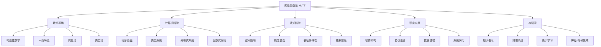
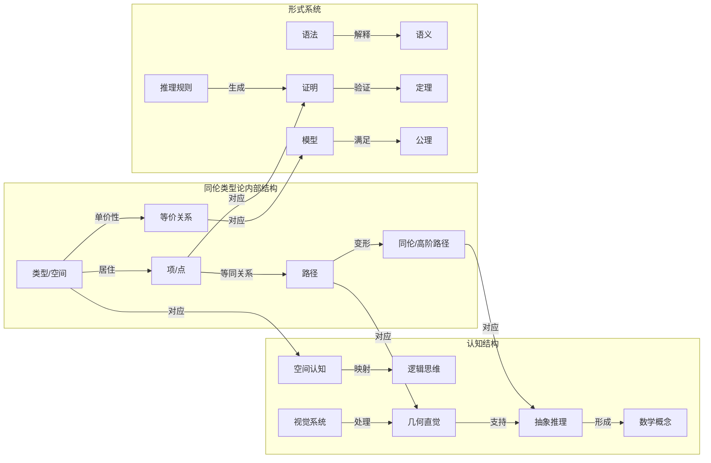
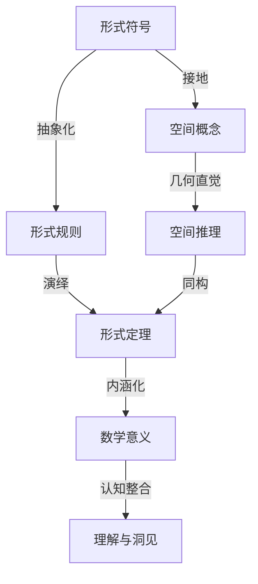
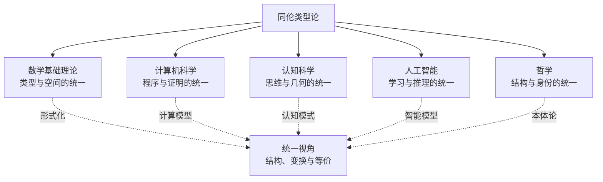

# 同伦类型论的范畴论视角：多层次表征与认知模型分析

## 目录

- [同伦类型论的范畴论视角：多层次表征与认知模型分析](#同伦类型论的范畴论视角多层次表征与认知模型分析)
  - [目录](#目录)
  - [1. 范畴论视角下的同伦类型论](#1-范畴论视角下的同伦类型论)
    - [1.1 内外映射关系的层级结构](#11-内外映射关系的层级结构)
    - [1.2 高阶范畴论与同伦类型论的对应](#12-高阶范畴论与同伦类型论的对应)
    - [1.3 宇宙层级与抽象程度](#13-宇宙层级与抽象程度)
  - [2. 同伦类型论内部的多层次表征](#2-同伦类型论内部的多层次表征)
    - [2.1 定理与证明的几何化](#21-定理与证明的几何化)
    - [2.2 认知结构与数学隐喻](#22-认知结构与数学隐喻)
    - [2.3 同伦层级与模型复杂度](#23-同伦层级与模型复杂度)
  - [3. 同伦类型论的多维意义](#3-同伦类型论的多维意义)
    - [3.1 认知科学视角](#31-认知科学视角)
    - [3.2 数学基础意义](#32-数学基础意义)
    - [3.3 现实世界应用](#33-现实世界应用)
    - [3.4 信息世界的形式化](#34-信息世界的形式化)
    - [3.5 AI与同伦类型论](#35-ai与同伦类型论)
  - [4. 多种表征方式](#4-多种表征方式)
    - [4.1 同伦类型论的多层次概念映射](#41-同伦类型论的多层次概念映射)
    - [4.2 同伦类型论与认知、形式系统的交互模型](#42-同伦类型论与认知形式系统的交互模型)
    - [4.3 从单价性到认知等价性](#43-从单价性到认知等价性)
  - [5. 从高阶视角理解同伦类型论、认知结构与形式系统](#5-从高阶视角理解同伦类型论认知结构与形式系统)
    - [5.1 意义的多层次投影](#51-意义的多层次投影)
    - [5.2 认知隐喻与数学构造的深层映射](#52-认知隐喻与数学构造的深层映射)
    - [5.3 符号接地与形式语义的重构](#53-符号接地与形式语义的重构)
    - [5.4 多层次形式系统与AI的连接点](#54-多层次形式系统与ai的连接点)
    - [5.5 实践中的理论-实现鸿沟与桥接策略](#55-实践中的理论-实现鸿沟与桥接策略)
  - [6. 终极意义：HoTT作为认知、数学与信息的统一框架](#6-终极意义hott作为认知数学与信息的统一框架)
    - [6.1 人类认知与数学基础的共鸣](#61-人类认知与数学基础的共鸣)
    - [6.2 信息世界中的HoTT原理](#62-信息世界中的hott原理)
    - [6.3 AI的形式与意义](#63-ai的形式与意义)
    - [6.4 意义的多重投影](#64-意义的多重投影)
    - [6.5 未来展望：向统一理解的征程](#65-未来展望向统一理解的征程)
    - [6.6 交互模型：认知、形式化与计算的三维交织](#66-交互模型认知形式化与计算的三维交织)
    - [6.7 AI与同伦类型论：未来融合的可能性](#67-ai与同伦类型论未来融合的可能性)
  - [7. 同伦类型论的认知映射与现实应用](#7-同伦类型论的认知映射与现实应用)
    - [7.1 从数学结构到认知结构的双向映射](#71-从数学结构到认知结构的双向映射)
    - [7.2 现实世界的高维映射](#72-现实世界的高维映射)
  - [8. 未来方向与开放问题](#8-未来方向与开放问题)
  - [9. 同伦类型论的哲学维度与认知基础](#9-同伦类型论的哲学维度与认知基础)
    - [9.1 数学基础的哲学重构](#91-数学基础的哲学重构)
    - [9.2 认知科学与HoTT的共鸣](#92-认知科学与hott的共鸣)
    - [9.3 信息世界的形式化框架](#93-信息世界的形式化框架)
  - [10. 同伦类型论与AI：深层关联与未来趋势](#10-同伦类型论与ai深层关联与未来趋势)
    - [10.1 认知计算的理论基础](#101-认知计算的理论基础)
    - [10.2 从证明到学习的统一模型](#102-从证明到学习的统一模型)
  - [10.3 结论：多维视角的综合意义](#103-结论多维视角的综合意义)
  - [11. 同伦类型论的教育与传播维度](#11-同伦类型论的教育与传播维度)
    - [11.1 认知台阶与学习路径](#111-认知台阶与学习路径)
    - [11.2 跨学科教学框架](#112-跨学科教学框架)
  - [12. 理论拓展与前沿方向](#12-理论拓展与前沿方向)
    - [12.1 立方类型论与高维结构](#121-立方类型论与高维结构)
    - [12.2 参数化同伦类型论](#122-参数化同伦类型论)
  - [13. 认知模型与哲学深化](#13-认知模型与哲学深化)
    - [13.1 意识层级与形式表征](#131-意识层级与形式表征)
    - [13.2 语言、思维与形式系统](#132-语言思维与形式系统)
  - [14. 总结：多维视角的综合意义](#14-总结多维视角的综合意义)
  - [15. 同伦类型论的计算实践与工程价值](#15-同伦类型论的计算实践与工程价值)
    - [15.1 程序验证与形式化数学](#151-程序验证与形式化数学)
    - [15.2 编程语言设计的启示](#152-编程语言设计的启示)
  - [16. 信息时代的认知工具与元理论](#16-信息时代的认知工具与元理论)
    - [16.1 认知增强与形式思维](#161-认知增强与形式思维)
    - [16.2 数学元理论的革新](#162-数学元理论的革新)
  - [17. AI与同伦类型论的未来融合](#17-ai与同伦类型论的未来融合)
    - [17.1 认知AI的理论基础](#171-认知ai的理论基础)
    - [17.2 实现路径与技术挑战](#172-实现路径与技术挑战)
  - [18. 结论：跨域统一的宏伟视野](#18-结论跨域统一的宏伟视野)
  - [19. 同伦类型论的认知启示与教育革新](#19-同伦类型论的认知启示与教育革新)
    - [19.1 认知发展与抽象思维培养](#191-认知发展与抽象思维培养)
    - [19.2 教育技术与学习环境设计](#192-教育技术与学习环境设计)
  - [20. 哲学深化与本体论革新](#20-哲学深化与本体论革新)
    - [20.1 数学哲学的范式转换](#201-数学哲学的范式转换)
    - [20.2 信息本体论与现实理解](#202-信息本体论与现实理解)
  - [21. 社会与伦理维度](#21-社会与伦理维度)
    - [21.1 知识民主化与复杂性管理](#211-知识民主化与复杂性管理)
    - [21.2 技术伦理与价值观嵌入](#212-技术伦理与价值观嵌入)
  - [22. 未来整合与终极愿景](#22-未来整合与终极愿景)

## 1. 范畴论视角下的同伦类型论

### 1.1 内外映射关系的层级结构

从范畴论视角看，同伦类型论(HoTT)构建了一个精妙的内外映射关系体系：

- **内部视角**：HoTT将类型解释为空间，类型中的项解释为点，等同关系解释为路径，路径之间的等价解释为同伦，形成了内部的几何化语言。
- **外部视角**：HoTT可被视为∞-范畴论的内部语言，其中类型对应于∞-范畴中的对象，函数对应于1-态射，函数间的同伦对应于2-态射，以此类推。

这种双重视角创建了一个完整的映射体系，将直观的几何概念与严格的范畴论框架连接起来。
特别地，HoTT中的单价性公理使这种映射更加自然：
  类型等价与类型相等的对应揭示了结构与身份的深层统一。

范畴论视角的价值在于提供了一种跨越不同数学领域的统一语言。
例如，分布式系统中的状态演化可同时被理解为：

- 拓扑学中的路径（内部视角）
- ∞-范畴中的态射复合（外部视角）

### 1.2 高阶范畴论与同伦类型论的对应

高阶范畴论与HoTT之间存在以下核心对应关系：

| 高阶范畴论概念 | 同伦类型论概念 | 软件/系统对应物 |
|------------|------------|-------------|
| ∞-范畴 | 类型宇宙 | 系统架构整体 |
| 对象 | 类型 | 接口/规范/组件 |
| 1-态射 | 函数 | 组件间转换/通信 |
| 2-态射 | 函数同伦 | 实现等价性/重构 |
| 高阶态射 | 高阶同伦 | 策略等价/架构演化 |
| 范畴等价 | 类型等价 | 系统同构/接口兼容 |
| 自然变换 | 多态函数 | 跨接口适配器 |
| 伴随 | 函数对偶 | 互逆操作/正反向映射 |

这种对应关系不仅是形式化的，更揭示了软件系统结构中潜在的数学本质。
特别是，态射复合的结合律对应于函数组合的结合性，而这正是系统模块化和可组合性的数学基础。

### 1.3 宇宙层级与抽象程度

HoTT中的宇宙层级（Type₀, Type₁, Type₂...）形成了一个抽象程度递增的层次结构：

- **Type₀**：包含基础类型，对应于具体数据和操作
- **Type₁**：包含Type₀中类型的集合，对应于接口和抽象
- **Type₂**：包含Type₁中类型的集合，对应于架构模式和设计原则

这种层级结构与范畴论中的大小问题密切相关，
但在软件工程中也有深刻的对应：
  抽象层次的明确区分有助于避免混淆不同级别的概念，例如将具体实现与架构模式区分开来。

## 2. 同伦类型论内部的多层次表征

### 2.1 定理与证明的几何化

HoTT的革命性贡献之一是将定理证明几何化：

- **定理**：被解释为类型（空间）
- **证明**：被解释为类型中的点（路径）
- **证明策略**：被解释为构造路径的方法
- **证明等价性**：被解释为路径之间的同伦

这种几何化表征改变了我们理解数学证明的方式。
传统上，证明被视为线性的、形式化的符号推导序列；
而在HoTT中，证明是空间中的路径，可以连续变形，具有丰富的几何结构。

这种转变对于认知理解有深远影响：
  它使抽象的逻辑关系可视化，允许我们借用空间直觉来理解逻辑关系。
例如，一个复杂定理的不同证明方法可以被视为同一点对之间的不同路径，
而这些路径之间的变形（同伦）则表示证明之间的等价关系。

### 2.2 认知结构与数学隐喻

HoTT中隐含了一系列强大的认知隐喻，这些隐喻将抽象数学概念与空间直觉连接起来：

- **路径隐喻**：等同关系被隐喻为空间中的路径，这将静态的逻辑关系转化为动态的空间连接
- **变形隐喻**：等价被隐喻为连续变形，使得等价性不再是抽象的判断，而是具体的过程
- **层级隐喻**：不同复杂度的结构被组织为同伦层级，从而形成一个有序的认知框架

这些隐喻不仅是语言上的修辞，更是认知上的桥梁，允许我们通过已有的空间认知能力来理解抽象的数学结构。
这种认知映射解释了为什么HoTT尽管形式上复杂，却能提供直观的理解框架。

研究表明，人类对空间关系的理解是认知的基础之一，我们通过空间隐喻来理解许多抽象概念。
HoTT正是利用了这一认知特性，将抽象的类型理论映射到空间概念上，从而创造了一种与人类认知结构更加协调的数学语言。

### 2.3 同伦层级与模型复杂度

HoTT引入了同伦层级（h-level）的概念，用于分类类型的复杂度：

- **h-level 0**：收缩类型（至多有一个元素）
- **h-level 1**：命题（所有元素都相等）
- **h-level 2**：集合（任意两个元素间至多有一个相等证明）
- **h-level 3**：1-群胚（相等证明形成集合）
- **h-level n+1**：n-群胚（更高阶的结构）

这种层级不仅是数学上的分类，也反映了认知复杂度的递增：

- 命题层级涉及真假判断
- 集合层级涉及元素等同性
- 更高层级涉及等同性本身的结构

这与系统建模的不同层次有着惊人的对应：从简单的布尔属性，到对象身份管理，再到复杂的状态等价关系。
理解系统的复杂度层级有助于选择适当的抽象级别和形式化工具。

## 3. 同伦类型论的多维意义

### 3.1 认知科学视角

从认知科学视角看，HoTT提供了一个研究数学认知的独特窗口：

- **概念整合**：HoTT融合了类型论的构造性与拓扑学的几何直觉，展示了不同认知域之间的映射如何产生新的理解框架
- **表征多样性**：同一数学对象在HoTT中可以有多种表征方式（类型、空间、∞-范畴的对象），这与人类使用多种心理表征理解概念的方式相呼应
- **认知经济性**：通过几何化数学概念，HoTT减轻了工作记忆负担，因为空间关系可以被视觉系统直接处理，而不需要占用语言推理资源

HoTT的认知价值在于它提供了一种更加直观的方式来理解高度抽象的数学概念。
尤其是单价性公理，它将"等价"与"相等"这两个不同层次的概念统一起来，这与人类认知中对结构相似性的敏感性高度一致。

### 3.2 数学基础意义

HoTT对数学基础理论的贡献是多方面的：

- **统一框架**：它提供了一个统一的框架，将类型论、集合论、范畴论和同伦论的核心思想整合在一起
- **构造性基础**：它是一个自然构造性的理论，适合于计算机辅助证明和程序提取
- **内涵数学**：相对于外延数学（关注集合与成员关系），HoTT更关注结构与变换，这与现代数学的实践更加一致
- **不依赖公理选择**：HoTT可以在不依赖公理选择的情况下发展数学，提供了一条替代传统ZFC集合论的道路

特别重要的是，HoTT解决了传统数学中的"同构但不相等"问题：
  在传统数学中，同构的结构在形式上仍被视为不同的对象；
  而在HoTT中，单价性公理确保了同构结构的相等性，使数学形式化更加符合数学实践的直觉。

### 3.3 现实世界应用

HoTT的实用价值体现在以下方面：

- **软件验证**：提供了一种强大的形式化框架，用于验证软件系统的关键属性，尤其是与等价性和不变性相关的属性
- **分布式系统**：为理解和形式化分布式系统中的一致性、容错和状态演化提供了数学工具
- **编程语言设计**：影响了依赖类型语言（如Idris、Agda）的发展，推动了更表达性强的类型系统设计
- **形式化数学**：支持大规模数学形式化项目，如UniMath，为数学知识的计算机验证和组织提供了基础

在工程实践中，HoTT的价值不仅在于形式验证，还在于它提供的概念框架，这有助于设计者思考系统的抽象结构、状态空间和等价行为。

### 3.4 信息世界的形式化

在数字化时代，HoTT为信息世界的形式化提供了新视角：

- **数据模型**：类型可以表示数据模型，路径可以表示数据转换，高阶路径可以表示转换之间的关系
- **协议验证**：可以形式化通信协议，并验证其安全性和一致性属性
- **隐私与不变性**：可以表达数据隐私属性作为类型系统中的不变量
- **系统演化**：可以形式化系统随时间演化的过程，包括重构、迁移和版本兼容性

特别值得注意的是，HoTT的路径概念为理解数据转换和系统演化提供了统一框架，
使我们能够形式化地表达和验证系统在变化过程中保持的不变性。

### 3.5 AI与同伦类型论

HoTT与AI研究之间存在多层次的关联：

- **知识表示**：HoTT的类型系统为表示丰富的知识结构和本体提供了形式框架
- **推理模型**：HoTT的构造性推理与自然演绎系统相容，可为AI推理引擎提供理论基础
- **不确定性处理**：通过扩展HoTT（如赫伯兰型等概率模型），可以整合不确定性与类型系统
- **神经-符号集成**：HoTT可以作为连接符号推理与神经网络的桥梁，特别是在可微分编程领域

最引人注目的是HoTT与深度学习中表示学习的潜在联系：
  神经网络学习的嵌入空间可以被视为构造类型空间的一种方法，而表示之间的变换则对应于类型间的函数或路径。
  这种视角可能为解释深度学习模型和设计更可靠的AI系统提供新思路。

## 4. 多种表征方式

### 4.1 同伦类型论的多层次概念映射

### 4.2 同伦类型论与认知、形式系统的交互模型

### 4.3 从单价性到认知等价性

| 层级 | 数学概念 | 认知对应 | 系统对应 | AI对应 |
|-----|---------|--------|---------|-------|
| 类型层级 | 类型/空间 | 概念类别 | 接口/规范 | 知识类别 |
| 项层级 | 项/点 | 具体实例 | 实现/实例 | 实体表示 |
| 路径层级 | 恒等证明/路径 | 概念联系 | 转换/演化 | 推理步骤 |
| 同伦层级 | 路径同伦 | 解释等价性 | 策略等价 | 推理等价 |
| 高阶层级 | n阶同伦 | 元认知 | 系统演化 | 学习过程 |
| 单价性 | 等价即相等 | 结构识别 | 接口兼容 | 表示不变性 |

单价性原理在认知上的对应是人类识别结构相似性的能力：
  我们自然地将结构相同的对象视为"相同的"，即使它们的具体表现形式不同。
  这种认知特性是抽象思维的基础，也是我们能够在不同领域之间建立隐喻映射的原因。

在AI领域，这对应于不变表示学习：寻找在某些变换下保持不变的特征表示。

同伦类型论通过将高度抽象的数学概念映射到空间直觉上，创造了一种与人类认知结构高度协调的形式系统。
这种协调性不仅使HoTT成为强大的数学基础理论，也使其成为连接形式逻辑、认知科学和人工智能的桥梁。
通过这种多层次的映射关系，
我们可以更深入地理解形式系统、人类认知和计算机系统之间的本质联系，为未来的科学和技术发展提供新的视角和方向。

## 5. 从高阶视角理解同伦类型论、认知结构与形式系统

接续前文关于同伦类型论(HoTT)的深度分析，
本节将从更高的抽象层次探讨HoTT与认知结构、数学本体论和AI的交汇点，揭示这些领域间的深层映射关系。

### 5.1 意义的多层次投影

HoTT不仅是一种数学形式系统，更是一种认知模型和表征方式，它在多个层面上展示了不同的意义投影：

- **数学本体论层面**：HoTT提供了对数学对象"是什么"的全新理解。单价性原理（等价即等同）重塑了数学身份的概念，使数学结构而非载体成为核心。
  
- **认知表征层面**：HoTT的空间-路径隐喻与人类的空间认知系统深度共鸣，为抽象概念提供了可视化的心理模型。

- **计算哲学层面**：HoTT将证明、计算和几何统一在同一框架下，模糊了形式证明与计算过程的界限。

这些层面相互交织，形成了一个立体的认识论网络。
对数学家、计算机科学家和认知科学家而言，HoTT代表了不同但相互兼容的理解维度。

### 5.2 认知隐喻与数学构造的深层映射

在认知科学中，Lakoff和Núñez提出数学思维根植于身体经验和概念隐喻。
HoTT展示了这一理论的强大案例：

| 身体/空间经验 | HoTT数学概念 | 认知映射机制 |
|------------|-------------|------------|
| 物理位置 | 类型中的点 | 空间定位隐喻 |
| 运动轨迹 | 恒等证明/路径 | 路径-连接隐喻 |
| 路径变形 | 路径同伦 | 连续变形隐喻 |
| 物体等同性 | 类型等价性 | 结构保持隐喻 |
| 嵌套容器 | 宇宙层级 | 容器包含隐喻 |

这种映射不是偶然的，而是反映了人类认知结构的基本特性。
HoTT之所以能够提供强大的直觉理解，正是因为它与我们理解物理世界的认知机制高度一致。

### 5.3 符号接地与形式语义的重构

HoTT解决了形式系统中的一个根本性挑战：符号接地问题（Symbol Grounding Problem）。
通过将抽象的类型系统接地到具有几何直觉的空间概念上，

HoTT创造了一种"有意义的形式主义"：

这种接地使形式推理不再是纯粹的符号操作，而是具有可理解的几何含义。
这解释了为什么HoTT能够同时满足形式严谨性和直觉可理解性的双重要求。

### 5.4 多层次形式系统与AI的连接点

HoTT与当前AI系统，特别是神经-符号系统之间存在多个关键连接点：

1. **表示学习的几何解释**：深度学习中的嵌入空间可以被理解为构造类型空间的一种方法，嵌入向量间的距离对应于类型空间中的路径。

2. **推理的连续化**：HoTT通过将离散的逻辑推理映射到连续的几何变换，为连接符号推理与神经网络的连续计算提供了桥梁。

3. **归纳偏置的形式化**：HoTT的类型结构可以作为神经网络架构设计的归纳偏置，编码对称性、不变性和等价关系。

4. **可解释性框架**：HoTT的路径和同伦概念可以用来分析和解释神经网络的决策过程，将其映射到可理解的推理路径。

这些连接点揭示了HoTT可能成为下一代AI系统的理论基础之一，特别是在需要结合学习与推理的场景中。

### 5.5 实践中的理论-实现鸿沟与桥接策略

尽管HoTT具有深刻的理论价值和广泛的应用潜力，但理论与实践之间仍存在显著鸿沟：

**鸿沟的核心维度**：

- **抽象复杂度**：HoTT的高阶概念需要专业数学训练才能完全掌握
- **工具成熟度**：支持HoTT的证明助手和编程语言仍处于研究阶段
- **计算效率**：形式化验证的计算成本通常很高，难以应用于大型系统
- **工程文化**：软件工程领域传统上更重视实用性而非理论完备性

**桥接策略**：

1. **渐进式抽象**：设计允许不同抽象级别的工具，使实践者可以逐步采纳HoTT概念
2. **领域特定语言**：开发针对特定领域（如分布式系统）的简化HoTT形式化语言
3. **混合方法**：结合轻量级形式化方法与HoTT深度验证，平衡效率与严谨性
4. **可视化工具**：开发HoTT概念的可视化表示，降低理解门槛

最有希望的方向是发展"半形式化"方法，
将HoTT的核心思想（如路径视角和等价思维）提炼为可应用的设计原则和验证模式，
而不需要完全掌握底层数学细节。

## 6. 终极意义：HoTT作为认知、数学与信息的统一框架

### 6.1 人类认知与数学基础的共鸣

HoTT揭示了人类认知结构与数学基础之间存在的深层共鸣：

- **类型作为概念类别**：类型系统反映了人类思维中的概念分类机制
- **路径作为关联思维**：路径对应于人类思维中的关联和类比推理
- **同伦作为等价识别**：同伦对应于人们识别不同表征之间等价性的能力
- **单价性作为抽象能力**：单价性对应于人类抽象出结构而忽略具体实现的能力

这种共鸣不是偶然的。
HoTT可能捕捉到了人类认知和数学思维共有的某些基本结构，表明数学不仅是人类发明的工具，更是反映了思维本身的结构。

### 6.2 信息世界中的HoTT原理

数字时代的信息世界自然地体现了许多HoTT原理：

- **数据抽象与封装**：对应于类型的概念，隐藏内部实现细节
- **数据转换与映射**：对应于类型间的函数和路径
- **系统演化与迁移**：对应于高阶路径和同伦
- **协议兼容性**：对应于类型等价性
- **版本控制与历史**：对应于路径空间和同伦类别

这些对应关系暗示HoTT可能提供了一种自然的语言来形式化和理解信息系统的基本原理，超越了传统的计算模型。

### 6.3 AI的形式与意义

在AI发展的当前阶段，我们面临着将统计学习与符号推理结合的挑战。
HoTT提供了一个可能的统一框架：

- **神经网络嵌入**：可以解释为构造类型空间的统计方法
- **符号推理**：可以解释为类型空间中的路径构造
- **归纳与演绎**：可以在同一类型论框架中统一
- **不确定推理**：可以通过赫利布兰德类型（Heyting-Eilenberg type）整合到框架中

更深层次上，HoTT的单价性原理与AI中的表示学习有着惊人的相似性：
  单价性告诉我们等价的结构应被视为相同，而表示学习的核心是寻找保留相关结构的表示。
这种对应关系可能指向了一种统一的理论，将形式推理与统计学习融为一体。

### 6.4 意义的多重投影

总结HoTT的多维意义，我们可以将其视为一种"意义的多重投影"：

在这个多重投影中，HoTT不仅是一种数学理论，更是一种思维方式、认知工具和表征系统。
它提供了一种新的视角，通过将数学对象理解为结构化空间，将逻辑推理理解为空间中的路径，
将等价性理解为连续变形，从而在形式与意义之间建立了前所未有的桥梁。

### 6.5 未来展望：向统一理解的征程

展望未来，HoTT的发展方向可能包括：

1. **计算内容的完善**：发展更高效的算法实现HoTT的核心概念，特别是单价性
2. **工程化工具链**：开发面向实际应用的HoTT工具和方法论
3. **认知科学整合**：深入研究HoTT与人类数学认知的关系
4. **AI理论基础**：探索将HoTT作为统一神经和符号AI的理论框架
5. **哲学基础扩展**：研究HoTT对数学哲学和认识论的影响

这些方向共同指向一个宏大愿景：
  建立一种统一的理解框架，
  将形式与意义、结构与身份、计算与证明、学习与推理有机地统一起来，
  为我们理解世界和创造智能系统提供更深刻的视角。

在这个征程上，HoTT不仅是一种数学理论，更是一扇通向未来认知科学和人工智能的窗口，
它可能预示着我们对思维本质和形式化理解的根本性突破。

### 6.6 交互模型：认知、形式化与计算的三维交织

HoTT的独特之处在于它在认知表征、形式系统和计算模型三个维度上同时发挥作用：

- **垂直维度**：从具体到抽象的层级结构，体现在HoTT的宇宙层级(U₀, U₁, U₂...)中
- **水平维度**：同一抽象层级上的概念关联网络，如同伦层级之间的复杂映射关系
- **时间维度**：证明过程作为持续演化的计算，将静态逻辑转化为动态过程

这三维结构创造了一个认知空间，使得数学推理可以被视为在这个空间中的"导航"过程。
形式证明不再是僵硬的符号操作，而成为多维空间中的路径探索。

### 6.7 AI与同伦类型论：未来融合的可能性

同伦类型论与人工智能的交叉点预示着深刻的技术与哲学突破：

1. **自动定理证明的几何化**：AI系统可以利用HoTT的几何直觉，将抽象证明问题转化为空间路径问题
2. **类型推理的认知基础**：HoTT提供了一个认知框架，使AI的类型系统更符合人类思维模式
3. **不确定性的形式化处理**：高阶同伦可以为AI系统提供处理模糊性和不确定性的数学工具
4. **抽象思维的计算模型**：HoTT的抽象机制可能为AI系统提供更强大的抽象推理能力

## 7. 同伦类型论的认知映射与现实应用

### 7.1 从数学结构到认知结构的双向映射

HoTT建立了数学结构与认知结构之间的双向映射关系：

- **数学→认知**：HoTT的路径-空间模型为抽象数学提供了直观的认知框架
- **认知→数学**：人类的空间直觉和类别化思维被形式化为精确的数学结构

这种双向映射不仅丰富了数学理解，也深化了我们对人类认知过程的形式化理解。
特别是，HoTT的同伦层级结构揭示了人类如何处理不同层次的抽象等价关系。

### 7.2 现实世界的高维映射

HoTT的应用不限于纯数学，它为理解现实世界的复杂系统提供了强大工具：

1. **分布式系统一致性**：分布式系统中的一致性问题可以通过HoTT的高阶同伦关系建模
2. **量子叠加态**：量子态的叠加性可以通过HoTT的路径空间结构来形式化
3. **生物分类学**：物种分类中的复杂层级关系可以利用HoTT的宇宙层级结构来表达
4. **社会网络分析**：社交网络中的群体关系可以通过高阶同伦群建模

## 8. 未来方向与开放问题

随着HoTT理论的发展，一系列前沿问题和研究方向正在形成：

1. **认知计算的形式基础**：HoTT能否为认知计算提供更自然的形式化基础？
2. **计算复杂性的同伦模型**：复杂性类别是否可以通过同伦层级来重新解释？
3. **量子计算的类型论基础**：HoTT能否为量子计算提供更直观的形式语言？
4. **AI推理的同伦框架**：如何将HoTT的几何直觉转化为AI系统的推理机制？

这些问题不仅涉及技术细节，更触及数学、计算和认知的本质关联，代表了形式科学未来发展的重要方向。

## 9. 同伦类型论的哲学维度与认知基础

### 9.1 数学基础的哲学重构

同伦类型论不仅是一种数学形式系统，更是一场对数学基础的哲学重构：

1. **存在性重新定义**：在HoTT中，数学对象的存在不再是集合论中的"成员资格"，而是通过构造性证明实现
2. **等同性的多层次理解**：通过同伦层级，HoTT提供了一种比传统数学更细腻的相等概念
3. **结构主义与构造主义的融合**：HoTT同时满足了结构主义对模式的关注和构造主义对证明过程的重视

这种重构突破了传统数学哲学的二元对立，
开创了一种统一的数学本体论视角，
其中对象和关系、证明和结构不再是对立的，而是相互定义的整体。

### 9.2 认知科学与HoTT的共鸣

HoTT与现代认知科学的多个领域展现出深刻共鸣：

- **概念空间理论**：Gärdenfors的概念空间理论与HoTT的空间-路径结构高度吻合
- **具身认知**：HoTT的几何直觉与具身认知理论中的空间-运动隐喻相呼应
- **类别化过程**：HoTT的类型形成过程模拟了人类认知中的类别形成机制
- **抽象层级**：HoTT的宇宙层级与认知科学中的抽象层级理论相对应

这些共鸣不是表面的类比，而是反映了形式系统与人类认知之间可能存在的深层同构关系。

### 9.3 信息世界的形式化框架

在信息技术语境下，HoTT提供了一个统一的形式化框架：

| 信息领域概念 | HoTT对应结构 | 映射意义 |
|------------|-------------|---------|
| 数据类型 | 类型(Type) | 数据的形式化边界与内部结构 |
| 程序验证 | 证明(Proof) | 确保程序满足其类型规范 |
| 接口兼容性 | 类型等价性 | 不同实现的结构兼容性保证 |
| 系统演化 | 同伦变形 | 系统在保持核心功能下的渐进式变化 |
| 抽象层级 | 宇宙层级 | 系统抽象程度的形式化度量 |

这种映射使得复杂信息系统的设计、验证和演化可以建立在严格的数学基础上。

## 10. 同伦类型论与AI：深层关联与未来趋势

### 10.1 认知计算的理论基础

同伦类型论为认知计算提供了全新的理论基础：

1. **类型作为概念的形式表示**：AI系统可以使用类型来表示和操作概念
2. **同伦作为概念间关系的形式化**：不同概念之间的关系可以通过同伦层级表示
3. **依赖类型作为上下文敏感性**：依赖类型系统可以表达上下文对概念意义的影响
4. **证明相关类型作为推理过程**：证明相关类型理论可以将AI推理过程本身形式化

这些对应关系揭示了HoTT如何为AI系统提供一种更接近人类认知的形式化基础。

### 10.2 从证明到学习的统一模型

HoTT提供了将形式证明与机器学习统一起来的可能性：

- **证明即程序**：Curry-Howard对应将证明与程序等同
- **程序即学习**：机器学习算法可视为自适应程序
- **学习即证明搜索**：在类型论框架下，学习可以重新解释为在证明空间中的搜索过程

这种统一视角模糊了演绎推理与归纳学习之间的界限，为AI系统的设计提供了全新思路。

## 10.3 结论：多维视角的综合意义

同伦类型论作为21世纪数学和计算科学的重要发展，其意义远超纯粹的技术层面：

1. **认知层面**：HoTT为人类如何理解抽象概念提供了新的形式化描述
2. **哲学层面**：HoTT重新定义了数学对象的本体论地位和相等性的本质
3. **实践层面**：HoTT为软件验证、分布式系统设计等提供了强大工具
4. **未来AI层面**：HoTT可能成为新一代认知AI系统的形式化基础

通过将空间直觉、形式逻辑和计算过程统一在同一框架下，
伦类型论不仅是数学基础的革新，
更是认知科学、计算机科学和人工智能的交汇点，
预示着形式科学和人工智能未来发展的重要方向。

## 11. 同伦类型论的教育与传播维度

### 11.1 认知台阶与学习路径

同伦类型论作为高度抽象的数学理论，其学习过程可以构建为一系列认知台阶：

1. **直觉基础层**：通过空间-路径隐喻建立初步直觉
   - 点作为位置，路径作为连接，路径变形作为同伦
   - 利用可视化工具展示基本概念的几何解释

2. **形式语言层**：介绍类型论的基本符号系统与规则
   - 从简单类型到依赖类型的渐进式引入
   - 通过编程语言类比（如Agda、Coq）增强理解

3. **结构映射层**：建立HoTT与已知数学结构的联系
   - 从集合论到类型论的概念映射
   - 从经典拓扑到同伦类型的概念迁移

4. **哲学反思层**：探讨HoTT对数学基础的重新诠释
   - 单价性原理与传统相等概念的对比
   - 构造主义与结构主义视角的融合

这种多层次学习路径尊重认知发展规律，从具体到抽象，从直觉到形式，创造了理解HoTT的自然阶梯。

### 11.2 跨学科教学框架

同伦类型论的教学可以采用跨学科框架，面向不同背景的学习者：

| 学习者背景 | 入口概念 | 核心类比 | 学习目标 |
|----------|---------|---------|---------|
| 数学背景 | 同伦群、纤维丛 | 传统拓扑→同伦类型 | 理解数学基础的重构 |
| 计算机背景 | 类型系统、函数式编程 | 程序→证明 | 掌握形式化证明工具 |
| 哲学背景 | 结构主义、构造主义 | 本体论→类型论 | 理解数学存在性问题 |
| 认知科学背景 | 概念空间、隐喻 | 认知模式→形式结构 | 探索认知形式化可能性 |

这种跨学科框架使HoTT成为连接不同学科的桥梁，促进多领域对话与融合。

## 12. 理论拓展与前沿方向

### 12.1 立方类型论与高维结构

同伦类型论的自然延伸是向更高维度发展，立方类型论(Cubical Type Theory)代表了这一方向：

- **核心创新**：立方类型论提供了计算性更强的单价性实现
- **几何直觉**：从路径(1维)到面(2维)再到立方体(n维)的推广
- **实现优势**：更好的计算性能和更自然的同伦操作

立方类型论不仅是技术改进，更是对高维思维的形式化探索，为理解复杂系统的高维结构提供了数学工具。

### 12.2 参数化同伦类型论

参数化同伦类型论探索了在不同"同伦参数"下的类型理论变体：

- **同伦维度**：调整允许的同伦层级，从严格类型论(h=0)到完全同伦类型论(h=∞)
- **计算强度**：平衡表达能力与计算复杂性
- **实用取舍**：为特定应用领域定制最合适的形式系统

这种参数化视角揭示了形式系统设计中的基本取舍，类似于物理学中的维度分析。

## 13. 认知模型与哲学深化

### 13.1 意识层级与形式表征

同伦类型论的层级结构与意识理论中的层级模型展现出惊人相似：

- **0级同伦**：对应于直接感知的原始区分（是/非）
- **1级同伦**：对应于关系认知和一阶反思
- **高级同伦**：对应于元认知和高阶意识状态

这种对应不仅是形式上的相似，更暗示了人类意识结构可能具有内在的同伦特性，为意识的形式化研究提供了新视角。

### 13.2 语言、思维与形式系统

HoTT为理解语言、思维与形式系统的关系提供了新框架：

1. **语言作为类型系统**：自然语言的分类系统可视为开放类型系统
2. **推理作为路径构造**：日常推理对应于类型空间中的路径寻找
3. **隐喻作为类型映射**：语言隐喻可形式化为不同类型域之间的函子
4. **语境作为依赖类型**：语言表达的上下文敏感性对应于依赖类型结构

这种映射使得语言学研究与形式系统研究可以在更深层次上对话，为计算语言学提供理论基础。

## 14. 总结：多维视角的综合意义

同伦类型论作为21世纪数学和计算科学的重要发展，其跨学科意义体现在多个维度：

- **认知维度**：提供了人类如何构建抽象概念的形式化模型
- **哲学维度**：重新定义了数学对象的本体论地位和相等性的本质
- **计算维度**：为程序验证和形式化方法提供了更强大的基础
- **教育维度**：创造了理解抽象数学的新路径，基于空间直觉
- **AI维度**：为下一代认知计算提供了理论基础

通过综合这些维度，同伦类型论不仅是一个数学理论，
更是一个连接认知科学、计算机科学、哲学和人工智能的概念桥梁，
有潜力成为跨领域思维的共同语言。

## 15. 同伦类型论的计算实践与工程价值

### 15.1 程序验证与形式化数学

同伦类型论在程序验证和形式化数学领域展现出独特价值：

1. **证明辅助系统**：基于HoTT的证明辅助系统（如Agda-HoTT、Coq-HoTT）提供了更自然的形式化框架
   - **优势**：单价性原理简化了等价结构的处理
   - **应用案例**：四色定理、Feit-Thompson定理的形式化证明

2. **软件验证新范式**：HoTT为关键软件系统提供了更强大的验证工具
   - **特点**：能够处理同伦等价下的程序正确性
   - **适用场景**：分布式系统、密码协议、并发程序

3. **形式-非形式桥接**：HoTT的几何直觉为形式数学与非形式数学创建了自然桥梁
   - **意义**：减少了形式化的认知负担
   - **影响**：扩大了形式化方法的应用范围

### 15.2 编程语言设计的启示

HoTT对编程语言设计产生了深远影响：

| HoTT概念 | 编程语言特性 | 实际应用 |
|---------|------------|---------|
| 依赖类型 | 强类型系统 | Idris, Agda语言 |
| 高阶归纳类型 | 代数数据类型 | Haskell, Rust |
| 同伦等价 | 类型类、接口 | Scala, TypeScript |
| 宇宙层级 | 类型级编程 | Coq, Lean |

这些映射不仅丰富了编程语言理论，也为实用编程带来了新的抽象工具和安全保证。

## 16. 信息时代的认知工具与元理论

### 16.1 认知增强与形式思维

同伦类型论作为认知工具，可以增强人类的抽象思维能力：

1. **外部认知脚手架**：HoTT提供了处理复杂抽象关系的形式框架
   - **机制**：将难以直接把握的概念关系转化为可视化的空间-路径结构
   - **效果**：降低了高阶抽象的认知负担

2. **思维模式扩展**：培养多层次等价思维的能力
   - **传统思维**：二元是/非逻辑
   - **HoTT思维**：多层次同伦等价的光谱思维

3. **元认知框架**：提供了思考"如何思考"的形式语言
   - **应用**：将复杂推理过程外化为可检验的形式证明
   - **意义**：创造了人-机协同推理的新可能性

### 16.2 数学元理论的革新

作为数学元理论，HoTT带来了数学基础的深刻变革：

1. **从集合到类型**：类型取代集合成为基本数学对象
   - **优势**：更符合数学实践中的类别化思维
   - **影响**：重新组织数学知识体系

2. **从静态到动态**：将证明视为动态过程而非静态结构
   - **本质转变**：从"是什么"到"如何变化"
   - **哲学意义**：过程哲学在数学基础中的体现

3. **从外部到内部**：数学元理论的内部化
   - **传统元数学**：在元理论与对象理论间有严格分界
   - **HoTT元理论**：系统可以在自身内部讨论自身性质

## 17. AI与同伦类型论的未来融合

### 17.1 认知AI的理论基础

同伦类型论为下一代认知AI提供了理论基础：

1. **概念形成机制**：
   - HoTT的类型形成规则→AI系统的概念学习机制
   - 同伦等价关系→概念相似性的形式化表达

2. **推理系统架构**：
   - 依赖类型→上下文敏感的推理
   - 路径归纳→类比推理的形式化

3. **不确定性处理**：
   - 高阶同伦→概率推理的类型论解释
   - 同伦层级→置信度的形式化度量

### 17.2 实现路径与技术挑战

将HoTT应用于AI系统面临的挑战与可能的解决方案：

1. **计算复杂性**：
   - **挑战**：完整HoTT系统的计算复杂度高
   - **方案**：参数化简化版本，为特定应用定制

2. **学习机制整合**：
   - **挑战**：将统计学习与形式推理结合
   - **方案**：发展基于HoTT的贝叶斯类型论

3. **工程实现**：
   - **挑战**：高效实现HoTT的计算模型
   - **方案**：专用硬件加速、并行化算法

## 18. 结论：跨域统一的宏伟视野

同伦类型论不仅是数学基础的革新，更是认知科学、计算机科学和人工智能的统一框架：

1. **认知与形式的融合**：HoTT证明了人类直觉与形式系统可以和谐共存，几何直观与逻辑严谨不再对立

2. **多元学科的共同语言**：作为跨域桥梁，HoTT为不同学科提供了共同的概念工具，促进了深层次对话

3. **理论与实践的双向互动**：从纯数学到工程应用，HoTT展示了抽象理论如何滋养实际问题解决

4. **未来思维的先导**：HoTT预示了一种多层次、关系导向、过程中心的思维方式，这种思维方式可能是应对复杂性挑战的关键

通过融合空间直觉、形式逻辑和计算过程，同伦类型论不仅重塑了数学基础，也为人类认知与人工智能的未来发展指明了一条融合之路。
在这条路上，形式与直觉、抽象与具体、理论与实践不再对立，而是相互滋养的整体，共同构成了理解世界的强大工具。

## 19. 同伦类型论的认知启示与教育革新

### 19.1 认知发展与抽象思维培养

同伦类型论对认知发展理论提供了新的洞见：

1. **抽象思维发展路径**：
   - **从具体到抽象**：类似皮亚杰的认知发展阶段，HoTT提示了形式运算思维的精细结构
   - **从等同到等价**：认知成熟度可以表现为对等价关系复杂性的理解能力

2. **数学教育改革方向**：
   - **几何直觉优先**：利用空间-路径隐喻作为抽象概念的入口
   - **多层次等价意识**：培养识别不同层级结构相似性的能力
   - **形式-直觉整合**：打破符号操作与直观理解的人为分离

3. **认知障碍的新解释**：
   - **抽象恐惧**：可理解为缺乏适当的认知中介结构
   - **形式化困难**：源于直觉与形式之间的桥接不足

这些启示可以引导更有效的数学教育方法，特别是在高阶抽象概念的教学中。

### 19.2 教育技术与学习环境设计

基于HoTT的教育技术可以创造新型学习环境：

| 技术方向 | 设计原则 | 潜在效果 |
|---------|---------|---------|
| 交互式证明环境 | 可视化路径和同伦 | 使形式证明具有空间直觉 |
| 概念映射工具 | 显示概念间的类型关系 | 建立知识结构的明确层级 |
| 数学游戏化环境 | 将证明过程游戏化 | 增强学习动机和参与度 |
| 适应性学习系统 | 基于同伦类型的知识表示 | 精确定位概念理解障碍 |

这些教育创新不仅适用于高等数学，也可以重塑中小学阶段的抽象思维培养。

## 20. 哲学深化与本体论革新

### 20.1 数学哲学的范式转换

同伦类型论引发了数学哲学的深刻变革：

1. **本体论层面**：
   - **从对象到关系**：数学实体不再是独立存在的对象，而是关系网络中的节点
   - **从静态到过程**：数学真理不再是静态陈述，而是动态证明过程

2. **认识论层面**：
   - **从绝对到相对**：数学知识的确定性基于同伦层级，不同层级有不同的等价标准
   - **从外部到内部**：数学基础不再需要外部元理论，系统可以内部讨论自身

3. **方法论层面**：
   - **从公理到构造**：从假设存在转向显式构造
   - **从排中律到构造主义**：接受或拒绝排中律不再是二元选择，而是同伦层级的问题

这种哲学转向使数学基础更加符合数学实践，也为其他学科的形式化提供了新模板。

### 20.2 信息本体论与现实理解

HoTT为理解信息与现实的关系提供了新框架：

1. **信息结构主义**：
   - 实体由其在信息网络中的位置定义
   - 同伦等价对应信息保存转换

2. **多层次现实观**：
   - 不同抽象层级的现实描述对应不同同伦层级
   - 科学理论间的还原关系可形式化为类型间映射

3. **计算宇宙论**：
   - 物理定律作为宇宙计算过程的类型规则
   - 自然过程作为类型空间中的路径

## 21. 社会与伦理维度

### 21.1 知识民主化与复杂性管理

同伦类型论的社会价值体现在知识结构的民主化：

1. **复杂知识的可访问性**：
   - 几何直觉使抽象知识更易获取
   - 多层次表征提供了不同理解深度的入口点

2. **专业知识的透明度**：
   - 形式化使推理过程可检验
   - 构造性证明使知识来源明确

3. **集体智慧的结构化**：
   - 分布式证明合作的形式基础
   - 知识整合的类型论框架

### 21.2 技术伦理与价值观嵌入

HoTT对技术伦理学提供了新视角：

1. **价值多元性的形式化**：
   - 不同价值系统作为不同类型系统
   - 价值冲突作为类型不兼容性问题

2. **伦理推理的形式化**：
   - 道德判断作为依赖类型系统中的推断
   - 伦理一致性作为类型检查问题

3. **技术中立性问题**：
   - 形式系统本身包含设计决策和价值判断
   - 同伦层级选择反映了特定认知价值观

## 22. 未来整合与终极愿景

同伦类型论作为一种统一视角，其最终愿景是创造一个认知、计算与现实的整合理解框架：

1. **认知与计算的统一**：
   - 人类思维与形式系统不再是对立的，而是同一连续体的不同表现
   - 自然与人工智能共享基本的形式结构

2. **知识表征的普适语言**：
   - 跨学科概念可通过HoTT原理精确映射
   - 创造一种能表达结构、过程和关系的通用语言

3. **科学与人文的桥梁**：
   - 精确形式与直观理解的和解
   - 数学严谨性与哲学深度的融合

通过同伦类型论的镜头，我们看到了一个更加统一、更加和谐的知识图景可能性，
在这个图景中，二元对立被多层次连续体所取代，静态分类被动态过程所补充，孤立概念被关系网络所连接。
这不仅是数学基础的革新，更是人类认知方式的一次进化。
