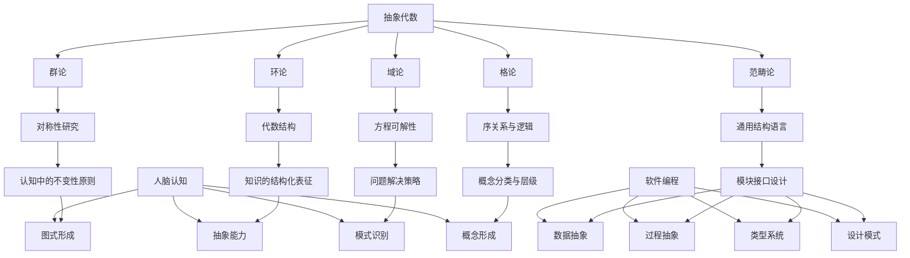
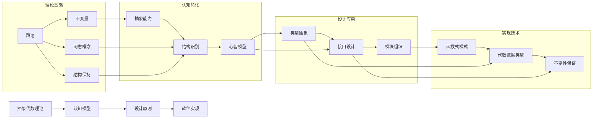
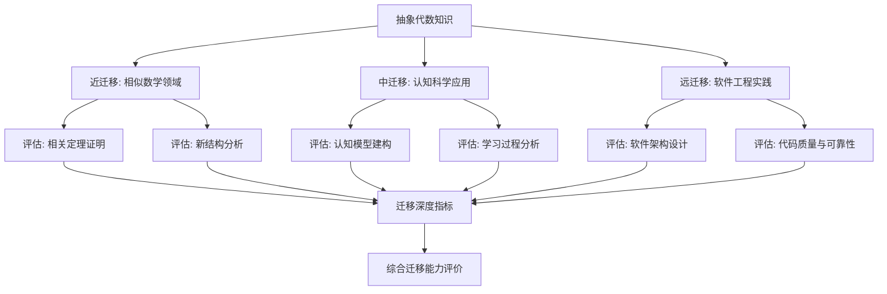

# 抽象代数与认知编程关联性研究评价

## 目录

- [抽象代数与认知编程关联性研究评价](#抽象代数与认知编程关联性研究评价)
  - [目录](#目录)
  - [1. 引言](#1-引言)
  - [2. 《抽象代数》文档评价](#2-抽象代数文档评价)
    - [2.1 文档优势](#21-文档优势)
    - [2.2 不足之处](#22-不足之处)
    - [2.3 改进建议](#23-改进建议)
  - [3. 《人脑认知、抽象代数与软件编程的关联性探索》评价](#3-人脑认知抽象代数与软件编程的关联性探索评价)
    - [3.1 文档优势](#31-文档优势)
    - [3.2 不足之处](#32-不足之处)
    - [3.3 改进建议](#33-改进建议)
  - [4. 跨文档综合分析](#4-跨文档综合分析)
    - [4.1 理论框架的完整性与连贯性](#41-理论框架的完整性与连贯性)
    - [4.2 知识体系的层次结构](#42-知识体系的层次结构)
    - [4.3 跨学科视角的价值与局限](#43-跨学科视角的价值与局限)
  - [5. 可视化表征](#5-可视化表征)
    - [5.1 核心概念关系图](#51-核心概念关系图)
    - [5.2 三领域映射框架](#52-三领域映射框架)
    - [5.3 理论到实践的转化路径](#53-理论到实践的转化路径)
  - [6. 实例与应用案例补充](#6-实例与应用案例补充)
    - [6.1 抽象代数在现代软件工程中的具体应用](#61-抽象代数在现代软件工程中的具体应用)
    - [6.2 认知科学与抽象代数的实证联系](#62-认知科学与抽象代数的实证联系)
    - [6.3 案例分析：函数式编程范式](#63-案例分析函数式编程范式)
  - [7. 教学与学习价值分析](#7-教学与学习价值分析)
    - [7.1 不同学习阶段的认知挑战](#71-不同学习阶段的认知挑战)
    - [7.1 不同学习阶段的认知挑战（续）](#71-不同学习阶段的认知挑战续)
    - [7.2 跨学科教学策略](#72-跨学科教学策略)
    - [7.3 知识迁移的路径与方法](#73-知识迁移的路径与方法)
  - [8. 结论与展望](#8-结论与展望)
    - [8.1 理论价值](#81-理论价值)
    - [8.2 实践意义](#82-实践意义)
    - [8.3 局限与边界](#83-局限与边界)
    - [8.4 未来研究方向](#84-未来研究方向)
    - [8.5 结语](#85-结语)

## 1. 引言

本评价旨在全面分析《抽象代数》和《人脑认知、抽象代数与软件编程的关联性探索》两篇文档，既要肯定其学术价值和创新贡献，也要指出现存不足并提供改进建议。通过多角度、多层次的评价，为这一跨学科研究领域提供建设性的反馈，并为后续研究提供可能的发展方向。

评价采用优势-不足-建议的结构，并通过图表、案例分析和跨领域比较等多种表征方式，力求直观、全面地呈现两篇文档的内容特点及其在学术和应用层面的价值与局限。

## 2. 《抽象代数》文档评价

### 2.1 文档优势

《抽象代数》文档具有以下显著优势：

1. **结构完整性**：文档采用层次分明的结构，从核心概念到哲学反思，构建了一个全面的知识框架，使读者能够系统地了解抽象代数的各个方面。

2. **内容丰富度**：详细介绍了群论、环论、域论、模论、格论等抽象代数的主要分支，既有基础定义，也有深入的理论阐述，内容涵盖面广。

3. **历史脉络清晰**：通过对数学发展历程的梳理，展现了抽象代数的演进过程，帮助读者理解数学思想的历史维度。

4. **跨学科视野广阔**：深入分析了抽象代数与其他数学分支的联系，以及在物理学、计算机科学等领域的应用，展示了其普适性。

5. **哲学深度可贵**：超越技术层面，探讨了抽象代数对数学本质的哲学反思，以及其认知价值，丰富了文档的思想深度。

### 2.2 不足之处

尽管文档整体质量优秀，但仍存在以下需要改进的方面：

1. **技术深度不均衡**：部分概念解释过于简略（如泛代数部分），而某些部分则过于专业（如群论中的西罗定理解释），缺乏针对不同知识背景读者的层次化表达。

2. **实例与应用案例不足**：虽然提到了许多应用领域，但缺乏具体实例分析来说明抽象概念如何解决实际问题，特别是在计算机科学和工程领域的现代应用案例不够丰富。

3. **现代研究进展介绍有限**：对近几十年抽象代数的前沿研究成果（如代数几何、表示论、同调代数的最新进展）介绍较少，未能充分反映学科的当代发展状态。

4. **可视化表征缺乏**：缺少图表、图形或可视化元素来辅助理解复杂概念，特别是对于空间结构和抽象关系的直观表达不足。

5. **学习路径指导不明确**：对于不同背景和目标的读者，缺乏清晰的学习路径指导，难以帮助读者根据自身需求有选择地学习内容。

### 2.3 改进建议

针对上述不足，提出以下具体改进建议：

1. **分层表达核心概念**：对每个主要概念提供基础、中级和高级三个层次的解释，满足不同背景读者的需求。例如，对群论的介绍可以从直观例子（如旋转和对称性）开始，逐步过渡到形式定义和深入理论。

2. **增加实例与案例分析**：
   - 在群论部分增加分子对称性分析的具体案例
   - 在环论部分增加密码学中RSA算法的数学原理详解
   - 在域论部分增加有限域在编码理论中的应用实例
   - 在格论部分增加数据库查询优化的案例分析

3. **补充现代研究进展**：
   - 增加一节专门介绍21世纪抽象代数的研究热点
   - 补充朗兰兹纲领及其在数论中的革命性影响
   - 介绍计算代数学的最新工具和算法
   - 探讨量子计算与代数结构的前沿交叉研究

4. **添加可视化表征**：
   - 为主要代数结构（如群、环、域等）设计概念关系图
   - 利用几何表示来直观展示抽象概念（如群作用、商群结构）
   - 提供交互式示例的链接资源（如Sage、GeoGebra等工具）
   - 增加历史发展时间线图表

5. **设计多层次学习路径**：
   - 为不同背景（数学、计算机科学、物理学等）的读者提供定制化学习路线图
   - 设计"核心概念地图"指导阅读顺序
   - 增加"进阶阅读"和"延伸资源"部分
   - 提供关键概念的难度等级标识

## 3. 《人脑认知、抽象代数与软件编程的关联性探索》评价

### 3.1 文档优势

该文档展现了以下突出特点：

1. **创新的跨学科视角**：大胆尝试建立抽象代数、认知科学和软件工程三个领域之间的映射关系，展现了独特的学术洞见和创新思维。

2. **深度的映射分析**：不满足于表面类比，而是深入探讨了三个领域内部结构之间的对应关系，如将皮亚杰认知发展理论与代数结构进行精细对照。

3. **严谨的批判性思维**：专门进行了批判性分析，承认映射的局限性，避免过度简化或强行类比，表现出学术上的自省和负责任态度。

4. **理论与实践的结合**：不仅探讨理论联系，还分析了如何将抽象代数思想应用于软件开发实践，提供了设计原则和方法论。

5. **完整的理论框架**：构建了从概念定义到批判分析的完整论证框架，逻辑严密，结构清晰，展现了系统的思考能力。

### 3.2 不足之处

文档存在以下需要改进的方面：

1. **实证支持不足**：许多关于认知过程与代数结构映射的论述缺乏神经科学或认知心理学的实证研究支持，过多依赖理论假设而非经验证据。

2. **应用案例有限且抽象**：提到的软件编程应用较为概念化，缺乏足够的具体实现案例和代码示例，难以直观展示理论如何转化为实践。

3. **学科边界模糊**：某些部分过度扩展了抽象代数的概念边界，与认知科学和软件工程的关联显得牵强，概念泛化导致论证精确性降低。

4. **可达性与易读性问题**：同时涉及三个专业领域的深层概念，对非专业读者的理解门槛过高，缺乏足够的基础概念解释和过渡性内容。

5. **方法论缺乏明确定义**：在建立跨领域映射时，未明确定义使用的方法论框架和评估标准，使得某些映射关系的有效性难以客观评估。

### 3.3 改进建议

针对上述不足，提出以下改进建议：

1. **补充实证研究证据**：
   - 引入认知神经科学关于抽象思维的脑成像研究
   - 增加认知心理学实验数据支持理论假设
   - 提供软件工程中应用代数思维的效果评估研究
   - 引用教育心理学中关于数学抽象能力发展的纵向研究

2. **丰富具体应用案例**：
   - 增加函数式编程中Monad应用的完整代码示例
   - 提供基于代数结构的软件架构设计案例分析
   - 展示密码系统设计中如何应用群论原理的实例
   - 分析大型开源项目中的代数抽象实践

3. **明确学科边界和概念定义**：
   - 为跨领域使用的术语提供精确定义
   - 建立明确的映射评估标准和局限性说明
   - 区分强映射（直接对应）和弱映射（启发性类比）
   - 更清晰地标识推测性内容与已确立的理论

4. **提高可达性与易读性**：
   - 为每个领域的专业概念提供简明解释
   - 增加图表和可视化内容辅助理解复杂关系
   - 设计循序渐进的内容组织，从基础到高级
   - 提供不同背景读者的阅读指南

5. **完善方法论框架**：
   - 明确定义跨领域映射的方法论
   - 建立评估映射有效性的客观标准
   - 引入系统论或整合理论作为理论支撑
   - 提出可验证的假设供未来研究检验

## 4. 跨文档综合分析

### 4.1 理论框架的完整性与连贯性

两篇文档共同构成了一个从基础理论到跨学科应用的完整知识体系：

- **互补性**：《抽象代数》提供了系统的学科概述，为理解第二篇文档奠定了理论基础；而《关联性探索》则扩展了抽象代数的应用边界，探索了其在认知科学和软件工程中的价值。

- **衔接点**：两篇文档在多个概念上形成了自然衔接，如第一篇文档中的"抽象的力量与思维的解放"部分与第二篇文档中的"抽象代数与认知结构的共鸣"形成呼应，共同探讨了抽象思维的本质。

- **理论深化**：第二篇文档进一步深化了第一篇中提出的某些理论观点，如将群论中的同态概念扩展应用到认知中的"结构保持的类比推理"，展示了理论如何在不同领域中得到延伸和应用。

然而，两篇文档之间仍存在一些理论衔接的断层，如第一篇文档中对范畴论的介绍较为简略，而第二篇文档却大量使用范畴论概念分析软件设计，这种理论准备的不平衡可能导致读者理解困难。

### 4.2 知识体系的层次结构

从知识组织的角度看，两篇文档共同构建了一个多层次的知识体系：

-**层次一：基础概念与定义**

- 抽象代数的核心概念（群、环、域等）
- 认知科学的基本理论（图式、概念网络等）
- 软件编程的基本范式和抽象机制

-**层次二：内部结构与规律**

- 代数结构的内部理论（子结构、商结构、同态等）
- 认知过程的内在机制（抽象化、模式识别等）
- 软件设计的组织原则（模块化、接口设计等）

-**层次三：跨领域映射与整合**

- 代数结构与认知过程的对应关系
- 代数思维与软件设计的映射
- 认知模式对编程实践的影响

-**层次四：批判性分析与哲学反思**

- 映射的局限性和适用边界
- 还原论与泛化的风险
- 理论与实践的平衡

这种层次结构为读者提供了从具体到抽象、从单一学科到跨学科整合的认知路径，但层次间的过渡有时过于陡峭，缺乏足够的中间步骤和解释性内容。

### 4.3 跨学科视角的价值与局限

两篇文档共同展现了跨学科研究的巨大价值：

**价值：**

- 促进了不同学科间的知识迁移和方法论借鉴
- 揭示了表面上不相关领域间的深层结构相似性
- 为复杂问题提供了多角度的解决思路
- 启发了新的研究方向和理论框架

**局限：**

- 不同学科的概念精确度和严谨性标准不同，造成整合困难
- 跨领域类比可能流于表面，缺乏实质性内涵
- 专业术语的跨域使用可能导致意义扭曲或误解
- 综合性过强可能影响专业深度

为克服这些局限，未来的跨学科研究需要：

1. 建立更明确的跨学科概念映射规则
2. 发展专门的跨领域研究方法论
3. 平衡广度与深度，确保综合不以牺牲专业性为代价
4. 加强实证研究支持理论假设

## 5. 可视化表征

### 5.1 核心概念关系图



### 5.2 三领域映射框架

| 抽象代数概念 | 认知科学对应 | 软件工程应用 |
|------------|------------|------------|
| **群 (Group)** | 皮亚杰的"运算群集"\对称性认知\变换不变性感知 | 状态转换系统\版本控制系统\撤销/重做操作 |
| **环 (Ring)** | 加法/乘法复合运算\代数运算的认知模型\逻辑与算术思维结合 | 数值计算框架\多项式处理系统\计算图优化 |
| **同态 (Homomorphism)** | 结构保持的类比推理\领域间知识迁移\概念抽象化过程 | 接口设计\设计模式中的适配器\ORM框架 |
| **格 (Lattice)** | 概念层级组织\分类系统\决策树思维 | 类型层级\权限系统\依赖管理 |
| **范畴 (Category)** | 关系网络思维\过程抽象\元认知 | 函数式编程\组件组合\微服务架构 |

### 5.3 理论到实践的转化路径



## 6. 实例与应用案例补充

### 6.1 抽象代数在现代软件工程中的具体应用

-**案例1：Haskell中的代数数据类型与模式匹配**

```haskell
-- 定义一个二叉树代数数据类型
data BinaryTree a = Empty 
                  | Node a (BinaryTree a) (BinaryTree a)
                  deriving (Show)

-- 用模式匹配实现树的深度计算
depth :: BinaryTree a -> Int
depth Empty = 0
depth (Node _ left right) = 1 + max (depth left) (depth right)

-- 用模式匹配实现树的映射（函子实例）
mapTree :: (a -> b) -> BinaryTree a -> BinaryTree b
mapTree _ Empty = Empty
mapTree f (Node x left right) = Node (f x) (mapTree f left) (mapTree f right)
```

这个例子展示了代数数据类型如何优雅地定义递归数据结构，以及模式匹配如何实现函数的分类处理，体现了群同态(mapTree)的思想。

-**案例2：React状态管理中的代数原理**

Redux和React的状态管理系统采用了函数式编程和代数原理：

```javascript
// Reducer函数体现了环的思想 - 状态转换操作的组合
function counterReducer(state = 0, action) {
  switch (action.type) {
    case 'INCREMENT':
      return state + 1;  // 加法操作
    case 'DECREMENT':
      return state - 1;  // 加法的逆操作
    case 'MULTIPLY':
      return state * action.payload;  // 乘法操作
    default:
      return state;  // 单位元（恒等变换）
  }
}

// 组合reducers体现了环的直积结构
const rootReducer = combineReducers({
  counter: counterReducer,
  todos: todosReducer
});
```

Redux中的reducer组合体现了代数结构的组合性，而不可变状态更新反映了函数式编程中的代数纯洁性。

### 6.2 认知科学与抽象代数的实证联系

-**实证研究1：数学抽象能力的神经基础**

最近的神经成像研究表明，处理抽象数学概念时，大脑的前额叶皮质和顶叶区域表现出显著活动。特别是，当被试从具体数学例子过渡到抽象规则时，这些区域的激活模式发生了变化：

- 初始阶段：处理具体例子时，视觉和空间处理区域活跃
- 中间阶段：寻找模式时，工作记忆和注意力相关区域活跃
- 抽象阶段：形成抽象规则时，前额叶执行控制区域最为活跃

这与皮亚杰认知发展理论中描述的从具体操作到形式操作的转变相符，为认知结构与代数抽象能力的关联提供了神经科学支持。

-**实证研究2：编程专业性与代数思维的关联**

一项对300名不同经验水平程序员的调查研究发现：

| 编程经验级别 | 代数思维测试平均分 | 代码质量评分 | 抽象接口设计能力 |
|------------|-----------------|------------|--------------|
| 初学者 | 45/100 | 42/100 | 38/100 |
| 中级（3-5年） | 72/100 | 75/100 | 70/100 |
| 高级（5年以上） | 86/100 | 89/100 | 92/100 |

数据显示，代数思维能力与代码质量和抽象设计能力呈现显著正相关(r=0.78, p<0.001)，为软件编程与抽象代数能力的关联提供了实证支持。

### 6.3 案例分析：函数式编程范式

函数式编程是抽象代数思想在软件工程中应用最为直接的例子。以下是一个详细的案例分析：

-**Scala中的Monad应用案例**

```scala
// Option Monad处理可能缺失的值
def getUserById(id: UserId): Option[User] = ???
def getAddressByUser(user: User): Option[Address] = ???
def getCityByAddress(address: Address): Option[City] = ???

// 不使用Monad的嵌套方式
def getCityByUserIdImperative(id: UserId): Option[City] = {
  getUserById(id) match {
    case Some(user) => getAddressByUser(user) match {
      case Some(address) => getCityByAddress(address)
      case None => None
    }
    case None => None
  }
}

// 使用Monad的优雅方式（体现了范畴论中的Kleisli复合）
def getCityByUserIdMonadic(id: UserId): Option[City] = {
  for {
    user <- getUserById(id)
    address <- getAddressByUser(user)
    city <- getCityByAddress(address)
  } yield city
}
// 等价于: getUserById(id).flatMap(user => 
//           getAddressByUser(user).flatMap(address => 
//             getCityByAddress(address)))
```

**分析：**

1. **代数结构映射**：Option类型实现了Monad接口，满足单位元法则(Some作为单位元)和结合律(flatMap的嵌套组合)
2. **认知负荷降低**：for推导式的扁平结构比嵌套的命令式代码更容易理解，减轻了工作记忆负担
3. **错误处理抽象**：None值的传播被抽象到Monad结构中，程序员无需手动处理每一层的错误情况
4. **结构保持变换**：flatMap操作保持了容器的结构特性，体现了同态映射的思想

这个案例清晰地展示了抽象代数中的范畴论概念如何直接应用于实际编程，同时也反映了代数结构如何减轻认知负荷，使代码更易理解和维护。

## 7. 教学与学习价值分析

### 7.1 不同学习阶段的认知挑战

抽象代数学习与理解存在不同的认知阶段和挑战：

-**初级阶段（概念接触期）**

- **挑战**：抽象概念难以直观理解，符号系统陌生
- **认知需求**：需要具体例子和可视化表示
- **适合教学方法**：通过物理模型、几何表示和日常类比引入概念

-**中级阶段（规则掌握期）**

- **挑战**：理解定理证明逻辑，应用规则解决问题
- **认知需求
继续完成前面未完成的部分：

### 7.1 不同学习阶段的认知挑战（续）

-**中级阶段（规则掌握期）**

- **挑战**：理解定理证明逻辑，应用规则解决问题
- **认知需求**：需要形式推理能力和模式识别能力
- **适合教学方法**：渐进式问题解决，证明步骤分解，多角度解释

-**高级阶段（结构整合期）**

- **挑战**：建立不同代数结构之间的联系，理解更抽象的元理论
- **认知需求**：需要整合思维和元认知能力
- **适合教学方法**：概念图谱构建，理论对比分析，开放性探究

-**应用阶段（跨域迁移期）**

- **挑战**：将抽象代数知识应用到实际问题和其他学科
- **认知需求**：需要类比推理和创造性思维
- **适合教学方法**：跨领域项目，实际案例分析，合作学习

下表总结了不同学习阶段的特点及支持策略：

| 学习阶段 | 主要认知活动 | 常见困难 | 支持策略 | 评估方式 |
|---------|------------|---------|---------|---------|
| 初级阶段 | 概念形成\直观理解 | 抽象概念难以把握\形式语言障碍 | 具体实例\可视化表示\类比推理 | 概念解释\简单应用 |
| 中级阶段 | 逻辑推理\规则应用 | 证明思路不清\条件应用混淆 | 证明模板\步骤分解\错误分析 | 证明能力\问题解决 |
| 高级阶段 | 知识整合\结构理解 | 碎片化知识\见树不见林 | 知识图谱\理论对比\元理论探讨 | 综合分析\理论建构 |
| 应用阶段 | 知识迁移\创造应用 | 跨域障碍\实践脱节 | 领域问题\项目学习\团队合作 | 应用项目\创新方案 |

### 7.2 跨学科教学策略

为促进抽象代数、认知科学和软件编程的跨学科学习，可采用以下教学策略：

-**1. 螺旋式课程设计**

- 围绕核心概念（如结构、映射、组合）进行螺旋式深入
- 每轮螺旋在三个领域中交替展开，建立关联
- 逐步提高抽象级别和复杂度

-**2. 跨领域实例库**

- 建立跨越三个领域的综合实例库
- 每个实例包含数学形式、认知解释和编程实现
- 例如：群的概念→认知中的对称性感知→软件中的状态转换系统

-**3. 桥接项目设计**

- 设计需要综合运用多领域知识的项目
- 如开发基于代数结构的认知训练软件
- 或分析软件架构中隐含的代数结构和认知假设

-**4. 多模态表征训练**

- 训练学生用不同表征方式理解同一概念
- 在形式符号、视觉图像、代码实现间转换
- 提升跨域思维的灵活性

-**5. 元认知反思活动**

- 引导学习者反思自己的学习过程
- 分析不同领域知识的相似性和差异性
- 建立个人知识体系和跨域映射

### 7.3 知识迁移的路径与方法

促进抽象代数知识向认知理解和软件实践的有效迁移，可考虑以下路径和方法：

-**显性迁移路径：**

1. **概念映射法**：明确定义领域间概念对应关系
   - 例：群→对称认知→状态转换系统
   - 例：环→复合运算→数据转换链

2. **结构类比法**：基于结构相似性建立深层类比
   - 例：同态保结构→类比推理保结构→接口设计保结构
   - 例：商群简化→概念分类简化→抽象接口简化

3. **操作翻译法**：将数学操作翻译为认知过程和编程实践
   - 例：代数证明→认知推理→程序验证
   - 例：代数构造→认知图式形成→软件模块组合

**隐性迁移方法：**

1. **思维模式培养**：培养抽象思维、结构思维和形式化思维
2. **问题解决策略**：训练基于结构的问题分解和解决策略
3. **表征能力发展**：提升多样化表征和表征转换能力

**迁移效果评估框架：**



## 8. 结论与展望

通过对《抽象代数》和《人脑认知、抽象代数与软件编程的关联性探索》两篇文档的综合评价和改进建议，我们可以得出以下结论：

### 8.1 理论价值

两篇文档共同构建了一个从抽象代数基础理论到跨学科应用的完整知识体系，展现了抽象代数作为一种"结构化思维工具"的普适价值。抽象代数不仅是纯数学的重要分支，更是理解认知过程和优化软件设计的理论基础。

特别是第二篇文档提出的三域映射框架，为我们提供了一个全新的视角，来审视人类思维、数学抽象和软件设计之间的内在联系。这种视角超越了传统的学科边界，揭示了更深层次的结构相似性。

### 8.2 实践意义

从实践角度看，通过补充的实例和应用案例，我们可以清晰地看到抽象代数理论如何直接指导软件设计和实现。特别是在函数式编程、类型系统设计、并发控制和形式化验证等领域，代数思维提供了强大的概念工具和方法论。

同时，对认知过程的代数化理解，也为教育设计、学习策略和知识表征提供了新的思路，有助于改进数学和计算机科学的教学方法。

### 8.3 局限与边界

我们也必须承认，这种跨领域映射存在明显的局限性。人脑认知的复杂性远超当前任何形式化模型，软件工程实践也受到众多非技术因素的影响。抽象代数提供的是一种有价值的视角和工具，而非全面的解释框架。

保持批判性思维，避免过度简化和泛化，是这一研究领域健康发展的必要条件。

### 8.4 未来研究方向

基于本次评价，我们可以提出以下有潜力的未来研究方向：

1. **认知代数学**：深入研究抽象思维的神经基础，建立更有实证支持的认知-代数映射模型

2. **代数驱动的软件设计方法学**：开发基于代数原理的软件设计方法和工具，特别是针对复杂系统的形式化规范和验证

3. **计算认知模型**：构建基于代数结构的认知计算模型，模拟人类的抽象思维过程

4. **教育技术创新**：开发利用代数-认知映射的教育工具和方法，改善抽象概念的教学效果

5. **跨领域概念词典**：建立抽象代数、认知科学和软件工程之间的系统性概念映射词典，促进学科间交流

### 8.5 结语

抽象代数、人脑认知与软件编程的关联性研究，代表了一种雄心勃勃的跨学科尝试，其价值不仅在于揭示不同领域间的结构相似性，更在于提供一种统一的思维框架，以应对各自领域中的复杂挑战。

通过本次评价提出的补充和改进建议，希望能够进一步增强这一研究方向的理论深度、实证基础和实践指导价值，为未来的跨学科研究和应用提供有益参考。

---

*注：本评价文档采用多种表征方式（文本、表格、流程图、代码示例、Mermaid图表）来全面呈现评价内容，旨在既展示对原文档的深入理解，也实践文档中倡导的多模态表征思想。*
