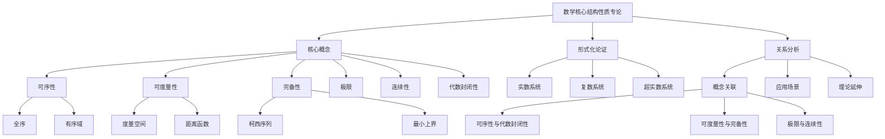

# 数学核心结构性质专论批判性分析报告

## 目录

- [数学核心结构性质专论批判性分析报告](#数学核心结构性质专论批判性分析报告)
  - [目录](#目录)
  - [1. 文档结构分析](#1-文档结构分析)
    - [优点](#优点)
    - [不足](#不足)
  - [2. 内容深度与广度评价](#2-内容深度与广度评价)
    - [深度分析](#深度分析)
    - [广度分析](#广度分析)
  - [3. 理论严谨性分析](#3-理论严谨性分析)
    - [严谨性优点](#严谨性优点)
    - [需要改进之处](#需要改进之处)
  - [4. 教学价值评估](#4-教学价值评估)
    - [教学优势](#教学优势)
    - [教学不足](#教学不足)
  - [5. 改进建议](#5-改进建议)
    - [内容组织](#内容组织)
    - [理论完善](#理论完善)
    - [教学优化](#教学优化)
  - [6. 思维导图](#6-思维导图)
  - [总体评价](#总体评价)

## 1. 文档结构分析

### 优点

- 三个文件采用统一的章节结构，便于对照阅读
- 目录层次清晰，从基础概念到高级关联性分析逐步深入
- 每个主题都包含概念定义、形式化论证和关系分析三个维度

### 不足

- 三个文件内容高度重复，缺乏明确的差异化定位
- 部分章节的层次结构不够清晰，如关系与关联性分析部分
- 缺乏实例和应用场景的具体展示

## 2. 内容深度与广度评价

### 深度分析

- **优势**
  - 对可序性、可度量性、完备性等核心概念的定义严谨
  - 形式化论证部分提供了详细的证明思路
  - 关系与关联性分析深入探讨了各概念间的联系

- **不足**
  - 部分证明过程过于简略，如超实数的构造
  - 缺乏对非标准分析方法的深入讨论
  - 代数封闭性的证明方法可以更丰富

### 广度分析

- **优势**
  - 覆盖了数学分析的核心概念
  - 包含了实数、复数、超实数三种数系的对比
  - 涉及了代数、分析、拓扑等多个数学分支

- **不足**
  - 缺乏对更一般拓扑空间的讨论
  - 未涉及泛函分析中的相关概念
  - 应用场景的讨论不够充分

## 3. 理论严谨性分析

### 严谨性优点

- 概念定义准确，使用形式化语言
- 证明过程逻辑清晰
- 各概念之间的关系分析严密

### 需要改进之处

- 部分等价表述的证明缺失
- 超实数部分的公理化基础不够清晰
- 某些结论缺乏反例说明

## 4. 教学价值评估

### 教学优势

- 概念讲解循序渐进
- 结构清晰，便于学习
- 关系分析有助于整体理解

### 教学不足

- 缺乏具体的应用实例
- 练习和思考题缺失
- 可视化辅助材料不足

## 5. 改进建议

### 内容组织

1. 合并三个文件，消除重复内容
2. 增加具体应用实例
3. 添加习题和思考题
4. 补充可视化图表

### 理论完善

1. 补充完整的证明过程
2. 增加反例说明
3. 扩展应用场景
4. 加强与其他数学分支的联系

### 教学优化

1. 添加学习目标
2. 设计分层练习
3. 增加历史背景
4. 补充现代应用

## 6. 思维导图

## 总体评价

这三个文件构成了一个相对完整的数学核心结构性质理论体系，具有以下特点：

1. **理论完整性**：覆盖了数学分析的核心概念，建立了清晰的理论框架。

2. **结构系统性**：采用统一的章节结构，便于系统学习。

3. **内容重复性**：三个文件内容高度重复，需要整合优化。

4. **应用不足**：缺乏具体的应用实例和现代应用场景。

5. **教学价值**：适合作为理论参考，但需要补充教学元素。

建议将三个文件整合为一个完整的文档，并按照上述改进建议进行优化，以提升其理论价值和教学效果。
