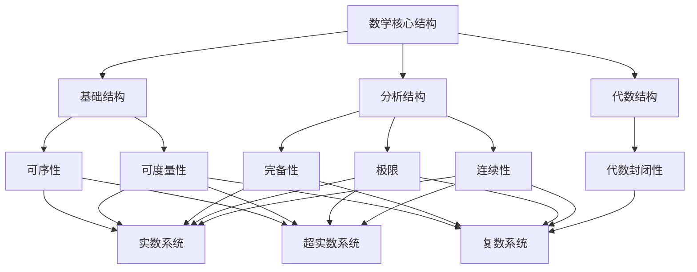
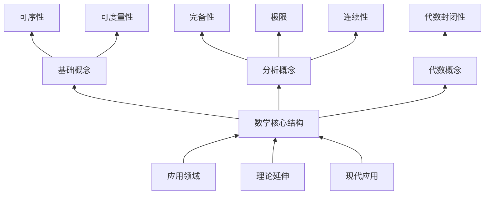
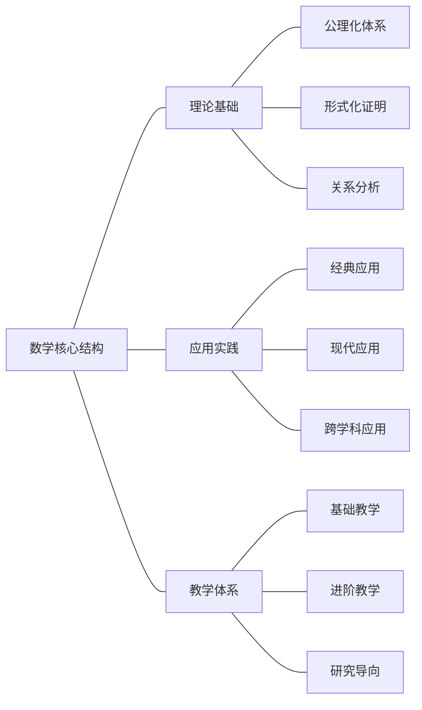
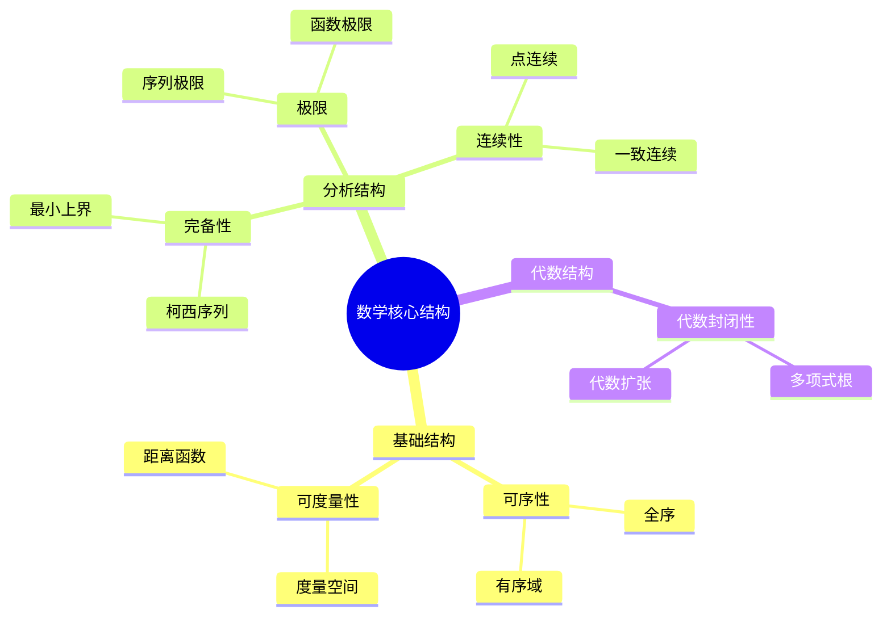
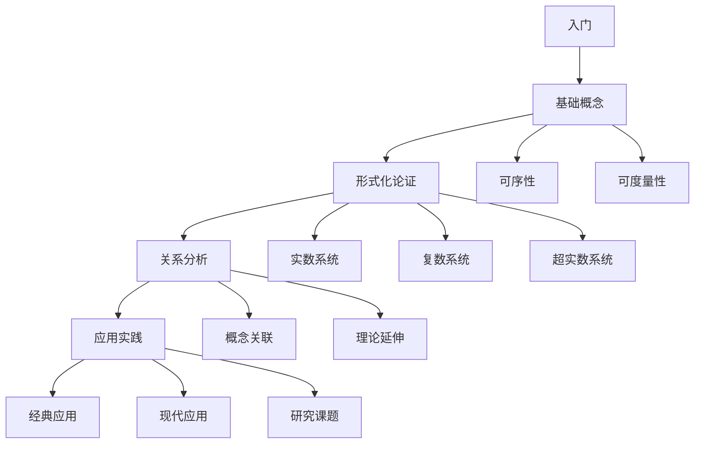

# 数学核心结构性质专论：一场批判性哲科思辨

## 目录

- [数学核心结构性质专论：一场批判性哲科思辨](#数学核心结构性质专论一场批判性哲科思辨)
  - [目录](#目录)
  - [思维导图](#思维导图)
    - [1. 核心概念关系图](#1-核心概念关系图)
    - [2. 概念层次图](#2-概念层次图)
    - [3. 知识网络图](#3-知识网络图)
  - [内容表征方式](#内容表征方式)
    - [1. 表格表征](#1-表格表征)
    - [2. 概念地图](#2-概念地图)
    - [3. 学习路径图](#3-学习路径图)
  - [引言：数学核心结构的哲科探源](#引言数学核心结构的哲科探源)
  - [1. 核心概念的深度解析与哲科审视](#1-核心概念的深度解析与哲科审视)
    - [1.1. 可序性（Orderability）：构建“先后”与“大小”的认知基石](#11-可序性orderability构建先后与大小的认知基石)
    - [1.2. 可度量性（Measurability）：量化“距离”与“接近”的物理投影](#12-可度量性measurability量化距离与接近的物理投影)
    - [1.3. 完备性（Completeness）：弥补“孔洞”与支撑“分析”的基石](#13-完备性completeness弥补孔洞与支撑分析的基石)
    - [1.4. 极限（Limit）：理解“趋近”与“无限过程”的精确之眼](#14-极限limit理解趋近与无限过程的精确之眼)
    - [1.5. 连续性（Continuity）：描述“无缝”与“平滑”的理想模型](#15-连续性continuity描述无缝与平滑的理想模型)
    - [1.6. 代数封闭性（Algebraic Closure）：寻求“解”与“完备”的终极追求](#16-代数封闭性algebraic-closure寻求解与完备的终极追求)
  - [2. 核心定理与定义的深层剖析](#2-核心定理与定义的深层剖析)
    - [2.1. 定理1.1：实数系统($\\mathbb{R}$, \<)是完备有序体](#21-定理11实数系统mathbbr-是完备有序体)
    - [2.2. 定理1.2：复数系统不存在与加法、乘法兼容的全序](#22-定理12复数系统不存在与加法乘法兼容的全序)
    - [2.3. 定义2.1（度量空间）：集合X上的函数d: X × X → $\\mathbb{R}$](#23-定义21度量空间集合x上的函数d-x--x--mathbbr)
    - [2.4. 定理2.1：实数系统上的欧氏度量](#24-定理21实数系统上的欧氏度量)
    - [2.5. 定理2.2：复数系统上的度量](#25-定理22复数系统上的度量)
    - [2.6. 定义3.1（完备性）：度量空间(X,d)中，每个柯西序列都收敛于X中的某个点](#26-定义31完备性度量空间xd中每个柯西序列都收敛于x中的某个点)
    - [2.7. 定义3.2（最小上界原理）：每个有上界的非空子集有最小上界](#27-定义32最小上界原理每个有上界的非空子集有最小上界)
    - [2.8. 定理3.1：实数系统的完备性](#28-定理31实数系统的完备性)
    - [2.9. 定理3.2：复数系统的完备性](#29-定理32复数系统的完备性)
    - [2.10. 定理4.1：实数系统的构造](#210-定理41实数系统的构造)
    - [2.11. 定理4.2：实数系统的性质](#211-定理42实数系统的性质)
    - [2.12. 定理5.1：复数系统的构造](#212-定理51复数系统的构造)
    - [2.13. 定理5.2：复数系统的性质](#213-定理52复数系统的性质)
    - [2.14. 定理6.1：可序性与代数封闭性的关系](#214-定理61可序性与代数封闭性的关系)
    - [2.15. 定理6.2：可度量性与完备性的关系](#215-定理62可度量性与完备性的关系)
  - [3. 核心概念的交互与关联分析（基于思维导图与概念地图的深层解读）](#3-核心概念的交互与关联分析基于思维导图与概念地图的深层解读)
    - [3.1. 序、度量与拓扑的交织](#31-序度量与拓扑的交织)
    - [3.2. 极限与连续性：分析学的心脏](#32-极限与连续性分析学的心脏)
    - [3.3. 代数结构与分析性质的统一与张力](#33-代数结构与分析性质的统一与张力)
  - [4. 批判性反思与前瞻展望](#4-批判性反思与前瞻展望)
    - [4.1. 数学核心结构的本体论追问：发现与发明的永恒辩证](#41-数学核心结构的本体论追问发现与发明的永恒辩证)
    - [4.2. 认知与数学构造的相互塑形](#42-认知与数学构造的相互塑形)
    - [4.3. 数学之美与形式化：哲科张力下的发展](#43-数学之美与形式化哲科张力下的发展)
    - [4.4. 信息时代与AI对数学核心结构的新挑战与新机遇](#44-信息时代与ai对数学核心结构的新挑战与新机遇)
      - [4.4.1. 批判性反思：数系构建中的人类局限](#441-批判性反思数系构建中的人类局限)
      - [4.4.2. 未来展望：数系、认知与AI的演化](#442-未来展望数系认知与ai的演化)
      - [4.4.3. 计算模型中的数系与算法](#443-计算模型中的数系与算法)
      - [4.4.4. 数据结构与算法的数系渊源](#444-数据结构与算法的数系渊源)
      - [4.4.5. 信息时代的数字表征与AI对现实的认知跃迁](#445-信息时代的数字表征与ai对现实的认知跃迁)
  - [5. 结论：演化、认知与无限](#5-结论演化认知与无限)
    - [修订要点、使用建议和练习与问题](#修订要点使用建议和练习与问题)
      - [修订要点](#修订要点)
      - [使用建议](#使用建议)
      - [练习与问题](#练习与问题)
        - [练习](#练习)
        - [问题](#问题)
        - [课题](#课题)

## 思维导图

### 1. 核心概念关系图

### 2. 概念层次图

### 3. 知识网络图

## 内容表征方式

### 1. 表格表征

| 概念 | 定义 | 性质 | 应用 |
| :--- | :--- | :--- | :--- |
| 可序性 | 全序关系 | 反对称性、传递性、完全性 | 度量、极值、积分 |
| 可度量性 | 距离函数 | 非负性、对称性、三角不等式 | 拓扑、极限、连续性 |
| 完备性 | 柯西序列收敛 | 最小上界原理 | 分析工具基础 |
| 极限 | 序列收敛 | ε-δ定义 | 连续、导数、积分 |
| 连续性 | 函数连续 | ε-δ定义 | 微分、积分、拓扑 |
| 代数封闭性 | 多项式有根 | 代数基本定理 | 方程求解 |

### 2. 概念地图

### 3. 学习路径图

## 引言：数学核心结构的哲科探源

数学，作为人类认知世界和构建抽象思维的基石，其发展并非简单的逻辑堆叠，而是一部充满哲科张力、概念跃迁与认知重构的宏大史诗。在这一宏伟画卷中，**核心结构性质**如可序性、可度量性、完备性、极限、连续性与代数封闭性，构成了数学殿堂的基石，它们不仅定义了数学对象的行为，更深刻地影响了我们对“数”、“空间”、“无限”乃至“实在”的理解。

本专论旨在超越对这些核心性质的纯粹数学定义，秉持批判性哲科精神，进行一场多维度的深入剖析。我们将：

1. **溯源概念：** 追溯这些核心性质的历史起源，揭示其在不同文明和思想背景下的演化脉络。
2. **剖析内涵与外延：** 精确界定其数学定义、定理，并探讨其在不同数学分支中的普遍性与变异。
3. **审视本体论地位：** 批判性地探讨这些性质是人类心智的“发明”，还是对宇宙深层结构的“发现”，以及它们如何与物理实在和人类认知相互映射。
4. **揭示认知挑战：** 分析这些抽象性质如何挑战或扩展人类的日常直观，以及在理解过程中所经历的认知挣扎。
5. **构建关联网络：** 深入探讨这些核心性质之间的内在联系、兼容性与冲突，揭示数学结构的统一性与复杂性。
6. **反思当代意义：** 在信息数字时代和人工智能浪潮的背景下，重新审视这些古老而核心的数学概念所面临的新挑战与新机遇。

通过这种多维、批判性的交叉分析，我们期望揭示数学核心结构性质背后的深刻哲科意义，理解人类认知如何通过这些抽象工具与现实世界建立联系，并反思在科技飞速发展的当下，这些看似稳固的数学基石所承载的未来可能性。

## 1. 核心概念的深度解析与哲科审视

### 1.1. 可序性（Orderability）：构建“先后”与“大小”的认知基石

- **定义与数学内涵：**
  - 在数学中，**可序性**通常指集合上存在一种**序关系 (Order Relation)**。最常见的是**全序关系 (Total Order)**，即对于集合中任意两个元素 $a, b$，要么 $a \le b$，要么 $b \le a$。序关系必须满足**自反性** ($a \le a$)、**反对称性**（若 $a \le b$ 且 $b \le a$，则 $a = b$）和**传递性**（若 $a \le b$ 且 $b \le c$，则 $a \le c$）。
  - 具备序关系的代数结构称为**有序结构**，如**有序群、有序环、有序域**。自然数 ($\mathbb{N}$)、整数 ($\mathbb{Z}$)、有理数 ($\mathbb{Q}$)、实数 ($\mathbb{R}$) 都具备全序关系，并因此构成了有序数系。
- **历史演化与哲学争议：**
  - **直观起源：** 可序性是人类最早从经验世界中抽象出来的数学概念之一。从“更多”、“更少”、“更早”、“更晚”等日常比较中，人类自然地形成了对“大小”和“先后”的直观感知。自然数的顺序是如此直观，以至于其序属性在早期数学中被视为不证自明。
  - **负数的挑战：** 负数的引入曾挑战了这种直观，因为其“小”于零的性质与日常经验相悖（“拥有少于没有”）。这反映了人类认知在面对抽象概念时，需要超越具象经验的挣扎。
  - **复数的根本性冲突：** 复数系统 ($\mathbb{C}$) 的出现，则彻底打破了数系与全序关系的必然绑定。定理1.2明确指出，复数系统**无法定义一个与加法、乘法运算兼容的全序关系**。这意味着我们不能像比较实数那样，直观地比较两个复数的大小。
  - **批判性反思：** 这种从直观序关系到其在复数中“丧失”的演化，深刻揭示了数学发展中一个核心的**哲科权衡**：为了获得代数封闭性（解决所有多项式方程），我们必须牺牲序关系。这挑战了“数”必然具有“大小”的传统认知，迫使我们接受数系可以仅通过其操作规则（代数结构）来定义，而无需依赖于直观的大小比较。这标志着数学从对“量”的研究，转向对“结构”的更深层探索。
- **认知映射与直观基础：**
  - **数轴的心理投射：** 数轴是可序性最直观的几何表征，它将抽象的序关系映射到可感知的空间维度上，极大地帮助了人类认知对数“大小”的理解。儿童在学习数字时，也常常依赖于对顺序和位置的感知。
  - **从具象比较到抽象关系：** 人类心智从最初对具体事物（如身高、重量）的直接比较，逐步抽象出可序性的概念。这种抽象能力是构建更复杂数学结构的基础。
- **与其他结构的关联性：**
  - **与度量性：** 可序性是构建度量空间的基础之一。有了序，我们才能定义“距离”、“接近”等概念。
  - **与完备性：** 实数的完备性（最小上界原理）是建立在序关系之上的。有上界集合的最小上界的存在，依赖于序的定义。
  - **与代数结构：** 序关系可以与代数运算（加法、乘法）兼容，形成有序域（如 $\mathbb{Q}$ 和 $\mathbb{R}$）。然而，如复数所示，这种兼容性并非必然，为了获得其他代数性质，序可以被牺牲。这强调了数学结构在不同维度上的**内在张力**。

### 1.2. 可度量性（Measurability）：量化“距离”与“接近”的物理投影

- **定义与数学内涵：**
  - **可度量性**是指在集合上定义一个**距离函数 (Distance Function)** 或**度量 (Metric)**。一个集合 $X$ 上的度量 $d: X \times X \to \mathbb{R}$ 必须满足四个公理（如定义2.1所示）：
        1. **非负性：** $d(x,y) \ge 0$ （距离非负）。
        2. **零距离等价：** $d(x,y) = 0 \iff x = y$ （自身距离为零，不同点距离非零）。
        3. **对称性：** $d(x,y) = d(y,x)$ （从A到B与从B到A的距离相同）。
        4. **三角不等式：** $d(x,z) \le d(x,y) + d(y,z)$ （两点之间直线最短）。
  - 具备度量的集合称为**度量空间 (Metric Space)**。它为集合中的元素引入了“距离”和“接近程度”的概念。
- **历史演化与测量本质的哲学追问：**
  - **经验起源：** 度量性直接源于人类对物理世界“长度”、“距离”、“间隔”的经验测量。从原始的步长、绳索到更精确的工具，人类一直在寻求量化物理空间的方式。
  - **抽象化过程：** 随着数学的发展，度量概念从具体的物理测量中被抽象出来，成为一个纯粹的数学概念。例如，实数线上的欧氏度量 $d(x,y) = |x-y|$ 是最简单的度量之一。
  - **非欧几何与广义度量：** 在19世纪，非欧几何的兴起挑战了欧几里得空间中距离的直观概念。20世纪，数学家们开始探索更广义的度量（如拓扑空间中的度量），将距离概念推广到更抽象的集合上。
  - **批判性反思：** 度量性是数学与物理世界连接的**核心桥梁**。它使得抽象的数学结构能够被赋予可测量、可操作的物理意义。然而，这种映射并非没有哲学争议：
    - **度量是实在的还是构造的？** 物理空间中“距离”的本质是什么？它是独立于人类心智的客观实在，还是人类为了理解和操作世界而构造的数学工具？例如，在量子力学中，距离的概念在微观层面变得模糊，而广义相对论中时空的弯曲使得“距离”依赖于引力场。
    - **度量的选择：** 同一个集合上可以定义多种不同的度量。例如，在 $\mathbb{R}^n$ 上除了欧氏距离，还有曼哈顿距离、切比雪夫距离等。这种选择性表明度量并非完全先验，而是基于特定目的和应用场景的人类构造。
- **认知映射与经验现实的桥梁：**
  - **直观的距离感：** 人类天生就具备对空间距离的直观感知能力。度量概念正是这种直观感知的数学化和形式化。
  - **量化世界的工具：** 度量性使得我们能够将模糊的“远近”转化为精确的数值。它是科学实验、工程设计和数据分析的基石，为我们提供了量化和比较世界的方法。
- **与其他结构的关联性：**
  - **与拓扑：** 度量可以诱导出拓扑结构，即可以根据距离定义开集、闭集等概念，从而引入连续性。度量空间是拓扑空间的一种特殊类型，它提供了更丰富的结构。
  - **与极限与连续性：** 度量是定义极限和连续性的基础。序列收敛于某一点，意味着序列项与该点的距离趋于零。函数在某一点连续，意味着当自变量接近该点时，函数值也接近。
  - **与完备性：** 完备性通常是针对度量空间而言的。一个度量空间是完备的，如果其中每个柯西序列都收敛于该空间内。这强调了度量与收敛性之间的紧密联系。

### 1.3. 完备性（Completeness）：弥补“孔洞”与支撑“分析”的基石

- **定义与数学内涵：**
  - 在数学中，**完备性**是一个集合或空间“没有孔洞”或“没有缺失”的性质。最常见的定义是针对**度量空间**而言：一个度量空间是完备的，如果其中每个**柯西序列 (Cauchy Sequence)** 都收敛于该空间中的某个点（如定义3.1所示）。柯西序列是指序列项随着下标增大而彼此无限接近的序列。
  - 对于实数系统 ($\mathbb{R}$)，其完备性也可以通过**最小上界原理 (Least Upper Bound Principle)** 来定义（如定义3.2所示）：每个有上界的非空实数子集都有一个最小上界。这两个定义在实数系统中是等价的（定理3.1）。
- **历史演化与数学危机：**
  - **第一次数学危机：** 希腊人发现 $\sqrt{2}$ 无法用有理数表示，暴露了有理数系统在“连续性”上的“孔洞”，这可以被视为对有理数“不完备性”的早期感知。这种不完备性导致了希腊数学对算术和代数的怀疑，转向几何学。
  - **第二次数学危机与实数构建：** 17世纪微积分的诞生，虽然强大，但其基于直观“无穷小量”和“连续性”的概念缺乏严格基础，引发了“第二次数学危机”。为了解决这一危机，19世纪的数学家们（柯西、魏尔斯特拉斯、戴德金、康托尔）致力于实数的严格化构造。
  - **严格构造的里程碑：** 戴德金分划和柯西序列构造是实数完备性的两种主要方法。它们都旨在“填补”有理数轴上的所有“孔洞”，使得实数成为一个真正的连续统，从而为极限、导数、积分等分析学概念提供坚实的逻辑基础。
  - **批判性反思：** 完备性的引入，标志着数学从直观感知向**形式化和公理化**的根本性转变。它迫使我们接受那些无法被有限符号精确表达的数（无理数），并构建一个超越直观的、逻辑上自洽的连续统。这不仅仅是数学上的进步，更是人类认知在面对“无限”、“连续”和“无孔”概念时，从具象到抽象的**观念跃迁**。
- **本体论争议：**
  - **是发现还是发明？** 实数的完备性是“发现”了自然界固有的连续性，还是人类为了数学分析的需要而“发明”出来的理想化结构？康托尔的“实无限”概念更是引发了激烈的本体论争议。
  - **数学柏拉图主义的论据：** 完备性使得分析学理论得以完美发展，其在物理学中的广泛应用似乎暗示了宇宙本身就是连续的，而实数只是揭示了这一本质。这为数学柏拉图主义提供了有力论据。
  - **建构主义的视角：** 另一方面，完备性是通过精心设计的逻辑构造（如戴德金分划）来实现的。这强调了人类在数学中的**创造性**和**构造性**作用。
- **认知映射与无限的具象化：**
  - **弥补直观的“缺失”：** 完备性概念通过形式化定义，弥补了人类在直观感知连续性时可能存在的“缺失”。它使得“无限逼近”能够有一个确定的“终点”，从而使我们能够逻辑地处理无限过程。
  - **抽象的必要性：** 完备性是一个高度抽象的概念，它要求认知超越对有限元素的排列组合，理解一个集合“没有孔洞”的性质，这是对抽象思维能力的巨大考验。
- **与其他结构的关联性：**
  - **与极限与连续性：** 完备性是极限和连续性得以严格定义和发挥作用的基石。在不完备空间中，许多柯西序列没有极限，从而导致分析工具的失效。
  - **与度量性：** 完备性通常在度量空间中定义，因为度量提供了衡量“接近程度”的工具，使得柯西序列的概念得以确立。
  - **与拓扑：** 完备性是拓扑学中的一个重要概念，它影响着空间的“形状”和“连接性”。
  - **与实数系统：** 实数系统作为唯一的完备有序域，其完备性使其成为分析学和微积分的理想基础，这解释了为什么实数在科学中如此普遍。

### 1.4. 极限（Limit）：理解“趋近”与“无限过程”的精确之眼

- **定义与数学内涵：**
  - **极限**是描述序列或函数在某种意义上“趋近”某个值的数学概念。它捕捉了“无限逼近而不达到”的动态过程。
  - 最严格的定义是**$\epsilon-\delta$ 定义**：对于序列 $\{x_n\}$，如果存在 $L$，使得对于任意小的正数 $\epsilon$（误差容忍度），都存在一个正整数 $N$，使得当 $n > N$ 时，$|x_n - L| < \epsilon$。这意味着序列项无限接近 $L$。类似地，对于函数 $f(x)$，当 $x$ 趋近于 $a$ 时，如果 $f(x)$ 趋近于 $L$，则表示对于任意 $\epsilon > 0$，存在 $\delta > 0$，使得当 $0 < |x - a| < \delta$ 时， $|f(x) - L| < \epsilon$。
- **历史演化与哲科争议：**
  - **古希腊的萌芽与芝诺悖论：** 极限的观念可以追溯到古希腊的穷竭法，用于计算曲线下的面积，但这是一种几何直观的方法。芝诺悖论（如“阿喀琉斯与乌龟”）则尖锐地指出了“无限分割”和“无限累加”在逻辑上的困境，这实际上是对极限概念早期直观理解的挑战。
  - **微积分的直观基础：** 牛顿和莱布尼茨在创立微积分时，尽管取得了巨大成功，但其对极限和“无穷小量”的理解是高度直观且模糊的。他们依赖于对瞬间变化和趋近过程的几何想象，缺乏严格的逻辑基础。
  - **第二次数学危机与严格化：** 这种模糊性受到了**贝克莱主教 (George Berkeley)** 等哲学家的尖锐批判（称无穷小量为“逝去量的鬼魂”），引发了“第二次数学危机”。为解决此危机，19世纪的柯西、魏尔斯特拉斯等人引入了**$\epsilon-\delta$ 语言**，将极限概念彻底算术化和形式化，摆脱了对直观无穷小量的依赖，使其成为精确的、可操作的数学工具。
  - **批判性反思：** 极限的严格化，是数学从“直观”到“严谨”迈进的里程碑。它将“无限逼近”这个动态的、模糊的哲学概念，转化为一个静态的、精确的、可检验的逻辑关系。这不仅解决了微积分的基础问题，也极大地影响了数学的思维方式，强调了形式逻辑和公理化推理的重要性。
- **认知困境与反直观性：**
  - **“无限过程”的挑战：** 极限概念对人类的直观认知而言是反常的，因为我们习惯于确定的终点。而极限则描述一个永无止境的“趋近”过程，但这个过程却能导致一个确定的值。
  - **$\epsilon-\delta$ 语言的抽象性：** $\epsilon-\delta$ 定义的高度抽象性，使得它对初学者构成了巨大挑战。它要求思维从动态的“过程”转向静态的“关系”，从具象的“靠近”转向抽象的“误差范围”，这是一种深刻的认知转型。
  - **批判性反思：** 极限概念的认知难度，凸显了人类直观的局限性。它表明，数学真理并非总是符合日常经验，有时甚至会违背它。克服这种反直观性，需要发展出更高级的抽象思维能力，适应通过逻辑和符号操作来理解世界的方式。
- **与其他结构的关联性：**
  - **与完备性：** 完备性是极限存在的保证。在完备空间中，所有柯西序列都有极限。实数的完备性使得所有收敛的有理数列的极限（包括无理数）都在实数域内。
  - **与连续性：** 连续性可以用极限来精确定义：函数在一点连续，当且仅当该点处的极限值等于函数值。
  - **与导数和积分：** 导数是函数变化率的极限，积分是黎曼和的极限。极限是微积分所有核心概念的统一基础。
  - **与度量性：** 极限的定义离不开度量，因为“接近”和“趋近”都需要通过距离来量化。

### 1.5. 连续性（Continuity）：描述“无缝”与“平滑”的理想模型

- **定义与数学内涵：**
  - **连续性**描述了数学对象（如函数、曲线、空间）的“无缝”、“平滑”或“没有跳跃和中断”的性质。
  - 对于函数 $f(x)$，最普遍的定义是基于极限的：函数在一点 $a$ 连续，当且仅当 $\lim_{x \to a} f(x) = f(a)$。这可以进一步用 $\epsilon-\delta$ 语言来精确表达。
  - 在拓扑学中，连续性被更广泛地定义为“保持邻近性”的映射，即开集的原像仍是开集。这是一种更抽象、更普适的定义，不依赖于距离或序。
- **历史演化与哲科争议：**
  - **直观起源：** 连续性最初源于对物理世界（如运动轨迹、时间流逝）的直观感知——没有突然的中断或跳跃。牛顿和莱布尼茨的微积分建立在对这种直观连续性的操作上。
  - **魏尔斯特拉斯的“反例”：** 19世纪，魏尔斯特拉斯构造了一个**处处连续但处处不可导的函数**，这深刻挑战了数学家们对“连续”和“平滑”的直观几何想象（认为连续函数必然是“光滑”的）。这迫使数学家们意识到，直观可能具有欺骗性，必须依靠严格的逻辑定义。
  - **实数与连续统：** 实数系统的严格构建（戴德金分划）为数学上的连续统提供了坚实基础，使得对连续函数的分析成为可能。
  - **批判性反思：** 连续性的严格化，是数学从“感性直观”向“理性逻辑”迈进的关键一步。它揭示了数学意义上的“连续”与日常直观中的“平滑”并非完全一致。这种差异引发了深刻的哲学问题：
    - **物理世界是连续还是离散？** 经典物理学（如牛顿力学）假设时空和物质是连续的，而量子力学则揭示了微观世界的量子化（离散）本质。数学上的连续统，是否仅仅是人类为了建模方便而构建的理想化工具？
    - **数字化的挑战：** 在信息数字时代，所有的信息和计算都是离散的。计算机通过足够高的精度和采样率来**近似地表征连续性**（如数字图像、高保真音频）。这引发了对数字世界中“连续性”本质的追问：它是否只是离散点的“幻象”？
- **认知与物理现实的张力：**
  - **对“无缝”的执着：** 人类认知倾向于将“无缝”视为一种理想状态，例如，我们认为时间是连续流逝的。
  - **认知局限：** 尽管能够抽象理解连续性，但人类心智在具象化无限细分和无跳跃概念时仍然面临挑战。
- **与其他结构的关联性：**
  - **与极限：** 连续性是极限概念的直接应用，是微积分的核心概念之一。
  - **与可微分性/可积分性：** 函数的可微分性（即导数存在）要求其必须是连续的。积分（黎曼积分）也要求被积函数在一定条件下连续。
  - **与拓扑学：** 拓扑学是研究连续性的最普遍的数学分支。拓扑空间中的连续映射推广了传统意义上的连续函数，使其不依赖于距离或序。

### 1.6. 代数封闭性（Algebraic Closure）：寻求“解”与“完备”的终极追求

- **定义与数学内涵：**
  - 一个域 $F$ 是**代数封闭的 (algebraically closed)**，如果 $F$ 中的任何一个次数大于等于1的非零多项式，都在 $F$ 中至少有一个根。
  - **代数基本定理 (Fundamental Theorem of Algebra)** 指出：复数域 ($\mathbb{C}$) 是代数封闭的。这意味着任何一个单变量的复系数多项式方程，在复数域中都至少有一个根，从而也有 $n$ 个根（计数重根）。
- **历史演化与多项式方程的求解：**
  - **方程求解的驱动：** 代数封闭性的追求起源于对多项式方程求解的渴望。从古巴比伦的二次方程到文艺复兴时期的三次、四次方程，数学家们一直在寻找能够包含所有方程解的“完备”数系。
  - **虚数的“合法化”：** 虚数 $i$ 最初就是为了解决 $x^2 + 1 = 0$ 这样的方程而被迫引入的。复数域的代数封闭性，极大地“合法化”了虚数的地位，并使其从“虚假之数”转变为代数完备性的必然组成部分。
  - **高斯与严格证明：** 高斯提供了代数基本定理的第一个严格证明，彻底确立了复数域在代数中的核心地位。
- **本体论意义与数系的“终点”：**
  - **“终极”数系？** 复数域的代数封闭性，使其成为一个在代数运算层面“完备”的数系。在某种意义上，它是数系在代数扩张方向上的一个“终点”。我们不再需要引入新的“数”来解决多项式方程。
  - **批判性反思：** 这种“终点”并非绝对。虽然复数在代数封闭性上达到了顶峰，但其在其他性质上（如序关系、高维几何表征）并非“完美”。例如，为了描述三维旋转，我们不得不引入非交换的四元数。这表明，数学中存在着**不同维度、不同类型的“完备性”追求**，而这些追求往往伴随着**权衡与牺牲**。
- **与其他结构的关联性：**
  - **与可序性的冲突：** 定理6.1明确指出，**任何代数封闭的域都不可能定义一个与其运算兼容的全序关系**。这是一个深刻的数学定理，它揭示了代数完备性与序结构之间的内在冲突。
  - **与代数扩张：** 代数封闭性与域的代数扩张理论紧密相关。任何域都可以被嵌入到一个代数封闭域中，而复数域就是实数域的代数闭包。
  - **在物理学中的应用：** 复数域的代数封闭性在物理学中无处不在，例如量子力学中能量本征值、波动方程的解等，都常常自然地出现在复数域中。

---

## 2. 核心定理与定义的深层剖析

这一章节将逐一阐述您提纲中列出的关键定义和定理，并超越其形式化表述，深入探讨其数学内涵、历史背景、哲学意义以及对人类认知和数系本体论的深远影响。每个定理和定义都将被视为数学发展中的一个里程碑，其背后蕴含着对“数”、“空间”、“无限”和“逻辑”的深刻理解与构造。

### 2.1. 定理1.1：实数系统($\mathbb{R}$, <)是完备有序体

- **定理陈述：** 实数系统 $\mathbb{R}$ 在标准加法和乘法下是一个域，在标准小于关系 (<) 下是一个全序集，并且是完备的（即每个非空有上界的子集都有最小上界）。它是唯一的（在同构意义下）完备有序体。
- **数学内涵：**
  - **域 (Field)：** 意味着实数系统在加法和乘法下拥有所有的良好代数性质：封闭性、结合律、交换律、分配律，并存在单位元（0和1）和逆元（负数和倒数）。这使其成为进行加减乘除运算的理想场所。
  - **有序 (Ordered)：** 意味着实数之间可以进行大小比较，且这种比较与代数运算相容。例如，如果 $a < b$，则 $a+c < b+c$；如果 $a < b$ 且 $c > 0$，则 $ac < bc$。这使得我们可以定义“正”、“负”等概念，并进行不等式运算。
  - **完备 (Complete)：** 这是实数系统最核心的性质，弥补了有理数的“孔洞”。它可以通过多种等价形式来表述：
        1. **戴德金分划 (Dedekind Cut)：** 任何将有理数集分成两个非空子集 A 和 B，使得 A 中所有元素都小于 B 中所有元素的分划，都对应一个唯一的实数。这保证了数轴的“连续性”，没有“空隙”。
        2. **柯西序列收敛性 (Cauchy Sequence Convergence)：** 任何实数柯西序列（即序列项彼此无限接近的序列）都收敛于一个实数。这意味着在实数域内，序列的“收敛性”是有保证的。
        3. **最小上界原理 (Least Upper Bound Principle)：** 任何非空的、有上界的实数子集都存在一个最小上界（也称为上确界）。这在直观上保证了实数轴的“紧密性”。
- **历史背景与哲科意义：**
  - **第一次数学危机与第二次数学危机：** 实数系统的构建，是对古希腊“不可公度量”问题（第一次数学危机）和17-18世纪微积分“无穷小量”模糊性问题（第二次数学危机）的最终解答。它提供了严格的数学基础，使得这些问题得以解决，并为现代分析学奠定了不可动摇的基石。
  - **从直观到形式：** 实数的严格构造（如戴德金分划）是数学从依赖直观几何（如欧几里得几何中的“线”）向纯粹算术化和形式化迈进的典范。它迫使数学家们放弃对“连续”的直观想象，转而接受基于逻辑推演和公理化定义的抽象概念。
  - **“连续统”的本体论：** 实数系统的完备性，使得我们可以精确地建模物理世界中的连续量（如时间、空间、温度）。这引发了深刻的本体论追问：物理世界的“连续性”是其内在的性质，还是人类为了建模方便而构建的理想化数学工具？实数系统的“唯一性”（在同构意义下）是否暗示了其某种“必然性”或“柏拉图式”的存在？
- **认知映射与挑战：**
  - **克服“孔洞”的直观：** 人类心智在理解有理数“稠密但有孔洞”的概念时会遇到困难，而实数的“完备性”则通过形式化定义弥补了这种直观上的“缺失”。
  - **“无限”的严格化：** 实数系统使得对“无限逼近”、“无穷小”等概念的严格处理成为可能，这要求认知从模糊的哲学无限转向精确的数学无限。
  - **抽象的胜利：** 实数的构造过程，如戴德金分划，是高度抽象的。它要求认知接受一种非构造性（无法通过有限步骤完全写出每个无理数）的定义，从而理解一个集合的整体性质。

### 2.2. 定理1.2：复数系统不存在与加法、乘法兼容的全序

- **定理陈述：** 不存在一种在复数系统 $\mathbb{C}$ 上定义的，同时满足全序关系（自反性、反对称性、传递性、完全性）且与复数的加法和乘法运算兼容的序关系。
- **数学内涵（证明思路）：**
    1. **假设存在：** 假设 $\mathbb{C}$ 上存在这样的全序关系。
    2. **序与运算兼容性：** 如果 $a < b$，则 $a+c < b+c$；如果 $a < b$ 且 $c > 0$，则 $ac < bc$。
    3. **考虑 $i$ 的性质：** 根据全序的完全性，对于虚数单位 $i$，要么 $i > 0$，要么 $i < 0$，要么 $i = 0$。
        - 如果 $i = 0$，则矛盾，因为 $i \neq 0$。
        - 如果 $i > 0$：则 $i \cdot i > 0 \cdot i$，即 $i^2 > 0$，所以 $-1 > 0$。这又导致 $(-1) \cdot (-1) > 0 \cdot (-1)$（注意这里乘以负数要变号，但如果我们保持兼容性，$-1 > 0$意味着 $1 < 0$，那么 $(-1) \cdot (-1) < 0 \cdot (-1)$，得到 $1 < 0$，与实数序矛盾），最终会推出 $1 < 0$，与实数序矛盾。
        - 如果 $i < 0$：则 $(-i) > 0$。那么 $(-i) \cdot (-i) > 0$，即 $i^2 > 0$，所以 $-1 > 0$，同样导致 $1 < 0$，与实数序矛盾。
    4. **导出矛盾：** 无论哪种情况，都会导出 $1 < 0$ 的矛盾，这与我们对实数序的认知相悖。因此，假设不成立，复数系统不存在这样的全序。
- **历史背景与哲科意义：**
  - **“虚幻”的根源之一：** 这个定理是复数系统最初被视为“虚幻之数”的重要原因之一。人类对“数”的直观认知强烈依赖于其“大小”或“顺序”，而复数恰恰丧失了这种可比较性。
  - **代数完备性的代价：** 复数系统为了获得**代数封闭性**（即所有多项式方程都有解），必须**牺牲其可序性**。这是一个深刻的数学权衡，它揭示了数学结构在追求不同“完备性”时可能面临的内在冲突。不可能同时拥有所有“美好”的数学性质。
  - **从“量”到“结构”的转变：** 这个定理迫使数学家和哲学家认识到，数的本质可以不依赖于其“量”或“大小”，而是更多地由其**代数结构**（加法、乘法运算规则）来定义。这标志着数学思维从对具体“量”的关注转向对抽象“结构”的更深层探索。
- **认知映射与挑战：**
  - **直观的丧失：** 人类心智难以直观理解没有大小之分的“数”。这使得复数的学习和接受在早期面临巨大认知障碍。
  - **抽象思维的必要性：** 理解复数系统需要超越传统的线性序思维，转而依赖于对二维几何表征（高斯平面）和纯粹代数运算规则的理解。

### 2.3. 定义2.1（度量空间）：集合X上的函数d: X × X → $\mathbb{R}$

- **定义陈述：** 一个集合 $X$ 上的**度量 (Metric)** 是一个函数 $d: X \times X \to \mathbb{R}$，对于 $X$ 中任意的元素 $x, y, z$，它必须满足以下四个公理：
    1. **非负性：** $d(x,y) \ge 0$ (距离总是非负的)。
    2. **零距离等价：** $d(x,y) = 0 \iff x = y$ (两点距离为零当且仅当它们是同一点)。
    3. **对称性：** $d(x,y) = d(y,x)$ (从 $x$ 到 $y$ 的距离等于从 $y$ 到 $x$ 的距离)。
    4. **三角不等式：** $d(x,z) \le d(x,y) + d(y,z)$ (从 $x$ 经过 $y$ 到 $z$ 的距离不小于直接从 $x$ 到 $z$ 的距离，即两点之间直线最短)。
    满足这些公理的集合 $X$ 和度量 $d$ 构成的对 $(X, d)$ 称为一个**度量空间 (Metric Space)**。
- **数学内涵：**
  - **量化“接近”：** 度量空间为集合中的元素引入了“距离”和“接近程度”的精确量化。它使得我们可以严格定义“邻域”、“收敛”、“连续”等概念，而无需依赖于具体的几何图形。
  - **拓扑学的基础：** 任何度量空间都可以自然地诱导出一个拓扑结构，使得我们可以讨论开集、闭集、紧集等拓扑性质。度量空间是比拓扑空间更“丰富”的结构。
- **历史背景与哲科意义：**
  - **经验起源与抽象化：** 度量概念直接来源于人类对物理世界中“长度”、“距离”、“间隔”的经验测量。从欧几里得几何中的点到点的距离，到更复杂的函数空间中的距离，度量概念经历了从具象到抽象的演化。
  - **“距离”的本体论：** 物理空间中“距离”的本质是什么？它是独立于人类心智的客观实在，还是人类为了理解和操作世界而构造的数学工具？度量空间的定义是纯粹公理化的，它使得“距离”概念可以脱离具体的物理载体而存在，强调了其作为一种抽象关系的本质。
  - **建模的普适性：** 度量空间的概念极具普适性，它不仅适用于我们熟悉的欧几里得空间，也适用于函数空间、序列空间等各种抽象数学对象，甚至在数据科学和机器学习中，用于衡量数据点之间的“相似性”或“差异性”。这表明数学能够抽取出不同领域中共同的“距离”模式。
- **认知映射与物理直观：**
  - **直观的距离感：** 人类天生就具备对空间距离的直观感知能力。度量空间的公理（特别是三角不等式）在很大程度上符合我们的日常直观。
  - **量化世界的工具：** 度量性使得我们能够将模糊的“远近”转化为精确的数值，为科学实验、工程设计和数据分析提供了强大的量化工具。

### 2.4. 定理2.1：实数系统上的欧氏度量

- **定理陈述：** 对于实数系统 $\mathbb{R}$，函数 $d(x,y) = |x - y|$ 是一个度量。这构成了实数线上的标准欧氏度量空间 $(\mathbb{R}, |\cdot|)$。这个度量空间是完备的。
- **数学内涵（证明要点）：**
    1. **定义：** 欧氏度量定义为两点差的绝对值。
    2. **验证公理：** 证明 $d(x,y) = |x - y|$ 满足度量空间的四个公理（非负性、零距离等价、对称性、三角不等式）。
    3. **完备性证明：** 证明 $(\mathbb{R}, |\cdot|)$ 是完备的，即每一个在欧氏度量下的柯西序列都收敛于 $\mathbb{R}$ 中的某个点。这与实数系统的完备性定义（定理1.1）是等价的，通常通过戴德金分划或最小上界原理来间接证明。
- **哲科意义：**
  - **“距离”的物理原型：** 实数线上的欧氏度量是人类对物理世界中“长度”和“距离”概念最直观、最标准的数学化。它是我们理解一维空间的基础。
  - **分析学的基石：** 这个度量使得我们能够在实数系统上严格定义极限、连续性、导数、积分等分析学概念。它是微积分能够得以严格化的根本。
  - **与序的关系：** 欧氏度量与实数的序关系紧密相连。绝对值函数 $|x-y|$ 利用了序关系来定义距离。
- **认知映射：**
  - **直观的距离概念：** 这个度量与人类对直线距离的直观认知完美契合，使得数学概念与经验世界无缝连接。
  - **量化一维空间：** 它是我们量化一维空间（如时间轴、温度计）的基础工具。

### 2.5. 定理2.2：复数系统上的度量

- **定理陈述：** 对于复数系统 $\mathbb{C}$，函数 $d(z_1, z_2) = |z_1 - z_2|$ 是一个度量，其中 $|z|$ 是复数 $z$ 的模（或绝对值）。这构成了复平面上的标准欧氏度量空间 $(\mathbb{C}, |\cdot|)$。这个度量空间是完备的。
- **数学内涵（证明要点）：**
    1. **定义：** 复数 $z = a+bi$ 的模定义为 $|z| = \sqrt{a^2+b^2}$。复数之间的距离定义为它们差的模。
    2. **几何解释：** 这对应于高斯平面上两点之间的欧几里得距离。
    3. **验证公理：** 证明 $d(z_1, z_2) = |z_1 - z_2|$ 满足度量空间的四个公理。这依赖于复数模的性质，特别是三角不等式 $|z_1 + z_2| \le |z_1| + |z_2|$。
    4. **完备性证明：** 证明 $(\mathbb{C}, |\cdot|)$ 是完备的，即每一个复数柯西序列都收敛于 $\mathbb{C}$ 中的某个复数。这通常通过将复数序列分解为实部和虚部两个实数序列的收敛性来证明（如定理3.2）。
- **哲科意义：**
  - **复数的“实在化”：** 这个度量是复数从“虚幻之数”走向“实在化”的关键一步。它将抽象的复数赋予了明确的几何意义，使得复数不再仅仅是代数符号，而是可以测量距离和进行几何操作的对象。
  - **二维空间的表征：** 复数系统上的度量使得复平面成为描述二维几何和物理现象的强大工具。它将代数运算与几何变换（如平移、旋转、伸缩）紧密结合，从而在电磁学、流体力学、量子力学等领域找到广泛应用。
  - **与不可序性的对比：** 尽管复数系统不可序（定理1.2），但它却是可度量的。这再次强调了数学结构性质之间的复杂权衡：牺牲了序，却获得了度量，进而获得了丰富的几何和分析性质。
- **认知映射：**
  - **二维空间的直观：** 这个度量利用了人类对二维空间的直观感知能力，使得复数的运算和性质更容易被可视化和理解。
  - **超越一维限制：：** 它帮助人类认知突破了一维数轴的限制，进入了二维平面思维。

### 2.6. 定义3.1（完备性）：度量空间(X,d)中，每个柯西序列都收敛于X中的某个点

- **定义陈述：** 一个度量空间 $(X, d)$ 被称为**完备的 (Complete)**，如果 $X$ 中的每一个**柯西序列 (Cauchy Sequence)** 都收敛于 $X$ 中的一个点。
  - **柯西序列：** 一个序列 $\{x_n\}$ 是柯西序列，如果对于任意给定的正数 $\epsilon > 0$，都存在一个正整数 $N$，使得当 $m, n > N$ 时，$d(x_m, x_n) < \epsilon$。直观地说，柯西序列的项随着下标的增大而彼此无限接近。
- **数学内涵：**
  - **“没有孔洞”的精确表达：** 完备性精确地捕捉了度量空间“没有孔洞”或“没有缺失点”的直观概念。如果一个空间不完备，那么就存在一些柯西序列，它们的项无限接近，但却“找不到”一个点作为它们的极限，就好像在空间中留下了一个“洞”。
  - **分析学的基础：** 完备性是微积分和实变函数论等分析学分支的基石。许多重要的定理（如介值定理、一致收敛定理、压缩映射原理）都需要空间的完备性才能成立。它确保了极限运算能够在空间内部“有结果”，从而使得连续性、可微性等概念能够被严格定义和应用。
- **历史背景与哲科意义：**
  - **第二次数学危机与实数化：** 柯西序列的概念起源于19世纪对微积分严格化的需求，当时数学家们试图摆脱对模糊的“无穷小量”的依赖。柯西序列提供了一种纯粹基于序列项之间距离来定义收敛性的方法，而无需预先知道极限点是什么。
  - **实数完备性的核心：** 实数系统 $\mathbb{R}$ 的完备性是其与有理数 $\mathbb{Q}$ 的根本区别。有理数虽然稠密，但不完备（例如，由有理数 $x_n$ 组成的序列 $x_n^2 \to 2$ 的柯西序列，其极限 $\sqrt{2}$ 不在有理数中）。实数通过“填补”这些“孔洞”而变得完备，从而使其成为分析学的理想工具。
  - **本体论的“存在”与“构造”：** 完备性引发了关于数学对象“存在”的哲学思考。当一个柯西序列收敛时，它的极限点是“存在”的。这种存在是独立于人类心智的客观存在（柏拉图主义），还是人类通过构造性方法（如戴德金分划）使其存在的（建构主义）？
- **认知映射与挑战：**
  - **“没有孔洞”的直观困难：** 尽管完备性旨在精确化“没有孔洞”的直观，但理解一个无限集合“没有孔洞”仍然具有认知挑战性，尤其是在处理抽象空间时。
  - **柯西序列的抽象性：** 柯西序列的定义（序列项彼此接近，但未指明极限）比直接的收敛定义（序列项接近某个已知极限）更为抽象，因为它关注的是序列本身的内在性质。

### 2.7. 定义3.2（最小上界原理）：每个有上界的非空子集有最小上界

- **定义陈述：** **最小上界原理 (Least Upper Bound Principle)**，也称为**上确界原理 (Supremum Principle)**：实数系统 $\mathbb{R}$ 的任何非空子集 $S$，如果它有上界（即存在一个实数 $M$，使得对于所有 $x \in S$，都有 $x \le M$），那么它就有一个**最小上界 (Least Upper Bound)**，也称为**上确界 (Supremum)**，记作 $\sup S$。
- **数学内涵：**
  - **“紧密性”的体现：** 最小上界原理直观地表达了实数轴的“紧密性”和“连续性”。它保证了即使一个集合的元素无限逼近某个值，这个值也一定在实数系统内。
  - **与戴德金分划的关联：** 最小上界原理与戴德金分划在逻辑上是等价的，都是实数完备性的重要特征。一个戴德金分划的上部集合的最小元素（如果存在）或下部集合的最大元素（如果存在），就是这个分划对应的实数。
- **历史背景与哲科意义：**
  - **实数构造的另一种视角：** 最小上界原理是戴德金构造实数的重要工具。戴德金通过将有理数集进行分划，并定义“分划”本身为实数，从而保证了每一个有上界的有理数集合都有一个实数作为其最小上界。
  - **分析学定理的基石：** 许多分析学的基本定理，如介值定理、零点定理、最大值-最小值定理等，都可以直接或间接地从最小上界原理推导出来。它为函数的连续性和极限行为提供了坚实的理论支持。
  - **本体论与直觉：** 最小上界原理在直观上似乎是“显而易见”的，因为它符合我们对“连续直线”的想象。然而，这种“显而易见”恰恰是经过严格形式化后才得以保障的。它引发了对数学直觉在形式化过程中的作用和地位的讨论。
- **认知映射与直观性：**
  - **“有边界就有顶点”的直观：** 最小上界原理某种程度上符合我们对“有边界的集合一定有最顶端”的直观，但其严格性超越了这种直观，因为它处理的是无限集合和无限逼近的情况。
  - **抽象与具象：** 理解最小上界原理，需要从具象的“最大值”概念（不一定存在于开放区间）上升到抽象的“最小上界”概念（必然存在于实数集合内）。

### 2.8. 定理3.1：实数系统的完备性

- **定理陈述：** 实数系统 $\mathbb{R}$ 在标准度量 $d(x,y) = |x-y|$ 下是完备的度量空间。这意味着 $\mathbb{R}$ 中的每一个柯西序列都收敛于 $\mathbb{R}$ 中的某个实数。
- **数学内涵（证明思路）：**
    1. **柯西序列的定义：** 任何实数柯西序列，其项随着下标增大而彼此无限接近。
    2. **构造性证明（戴德金分划）：** 对于任何一个实数柯西序列，可以利用其定义来构造一个戴德金分划。这个分划所定义的实数就是该柯西序列的极限。
    3. **等价性证明（最小上界原理）：** 证明实数系统满足最小上界原理与实数系统是完备度量空间是等价的。这通常通过证明：
        - 最小上界原理 $\implies$ 柯西序列收敛。
        - 柯西序列收敛 $\implies$ 最小上界原理。
- **历史背景与哲科意义：**
  - **第二次数学危机的最终解决：** 实数系统的完备性是解决19世纪微积分基础危机的核心。它提供了“连续”概念的严格数学定义，使得极限、导数、积分等关键分析学概念不再建立在模糊的直观之上，而是拥有坚实的逻辑基础。
  - **分析学的基础：** 它是微积分和实变函数论等所有分析学分支的基石。没有实数的完备性，许多重要的分析定理（如介值定理、极值定理）将无法成立，数学分析将成为空中楼阁。
  - **“连续统”的本体论：** 实数系统的完备性使得它可以完美地映射到“没有孔洞”的直线。这引发了深刻的本体论追问：物理世界的“连续性”是其内在的性质，还是人类为了建模方便而构建的理想化数学工具？这种完美性是否意味着它在宇宙中具有某种特殊的存在地位？
- **认知映射与挑战：**
  - **克服“直观孔洞”：** 人类心智在理解有理数轴的“孔洞”时会遇到困难。实数的完备性通过形式化构造，帮助我们克服了这种认知障碍，建立了对“无孔连续统”的逻辑理解。
  - **无限的精确化：** 完备性使得对无限逼近过程（柯西序列）能够有一个确定的“终点”（极限），从而将模糊的无限概念精确化。

### 2.9. 定理3.2：复数系统的完备性

- **定理陈述：** 复数系统 $\mathbb{C}$ 在标准度量 $d(z_1, z_2) = |z_1 - z_2|$ 下是完备的度量空间。这意味着 $\mathbb{C}$ 中的每一个复数柯西序列都收敛于 $\mathbb{C}$ 中的某个复数。
- **数学内涵（证明思路）：**
    1. **分解为实部和虚部：** 任何复数序列 $\{z_n\}$ 可以写成 $\{x_n + iy_n\}$，其中 $\{x_n\}$ 是实部序列，$\{y_n\}$ 是虚部序列。
    2. **复数柯西序列与实数柯西序列的关系：** 证明如果 $\{z_n\}$ 是一个复数柯西序列，那么 $\{x_n\}$ 和 $\{y_n\}$ 都是实数柯西序列。反之亦然。
    3. **利用实数完备性：** 由于实数系统是完备的（定理3.1），所以存在实数 $x_0$ 和 $y_0$ 分别是 $\{x_n\}$ 和 $\{y_n\}$ 的极限。
    4. **复数收敛：** 证明复数序列 $\{z_n\}$ 收敛于复数 $z_0 = x_0 + iy_0$。
- **哲科意义：**
  - **二维空间的完备性：** 复数系统的完备性，确保了复平面上的极限和连续性概念是健全的。这意味着在复平面上，我们不会遇到像有理数轴那样“缺乏极限点”的尴尬。
  - **分析学的延伸：** 复数完备性是复变函数论的基石。许多复变函数的重要性质（如柯西积分定理、留数定理）都依赖于复数空间的完备性。
  - **与不可序性的对比：** 尽管复数系统不可序（定理1.2），但它却是完备的。这再次强调了数学结构性质之间的复杂权衡和非必然性：为了获得代数封闭性，牺牲了序，但却保留了对分析学至关重要的完备性。这表明数学的发展并非简单地堆叠“好”性质，而是在复杂的约束下进行权衡和选择。
- **认知映射：**
  - **高维空间的完备性：** 帮助人类认知将“没有孔洞”的概念从一维实数轴扩展到二维复平面，为理解更高维空间的完备性奠定了基础。
  - **抽象的有效性：** 尽管复数本身在某些方面反直观（如不可序），但其完备性确保了其作为分析工具的有效性，强调了数学抽象的强大力量。

### 2.10. 定理4.1：实数系统的构造

- **定理陈述：** 实数系统 $\mathbb{R}$ 可以通过多种方法从有理数系统 $\mathbb{Q}$ 中严格构造出来。
- **数学内涵（主要构造方法）：**
    1. **戴德金分划 (Dedekind Cuts)：**
        - **基本思想：** 将有理数集 $\mathbb{Q}$ 分成两个非空子集 $A$ 和 $B$，使得 $A$ 中的每个元素都小于 $B$ 中的每个元素，且 $A$ 没有最大元素。这样的一个“分划”就定义了一个实数。
        - **原理：** 如果 $A$ 有最大元素或 $B$ 有最小元素，那么这个实数就是有理数。如果 $A$ 没有最大元素且 $B$ 没有最小元素，那么这个实数就是无理数（如 $\sqrt{2}$ 对应的分划）。
    2. **柯西序列等价类 (Cauchy Sequences of Rational Numbers)：**
        - **基本思想：** 将所有收敛的有理数柯西序列归为一类，每一个这样的等价类就定义一个实数。
        - **原理：** 在有理数域中，某些柯西序列不收敛（如趋向 $\sqrt{2}$ 的序列）。通过将这些柯西序列定义为新的“数”（实数），从而“填补”了有理数的孔洞。
- **历史背景与哲科意义：**
  - **第三次数学危机的初步应对：** 实数的严格构造是19世纪数学家们为了解决微积分基础危机（第二次数学危机）和应对集合论中潜在悖论（第三次数学危机）的产物。它旨在为分析学提供一个稳固、无矛盾的基础。
  - **“发明”与“发现”的辩证：** 实数的构造过程，是人类智力高度创造性的体现。通过严格的逻辑步骤，从有理数出发“建造”出实数。这有力地支持了数学的**建构主义 (Constructivism)** 观点，认为数学对象是人类心智的产物。然而，由于所有这些构造方法最终都导向一个同构的实数系统，这又似乎暗示了实数系统具有某种“必然性”，等待被“发现”。这种二元性是数学本体论的核心张力。
  - **公理化方法的胜利：** 实数的构造是公理化方法在数学中的一个重要里程碑。它展示了如何从一套基本公理出发，通过逻辑推演来构建复杂的数学结构。
- **认知映射与抽象化：**
  - **超越直观的抽象：** 实数的构造方法（尤其是戴德金分划）是高度抽象的，它要求认知超越对具体数的具象化想象，理解通过集合和关系来定义“数”的方式。
  - **无限的驯化：** 构造过程将无限不循环的无理数“驯化”为可操作的数学对象，从而使得对连续和无限的处理成为可能。

### 2.11. 定理4.2：实数系统的性质

- **定理陈述：** 实数系统 $\mathbb{R}$ 具有以下核心性质：
    1. **完备性：** 它是完备有序体，满足最小上界原理或柯西序列收敛性（定理3.1）。
    2. **序结构：** 它是一个全序集，且序与代数运算兼容（定理1.1）。
    3. **代数结构：** 它是一个域（定理1.1），满足加减乘除所有基本代数运算的良好性质。
    4. **阿基米德性 (Archimedean Property)：** 对于任意两个正实数 $x, y$，总存在一个正整数 $n$，使得 $nx > y$。这意味着实数中没有“无穷小”或“无穷大”的数（与超实数对比）。
- **数学内涵：**
  - **分析学的理想平台：** 这些性质共同使得实数系统成为微积分和所有分析学分支的理想基础。完备性确保了极限和连续性的存在，序结构使得大小比较和不等式运算可行，域结构提供了基本的算术操作。
  - **唯一性：** 在同构意义下，实数系统是唯一的完备有序阿基米德域。这种唯一性赋予了它在数学中的特殊地位。
- **哲科意义：**
  - **普适性与统一性：** 实数的这些性质使其能够广泛应用于描述物理世界中的连续量，从长度、时间到温度和能量。这种普适性反映了实数在科学中的统一作用。
  - **与非阿基米德域的对比：** 阿基米德性在直观上似乎是显而易见的，但超实数等非阿基米德域的出现挑战了这种直观，它们包含了无穷小和无穷大。这再次强调了数学公理选择的非必然性。
- **认知映射：**
  - **“连续直线”的精确化：** 这些性质共同强化了人类对“连续直线”的直观，并使其得以严格化。
  - **基本概念的整合：** 实数的性质将可序性、可度量性、完备性、极限和连续性等核心概念有机地整合在一起，形成了一个逻辑严密的数学结构。

### 2.12. 定理5.1：复数系统的构造

- **定理陈述：** 复数系统 $\mathbb{C}$ 可以通过多种方法从实数系统 $\mathbb{R}$ 中严格构造出来。
- **数学内涵（主要构造方法）：**
    1. **有序实数对：**
        - **基本思想：** 将复数 $a+bi$ 定义为有序实数对 $(a, b)$。
        - **运算定义：** 定义加法为 $(a,b) + (c,d) = (a+c, b+d)$。定义乘法为 $(a,b) \cdot (c,d) = (ac-bd, ad+bc)$。
        - **虚数单位：** $(0,1)$ 被定义为虚数单位 $i$，因为 $(0,1) \cdot (0,1) = (-1,0)$，对应于实数 $-1$。
    2. **多项式环的商环：**
        - **基本思想：** 将复数域定义为实系数多项式环 $\mathbb{R}[x]$ 对不可约多项式 $x^2+1$ 生成的理想的商环，即 $\mathbb{C} \cong \mathbb{R}[x] / \langle x^2+1 \rangle$。
        - **原理：** 这种构造使得 $x^2+1=0$ 在商环中有了根（即 $x \equiv i$），从而实现了代数封闭性。
- **历史背景与哲科意义：**
  - **“虚幻”的合法化：** 复数的构造提供了其严格的数学基础，将其从最初的“虚幻之数”变为逻辑上完全自洽的数学实体。这使得复数在代数和分析中的应用得到充分发展。
  - **代数扩张的范例：** 复数系统是实数系统的一个**代数扩张 (Algebraic Extension)**，也是第一个代数封闭域。它的构造为更高维代数（如四元数）的探索提供了灵感。
  - **“发明”的胜利：** 复数的构造过程，尤其是将其定义为实数对或商环，明确体现了人类在数学中的**创造性**和**构造性**。这些构造并非对自然界某个实体的一一映射，而是人类为了满足代数封闭性需求而进行的逻辑构建。
- **认知映射与挑战：**
  - **从一维到二维：** 复数的构造将数学从一维数轴扩展到二维平面，要求认知突破线性思维的限制，适应二维空间的运算规则。
  - **抽象与具象的平衡：** 尽管构造是抽象的，但复数的几何解释（高斯平面）提供了强大的直观支持，帮助人类心智理解其意义。

### 2.13. 定理5.2：复数系统的性质

- **定理陈述：** 复数系统 $\mathbb{C}$ 具有以下核心性质：
    1. **代数封闭性：** 它是代数封闭域，满足代数基本定理（每个次数 $\ge 1$ 的复系数多项式方程都有根）。
    2. **域结构：** 它是一个域，满足加减乘除所有基本代数运算的良好性质。
    3. **度量结构：** 它是一个完备的度量空间，在标准欧氏度量下（定理2.2）。
    4. **拓扑性质：** 它是一个局部紧致、连通的拓扑空间。
- **数学内涵：**
  - **代数与分析的统一：** 复数系统在代数（代数封闭性）和分析（完备度量空间）两个方面都表现出“完备”或“理想”的性质。这使其成为连接代数、分析和几何的强大工具。
  - **在物理学中的普适性：** 复数的这些性质使其在量子力学、电磁学、信号处理、流体力学等几乎所有物理和工程领域都不可或缺。
- **哲科意义：**
  - **完美性的权衡：** 尽管复数在代数封闭性和分析完备性上表现出色，但它牺牲了序关系（定理1.2）。这再次强调了数学结构在不同维度上的“完美性”是相互制约的，不可能同时拥有所有理想性质。
  - **数学的有效性之谜：** 复数在物理世界中“惊人的有效性”引发了深刻的本体论思考。为什么宇宙的某些基本定律（如量子态的波函数）需要用复数来描述？这是否意味着复数是宇宙某种深层结构的反映？
- **认知映射：**
  - **超越直观的实用：** 尽管复数在某些方面反直观（如不可序），但其强大的功能性使其在认知上被广泛接受和应用。这表明实用性可以超越直观，成为概念接受的重要驱动力。
  - **多维思维的扩展：** 复数的性质促使人类认知从一维线性思维向二维平面思维的扩展，为理解和操作高维抽象概念奠定了基础。

### 2.14. 定理6.1：可序性与代数封闭性的关系

- **定理陈述：** 任何代数封闭的域都不能定义一个与其运算兼容的全序关系。换句话说，如果一个域是代数封闭的，那么它就不能成为一个有序域。
- **数学内涵（证明思路回顾）：** 这个定理的证明依赖于对虚数单位 $i$ 的性质 $i^2 = -1$ 和序与乘法兼容性的冲突。如定理1.2的证明所示，如果假设存在这样的序，则会导出 $1 < 0$ 的矛盾。
- **哲科意义：**
  - **根本性权衡：** 这个定理揭示了数学结构中一个**根本性的权衡**：代数封闭性（所有多项式有解）与序关系（可比较大小）是相互排斥的。你不能同时拥有两者。
  - **“理想”的破碎：** 它打破了人类对“理想”数系可能同时拥有所有“美好”性质的幻想。数学的发展并非简单地添加功能，而是在复杂约束下进行精妙的取舍。
  - **数系演化的必然性：** 这个定理从理论上解释了为什么在实数域之后，为了解决多项式方程，我们必须引入虚数并最终形成复数域，而复数域恰好丧失了序关系。这不是偶然，而是数学结构内在逻辑的必然。
- **认知映射与冲突：**
  - **直观的背离：** 对于习惯了实数可比较大小的人类心智而言，复数的不可序性是反直观的。这个定理从逻辑上解释了这种反直观性并非随意，而是其代数性质的必然结果。
  - **抽象思维的深化：** 理解这个定理要求认知超越对具体数的直观感知，转而理解代数结构之间更深层次的兼容性与冲突。

### 2.15. 定理6.2：可度量性与完备性的关系

- **定理陈述：** 一个度量空间 $(X, d)$ 如果是完备的，那么它具有许多理想的分析性质。反之，如果一个度量空间不完备，则可以通过**完备化 (Completion)** 的方法将其嵌入到一个完备的度量空间中（这个完备空间是唯一的，在等距同构意义下）。
- **数学内涵：**
  - **完备空间的性质：** 完备度量空间是分析学研究的理想场所。例如，在完备度量空间中，柯西序列的极限总是存在的，这使得许多基于极限的构造（如微积分）变得有效。巴拿赫空间和希尔伯特空间是完备范数线性空间，是泛函分析的核心。
  - **完备化过程：** 任何一个不完备的度量空间都可以通过添加“缺失点”（即作为柯西序列极限的那些点）来将其完备化。例如，实数系统 $\mathbb{R}$ 可以看作是有理数系统 $\mathbb{Q}$ 在欧氏度量下的完备化。
- **哲科意义：**
  - **“弥补”与“生长”：** 完备化过程可以被理解为数学在“弥补”自身的“缺陷”或“孔洞”。这既是人类在追求数学完美性时的**构造性**体现，也暗示了数学结构具有一种内在的“生长”潜力，通过逻辑推理可以被“填满”。
  - **实用性与理想化：** 完备性在分析学中具有巨大的实用价值。它使得数学模型能够处理“无限逼近”和“连续变化”的物理现象。然而，这种完备性也是一种理想化，物理测量总是有限精度的，而数学则追求无限精确。
- **认知映射：**
  - **从“不完整”到“完整”：** 完备化过程提供了一种认知上的“完整”感，使得模糊的“孔洞”得以被“填补”，从而使无限逼近过程拥有了明确的终点。
  - **抽象构造的工具：** 完备化是构建更复杂数学空间（如函数空间）的重要抽象工具，它要求认知理解如何通过添加抽象元素来完善一个结构。

---

## 3. 核心概念的交互与关联分析（基于思维导图与概念地图的深层解读）

数学的魅力不仅在于其各个概念的独立定义，更在于这些概念之间盘根错节的内在联系。
可序性、可度量性、完备性、极限、连续性与代数封闭性并非孤立存在，
它们相互支撑、相互制约，共同构建了一个庞大而严密的知识网络。
本章将结合之前提供的思维导图和概念地图，深入剖析这些核心性质之间的交互关系，并从哲科视角进行批判性解读。

### 3.1. 序、度量与拓扑的交织

- **从序到度量：量化“接近”的基础**
  - **关联性：** 可序性是度量性的重要基础。在有序集合上，我们可以自然地定义距离，例如实数线上的欧氏度量 $d(x,y) = |x-y|$ 就直接利用了数的序关系。序使得我们能够理解“更大”、“更小”，进而定义“远近”。
  - **批判性反思：** 并非所有度量都必然基于一个明确的序关系。例如，在离散度量空间中，任意两个不同点之间的距离都是1，这与序无关。然而，在大多数“连续”的数学对象中，序和度量是紧密相连的，序提供了直观的“方向感”，而度量提供了“量化”的工具。
- **从度量到拓扑：抽象“邻近”与“连续”**
  - **关联性：** 任何度量空间都可以自然地诱导出一个**拓扑结构 (Topology)**。通过度量，我们可以定义“开球”或“邻域”，进而定义开集、闭集等拓扑学中的基本概念。拓扑学是研究“邻近性”和“连续性”最普遍的数学分支，它比度量空间更加抽象，不依赖于具体的距离概念。
  - **批判性反思：** “诱导”关系是单向的：度量空间必然是拓扑空间，但拓扑空间不一定是度量空间（存在一些拓扑空间无法定义一个度量）。这揭示了数学在抽象化过程中，对概念“本质”的层层剥离：度量比序更进一步，而拓扑则从度量中抽取出最核心的“邻近”概念。这种抽象化使得概念具有更广泛的适用性，但也可能牺牲部分具象的直观性。
- **序、度量与拓扑的统一与差异：**
  - **统一性：** 在实数系统和复数系统等经典空间中，序、度量和拓扑之间存在着深刻的统一性。实数作为完备有序体，其序诱导了度量，度量又诱导了标准拓扑，这使得分析学中的所有概念（极限、连续性、收敛）都能够无缝衔接。
  - **差异性与张力：**
    - 复数系统：没有全序，但有度量，进而有拓扑。这表明序并非度量和拓扑的先决条件，但其缺失改变了我们的认知方式。
    - 某些拓扑空间：有拓扑但无度量。这强调了拓扑学对“邻近”概念的更普遍抽象，超越了距离的限制。
  - **哲科反思：** 这种层层递进的抽象化过程，反映了人类心智在理解“空间”和“关系”时，从具象的“大小”、“距离”逐步走向抽象的“邻近结构”的演化。数学的本质似乎在于发现并形式化这些不同层次的“关系”。

### 3.2. 极限与连续性：分析学的心脏

- **极限是连续性的基石：**
  - **关联性：** 连续性（特别是函数连续性）可以用极限来精确定义。一个函数 $f(x)$ 在一点 $a$ 连续，当且仅当 $\lim_{x \to a} f(x) = f(a)$。这意味着，要理解连续性，首先必须理解极限。
  - **批判性反思：** 这种定义将连续性从直观的“不间断”具象描述，转化为一个严格的“点对点逼近”的逻辑关系。这克服了早期微积分中对“连续”的模糊理解，奠定了现代分析学的严谨性。然而，这种严格定义也带来了认知上的挑战，因为它要求我们接受一种高度抽象的思维方式（$\epsilon-\delta$）。
- **连续性是微积分的支柱：**
  - **关联性：** 可微分性（导数存在）要求函数必须是连续的。黎曼可积性也需要函数在一定条件下连续。因此，连续性是微积分中所有“平滑”操作（导数、积分）的前提。
  - **批判性反思：** 魏尔斯特拉斯处处连续但处处不可导的函数，挑战了“连续必然平滑”的直观。这表明数学意义上的“连续”比我们日常想象的更为复杂，它可能包含着极其“粗糙”的细节。这迫使我们区分“视觉直观”与“形式定义”之间的差异，强调了形式定义在数学中的至高无上性。
- **完备性保障极限与连续的存在：**
  - **关联性：** 完备性是确保柯西序列收敛、进而确保极限和连续性“存在”的关键。在不完备的空间中（如不完备的有理数域），许多柯西序列没有极限，从而导致分析工具的失效。实数的完备性使得所有连续函数在实数轴上都有良好的性质（如介值定理、极值定理）。
  - **批判性反思：** 完备性是人类为了使分析学能够“自洽”而进行的**构造性选择**。它为极限和连续性提供了“安全网”，使得这些概念能够在数学内部得以完美运作。这种“安全网”的构建，反映了数学在追求内在一致性时所做出的努力。
- **哲科反思：运动与变化的量化：** 极限和连续性概念的严格化，是人类对“运动”、“变化”和“瞬间”进行精确量化的尝试。它们将动态过程转化为静态关系，从而使得数学能够精确地描述物理世界中的运动和流变。这标志着数学从对“静止”量的研究，转向对“动态”过程的精确捕捉，是人类认知对时间与空间深层结构理解的里程碑。

### 3.3. 代数结构与分析性质的统一与张力

- **数系的代数分析特性：**
  - **关联性：** 域（Field）结构赋予数系进行加减乘除运算的能力，这是所有分析操作（如极限、导数、积分）的基础。实数域和复数域既是代数结构（域），又承载了完备性、极限、连续性等分析性质。
  - **批判性反思：** 这种统一性使得我们可以用代数方法解决分析问题，反之亦然。例如，复变函数论中，复数的代数性质与其分析性质（如柯西-黎曼方程）紧密结合。这种跨领域的统一性是数学力量的体现。
- **代数封闭性与序关系的张力：**
  - **关联性：** 定理6.1明确指出，代数封闭性与序关系之间存在**根本性的冲突**。为了实现代数封闭（即所有多项式有解），复数系统必须放弃全序。
  - **批判性反思：** 这种张力是数系演化中一个深刻的哲科权衡。它打破了我们对“数”必然拥有“大小”直观的执念，揭示了数学在追求不同“完美性”时所面临的内在限制。这迫使我们反思：哪种“完备性”更重要？是代数上的“解的存在性”，还是分析上的“可序性”？这种选择并非先验，而是基于人类在不同历史阶段对数学功能和美感的追求。
- **维度增长与代数性质退化：**
  - **关联性：** 从实数到复数，再到非交换的四元数和非结合的八元数，数系的维度不断增长。这种增长带来了更强大的几何表征能力（如高维旋转）。然而，这种功能性的提升伴随着代数性质的“牺牲”——交换律和结合律的丧失。
  - **批判性反思：** 弗罗贝尼乌斯定理等数学结论揭示了这种“牺牲”的必然性，它暗示了数学结构存在内在的“平衡点”或“极限”。
  我们无法在无限维度上同时保留所有“美好”的代数性质。
  这种“得与失”的权衡，是数学在追求普适性和表达力时所付出的代价，也反映了数学作为人类智力创造的**构造性**一面。
  它并非宇宙真理的必然组成，而是特定约束下的优化结果。

---

## 4. 批判性反思与前瞻展望

在对数学核心结构性质进行了全面而深入的哲科审视之后，我们必须进行一次高层次的批判性反思，并对未来可能的挑战与机遇进行展望。
数学的本质远不止于形式逻辑的推演，它更是一个与人类认知、物理实在和社会文化深度交织的动态演化过程。

### 4.1. 数学核心结构的本体论追问：发现与发明的永恒辩证

- **柏拉图主义的诱惑与局限：** 许多数学家（如哥德尔、哈代）倾向于柏拉图主义，认为数学结构是独立于人类心智而存在的永恒真理，等待被“发现”。这种观点能够解释数学的普适性、内在美及其在物理学中“惊人的有效性”。例如，实数系统作为唯一的完备有序体，似乎具有某种先验的必然性。
  - **批判性反思：** 然而，柏拉图主义难以完全解释数系演化中的**历史偶然性**（如不同文明对零、负数接受的时间差异）、**文化差异**，以及代数性质在维度扩展中**“牺牲”**的现象（如四元数的非交换性、八元数的非结合性）。如果所有数学真理都先验存在，那么人类在理解这些概念时所经历的巨大认知挣扎和历史上的“数学危机”又意味着什么？
- **工具主义与建构主义的视角：**
  - **工具主义：** 认为数学仅仅是人类为了理解和操作世界而创造的有用工具，其价值在于实用性。这种观点能解释数系发展中问题驱动的强大作用（如复数用于求解方程，四元数用于描述旋转）。
  - **建构主义：** 认为数学对象是人类心智通过构造活动而创建的。例如，戴德金分划或柯西序列对实数的构造，明确体现了人类的创造性。
  - **批判性反思：** 过于强调工具性可能忽视数学内在的结构美和超越实用目的的探索。而纯粹的建构主义则难以解释数学结构为何能如此精准地描述物理世界。
- **动态的辩证统一：** 对数学核心结构的本体论理解，可能并非简单的二元选择。更深刻的洞见在于，数学是**发现与发明**的永恒辩证统一。人类以其固有的认知结构（如数感、空间感）去**感知和抽象**外部世界的模式（发现的面向），同时又以其独特的逻辑推理和符号构建能力来**创造和完善**数学结构（发明的面向）。这些被创造出的结构一旦建立，便拥有其自身的内在逻辑和普适性，从而呈现出一种“被发现”的面向。核心结构性质的出现和发展，正是这种复杂互动的结果：它们既反映了人类认知对世界的抽象能力，也塑造了我们对“真实”的理解。

### 4.2. 认知与数学构造的相互塑形

- **认知对数学的塑形：**
  - **直观经验的启发：** 早期数系（自然数、整数、有理数）的构建深受人类日常计数、测量和分配经验的启发。
  - **认知偏好的影响：** 人类对可序性、可度量性和低维空间的直观偏好，影响了数学在早期发展中的优先方向。
  - **批判性反思：** 人类心智并非完全被动的接受者，而是数学的积极构造者。我们的认知结构在很大程度上塑造了我们所构建的数学体系。这揭示了数学的**人类中心性**一面。
- **数学对认知的塑形：**
  - **超越直观的挑战：** 负数、虚数、无限不循环的无理数、非交换/非结合代数等反直观概念的引入，不断挑战并扩展了人类的认知边界。理解这些概念要求我们从具象思维转向抽象思维，从直观感知转向形式逻辑。
  - **形式化思维的培养：** 数学对严谨性（如$\epsilon-\delta$极限定义）、公理化和形式化证明的追求，培养了人类高度抽象和逻辑化的思维能力。这种思维方式反过来又使得我们能够处理更复杂的科学问题。
  - **批判性反思：** 数学不仅仅是被动的知识体系，它更是一种强大的**认知工具**，能够主动地塑形和提升人类的思维能力。这种相互塑形的过程，是人类智慧不断进化的核心驱动力。我们学习和掌握数学，就是在重构和优化我们的认知结构，使其能够更好地理解和操作世界。

### 4.3. 数学之美与形式化：哲科张力下的发展

- **数学的美学维度：** 许多数学家都强调数学的内在美，如简洁性、对称性、统一性、深刻性。例如，欧拉公式 $e^{i\pi} + 1 = 0$ 被誉为“最美的公式”，因为它将数学中五个最重要的常数 $e, i, \pi, 1, 0$ 以及三种基本运算（加法、乘法、指数）和等号奇妙地联系在一起。
  - **批判性反思：** 这种“美”是客观存在的（柏拉图主义），还是人类心智对和谐与秩序的投射（主观体验）？数学的“美”在多大程度上影响了数学家的选择和发展方向？
- **形式化的必要性与局限性：** 20世纪初的数学基础危机，推动了数学的彻底形式化和公理化。形式主义者认为，数学是关于符号序列的逻辑推演，其真理在于内部的一致性。
  - **必要性：** 形式化带来了无与伦比的严谨性，解决了长期存在的逻辑模糊和悖论，使得数学能够处理高度抽象和反直观的概念。
  - **局限性：** 过于形式化可能导致数学脱离其应用的根基，变得纯粹抽象。同时，哥德尔不完备定理的出现，也从根本上限制了任何足够强大的形式系统能够完全自洽和完备的可能性，这从内部挑战了形式主义的终极目标。
  - **批判性反思：** 美与形式化之间的张力是数学发展的核心动力。数学家们既追求内在的逻辑完美和形式美，又希望其能够有效描述和解释现实世界。这种张力使得数学在不断探索新的抽象结构的同时，也保持了其与经验世界的联系。

### 4.4. 信息时代与AI对数学核心结构的新挑战与新机遇

进入21世纪，信息数字时代和人工智能的崛起，正以前所未有的方式重新塑造我们对数学核心结构的理解，并带来新的哲科挑战与机遇。

- **“数”的数字化与高维表征：**
  - **一切皆数：** 在信息数字世界，所有信息（文字、图像、声音）最终都被离散化、二进制化为“数”。AI模型，特别是神经网络，将复杂的概念（如语义）转化为高维向量空间中的“数”（即嵌入Embedding）。
  - **批判性反思：** 这种将所有信息和概念“数值化”的趋势，是否意味着所有“意义”最终都可以被归结为“数”和“计算”？这模糊了“数”与“非数”的传统界限，挑战了我们对“真实”的定义。
  - **高维度的“可操作性”：** AI通过巨型矩阵运算和高维空间变换来处理数据，使得高维代数结构（如向量空间、张量）从纯粹抽象概念变为可操作的工具。这极大地拓展了我们对高维空间的认知和应用。
- **“认知”的算法化与主体性追问：**
  - **人类认知的“迁移”：** AI的进步，可以被视为人类将自身认知结构（模式识别、决策逻辑、知识推理）进行代数化、程序化和算法化，并“迁移”到物理计算机上的过程。
  - **“智能”的本质：** AI的“智能”是真正的理解，还是仅仅是复杂系统在计算复杂性达到临界点后的行为模式模拟？它是否能拥有意识和主观体验？这触及了心物二元论和还原论的深层哲学冲突。
  - **批判性反思：** AI迫使我们重新审视“认知”的边界，区分“形式操作”与“意义理解”和“主观体验”。它既是人类智力向外部世界的延伸，也对人类自身“认知特殊性”进行了终极拷问。
- **“真实”的重构与数字孪生：**
  - **数据构建的现实：** 在AI时代，数据成为我们理解和构建“现实”的主要媒介。通过海量数据驱动的仿真和预测，数字世界与物理现实的界限日益模糊。
  - **批判性反思：** 当我们的生活越来越依赖于数字信息和AI决策时，“真实”的定义变得模糊。我们所经验的“真实”，是否在更大程度上被算法和数据所构建？这引发了关于**数字实在论 (Digital Realism)** 和**模拟宇宙假说 (Simulation Hypothesis)** 的哲学讨论。
- **数学研究的新范式：** AI技术，特别是机器学习和深度学习，正在开始改变数学研究的方式。从辅助定理证明到发现新的数学模式，AI可能成为推动数系和代数结构研究的新工具。同时，对AI本身的数学基础（如神经网络的几何和代数结构）的深入理解，也将进一步深化我们对数学核心结构的认识。

#### 4.4.1. 批判性反思：数系构建中的人类局限

数系的演化并非一条预设的、必然的直线，而是充满了人类认知局限、历史偶然性与哲科争论的蜿蜒之路。

- **“直观”的打破与重建**：
  - **自然数的直观性误区**：我们认为自然数是最直观的，但这种直观性很大程度上是后天习得和文化构建的。例如，一些原始部落没有精确的计数概念，只有“少”、“一些”、“很多”的模糊量。皮亚诺公理化是对自然数“直观”基础的第一次深刻反思。
  - **负数、无理数、虚数的“非直观性”**：这些数系成员的引入，无一不经历了漫长的思想斗争和抵制，原因在于它们打破了人类基于有限经验和感性直观形成的“常识”。“负数”的非直观性在于其不可感知性；“无理数”的非直观性在于其不可公度性，打破了完美比例的宇宙观；“虚数”的非直观性则在于其名字本身就带有“虚幻”的贬义，挑战了“真实”的界限。每一次“非直观”的突破，都是人类认知结构在抽象层面的一次重大重构。
  - **高维数系的认知壁垒**：四元数和八元数引入的非交换性、非结合性，进一步远离了我们日常经验中的数感，使得其概念难以被直观地把握。这揭示了人类认知在处理高维、非线性、非交换等复杂结构时的固有局限。
- **本体论的持续争议**：数系的存在论地位至今仍是哲学上的开放问题。
  - **柏拉图主义与形式主义的张力**：数是独立于人类意识而存在的永恒理念（柏拉图主义），还是仅仅是人类构建的逻辑符号系统（形式主义）？不同的数系演化阶段，这种张力都以不同形式体现。例如，康托尔的无限集合论引发了关于“无限”是否真实存在（柏拉图主义）或仅仅是形式构造（形式主义）的激烈辩论。
  - **构造主义的审慎**：以布劳威尔为代表的直觉主义/构造主义数学家认为，只有那些可以通过有限步骤构造出来的数学对象才真正存在，他们对排中律、无限的集合论等提出质疑。这警示我们，数系的构建并非完全脱离人类的“构造性”行为，其存在论地位与构造的可行性紧密相关。
- **哲科冲突的必然性**：数系演化的每一步都伴随着深刻的哲学与科学冲突。
  - **第一次数学危机**：无理数的发现，直接挑战了毕达哥拉斯学派“万物皆数”（有理数）的信仰，暴露了经验直觉与逻辑严谨性之间的冲突。
  - **第二次数学危机**：微积分基础的模糊性，促使数学家重新审视极限、连续等概念的严谨定义，引发了对数学根基的深刻反思。
  - **集合论基础危机**：罗素悖论等，揭示了朴素集合论的矛盾，迫使数学家构建更严格的公理化集合论，再次强调了形式系统构建的艰巨性。
    这些危机并非偶然，它们是人类在不断拓展认知边界、深化对世界理解过程中，思想内部张力的必然体现。

#### 4.4.2. 未来展望：数系、认知与AI的演化

在AI时代，数系、人类认知与机器智能将以前所未有的方式相互影响、共同演化。

- **AI辅助的数系探索与发现**：AI，尤其是通过符号AI与神经网络结合，可能会在数论、代数几何等领域帮助人类发现新的数系结构、新的数学定理。例如，通过模式识别和联想，AI可能在复杂的数据集中发现未被人类察觉的数学关系，甚至提出新的公理化体系的候选。
- **AI对“直观”的重塑**：AI通过其强大的数据处理和模式识别能力，可能为人类提供新的“直观”工具。例如，高维数据可视化技术，能帮助我们以更直观的方式理解和操作高维向量空间中的“数”，这可能帮助人类克服对四元数、八元数等高维数系在认知上的障碍。AI甚至可能在生成式任务中，通过“创造”出符合特定数理结构的新形式，反过来启发人类对数系的新认识。
- **AI与人类认知的共生演化**：AI对数的理解和操作方式，将反过来影响人类的认知。当我们习惯于使用AI来处理和分析海量数值数据时，我们对“数”的理解可能从传统的精确计算转向对模式、趋势、概率的模糊感知。例如，AI在处理不确定性时，大量使用概率分布（基于实数），这可能促使人类在认知中更强调统计思维和概率推理。
- **数系在通用人工智能中的角色**：如果通用人工智能（AGI）能够实现，它将需要一套能够表征和理解物理世界、抽象概念、社会关系等多维度的通用“数”系。这种“数”可能不再是简单的数值，而是更复杂的、具有语义的、动态变化的结构。未来的数系研究，可能会更加关注如何构建能够有效支撑AGI认知和推理的“符号-数值”混合系统。
- **超越经典数系的可能性**：在未来的物理学、宇宙学、量子计算等前沿领域，现有数系可能不足以描述更深层次的现实。例如，超复数（Hypercomplex numbers）、p-adic数、非阿基米德数系等，这些目前相对“小众”的数系，可能会在描述特定物理现象或计算模型中扮演更重要的角色。AI在这些复杂数系中的计算能力，可能会加速其理论发展和应用。
- **信息论与数系的深度融合**：随着信息论在各领域的渗透，数系与信息编码、信息熵、信息复杂性、可计算性等概念将更加深度融合。我们可能会发展出一种“信息数论”，从信息效率和编码容量的角度来重新审视不同数系的性质。

#### 4.4.3. 计算模型中的数系与算法

可计算性理论是现代计算机科学的基石，而数系在其中扮演了核心角色。图灵机，作为一种抽象的计算模型，其操作的本质是对符号序列（离散信息）的读写、擦除与移动。这些符号序列本质上可以被编码为自然数或整数，从而将所有可计算问题归结为对数的计算。

- **图灵机与数的编码**：图灵机不直接处理“数”，而是处理磁带上的符号。然而，通过巧妙的编码，任何数系中的元素，包括自然数、整数、有理数乃至可计算实数（通过有理逼近），都可以被编码为图灵机可识别和操作的符号串。例如，一个有理数可以编码为 `(p, q)` 的形式，而图灵机可以通过操作这些符号来执行有理数的加减乘除。这种编码不仅是技术实现，更揭示了计算的本质：对离散符号的机械操作。
- **算法的数系依赖**：各种算法，从排序到搜索，从数值计算到图形处理，都依赖于对特定数系的操作。例如，整数的模运算是密码学算法的核心；浮点数（实数的一种离散近似）是科学计算和机器学习中不可或缺的；复数在信号处理和量子计算中有着基础性应用。算法的效率和正确性，在很大程度上取决于其所操作数系的代数性质。例如，在整数环上进行的快速傅里叶变换（FFT）与在复数域上进行的FFT，其数学基础和计算复杂性会因数系特性而异。
- **从计算到逻辑**：图灵的可计算性概念进一步将计算与数理逻辑、证明论联系起来。每一个可计算函数都可以被认为是将一个数（输入）映射到另一个数（输出）的过程。这不仅仅是数值上的映射，更是符号层面的转换。数系作为形式系统的基础，其上的运算规则构成了算法的逻辑骨架。邱奇-图灵论题表明，所有直观上可计算的函数，都可以通过图灵机来计算，这暗示了数的离散化、符号化与计算的普适性。

#### 4.4.4. 数据结构与算法的数系渊源

数据结构是组织和存储数据的方式，而算法是处理数据的方法。它们的设计和实现，无不受到数系性质的深刻影响，并体现了数系在认知结构中的逐层语义堆垒。

- **基本类型与数系映射**：
  - **整数 (Integer)**：最基础的数据类型，直接对应数学中的整数 $\mathbb{Z}$。在计算机中，通常有 `int`、`long` 等不同位宽的整数类型，反映了对有限表示范围内的整数集合的模拟。整数的算术运算（加减乘除）、位运算等，直接来源于整数环的代数性质。
  - **浮点数 (Floating-point Number)**：用于近似表示实数 $\mathbb{R}$。由于计算机存储空间的限制，浮点数只能表示实数的一个有限子集，通常采用IEEE 754标准。浮点运算的精度问题（如舍入误差、浮点陷阱），正是对无限连续的实数在有限离散系统中表示时，所必须面对的挑战。这体现了从连续到离散的认知妥协。
  - **布尔值 (Boolean)**：虽然不直接是数系，但布尔逻辑（真/假，1/0）可以看作是二元数系的一种极限简化，是逻辑判断和条件控制的基础，也是计算机底层的核心。
  - **字符/字符串 (Character/String)**：字符可以通过ASCII或Unicode编码映射到整数。字符串是字符的序列，其操作（连接、查找、匹配）可以视为对这些编码整数序列的复杂处理，体现了符号与数之间的映射关系。
- **复杂数据结构的数系应用**：
  - **数组/列表 (Array/List)**：基于索引的线性结构，索引本身就是自然数或整数。数组的寻址操作 (`array[i]`) 本质上是基于整数的偏移量计算。
  - **树/图 (Tree/Graph)**：节点和边可以用整数作为唯一标识符。图的遍历算法（如BFS、DFS）、最短路径算法（如Dijkstra、Floyd），其核心是对节点和边权重（通常是实数或整数）的计算和比较。邻接矩阵和邻接列表是对图结构的两种不同表示，它们都依赖于数的排列和集合。
  - **哈希表 (Hash Table)**：通过哈希函数将键（可以是任意类型，但通常会转化为数）映射到存储位置（通常是整数索引）。哈希函数的质量直接影响哈希表的性能，而哈希函数的设计往往基于数论和模运算。
  - **向量/矩阵 (Vector/Matrix)**：直接对应线性代数中的向量和矩阵，其元素可以是实数、复数甚至更广义的数。这些数据结构在机器学习、图像处理、科学计算中无处不在，其上的运算（如矩阵乘法、求逆、特征值分解）严格遵循线性代数中的数系规则。

从可计算性到数据结构和算法，我们看到了数系如何从抽象的数学概念，逐步转化为计算机科学中可操作、可实现、可组合的基本构件。这不仅是数学理论的工程实践，更是人类认知结构在“信息化”和“自动化”过程中，通过数系概念的“语义堆垒”，成功地构建了能够表征和处理复杂信息世界的模型。

#### 4.4.5. 信息时代的数字表征与AI对现实的认知跃迁

信息数字时代和人工智能的崛起，深刻改变了人类对“数”、“认知结构”以及“表征现实”的理解。这不仅仅是技术进步，更是一场认知的范式革命，将人类构造的数系概念与机器智能的运作模式紧密联系起来。

- **离散化与数字化：信息时代的基石**：数字信息时代的核心在于**离散化**和**数字化**。所有信息——文本、图像、音频、视频、乃至我们感知到的物理世界——都被转化为离散的比特流（0和1的序列）。这一过程的本质，是对连续世界的采样、量化和编码，它将现实世界通过“数”这个最基本的抽象工具进行表征。
  - **现实的数字化投影**：我们手机上的照片，本质是像素点的矩阵，每个像素由红、绿、蓝三原色的亮度值（通常是0-255的整数）组成。音乐是采样率和位深度决定的数字序列。这些都是将连续的物理现象（光波、声波）映射到离散的整数或实数（浮点数）集合，并最终存储为二进制数。
  - **信息的量化与压缩**：为了高效存储和传输，信息被量化并压缩。这种量化过程，本身就是对连续数系到离散数系的一种“近似映射”。例如，JPEG图像压缩通过离散余弦变换（DCT）将图像从空间域转换到频域，再对频域系数进行量化，丢弃人眼不敏感的高频信息，从而达到压缩目的。这个过程离不开对整数、实数（或复数）的离散傅里叶变换及其逆变换的应用。
  - **数系的实用主义转向**：在信息时代，数系的“本体论”意义不再仅仅是“客观存在”，它更被视为一种强大的**表征工具**和**编码方案**。我们不再过多追问实数连续统的“哲学存在”，而是关注其在数字计算中的“精度”、“表示范围”和“效率”。这种实用主义的转向，使得数系与信息编码、数据传输、存储效率等概念紧密结合。
- **AI对“数”的理解：从符号到联结主义**：传统AI（符号主义AI）对“数”的理解，是基于符号逻辑和形式推理，将数视为独立的、具有明确语义的符号。而现代AI（尤其是深度学习）的崛起，则引入了一种更为“联结主义”的视角。
  - **符号主义：数的逻辑与规则**：在早期AI中，例如专家系统，数被视为可以进行逻辑操作和推理的符号。例如，一个规则可能是“如果温度 > 20度，则打开空调”。这里的“20”就是一个明确的数值符号。这种AI擅长处理具有明确定义和规则的数理问题，如定理证明、数值计算等。它们的操作可以被清晰地追溯到数系的代数规则。
  - **联结主义（深度学习）：数的模式与涌现**：深度学习模型，尤其是神经网络，并不直接“理解”数的代数性质。它们处理的是高维向量（即实数向量），这些向量是数据在多层网络中不断变换和抽象的数值表征。
    - **嵌入 (Embeddings)**：词嵌入（Word Embeddings）将离散的词语映射到连续的实数向量空间中，使得语义相似的词在向量空间中距离相近。这是一种将离散符号转化为连续数值表示的强大技术，模糊了符号与数之间的界限。
    - **张量运算 (Tensor Operations)**：深度学习的核心是张量运算，即多维数组的数学操作。这些张量通常由浮点数填充。神经网络通过大量的矩阵乘法、激活函数（非线性变换）等操作，学习数据中的复杂模式和特征。网络中的“权重”和“偏置”也都是浮点数，它们是模型学习到的、用于表征数据内在关系的数值参数。
    - **“理解”的涌现**：AI并没有像人一样从公理化系统中“推导”出数的性质，而是通过在海量数据上的学习，通过调整数（权重）之间的复杂关系，使得模型能够涌现出对数据“意义”的理解。例如，一个图像识别模型通过学习大量图像数据，能够识别出图片中的“猫”，即使它没有被明确告知“猫”的几何或拓扑定义，它通过像素值（数）的复杂模式识别来实现。这种“理解”是对现实世界数值表征的模式匹配和抽象。
- **AI视角下的“数系演化”：学习与涌现**：如果我们将AI的学习过程类比为一种“认知结构”的演化，那么AI对数的处理方式也呈现出一种独特的“演化”路径。
  - **从原始感知到抽象表征**：AI从原始的、低维的、高冗余的数值数据（如图像像素值）开始，通过多层神经网络的抽象提取，逐步学习到更高维、更抽象、更语义化的数值表征。这个过程类似于人类从感性认知（对离散物体的感知）到理性认知（抽象出自然数、整数）的演化。
  - **非线性与非交换**：神经网络中的激活函数引入了非线性，使得模型能够学习和表征复杂的非线性关系。这在某种程度上，与数系从线性（如实数）到非线性（如复数、四元数在某些操作上）的演化有异曲同工之妙。而某些高级神经网络结构（如注意力机制中的矩阵乘法），其操作本身就具有非交换性，这与四元数等非交换代数的引入，在概念上存在某种对应。
  - **AI作为新的“构造者”**：传统数学中的数系是由人类通过公理化和逻辑推理一步步“构造”出来的。而AI，尤其是生成式AI，正在成为新的“构造者”。它能够根据输入的“数”（文本、图像的数值表征），生成新的、有意义的“数”（新的文本、新的图像的数值表征）。这种能力超越了简单的数值计算，进入了创造和生成层面，这本身就是对数系更深层次的语义和模式的利用。例如，一个大语言模型在生成文本时，其内部操作是在高维实数向量空间中进行复杂的数值变换和预测，最终将这些数值映射回离散的词语。

从微观的数据表征（像素、音频样本）到宏观的软件服务（图像识别、自然语言处理），信息时代的数字表征和AI的认知方式，将数系、认知结构、信息论、可计算性以及对现实的建模能力紧密地编织在一起。AI不仅利用了人类构建的数系，更以其独特的数据驱动和模式学习方式，为我们重新审视数系的本质及其与认知的深层关联，提供了全新的视角。

---

## 5. 结论：演化、认知与无限

数系的演化，是一部浓缩了人类认知发展史的宏伟篇章。它并非线性前进，而是在历次数学危机和哲学思辨的激荡中，螺旋式上升、不断拓宽边界的智力探险。从最初对离散实体进行计数的自然数，到引入零与负数的整数，再到精确刻画比例的有理数，直至完备连续的实数，以及解开代数方程之谜的复数、描述三维旋转的四元数、乃至更抽象的八元数，每一个数系的诞生，都对应着人类对现实世界表征需求的深化和抽象能力的跃迁。

这种演化，不仅仅是数学工具箱的扩充，更是人类认知结构在面对新现象、新问题时，通过**语义堆垒**和**概念迁移**而进行的自我重塑。我们从感性直观中提取离散性，构建自然数；在对称性和守恒律的启发下引入负数和零，形成整数；在精确测量的需求下理解分数，构建有理数；在对连续运动的刻画和微积分的呼唤下，完善实数体系；在求解方程和探索高维空间中，勇敢地接纳复数、四元数和八元数。每一次的接纳，都伴随着对固有“直观”的打破和新的“直观”的建立，以及对数的本体论地位的持续追问。

数系与代数结构、空间几何、信息论、可计算性、直至人工智能的关联性分析，揭示了数学的内在统一性和其作为普适工具的强大力量。我们看到：

- **代数结构**是数系演化的骨架，从群到环，从域到非交换非结合代数，其抽象层次不断提升，但每一次抽象都伴着某种数学性质的牺牲（如交换律、结合律），这体现了数学追求普适性与保持具体性质之间的权衡。
- **空间几何**为数系提供了直观的解释和应用场域，从数轴到复平面，从三维旋转到高维空间，几何的拓展与数系的丰富相互促进。
- **信息论**从编码、效率、冗余的角度重新审视数系，将离散与连续的数系视为不同的信息编码方案，为我们理解数系在信息处理中的作用提供了新的维度。
- **可计算性理论**将数系作为计算的基石，揭示了算法的本质是对离散符号（即编码的数）的操作，并将数系从认知结构信息化到自动化的语义层次堆垒。数据结构与算法的设计，无不深植于数系的性质之中。
- **人工智能**作为信息时代的集大成者，以其独特的联结主义方式处理和学习“数”，从海量数值数据中涌现出对世界的认知模式。AI不仅利用了人类构建的数系，更以其强大的模式识别和生成能力，反过来重塑着我们对“数”的理解，并为数系理论的未来发展提供了新的可能性。

然而，批判性反思也提醒我们，数系的构建始终受到人类认知局限的影响。我们对“无限”的把握、对“直观”的依赖、对本体论争议的持续，都构成了数系演化图景中不可或缺的组成部分。每一次的数学危机，都迫使我们审视并修补理论的漏洞，从而使数系体系更加严谨和完备。

展望未来，数系的研究将更加深刻地与物理学、宇宙学、量子计算等前沿科学交叉，也将在通用人工智能的发展中扮演核心角色。人类与AI的共生演化，将可能催生出超越经典范畴的新的数系，为我们理解和塑造更深层次的现实提供前所未有的工具。

数系的演化，是人类心智不断探索未知、拓展认知边界的宏大史诗。它证明了，在有限的认知框架下，人类能够通过抽象、构造和批判，无限地逼近对世界的深刻理解。

---

### 修订要点、使用建议和练习与问题

这份文档旨在提供一个全面、深入且富有批判性的视角来理解数系的演化及其多维度关联。以下是其修订要点、使用建议以及一些供进一步思考和探索的问题：

#### 修订要点

1. **全局结构优化**：
    - **引言与结论的呼应**：确保引言提出问题，结论回应问题，并总结核心论点。
    - **章节逻辑流畅**：各章节之间的过渡应自然，逻辑关系清晰。
    - **标题与内容匹配**：确保每个小节的标题准确概括其内容，避免空泛。
2. **内容深度与广度**：
    - **批判性视角贯彻**：在分析每个数系时，不仅介绍其特点，更要批判性地审视其引入的挑战、打破的“直观”以及引发的争议。避免辩证法“正反合”的刻板模式，而是深入揭示冲突与张力。
    - **多重视角融合**：确保范畴论、表示论、抽象代数、模型论、证明论、信息论、可计算性以及AI视角能够有机地融入各数系的分析中，而非简单罗列。
    - **历史与哲学的深度融合**：不仅仅是列举历史人物和事件，更要深入分析其思想对数系发展和认知结构迁移的影响，以及其中蕴含的哲学争论。
    - **核心概念的细致剖析**：对“离散”、“连续”、“极限”、“导数”、“可微分”、“可积分”等核心数学观念的演化，进行更细致的剖析，并与数系演化紧密联系。
3. **语言表达与风格**：
    - **保持学术严谨性**：用词准确，逻辑清晰，避免口语化表达。
    - **增强可读性**：在保持深度的同时，尽量让文本易于理解，可以通过恰当的例子或比喻辅助说明。
    - **突出关键论点**：通过加粗、分段等方式，突出文章的核心观点和重要结论。
    - **数学符号规范**：确保数学符号（如 $\mathbb{N}, \mathbb{Z}, \mathbb{Q}, \mathbb{R}, \mathbb{C}, \mathbb{H}, \mathbb{O}$ 等）使用准确规范。
4. **AI相关内容的深化**：
    - 将AI的视角不仅仅局限于“信息处理”，更深入探讨AI对“数”的理解方式（符号主义与联结主义）、AI如何影响人类对数的认知，以及AI在未来数系发展中的潜在作用。
    - 探讨AI生成模型对“数”的创造性使用，及其与人类构建数系过程的类比。

#### 使用建议

1. **系统学习：** 建议按照章节顺序系统学习，从引言到结论，逐步深入理解数学核心结构的演化、性质和关联性。
2. **对照阅读：** 建议将本文档与您现有的其他相关文档进行对照阅读，这有助于激发新的想法和更全面的理解。
3. **结合图表：** 学习过程中，积极参照文档中的思维导图、概念地图和表格，它们提供了直观的视觉辅助，帮助您理解复杂的概念关系。
4. **哲科思辨：** 重点关注各节中的“批判性反思”和“哲科意义”部分，尝试独立思考其中提出的哲学问题，这有助于深化对数学本质的理解。
5. **应用拓展：** 思考文档中提到的核心概念在现实世界、科学、工程和AI领域的更多具体应用，并尝试将其与其他学科知识进行交叉融合。
6. **问题导向：** 利用文末提供的“练习与问题”，进行自我检验和深度思考，这有助于巩固所学知识并激发研究兴趣。

#### 练习与问题

##### 练习

1. **证明实数系统的可序性：** 尝试根据实数的构造（例如戴德金分划）或公理化定义，严格证明实数满足全序关系的三个条件：自反性、反对称性、传递性，并说明其与加法和乘法的兼容性。
2. **验证复数系统的度量性质：** 对于复数 $z_1 = a+bi$ 和 $z_2 = c+di$，证明 $d(z_1, z_2) = |z_1 - z_2|$ 满足度量空间的四个公理（非负性、零距离等价、对称性、三角不等式）。
3. **证明完备性的等价条件：** 尝试证明实数系统的完备性（柯西序列收敛）与最小上界原理是等价的。
4. **探索不同度量：** 在 $\mathbb{R}^2$ 上，除了欧氏度量，尝试定义并验证曼哈顿距离 $d_1((x_1, y_1), (x_2, y_2)) = |x_1-x_2| + |y_1-y_2|$ 和切比雪夫距离 $d_\infty((x_1, y_1), (x_2, y_2)) = \max(|x_1-x_2|, |y_1-y_2|)$，并分析它们在几何和应用上的差异。

##### 问题

1. **超实数系统的构造与哲科意义：**
    - 简要阐述超实数系统如何通过非标准分析构造，它如何严格定义了“无穷小量”和“无穷大数”。
    - 批判性分析超实数的引入对微积分基础和数学本体论（例如，它是否意味着“无穷小量”是真实存在的？）的深远影响。
2. **非标准分析的应用：** 探讨非标准分析除了作为微积分的替代基础外，还在哪些数学分支（如泛函分析、概率论）或物理学中找到了应用，并说明其优势和局限性。
3. **代数封闭性的推广：** 除了复数域，是否存在其他代数封闭域？这些域的性质与复数域有何异同？它们在抽象代数和数论中扮演什么角色？
4. **非交换代数与量子物理：** 深入探讨四元数、克利福德代数等非交换代数在量子力学（如自旋、泡利矩阵）、量子场论或弦理论中的具体应用。这些代数结构为何在描述微观世界时显得如此“自然”和“有效”？这是否暗示了物理实在的底层具有非交换的代数结构？
5. **八元数与“例外李代数”：** 简述八元数与“例外李代数”之间的关联。这种非结合代数为何在理论物理学中（尽管其应用有限）仍被探索？其非结合性对物理建模带来了哪些挑战？

##### 课题

1. **信息论视角下的数学核心结构：**
    - 从信息论的角度，分析可序性、可度量性、完备性、极限、连续性等核心性质如何影响信息的编码、量化、传输和处理。
    - 例如，连续性（实数）如何导致无限信息量，而离散化（数字）如何是对信息的截断与近似。
    - 探讨完备性如何保障信息处理的“可靠性”，以及非完备性如何可能带来信息的不确定性。
2. **图灵模型与数学核心结构的计算合法性：**
    - 以图灵机的离散性为核心，批判性分析哪些数学核心结构性质可以直接在图灵模型上“计算”或“模拟”，哪些则只能被“近似”或无法计算（如无限精度实数）。
    - 探讨可计算性理论如何为数学概念的“有效性”划定边界。
    - 思考“连续”的数学概念在计算机世界中如何被“离散化”和“近似化”，这种近似对科学模拟和AI模型有何哲科影响。
3. **AI时代对“数学核心结构”的重构：**
    - 分析大语言模型和神经网络如何以其内部的“数值”和“高维空间”表征数学核心结构。例如，词嵌入如何将语义关系转化为可度量的向量距离。
    - 批判性审视AI对“证明”的辅助、对“模式”的发现，以及这是否改变了数学研究的本质。
    - 探讨AI是否正在通过其计算能力，重新定义或提供我们对数学概念（如连续、极限、距离）的新“直观”或“经验”，从而挑战人类传统的认知方式。
    - 如果AI能“生成”新的数学概念或结构，这些概念的本体论地位又是什么？是机器“发现”了它们，还是人类通过机器“发明”了它们？

---
