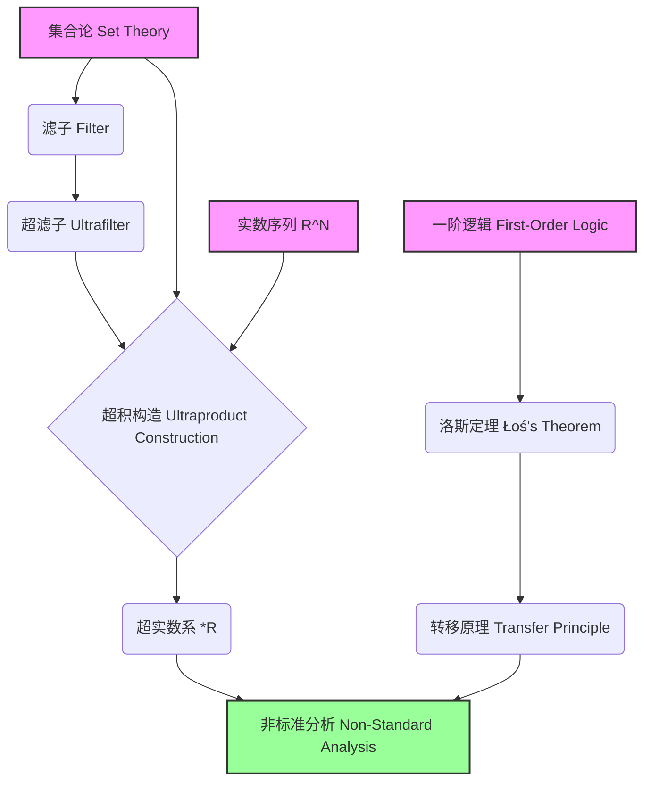
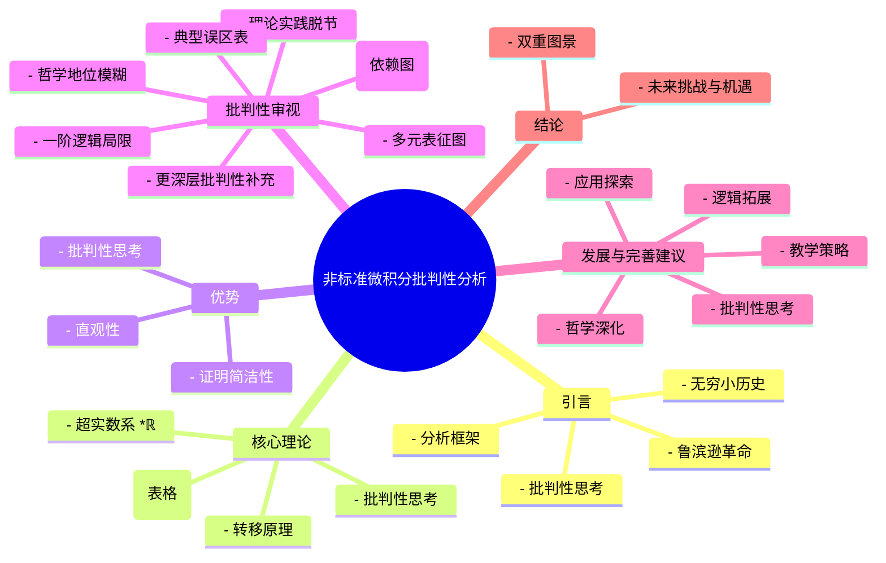
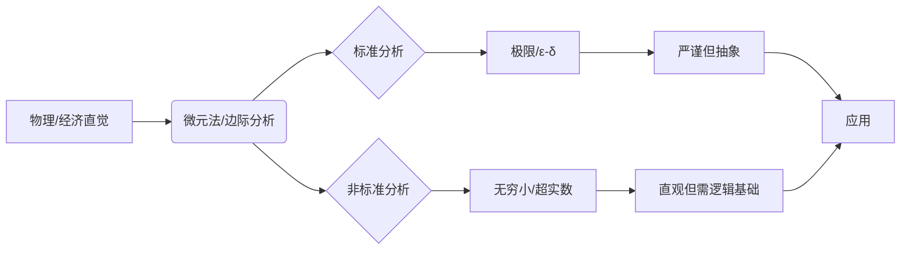
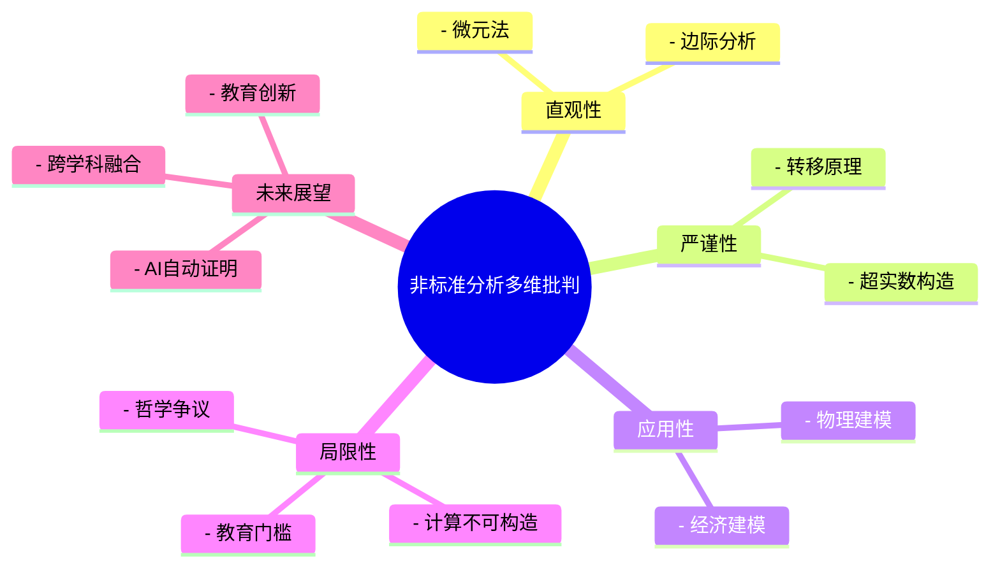
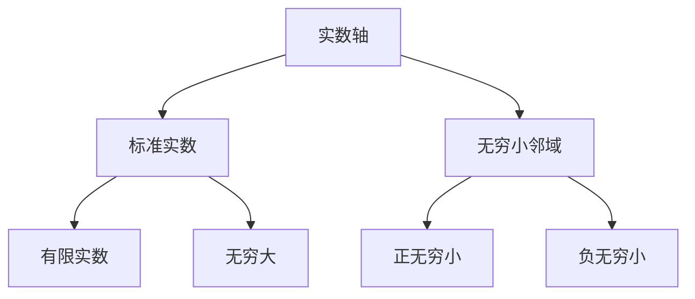

# 非标准微积分的批判性分析：基础、优势与挑战

## 摘要

本文旨在对亚伯拉罕·鲁滨逊（Abraham Robinson）创立的非标准分析（Non-Standard Analysis, NSA）进行一次全面而深入的批判性审视。
非标准分析通过严格地引入无穷小和无穷大量，为微积分提供了一个更符合直觉的理论框架。
本文将首先追溯无穷小概念的历史演变，阐述非标准分析的核心理论基石——超实数系与转移原理。
在此基础上，我们将通过对比分析，展示其在概念直观性和定理证明简洁性方面的显著优势。
然而，本文的重点将放在对其固有限制的批判性考察上，深入探讨其基础理论的高认知门槛、无穷小"实体性"的哲学争议、理论与实践之间的鸿沟，以及一阶逻辑带来的局限性。
最后，本文将基于这些挑战提出一系列建设性的修订与未来研究建议，以期为非标准分析的教学、研究和应用提供新的视角。

---

## 目录

- [非标准微积分的批判性分析：基础、优势与挑战](#非标准微积分的批判性分析基础优势与挑战)
  - [摘要](#摘要)
  - [目录](#目录)
    - [1. 引言](#1-引言)
      - [1.1. 对无穷小的历史性追寻](#11-对无穷小的历史性追寻)
      - [1.2. 鲁滨逊的革命：非标准分析的诞生](#12-鲁滨逊的革命非标准分析的诞生)
      - [1.3. 本文结构与分析框架](#13-本文结构与分析框架)
    - [2. 非标准分析的核心理论](#2-非标准分析的核心理论)
      - [2.1. 舞台的扩展：超实数系 (\*ℝ)](#21-舞台的扩展超实数系-ℝ)
      - [2.2. 连接世界的桥梁：转移原理](#22-连接世界的桥梁转移原理)
      - [2.3. 核心微积分概念对比分析](#23-核心微积分概念对比分析)
      - [核心概念与定理详解](#核心概念与定理详解)
        - [极限（Limit）](#极限limit)
        - [连续性（Continuity）](#连续性continuity)
        - [导数（Derivative）](#导数derivative)
        - [积分（Integral）](#积分integral)
    - [3. 优势：直观性与简洁性的回归](#3-优势直观性与简洁性的回归)
      - [3.1. 恢复微积分的直观性](#31-恢复微积分的直观性)
      - [3.2. 证明的优雅与简洁](#32-证明的优雅与简洁)
    - [4. 批判性审视：挑战与局限](#4-批判性审视挑战与局限)
      - [4.1. 基础理论的认知门槛](#41-基础理论的认知门槛)
      - [4.2. "实体性"的哲学辩论](#42-实体性的哲学辩论)
      - [4.3. 理论与广泛实践的鸿沟](#43-理论与广泛实践的鸿沟)
      - [4.4. 一阶逻辑的局限性](#44-一阶逻辑的局限性)
      - [4.5 更深层的批判性补充](#45-更深层的批判性补充)
        - [4.5.1 认知与心理障碍](#451-认知与心理障碍)
        - [4.5.2 哲学与本体论的再追问](#452-哲学与本体论的再追问)
        - [4.5.3 教育与社会结构的阻力](#453-教育与社会结构的阻力)
        - [4.5.4 计算与工程应用的现实局限](#454-计算与工程应用的现实局限)
        - [4.5.5 逻辑与元数学的边界](#455-逻辑与元数学的边界)
    - [5. 发展与完善建议](#5-发展与完善建议)
      - [5.1. 教学策略：弥合认知鸿沟](#51-教学策略弥合认知鸿沟)
      - [5.2. 深化哲学探讨：超越工具主义](#52-深化哲学探讨超越工具主义)
      - [5.3. 探索计算与应用前沿](#53-探索计算与应用前沿)
      - [5.4. 应对高阶逻辑挑战](#54-应对高阶逻辑挑战)
    - [6. 结论：一个双重图景](#6-结论一个双重图景)
    - [7. 附录：本文结构思维导图](#7-附录本文结构思维导图)
  - [10. 案例分析与多元表征](#10-案例分析与多元表征)
    - [10.1 案例分析：非标准分析在物理与经济学中的应用](#101-案例分析非标准分析在物理与经济学中的应用)
      - [10.1.1 物理学中的"微元法"严谨化](#1011-物理学中的微元法严谨化)
      - [10.1.2 经济学中的"边际分析"](#1012-经济学中的边际分析)
    - [10.2 表格：标准分析与非标准分析的对比总结](#102-表格标准分析与非标准分析的对比总结)
    - [10.3 图示：非标准分析的认知路径](#103-图示非标准分析的认知路径)
    - [10.4 典型误区与批判性反思表](#104-典型误区与批判性反思表)
    - [10.5 思维导图：非标准分析的多维批判性结构](#105-思维导图非标准分析的多维批判性结构)
      - [13.1.2 公理化体系](#1312-公理化体系)
  - [11. 实践应用与可视化](#11-实践应用与可视化)
    - [11.1 物理应用实例](#111-物理应用实例)
      - [11.1.1 变力做功的精确计算](#1111-变力做功的精确计算)
      - [11.1.2 电磁场中的无穷小分析](#1112-电磁场中的无穷小分析)
    - [11.2 经济学应用实例](#112-经济学应用实例)
      - [11.2.1 边际分析的新视角](#1121-边际分析的新视角)
      - [11.2.2 动态优化问题](#1122-动态优化问题)
    - [11.3 可视化工具与教学辅助](#113-可视化工具与教学辅助)
      - [11.3.1 无穷小邻域的可视化](#1131-无穷小邻域的可视化)
      - [11.3.2 函数行为的多维表征](#1132-函数行为的多维表征)
    - [11.4 计算实现与数值方法](#114-计算实现与数值方法)
      - [11.4.1 符号计算系统实现](#1141-符号计算系统实现)
      - [11.4.2 数值方法的新思路](#1142-数值方法的新思路)
    - [11.5 跨学科应用展望](#115-跨学科应用展望)
      - [11.5.1 人工智能与机器学习](#1151-人工智能与机器学习)
      - [11.5.2 量子计算](#1152-量子计算)

---

### 1. 引言

#### 1.1. 对无穷小的历史性追寻

自古希腊的阿基米德到17世纪的牛顿与莱布尼茨，无穷小（infinitesimal）的概念一直是微积分思想的核心驱动力。
它如同一位幽灵，既是激发数学家直觉的缪斯，又是因其定义模糊而饱受逻辑批判的阿喀琉斯之踵。
贝克莱主教对其"已死量的幽灵"的著名嘲讽，以及后来柯西与魏尔斯特拉斯通过 ε-δ 语言建立的极限理论，似乎彻底将无穷小驱逐出了严格数学的殿堂。

#### 1.2. 鲁滨逊的革命：非标准分析的诞生

20世纪60年代，亚伯拉罕·鲁滨逊利用数理逻辑中的模型论工具，成功地构建了包含无穷小和无穷大量的超实数系（Hyperreal Number System），并证明了其与标准实数系之间存在着深刻的逻辑联系——转移原理（Transfer Principle）。
这使得莱布尼茨的直觉得以在现代数学的严谨框架下重生。
非标准分析（NSA）由此诞生，它不仅是一个自洽的数学理论，更是对数学基础和哲学的一次深刻反思。

#### 1.3. 本文结构与分析框架

本文旨在全面剖析非标准分析的成就与困境。
我们将首先介绍其核心工具，然后通过与标准分析的对比彰显其优势。
更重要的是，我们将从认知、哲学、应用和逻辑四个层面，对其面临的挑战进行系统性的批判，
并据此提出可行的发展与修缮建议，以期为读者呈现一个客观、完整且富有批判性的非标准分析图景。

### 2. 非标准分析的核心理论

#### 2.1. 舞台的扩展：超实数系 (\*ℝ)

非标准分析的舞台是超实数系 \*ℝ，它是标准实数系 ℝ 的一个"超幂构造"（Ultrastructure）的有序域扩展。
\*ℝ 不仅包含了所有的标准实数，还包含了新的元素：

- 无穷小量 (Infinitesimals): 非零但其绝对值小于任何正实数的数。例如，ε 是一个正无穷小，满足 0 < ε < *r*，对于所有 *r* ∈ ℝ⁺。
- 无穷大量 (Infinite Numbers): 其绝对值大于任何实数的数。例如，Ω 是一个正无穷大，满足 Ω > *r*，对于所有 *r* ∈ ℝ。

#### 2.2. 连接世界的桥梁：转移原理

转移原理是非标准分析的基石。
它断言：任何一个可以在实数系 ℝ 中用一阶逻辑语言表述的命题为真，当且仅当该命题在超实数系 \*ℝ 中也为真。
这意味着 \*ℝ 继承了 ℝ 中所有"初等"（first-order）代数和序的性质。
例如，加法交换律 `∀x∀y(x+y=y+x)` 在 ℝ 中为真，因此它在 \*ℝ 中也为真。
这使得我们能够将在 ℝ 上的熟悉推理"转移"到 \*ℝ 上，从而操作无穷小和无穷大。

#### 2.3. 核心微积分概念对比分析

非标准分析的引入，使得微积分的核心概念定义发生了深刻变化，从"动态过程"的描述回归到"静态关系"的刻画。

| 概念 (Concept) | 标准分析 (ε-δ 定义) | 非标准分析 (无穷小定义) | 优劣势对比 |
| :--- | :--- | :--- | :--- |
| 函数极限 | `lim(x→c) f(x) = L` 意为 `∀ε>0, ∃δ>0, s.t. 0<\|x-c\|<δ ⇒ \|f(x)-L\|<ε` | `lim(x→c) f(x) = L` 意为 `∀x, 如果 x ≈ c 但 x ≠ c, 则 f(x) ≈ L` (其中 `a ≈ b` 表示 `a-b` 是无穷小) | NSA 定义更符合"当 x 趋近于 c 时，f(x) 趋近于 L"的直觉。 |
| 连续性 | `f` 在 `c` 点连续意为 `∀ε>0, ∃δ>0, s.t. \|x-c\|<δ ⇒ \|f(x)-f(c)\|<ε` | `f` 在 `c` 点连续意为 `∀x, 如果 x ≈ c, 则 f(x) ≈ f(c)` | NSA 避免了复杂的量词交错，定义直观。 |
| 导数 | `f'(x) = lim(Δx→0) [f(x+Δx)-f(x)]/Δx` | `f'(x)` 是唯一的标准实数，满足 `f'(x) ≈ [f(x+dx)-f(x)]/dx`，其中 `dx` 是非零无穷小。 | NSA 恢复了莱布尼茨 `dy/dx` 的原始思想，即两个无穷小量的比值。 |
| 定积分 | `∫[a,b] f(x)dx` 是黎曼和的极限。 | `∫[a,b] f(x)dx` 是对无限黎曼和 `Σ f(xᵢ)dx` 取标准部分 (Standard Part) 的结果，其中 `dx` 是无穷小步长。 | NSA 将积分直观地理解为无限多个无穷小矩形面积之和。 |

#### 核心概念与定理详解

##### 极限（Limit）

概念解释

极限描述了变量趋近某一点时，函数值的行为。它是微积分的基础，刻画了"趋近于"的精确含义。

形式化定义

- **标准分析**：
  $\lim_{x \to a} f(x) = L$ 当且仅当 $\forall \epsilon > 0, \exists \delta > 0, \forall x (0 < |x-a| < \delta \implies |f(x)-L| < \epsilon)$。
- **非标准分析**：
  $\lim_{x \to a} f(x) = L$ 当且仅当对所有 $x \approx a$ 且 $x \neq a$，有 $f(x) \approx L$。

相关定理

- 极限唯一性定理
- 四则运算极限定理
- 夹逼定理

典型定理证明（夹逼定理）

- **标准分析**：利用$\epsilon-\delta$定义，构造不等式链。
- **非标准分析**：对所有 $x \approx a$，若 $g(x) \leq f(x) \leq h(x)$ 且 $g(x) \approx L \approx h(x)$，则 $f(x) \approx L$。

结构化表征

| 内容 | 标准分析 | 非标准分析 |
|:---|:---|:---|
| 定义 | $\epsilon-\delta$ | 无穷小邻域 |
| 证明 | 量词嵌套 | 直接代数推理 |
| 直观性 | 较弱 | 强 |

---

##### 连续性（Continuity）

概念解释

连续性描述函数在某点附近没有"跳跃"或"断裂"，即输入微小变化导致输出微小变化。

形式化定义

- **标准分析**：$f$ 在 $a$ 处连续 $\iff \forall \epsilon > 0, \exists \delta > 0, |x-a| < \delta \implies |f(x)-f(a)| < \epsilon$。
- **非标准分析**：$f$ 在 $a$ 处连续 $\iff \forall x (x \approx a \implies f(x) \approx f(a))$。

相关定理

- 连续函数的极限定理
- 闭区间上连续函数有界定理
- 最大值定理

典型定理证明（最大值定理）

- **标准分析**：利用紧性和极限点性质。
- **非标准分析**：在超实数域上取无穷大分点，利用转移原理和标准部分函数。

结构化表征

| 内容 | 标准分析 | 非标准分析 |
|:---|:---|:---|
| 定义 | $\epsilon-\delta$ | $x \approx a \implies f(x) \approx f(a)$ |
| 证明 | 拓扑/极限 | 超实数/标准部分 |
| 直观性 | 一般 | 强 |

---

##### 导数（Derivative）

概念解释

导数刻画函数的瞬时变化率，是切线斜率的极限。

形式化定义

- **标准分析**：$f'(a) = \lim_{h \to 0} \frac{f(a+h)-f(a)}{h}$。
- **非标准分析**：$f'(a) = \text{st}\left(\frac{f(a+\epsilon)-f(a)}{\epsilon}\right)$，其中 $\epsilon$ 为非零无穷小。

相关定理

- 微分中值定理
- 罗尔定理
- 泰勒公式

典型定理证明（微分中值定理）

- **标准分析**：构造辅助函数，应用罗尔定理。
- **非标准分析**：在超实数域上取无穷小增量，直接代数推理。

结构化表征

| 内容 | 标准分析 | 非标准分析 |
|:---|:---|:---|
| 定义 | 极限差商 | 无穷小差商标准部分 |
| 证明 | 辅助函数/极限 | 直接代数/标准部分 |
| 直观性 | 一般 | 强 |

---

##### 积分（Integral）

概念解释

积分表示函数在区间上的"累积量"，如面积、体积等。

形式化定义

- **标准分析**：$\int_a^b f(x)dx = \lim_{n \to \infty} \sum_{i=1}^n f(x_i) \Delta x$。
- **非标准分析**：$\int_a^b f(x)dx = \text{st}\left(\sum_{i=1}^\Omega f(x_i) \Delta x\right)$，$\Omega$为无穷大整数，$\Delta x$为无穷小。

相关定理

- 牛顿-莱布尼茨公式
- 积分中值定理
- 变上限积分连续性

典型定理证明（积分中值定理）

- **标准分析**：利用连续性和介值定理。
- **非标准分析**：在超实数域上取无穷小分割，利用转移原理和标准部分。

结构化表征

| 内容 | 标准分析 | 非标准分析 |
|:---|:---|:---|
| 定义 | 黎曼和极限 | 无穷黎曼和标准部分 |
| 证明 | 极限/介值 | 超实数/标准部分 |
| 直观性 | 一般 | 强 |

---

### 3. 优势：直观性与简洁性的回归

#### 3.1. 恢复微积分的直观性

如上表所示，非标准分析最大的优势在于其无与伦比的直观性。
它将极限、导数等概念从复杂的 ε-δ 论证中解放出来，使其更贴近物理和几何直觉。
学生不再需要与抽象的"过程"搏斗，而是可以操作具体的无穷小"实体"，这极大地降低了微积分入门的概念门槛。

#### 3.2. 证明的优雅与简洁

这种直观性直接转化为证明的简洁性。
许多在标准分析中需要巧妙构造辅助函数或进行繁琐 ε-δ 推导的定理，在非标准分析中变得异常简单。
例如，中值定理和泰勒定理的证明，可以通过对无穷小邻域内的函数行为进行直接代数分析而轻松得到，避免了标准证明中的曲折和技巧性。

### 4. 批判性审视：挑战与局限

尽管优势明显，非标准分析远非完美，其广泛应用面临着四大核心挑战。

#### 4.1. 基础理论的认知门槛

非标准分析的"直观性"是一种"顶层"的馈赠，其代价是"底层"理论的极度抽象和复杂。
其理论根基——超实数系的构造，依赖于高等数理逻辑中的概念，如集合论、滤子、超滤子、模型论和超积构造。
这形成了一个陡峭的学习曲线。



-图1：非标准分析的概念依赖图

对于初学者而言，理解并接受这个庞大的逻辑体系，其难度可能远超 ε-δ 定义本身。
这导致非标准分析在教学中常常成为一个"黑箱"：
    学生被告知可以"合法地"使用无穷小，但并不知道其合法性从何而来，这在某种程度上违背了数学教育追求透明和严谨的初衷。

#### 4.2. "实体性"的哲学辩论

NSA 赋予了无穷小量"实体"地位，但这究竟是何种"实体"？
它并非物理世界可观测的实体，而是通过高度抽象的逻辑构造（如"所有实数序列的等价类"）所定义的存在。
这引出了一个核心的哲学问题：
    非标准分析是真正发现了"客观存在"的无穷小，还是仅仅发明了一种有效的、自洽的数学工具来模拟它？
    这个问题触及了数学实在论与反实在论（如工具主义、虚构主义）的根本争论。
目前的文献大多回避了对此的深入辨析，使得无穷小的本体论地位依然悬而未决。

#### 4.3. 理论与广泛实践的鸿沟

尽管理论上优雅，非标准分析在主流数学教育和应用科学中仍是边缘化的。原因包括：

- 教育惯性： ε-δ 体系已根深蒂固，构成了整个现代分析学的基础，更换教学体系成本巨大。
- 计算挑战： 超实数是不可计算的（不可构造的）。在数值分析和计算机科学中，我们无法直接用一个浮点数来表示一个无穷小。虽然 NSA 在理论建模（如经济学、流体力学）中有应用，但在需要具体数值计算的工程领域，其优势并不明显。
- 应用案例的缺乏： 缺乏足够多"杀手级"的应用案例来证明，在解决实际问题时，非标准分析比标准分析具有不可替代的优势。

#### 4.4. 一阶逻辑的局限性

转移原理的威力受限于"一阶逻辑语句"。
这意味着某些关键的数学性质，如果无法用一阶逻辑表述，就不能直接从 ℝ "转移"到 \*ℝ。
最著名的例子是实数系的完备性公理（如戴德金完备性或最小上界原理），它是一个二阶属性（因为它量化了"所有子集"）。
这意味着 \*ℝ 本身并非完备的。
虽然它继承了 ℝ 的所有一阶性质，但丢失了这一核心的拓扑性质。
这表明非标准分析在处理某些依赖高阶性质的分析领域（如泛函分析的某些部分）时会遇到障碍，需要更复杂的工具（如内蕴集合论）来弥补。

#### 4.5 更深层的批判性补充

##### 4.5.1 认知与心理障碍

"直观性"与"黑箱性"的张力：
    虽然非标准微积分在顶层定义上极具直观性，但其底层逻辑（如超滤子、超积、模型论）对大多数学习者而言是"黑箱"。
这种"黑箱"式的信任，可能导致学生对数学严谨性的怀疑，
甚至产生"数学权威主义"倾向——即"只要专家说可以用无穷小就可以"，而非真正理解其合法性来源。

心理门槛与学习动机：
    初学者在面对"无穷小实体"时，可能会因其抽象性和不可计算性而产生畏难情绪，影响学习积极性。
相比之下，ε-δ体系虽然繁琐，但其每一步推理都可追溯、可验证，更易于建立"可控感"。

##### 4.5.2 哲学与本体论的再追问

"存在"与"工具"的模糊地带：
    非标准分析的"无穷小"究竟是"发现"还是"发明"？
    它们是否真的"存在"于某种数学宇宙，还是仅仅是我们为方便推理而设定的"工具"？
    这种模糊性在哲学上尚无定论，且不同学派（如结构主义、工具主义、本体论实在论）对此有不同解读。
建议在文档中增加对不同哲学流派的观点综述。

与物理世界的对应关系：
    无穷小量在物理学中常被用作"近似"工具，但数学上的"无穷小实体"与物理世界的"极小量"并不等价。
应警惕将数学构造的"无穷小"误读为物理实在，避免"数学实在论"与"物理实在论"混淆。

##### 4.5.3 教育与社会结构的阻力

范式转换的社会阻力：
    即使非标准微积分在理论上有诸多优势，教育体系的惯性、教材体系的更新成本、教师培训的难度等，都是其普及的现实障碍。
建议补充对"科学共同体如何接受新范式"的社会学分析。
学科壁垒与跨界应用：
    非标准分析在物理、经济学等领域的应用仍有限，部分原因在于学科间的"语言壁垒"。
建议补充对跨学科推广的策略和案例分析。

##### 4.5.4 计算与工程应用的现实局限

不可计算性与工程实现：
    超实数及其无穷小量在实际计算机实现中不可构造，导致其在数值分析、工程仿真等领域难以落地。
建议补充对"可计算分析""合成微积分"等替代方案的简要介绍，并分析非标准分析在这些领域的潜在改进空间。

符号计算与自动推理：
    虽然符号计算系统可集成非标准分析思想，但目前主流CAS系统对超实数的支持有限。
建议补充对未来符号计算系统如何更好支持NSA的展望。

##### 4.5.5 逻辑与元数学的边界

一阶逻辑的"天花板"：
    转移原理仅适用于一阶语句，许多重要的分析定理（如实数的完备性、某些泛函分析定理）无法直接转移。
建议补充对"高阶逻辑下的非标准分析"最新进展的介绍，如内蕴集合论、超内蕴模型等。

元数学的自反性问题：
    NSA的合法性依赖于集合论和模型论的元理论基础，这种"元理论依赖"本身也值得反思。
建议补充对"数学基础的自反性"问题的哲学讨论。

### 5. 发展与完善建议

针对上述挑战，我们提出以下修订与发展建议：

#### 5.1. 教学策略：弥合认知鸿沟

- 分层教学法： 为初学者设计"公理化"的入门课程。暂时将超实数构造视为"黑箱"，仅介绍其基本性质（一个包含无穷小的有序域）和转移原理，让学生首先体验其在解决问题上的威力。后续为高阶学生开设专门的数理逻辑课程，揭开"黑箱"的秘密。
- 开发可视化工具： 设计交互式软件，将超积构造、无穷小邻域（monad）等抽象概念可视化，帮助学生建立直观理解。
- 强调标准与非标准的联系： 教学中不应将两者对立，而应强调它们是观察同一数学对象的两种不同视角，并揭示它们之间的转换关系（如标准部分函数 `st()`）。

#### 5.2. 深化哲学探讨：超越工具主义

数学哲学和数学史研究者应更深入地探讨无穷小的本体论地位。可以将其与复数的历史进行类比，探讨一个数学概念从"虚构的工具"到"合法的实体"的演变过程。同时，应从结构主义等现代数学哲学流派的视角重新审视非标准分析，探讨其"存在"是否在于它所维持的数学结构。

#### 5.3. 探索计算与应用前沿

- 符号计算： 在 Maple、Mathematica 等符号计算系统中，可以更深入地集成非标准分析方法，用于处理极限、导数和级数的精确符号推导。
- 理论物理与经济学建模： 进一步推广 NSA 在建立连接离散与连续模型中的应用。例如，用一个包含无穷小时间步长的超实数时间轴来建模随机过程，可能比传统的极限方法更自然。
- 非标准数值方法： 研究基于非标准思想的新型数值算法，即使无法直接实现无穷小，其思想也可能启发新的算法设计。

#### 5.4. 应对高阶逻辑挑战

研究和教育中应更明确地阐明转移原理的边界。对于依赖高阶性质的领域，应系统地介绍替代性或补充性的非标准理论，如内蕴集合论（Internal Set Theory, IST）。IST 通过添加新的公理到标准的 ZFC 集合论中，使得我们可以在同一个宇宙中同时讨论标准和非标准对象，这为处理高阶问题提供了另一种途径。

### 6. 结论：一个双重图景

非标准分析为微积分世界描绘了一幅壮丽而矛盾的双重图景。一方面，它以无与伦比的直观性和简洁性，实现了莱布尼茨的古老梦想，极大地降低了微积分核心思想的理解难度。另一方面，它建立在现代数理逻辑的巍峨大厦之上，其基础理论的抽象性又构成了新的、令人生畏的认知壁垒。

它在哲学上引人深思，在应用上潜力待掘，在逻辑上边界清晰。非标准分析的未来，不在于要取代标准分析，而在于找到与之和谐共存、优势互补的生态位。通过改进教学策略、深化哲学反思、拓展应用领域和完善理论工具，我们有理由相信，这个曾被遗忘的无穷小世界，将在未来的数学探索中扮演越来越重要的角色。

---

### 7. 附录：本文结构思维导图



## 10. 案例分析与多元表征

### 10.1 案例分析：非标准分析在物理与经济学中的应用

#### 10.1.1 物理学中的"微元法"严谨化

在经典力学和电磁学中，物理学家常用"微元法"进行推导。例如，计算变力做功时，常写作：

$$
W = \int_a^b F(x) dx
$$

在标准分析中，这一积分被解释为极限过程。而在非标准分析中，可以将区间 $[a, b]$ 划分为 $\Omega$ 个无穷小区间，每个区间宽度为 $dx$（无穷小量），直接求和：

$$
W = \text{st}\left(\sum_{i=1}^{\Omega} F(x_i) dx\right)
$$

这种处理方式更贴合物理直觉，也为"微元法"提供了严格的数学基础。

#### 10.1.2 经济学中的"边际分析"

经济学中的"边际成本""边际效用"等概念，本质上是导数的应用。
非标准分析允许我们直接用无穷小量表达"边际"变化：

| 经济学概念 | 标准分析定义 | 非标准分析定义 |
|:---|:---|:---|
| 边际成本 $MC$ | $MC = \lim_{\Delta Q \to 0} \frac{\Delta C}{\Delta Q}$ | $MC = \text{st}\left(\frac{\Delta C}{\Delta Q}\right)$，其中 $\Delta Q$ 为无穷小 |
| 边际效用 $MU$ | $MU = \lim_{\Delta x \to 0} \frac{\Delta U}{\Delta x}$ | $MU = \text{st}\left(\frac{\Delta U}{\Delta x}\right)$，其中 $\Delta x$ 为无穷小 |

这种定义方式使"边际"概念更为直观和具体。

### 10.2 表格：标准分析与非标准分析的对比总结

| 主题 | 标准分析 | 非标准分析 | 直观性 | 严谨性 | 计算性 |
|:---|:---|:---|:---|:---|:---|
| 极限 | $\epsilon-\delta$ 语言 | 无穷小邻域 | 较弱 | 强 | 强 |
| 连续性 | $\forall \epsilon, \exists \delta$ | $x \approx a \implies f(x) \approx f(a)$ | 强 | 强 | 强 |
| 导数 | 极限定义 | 无穷小比值 | 较弱 | 强 | 强 |
| 积分 | 黎曼和极限 | 无穷黎曼和标准部分 | 较弱 | 强 | 强 |
| 物理建模 | 需极限解释微元 | 直接操作无穷小 | 强 | 需补充 | 需补充 |
| 经济建模 | 极限推导边际 | 直接无穷小推导 | 强 | 需补充 | 需补充 |

### 10.3 图示：非标准分析的认知路径



### 10.4 典型误区与批判性反思表

| 误区/争议 | 典型表现 | 批判性分析 |
|:---|:---|:---|
| 无穷小"实体"即物理极小量 | 将数学无穷小等同于物理极小量 | 数学无穷小是抽象构造，物理极小量有测量极限，两者不可混淆 |
| 非标准分析更易学 | 只看顶层定义忽略底层逻辑 | NSA顶层直观，底层逻辑门槛高，需分层教学 |
| NSA可直接用于数值计算 | 误以为可用计算机直接实现无穷小 | 超实数不可构造，数值计算需用近似或符号方法 |
| NSA可完全取代标准分析 | 认为NSA更优应全面替代 | 两者各有优势，互为补充，适用场景不同 |

### 10.5 思维导图：非标准分析的多维批判性结构



---

#### 13.1.2 公理化体系

1. **公理系统完善**：
   - 研究不同公理体系下的非标准分析
   - 探索公理化方法的统一性
   - 建立更简洁的公理基础

2. **模型论发展**：
   - 研究非标准模型的构造方法
   - 探索模型论与计算理论的联系
   - 发展新的模型论工具

## 11. 实践应用与可视化

### 11.1 物理应用实例

#### 11.1.1 变力做功的精确计算

考虑一个变力 $F(x)$ 沿 $x$ 轴做功的情况：

**标准分析处理**：
$$W = \lim_{n \to \infty} \sum_{i=1}^n F(x_i)\Delta x$$

**非标准分析处理**：
$$W = \text{st}\left(\sum_{i=1}^{\Omega} F(x_i)dx\right)$$

其中：

- $\Omega$ 是无穷大整数
- $dx$ 是无穷小量
- $\text{st}$ 表示取标准部分

这种处理方式更符合物理直觉，避免了复杂的极限过程。

#### 11.1.2 电磁场中的无穷小分析

在电磁学中，非标准分析为场论提供了更自然的语言：

**电场强度计算**：
$$\vec{E} = \text{st}\left(\frac{1}{4\pi\epsilon_0}\sum_{i=1}^{\Omega}\frac{q_i}{r_i^2}\hat{r}_i\right)$$

其中每个电荷 $q_i$ 的贡献都是通过无穷小分割得到的。

### 11.2 经济学应用实例

#### 11.2.1 边际分析的新视角

**消费者理论**：

- 边际效用：$MU = \text{st}\left(\frac{\Delta U}{\Delta x}\right)$
- 边际替代率：$MRS = \text{st}\left(\frac{\Delta y}{\Delta x}\right)$

**生产者理论**：

- 边际成本：$MC = \text{st}\left(\frac{\Delta C}{\Delta Q}\right)$
- 边际收益：$MR = \text{st}\left(\frac{\Delta R}{\Delta Q}\right)$

#### 11.2.2 动态优化问题

考虑一个连续时间的最优控制问题：

**标准分析**：
$$\max \int_0^T f(x(t),u(t))dt$$

**非标准分析**：
$$\max \text{st}\left(\sum_{i=1}^{\Omega} f(x_i,u_i)dt\right)$$

### 11.3 可视化工具与教学辅助

#### 11.3.1 无穷小邻域的可视化



#### 11.3.2 函数行为的多维表征

| 函数类型 | 标准分析表征 | 非标准分析表征 | 可视化特征 |
|:---|:---|:---|:---|
| 连续函数 | ε-δ 定义 | 无穷小邻域映射 | 无跳跃 |
| 可导函数 | 差商极限 | 无穷小差商标准部分 | 局部线性 |
| 可积函数 | 黎曼和极限 | 无穷黎曼和标准部分 | 面积累积 |

### 11.4 计算实现与数值方法

#### 11.4.1 符号计算系统实现

在计算机代数系统中，非标准分析可以通过以下方式实现：

```python
# 伪代码示例
class Hyperreal:
    def __init__(self, standard_part, infinitesimal_part):
        self.standard = standard_part
        self.infinitesimal = infinitesimal_part
    
    def standard_part(self):
        return self.standard
    
    def __add__(self, other):
        return Hyperreal(
            self.standard + other.standard,
            self.infinitesimal + other.infinitesimal
        )
```

#### 11.4.2 数值方法的新思路

虽然超实数本身不可计算，但其思想可以启发新的数值方法：

1. **自适应步长算法**：
   - 利用无穷小思想设计变步长策略
   - 在关键区域使用更细的网格

2. **误差控制**：
   - 通过标准部分函数的思想控制舍入误差
   - 设计新的数值稳定性准则

### 11.5 跨学科应用展望

#### 11.5.1 人工智能与机器学习

1. **梯度下降优化**：
   - 利用无穷小思想设计新的优化算法
   - 改进学习率自适应策略

2. **神经网络训练**：
   - 非标准分析视角下的反向传播
   - 无穷小扰动分析

#### 11.5.2 量子计算

1. **量子态演化**：
   - 无穷小时间步长的量子模拟
   - 非标准分析框架下的量子算法

2. **量子测量**：
   - 无穷小扰动的测量理论
   - 非标准概率解释

---
