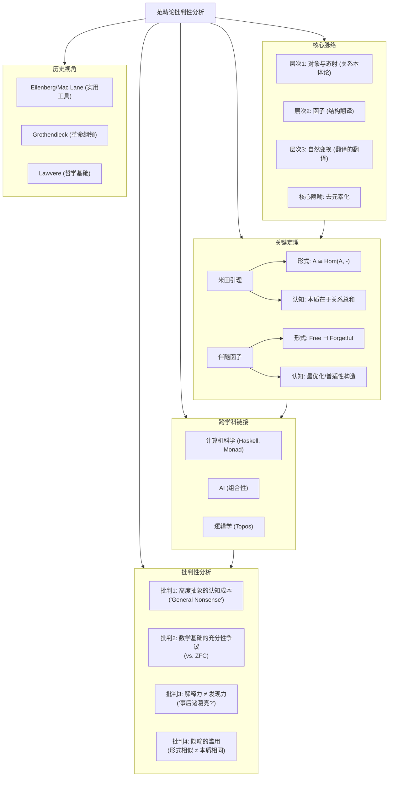

# 范畴论的批判性分析：结构、认知与局限

## 目录

- [范畴论的批判性分析：结构、认知与局限](#范畴论的批判性分析结构认知与局限)
  - [目录](#目录)
  - [1. 引言：作为“元数学”的范畴论](#1-引言作为元数学的范畴论)
    - [1.1. 什么是范畴论？超越“对象”的数学](#11-什么是范畴论超越对象的数学)
    - [1.2. 本文的分析视角：非辩证的批判性审视](#12-本文的分析视角非辩证的批判性审视)
  - [2. 核心脉络：范畴论的思维层次与隐喻](#2-核心脉络范畴论的思维层次与隐喻)
    - [2.1. 层次一：对象 (Objects) 与态射 (Morphisms) - 关系的本体论](#21-层次一对象-objects-与态射-morphisms---关系的本体论)
    - [2.2. 层次二：函子 (Functors) - 结构之间的“翻译官”](#22-层次二函子-functors---结构之间的翻译官)
    - [2.3. 层次三：自然变换 (Natural Transformations) - “翻译”之间的“翻译官”](#23-层次三自然变换-natural-transformations---翻译之间的翻译官)
    - [2.4. 核心隐喻：“代数化”与“去元素化”](#24-核心隐喻代数化与去元素化)
  - [3. 关键定理的诠释：形式证明与认知关联](#3-关键定理的诠释形式证明与认知关联)
    - [3.1. **米田引理 (Yoneda Lemma)**：对象的本质在于其“关系总和”](#31-米田引理-yoneda-lemma对象的本质在于其关系总和)
      - [3.1.1. 形式化表述的直觉](#311-形式化表述的直觉)
      - [3.1.2. 认知关联：我们如何通过互动来定义事物？](#312-认知关联我们如何通过互动来定义事物)
    - [3.2. **伴随函子 (Adjoint Functors)**：最优化与普适性的形式化](#32-伴随函子-adjoint-functors最优化与普适性的形式化)
      - [3.2.1. “自由构造”与“遗忘”的对偶](#321-自由构造与遗忘的对偶)
      - [3.2.2. 认知关联：在约束下寻找“最有效”的解决方案](#322-认知关联在约束下寻找最有效的解决方案)
  - [4. 历史人物的视角解读](#4-历史人物的视角解读)
    - [4.1. **Eilenberg \& Mac Lane**：从代数拓扑中诞生的实用工具](#41-eilenberg--mac-lane从代数拓扑中诞生的实用工具)
    - [4.2. **Grothendieck**：重建代数几何的宏大纲领 (Topos理论的起源)](#42-grothendieck重建代数几何的宏大纲领-topos理论的起源)
    - [4.3. **Lawvere**：作为数学基础的激进哲学 (ETCS)](#43-lawvere作为数学基础的激进哲学-etcs)
  - [5. 跨学科链接：统一语言的价值与风险](#5-跨学科链接统一语言的价值与风险)
    - [5.1. **计算机科学**：类型论、函数式编程 (Haskell) 与 Monad](#51-计算机科学类型论函数式编程-haskell-与-monad)
    - [5.2. **信息科学与AI**：组合性 (Compositionality) 与模块化设计的理论保证](#52-信息科学与ai组合性-compositionality-与模块化设计的理论保证)
    - [5.3. **形式科学与逻辑**：从直觉主义逻辑到 Topos 理论](#53-形式科学与逻辑从直觉主义逻辑到-topos-理论)
    - [5.4. **与其他元理论的关系**：结构主义的终极表达？](#54-与其他元理论的关系结构主义的终极表达)
  - [6. 批判性分析：力量的代价](#6-批判性分析力量的代价)
    - [6.1. **批判点一：高度抽象的认知成本**](#61-批判点一高度抽象的认知成本)
    - [6.2. **批判点二：作为基础的充分性争议**](#62-批判点二作为基础的充分性争议)
    - [6.3. **批判点三：解释力不等于发现力**](#63-批判点三解释力不等于发现力)
    - [6.4. **批判点四：隐喻的滥用与误导**](#64-批判点四隐喻的滥用与误导)
  - [7. 结论：作为“结构透镜”的范畴论](#7-结论作为结构透镜的范畴论)
  - [8. 思维导图](#8-思维导图)

---

## 1. 引言：作为“元数学”的范畴论

### 1.1. 什么是范畴论？超越“对象”的数学

传统数学（如集合论）的根基在于“元素”和“集合”——首先定义对象，再研究对象之间的关系（函数、运算等）。范畴论则进行了一次深刻的哲学转向：**它主张“关系”（态射，Morphism）比“对象”（Object）更为根本**。一个对象是什么，完全由它与其它所有对象之间的关系网络所定义。

这种视角使得范畴论成为一种研究“结构”本身的语言，一门“数学的数学”（meta-mathematics）。它不关心一个集合里有什么样的元素，或者一个空间里有什么样的点，它只关心在不同数学结构（群、环、拓扑空间、偏序集）之间是否存在着保持结构的“映射”（函子），以及这些“映射”之间是否存在着一致性的“变换”（自然变换）。

### 1.2. 本文的分析视角：非辩证的批判性审视

本文将避免采用“正题-反题-合题”的辩证法技巧。我们将直接呈现范畴论的内在逻辑、思维层次和力量所在，同时，也直接地、并列地展示针对其的各项严肃批判。分析的重点在于评估其作为一种思维工具的优势、认知成本、适用边界以及被误读的风险，而不是试图将矛盾调和成一个更高阶的统一体。

## 2. 核心脉络：范畴论的思维层次与隐喻

范畴论的思维方式是层层递进的抽象。

### 2.1. 层次一：对象 (Objects) 与态射 (Morphisms) - 关系的本体论

- **脉络**：这是范畴论的基石。一个范畴包含两类东西：对象和态射。关键在于，态射被赋予了本体论的优先地位。我们不需要知道对象“内部”是什么，只需要知道态射如何复合（`g ∘ f`）以及每个对象都有一个单位态射（`id`）。
- **诠释**：这是一种彻底的关系主义视角。例如，在群论中，我们不再关心群`G`的具体元素，而是关心所有群（对象）和它们之间的群同态（态射）所构成的范畴 `Grp`。

### 2.2. 层次二：函子 (Functors) - 结构之间的“翻译官”

- **脉络**：如果范畴是不同的“国家”，那么函子就是“翻译官”。一个函子 `F: C -> D` 将一个范畴 `C` 中的所有对象和态射，系统性地映射到另一个范畴 `D` 中，并保持其结构（即态射的复合与单位态射）。
- **诠释**：函子揭示了不同数学领域之间的深刻联系。例如，拓扑学中的“基本群”就是一个从拓扑空间范畴 `Top` 到群范畴 `Grp` 的函子。它告诉我们，拓扑空间的连续映射关系，可以被“翻译”成群之间的同态关系。

### 2.3. 层次三：自然变换 (Natural Transformations) - “翻译”之间的“翻译官”

- **脉络**：如果我们有两个不同的“翻译官”（函子 `F` 和 `G`），它们都将 `C` 范畴翻译到 `D` 范畴。一个自然变换 `α: F => G` 就是一种一致性的方式，在 `D` 范畴中，将 `F` 的翻译结果“变换”为 `G` 的翻译结果。
- **诠释**：这是范畴论抽象阶梯的顶端，也是其强大力量的来源。它允许我们讨论“过程族”之间的一致性。在计算机科学中，Haskell的 `Monad` 之间的变换（`Monad Transformers`）就是自然变换的体现。

### 2.4. 核心隐喻：“代数化”与“去元素化”

- **代数化**：范畴论的核心操作是“态射的复合”，这是一种代数结构。它将各种数学问题转化为对态射图（Commutative Diagrams）的“代数追逐”（Diagram Chasing）。
- **去元素化**：证明过程尽可能避免提及“一个元素x”，而是通过态射的普适性质（Universal Property）来完成。这使得证明更加通用和抽象。

## 3. 关键定理的诠释：形式证明与认知关联

### 3.1. **米田引理 (Yoneda Lemma)**：对象的本质在于其“关系总和”

#### 3.1.1. 形式化表述的直觉

米田引理的核心思想是：一个范畴 `C` 中的任意对象 `A`，完全由“所有从`A`出发的态射集合”（即函子 `Hom(A, -)`）所刻画。更精确地说，所有从 `Hom(A, -)` 到另一个函子 `F` 的自然变换，与 `F(A)` 中的元素一一对应。这听起来非常抽象，但其推论（Yoneda Embedding）是：**可以将任何（局部小的）范畴 `C` 忠实地嵌入到一个函子范畴中**。

这意味着，我们可以把 `C` 中的对象 `A` 就“看作”是 `Hom(A, -)` 这个函子本身。

#### 3.1.2. 认知关联：我们如何通过互动来定义事物？

米田引理在认知上具有深刻的共鸣。它断言：**一个事物的身份，不是由其内在的、不可见的“本质”决定的，而是由它与周围所有其他事物的可能互动方式的总和所决定的。**

- **例子**：我们如何“认识”一把椅子？不是通过分析其木头分子的构成，而是通过它能“被坐”、能“被移动”、能“支撑物体”等一系列与我们（以及其他对象）的互动关系。椅子的“椅子性”（chair-ness）就是它在我们的生活范畴中所有态射（功能）的总和。
- **关联**：这与现象学、结构主义甚至一些现代物理学的思想不谋而合。它将焦点从“实体是什么”转向“实体做什么”，提供了一种操作主义和关系主义的世界观的形式化模型。

### 3.2. **伴随函子 (Adjoint Functors)**：最优化与普适性的形式化

#### 3.2.1. “自由构造”与“遗忘”的对偶

伴随关系是范畴论中最重要、最普遍的概念之一。一对函子 `F: C -> D` 和 `G: D -> C` 互为伴随，如果 `Hom(F(c), d)` 和 `Hom(c, G(d))` 之间存在自然的同构关系。

- **经典例子**：
  - `G`: 从 `Grp`（群范畴）到 `Set`（集合范畴）的“遗忘函子”，它“忘记”了群的运算结构，只保留其 underlying set。
  - `F`: 从 `Set` 到 `Grp` 的“自由函子”，它为一个集合 `S` 配备了最“自由”、最“没有多余关系”的群结构（自由群）。
- **诠释**：`F` 和 `G` 形成了一种深刻的对偶。`F` 是在满足最少约束的前提下，从一个简单结构（集合）“自由地”生成一个复杂结构（群）。`G` 则是从复杂结构中“遗忘”掉信息，回到简单结构。伴随关系精确地刻画了这种“最优化构造”的过程。

#### 3.2.2. 认知关联：在约束下寻找“最有效”的解决方案

伴随关系是“普适性质”（Universal Property）的一个强有力的表达。它在认知上对应着我们不断在做的一件事：**在给定的约束条件下，寻找一个“最好”或“最经济”的解决方案。**

- **例子**：你想用一堆离散的单词（一个集合）来表达一个有逻辑的句子（一个群或其他代数结构）。“自由函子”对应的认知过程就是，在不添加任何额外语法规则的前提下，将这些单词组合起来能表达的所有可能性的集合。
- **关联**：这种思维模式遍布于工程、经济和日常决策中。伴随函子为这种“优化”与“权衡”的直觉提供了一个极度普适和精确的数学框架。

## 4. 历史人物的视角解读

### 4.1. **Eilenberg & Mac Lane**：从代数拓扑中诞生的实用工具

他们的初衷是务实的。在研究代数拓扑时，他们发现不同理论（如同调论和同伦论）中反复出现相似的结构和证明模式。范畴论是他们为了提炼这些共同模式、统一语言而发明的“簿记工具”。对他们而言，范畴论是服务于具体数学问题的，而不是一个独立的哲学体系。

### 4.2. **Grothendieck**：重建代数几何的宏大纲领 (Topos理论的起源)

Grothendieck 的视角是革命性的和纲领性的。他将范畴论视为重建整个代数几何乃至数学的语言。他发展出的概形（Scheme）理论和后来的 Topos 理论，将范畴论的抽象能力推向了极致。对他而言，正确的抽象层次能让复杂问题迎刃而解。Topos 理论不仅是广义的“空间”，甚至可以看作是广义的“数学宇宙”，每个 Topos 都有其自己内在的逻辑。

### 4.3. **Lawvere**：作为数学基础的激进哲学 (ETCS)

Lawvere 的视角是基础主义和哲学性的。他认为范畴论不仅是工具，更应该取代集合论成为整个数学的基础。他提出的“初等托扑斯范畴论”（ETCS）可以直接公理化，作为集合论的替代品。其哲学核心是：数学的基础应该是关于“变化”与“关系”（态射与复合）的理论，而非关于“静态存在”（元素与集合）的理论。

## 5. 跨学科链接：统一语言的价值与风险

### 5.1. **计算机科学**：类型论、函数式编程 (Haskell) 与 Monad

- **链接**：这是范畴论最成功的应用领域。
  - **类型即对象，函数即态射**：这构成了一个范畴 (Hask)。
  - **Functor**：是可以在容器（如 `List`, `Maybe`）上 `map` 的类型类。
  - **Monad**：被戏称为“自函子范畴中的幺半群”，它为处理副作用（如 I/O）、状态、异常等提供了一个统一的、纯粹的抽象接口。
- **价值**：为程序设计提供了极其强大和可靠的抽象工具，保证了代码的组合性和模块性。
- **风险**：学习曲线陡峭，可能导致过度工程化（Over-engineering）。

### 5.2. **信息科学与AI**：组合性 (Compositionality) 与模块化设计的理论保证

- **链接**：AI，特别是现代深度学习，面临着“组合性”的挑战——如何将小模块（如神经网络层）可靠地组合成大系统？范畴论中的态射复合，为“端到端”的系统组合提供了数学保证。
- **价值**：为构建可验证、可解释的复杂AI系统提供了理论框架。例如，Applied Category Theory (ACT) 社区正在探索用范畴论来建模神经网络、动力系统和数据库。
- **风险**：目前大多停留在理论建模和事后解释，距离指导设计出全新的、性能更优的AI架构还有距离。

### 5.3. **形式科学与逻辑**：从直觉主义逻辑到 Topos 理论

- **链接**：一个 Topos 内部的态射结构，其行为类似于一个逻辑系统。特别是，很多 Topos 的内在逻辑不是经典的布尔逻辑（非真即假），而是直觉主义逻辑（一个命题可以不是真的，但也无法被证伪）。
- **价值**：揭示了逻辑与几何（广义空间）之间令人惊讶的深刻对偶。它为非经典逻辑提供了丰富的语义模型。
- **风险**：极度抽象，远离了大多数逻辑学和计算机科学家的日常实践。

### 5.4. **与其他元理论的关系**：结构主义的终极表达？

范畴论可以被看作是20世纪结构主义思潮（如皮亚杰、布尔巴基学派）在数学上的最纯粹、最成功的表达。它将研究重心完全放在了结构和关系上。

## 6. 批判性分析：力量的代价

### 6.1. **批判点一：高度抽象的认知成本**

- **“泛泛之谈”(General Nonsense) 的指控**：这是早期对范畴论的一个著名嘲讽。它指的是，有时一个范畴论证明只是将一个具体问题翻译成抽象语言，然后通过图表追逐得到一个结论，这个结论虽然正确，但对于理解原问题的“特殊性”毫无帮助。它确认了一个结构，但没有提供新的计算方法或直觉。
- **直觉的丧失与具体问题的疏离**：过度依赖范畴论的语言，可能会让思考者失去对问题领域的“肉感”和“直觉”。当你把所有东西都看作对象和态射时，你可能会忘记拓扑空间的“形状感”，或者群的“对称性”。

### 6.2. **批判点二：作为基础的充分性争议**

- **范畴论 vs. 集合论 (ZFC)：关系本体论 vs. 元素本体论**：ZFC（策梅洛-弗兰克尔集合论）从“元素”和“隶属关系 `∈`”出发，构建了整个现代数学大厦。它符合我们“自下而上”构建事物的直觉。而范畴论的基础（如ETCS）从“对象”和“复合关系 `∘`”出发，是一种“平级”或“自上而下”的视角。
- **ETCS 的优势与挑战**：ETCS 的公理更接近数学家的日常实践（我们总是使用函数复合，而不是检查元素隶属），但它在处理一些集合论的病态构造（如巴拿赫-塔斯基悖论）时显得不那么直接。至今，ZFC 仍然是主流的数学基础，范畴论作为基础的方案仍被视为一种替代性的、未被广泛接受的哲学选择。

### 6.3. **批判点三：解释力不等于发现力**

- **范畴论是“事后诸葛亮”还是“新思想引擎”？**：这是一个核心的批判。范畴论极擅长于统一和解释已有的数学发现，揭示它们背后共同的“骨架”。例如，它完美解释了为何 `List` 和 `Maybe` 都是 `Monad`。但是，它是否能有效地“指导”我们去发现下一个有用的 `Monad` 呢？批评者认为，范畴论的预测能力和发现能力（heuristics）弱于其解释能力。它更多是“整理知识的地图”，而不是“探索新大陆的指南针”。
- **统一性描述带来的“不过如此”感**：当一个深刻的、特定领域的结果被范-畴化后，有时会产生一种“智识上的贬值”。例如，当你意识到一个复杂的对易图只是某个函子保持极限的体现时，问题的独特性和精妙之处似乎消失了，变成了一个“普适结构”的普通实例。

### 6.4. **批判点四：隐喻的滥用与误导**

- **将形式上的相似性强行比附为本质上的同一性**：由于范畴论的普适性，我们可以在很多领域找到看似相同的结构（如伴随关系、幺半群）。这很容易导致一种思想上的惰性，即错误地认为只要形式结构相同，两个问题就是“一样”的。例如，虽然I/O操作和状态管理都可以被建模为Monad，但它们在计算机系统中的实现、性能和语义是完全不同的。将它们简单地归为“一类”，可能会掩盖掉关键的领域特定知识。

## 7. 结论：作为“结构透镜”的范畴论

范畴论是一副强有力的“结构透镜”。戴上它，世界的细节和色彩会褪去，但万事万物背后的结构关系、转化规律和普适模式会以惊人的清晰度凸显出来。

- **它的力量**在于其无与伦比的抽象能力和统一能力，它为思考“结构”本身提供了一套精确、普适的语言。米田引理和伴随函子等核心概念，为我们理解“关系定义本质”和“最优化构造”等深刻哲学思想提供了形式化的锚点。
- **它的局限和风险**同样源于其抽象性。它有导致“过度概括”和“脱离实际”的危险，其作为数学基础的地位仍有争议，并且其强大的解释力并不总能直接转化为同等强度的发现力。

最终，对范畴论的批判性使用，要求使用者具备一种“双视能力”：既能通过范畴论的透镜看清普适的结构，也懂得何时摘下透镜，去审视和处理具体问题中那些无法被抽象掉的、独一无二的“血肉”。它不是万能的理论，而是一种需要审慎使用的、强大的思维范式。

## 8. 思维导图

