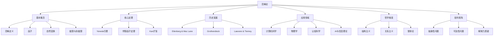

# 范畴论批判性分析

## 目录

- [范畴论批判性分析](#范畴论批判性分析)
  - [目录](#目录)
  - [范畴论基础](#范畴论基础)
  - [范畴论的核心定理](#范畴论的核心定理)
    - [Yoneda引理](#yoneda引理)
    - [伴随函子定理](#伴随函子定理)
  - [范畴论的历史发展](#范畴论的历史发展)
  - [范畴论与数学基础](#范畴论与数学基础)
  - [范畴论在计算机科学中的应用](#范畴论在计算机科学中的应用)
  - [范畴论与认知科学](#范畴论与认知科学)
  - [范畴论与信息科学和AI](#范畴论与信息科学和ai)
  - [范畴论的哲学维度](#范畴论的哲学维度)
  - [批判性视角](#批判性视角)
  - [思维导图](#思维导图)

## 范畴论基础

范畴论是20世纪40年代由Eilenberg和Mac Lane创立的数学分支，旨在抽象化和统一数学中的结构和关系。
一个范畴由对象和态射(morphisms)组成，遵循特定的公理。

基本定义：

- **范畴C**：由对象集合Ob(C)和态射集合Hom(C)组成
- **态射**：从一个对象到另一个对象的映射，满足结合律和单位元公理
- **函子**：在范畴间保持结构的映射
- **自然变换**：函子之间的"映射"

范畴论将数学结构抽象到仅关注对象间关系的层次，而非对象本身的内部结构。

## 范畴论的核心定理

### Yoneda引理

Yoneda引理是范畴论中最深刻的结果之一：

```
对于任意范畴C中的对象A和函子F: C^op → Set，
存在一个自然的双射 Nat(Hom(−,A), F) ≅ F(A)
```

这一结果表明任何对象都可以通过它与其他对象的关系来完全表征，揭示了数学结构的本质是关系网络而非内在属性。

### 伴随函子定理

伴随函子揭示了范畴间映射的对称性：

```
函子F: C → D与G: D → C互为伴随，当且仅当存在自然变换
η: 1_C → G∘F和ε: F∘G → 1_D，满足三角恒等式。
```

伴随函子在数学和计算机科学中体现为构造/析构、抽象/具体、句法/语义等二元性。

## 范畴论的历史发展

范畴论的发展经历了几个关键阶段：

1. **初创期(1940s)**：Eilenberg和Mac Lane为代数拓扑引入范畴、函子和自然变换
2. **发展期(1950-60s)**：Grothendieck将范畴论应用于代数几何，发展了层论
3. **成熟期(1970-80s)**：Lawvere和Tierney发展了拓扑斯理论，提出范畴论作为数学基础
4. **应用期(1990s至今)**：范畴论扩展到计算机科学、物理学和认知科学

各流派的视角：

- **Grothendieck学派**：关注将范畴论作为统一数学的工具
- **Lawvere学派**：强调范畴论作为基础语言的哲学意义
- **计算机科学家**：看重范畴论对类型论和程序语义的解释

## 范畴论与数学基础

范畴论挑战了集合论作为数学基础的地位：

- **集合论视角**：从元素和集合出发构建数学
- **范畴论视角**：从对象和关系出发构建数学

这两种基础的对比：

| 集合论基础 | 范畴论基础 |
|------------|------------|
| 基于元素和成员关系 | 基于对象和态射 |
| 还原主义 | 整体主义 |
| 关注内部结构 | 关注外部关系 |
| ZFC公理系统 | ETCS/CCAF公理系统 |

范畴论提供了"无点"(pointless)数学的可能性，即不依赖于元素层面的数学。

## 范畴论在计算机科学中的应用

范畴论为计算机科学提供了严格的数学基础：

- **类型论**：简单类型λ演算可视为笛卡尔闭范畴的内部语言
- **程序语义**：指称语义、操作语义可用范畴论统一描述
- **函数式编程**：Haskell等语言直接基于范畴论概念
  - Monad用于处理副作用
  - 函子对应类型构造器
  - 自然变换对应多态函数

```haskell
-- 函子示例
class Functor f where
  fmap :: (a -> b) -> f a -> f b

-- Monad示例
class Functor m => Monad m where
  return :: a -> m a
  (>>=) :: m a -> (a -> m b) -> m b
```

## 范畴论与认知科学

范畴论为认知过程提供了形式化模型：

- **概念形成**：概念可视为范畴中的对象，概念间关系为态射
- **模式识别**：函子可表示不同表征空间之间的映射
- **类比推理**：可用伴随函子和自然变换描述

Lakoff和Núñez的"体验数学"理论认为数学概念基于身体经验，范畴论提供了此类认知映射的形式框架。

## 范畴论与信息科学和AI

范畴论为信息科学和AI提供了统一视角：

- **信息流**：可用态射表示
- **知识表示**：可用拓扑斯模型化
- **分布式系统**：可用范畴论描述组件间交互
- **神经网络**：可视为带有非线性激活的函子组合

AI中的范畴论应用：

- 贝叶斯推理可视为范畴论中的某种伴随
- 强化学习中的策略可视为范畴中的态射
- 机器学习中的流形可视为范畴论中的对象

## 范畴论的哲学维度

范畴论引发了关于数学本质的深刻哲学思考：

- **结构主义**：数学对象由其在关系网络中的位置定义
- **整体论**：对象的性质从关系整体中涌现，而非内在
- **关系主义**：实体是关系的节点，而非独立存在

范畴论的存在论立场：

1. **弱范畴实在论**：范畴是数学结构，但不必然反映现实
2. **强范畴实在论**：现实世界本身具有范畴结构
3. **构造主义立场**：范畴只是思维工具，无独立存在

## 批判性视角

范畴论作为元理论面临的挑战：

- **抽象性过高**：高度形式化使得与具体问题的连接变得困难
- **可及性问题**：学习曲线陡峭，阻碍广泛应用
- **过度通用化**：通用框架可能掩盖特定领域的独特性
- **解释力质疑**：是否提供了超越传统方法的新洞见？

范畴论本身的局限：

1. 内部视角难以超越自身范畴进行批判
2. 对数学基础问题（如悖论）未提供完满解决
3. 与实证科学的联系仍需加强

## 思维导图



范畴论作为现代数学的"语言"和"工具箱"，提供了看待数学结构的新视角。它不仅统一了数学内部各分支，还为计算机科学、物理学和认知科学等领域提供了形式化框架。然而，正如任何理论框架，范畴论既有其强大的解释力，也有其内在局限。真正理解范畴论，需要在掌握其形式体系的同时，批判性地思考其应用边界和解释力边界。
