# 可计算性理论：一场批判性哲科探索

## 目录

- [可计算性理论：一场批判性哲科探索](#可计算性理论一场批判性哲科探索)
  - [目录](#目录)
  - [1. 引言：可计算性理论的诞生与意义](#1-引言可计算性理论的诞生与意义)
  - [2. 历史回溯：计算概念的奠基者与思想流派](#2-历史回溯计算概念的奠基者与思想流派)
    - [2.1 Hilbert的数学基础纲领](#21-hilbert的数学基础纲领)
    - [2.2 Gödel的突破：不完备性定理与递归函数](#22-gödel的突破不完备性定理与递归函数)
    - [2.3 Turing的贡献：图灵机与可计算性定义](#23-turing的贡献图灵机与可计算性定义)
    - [2.4 Church的λ演算与其他模型](#24-church的λ演算与其他模型)
    - [2.5 Post与Kleene的贡献](#25-post与kleene的贡献)
  - [3. 核心概念与计算模型：形式化的基石](#3-核心概念与计算模型形式化的基石)
    - [3.1 图灵机（Turing Machine）：计算的抽象模型](#31-图灵机turing-machine计算的抽象模型)
      - [3.1.1 定义与运行机制](#311-定义与运行机制)
      - [3.1.2 图灵机作为通用计算器](#312-图灵机作为通用计算器)
    - [3.2 λ演算（Lambda Calculus）：函数式计算的起源](#32-λ演算lambda-calculus函数式计算的起源)
    - [3.3 递归函数（Recursive Functions）：算术的视角](#33-递归函数recursive-functions算术的视角)
    - [3.4 模型的等价性证明与认知隐喻](#34-模型的等价性证明与认知隐喻)
  - [4. Church-Turing论题：计算的边界与哲学深思](#4-church-turing论题计算的边界与哲学深思)
    - [4.1 论题的内涵：物理与数学的桥梁](#41-论题的内涵物理与数学的桥梁)
    - [4.2 论题的地位：定义、假设或经验定律？](#42-论题的地位定义假设或经验定律)
    - [4.3 批判性解读：超计算的可能性？](#43-批判性解读超计算的可能性)
    - [4.4 论题与人类思维的关联](#44-论题与人类思维的关联)
  - [5. 不可计算性与不可判定性：理论的深渊](#5-不可计算性与不可判定性理论的深渊)
    - [5.1 停机问题（Halting Problem）：计算的根本限制](#51-停机问题halting-problem计算的根本限制)
      - [5.1.1 问题描述与对角线证明（概述）](#511-问题描述与对角线证明概述)
      - [5.1.2 证明的形式化与认知冲击](#512-证明的形式化与认知冲击)
    - [5.2 Rice定理：判定非平凡性质的普遍不可行性](#52-rice定理判定非平凡性质的普遍不可行性)
    - [5.3 Gödel不完备性定理与可计算性：逻辑系统的界限](#53-gödel不完备性定理与可计算性逻辑系统的界限)
    - [5.4 不可计算性的层次与隐喻：无限的结构](#54-不可计算性的层次与隐喻无限的结构)
  - [6. 可计算性理论的层次结构：复杂度的序曲](#6-可计算性理论的层次结构复杂度的序曲)
    - [6.1 相对可计算性与预言机（Oracle Machine）](#61-相对可计算性与预言机oracle-machine)
    - [6.2 图灵度（Turing Degrees）：不可计算性的精细分类](#62-图灵度turing-degrees不可计算性的精细分类)
    - [6.3 算术层次（Arithmetical Hierarchy）：集合的可定义性与计算复杂性](#63-算术层次arithmetical-hierarchy集合的可定义性与计算复杂性)
    - [6.4 从可计算到复杂性：效率的考量](#64-从可计算到复杂性效率的考量)
  - [7. 形式化证明、论证与认知结构：思维的映射](#7-形式化证明论证与认知结构思维的映射)
    - [7.1 形式化证明的逻辑严谨性与直观性](#71-形式化证明的逻辑严谨性与直观性)
    - [7.2 可计算性理论中的归谬法与对角线法：认知震撼](#72-可计算性理论中的归谬法与对角线法认知震撼)
    - [7.3 抽象思维与计算模型的构建：人类认知的飞跃](#73-抽象思维与计算模型的构建人类认知的飞跃)
    - [7.4 理论证明对人类认识能力的拓展与限制](#74-理论证明对人类认识能力的拓展与限制)
  - [8. 与其他元理论的关联：逻辑、集合与哲学](#8-与其他元理论的关联逻辑集合与哲学)
    - [8.1 与数学逻辑的关系：形式系统与真理](#81-与数学逻辑的关系形式系统与真理)
    - [8.2 与集合论的交织：可数性、不可数性与可计算数的地位](#82-与集合论的交织可数性不可数性与可计算数的地位)
    - [8.3 对数学哲学的影响：构造主义、形式主义与直觉主义的争论](#83-对数学哲学的影响构造主义形式主义与直觉主义的争论)
    - [8.4 可计算性理论对本体论和认识论的启示](#84-可计算性理论对本体论和认识论的启示)
  - [9. 可计算性理论与计算机科学、信息科学：理论指导实践](#9-可计算性理论与计算机科学信息科学理论指导实践)
    - [9.1 对编程语言设计与编译器的影响](#91-对编程语言设计与编译器的影响)
    - [9.2 算法分析与复杂性理论的基石](#92-算法分析与复杂性理论的基石)
    - [9.3 人工智能的边界：可计算性对AI的启示](#93-人工智能的边界可计算性对ai的启示)
    - [9.4 信息、编码与计算：理论的普遍性](#94-信息编码与计算理论的普遍性)
    - [9.5 密码学中的应用：单向函数与计算硬度](#95-密码学中的应用单向函数与计算硬度)
  - [10. 批判性与哲科反思：开放的边界](#10-批判性与哲科反思开放的边界)
    - [10.1 Church-Turing论题的再审视：物理可计算性与广义可计算性](#101-church-turing论题的再审视物理可计算性与广义可计算性)
    - [10.2 计算的本质：形式、物理或生物过程？](#102-计算的本质形式物理或生物过程)
    - [10.3 算法伦理与社会影响：技术进步的哲学反思](#103-算法伦理与社会影响技术进步的哲学反思)
    - [10.4 可计算性理论的未来展望：新范式与未解之谜](#104-可计算性理论的未来展望新范式与未解之谜)
  - [11. 总结与展望](#11-总结与展望)
  - [12. 思维导图：可计算性理论概念网络](#12-思维导图可计算性理论概念网络)

---

## 1. 引言：可计算性理论的诞生与意义

可计算性理论（Computability Theory），又称递归论（Recursion Theory），是数学逻辑的一个分支，研究哪些问题可以被算法解决，以及这些问题解决的难度。它诞生于20世纪30年代，作为对数学基础危机，特别是Hilbert第十问题（关于丢番图方程可解性判定的问题）的回应。该理论不仅为“算法”和“计算”提供了严格的形式化定义，更深刻揭示了计算能力的内在限制，对数学、逻辑学、计算机科学乃至哲学产生了深远影响。本批判性哲科探索将深入其定理、证明、解释与诠释，剖析其思维脉络、层次与隐喻，并结合历史人物的视角，审视形式化证明与认知结构的关系，兼顾与其他元理论及计算机科学、信息科学的联系，始终保持批判与哲科思维。

## 2. 历史回溯：计算概念的奠基者与思想流派

可计算性理论的兴起并非偶然，它根植于20世纪初数学基础面临的挑战。

### 2.1 Hilbert的数学基础纲领

20世纪初，数学界在集合论悖论的冲击下陷入危机。数学家David Hilbert提出了一项宏伟的数学基础纲领：通过形式化方法，将所有数学命题表示为形式语言，并用一套有限的公理和推理规则来推导出所有真命题，最终证明数学是**无矛盾**（consistency）且**完备**（completeness）的。这一纲领隐含了对“有效计算”（effective calculability）过程的强烈需求：是否存在一种**机械化过程**，可以判定任何给定数学命题的真伪？

### 2.2 Gödel的突破：不完备性定理与递归函数

1931年，Kurt Gödel的**不完备性定理**对Hilbert纲领构成了毁灭性打击。他证明了任何足够强大（包含基本算术）的**一致形式系统**都必然是**不完备**的，即存在在该系统内既不能被证明也不能被证伪的命题。为了证明这一点，Gödel引入了**递归函数**（Recursive Functions）的概念，通过将形式符号和证明步骤编码为自然数（Gödel编码），将关于证明的问题转化为关于自然数的计算问题。他首次形式化了“可计算”的算术对应物。

- **Gödel视角**: Gödel的贡献在于揭示了形式系统固有的局限性，其思想中蕴含着对“真理”与“可证明性”之间差异的深刻洞察。他的工作暗示了，即使是最严谨的逻辑推理，也无法完全捕捉数学的全部真理。他从算术的视角，提供了可计算性概念的雏形。

### 2.3 Turing的贡献：图灵机与可计算性定义

面对Gödel的突破，Alan Turing在1936年发表了划时代论文《论可计算数及其在判定问题上的应用》。他提出了**图灵机**（Turing Machine）这一抽象计算模型，旨在捕捉人类“机械化计算”过程的本质。图灵机概念的简洁性和普适性使其迅速成为可计算性理论的基石。

- **Turing视角**: Turing试图通过分析人类计算员在纸笔上执行计算的步骤，将其抽象为最基本的操作：读、写、擦除符号，以及根据当前状态和读取的符号改变状态并移动。他认为，任何人类可机械化执行的计算过程，都可以由图灵机模拟。这是一种从“物理操作”到“抽象模型”的深刻洞察，也是 Church-Turing 论题的经验基础。

### 2.4 Church的λ演算与其他模型

与Turing独立地，Alonzo Church在1936年提出了**λ演算**（Lambda Calculus），一种基于函数抽象和函数应用的计算模型。Emil Post提出了**Post机**，而Stephen Kleene则基于Gödel的工作进一步发展了**一般递归函数**。

- **Church视角**: Church的λ演算提供了一种完全不同的计算视角，强调函数的定义和应用，而不是机器状态和磁带操作。它的优雅和简洁对函数式编程语言产生了巨大影响。

### 2.5 Post与Kleene的贡献

Emil Post进一步研究了形式系统与计算过程的联系，提出了Post规范系统，强调符号串操作。Stephen Kleene则在Gödel和Church的基础上，系统地发展了递归函数理论，为可计算性概念提供了坚实的数学框架，并提出了“克莱尼正常形式定理”等重要结果。

## 3. 核心概念与计算模型：形式化的基石

可计算性理论的核心在于对“算法”或“有效计算过程”进行严格的形式化定义。历史上涌现了多种看似不同但最终被证明是等价的计算模型。

### 3.1 图灵机（Turing Machine）：计算的抽象模型

图灵机是可计算性理论中最具代表性的模型，其简洁性完美地捕捉了“机械化计算”的精髓。

#### 3.1.1 定义与运行机制

一台图灵机由以下部分组成：

- **一条无限长的纸带**：纸带被划分为离散的方格，每个方格可以写入或读取一个符号（来自有限的字母表）。
- **一个读写头**：可以在纸带上左右移动，一次读取或写入一个方格。
- **一个有限状态控制器**：机器在任何给定时间点都处于有限个状态中的一个。
- **一个有限的指令集**：每条指令根据当前状态和读写头读取的符号，规定机器下一步的操作：写入什么符号、移动方向（左/右）、以及进入哪个新状态。

机器从初始状态开始，根据指令集执行操作，直到进入停机状态。

**图灵机指令示例（伪代码）：**

```math
(当前状态, 读取符号) -> (写入符号, 移动方向, 新状态)
```

例如：

```math
(q0, 0) -> (1, R, q1)  // 在状态q0读到0，写入1，向右移动，进入q1
(q1, B) -> (B, S, q_halt) // 在状态q1读到空白（B），写入空白，停下，进入停机状态
```

#### 3.1.2 图灵机作为通用计算器

Turing的关键洞察之一是提出了**通用图灵机**（Universal Turing Machine, UTM）的概念。一台通用图灵机能够模拟任何其他图灵机的行为。这意味着，如果我们将一台图灵机的指令集编码为通用图灵机的输入数据，UTM就能像那台被编码的图灵机一样执行计算。这一概念预示了现代计算机的“可编程性”——一台机器可以执行任何算法，只要给出相应的程序。

- **隐喻**: 图灵机是“计算机”这一抽象概念的最纯粹、最简化的模型，它揭示了任何可算法化过程的本质：有限状态、有限指令、离散操作和无限存储。

### 3.2 λ演算（Lambda Calculus）：函数式计算的起源

λ演算由Church提出，是一种基于函数抽象和函数应用的理论。它只有两种基本操作：

- **函数抽象（λx.M）**：定义一个匿名函数，它接受一个参数`x`并计算表达式`M`。
- **函数应用（MN）**：将函数`M`应用于参数`N`。

λ演算通过这些简单的规则，可以表达任何可计算函数。它与图灵机在计算能力上是等价的，但提供了完全不同的视角，强调函数的递归定义而非状态转换。

### 3.3 递归函数（Recursive Functions）：算术的视角

递归函数是一类可以通过基本函数和有限次组合（例如复合、原始递归、最小化算子）构造出来的函数。Gödel在不完备性定理中使用了它们，Kleene对其进行了系统发展，证明了它们与图灵机可计算函数和λ可定义函数等价。

- **原始递归函数**：通过初始函数（零函数、后继函数、投影函数）和两种构造规则（复合、原始递归）定义。
- **一般递归函数**：在原始递归函数的基础上，引入了无界最小化算子，允许搜索满足特定条件的最小非负整数。这一算子引入了“可能永不终止”的计算特性，正是其与图灵机等价的关键。

### 3.4 模型的等价性证明与认知隐喻

Church、Turing和Kleene各自独立提出了不同的计算模型，但最终都被证明是**等价的**：任何一个模型能计算的函数，其他模型也能计算。这种等价性是可计算性理论的一个核心发现，它强烈支持了Church-Turing论题。

- **认知隐喻**: 这种等价性表明，无论我们从“机械状态转换”（图灵机）、“函数变换”（λ演算）还是“算术运算”（递归函数）哪个角度去形式化“计算”，最终都会汇聚到同一个“可计算”的集合。这可能暗示了“计算”这一概念在某种程度上是人类认知和逻辑思维的**一种基本且稳健的抽象**，独立于其具体的物理或数学实现。

## 4. Church-Turing论题：计算的边界与哲学深思

Church-Turing论题是可计算性理论的核心哲学命题，它连接了形式化的数学概念与我们日常理解的“算法”或“有效计算”直观概念。

### 4.1 论题的内涵：物理与数学的桥梁

**Church-Turing论题**（Church-Turing Thesis, CTT）指出：

> 任何可以用“有效方法”计算的函数，都可以用图灵机计算。（等价地，可以用λ演算或一般递归函数计算）。

“有效方法”指的是一种机械的、明确的、有限步骤的、任何人遵循都能得出相同结果的过程。它通常被认为包括：

- 有限数量的指令。
- 指令的执行不依赖于直觉或创造性。
- 执行步骤是离散的。
- 执行时间可以无限，但每一步都是有限的。

### 4.2 论题的地位：定义、假设或经验定律？

CTT并非一个可被数学证明的定理，因为它将一个**非形式化概念**（有效方法/算法）与一个**形式化模型**（图灵机）联系起来。它的地位引发了广泛的哲学讨论：

- **定义论**: 许多人认为CTT是对“算法”或“可计算性”的**定义**。在可计算性理论中，“可计算”就意味着“图灵可计算”。
- **经验假设/物理定律论**: 另一些人（特别是物理学家）认为CTT是一个关于物理世界的**经验假设**。它断言任何物理可计算过程（无论是大脑、宇宙还是量子效应）都可以被图灵机模拟。这更像是物理学中的定律，其正确性取决于实验观察和理论模型。
- **信念/公理**: 还有观点认为CTT是一个被广泛接受的**公理**，是构建现代计算机科学的基石。

### 4.3 批判性解读：超计算的可能性？

CTT的普适性受到了一些批判和挑战，主要围绕“超计算”（Hypercomputation）的可能性：

- **超任务（Supertasks）**: 设想在有限时间内完成无限步骤的计算。例如，Zeno的悖论式计算，或通过在时间间隔不断缩短的情况下执行操作。这在物理上是否可行，以及是否能产生非图灵可计算的结果？大多数观点认为这只是思想实验，不构成对CTT的实际挑战。
- **非图灵机模型**: 是否存在比图灵机更强大的计算模型？例如，基于量子力学（虽然量子计算在图灵机模型下是可模拟的，但效率不同）、或基于广义相对论（如Malament-Hogarth空间-时间）的机器。这些模型是否能计算图灵不可计算的函数？这一领域仍处于研究中，但目前尚未有被普遍接受的超计算模型。
- **物理 Church-Turing 论题**: CTT的物理版本（PTCT）指出，任何物理上可实现的计算过程都可以被图灵机有效模拟。对这一物理论题的挑战，可能会颠覆我们对物理世界计算能力的理解。

- **批判视角**: CTT的强大之处在于它将一个模糊的概念“算法”固定在一个清晰的数学框架上。但它的局限性在于，我们无法**证明**它涵盖了所有可能的“有效方法”。它更像是一个成功的“定义”或“工作假设”，而不是一个可证明的数学定理。对超计算的探讨，正是对这一“定义”边界的持续追问。

### 4.4 论题与人类思维的关联

CTT对理解人类思维的本质有着深刻的哲学含义：如果人类大脑的思维过程是“可计算的”，那么它是否能够被图灵机模拟？这引发了关于人工智能、意识和自由意志的讨论。如果思维本质上是算法的，那么强人工智能理论（机器可以真正思考）就有了理论基础；反之，如果存在人类独有的非算法思维，则挑战了计算主义的观点。

## 5. 不可计算性与不可判定性：理论的深渊

可计算性理论最令人震撼的发现，是存在着本质上不可计算或不可判定的问题。这些发现不仅限制了算法的普适性，也深刻影响了逻辑学和数学哲学。

### 5.1 停机问题（Halting Problem）：计算的根本限制

**停机问题**可以表述为：是否存在一个通用算法，它能够判定任何给定的程序（图灵机）在给定输入下，是会最终停止（停机）还是会无限运行（不停机）？

#### 5.1.1 问题描述与对角线证明（概述）

Turing在1936年的论文中证明了**停机问题是不可判定的**。其证明采用了经典的**对角线法**（diagonalization），这与Cantor证明实数不可数、Gödel证明不完备性定理的方法异曲同工。

**证明概述（归谬法）：**

1. **假设存在一个停机判定器H**：这个判定器H接收一个图灵机M的描述和一个输入w，并能判定M在w上是否停机。
    - 如果M(w)停机，H(M, w)输出“停机”。
    - 如果M(w)不停机，H(M, w)输出“不停机”。
2. **构造一个“反叛者”图灵机D**：
    - D接收一个图灵机M的描述作为输入。
    - D调用H来判断M在**M自身**作为输入时是否停机（即 H(M, M)）。
    - 如果H(M, M)输出“停机”，那么D进入无限循环（不停机）。
    - 如果H(M, M)输出“不停机”，那么D立即停机。
3. **考虑D对自身的行为**：现在，我们让D以D自身的描述作为输入，即考虑 D(D)。
    - 如果D(D)停机，根据D的构造，这意味着H(D, D)判定“D在D上不停机”。这与“D(D)停机”矛盾。
    - 如果D(D)不停机，根据D的构造，这意味着H(D, D)判定“D在D上停机”。这与“D(D)不停机”矛盾。

两种情况都导致矛盾。因此，最初的假设——存在停机判定器H——是错误的。故**停机问题不可判定**。

#### 5.1.2 证明的形式化与认知冲击

这个证明非常简洁而强大。它的形式化依赖于图灵机能够被编码为输入数据（Gödel编码的延伸），以及图灵机能够模拟其他图灵机的能力（通用图灵机）。

- **认知冲击**: 停机问题的不可判定性，表明了即使是看似简单且逻辑清晰的问题，也可能无法通过算法解决。这挑战了人类直觉中“所有问题都可被解决”的乐观预期。它为我们认识算法的局限性设定了根本边界，也为人工智能的发展划定了理论上的“禁区”。

### 5.2 Rice定理：判定非平凡性质的普遍不可行性

**Rice定理**是停机问题的推广。它指出：

> 对于任何一个**非平凡的**（即既不是所有图灵机都具有，也不是所有图灵机都不具有的）关于图灵机**计算函数行为**的性质，都不存在一个算法能够判定任意给定的图灵机是否具有该性质。

“计算函数行为”指的是图灵机所计算的**输入-输出关系**，而非其内部状态或结构。例如，“是否停机”、“是否计算平方根”、“是否接受素数作为输入”等都是关于计算函数行为的性质。而“是否有100个状态”、“是否使用超过5个纸带方格”等是关于图灵机本身的性质，Rice定理不适用于此。

- **诠释**: Rice定理告诉我们，在程序分析领域，我们几乎无法通过算法来自动判定程序的任何“有趣”属性。这解释了为什么许多高级程序分析工具只能给出近似结果，或者在特定场景下才能工作。

### 5.3 Gödel不完备性定理与可计算性：逻辑系统的界限

虽然Gödel不完备性定理最初与图灵机无关，但后来通过对递归函数和可判定性的理解，两者被深刻地关联起来。

- **第一不完备性定理**: 任何足够强大（包含基本算术）且**一致**的形式系统，都存在一个在该系统内不可证明也不可证伪的命题。这个“不可证明”的命题，可以被构造为关于系统自身一致性的一个断言（即“本系统是一致的”）。
- **第二不完备性定理**: 任何足够强大且一致的形式系统，都无法在自身内部证明其一致性。

**与可计算性的关联**:

- Gödel证明中关键的“可表示性”概念与递归函数密切相关。
- 判定逻辑公式是否是定理（即是否可被证明）的问题，在某些足够强大的形式系统中是**不可判定**的（Church的判定问题）。
- 逻辑真理的不可判定性与计算的不可终止性在思想上具有共鸣。这暗示了形式系统和算法都无法完全捕捉所有真理，总会存在“灰色地带”。

### 5.4 不可计算性的层次与隐喻：无限的结构

不可计算性并非“一概而论”。存在着比停机问题“更难”的问题。通过引入“预言机”（Oracle Machine），我们可以定义相对可计算性，进而构建不可计算性问题的层次结构（如算术层次和图灵度），揭示了无限复杂度的景观。

- **隐喻**: 不可计算性揭示了计算和逻辑的“地平线”，就像宇宙中存在我们无法观测的事件视界。这些“地平线”并非空无一物，而是蕴含着自身复杂的结构。

## 6. 可计算性理论的层次结构：复杂度的序曲

可计算性理论不仅仅关注“可计算”与“不可计算”的二分法，它还进一步细化了不可计算问题的“难度”等级。

### 6.1 相对可计算性与预言机（Oracle Machine）

为了比较不可计算问题的难度，Turing引入了**预言机**（Oracle Machine）的概念。一台预言机是一台图灵机，但它除了自己的纸带外，还有一个特殊的“预言带”和“预言状态”。当机器进入预言状态时，它可以向一个“预言者”（Oracle）提出一个特定问题，预言者会立即给出这个问题的答案，而这个答案可能是图灵机本身无法计算的。

- **定义**: 如果一个函数 \(f\) 可以被一台带有预言机 \(g\) 的图灵机计算，我们就说 \(f\) 是相对于 \(g\) **可计算**的，记作 \(f \le_T g\)。
- **作用**: 预言机允许我们研究，如果某些不可计算的问题被“奇迹般地解决”，那么还能解决哪些其他问题。这提供了一种比较不可计算问题“难度”的框架。

### 6.2 图灵度（Turing Degrees）：不可计算性的精细分类

基于相对可计算性，我们可以定义**图灵等价**（Turing Equivalence）：如果 \(f \le_T g\) 且 \(g \le_T f\)，则称 \(f\) 和 \(g\) 是图灵等价的（记作 \(f \equiv_T g\)）。所有相互图灵等价的函数或集合构成一个**图灵度**（Turing Degree）。

- **最简单的图灵度**: 包含所有图灵可计算的函数/集合。
- **下一个图灵度**: 包含与停机问题图灵等价的函数/集合。
- **结构**: 图灵度构成一个偏序集，其结构非常复杂，具有无限分层和分支。这揭示了不可计算性并非单一的，而是一个具有丰富内部结构的“无限深渊”。

- **隐喻**: 图灵度就像是计算复杂性上的“山脉”，每座山代表一类不可计算问题，山越高，问题越难。预言机则像是爬山时可以使用的特殊工具，能够越过某些障碍。

### 6.3 算术层次（Arithmetical Hierarchy）：集合的可定义性与计算复杂性

算术层次是另一种对不可计算集进行分类的方法，它基于集合在算术语言中定义所需的量词交替的复杂性。

- **\(\Sigma_n^0\) 集合**: 可以被 \(\exists^n\) 个交替量词（以存在量词开始）定义的集合。
- **\(\Pi_n^0\) 集合**: 可以被 \(\forall^n\) 个交替量词（以全称量词开始）定义的集合。
- **\(\Delta_n^0\) 集合**: 既是 \(\Sigma_n^0\) 又是 \(\Pi_n^0\) 的集合。

这些层次与图灵度紧密关联。例如，可计算集是 \(\Delta_1^0\)，而停机问题（即图灵可识别但不可计算的集合）是 \(\Sigma_1^0\)。

- **意义**: 算术层次从逻辑可定义性的角度，为集合的复杂性提供了另一个维度，并与它们的计算性质（如可识别性）建立了联系。

### 6.4 从可计算到复杂性：效率的考量

虽然可计算性理论关注的是“能否计算”，但它为计算复杂性理论（Computational Complexity Theory）奠定了基础。复杂性理论关注“如何高效地计算”，即计算所需的资源（时间、空间）。

- **P vs. NP问题**: 这是计算机科学中最著名的未解决问题之一，它探讨的是“容易验证”的问题是否也“容易计算”。可计算性理论证明了许多问题不可计算，而复杂性理论则进一步区分了可计算问题中的“易”与“难”。

- **关联**: 可计算性是复杂性的前提。如果一个问题不可计算，那么谈论它的时间或空间复杂性就毫无意义。但即使一个问题可计算，它也可能需要天文数字般的资源才能解决。

## 7. 形式化证明、论证与认知结构：思维的映射

可计算性理论中的证明，特别是停机问题和不完备性定理的证明，以其严格的形式化和反直觉的结论而著称。它们不仅是数学论证的典范，也深刻揭示了人类认知在面对抽象和无限时的局限与能力。

### 7.1 形式化证明的逻辑严谨性与直观性

可计算性理论的证明严格遵循形式逻辑的规则，从定义出发，通过一步步的推理，得出结论。这种严谨性是其力量的源泉，确保了结论的可靠性。然而，这种形式化有时也掩盖了证明背后的直观思想。例如，停机问题的对角线证明，其核心思想是构造一个“自我指涉”的矛盾，这本身是直观的，但将其形式化为图灵机操作则需要高度的抽象能力。

### 7.2 可计算性理论中的归谬法与对角线法：认知震撼

**归谬法**（Reductio ad Absurdum）是可计算性理论中证明不可计算性的常用工具。其逻辑是：假设某个算法存在，然后通过一系列推理，导出一个逻辑矛盾，从而证明该假设是错误的。

**对角线法**（Diagonalization）是归谬法的一个强大变体，最早由Cantor用于证明实数比自然数“更多”，后被Gödel和Turing分别用于证明不完备性定理和停机问题的不可判定性。

- **认知冲击**: 对角线法之所以具有认知冲击力，是因为它利用了“自我指涉”或“自反性”构造一个超越任何预设列表（或算法集合）的新实体。这种方法揭示了任何试图“穷尽”或“完全捕捉”某种无限集合（如所有图灵机，或所有可证明的命题）的尝试，都将因为自身构造的能力而失败。它展现了人类思维在抽象和无限概念上的“自我超越”能力，同时也设定了其内在的界限。

### 7.3 抽象思维与计算模型的构建：人类认知的飞跃

图灵机、λ演算等计算模型的构建，是人类抽象思维的巨大飞跃。它们将复杂的物理或心理计算过程，提炼为最基本、最纯粹的符号操作。这种抽象能力使得我们能够脱离具体物理实现，去研究计算的普遍规律和限制。

- **关联性**: 这种抽象过程与人类对世界进行概念化和模式识别的认知过程高度相关。通过抽象，我们将复杂信息简化为可操作的块，这与我们构建知识体系的方式相似。

### 7.4 理论证明对人类认识能力的拓展与限制

可计算性理论的证明不仅揭示了计算的局限，也极大地拓展了我们对“知识”、“真理”和“可解决问题”的认识。它迫使我们承认，并非所有问题都能通过算法解决。这既是一种限制，也是一种解放，促使我们寻找非算法或超越算法的认知模式。

- **批判性反思**: 这种形式化证明的成功，是否也导致了对非形式化思维、直觉或创造性洞察的忽视？可计算性理论的框架是否过于强调“机械可操作性”，而排除了其他可能存在的认知方式？

## 8. 与其他元理论的关联：逻辑、集合与哲学

可计算性理论与其他元理论——数学逻辑、集合论和哲学——之间存在着深刻而复杂的交织关系，共同构成了对数学和知识本质的探究。

### 8.1 与数学逻辑的关系：形式系统与真理

可计算性理论起源于数学逻辑，它为逻辑系统的“可证明性”和“可判定性”提供了计算视角的工具。

- **判定问题（Entscheidungsproblem）**: Hilbert提出的判定问题，即是否存在一个算法能判定任何给定逻辑公式是否为普遍有效（重言式）。Church和Turing独立证明了对于一阶谓词逻辑，判定问题是**不可判定**的。
- **公理化方法**: 可计算性理论与形式逻辑共同推动了数学的公理化和形式化，试图将数学推理过程完全归结为符号操作。
- **哥德尔不完备性定理**: Gödel的不完备性定理正是通过将逻辑系统的语句编码为数，并利用递归函数的性质来证明的，深刻揭示了形式逻辑的局限性。

- **关联**: 可计算性理论为形式逻辑提供了“可计算性”这一操作性定义，使得对逻辑系统性质（如完备性、一致性、可判定性）的研究更加精确和严格。

### 8.2 与集合论的交织：可数性、不可数性与可计算数的地位

集合论是数学的基础，可计算性理论与它有着天然的联系：

- **可数性**: 图灵机、程序、算法的集合都是**可数无限**的。这意味着所有可能的算法都可以被枚举。
- **实数的不可数性**: Cantor证明了实数是**不可数无限**的。而图灵机能够计算的实数（可计算数）只是所有实数中的一个可数子集。这意味着绝大多数实数是**不可计算**的。
- **不可计算函数的数量**: 同样，可计算函数的数量是可数的，而所有可能的函数（从自然数到自然数）的数量是不可数的。这意味着存在着**压倒性数量的不可计算函数**。

- **批判性解读**: 这引发了对“数学对象是否存在”的哲学思考。如果大多数实数是不可计算的，那么我们如何“认识”或“构造”它们？这使得构造主义数学家质疑这些不可计算实数的“存在性”。可计算性理论为集合论的抽象概念（如无限）赋予了“计算可构造性”这一新的维度。

### 8.3 对数学哲学的影响：构造主义、形式主义与直觉主义的争论

可计算性理论直接介入了20世纪数学基础的几大流派的争论：

- **形式主义**: Hilbert的形式主义纲领希望将数学完全形式化，并证明其一致性。可计算性理论（特别是Gödel和Turing的工作）直接打击了这一纲领的乐观预期。
- **直觉主义**: 以Brouwer为代表的直觉主义者反对无限集合的实际存在，只接受那些可以被“构造”出来的数学对象。可计算性理论的出现，为“可构造性”提供了精确的定义（即图灵可计算性），从某种程度上支持了直觉主义的某些论点。
- **计算主义（或计算哲学）**: 这一新兴流派认为，宇宙或心智本身就是一个巨大的计算过程。可计算性理论提供了理解这种计算的框架和限制。

- **关联**: 可计算性理论通过其严谨的数学结果，为这些哲学争论提供了具体的论据和新的视角，迫使哲学家们重新审视数学对象的存在方式、真理的性质以及人类认知的极限。

### 8.4 可计算性理论对本体论和认识论的启示

- **本体论**: 什么是“存在”的？如果一个数学对象不可计算，它是否“存在”于与可计算对象相同的意义上？计算是否是一种新的“存在”标准？
- **认识论**: 我们如何获得知识？如果存在不可计算的真理，我们如何认识它们？人类的直觉、创造力或非算法思维是否能够超越计算的限制？

## 9. 可计算性理论与计算机科学、信息科学：理论指导实践

可计算性理论虽然是抽象的数学分支，但它是现代计算机科学和信息科学的理论基石，为这些学科的发展提供了深刻的洞察和指导。

### 9.1 对编程语言设计与编译器的影响

- **图灵完备性**: 任何能够模拟通用图灵机的编程语言都被称为“图灵完备”的。这意味着它们理论上可以表达任何可计算算法。这是衡量编程语言能力的重要标准。
- **函数式编程**: λ演算直接催生了函数式编程范式，强调函数的纯粹性和无副作用，这与可计算性理论中的数学函数概念高度一致。
- **编译器/解释器**: 编译器的设计本质上是一个将高级语言转换为机器可执行指令的算法过程，其理论基础是图灵机对其他图灵机的模拟能力（即通用图灵机）。

### 9.2 算法分析与复杂性理论的基石

可计算性理论区分了“可计算”与“不可计算”，而计算复杂性理论则在此基础上，进一步区分了可计算问题中的“易”与“难”。

- **算法的效率**: 虽然一个问题可计算，但可能需要耗费难以想象的时间或空间资源。复杂性理论（如P/NP问题）关注如何评估算法的效率，这直接影响了实际计算问题的可行性。
- **算法的极限**: 当一个问题被证明是图灵不可计算的，我们知道无论如何优化算法，也无法找到一个通用的解。这为实际问题的解决方案设定了理论上限。

### 9.3 人工智能的边界：可计算性对AI的启示

- **符号AI与计算主义**: 早期AI研究深受可计算性理论的影响，认为智能可以归结为符号操作和逻辑推理。如果人类智能是某种计算过程，那么理论上它就可以被图灵机模拟。
- **停机问题与通用AI**: 停机问题的不可判定性意味着，我们无法编写一个程序来完美地预测另一个任意程序的行为。这在某种程度上暗示了构建一个能够完全理解和预测所有程序的通用智能体的困难。
- **非计算主义观点**: 一些学者认为，人类智能（特别是意识、创造力、直觉）可能包含非算法或超计算的成分，从而挑战了强人工智能的“计算主义”假设。可计算性理论为这些辩论提供了严格的框架。

### 9.4 信息、编码与计算：理论的普遍性

- **信息编码**: Gödel编码和图灵机中的符号编码，都强调了信息可以被编码为离散的符号，并进行机械化处理。这构成了信息论、编码理论和数字通信的基础。
- **信息压缩**: 可计算性理论与Kolmogorov复杂度（一种度量信息随机性的理论，定义为生成该信息所需的最短程序长度）有深厚联系。
- **计算的普遍性**: 可计算性理论揭示了计算的抽象和普遍性质，使得“计算”成为理解物理世界、生物过程甚至认知活动的一种强大隐喻。

### 9.5 密码学中的应用：单向函数与计算硬度

- **单向函数**: 在密码学中，许多加密算法依赖于“单向函数”的存在，即函数本身很容易计算，但其逆函数在计算上是困难的。可计算性理论和复杂性理论为此提供了理论基础，特别是关于NP完全问题的研究。
- **计算安全**: 密码学的安全性通常基于某些问题在计算上是“困难的”（例如大数分解、离散对数），尽管它们是可计算的。这种“计算硬度”的概念是复杂性理论的核心。

## 10. 批判性与哲科反思：开放的边界

可计算性理论的巨大成功，也带来了一些需要批判性反思的哲学和科学问题。

### 10.1 Church-Turing论题的再审视：物理可计算性与广义可计算性

- **物理C-T论题的挑战**: 物理世界是否真的只能实现图灵可计算性？量子计算、模拟计算、甚至是基于引力或膜理论的“超计算”模型，是否可能突破这个界限？对这些问题的探索，将迫使我们重新思考物理定律与计算能力之间的关系，而非简单地将物理过程归结为图灵机的模拟。
- **广义可计算性**: 我们对“算法”的理解是否过于狭隘，仅仅局限于图灵机所捕捉的离散、有限步操作？是否存在其他形式的“有效计算”，例如连续性计算、非确定性计算或无限步骤计算，其物理实现可能超越图灵机范畴？

### 10.2 计算的本质：形式、物理或生物过程？

- **计算的本体论地位**: 计算到底是什么？它是一种抽象的数学形式，一种物理过程（如信息处理），还是一种生物现象（如大脑活动）？可计算性理论主要关注其形式化方面，但其在物理和生物领域的应用，模糊了这些界限，促使我们探讨计算的“真正”本质。
- **心智与计算**: 人类心智是否完全是计算的？如果心智是计算的，它是否是图灵可计算的？意识、自由意志、创造力等现象，是否能完全被算法解释？对这些问题的解答，可能需要超越纯粹的可计算性理论框架，引入现象学、神经科学等跨学科视角。

### 10.3 算法伦理与社会影响：技术进步的哲学反思

可计算性理论为算法奠定了基础，而算法正日益渗透到社会生活的方方面面。

- **算法偏见与公平性**: 如果算法的本质是机械和形式化的，那么其决策是否能保证公平和无偏？算法设计中隐含的人类偏见，如何在形式化和可计算性的框架下被识别和纠正？
- **自动化与人类劳动的未来**: 可计算性理论揭示了哪些任务可以被自动化，这引发了对未来社会结构和人类角色变化的思考。
- **知识的自动化与主观性**: 随着算法能处理越来越多的信息并做出决策，人类知识的本质和主观性是否受到威胁？我们对“真理”的认识是否会过度依赖可计算的验证？

### 10.4 可计算性理论的未来展望：新范式与未解之谜

- **超越图灵机的模型**: 随着量子计算、神经网络等新计算范式的兴起，可计算性理论是否需要新的形式化框架来捕捉这些非经典计算的本质和能力？
- **“不可计算”的利用**: 尽管存在不可计算性，但人类仍能解决许多复杂问题。这是否意味着我们无意识地利用了某种形式的“超计算”？或者我们通过启发式、近似算法和非形式化思维弥补了形式计算的不足？
- **计算与复杂系统的联系**: 可计算性理论如何更好地融入对复杂系统（如生命、意识、宇宙）的研究中？计算的宏观行为与微观机制之间的关系是什么？

## 11. 总结与展望

可计算性理论作为一门元理论，其贡献远超数学逻辑本身。它不仅为“算法”和“计算”提供了严格的数学定义，更深刻地揭示了计算能力的内在限制——从停机问题的不可判定性，到Gödel不完备性定理对形式系统的约束。通过图灵机、λ演算和递归函数等模型的等价性，它提供了一个稳固的框架来理解计算的本质。

然而，本批判性分析也强调，该理论并非没有局限。Church-Turing论题的哲学地位、超计算的可能性、形式化证明与人类认知之间的鸿沟，以及其在物理、生物和哲学领域引发的深层问题，都提示我们这仍然是一个充满活力的研究领域。

可计算性理论不仅塑造了计算机科学的理论基础，指引着人工智能、编程语言和密码学的发展，更在哲学层面启发我们反思知识的边界、真理的性质以及人类心智与机器的异同。在人工智能和自动化日益发展的今天，重新审视可计算性理论的哲学内涵和实践意义，对于我们理解技术、社会和人类自身具有不可估量的价值。我们应持续以批判的、哲科的视角，探索计算的未竟之旅。

---

## 12. 思维导图：可计算性理论概念网络

```mermaid
graph TD
    A[可计算性理论] --> B[核心概念与模型]
    A --> C[历史回溯]
    A --> D[Church-Turing论题]
    A --> E[不可计算性与不可判定性]
    A --> F[层次结构]
    A --> G[证明与认知]
    A --> H[与其他元理论关联]
    A --> I[与CS/IS关联]
    A --> J[批判性与哲科反思]

    B --> B1(图灵机: 抽象模型, 通用性)
    B --> B2(λ演算: 函数式起源)
    B --> B3(递归函数: 算术视角)
    B --> B4(模型等价性: 统一性)

    C --> C1(Hilbert纲领)
    C --> C2(Gödel: 不完备性, 递归函数)
    C --> C3(Turing: 图灵机, 可计算数)
    C --> C4(Church: λ演算)
    C --> C5(Post, Kleene)

    D --> D1(论题内涵: 算法定义)
    D --> D2(哲学地位: 定义/假设/定律)
    D --> D3(批判: 超计算, 物理C-T)
    D --> D4(与人类思维关联)

    E --> E1(停机问题: 不可判定性, 对角线证明)
    E --> E2(Rice定理: 非平凡性质)
    E --> E3(Gödel不完备性: 逻辑系统限制)
    E --> E4(不可计算性层次隐喻)

    F --> F1(相对可计算性: 预言机)
    F --> F2(图灵度: 难度分类)
    F --> F3(算术层次: 定义复杂性)
    F --> F4(从可计算到复杂性)

    G --> G1(形式化证明严谨性)
    G --> G2(归谬法, 对角线法冲击)
    G --> G3(抽象思维与模型构建)
    G --> G4(拓展与限制认知能力)

    H --> H1(数学逻辑: 判定问题)
    H --> H2(集合论: 可数/不可数, 可计算数)
    H3(数学哲学: 构造主义, 形式主义)
    H --> H4(本体论, 认识论启示)

    I --> I1(编程语言, 编译器: 图灵完备性)
    I --> I2(算法分析, 复杂性理论)
    I --> I3(人工智能边界: 计算主义)
    I --> I4(信息, 编码, 计算)
    I --> I5(密码学: 单向函数)

    J --> J1(C-T论题再审视)
    J --> J2(计算本质: 形式/物理/生物)
    J --> J3(算法伦理, 社会影响)
    J --> J4(未来展望: 新范式)
```


