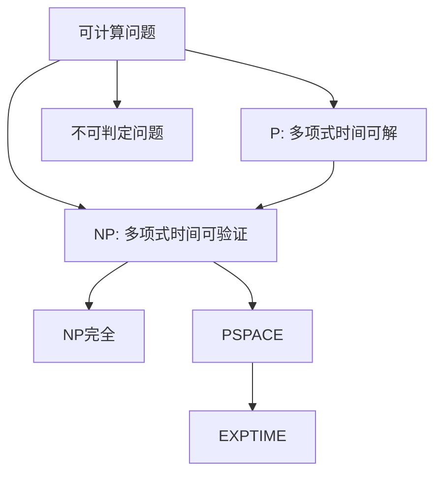
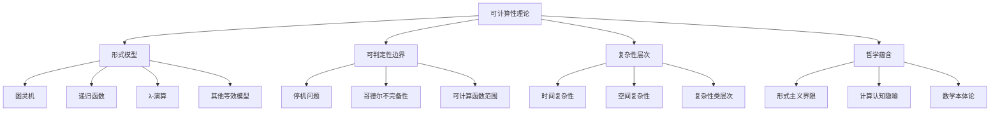
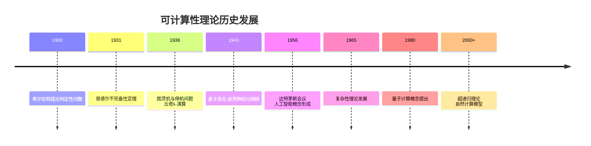
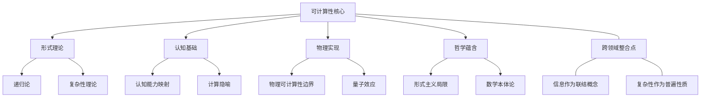

# 可计算性理论的多维视角：批判性哲科探索

## 目录

- [可计算性理论的多维视角：批判性哲科探索](#可计算性理论的多维视角批判性哲科探索)
  - [目录](#目录)
  - [1. 引言：可计算性的本质与边界](#1-引言可计算性的本质与边界)
  - [2. 历史脉络：可计算性概念的演变](#2-历史脉络可计算性概念的演变)
  - [3. 形式化基础](#3-形式化基础)
    - [3.1 可计算性模型的多元性](#31-可计算性模型的多元性)
    - [3.2 图灵机模型的形式化](#32-图灵机模型的形式化)
    - [3.3 递归函数理论](#33-递归函数理论)
    - [3.4 λ-演算与函数式视角](#34-λ-演算与函数式视角)
  - [4. 核心定理与其哲学蕴含](#4-核心定理与其哲学蕴含)
    - [4.1 停机问题与可判定性边界](#41-停机问题与可判定性边界)
    - [4.2 哥德尔不完备性定理的计算论解读](#42-哥德尔不完备性定理的计算论解读)
    - [4.3 丘奇-图灵论题：定义还是假说？](#43-丘奇-图灵论题定义还是假说)
    - [4.4 计算复杂性与效率边界](#44-计算复杂性与效率边界)
  - [5. 可计算性理论的认知维度](#5-可计算性理论的认知维度)
    - [5.1 可计算性与人类思维模型](#51-可计算性与人类思维模型)
    - [5.2 计算隐喻的认知科学解读](#52-计算隐喻的认知科学解读)
    - [5.3 直觉与形式化之间的张力](#53-直觉与形式化之间的张力)
  - [6. 跨学科视角与应用](#6-跨学科视角与应用)
    - [6.1 信息论的计算基础](#61-信息论的计算基础)
    - [6.2 人工智能的理论边界](#62-人工智能的理论边界)
    - [6.3 量子计算与经典可计算性边界的重探](#63-量子计算与经典可计算性边界的重探)
  - [7. 形而上学维度](#7-形而上学维度)
    - [7.1 数学柏拉图主义与可计算性](#71-数学柏拉图主义与可计算性)
    - [7.2 物理计算与自然中的计算边界](#72-物理计算与自然中的计算边界)
    - [7.3 超图灵计算：概念可能性与逻辑限制](#73-超图灵计算概念可能性与逻辑限制)
  - [8. 结论：可计算性作为认识论边界](#8-结论可计算性作为认识论边界)
  - [9. 附录](#9-附录)
    - [9.1 思维导图与概念图谱](#91-思维导图与概念图谱)
      - [可计算性理论的核心概念图](#可计算性理论的核心概念图)
      - [历史发展与理论联系](#历史发展与理论联系)
    - [9.2 重要定理的形式化证明](#92-重要定理的形式化证明)
    - [9.3 学习路径与研究方法](#93-学习路径与研究方法)
  - [10. 深入剖析：关键领域的前沿与争议](#10-深入剖析关键领域的前沿与争议)
    - [10.1 递归论的现代发展](#101-递归论的现代发展)
      - [10.1.1 计算度理论(Computability Degree Theory)](#1011-计算度理论computability-degree-theory)
      - [10.1.2 有限型计算理论](#1012-有限型计算理论)
    - [10.2 计算复杂性的认知解读](#102-计算复杂性的认知解读)
      - [10.2.1 复杂性类的认知相关性](#1021-复杂性类的认知相关性)
      - [10.2.2 交互证明系统与认知互动](#1022-交互证明系统与认知互动)
    - [10.3 量子可计算性的哲学问题](#103-量子可计算性的哲学问题)
      - [10.3.1 量子叠加与非决定论计算](#1031-量子叠加与非决定论计算)
      - [10.3.2 BQP与经典复杂性类的关系](#1032-bqp与经典复杂性类的关系)
    - [10.4 超经典计算模型的批判分析](#104-超经典计算模型的批判分析)
      - [10.4.1 超递归算法的理论局限](#1041-超递归算法的理论局限)
      - [10.4.2 无限性概念与计算边界](#1042-无限性概念与计算边界)
  - [11. 方法论反思：可计算性研究的多元进路](#11-方法论反思可计算性研究的多元进路)
    - [11.1 形式化与直觉的辩证关系](#111-形式化与直觉的辩证关系)
    - [11.2 跨学科整合的价值与挑战](#112-跨学科整合的价值与挑战)
    - [11.3 多元视角的认识论价值](#113-多元视角的认识论价值)
  - [12. 实践应用与前沿发展](#12-实践应用与前沿发展)
    - [12.1 可计算性理论在编程语言设计中的应用](#121-可计算性理论在编程语言设计中的应用)
      - [12.1.1 类型系统与可计算性](#1211-类型系统与可计算性)
      - [12.1.2 语言表达力与计算复杂度的权衡](#1212-语言表达力与计算复杂度的权衡)
    - [12.2 现代计算复杂性理论的突破](#122-现代计算复杂性理论的突破)
      - [12.2.1 通信复杂性与信息理论联系](#1221-通信复杂性与信息理论联系)
      - [12.2.2 平均复杂性与算法相变现象](#1222-平均复杂性与算法相变现象)
    - [12.3 非标准计算范式的理论基础](#123-非标准计算范式的理论基础)
      - [12.3.1 生物启发计算模型](#1231-生物启发计算模型)
      - [12.3.2 自组织系统中的涌现计算](#1232-自组织系统中的涌现计算)
  - [13. 整合与未来展望](#13-整合与未来展望)
    - [13.1 可计算性理论的统一图景](#131-可计算性理论的统一图景)
    - [13.2 开放问题与研究前沿](#132-开放问题与研究前沿)
    - [13.3 可计算性理论的长期意义](#133-可计算性理论的长期意义)
  - [14. 结语：多维视角的综合价值](#14-结语多维视角的综合价值)

## 1. 引言：可计算性的本质与边界

可计算性理论探索了算法过程的根本边界，它不仅是数学与计算机科学的理论支柱，更是认识论与形而上学思考的重要场域。本文将从多维度剖析可计算性理论的数学本质、哲学蕴含、历史脉络与认知基础，探讨"什么是可计算的"这一问题如何形塑了现代科学思维和技术发展。

与其将可计算性视为纯粹技术性概念，本文主张可计算性边界构成了人类思维与形式推理的认识论界限，它不仅标记着算法能力的范围，更成为理解心智、语言和形式系统本质的透镜。

## 2. 历史脉络：可计算性概念的演变

可计算性概念的历史演进反映了数学思维从具体计算到抽象形式化的转变轨迹。这一历史进程可分为以下关键阶段与人物贡献：

| 时期 | 关键人物 | 核心贡献 | 概念转向 |
|-----|---------|---------|---------|
| 1900-1930 | 希尔伯特 | 判定性问题(Entscheidungsproblem) | 从具体算法到形式决定程序的转变 |
| 1936-1937 | 图灵、丘奇、克莱尼 | 图灵机、λ-演算、递归函数 | 可计算性的多元等效形式化 |
| 1940-1950 | 冯·诺依曼、戈德尔 | 存储程序计算机、不完备性定理与可计算性的关联 | 从理论到物理实现的桥接 |
| 1950-1970 | 拉宾、萨克斯 | 自动机理论、复杂性层次 | 可计算性到复杂性的扩展 |
| 1980-现在 | 彭罗斯、丘奇兰德 | 物理可计算性、超递归性 | 可计算性概念的物理与认知扩展 |

值得注意的是，可计算性概念的早期发展主要源于数学基础危机的应对，而非为创建计算机科学而设计。图灵的原初意图是解答希尔伯特提出的判定性问题，而非设计现代计算机的抽象模型。这种数学动机到技术应用的转变，展示了纯理论研究如何意外地孕育出变革性技术范式。

## 3. 形式化基础

### 3.1 可计算性模型的多元性

可计算性理论的一个引人注目的特点是不同形式化模型之间的等效性。这些看似截然不同的模型都精确捕捉了同一个直觉概念—"可有效计算"：

```math
计算模型等价性关系：
图灵机 ⟷ 递归函数 ⟷ λ-演算 ⟷ 马尔科夫算法 ⟷ 寄存器机 ⟷ ...
```

这种等价性被称为"计算模型的鲁棒性"，暗示了可计算性似乎是一个自然出现的数学边界，而非人为构造的概念。这一观察支持了丘奇-图灵论题的直觉基础，但同时也引发了关于为何所有这些不同路径都收敛到同一计算能力边界的深层次哲学问题。

### 3.2 图灵机模型的形式化

图灵机提供了可计算性最直观的形式化表述，它的优雅之处在于使用最小化的组件捕捉了算法计算的本质：

```math
图灵机的形式定义：
M = (Q, Γ, b, Σ, δ, q₀, F) 其中:
- Q: 有限状态集
- Γ: 有限带字母表
- b ∈ Γ: 空白符号
- Σ ⊆ Γ\{b}: 输入字母表
- δ: Q × Γ → Q × Γ × {L,R}: 转移函数
- q₀ ∈ Q: 初始状态
- F ⊆ Q: 接受状态集
```

图灵机模型的核心洞见在于识别出计算过程可被还原为：有限状态控制、无限存储介质以及简单操作规则的组合。这一简化不仅有助于形式分析，更揭示了复杂计算行为可以从简单规则涌现的本质。

### 3.3 递归函数理论

递归函数理论提供了可计算性的纯数学视角，它以原始递归函数和μ-递归运算符为基础，构建了一个自包含的计算理论：

```math
递归函数理论的基本构件:
1. 基础函数:
   - 零函数: Z(x) = 0
   - 后继函数: S(x) = x + 1
   - 投影函数: Pₙᵢ(x₁,...,xₙ) = xᵢ

2. 函数构造规则:
   - 复合: h(x) = f(g₁(x),...,gₙ(x))
   - 原始递归: 
     f(0,x) = g(x)
     f(n+1,x) = h(n,x,f(n,x))
   - μ-运算符(最小化):
     f(x) = μy[g(x,y) = 0]
```

这种表达方式与传统数学更为一致，展示了如何从纯粹的数论角度构建计算概念，无需诉诸机器或算法的直觉概念。

### 3.4 λ-演算与函数式视角

λ-演算提供了函数式计算模型，强调函数作为"第一类公民"的计算范式：

```math
λ-演算的核心规则:
1. 语法:
   - 变量: x, y, z...
   - 抽象: λx.M (其中M是λ表达式)
   - 应用: M N (其中M和N是λ表达式)

2. 转换规则:
   - α-转换: 重命名约束变量
   - β-规约: (λx.M)N → M[x:=N]
   - η-转换: λx.M x → M (当x不在M中自由出现)
```

λ-演算的独特贡献在于展示计算可以完全基于函数抽象与应用这两个纯粹操作进行表达，无需引入状态、存储或指令序列等概念。这一视角对编程语言设计产生了深远影响，催生了整个函数式编程范式。

## 4. 核心定理与其哲学蕴含

### 4.1 停机问题与可判定性边界

停机问题（Halting Problem）是可计算性理论中最具标志性的结果，它确立了算法能力的根本边界：

**定理**: 不存在算法能对所有可能的程序-输入对判定该程序是否会在给定输入上停机。

**形式化证明概要**:

```math
假设存在停机判定器H，对任意程序p和输入i:
H(p,i) = {
  1 若p在输入i上停机
  0 若p在输入i上不停机
}

构造程序D:
D(p) = {
  如果H(p,p)=1,则进入无限循环
  如果H(p,p)=0,则立即停机
}

考虑D(D)会发生什么:
- 若D(D)停机，则根据D的定义，H(D,D)=0，意味着D(D)不停机 → 矛盾
- 若D(D)不停机，则根据D的定义，H(D,D)=1，意味着D(D)停机 → 矛盾

因此假设不成立，H不存在。
```

停机问题的不可解性展示了形式系统内的基本认知限制，揭示即使在严格定义的形式世界中，也存在原则上无法通过算法方式回答的问题。这一结果与哥德尔不完备性定理共同构成了20世纪数学思想的重大转向，挑战了希尔伯特纲领中形式主义的乐观愿景。

### 4.2 哥德尔不完备性定理的计算论解读

哥德尔不完备性定理与可计算性理论之间存在深刻联系，两者都探索了形式系统的根本限制：

**定理(计算论表述)**: 任何包含基本算术且具有可计算公理集的形式系统，都存在真命题无法在该系统内证明。

可计算性视角提供了不完备性的另一解读：如果一个形式系统足够强大到能表达算术，那么该系统就足以"反射"自身的元性质，从而能够构造自指陈述，导致语义与语法之间的不可避免鸿沟。

### 4.3 丘奇-图灵论题：定义还是假说？

丘奇-图灵论题关联了直觉计算概念与形式化模型：

> "任何'有效方法'都能由图灵机计算"或等价地"任何直觉上可计算的函数都是递归的"。

这一论题的认知地位一直备受争议：它既非数学定理(因为"直觉上可计算"无法形式化)，也非经验假设(因为反例无法构造)。从认识论角度，它可被视为形式化可计算性概念的"理想边界条件"，而非可证明的命题。

不同思想家对此持有不同看法：

| 观点持有者 | 论题解读 | 理论立场 |
|-----------|---------|---------|
| 图灵      | 经验假说 | 机械主义 |
| 克莱尼    | 工作定义 | 形式主义 |
| 丘奇      | 数学定义 | 构造主义 |
| 甘泽尔    | 自然法则 | 物理主义 |
| 彭罗斯    | 可驳假说 | 非算法主义 |

重要的是，这一论题隐含了对计算本质的本体论承诺，以及对"算法"和"有效过程"概念的界定。

### 4.4 计算复杂性与效率边界

虽然可计算性理论确立了"什么能被计算"的边界，计算复杂性理论则探索了"什么能被高效计算"的限制：



P≟NP问题代表了算法效率的核心谜题，涉及创造性搜索本质上是否可还原为验证过程。从认知科学角度看，这一问题与人类直觉、创造力和理解力的本质密切相关，暗示了某些认知过程可能本质上无法通过简单的计算加速。

## 5. 可计算性理论的认知维度

### 5.1 可计算性与人类思维模型

可计算性模型不仅是数学构造，也可视为人类思维过程的形式化反映。图灵在设计其计算模型时，明确以人类计算者的心理过程为灵感来源，试图捕捉人类"按照明确规则进行计算"的认知模式：

```math
人类计算者 → 图灵机抽象
- 短期记忆 → 内部状态
- 纸笔记录 → 无限纸带
- 注意焦点 → 读写头位置
- 计算规则 → 转移函数
```

这一映射揭示了可计算性与认知结构间的同构关系，但也引发对人类思维是否真能简化为机械计算过程的质疑。

### 5.2 计算隐喻的认知科学解读

认知科学的计算主义范式将思维视为一种计算过程，从可计算性理论中汲取核心隐喻：

> "认知即信息处理"，"心智即程序"

这一视角的优势在于提供了心智过程的精确形式化理论，但同时被批评忽视了身体性、情境性和非算法性认知特征。可计算性理论在这里既是概念资源，也可能构成认识论局限。

图灵机模型与认知架构的对应关系体现出形式化与认知直觉间的复杂相互塑造。例如，工作记忆容量有限与内部状态集有限性之间存在潜在联系，但人类的上下文敏感理解能力与纸带模型之间存在明显鸿沟。

### 5.3 直觉与形式化之间的张力

可计算性理论的历史发展展示了数学直觉与形式化之间的辩证关系：

1. **直觉启发形式化**：图灵基于对人类计算过程的直觉理解，开发了形式化图灵机
2. **形式化反过来重塑直觉**：一旦形式化建立，"计算"和"算法"的直觉概念本身被重新定义
3. **新直觉推动新形式化**：量子计算和自然计算等新范式挑战了经典可计算性边界

这种互动突显了认知与形式系统之间的相互构造关系，挑战了数学客观性的简单假设。

## 6. 跨学科视角与应用

### 6.1 信息论的计算基础

可计算性理论与信息论形成了互补视角，共同界定了形式化认知的边界：

- 可计算性理论关注**程序能力边界**："什么能被算法实现？"
- 信息论关注**通信与表示边界**："什么能被编码传输？"

香农信息熵与算法信息理论(如Kolmogorov复杂度)之间的联系体现了这两个领域的交叉：

```math
K(x) ≈ 程序p的长度，p是生成x的最短程序
```

这一联系揭示了数据压缩与算法概念之间的深层关系，指向信息与计算作为自然世界基础概念的可能性。

### 6.2 人工智能的理论边界

可计算性理论为人工智能能力提供了形式边界，但同时也带来概念挑战：

1. **强可计算性边界**：某些问题原则上AI无法解决(如解决所有程序的停机问题)
2. **复杂性边界**：某些问题虽可计算但需指数时间(如NP难问题的精确解)
3. **认知建模张力**：人类智能与形式计算模型之间的映射不完美

围绕人工通用智能(AGI)的争论深受可计算性概念的影响，特别是在考虑意识、创造力等高级认知功能时，传统计算模型的适用性成为核心争议点。

### 6.3 量子计算与经典可计算性边界的重探

量子计算模型引入了对经典可计算性边界的重新思考：

```math
量子比特: |ψ⟩ = α|0⟩ + β|1⟩, 其中|α|² + |β|² = 1
```

关键问题包括：

- 量子计算是否真正超越图灵机计算能力？
- BQP与NP的关系是什么？
- 量子特性(如叠加、纠缠)是否暗示了对计算本质的更基础理解？

虽然量子计算提供了某些问题(如整数分解)的多项式算法，但当前证据表明它仍受制于可计算性的基本边界，尚未跨越图灵可计算性阈值。然而，它确实扩展了高效可计算性的范围，挑战了经典复杂性层次理论。

## 7. 形而上学维度

### 7.1 数学柏拉图主义与可计算性

可计算性边界与数学本体论之间存在微妙关联：如果数学对象具有柏拉图式独立存在，那么不可计算函数(如停机问题的解决方案)也可能具有某种"理想存在"。

这引发了几个关键问题：

- 数学真理是被发现还是被构造？
- 不可计算对象是否"真实存在"？
- 认知局限是否暗示本体论局限？

可计算性理论在这里提供了一个独特镜头，通过它我们可以反思数学真理、认识论局限与本体论承诺之间的复杂关系。

### 7.2 物理计算与自然中的计算边界

自然过程与计算模型之间的映射引发了关于物理计算边界的探讨：

- **物理丘奇-图灵论题**：任何物理可实现的计算过程都可被图灵机模拟
- **物理可逆性**与信息保存
- **量子力学**与计算能力的关系

这些问题挑战了传统的计算观念，从工具性构造转向自然基本过程的可能解释框架，暗示计算可能不仅是人类发明，还可能是自然世界的组织原理之一。

### 7.3 超图灵计算：概念可能性与逻辑限制

超图灵计算模型探索了超越经典可计算性边界的理论可能性：

- **超递归算法**：修改经典计算模型限制的理论构造
- **模拟计算**：利用无限精度物理量进行超图灵计算的概念
- **互动计算**：通过无限环境交互获取信息的计算模式

这些模型引发对可计算性定义本身的反思，但同时面临逻辑一致性和物理可实现性的严峻挑战。它们的主要价值可能在于提供理论洞见，而非实际计算范式。

## 8. 结论：可计算性作为认识论边界

可计算性理论标记着形式推理能力的根本边界，它既是数学的技术成果，也是认识论的哲学里程碑。通过界定"什么能被算法化"，它同时也界定了形式理性本身的范围。

关键洞见包括：

1. 可计算性边界不仅是数学构造，也反映了人类认知与形式推理的基本结构
2. 计算模型的多样性与等效性暗示了某种"自然发生"的计算边界
3. 不可计算性结果揭示了形式系统内部的根本认知限制
4. 计算隐喻同时是认知科学的资源和局限
5. 可计算性概念持续演化，受到新计算模式和物理理解的挑战

可计算性理论的未来发展方向可能包括：深化与物理理论的整合、探索非经典计算模型、重新审视计算与认知的关系，以及扩展到信息与复杂性的更广泛领域。

## 9. 附录

### 9.1 思维导图与概念图谱

#### 可计算性理论的核心概念图



#### 历史发展与理论联系



### 9.2 重要定理的形式化证明

**停机问题不可判定性的严格证明**:

```math
定义 HALT = {⟨M,w⟩ | M是图灵机且在输入w上停机}

证明 HALT是不可判定的:

假设存在图灵机H判定HALT，即H在输入⟨M,w⟩上:
- 如果M在w上停机，H接受
- 如果M在w上不停机，H拒绝

构造图灵机D，对输入⟨M⟩:
1. 运行H于⟨M,⟨M⟩⟩
2. 如果H接受，则进入无限循环
3. 如果H拒绝，则停机并接受

考虑D在输入⟨D⟩上的行为:
- 若D在⟨D⟩上停机，则根据D的定义，H拒绝⟨D,⟨D⟩⟩，意味着D在⟨D⟩上不停机 → 矛盾
- 若D在⟨D⟩上不停机，则根据D的定义，H接受⟨D,⟨D⟩⟩，意味着D在⟨D⟩上停机 → 矛盾

因此假设不成立，HALT是不可判定的。
```

这一证明展示了对角线方法在可计算性理论中的核心应用，同时也体现了自指与悖论在设定形式系统根本限制中的关键作用。

### 9.3 学习路径与研究方法

可计算性理论的多维学习可采取以下路径：

1. **数学基础路径**：从集合论 → 形式语言 → 图灵机 → 递归论 → 复杂性理论
2. **哲学路径**：从希尔伯特纲领 → 哥德尔定理 → 丘奇-图灵论题 → 计算哲学
3. **计算机科学路径**：从算法设计 → 自动机理论 → 形式语言 → 计算模型 → 复杂性
4. **认知科学路径**：从计算认知模型 → 表征理论 → 心智哲学 → 人工智能边界

研究方法的多元性对于全面理解可计算性至关重要，应结合:

- 形式证明与数学分析
- 历史语境探究
- 哲学概念分析
- 跨学科整合

这种多维探索不仅丰富了对可计算性的理解，也揭示了形式理论与人类认知、科技发展和哲学思想之间的深刻联系。

## 10. 深入剖析：关键领域的前沿与争议

### 10.1 递归论的现代发展

递归论作为可计算性研究的数学核心，近几十年经历了显著扩展：

#### 10.1.1 计算度理论(Computability Degree Theory)

图灵归约与可计算度构成了理解相对可计算性的精确框架：

```math
定义：A ≤ₜ B（A图灵可归约到B）当且仅当存在以B为谕言的图灵机可以计算A

性质：
- 图灵度[d]是满足 ∀A,B ∈ [d], A ≡ₜ B 的等价类
- 图灵度构成偏序结构 D = ⟨𝒟, ≤⟩
```

这一数学结构不仅刻画了计算问题之间的相对复杂性，还揭示了不可计算对象之间存在精确的复杂性层次。此结构的丰富性令人惊讶，Post问题、有限伤害理论和优先级方法等研究显示了算法不可解问题中存在细致的内部结构。

#### 10.1.2 有限型计算理论

有限型计算理论扩展了传统递归论，融合类型论与计算模型：

```math
Martin-Löf类型论中的计算对应:
Π-类型 ~ 全称量化
Σ-类型 ~ 存在量化
Id-类型 ~ 等同性命题
```

这一领域建立了直觉构造主义数学与计算之间的形式联系，为设计依赖类型系统的编程语言(如Coq、Agda)提供了理论基础。它支持"命题即类型，证明即程序"的Curry-Howard同构，展现了逻辑与计算之间的深层统一性。

### 10.2 计算复杂性的认知解读

#### 10.2.1 复杂性类的认知相关性

复杂性层次与认知过程类型之间存在潜在对应关系：

| 复杂性类 | 特征 | 认知过程对应 |
|---------|------|------------|
| P | 多项式时间可解 | 机械化思维、程序化推理 |
| NP | 多项式时间可验证 | 洞察力、创造性思维 |
| PSPACE | 多项式空间可解 | 深度推理、思想实验 |
| EXPTIME | 指数时间可解 | 系统性探索、穷举分析 |
| 不可判定 | 算法无解 | 开放式创造、语义理解 |

这种映射并非严格对应，但提供了理解认知能力不同层次的有益框架。例如，NP完全问题与创造性思维的类比揭示了"找到解"比"验证解"困难得多的认知现象。

#### 10.2.2 交互证明系统与认知互动

交互证明系统(Interactive Proof Systems)提供了对认知交流本质的形式化视角：

```math
IP = {L | L有交互证明系统}
```

这类系统表明，即使验证者计算能力有限，通过与更强大的证明者交互，也能可靠地验证超出自身计算能力的命题。这一现象与科学知识传递、教学过程中的专家-学习者互动模式存在深刻类比，暗示了交互在克服认知局限方面的核心作用。

### 10.3 量子可计算性的哲学问题

#### 10.3.1 量子叠加与非决定论计算

量子计算引入了经典计算理论中缺席的概率与叠加维度：

```math
|ψ⟩ = Σᵢ αᵢ|i⟩, 其中 Σᵢ |αᵢ|² = 1
```

这种模型挑战了计算作为确定性过程的传统观念，引发了关于非决定论计算本质的哲学问题：

- 概率是计算的本质特性还是仅为实现细节？
- 量子并行性是真实物理资源还是概念构造？
- 测量问题如何影响计算理论的基础概念？

#### 10.3.2 BQP与经典复杂性类的关系

量子复杂性类BQP(有界错误量子多项式时间)与经典复杂性类之间的精确关系仍是开放问题：

```math
已知关系: P ⊆ BPP ⊆ BQP ⊆ PSPACE
开放问题: P =? BQP, NP ⊆? BQP
```

Shor算法对整数分解问题的多项式时间解法暗示BQP可能包含NP中的某些问题，但当前证据表明量子计算可能构成介于P与NP之间的"中间地带"，而非全面超越经典可计算性边界。

### 10.4 超经典计算模型的批判分析

#### 10.4.1 超递归算法的理论局限

超递归计算模型尝试形式化超越图灵机能力的计算概念：

```math
实例:
- 加速图灵机: 每步操作时间减半，允许无限步骤在有限时间内完成
- 无限时间图灵机: 允许序数次计算步骤
- 模拟递归函数: 操作无限精度实数
```

这些模型面临严峻的理论批判：

1. **物理实现性问题**：违反已知物理定律(如能量守恒)
2. **逻辑一致性挑战**：蕴含数学上的悖论或非标准语义
3. **认知相关性问题**：与人类实际认知能力的关联不明确

#### 10.4.2 无限性概念与计算边界

计算理论中的无限概念涉及潜无限与实无限的古典哲学区分：

- **潜无限**：计算过程可以无限延续(如图灵机无限带子)
- **实无限**：无限作为已完成的整体(如超递归模型中的无限步骤)

这一区分反映了不同数学哲学立场对可计算性边界的影响。构造主义倾向于仅接受潜无限，而超递归模型通常预设某种形式的实无限，引发关于其数学合法性的争议。

## 11. 方法论反思：可计算性研究的多元进路

### 11.1 形式化与直觉的辩证关系

可计算性理论的发展体现了形式化与直觉理解之间的复杂互动：

1. **正向影响**：形式化使直觉概念精确化，消除模糊性

   ```math
   "有效过程"(直觉概念) → 图灵机(形式化) → "图灵可计算"(精确概念)
   ```

2. **反向塑造**：形式化后的概念反过来重塑直觉理解

   ```math
   图灵停机问题 → 重新定义"可解决性"直觉 → 影响问题表述方式
   ```

3. **创造性张力**：直觉与形式化之间的鸿沟催生新观念

   ```math
   量子计算直觉 ↔ 经典计算形式化 → 新计算概念空间
   ```

这种辩证关系提醒我们，形式化不仅是对预先存在直觉的捕捉，也是主动构造概念的过程，体现了语言与思维的互构性。

### 11.2 跨学科整合的价值与挑战

可计算性理论的跨学科研究面临方法论整合的显著挑战：

| 学科视角 | 主要方法论 | 核心问题意识 | 整合困难 |
|---------|----------|-------------|---------|
| 数学 | 形式证明、结构分析 | 一致性、完备性 | 数学严格性与其他领域灵活性的张力 |
| 哲学 | 概念分析、思想实验 | 本体论承诺、认识论限制 | 与形式严格性的兼容性问题 |
| 计算机科学 | 算法设计、复杂度分析 | 效率、实现性 | 理论抽象与实践关注的平衡 |
| 认知科学 | 实验研究、模型构建 | 解释力、预测能力 | 形式模型与实证发现的鸿沟 |

成功的跨学科整合需要:

1. 发展共享概念词汇并明确各学科特定用法
2. 识别各学科方法论的互补性而非试图统一方法
3. 构建允许多层次解释的整合性理论框架
4. 避免简单还原主义，承认不同层次现象的相对自主性

### 11.3 多元视角的认识论价值

对可计算性的多维理解提供了认识论上的独特优势：

1. **互补性**：不同视角揭示可计算性的不同方面

   ```math
   形式视角：结构精确性
   历史视角：概念演化连续性
   哲学视角：基础假设批判性
   认知视角：人类理解相关性
   ```

2. **抗错性**：多视角交叉验证增强理论稳健性

   ```math
   当形式化理论与认知模型、物理实现可能性及历史发展轨迹相一致时，
   我们对该理论的信任度更高
   ```

3. **创新性**：视角交叉是新思想的催化剂

   ```math
   物理学 × 计算理论 → 量子计算
   认知科学 × 计算复杂性 → 认知复杂性概念
   ```

这种多元视角方法不仅丰富了对可计算性的理解，也提供了面对该领域开放问题的更全面策略。

## 12. 实践应用与前沿发展

### 12.1 可计算性理论在编程语言设计中的应用

可计算性原理深刻影响了编程语言的设计哲学和实现策略：

#### 12.1.1 类型系统与可计算性

类型系统理论直接源于可计算性基础：

```math
简单类型λ-演算与直觉类型论:
Γ ⊢ e : τ  表示在上下文Γ中，表达式e具有类型τ
```

可计算性视角帮助解释不同类型系统设计决策的理论含义：

- 图灵完备语言允许所有可计算函数的表达(但包含不确定终止性)
- 全依赖类型系统牺牲图灵完备性以获得强终止保证
- 线性类型系统将资源使用模式编码到类型结构中

#### 12.1.2 语言表达力与计算复杂度的权衡

编程语言设计包含表达力与多种实际关注点之间的复杂权衡：

```math
表达力增加 → 自动分析难度增加
安全保证增强 → 表达某些模式的难度增加
抽象级别提高 → 性能控制难度增加
```

可计算性理论解释了这些权衡的根本原因，例如，Rice定理证明了程序一般性质的不可判定性，解释了为什么静态分析工具总是存在固有限制。

### 12.2 现代计算复杂性理论的突破

#### 12.2.1 通信复杂性与信息理论联系

通信复杂性研究多方计算情境下信息传输的根本限制：

```math
定义：D(f)是计算函数f所需的最小通信位数
```

该领域揭示了信息传递与计算能力之间的深层联系，提供了理解分布式计算、数据压缩和量子纠缠等现象的统一框架。

#### 12.2.2 平均复杂性与算法相变现象

复杂性理论的现代发展聚焦于理解问题难度的更精细结构：

```math
相变现象：
对于许多NP完全问题，存在参数临界值c，使得:
- 当约束密度 < c时，问题几乎总是易解
- 当约束密度 > c时，问题几乎总是难解
```

这种"算法相变"现象表明，复杂性类别可能过于粗糙，无法捕捉问题难度的细微差别。这一领域借鉴了统计物理学概念，为复杂性理论注入了新的分析工具。

### 12.3 非标准计算范式的理论基础

#### 12.3.1 生物启发计算模型

生物系统的计算能力激发了新型计算模型的发展：

```math
DNA计算: 利用DNA分子作为信息载体的计算
P系统: 受细胞结构启发的膜计算模型
神经形态计算: 模拟神经网络结构的计算架构
```

这些模型引发关于可计算性本质的新思考：它们中的大多数被证明等价于图灵机，支持了丘奇-图灵论题的稳健性；然而，它们的效率特性和物理实现方式提供了全新计算视角。

#### 12.3.2 自组织系统中的涌现计算

复杂系统的涌现行为提出了关于计算本质的深层问题：

```math
涌现计算特征:
- 局部简单规则产生全局复杂行为
- 无中央控制器的分布式信息处理
- 通过反馈循环实现的自适应行为
```

这些系统挑战了计算的传统理解，提出了"计算"可能是特定类型系统的内在特性，而非外部施加的程序。这一视角将计算与复杂性科学、系统论和认识论深度连接。

## 13. 整合与未来展望

### 13.1 可计算性理论的统一图景

可计算性理论的多维理解可通过以下整合框架来统一：



这一整合图景突显信息与复杂性作为连接不同维度的核心概念，表明可计算性理论不仅是一套技术结果，更是理解认知、物理和数学结构之间关系的基本框架。

### 13.2 开放问题与研究前沿

可计算性理论面临的关键开放问题包括：

1. **P vs NP**：计算复杂性的核心问题，关联创造性思维本质
2. **物理可计算性边界**：现实物理约束下的计算极限
3. **量子复杂性与经典复杂性的精确关系**：BQP与经典复杂性类的包含关系
4. **交互式计算模型的能力边界**：开放系统计算能力的形式化表征
5. **认知计算边界**：人类思维能力与形式计算能力的映射关系

这些问题跨越了形式理论、物理科学、认知科学和哲学，需要多学科方法才能取得实质进展。

### 13.3 可计算性理论的长期意义

可计算性理论的持久价值超越了其技术内容，体现在以下方面：

1. **认识论示范**：展示了形式化如何精确刻画知识边界，为其他知识领域提供方法论启示
2. **概念变革**：重塑了"算法"、"计算"和"可解决性"等基础概念，深刻影响了现代科技文化
3. **学科整合**：连接了数学、计算机科学、物理学和认知科学，催生了新的跨学科研究领域
4. **技术基础**：为现代计算技术奠定了理论基石，指导软件系统和编程语言的发展
5. **哲学价值**：为理解形式化系统局限性、创造性本质和数学基础提供了关键洞见

在更广泛的文化背景中，可计算性理论体现了人类对自身认知能力的反思性探索，展现了形式思维的力量与限制，为人类认识自我提供了独特视角。

## 14. 结语：多维视角的综合价值

可计算性理论的多维理解不仅丰富了我们对这一领域的认识，也揭示了知识探索本身的复杂性。
通过整合形式数学、认知科学、哲学反思和历史脉络，我们获得了对可计算性更为立体、深刻的理解。

这种多维视角超越了单一学科的局限，揭示了可计算性概念如何同时体现了数学的严格性、认知的根源性、哲学的深度和历史的延续性。
通过这一整合理解，我们不仅看到了理论本身的丰富内涵，也领略了人类思维在面对自身能力边界时展现的创造性与反思性。

可计算性理论的进一步发展将继续受益于这种多维整合视角，在形式严谨性与哲学深度之间保持批判性平衡，既承认形式化的力量，也警惕其局限，从而推动我们对计算本质和认知边界的理解迈向新高度。
