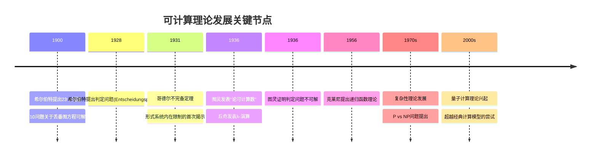
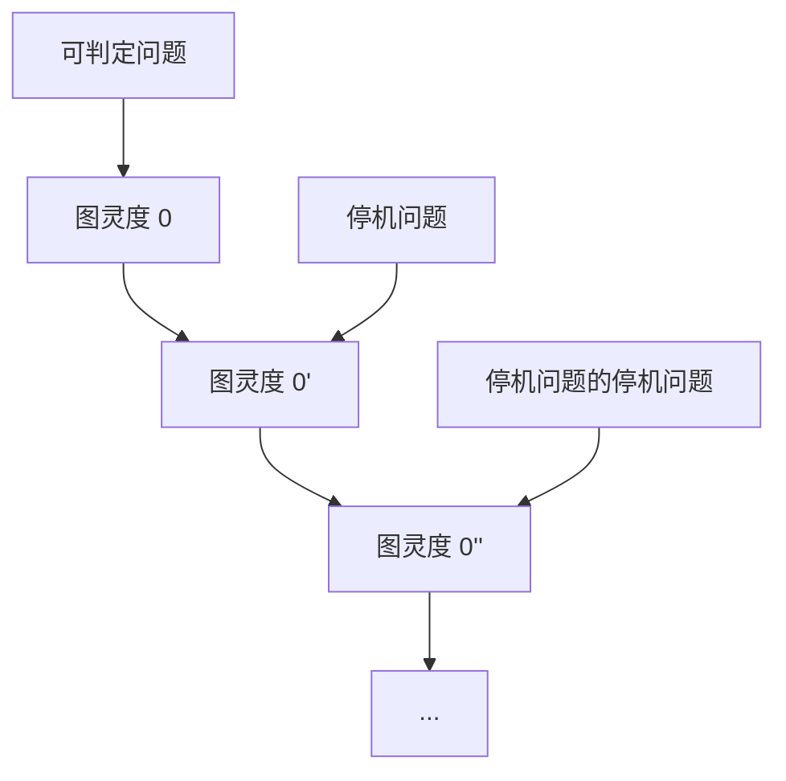
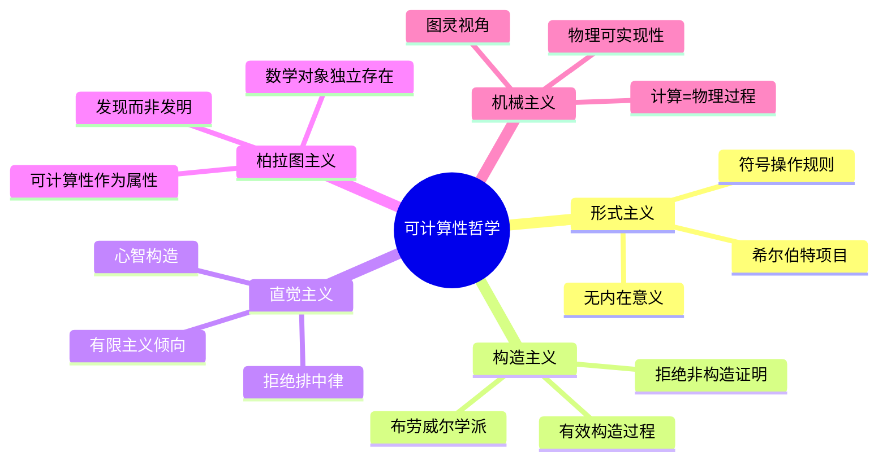
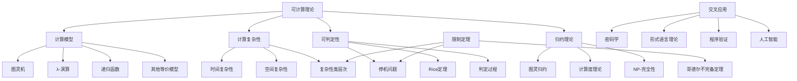

# 可计算理论的多维视角：批判性哲科探索

## 目录

- [可计算理论的多维视角：批判性哲科探索](#可计算理论的多维视角批判性哲科探索)
  - [目录](#目录)
  - [引言：可计算性的本质问题](#引言可计算性的本质问题)
  - [历史视角：从希尔伯特项目到图灵革命](#历史视角从希尔伯特项目到图灵革命)
    - [主要历史人物视角比较](#主要历史人物视角比较)
  - [形式基础：可计算性的数学模型](#形式基础可计算性的数学模型)
    - [3.1 图灵机模型](#31-图灵机模型)
    - [3.2 λ-演算](#32-λ-演算)
    - [3.3 递归函数理论](#33-递归函数理论)
    - [3.4 模型等价性](#34-模型等价性)
  - [核心定理与极限](#核心定理与极限)
    - [4.1 停机问题与不可判定性](#41-停机问题与不可判定性)
    - [4.2 哥德尔不完备定理与可计算性](#42-哥德尔不完备定理与可计算性)
    - [4.3 归约与可计算度层级](#43-归约与可计算度层级)
    - [4.4 Rice定理与语义属性](#44-rice定理与语义属性)
  - [计算复杂性视角](#计算复杂性视角)
    - [5.1 复杂性类别与边界](#51-复杂性类别与边界)
    - [5.2 P vs NP问题的哲学内涵](#52-p-vs-np问题的哲学内涵)
  - [认知维度：可计算性与思维](#认知维度可计算性与思维)
    - [6.1 思维作为计算过程](#61-思维作为计算过程)
    - [6.2 认知结构与计算模型的映射](#62-认知结构与计算模型的映射)
    - [6.3 表征系统的限制与潜能](#63-表征系统的限制与潜能)
  - [哲学诠释：存在论与认识论问题](#哲学诠释存在论与认识论问题)
    - [7.1 形式主义与构造主义视角](#71-形式主义与构造主义视角)
    - [7.2 物理可计算性问题](#72-物理可计算性问题)
    - [7.3 教条主义危机与超越图灵限制的可能性](#73-教条主义危机与超越图灵限制的可能性)
  - [交叉领域：计算作为跨学科概念](#交叉领域计算作为跨学科概念)
    - [8.1 量子计算与经典可计算性的边界](#81-量子计算与经典可计算性的边界)
    - [8.2 计算与信息的本体论关系](#82-计算与信息的本体论关系)
    - [8.3 人工智能的计算基础与限制](#83-人工智能的计算基础与限制)
  - [批判性反思：可计算理论的自我参照问题](#批判性反思可计算理论的自我参照问题)
  - [结论：开放问题与未来方向](#结论开放问题与未来方向)
  - [附录：形式化表示与证明示例](#附录形式化表示与证明示例)
    - [停机问题不可判定的形式化证明](#停机问题不可判定的形式化证明)
    - [可计算理论核心概念图](#可计算理论核心概念图)

## 引言：可计算性的本质问题

可计算性理论探究的核心问题是：什么是"可计算"？这一看似简单的问题挑战了数学、哲学和认知科学的基础。
本文从多维视角审视可计算性理论，既关注其形式化内核，也探讨其哲学内涵和认知基础。

可计算性不仅是算法设计的理论基础，也是人类思维边界的形式化表达。
通过研究可计算性，我们实际上在探索人类认知和形式系统的根本限制。

## 历史视角：从希尔伯特项目到图灵革命

可计算理论的发展脉络反映了20世纪数学基础危机的核心困境与突破：



### 主要历史人物视角比较

| 人物 | 核心贡献 | 方法论立场 | 对可计算性的解读 |
|------|---------|------------|----------------|
| 希尔伯特 | 形式化项目、判定问题 | 形式主义 | 数学问题应存在机械决定程序 |
| 哥德尔 | 不完备定理 | 柏拉图主义 | 真理超越形式系统 |
| 图灵 | 图灵机、停机问题 | 机械主义 | 算法即明确机械过程 |
| 丘奇 | λ-演算、丘奇论题 | 构造主义倾向 | 可计算即λ-可定义 |
| 克莱尼 | 递归函数理论 | 形式主义 | 可计算即原始递归+μ算子 |
| 波斯特 | 生产系统 | 形式主义 | 计算即符号重写 |
| 莱布尼茨 | 普遍特征(先驱) | 理性主义 | 计算即符号推理 |

## 形式基础：可计算性的数学模型

### 3.1 图灵机模型

图灵机作为可计算性标准模型，其形式化定义为七元组$M = (Q, \Gamma, b, \Sigma, \delta, q_0, F)$，其中：

- $Q$：有限状态集
- $\Gamma$：有限符号集（磁带字母表）
- $b \in \Gamma$：空白符号
- $\Sigma \subseteq \Gamma \setminus \{b\}$：输入字母表
- $\delta: Q \times \Gamma \to Q \times \Gamma \times \{L,R\}$：转移函数
- $q_0 \in Q$：初始状态
- $F \subseteq Q$：接受状态集

图灵机的核心特征在于其状态转换的确定性与计算的潜在无限性。这种张力体现了有限与无限、离散与连续的哲学二元性。

### 3.2 λ-演算

λ-演算是一种基于函数抽象和应用的形式系统，语法定义如下：

```math
<expression> ::= <name> | <function> | <application>
<function> ::= λ<name>.<expression>
<application> ::= (<expression><expression>)
```

三条基本规则：

1. α-变换：变量重命名
2. β-归约：函数应用 (λx.E)F → E[F/x]
3. η-变换：λx.(Ex) → E (当x不在E中自由出现)

λ-演算体现了计算本质上是关于替换和变换的过程，这种视角突显了可计算性与语言能力的内在联系。

### 3.3 递归函数理论

递归函数理论从最简单的函数出发，通过组合、原始递归和μ-递归构建所有可计算函数：

1. 基本函数：
   - 零函数：Z(x) = 0
   - 后继函数：S(x) = x + 1
   - 投影函数：$P^n_i(x_1,\ldots,x_n) = x_i$

2. 构造方法：
   - 组合：g(h₁(x), ..., hₘ(x))
   - 原始递归：{ f(0,x) = g(x); f(n+1,x) = h(n,f(n,x),x) }
   - μ-递归：μy[R(x,y)=0]（最小y使R(x,y)=0）

克莱尼-递归函数定义体现了可计算性的归纳构造特性，强调了可计算性与数学归纳法的本质联系。

### 3.4 模型等价性

丘奇-图灵论题指出，上述所有计算模型及其变体都描述了相同的可计算函数类别。这一等价性具有深刻哲学意义：它暗示可计算性是一个自然、稳健的数学概念，不依赖于特定形式化方法。

```math
图灵机 ⟺ λ-演算 ⟺ 递归函数 ⟺ Post系统 ⟺ 寄存器机 ⟺ ...
```

这种等价性并非形式证明，而是通过相互模拟建立，因此丘奇-图灵论题更接近一种哲学论题而非数学定理。

## 核心定理与极限

### 4.1 停机问题与不可判定性

**定理**：停机问题是不可判定的。即不存在算法A，对于任意程序P和输入I，A能判定P在输入I上是否会停机。

**形式化证明概要**：
假设存在解决停机问题的图灵机H，对于任意程序编码⟨P⟩和输入I：

- H(⟨P⟩, I) = 1 如果P(I)停机
- H(⟨P⟩, I) = 0 如果P(I)不停机

构造图灵机D，接受程序编码⟨P⟩作为输入：

- 如果H(⟨P⟩, ⟨P⟩) = 1，则D进入无限循环
- 如果H(⟨P⟩, ⟨P⟩) = 0，则D立即停机

考虑D对自身编码的行为D(⟨D⟩)：

- 如果D(⟨D⟩)停机，则由D的定义，H(⟨D⟩, ⟨D⟩) = 0，意味着D(⟨D⟩)不停机
- 如果D(⟨D⟩)不停机，则由D的定义，H(⟨D⟩, ⟨D⟩) = 1，意味着D(⟨D⟩)停机

这一矛盾证明了假设的错误，因此停机问题不可判定。

停机问题的不可判定性表明可计算性存在内在边界，这一结果揭示了形式系统的根本限制，与哥德尔不完备性定理形成呼应。

### 4.2 哥德尔不完备定理与可计算性

哥德尔不完备定理与图灵停机问题从不同角度揭示了形式系统的限制：

**第一不完备定理**：任何包含基本算术的一致的公理化形式系统中，存在既不能证明也不能反驳的命题。

**第二不完备定理**：足够强的一致的形式系统不能证明自身的一致性。

从可计算性视角看，这表明：

- 真理无法被完全算法化
- 自指系统面临原理性限制

这些结论对人工智能的理论边界有深刻影响：一个完全形式化的AI系统无法全面认识自身的一致性。

### 4.3 归约与可计算度层级

图灵归约($\leq_T$)建立了问题之间的复杂性关系：问题A可归约到问题B意味着若B可解，则A也可解。这创建了不可计算问题的层级结构（图灵度）：



这种层级结构表明不可计算性并非单一现象，而是无尽的复杂性梯度。这种认识挑战了二元的可计算/不可计算划分，揭示了计算复杂性的细腻光谱。

### 4.4 Rice定理与语义属性

**Rice定理**：任何关于图灵机所计算函数的非平凡语义性质都是不可判定的。

形式化表述：若P是图灵机集合的一个性质，且：

1. P是非平凡的（即存在一些图灵机具有性质P，另一些不具有）
2. P是语义性的（若两台图灵机计算相同的函数，则它们同时具有或不具有性质P）

则P是不可判定的。

Rice定理揭示了一个深刻事实：我们不能通过分析程序文本来确定程序的行为特性。这反映了语法与语义之间的根本鸿沟，暗示了程序验证的内在困难。

## 计算复杂性视角

### 5.1 复杂性类别与边界

计算复杂性理论对可计算问题按资源消耗进行分类，创建了复杂性层级：

```math
LOGSPACE ⊆ P ⊆ NP ⊆ PSPACE ⊆ EXPTIME ⊆ ...
```

这一分类引入了"有效可计算性"概念，区分了理论可计算与实践可行。关键类别包括：

- **P**：多项式时间可解问题
- **NP**：非确定性多项式时间可解问题
- **NP-完全**：NP中最难的问题，如SAT（布尔可满足性问题）
- **PSPACE**：多项式空间可解问题
- **EXPTIME**：指数时间可解问题

### 5.2 P vs NP问题的哲学内涵

P=NP?问题不仅是计算机科学中最重要的开放问题，也具有深刻哲学含义：

1. **认识论含义**：若P=NP，则"验证"与"发现"在计算复杂性上等价
2. **创造力问题**：P=NP可能意味着创造性过程可被算法化
3. **数学哲学**：对P≠NP的信念部分基于数学美感而非严格证明，反映了科学信念的形成机制

这一问题揭示了计算能力与创造性问题解决之间的关系，触及人类认知的本质。

## 认知维度：可计算性与思维

### 6.1 思维作为计算过程

计算主义认知科学将思维视为某种计算过程，形成了多层次的理论视角：

1. **图灵机层次**：思维作为符号操作（GOFAI传统）
2. **连接主义层次**：思维作为并行分布式处理
3. **量子计算层次**：思维可能涉及量子水平的计算

这些视角面临的核心问题是：人类思维是否存在超越图灵可计算性的方面？对此，主要立场包括：

- **强计算主义**：思维完全等同于计算过程
- **弱计算主义**：思维可被计算过程模拟，但本质可能不同
- **非计算主义**：思维具有本质上不可计算的方面

### 6.2 认知结构与计算模型的映射

认知架构理论尝试建立人类思维与计算模型间的映射：

| 认知能力 | 计算模型对应 | 潜在限制 |
|---------|-------------|---------|
| 工作记忆 | 有限状态存储 | 容量限制 |
| 递归思考 | 栈结构操作 | 嵌套深度限制 |
| 类比推理 | 结构映射算法 | NP困难 |
| 概念学习 | 版本空间搜索 | 样本复杂性 |
| 语言理解 | 上下文敏感语法 | 计算复杂性限制 |

这种映射并非简单的同构关系，而是复杂的同态对应，反映了可计算模型作为认知隐喻的局限性。

### 6.3 表征系统的限制与潜能

可计算性理论揭示了表征系统的根本限制：

1. **表达性与可计算性的权衡**：更强的表达能力通常伴随更高的计算复杂性
2. **语法-语义鸿沟**：形式符号与其指称对象之间的联系问题
3. **抽象层次与计算复杂性**：更高级的抽象可降低计算复杂性，但可能丢失细节

这些限制对认知科学和人工智能设计具有深远影响，表明任何单一形式系统都无法捕捉人类认知的全部。

## 哲学诠释：存在论与认识论问题

### 7.1 形式主义与构造主义视角

可计算性理论受不同数学哲学立场影响，主要包括：

- **形式主义**：可计算性作为符号游戏，关注运算规则的一致性
- **构造主义**：强调有效程序的构造过程，拒绝非构造性证明
- **直觉主义**：拒绝排中律在无限域上的应用，对可计算性定义更严格

这些立场对可计算性的理解影响深远：



### 7.2 物理可计算性问题

可计算性与物理世界的关系引发了深刻问题：

1. **物理丘奇-图灵论题**：任何物理系统的计算能力不超过图灵机？
2. **超图灵计算可能性**：某些物理系统（如量子、模拟、连续）是否能超越图灵计算？
3. **计算物理学原理**：物理规律本身是否限制了可能的计算形式？

这些问题揭示了计算概念不仅是数学抽象，也具有物理和形而上学维度。

### 7.3 教条主义危机与超越图灵限制的可能性

可计算性理论面临批判性反思，主要挑战包括：

1. **图灵机教条主义**：过度依赖图灵机模型可能限制我们对计算概念的理解
2. **连续计算模型**：如模拟计算、量子计算可能提供不同计算力量观念
3. **认知超图灵性**：人类意识可能涉及超越图灵限制的方面

当代研究方向包括交互计算、无限时计算、量子计算等，这些探索挑战了传统可计算性边界。

## 交叉领域：计算作为跨学科概念

### 8.1 量子计算与经典可计算性的边界

量子计算模型挑战了经典可计算性边界：

```math
量子比特：|ψ⟩ = α|0⟩ + β|1⟩，其中|α|² + |β|² = 1
```

关键区别:

- **并行性**：量子叠加允许2ⁿ状态同时计算
- **效率**：某些问题（如Shor算法）显示指数级加速
- **可计算性边界**：未证明超越图灵可计算性

量子计算揭示了物理实现对计算本质的重要性，挑战了计算作为抽象过程的传统理解。

### 8.2 计算与信息的本体论关系

计算与信息之间存在复杂的本体论关系：

1. **信息物理学**："it from bit" - 物理现实可能基于信息（Wheeler）
2. **泛计算主义**：宇宙本质上是计算过程（Wolfram, Fredkin）
3. **系统复杂性**：计算作为复杂系统涌现性质的表达

这些视角引发问题：计算是否为物理的基础范畴，还是衍生概念？

### 8.3 人工智能的计算基础与限制

AI的理论基础深植于可计算理论，面临多重限制：

1. **可判定性限制**：某些属性验证原则上不可能
2. **复杂性限制**：许多AI核心问题是NP-难或更高复杂度
3. **表征限制**：形式语言表达能力与世界模型构建的张力

这些限制对强AI可能性有深远影响，但也激发了创新计算模型的探索。

## 批判性反思：可计算理论的自我参照问题

可计算理论面临自我参照的困境：

1. **元理论困境**：使用图灵机讨论图灵机的限制
2. **观察者问题**：计算理论无法完全外部化其自身
3. **认识论封闭性**：我们受限于可计算系统来理解可计算性

这种自我参照性暗示了可能永远无法完全客观地把握计算的本质。

## 结论：开放问题与未来方向

可计算理论的开放问题包括：

1. **P vs NP问题**的最终解决
2. **可计算性程度**的完整分类
3. **量子计算模型**的理论能力边界
4. **超图灵计算**的可能性探索
5. **生物计算**与**认知计算**的形式化理解

这些问题体现了可计算性理论的活力，也反映了它作为连接数学、计算机科学、物理学和认知科学的桥梁作用。

## 附录：形式化表示与证明示例

### 停机问题不可判定的形式化证明

```math
定义 HALT = {⟨M,w⟩ | M是图灵机，在输入w上停机}

假设 HALT 是可判定的，则存在图灵机H使得:
- H(⟨M,w⟩) = 1 若 M(w)停机
- H(⟨M,w⟩) = 0 若 M(w)不停机

构造图灵机D:
D(⟨M⟩):
    如果 H(⟨M,⟨M⟩⟩) = 1:
        进入无限循环
    否则:
        立即接受

考察 D(⟨D⟩):
    如果 D(⟨D⟩)停机，则 H(⟨D,⟨D⟩⟩) = 0，因此 D(⟨D⟩)停机
    如果 D(⟨D⟩)不停机，则 H(⟨D,⟨D⟩⟩) = 1，因此 D(⟨D⟩)不停机

这构成矛盾，因此原假设错误，HALT不是可判定的。
```

### 可计算理论核心概念图



此分析尝试为可计算理论提供多维视角，结合形式严谨性与哲学深度，同时保持方法论的批判意识。
在数学与哲学、算法与认知之间的交叉地带，可计算性理论揭示了形式思维的潜力与边界，为我们理解计算、思维与现实之间的复杂关系提供了独特视角。
