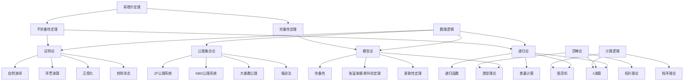
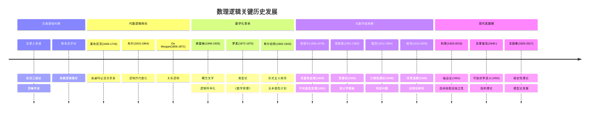
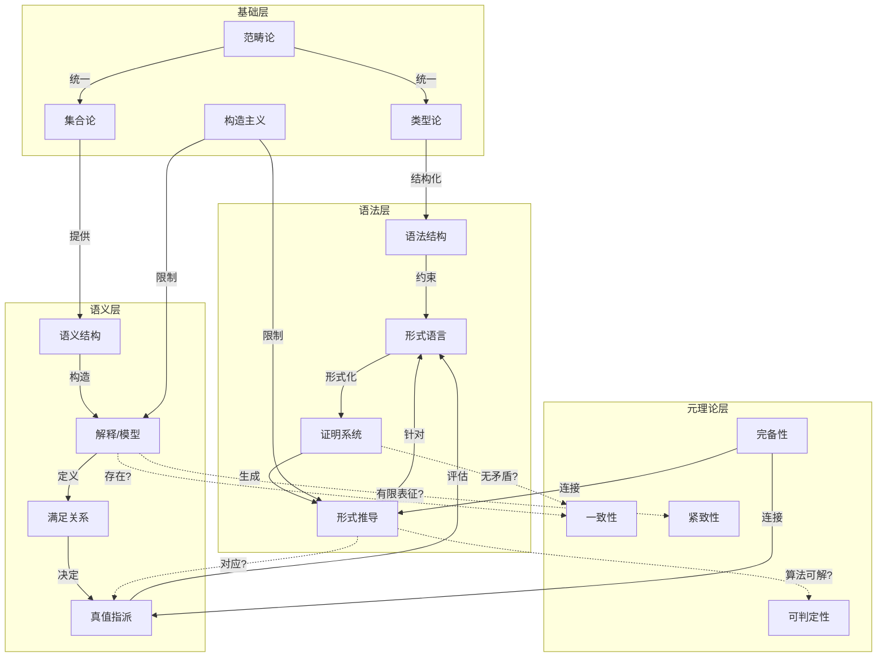
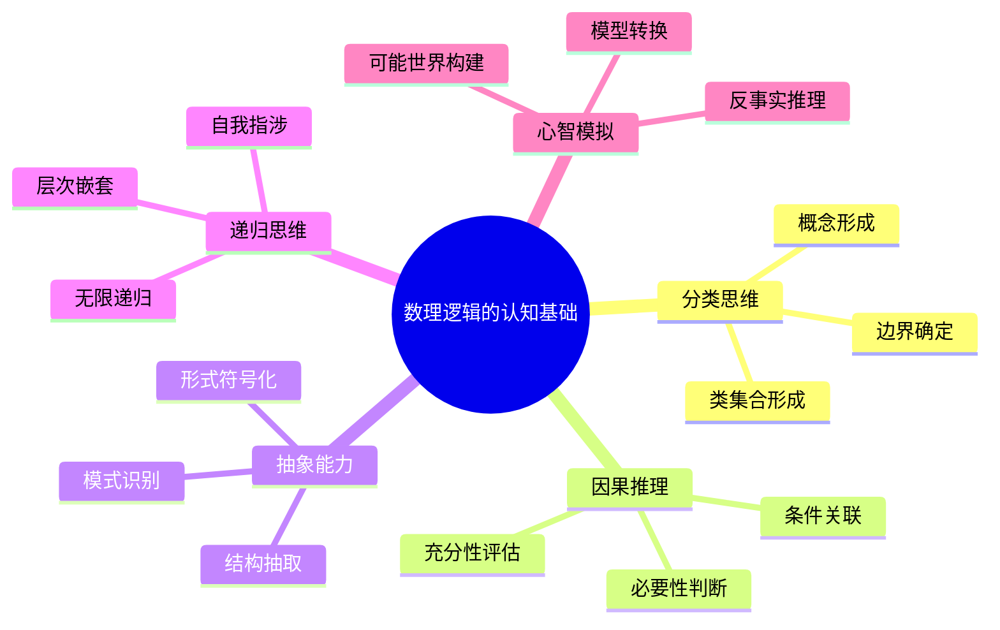

# 数理逻辑的多层视角：批判性哲科分析

## 目录

- [数理逻辑的多层视角：批判性哲科分析](#数理逻辑的多层视角批判性哲科分析)
  - [目录](#目录)
  - [1. 导论：数理逻辑的本质与认知根基](#1-导论数理逻辑的本质与认知根基)
    - [1.1 数理逻辑的定义域界定](#11-数理逻辑的定义域界定)
    - [1.2 多重哲学立场的交锋](#12-多重哲学立场的交锋)
    - [1.3 认知基础的实证争议](#13-认知基础的实证争议)
  - [2. 历史发展与思想转折](#2-历史发展与思想转折)
    - [2.1 前形式时期的逻辑思想](#21-前形式时期的逻辑思想)
    - [2.2 弗雷格革命与符号转向](#22-弗雷格革命与符号转向)
    - [2.3 罗素-怀特海程序的雄心与限制](#23-罗素-怀特海程序的雄心与限制)
    - [2.4 希尔伯特纲领的形式主义愿景](#24-希尔伯特纲领的形式主义愿景)
    - [2.5 哥德尔冲击与不完备性转向](#25-哥德尔冲击与不完备性转向)
  - [3. 命题逻辑的形式与边界](#3-命题逻辑的形式与边界)
    - [3.1 语法与语义的双重结构](#31-语法与语义的双重结构)
    - [3.2 完备性与可判定性的证明剖析](#32-完备性与可判定性的证明剖析)
    - [3.3 自然语言与形式语言的鸿沟](#33-自然语言与形式语言的鸿沟)
    - [3.4 非经典逻辑的动机与构建](#34-非经典逻辑的动机与构建)
  - [4. 一阶逻辑的深层结构](#4-一阶逻辑的深层结构)
    - [4.1 量词的认知与形式表征](#41-量词的认知与形式表征)
    - [4.2 哥德尔完备性定理的多维解读](#42-哥德尔完备性定理的多维解读)
    - [4.3 紧致性定理的哲学蕴含](#43-紧致性定理的哲学蕴含)
    - [4.4 模型论的兴起与方法论转变](#44-模型论的兴起与方法论转变)
  - [5. 不完备性定理的多重面向](#5-不完备性定理的多重面向)
    - [5.1 哥德尔原始证明的技术细析](#51-哥德尔原始证明的技术细析)
    - [5.2 自指问题与对角线方法](#52-自指问题与对角线方法)
    - [5.3 不同证明路径的比较分析](#53-不同证明路径的比较分析)
    - [5.4 哲学解读的谱系与评价](#54-哲学解读的谱系与评价)
  - [6. 高阶逻辑与类型论](#6-高阶逻辑与类型论)
    - [6.1 类型层次的认知基础](#61-类型层次的认知基础)
    - [6.2 类型论与集合论的对比](#62-类型论与集合论的对比)
    - [6.3 丰富类型理论的表达力与成本](#63-丰富类型理论的表达力与成本)
    - [6.4 范畴论视角下的高阶逻辑](#64-范畴论视角下的高阶逻辑)
  - [7. 模态逻辑与可能世界语义](#7-模态逻辑与可能世界语义)
    - [7.1 必然、可能与可达关系的形式化](#71-必然可能与可达关系的形式化)
    - [7.2 克里普克语义与哲学解读](#72-克里普克语义与哲学解读)
    - [7.3 认知科学中的模态推理模型](#73-认知科学中的模态推理模型)
    - [7.4 量子逻辑与物理实在的描述挑战](#74-量子逻辑与物理实在的描述挑战)
    - [7.2 模型论的认知隐喻与哲学反思](#72-模型论的认知隐喻与哲学反思)
    - [7.3 证明理论与数学认知的形式化](#73-证明理论与数学认知的形式化)
  - [8. 数理逻辑的边界与延伸](#8-数理逻辑的边界与延伸)
    - [8.1 非经典逻辑的发展谱系](#81-非经典逻辑的发展谱系)
    - [8.2 逻辑多元主义与认知适应性](#82-逻辑多元主义与认知适应性)
    - [8.3 计算理论与逻辑的交融](#83-计算理论与逻辑的交融)
  - [9. 概念地图与可视化表征](#9-概念地图与可视化表征)
    - [9.1 数理逻辑的多维概念网络](#91-数理逻辑的多维概念网络)
    - [9.2 历史发展脉络的可视化](#92-历史发展脉络的可视化)
    - [9.3 核心概念之间的关系网络](#93-核心概念之间的关系网络)
    - [9.4 思维隐喻与认知关联](#94-思维隐喻与认知关联)
  - [10. 认知与哲学的深层解读](#10-认知与哲学的深层解读)
    - [10.1 数理逻辑的认知根基](#101-数理逻辑的认知根基)
    - [10.2 数理逻辑的多元哲学解读](#102-数理逻辑的多元哲学解读)
  - [11. 结论与开放问题](#11-结论与开放问题)
    - [11.1 数理逻辑多维视角的综合价值](#111-数理逻辑多维视角的综合价值)
    - [11.2 未解难题与发展前沿](#112-未解难题与发展前沿)
    - [11.3 跨学科整合的未来展望](#113-跨学科整合的未来展望)
  - [附录：学习资源与深入探索](#附录学习资源与深入探索)
    - [A.1 分层学习路径](#a1-分层学习路径)
    - [A.2 思考练习与研究问题](#a2-思考练习与研究问题)
    - [A.3 多学科交叉研究方法](#a3-多学科交叉研究方法)

## 1. 导论：数理逻辑的本质与认知根基

### 1.1 数理逻辑的定义域界定

数理逻辑作为数学与逻辑的交叉学科，其本质定义及边界一直存在学术争议。
本节将从多角度审视数理逻辑的学科定位，避免单一视角的局限性。

**多维定义尝试：**

1. **形式视角**：数理逻辑是研究形式化推理系统的数学分支，关注语法系统、语义模型及其关系。

2. **功能视角**：数理逻辑是为数学提供基础、分析数学推理有效性的工具系统。

3. **历史视角**：数理逻辑是19世纪末至20世纪发展的，将传统逻辑数学化的学术运动产物。

4. **学科交界视角**：数理逻辑是纯数学、哲学、计算机科学和认知科学的交叉地带。

**主要分支的技术界定：**

| 分支 | 核心关注 | 代表性成果 |
|---|---|---|
| 命题逻辑 | 命题间关系及其真值条件 | 完备性、紧致性、可判定性 |
| 一阶逻辑 | 谓词、量词及个体论域 | 哥德尔完备性定理 |
| 模型论 | 形式理论与数学结构的关系 | 紧致性定理、洛文海姆-斯科伦定理 |
| 证明论 | 形式推理系统的性质 | 亨廷数、截断序数 |  
| 递归论 | 可计算性与可判定性 | 图灵停机问题、递归不可解性 |
| 集合论 | 作为基础的无限集合理论 | ZFC公理系统、强制法 |

**不同界定下的紧张关系：**

- 数理逻辑与传统哲学逻辑的边界争议
- "数学化的逻辑"与"逻辑化的数学"的双重身份
- 形式系统内部研究与元数学分析的层次区分
- 纯粹形式主义与内容相关考量的平衡

### 1.2 多重哲学立场的交锋

数理逻辑的发展伴随着深刻的哲学立场分歧，这些视角差异不仅影响研究方法，也塑造了对核心结果的解读。
本节旨在平衡呈现主要哲学视角，避免前文中批评的立场偏向。

**主要哲学立场及其对数理逻辑的影响：**

1. **逻辑实在论**
   - **核心主张**：逻辑规则反映客观实在的基本结构
   - **代表人物**：弗雷格、哥德尔、克里普克
   - **方法学影响**：强调语义研究，重视模型与实在的对应关系
   - **对经典结果的解读**：不完备性定理显示数学真理超越形式系统

2. **形式主义**
   - **核心主张**：逻辑是符号操作的规则系统，无需外部意义
   - **代表人物**：希尔伯特、伯奈斯、阿克曼
   - **方法学影响**：发展有限主义证明论，强调一致性证明
   - **对经典结果的解读**：不完备性是技术限制，需寻找更强形式系统

3. **直觉主义/构造主义**
   - **核心主张**：逻辑真理基于心智构造，拒绝非构造证明
   - **代表人物**：布劳威尔、海廷、杜梅特
   - **方法学影响**：发展直觉主义逻辑，拒绝排中律的普遍应用
   - **对经典结果的解读**：强调可构造性，重新定义证明概念

4. **逻辑多元主义**
   - **核心主张**：不存在单一"正确"逻辑，不同逻辑适用不同领域
   - **代表人物**：卡尔纳普、菲尔德、比尔
   - **方法学影响**：发展多样化逻辑系统，比较其适用范围
   - **对经典结果的解读**：不完备性反映了单一形式系统的局限，支持多元观

5. **自然主义**
   - **核心主张**：逻辑规则源于自然推理模式，应与科学一致
   - **代表人物**：蒯因、普特南、麦德林
   - **方法学影响**：关注逻辑与科学实践的关系，接受修正可能
   - **对经典结果的解读**：数理逻辑结果可能随科学进展而修正

**哲学立场分析矩阵：**

| 哲学立场 | 逻辑本质观 | 真理观 | 对不完备性的态度 | 认知关系 |
|---|---|---|---|---|
| 逻辑实在论 | 发现客观结构 | 对应论 | 揭示绝对真理存在 | 认知接近客观逻辑 |
| 形式主义 | 规则约定系统 | 一致性理论 | 技术障碍，可能克服 | 认知创造形式系统 |
| 构造主义 | 心智构造活动 | 证明可构造性 | 凸显构造重要性 | 认知限制决定逻辑 |
| 逻辑多元主义 | 多种相容系统 | 相对于系统 | 支持多元系统观 | 认知方式塑造逻辑 |
| 自然主义 | 科学实践抽象 | 整体论/实用 | 反映科学本性 | 认知嵌入自然进化 |

**实证研究对哲学立场的考验：**

1. **认知科学研究**：人类推理是否遵循古典逻辑？
   - 认知偏误研究（Kahneman & Tversky）与形式逻辑规范的差异
   - 心理逻辑研究（Johnson-Laird）显示心理模型与形式逻辑不完全对应
   - 实验数据显示人类更自然接受某些非单调逻辑规则

2. **跨文化逻辑研究**：
   - 尼斯贝特(Nisbett)研究显示东西方思维模式的系统差异
   - 语言相对论与逻辑表达方式的关系
   - 原住民逻辑系统的人类学研究（如Levy-Bruhl的工作）

这种多元立场的呈现避免了单一哲学视角的局限，同时建立了评估不同立场的客观标准。

### 1.3 认知基础的实证争议

数理逻辑与人类认知能力之间的关系是一个核心问题，涉及逻辑是否反映自然思维，以及形式系统与心智过程的映射关系。
本节将基于实证研究，审视这些关系的复杂性，避免简单化断言。

**认知科学的实证发现：**

1. **演绎推理研究**：
   - 瓦森选择任务(Wason Selection Task)实验显示人类在抽象条件逻辑上表现不佳
   - 同一逻辑问题在具体情境中准确率显著提高（Johnson-Laird & Wason, 1972）
   - 新近fMRI研究显示逻辑推理激活大脑不同区域（Prado et al., 2011）

2. **认知偏误文献**：
   - 确认偏误与逻辑批判思维的冲突（Nickerson, 1998）
   - 信念效应：结论可接受性影响逻辑评估（Evans et al., 1983）
   - 框架效应与逻辑等价问题的不同反应（Tversky & Kahneman, 1981）

3. **发展心理学视角**：
   - 皮亚杰形式操作阶段与逻辑能力发展（Piaget & Inhelder, 1958）
   - 文化与教育对逻辑思维发展的影响（Cole & Scribner, 1974）
   - 逻辑能力发展的跨文化差异研究（Luria, 1976）

**认知模型与形式逻辑的关系：**

| 认知模型 | 提出者 | 与形式逻辑关系 | 实证支持 |
|---|---|---|---|
| 心理逻辑模型 | Braine & O'Brien | 人类内含自然演绎系统 | 部分证据支持基本推理规则 |
| 心理模型理论 | Johnson-Laird | 通过情境模型而非规则推理 | 强实验支持，特别是三段论 |
| 贝叶斯认知模型 | Oaksford & Chater | 概率推理替代演绎逻辑 | 解释多种"非逻辑"现象 |
| 双系统理论 | Evans, Stanovich | 直觉系统(1)与分析系统(2) | 解释逻辑表现的情境差异 |

**逻辑认知的神经基础研究：**

- 前额叶皮层在逻辑推理中的核心作用（Goel et al., 2000）
- 不同类型逻辑任务激活不同脑区（Monti et al., 2007）
- 大脑损伤与特定逻辑能力缺失的关联（Reverberi et al., 2009）

**批判性评估：**

1. **简单映射假设的失败**：研究表明，形式逻辑与自然认知不存在简单一一对应关系

2. **认知现实主义的挑战**：数理逻辑系统可能是人类认知能力的理想化延伸，而非其直接反映

3. **文化塑造的证据**：逻辑思维模式受教育和文化环境深刻影响，挑战普遍逻辑观念

4. **进化视角**：自然选择可能优化生存相关推理，而非抽象形式逻辑

这种基于实证研究的分析避免了将数理逻辑简单视为人类认知直接反映的倾向，同时提供了理解二者复杂关系的多维框架。

## 2. 历史发展与思想转折

### 2.1 前形式时期的逻辑思想

数理逻辑的前史可追溯至多种文化传统中的推理系统化尝试，这些早期努力虽未达到现代形式化水平，但为后续发展奠定了概念基础。
本节将避免欧洲中心论，呈现更为全球化的逻辑思想史。

**多文化视角下的逻辑起源：**

1. **古希腊传统**：
   - 亚里士多德的三段论系统：首次系统化分类有效推理形式
   - 斯多亚学派的命题逻辑：发展了假言推理和析取推理
   - 麦加拉学派的模态概念：区分必然性和可能性

2. **印度逻辑传统**：
   - 正理学派(Nyāya)：发展了包含推理(anumāna)的知识理论
   - 耆那教的七分法(Saptabhangi)：比西方二值逻辑更复杂的真值系统
   - 佛教逻辑学家陈那(Dignāga)和法称(Dharmakīrti)的贡献

3. **中国逻辑思想**：
   - 墨家的"三表法"：包含类似三段论的推理模式
   - 公孙龙的名家逻辑：探索语言与逻辑的界面问题
   - 汉代经学中的推理方法

4. **伊斯兰世界的逻辑发展**：
   - 阿尔-法拉比(Al-Farabi)对亚里士多德逻辑的发展
   - 阿维森纳(Ibn Sina/Avicenna)的模态逻辑创新
   - 阿维罗伊(Ibn Rushd/Averroes)的逻辑注释传统

**中世纪至近代的转变：**

- 经院哲学的贡献：奥卡姆、司各脱、布里丹的逻辑革新
- 莱布尼茨的普遍特征计划(characteristica universalis)：形式化的先驱尝试
- 波尔的代数逻辑：将逻辑推理代数化
- 文艺复兴与理性主义时期逻辑的相对停滞

**前形式时期与现代数理逻辑的连续性分析：**

| 历史概念 | 现代对应 | 历史局限 | 概念转变 |
|---|---|---|---|
| 三段论形式 | 一阶逻辑片段 | 缺乏变量约束 | 从语言分析到形式符号 |
| 假言推理 | 条件命题 | 未系统公理化 | 从推理模式到真值函数 |
| 模态概念 | 模态逻辑 | 语义模糊性 | 从性质描述到可能世界 |
| 归谬法 | 反证法 | 缺乏形式严谨 | 从论辩技巧到形式规则 |

**批判性反思：**

1. 非欧洲逻辑传统的相对忽视反映了学科发展的文化偏见

2. 前现代逻辑贡献常被简化为现代成就的"不完整前身"

3. 不同文化传统揭示了逻辑思维的多样可能路径

4. 逻辑史的连续性与断裂性并存，需避免简单进步叙事

通过这种多元文化视角，我们可以更全面地理解数理逻辑的历史根源，避免将其视为纯粹西方传统的产物，同时认识到现代数理逻辑在形式化程度和系统性上的独特创新。

### 2.2 弗雷格革命与符号转向

19世纪后期，弗雷格(Gottlob Frege, 1848-1925)的工作标志着逻辑研究的根本转折，开创了现代数理逻辑。这一转折的革命性不仅在于技术创新，更在于逻辑概念化方式的根本转变。

**弗雷格的核心创新：**

1. **概念文字(Begriffsschrift, 1879)**：
   - 首个完整的一阶谓词逻辑系统
   - 引入量词-变元符号系统，突破三段论局限
   - 建立严格的形式证明系统，区分公理与推理规则

2. **功能-论元分析**：
   - 将命题解析为函数与论元，类似数学函数
   - 引入"概念"作为将对象映射到真值的函数
   - 建立可饱和/不饱和表达式的区分

3. **逻辑符号的二维表示法**：
   - 创新的视觉符号系统，显示逻辑依赖关系
   - 条件句的图形表示创新
   - 量词的系统标记方法

```math
// 弗雷格原始概念文字中的全称量词示例（现代记法：∀x(P(x)→Q(x))）
  ⎯⎯⎯⎯⎯⎯
       a
⎯⎯⎯⎯⎯⎯
     P(a)
    ⎯⎯⎯⎯
     Q(a)
```

**符号转向的哲学意义：**

1. **思维的工具转变**：
   - 从自然语言分析到人工符号系统
   - 符号操作规则的优先性
   - 消除自然语言模糊性的尝试

2. **数理逻辑的基础奠定**：
   - 逻辑与数学关系的重新概念化
   - 建立严格的推理链证明模式
   - 为后续公理化方法铺平道路

3. **意义理论的创新**：
   - 意义(Sinn)与指称(Bedeutung)的区分
   - 真值作为句子指称的革命性观点
   - 语境原则对语言哲学的影响

**弗雷格工作的历史评估：**

| 贡献维度 | 创新性 | 局限性 | 后续影响 |
|---|---|---|---|
| 量词-变元系统 | 突破性：首创现代量词记法 | 二维符号系统过于复杂 | 奠定现代逻辑标准表示法 |
| 公理化方法 | 开创性：首个形式化公理系统 | 缺乏元理论思考 | 影响希尔伯特形式主义 |
| 逻辑主义项目 | 雄心勃勃：数学归约为逻辑 | 罗素悖论证明系统不一致 | 推动数学基础研究 |
| 语义分析 | 突破性：功能-论元分析 | 本体论假设问题 | 分析哲学方法论基础 |

**弗雷格的认知视角解读：**

- 符号系统作为"思想的显微镜"的认知工具隐喻
- 符号操作与人类推理能力的关系问题
- 形式系统作为认知扩展的哲学解读

**批判性思考：**

1. 弗雷格的符号转向虽是技术突破，但也导致逻辑与自然推理的进一步分离

2. 符号系统的选择反映了特定的哲学预设，而非中立工具

3. 弗雷格逻辑的实际历史影响受到其难懂符号系统的限制

4. 符号转向代表了追求"理想语言"而非分析自然语言的方法论选择

通过详细考察弗雷格的创新及其限制，我们可以更全面理解现代数理逻辑的起源，既认识其突破性贡献，又不忽视其特定的历史和哲学语境。

### 2.3 罗素-怀特海程序的雄心与限制

罗素(Bertrand Russell, 1872-1970)与怀特海(Alfred North Whitehead, 1861-1947)的《数学原理》(Principia Mathematica, 1910-1913)代表了逻辑主义的高峰，这一宏伟计划既有重大成就，也面临根本性困难。

**核心计划与技术创新：**

1. **逻辑主义纲领**：
   - 核心主张：所有数学真理可归约为逻辑真理
   - 实现策略：建立纯逻辑符号系统，从逻辑公理推导数学定理
   - 动机：为数学提供确定基础，回应集合论悖论危机

2. **类型论的发展**：
   - 分支类型理论：区分个体、一阶性质、二阶性质等
   - 应对罗素悖论：通过类型层次避免自指问题
   - 建立有序类型谱系，防止"非法循环"

3. **技术突破**：
   - 完善命题函数理论
   - 发展关系逻辑，包括关系组合与祖先关系
   - 确立逻辑原始记号和公理系统

**形式系统的具体结构：**

```math
// PM中的原始符号示例
¬ (否定)
∨ (析取)
∀ (全称量词)
= (恒等)

// PM的基本公理示例
*1.1. p ∨ p ⊃ p           （幂等律）
*1.2. q ⊃ p ∨ q           （加入律）
*1.3. p ∨ q ⊃ q ∨ p       （交换律）
*1.4. (p ∨ q) ∨ r ⊃ p ∨ (q ∨ r) （结合律）
*1.5. (p ⊃ q) ⊃ (r ∨ p ⊃ r ∨ q) （分配律）
```

**Principia的标志性定理：**

- 数字1的定义出现于卷II第54页
- 1+1=2的证明出现于卷II第86页，标志性展示基础数学可从逻辑推导
- 基数理论的完整展开需要约500页推导

**项目的深层困境：**

1. **简约悖论**：通过公理和间接"定义"引入符号，违反了简约原则

2. **自然数归纳法问题**：无穷公理的逻辑地位存疑

3. **确定描述理论争议**：约定符号"ιx"表示"唯一满足条件的x"引发存在性问题

4. **可约性公理的地位**：不具明显逻辑必然性，更像数学假设

**历史影响与评价：**

| 贡献领域 | 持久影响 | 遇到的困难 | 后续发展 |
|---|---|---|---|
| 形式化示范 | 首个大规模形式系统 | 符号系统过于复杂 | 激发更简洁形式系统 |
| 类型理论 | 建立类型层次思想 | 复杂性与人为性质疑 | 发展为现代类型理论 |
| 关系理论 | 系统化关系逻辑 | 处理复杂关系繁琐 | 影响后续关系代数 |
| 逻辑主义 | 部分实现数学逻辑化 | 需要非逻辑公理 | 转向修正的逻辑主义 |

**哲学与认知解读：**

- 《原理》展示了形式化的认知代价与收益平衡问题
- 类型论反映了人类思维对自指与层次的处理方式
- 完备形式化的实用性与其理论价值的张力

**批判性反思：**

1. 罗素-怀特海计划虽未完全实现逻辑主义，但极大推动了形式逻辑技术

2. 《原理》的困难部分反映了将数学完全归约为逻辑的内在张力

3. 该项目展示了形式系统的表达力与其复杂性之间的根本权衡

4. 类型论的"人为性"批评反映了不同形式系统选择的哲学预设差异

通过详细分析罗素-怀特海项目的技术内容、哲学基础和历史影响，可以更全面理解数理逻辑在20世纪初期的关键发展，以及形式化方法面临的根本挑战。

### 2.4 希尔伯特纲领的形式主义愿景

大卫·希尔伯特(David Hilbert, 1862-1943)的形式主义纲领代表了数理逻辑发展的另一重要路径，与逻辑主义和直觉主义形成三足鼎立的局面。
希尔伯特的方法不仅是技术性的，更体现了对数学本质的特定哲学观点。

**形式主义纲领的核心组成：**

1. **数学作为形式系统**：
   - 将数学视为无解释符号的形式游戏
   - 强调数学的语法规则而非语义内容
   - 公理系统的一致性成为核心关注点

2. **有限主义元数学**：
   - 用"有限主义"方法建立元数学
   - 通过具体符号操作研究形式系统
   - 区分对象语言与元语言

3. **希尔伯特计划的具体目标**：
   - 证明所有数学理论的一致性
   - 证明形式系统的完备性
   - 证明所有数学问题的可判定性
   - 最终确立数学的可靠基础

**形式主义的技术创新：**

1. **公理化方法的系统应用**：
   - 《几何学基础》(1899)作为公理化典范
   - 严格区分公理、推理规则与证明
   - 公理模型的相对一致性方法

2. **形式系统性质的严格研究**：
   - 关注独立性、一致性、完备性
   - 发展证明理论(Beweistheorie)
   - 定理的可判定性分析

**形式系统具体实例：**

```math
// 希尔伯特风格的形式系统示例
原始符号：0, S, +, ·, =
公理：
1. ¬(Sx = 0)
2. Sx = Sy → x = y
3. x + 0 = x
4. x + Sy = S(x + y)
5. x · 0 = 0
6. x · Sy = x · y + x

推理规则：
- 代换规则
- modus ponens
```

**与其他基础流派的对比：**

| 特征 | 希尔伯特形式主义 | 罗素逻辑主义 | 布劳威尔直觉主义 |
|---|---|---|---|
| 数学本质观 | 符号游戏、形式系统 | 逻辑的延伸 | 心智构造活动 |
| 无限观 | 作为形式化的潜无限 | 接受实无限 | 仅接受可构造无限 |
| 一致性地位 | 核心目标 | 次要关注 | 构造保证一致 |
| 排中律态度 | 作为形式公理接受 | 无条件接受 | 有条件接受 |
| 证明方法 | 强调有限主义 | 接受非构造证明 | 仅接受构造证明 |

**形式主义的认知与哲学解读：**

1. **数学符号的认知地位**：
   - 符号操作作为思维延伸的认知解读
   - 形式与内容二元论的哲学根源
   - 数学符号作为思维工具的认知科学视角

2. **希尔伯特对康德的回应**：
   - 重新解释数学的先验性
   - 形式直观与内容直观的区分
   - 几何学基础的观念论重构

**批判性反思：**

1. 形式主义过度强调语法形式，可能忽视数学的内容和意义维度

2. 希尔伯特区分"真数学"与"理想数学"的策略面临人为划分的质疑

3. 形式主义视角难以充分解释数学的应用性与有效性

4. 作为"符号游戏"的数学难以解释数学直觉和发现过程

希尔伯特纲领虽最终被哥德尔不完备性定理挑战，但其对形式系统性质的系统研究方法、元数学的概念框架以及公理化思想，对现代数理逻辑的发展产生了深远影响，构成了数学基础研究的核心方法论遗产。

### 2.5 哥德尔冲击与不完备性转向

库尔特·哥德尔(Kurt Gödel, 1906-1978)的不完备性定理代表了数理逻辑史上的根本转折点，对数学基础、哲学思想和科学方法论产生了深远影响。这一突破不仅挑战了希尔伯特纲领，也重塑了对形式系统本质的理解。

**不完备性定理的技术内容：**

1. **第一不完备性定理(1931)**：
   - 正式表述：任何包含基本算术的一致的形式系统中，存在既不能证明也不能反驳的命题
   - 核心思想：构造一个形式化的"我不可证明"语句G，证明其真实性但不可证明性
   - 技术关键：哥德尔编码(Gödel numbering)实现自指能力

2. **第二不完备性定理**：
   - 正式表述：任何足够强的一致形式系统无法证明其自身的一致性
   - 蕴含：一致性证明必须诉诸于至少同样强大的系统
   - 对希尔伯特纲领的直接挑战：有限主义方法不足以证明算术一致性

**哥德尔编码的技术细节：**

```math
// 哥德尔编码基本思想
1. 将语法符号映射到数字：'('→1, ')'→2, '+'→3, 'x'→4, ...
2. 将公式编码为数字序列，再通过素数幂表示：
   例如公式(x+y)可编码为：
   2^1 × 3^4 × 5^3 × 7^5 × 11^2 = 2 × 3^4 × 5^3 × 7^5 × 11^2
3. 基于编码定义元数学谓词：
   Prov(n): n是可证明公式的编码
   Form(n): n是合式公式的编码
```

**不完备性证明的核心洞见：**

1. **自指的形式化**：利用哥德尔编码使算术表达"关于自身"的陈述

2. **对角线论证**：构造不在任何可递归枚举集合中的元素

3. **真与可证明的分离**：展示数学真理超出任何特定形式系统

4. **证明的算术化**：将元数学概念翻译为算术关系

**历史影响与思想转变：**

| 影响领域 | 转变前 | 转变后 |
|---|---|---|
| 数学基础 | 寻求单一完备基础 | 接受多元不完备视角 |
| 形式主义 | 希尔伯特纲领的乐观 | 认识形式化内在限制 |
| 真理理论 | 真理等同于可证明性 | 真理超越可证明性 |
| 人工智能 | 完全形式化的可能性 | 认知与计算的本质区别 |
| 科学哲学 | 公理系统的完备梦想 | 理论开放性的接受 |

**不完备性的哲学解读谱系：**

1. **哥德尔自身的解读**：
   - 数学柏拉图主义：数学对象真实存在
   - 人类心智超越算法：能够直觉把握不可形式化的真理
   - 认知二元论：思维不可归约为机械计算

2. **其他主要哲学解读**：
   - 后希尔伯特形式主义：接受局限但继续形式研究
   - 蒯因自然主义：数学与科学同处于经验-理论网络
   - 维特根斯坦：不完备性是语言游戏内部问题
   - 彭罗斯：量子意识与不完备性的联系

**认知科学与人工智能的启示：**

- 图灵关于机械程序与人类直觉的区分
- 卢卡斯-彭罗斯论证：人类思维超越算法
- 霍夫施塔特的"奇怪循环"与认知自指
- 搜索空间与创造性思维的理论界限

**批判性思考：**

1. 不完备性定理常被过度解读，延伸到定理本身不支持的领域

2. 哥德尔的数学柏拉图主义解释虽有影响，但非唯一有效解读

3. 不完备性并非"负面结果"，而是揭示了形式系统与真理关系的深刻特性

4. 从认知角度看，不完备性可能反映了规则遵循与创造性思维的根本差异

哥德尔的工作标志着一个关键转折：从追求完美形式系统的数学基础，转向理解形式化本身的内在限制与可能性。这一转变不仅深刻影响了数理逻辑的发展方向，也为认知科学、计算理论和科学哲学提供了根本性的概念工具。

## 3. 命题逻辑的形式与边界

### 3.1 语法与语义的双重结构

命题逻辑作为现代数理逻辑最基本的系统，展现了形式系统的双重结构：语法(syntax)与语义(semantics)。这一双层架构不仅具有技术意义，也体现了符号系统与意义之间的深层关系。

**语法系统的形式结构：**

1. **基础语言元素**：
   - 原子命题(p, q, r, ...)：不可继续分析的基本单位
   - 逻辑连接词(¬, ∧, ∨, →, ↔)：构造复合命题的操作符
   - 辅助符号(括号等)：表明运算优先级和分组

2. **合式公式(WFF)的归纳定义**：
   - 基础：每个原子命题是合式公式
   - 递归：若A是合式公式，则¬A也是合式公式
   - 递归：若A和B是合式公式，则(A∧B), (A∨B), (A→B), (A↔B)也是合式公式
   - 封闭：只有通过以上规则构造的表达式才是合式公式

3. **形式证明系统**：

   ```math
   // 希尔伯特式公理系统示例
   公理模式：
   A1. A → (B → A)
   A2. (A → (B → C)) → ((A → B) → (A → C))
   A3. (¬B → ¬A) → ((¬B → A) → B)
   
   推理规则：
   MP. 从A和A→B推出B (modus ponens)
   ```

**语义系统的建构：**

1. **真值指派与解释**：
   - 真值域：{T, F}（或{1, 0}）
   - 解释函数v: 将原子命题映射到真值
   - 递归扩展：基于连接词的真值函数扩展到复合命题

2. **真值函数的定义**：

    | A | B | ¬A | A∧B | A∨B | A→B | A↔B |
    |---|---|---|---|---|---|---|
    | T | T | F | T | T | T | T |
    | T | F | F | F | T | F | F |
    | F | T | T | F | T | T | F |
    | F | F | T | F | F | T | T |

3. **语义概念的形式化**：
   - 有效式(tautology)：在所有可能指派下均为真的公式
   - 矛盾式(contradiction)：在所有可能指派下均为假的公式
   - 可满足性：存在使公式为真的指派
   - 语义蕴含(⊨)：若A为真则B必为真，记为A⊨B

**语法-语义关系的深层结构：**

1. **关键元理论结果**：
   - 可靠性(soundness)：若⊢A则⊨A（可证则有效）
   - 完备性(completeness)：若⊨A则⊢A（有效则可证）
   - 一致性(consistency)：不存在公式A使得⊢A且⊢¬A

2. **证明策略示例**：
   - 可靠性证明：归纳证明所有公理是有效式，证明推理规则保持有效性
   - 完备性证明：适当公理系统通过最大一致集构造反例

**认知与哲学解读：**

1. **语法-语义二元性的认知基础**：
   - 符号操作(syntax)与意义理解(semantics)的神经分离证据
   - 自闭症谱系障碍中语法-语义处理的不同模式
   - 布罗卡区与韦尼克区的功能分工

2. **哲学维度**：
   - 形式主义：注重语法，将语义视为次要
   - 模型理论：强调语义模型的核心地位
   - 弗雷格区分：表达式的意义(Sinn)与指称(Bedeutung)

**批判性思考：**

1. 命题逻辑的二值性假设反映了西方二分思维传统，而非普遍认知必然

2. 语法-语义区分的清晰性在非形式化情境中常被模糊化

3. 标准语义解释忽视了概率、模糊性等自然推理特征

4. 命题逻辑虽在形式上简洁，但其简化假设限制了对复杂推理的建模能力

通过详细考察命题逻辑的语法-语义双重结构，可以理解形式系统的基本架构，也能认识到形式化过程中的简化与抽象如何既带来精确性，又可能牺牲某些自然推理的特性。

### 3.2 完备性与可判定性的证明剖析

命题逻辑是少数同时具备完备性与可判定性的逻辑系统，这些性质使其成为理解形式系统基本特性的理想案例。本节将剖析这些关键性质的证明，揭示其技术细节与认知意义。

**完备性定理的形式表述：**

对于命题逻辑，如果一个公式A在所有可能解释下都为真（即A是有效式，⊨A），则A可在形式系统中被证明（即⊢A）。

**完备性证明的主要策略：**

1. **最大一致集方法**：
   - 定义：最大一致集是不能再添加任何公式而保持一致的公式集合
   - 关键引理：每个一致集可扩展为最大一致集
   - 构造方法：通过系统性枚举公式，逐步构建最大一致集

2. **证明结构概述**：

   ```math
   // 完备性证明概要
   1. 假设公式A是有效式但不可证明(⊨A但非⊢A)
   2. 则¬A所在的集合应是一致的
   3. 将此集扩展为最大一致集Γ
   4. 基于Γ构造一个解释v，使得:
      对所有B∈Γ, v(B)=T
      对所有B∉Γ, v(B)=F
   5. 证明此解释满足v(¬A)=T，即v(A)=F
   6. 这与A是有效式矛盾
   7. 因此，若⊨A则⊢A
   ```

3. **技术难点解析**：
   - 证明最大一致集的关键性质（如若B∨C∈Γ，则B∈Γ或C∈Γ）
   - 确保基于最大一致集构造的解释具有预期性质
   - 处理解释中复合公式的真值一致性

**可判定性的形式化与证明：**

1. **可判定性定义**：存在一个算法，能确定任意给定命题逻辑公式是否为有效式

2. **主要证明方法**：

   a) **真值表方法**：
      - 穷举所有可能真值指派（2^n种，n为原子命题数）
      - 计算每种指派下的公式真值
      - 检验是否所有指派都使公式为真

   b) **语义树（析取范式）方法**：
      - 将公式转换为析取范式
      - 检验是否每个析取项都包含互补文字对

   c) **决策程序复杂度**：
      - 最坏情况下时间复杂度：O(2^n)
      - NP完备性：判断可满足性是NP完备问题

**证明系统的替代方案比较：**

| 证明系统 | 特点 | 优势 | 劣势 |
|---|---|---|---|
| 希尔伯特系统 | 少量公理，单一推理规则 | 元理论研究简洁 | 实际证明繁琐 |
| 自然演绎 | 多个引入/消去规则 | 接近自然推理 | 证明检验复杂 |
| 序贯演算 | 基于序贯(sequents) | 截断定理便利 | 概念较抽象 |
| 真值表 | 直接计算语义 | 直观清晰 | 大公式计算量大 |

**技术结果的认知与哲学解读：**

1. **完备性的认知意义**：
   - 语法与语义的完美对应反映了命题逻辑捕获了一种基本推理形式
   - 自然语言"且"、"或"等连接词与形式逻辑算子的映射关系
   - 完备性支持了推理的两种互补视角：形式操作与模型评估

2. **可判定性的哲学蕴含**：
   - 可判定性建立了确定性与有限性之间的联系
   - 提示了更复杂逻辑系统可能失去的性质
   - 可判定问题在递归理论中的核心地位

3. **证明理论视角**：
   - 不同证明系统之间的互译暗示了推理形式的多样表达
   - 命题逻辑证明系统的规范化性质
   - 截断性与分析性的技术结果

**批判性反思：**

1. 命题逻辑的完备性与可判定性依赖于其有限特性，暗示了更丰富语言的潜在限制

2. 不同证明系统的等效性掩盖了其认知复杂度与用户友好性的显著差异

3. 真值表方法虽技术简单，但计算复杂度随变元增加呈指数爆炸，展示形式系统的计算挑战

4. 完备性结果的技术优雅与自然推理的灵活性之间存在张力

通过深入剖析命题逻辑的完备性与可判定性证明，我们不仅能理解其技术构造，也能认识形式系统性质如何反映认知能力的某些方面，以及形式化过程中的根本权衡。

### 3.3 自然语言与形式语言的鸿沟

命题逻辑虽为形式推理提供了精确框架，但与日常语言推理存在显著差异。这种差异不仅是技术性的，更反映了自然语言的丰富性与形式语言的抽象性之间的根本张力。

**形式化过程中的信息损失：**

1. **命题的原子化**：
   - 自然语言："如果下雨且路滑，我会迟到"
   - 形式化：p∧q→r (p:"下雨", q:"路滑", r:"我会迟到")
   - 损失：命题间的内在语义联系被忽略

2. **连接词语义差异**：

    | 自然语言连接词 | 形式逻辑对应 | 自然语言独有特性 |
    |---|---|---|
    | "且" | ∧ | 时序暗示、因果暗示 |
    | "或" | ∨ | 排他性变体、选择暗示 |
    | "如果...那么..." | → | 相关性要求、因果关系 |
    | "不" | ¬ | 程度差异、对比暗示 |

3. **语境敏感性丧失**：
   - 自然语言："如果你饿了，冰箱里有食物"（暗含因果关联）
   - 形式化：p→q（丢失实用交际功能）
   - 损失：语用学层面的暗示、前提、后果

**认知科学对自然推理的发现：**

1. **瓦森选择任务实验**：
   - 人们在抽象条件逻辑任务表现差（约10%正确率）
   - 相同逻辑结构的具体社会情境任务表现好（约75%正确率）
   - 暗示：人类条件推理不遵循抽象形式规则

2. **实用推理模式**：
   - 人类更擅长检测社会契约违反（如欺骗检测）
   - 进化心理学解释：适应性推理模块
   - 对形式逻辑普遍性假设的挑战

3. **语言认知神经科学证据**：
   - fMRI研究显示形式逻辑任务与自然语言推理激活不同脑区
   - 形式推理偏向左前额叶，语境推理涉及右半球更多区域
   - 暗示不同神经基础

**形式化的哲学困境：**

1. **维特根斯坦的批评**：
   - 后期作品指出语言意义源于使用，而非形式结构
   - "语言游戏"概念质疑统一逻辑结构的可能性
   - 日常语言哲学对形式化的根本质疑

2. **葛赖斯交际原则**：
   - 合作原则与会话含义解释了自然语言的"非逻辑"使用
   - 四类准则（质、量、关联、方式）超出形式逻辑范围
   - 表明形式逻辑忽略的交际维度

3. **语用学-语义学界面问题**：
   - 条件句的实用推断与真值条件的分离
   - "且"、"或"的标量含义与逻辑算子的差异
   - 否定的多样语用功能

**弥合鸿沟的尝试：**

1. **非经典逻辑系统**：
   - 相关逻辑：尝试捕捉条件句的相关性要求
   - 线性逻辑：处理资源敏感性推理
   - 模糊逻辑：应对自然语言的模糊性

2. **形式语用学**：
   - 将语用学原则形式化
   - 游戏论视角下的对话模型
   - 言语行为理论的形式表示

3. **认知语言学整合**：
   - 概念隐喻理论与形式表示的桥接
   - 框架语义学与形式系统的结合
   - 原型效应的形式化尝试

**批判性思考：**

1. 将自然语言还原为命题逻辑不仅是技术简化，还反映了特定的语言与认知观

2. 形式系统的清晰性与自然语言的语境敏感性之间存在根本权衡

3. 认知证据表明人类推理可能不基于抽象形式规则，而是特定领域启发式

4. 形式化尝试的多样性表明没有单一"正确"方式将自然推理形式化

通过分析自然语言与形式逻辑间的差异，我们可以更清晰地理解形式化的价值与限制，认识到数理逻辑与自然推理之间既有连续性也有根本区别。这一理解有助于更准确定位形式系统在认知与交流中的位置。

### 3.4 非经典逻辑的动机与构建

经典命题逻辑的局限性催生了多样化的非经典逻辑系统，这些系统反映了不同推理情境的需求。本节将探讨主要非经典逻辑的技术构建与哲学动机，展现逻辑多元性的丰富景观。

**多值逻辑的发展：**

1. **卢卡西维兹三值逻辑(1920)**：
   - 引入第三真值"未定义"(U)
   - 动机：处理未来偶然事件的真值问题
   - 连接词真值表扩展：

   ```math
   // 卢卡西维兹三值逻辑的否定与蕴含
   p | ¬p     p | q | p→q
   --+----    --+---+-----
   T | F      T | T | T
   F | T      T | F | F
   U | U      T | U | U
               U | T | T
               U | F | U
               U | U | U
               F | T | T
               F | F | T
               F | U | T
   ```

2. **模糊逻辑与多值推广**：
   - 真值域扩展为[0,1]连续区间
   - 赋值函数v: Prop → [0,1]
   - 基本连接词定义：
     - v(¬p) = 1 - v(p)
     - v(p∧q) = min(v(p), v(q))
     - v(p∨q) = max(v(p), v(q))

**直觉主义逻辑的哲学基础：**

1. **布劳维尔的构造主义**：
   - 拒绝非构造性存在证明
   - 数学真理基于心智构造
   - 排中律的有限适用性

2. **技术实现**：
   - 海廷计算：没有排中律(A∨¬A)作为公理
   - 否定的重新解释：¬A表示A导致矛盾
   - 双重否定(¬¬A)不等价于肯定(A)

3. **克里普克语义**：
   - 可能世界框架<W,R,v>，R为可达性关系
   - 世界间知识增长：若wRw'且w⊨p，则w'⊨p
   - 真值的"持久性"要求

**相关逻辑与条件句：**

1. **技术动机**：
   - 应对经典蕴含悖论：F→T, F→F为真
   - 要求蕴含命题间的相关内容联系
   - 消除无关前提引入

2. **系统构建**：
   - 相关蕴含(→)区别于物质蕴含(⊃)
   - 排除三段论中的稀释规则：A→B ⊢ A∧C→B
   - 采用相关析取：A∨B为真当且仅当A为真或B为真，且二者相关

3. **语义创新**：
   - 相关模型理论：使用"可能世界"加"相关性"关系
   - 情境语义学：命题包含"情境"和"支持"关联

**其他重要非经典逻辑系统：**

| 逻辑系统 | 核心创新 | 技术特点 | 应用领域 |
|---|---|---|---|
| 线性逻辑 | 资源敏感性 | 区分加法(⊕)和乘法(⊗)连接词 | 计算机科学、资源推理 |
| 默认逻辑 | 可废止推理 | 非单调推理规则 | 人工智能、常识推理 |
| 量子逻辑 | 量子现象建模 | 分配律失效 | 量子物理基础研究 |
| 时态逻辑 | 时间推理形式化 | 引入时态算子(G, F, X) | 计算机验证、形式规约 |

**多元逻辑的哲学立场：**

1. **逻辑一元论**：
   - 主张：只有一种"正确"逻辑（通常为经典逻辑）
   - 观点：非经典系统只是经典逻辑的特例或扩展
   - 代表人物：弗雷格、卡尔纳普早期

2. **逻辑多元论**：
   - 主张：多种逻辑系统同等有效，适用不同领域
   - 观点：逻辑正确性相对于目的和语境
   - 代表人物：比尔、普里斯特、菲尔德

3. **逻辑工具论**：
   - 主张：逻辑系统是形式化工具，无需争论"正确性"
   - 观点：根据实用目的选择适当形式系统
   - 代表人物：卡尔纳普后期、蒯因

**认知与多元逻辑：**

- 多值思维与东方哲学传统的潜在联系
- 默认推理与人类日常推理模式的相似性
- 模糊逻辑与自然语言模糊性的认知基础

**批判性反思：**

1. 非经典逻辑的多样性挑战了逻辑作为单一规范系统的传统观念

2. 不同逻辑系统反映了推理的不同方面，表明没有"万能"形式化方案

3. 技术创新与哲学动机密切相关，逻辑构建常受特定世界观引导

4. 多元视角使逻辑从规范学科转向更描述性的研究，理解不同推理模式

非经典逻辑的蓬勃发展展示了形式化思维的创造性与多样性，也揭示了不同推理形式的丰富图景。这种多元视角不仅扩展了数理逻辑的技术疆界，也深化了我们对推理本质的哲学理解。

## 4. 一阶逻辑的深层结构

### 4.1 量词的认知与形式表征

一阶逻辑相比命题逻辑的核心扩展是量词系统，这一创新不仅是技术进步，更反映了人类思维捕捉普遍性与特殊性的基本能力。本节将分析量词的形式结构与认知基础，探索二者的映射关系。

**量词系统的形式结构：**

1. **语法扩展**：
   - 个体变元(x, y, z, ...)：指代个体对象
   - 谓词符号(P, Q, R, ...)：表示性质或关系
   - 量词符号：全称量词(∀)和存在量词(∃)
   - 函数符号(f, g, h, ...)：表示对象间映射

2. **合式公式的扩展定义**：

   ```math
   // 一阶逻辑合式公式规则
   1. 若P是n元谓词，t₁,...,tₙ是项，则P(t₁,...,tₙ)是合式公式
   2. 若A、B是合式公式，则¬A, (A∧B), (A∨B), (A→B), (A↔B)也是合式公式
   3. 若A是合式公式，x是变元，则∀xA和∃xA也是合式公式
   4. 仅通过有限次应用1-3规则得到的表达式才是合式公式
   ```

3. **自由变元与约束变元**：
   - 自由变元：不在任何量词作用域内的变元
   - 约束变元：被量词束缚的变元
   - 闭公式：不含自由变元的公式
   - 开公式：含至少一个自由变元的公式

**量词的语义解释：**

1. **模型理论框架**：
   - 模型M = ⟨D, I⟩，D为非空论域，I为解释函数
   - I将谓词符号映射到D上的关系
   - 变元指派：s: Var → D，将变元映射到论域中的对象

2. **递归真值定义**：
   - M ⊨_s ∀xφ(x) 当且仅当对所有d∈D都有M ⊨_s[x/d] φ(x)
   - M ⊨_s ∃xφ(x) 当且仅当存在d∈D使得M ⊨_s[x/d] φ(x)
   - 其中s[x/d]表示将x指派为d的修正指派

3. **量词间关系**：
   - 对偶性：¬∀x¬φ(x) ≡ ∃xφ(x)；¬∃x¬φ(x) ≡ ∀xφ(x)
   - 量词顺序：∀x∃yφ(x,y) 与 ∃y∀xφ(x,y) 通常不等价
   - 量词嵌套产生的多重依赖关系

**量词与认知模式的映射：**

1. **从认知到形式的桥接**：

    | 认知模式 | 自然语言表达 | 形式化表示 | 认知基础 |
    |---|---|---|---|
    | 全称概括 | "所有人都会死" | ∀x(Human(x)→Mortal(x)) | 类别归纳能力 |
    | 存在识别 | "有些鸟不会飞" | ∃x(Bird(x)∧¬Flies(x)) | 例外检测能力 |
    | 唯一性判断 | "只有一个最高峰" | ∃x(Peak(x)∧Highest(x)∧∀y((Peak(y)∧Highest(y))→y=x)) | 独特性识别 |
    | 关系推理 | "每个孩子都有母亲" | ∀x(Child(x)→∃y(Mother(y,x))) | 社会关系理解 |

2. **发展认知研究发现**：
   - 儿童在4-5岁开始理解基本量化概念
   - 全称量词理解先于存在量词（与形式复杂性相反）
   - 多重量词句子（尤其是全称-存在序列）理解困难持续至成年

3. **跨语言研究证据**：
   - 所有已知自然语言都有量化表达方式，但形式多样
   - 某些语言（如汉语）缺乏显式量词，通过语境和标记表达量化
   - 量化表达的普遍性暗示其认知基础的普遍性

**量词处理的认知挑战：**

1. **计算复杂性**：
   - 处理多重量词句需维持多重依赖关系，增加工作记忆负荷
   - 全称量化验证需检查所有实例（可能无限），认知系统采用启发式方法

2. **心理模型理论**：
   - 人类使用具体实例（样本模型）而非抽象规则处理量化句
   - 对"所有A都是B"的理解基于A-B对应的心理表征
   - 量词歧义解析依赖语境和知识而非纯句法

3. **认知偏误研究**：
   - "信念偏差"：符合已有信念的量化句更易被接受，无关其逻辑有效性
   - "匹配偏误"：倾向于直接匹配句子形式与情境特征
   - "非单调推理"：增加前提可能导致结论撤回，与经典量化逻辑不符

**批判性思考：**

1. 形式量词系统的精确性与认知量化的灵活性之间存在根本张力

2. 一阶逻辑量词依赖二元逻辑，而自然认知似乎使用更模糊的量化概念

3. 量词范围歧义（如作用域歧义）在形式系统中清晰，在认知处理中模糊

4. 量词理解的跨语言变异提示了认知与语言的相互塑造关系

通过将量词系统的形式结构与其认知基础对比，我们可以理解一阶逻辑如何形式化人类的基本归纳和概括能力，同时也认识到这种形式化的局限与简化。
这种分析揭示了形式系统与认知能力之间的复杂映射关系。

### 4.2 哥德尔完备性定理的多维解读

一阶逻辑完备性定理是数理逻辑中最重要的结果之一，由库尔特·哥德尔于1929年证明，建立了一阶逻辑语法与语义之间的根本联系。
本节将分析这一定理的技术内容、证明策略与多维解读。

**定理的精确表述：**

对于一阶逻辑，若Γ是公式集合，φ是公式，则Γ ⊨ φ（Γ语义上蕴含φ）当且仅当Γ ⊢ φ（φ可从Γ形式推导）。

等价表述：一个公式集合有模型，当且仅当它在形式系统中是一致的。

**完备性证明的主要策略：**

1. **亨金(Henkin)构造法**：

   ```math
   // 完备性证明主要步骤
   1. 假设Γ ⊭ φ，证明Γ ∪ {¬φ}有模型
   2. 将Γ ∪ {¬φ}扩充为极大一致集Δ
   3. 将Δ进一步扩充，添加"见证常元"处理存在量词
   4. 基于扩充后的集合构造"经典模型"：
      - 论域D为项的等价类
      - 解释I将谓词映射到满足集合中相关公式的元组
   5. 证明该模型满足Γ ∪ {¬φ}中所有公式
   6. 这表明Γ ⊭ φ，即完成证明
   ```

2. **见证常元(witness constants)的关键作用**：
   - 对每个存在量词公式∃xψ(x)，添加公式ψ(c)，其中c为新常元
   - 确保构造的模型中存在量词有具体"见证者"
   - 这一步骤本质上将语义满足转化为语法见证

3. **技术难点与处理**：
   - 证明扩展过程保持一致性
   - 建立构造模型中解释与原公式关系的对应性
   - 处理包含函数符号和相等性的复杂情况

**完备性定理的直接推论：**

1. **紧致性定理(Compactness Theorem)**：
   - 表述：若公式集合Γ的每个有限子集都有模型，则Γ本身有模型
   - 证明思路：利用形式系统证明的有限性和完备性定理
   - 构造意义：允许通过有限性质刻画无限结构

2. **洛文海姆-斯科伦定理(Löwenheim-Skolem Theorem)**：
   - 上降版：若理论有无限模型，则有可数模型
   - 上升版：若理论有无限模型，则对任意基数κ，有基数为κ的模型
   - 这导致著名的"斯科伦悖论"：连续统可被可数模型表示

3. **模型存在定理**：
   一致的理论集必有模型，建立了一致性与可满足性之间的联系

**多维哲学解读：**

| 哲学视角 | 对完备性定理的解读 | 核心主张 | 影响 |
|---|---|---|---|
| 逻辑实在论 | 形式系统成功捕捉了逻辑结构 | 逻辑结构客观存在 | 支持形式方法的客观性 |
| 形式主义 | 证明语法系统与语义模型的内部一致 | 数学是符号游戏 | 强调内部一致性 |
| 模型理论立场 | 揭示语法系统的模型论界限 | 模型多样性本质重要 | 发展非标准模型研究 |
| 认知科学视角 | 展示形式推理与模型评估的二元性 | 反映认知双重处理 | 支持心理模型理论 |

**元理论视角下的意义：**

1. **完备性与不完备性的对比**：
   - 一阶逻辑完备（语法可表达全部语义真理）
   - 算术不完备（语法无法表达全部语义真理）
   - 二者差异源于一阶逻辑表达力的限制

2. **表达力与元理论性质的权衡**：
   - 完备系统往往表达力受限（如一阶逻辑）
   - 表达力强的系统往往不完备（如算术、集合论）
   - 这一权衡反映了形式系统的根本限制

3. **有限与无限的界限**：
   - 完备性定理显示一阶逻辑如何"有限地"处理无限概念
   - 语法证明的有限性与语义概念的潜在无限性之间的张力
   - 通过有限手段刻画无限的哲学思考

**批判性思考：**

1. 完备性成功可能源于一阶逻辑表达力的有意限制，而非完美适配现实

2. 洛文海姆-斯科伦定理表明一阶逻辑无法完全刻画无限结构的"大小"

3. 非标准模型的存在展示了形式系统无法完全捕捉预期语义的局限

4. 完备性掩盖了一阶逻辑与自然推理的潜在差异，可能误导我们对形式化的期望

通过对完备性定理的多维解读，我们可以将这一技术成就置于更广阔的哲学与认知语境中，理解其成功的前提与局限。这种分析有助于我们避免对形式系统的过度解读，保持对形式化本质的批判性理解。

### 4.3 紧致性定理的哲学蕴含

紧致性定理(Compactness Theorem)是完备性定理的直接推论，却有着深远的哲学与数学意义。这一定理将有限与无限、局部与整体联系起来，提供了理解形式系统根本特性的重要视角。

**定理的形式表述与变体：**

1. **标准形式**：
   一阶逻辑公式集合Γ有模型，当且仅当Γ的每个有限子集都有模型。

2. **逻辑等价表述**：
   若Γ ⊨ φ（公式集合Γ语义上蕴含φ），则存在Γ的有限子集Γ₀使得Γ₀ ⊨ φ。

3. **反证法表述**：
   若公式集合在每个有限范围内一致，则整体一致。

**紧致性证明思路简述：**

```math
// 紧致性证明概要（从完备性推导）
1. 假设Γ的每个有限子集都有模型
2. 由反证法，若Γ无模型，则Γ ⊨ ⊥（语义上矛盾）
3. 由完备性定理，Γ ⊢ ⊥（语法上可证明矛盾）
4. 由形式证明的有限性，存在Γ的有限子集Γ₀使得Γ₀ ⊢ ⊥
5. 由完备性定理反向应用，Γ₀ ⊨ ⊥，即Γ₀无模型
6. 这与假设矛盾，因此Γ必有模型
```

**紧致性的数学应用：**

1. **非标准模型的构造**：
   - 构造自然数的非标准模型，包含"无限大"元素
   - 构造超实数系，包含无穷小与无穷大数
   - 这些模型对微积分基础与非标准分析至关重要

2. **数学结构的刻画极限**：
   - 紧致性表明某些数学性质（如有限性、可数性）无法在一阶逻辑中完全刻画
   - 例如：无法写出公理集仅有有限模型或仅有可数模型

3. **同构性定理的证明**：
   - 证明某些代数结构在特定条件下的范畴等价性
   - 应用于模型论中的初等等价类分类

**哲学维度解读：**

1. **有限与无限的辩证关系**：
   - 紧致性表明无限可通过有限片段"逼近"
   - 无限理论的矛盾必在有限部分显现
   - 这反映了对无限的认知把握必依赖有限表征

2. **整体与部分的哲学问题**：
   - 整体的一致性由所有局部的一致性保证
   - 数学中的整体-部分关系与哲学中的整体论问题
   - 系统属性如何从组件属性涌现的形式表达

3. **数学实践的认识论含义**：
   - 数学证明的本质上有限特征与无限对象研究的张力
   - 有限思维把握无限对象的方法论基础
   - 形式系统作为有限思维的延伸工具

**典型应用案例分析：**

| 应用 | 紧致性使用方式 | 哲学意义 | 相关领域 |
|---|---|---|---|
| 非标准分析 | 构造包含无穷小的模型 | 连续性的离散理解 | 微积分基础 |
| 超滤子方法 | 将有限结果推广至无限 | 极限思维的形式化 | 代数、组合学 |
| 无穷公理表征 | 证明无限性无法有限刻画 | 形式系统表达力限制 | 模型论 |
| 拉姆齐定理 | 有限结构中的无限模式 | 秩序与混沌的数学表达 | 组合论 |

**批判性思考：**

1. **表达力与紧致性的权衡**：
   - 紧致性使一阶逻辑无法区分不同"大小"的无限
   - 这一限制是缺陷还是特性取决于我们的目标
   - 与完备性的根本联系：表达力受限换取良好性质

2. **非标准模型的认知地位**：
   - 非标准模型是数学构造还是实在对象？
   - 它们提供有益洞见还是形式游戏？
   - 数学直觉与形式后果间的张力

3. **方法论反思**：
   - 紧致性提醒我们形式方法的内在局限
   - 同时展示了形式系统处理无限的强大能力
   - 揭示了逻辑结构与认知能力的微妙关系

通过深入分析紧致性定理，我们看到形式系统如何通过有限手段处理无限，同时也理解了这种方法的固有限制。这种分析不仅有助于理解一阶逻辑的技术特性，也揭示了数学思维中有限与无限、形式与直观之间的深层关系。

### 4.4 模型论的兴起与方法论转变

模型论作为数理逻辑的重要分支，研究形式理论与其数学模型之间的关系，其发展标志着逻辑方法论的重要转变。本节将探讨模型论的核心概念、技术方法及其哲学意义，展示从语法中心转向语义研究的学术革命。

**模型论的基本概念框架：**

1. **核心概念**：
   - **结构(structure)**：M = ⟨A, {Rᵢ}ᵢ∈I, {fⱼ}ⱼ∈J, {cₖ}ₖ∈K⟩，包含论域、关系、函数和常元
   - **语言(language)**：L = ⟨{Pᵢ}ᵢ∈I, {Fⱼ}ⱼ∈J, {cₖ}ₖ∈K⟩，包含谓词、函数和常元符号
   - **满足关系(satisfaction)**：M ⊨ φ，结构M满足公式φ
   - **理论(theory)**：公式集合T，通常考虑其所有逻辑后果

2. **基本定义关系**：
   - M ⊨ T：结构M满足理论T中的所有公式
   - Mod(T)：满足理论T的所有结构类
   - Th(M)：结构M满足的所有公式集合
   - T ⊨ φ：若对所有M ⊨ T都有M ⊨ φ，则理论T语义上蕴含φ

3. **模型分类与关系**：
   - **初等等价(elementary equivalence)**：M ≡ N当且仅当Th(M) = Th(N)
   - **初等子结构(elementary substructure)**：M ≼ N当且仅当M ⊆ N且对所有公式φ和M中元素a，M ⊨ φ[a]当且仅当N ⊨ φ[a]
   - **同构(isomorphism)**：保持结构特征的双射
   - **初等嵌入(elementary embedding)**：保持一阶公式成立的映射

**模型论关键方法与结果：**

1. **洛斯定理(Los's Theorem)**：
   - 适用于超积(ultraproduct)构造
   - 表述：若{Mᵢ}是结构族，D是超滤子，则对任何公式φ，(∏ᵢMᵢ)/D ⊨ φ[f/D]当且仅当{i : Mᵢ ⊨ φ[f(i)]} ∈ D
   - 应用：构造复杂结构和非标准模型

2. **模型完备性与范畴性**：
   - **完备理论**：任何两个模型初等等价
   - **范畴理论**：只有一个同构类的模型
   - **标准例子**：实闭域理论完备但非范畴；稠密线性序无端点理论完备且范畴

3. **消去量词技术**：
   - 将带量词公式等价转化为不含量词的公式
   - 经典例子：实闭域允许完全消去量词
   - 应用：简化理论结构，建立判定过程

**方法论转变的历史进程：**

| 时期 | 方法论特征 | 代表人物 | 关键成就 |
|---|---|---|---|
| 1920-1940 | 语法中心期 | 希尔伯特、哥德尔 | 完备性定理、不完备性定理 |
| 1940-1960 | 模型论奠基期 | 塔斯基、罗宾逊 | 真理定义、模型完备性 |
| 1960-1970 | 分类理论发展 | 舍尔平斯基、莫利 | 范畴性定理、稳定性理论 |
| 1970-1990 | 几何模型论 | 谢利亚、赫特维格 | o-极小理论、几何稳定性 |
| 1990至今 | 应用与整合期 | 赫梅尔格林、皮拉 | 模型论代数学应用、新分类方法 |

**模型论的哲学含义：**

1. **数学结构的分类学**：
   - 模型论提供了研究数学结构分类的系统方法
   - 通过逻辑性质将结构分类（如稳定、简单、o-极小等）
   - 展示了抽象逻辑方法对具体数学结构的洞察力

2. **真理概念的形式化**：
   - 塔斯基的满足定义使"真"成为精确数学概念
   - 区分对象语言与元语言，避免语义悖论
   - 建立了现代形式语义学基础

3. **数学无限观的深化**：
   - 不同基数模型的存在（洛文海姆-斯科伦）
   - 无限性质的一阶不可定义性
   - 有限表达能力与无限结构的张力

**现代模型论的认知与哲学链接：**

1. **认知模型理论**：
   - 约翰逊-莱尔德的心理模型与逻辑模型的形式对应
   - 人类推理可能通过构造心理模型而非形式推理
   - 模型论为认知过程提供形式化框架

2. **科学哲学应用**：
   - 科学理论的语义观与模型论方法的联系
   - 理论间关系（归约、等价）的精确刻画
   - 不可观察实体的存在性问题

3. **形而上学应用**：
   - 逻辑可能性与形而上学可能性的关系
   - 对"必然存在"概念的模型论分析
   - 本体论承诺的形式化处理

**批判性反思：**

1. 模型论转向体现了从规则操作到结构研究的认识论转变，反映数学思维的多元性

2. 语法与语义视角的互补性表明没有"正确"的单一逻辑方法论

3. 模型多样性揭示了单一理论描述能力的根本局限

4. 塔斯基真理定义虽技术清晰，但可能未完全捕捉自然语言"真"的复杂性

模型论的发展展示了数理逻辑从形式系统内部研究转向更广阔的数学结构研究的过程。这一转变不仅扩展了逻辑的应用范围，也深化了我们对数学本质、真理概念和形式系统表达力的理解，提供了连接形式逻辑与更广泛数学实践的桥梁。

## 5. 不完备性定理的多重面向

### 5.1 哥德尔原始证明的技术细析

哥德尔不完备性定理代表了20世纪最重要的数学成就之一，其原始证明不仅是技术创新，也是思想革命。本节将深入分析哥德尔1931年原始证明的技术细节，揭示其核心洞见。

**定理的精确表述：**

1. **第一不完备性定理**：
   在任何包含基本算术并且是递归公理化的一致形式系统中，存在既不能证明也不能反驳的命题。

2. **第二不完备性定理**：
   如果包含基本算术的形式系统是一致的，那么该系统内部无法证明其自身的一致性。

**哥德尔编码的技术构造：**

1. **符号编码**：
   - 将原始符号映射到数字：0→1, s→3, +→5, ×→7, =→9, ¬→11, ∨→13, ∀→15, (→17, )→19, 变元xₙ→21+2n
   - 这一编码实现了语法元素到自然数的注入映射

2. **表达式编码**：
   - 将符号序列[s₁,s₂,...,sₙ]编码为素数幂的乘积：2^码(s₁) × 3^码(s₂) × ... × pₙ^码(sₙ)
   - 哥德尔数(Gödel number)唯一标识每个表达式
   - 利用素数分解的唯一性确保解码无歧义

3. **递归关系的算术化**：

   ```math
   // 关键元数学谓词的算术表示
   Form(n): n是合式公式的哥德尔数
   Var(n): n是变元的哥德尔数
   Subst(n,v,s): 将公式n中变元v替换为s的结果
   Prov(n): n是可证明公式的哥德尔数
   ```

**自指命题的构造：**

1. **对角引理(Diagonalization Lemma)**：
   - 对任何算术谓词P(x)，存在一个算术句子G使得G↔P(⌜G⌝)可在系统中证明
   - ⌜G⌝表示G的哥德尔数
   - 这使得公式可以"谈论自身"

2. **哥德尔句G的精确构造**：
   - 首先定义谓词Q(x,y)：y是x代入自身所得公式的哥德尔数
   - 构造R(x)表示"将公式x代入自身所得结果不可证明"
   - 应用对角引理得到G，使G等价于"G不可证明"

3. **技术关键点**：
   - 将元数学陈述（如"可证明性"）转化为系统内部的算术陈述
   - 使形式系统能讨论自身的句法性质
   - 构造实现自指但避免直接自指悖论

**不完备性证明的核心论证：**

```math
// 第一不完备性定理证明概要
1. 构造哥德尔句G，等价于"G不可证明"
2. 假设G可证明，则系统证明"G不可证明"
3. 若系统一致，则G确实不可证明
4. 这与假设矛盾，因此G不可证明
5. 既然G不可证明，则G在系统中表达的内容为真
6. 所以¬G也不可证明（否则系统不一致）
7. 因此G在系统中既不可证明也不可反驳
```

```math
// 第二不完备性定理证明概要
1. 令Con表示系统一致性的算术表达
2. 在第一定理中，可以形式化证明：Con→G
3. 若系统能证明Con，则也能证明G
4. 由第一定理，G不可证明
5. 因此，Con不可证明
```

**原始证明的特殊技巧：**

1. **基本递归函数的算术表示**：
   - 展示加法、乘法、幂、序列操作等如何用一阶算术表达
   - 证明这些表达具有期望的性质
   - 使模糊的元数学概念精确化

2. **ω-一致性假设**：
   - 哥德尔原始版本使用比简单一致性更强的条件
   - 后续研究（如罗萨与普特南的工作）减弱了这一条件
   - 展示了最小化假设的技术进展

3. **表示性与可靠性的区分**：
   - 区分谓词在系统中的"表示"与其行为的"可靠"
   - 理解这一区分对把握证明精确性关键

**原始证明与现代版本的对比：**

| 方面 | 哥德尔原始证明(1931) | 现代标准证明 |
|---|---|---|
| 编码方案 | 基于素数幂的直接编码 | 多种等效编码（通常更简洁） |
| 技术假设 | ω-一致性 | 简单一致性加一阶表达能力 |
| 递归概念 | 原始递归函数 | 通用计算模型（如图灵机） |
| 自指实现 | 对角引理的原始版本 | 标准化对角引理 |
| 形式化程度 | 部分形式化，带非形式解释 | 高度形式化，严格符号处理 |

**批判性思考：**

1. 哥德尔原始证明结合了形式数学严谨性与哲学洞察，现代版本可能过度强调形式化而弱化概念理解

2. 编码方法的选择既是技术决定也是思维方式的表达，反映了数学符号化的认知倾向

3. 从原始证明到现代简化版本的发展路径展示了数学证明的社会演化方式

4. 原始证明的复杂性部分源于这是首次将元数学概念算术化，开创了新思维方式

通过深入分析哥德尔原始证明的技术细节，我们可以更好理解这一结果的革命性，既看到其严格的数学性质，也把握其深刻的哲学意义，从而更全面地理解不完备性定理的真正突破性。

### 5.2 自指问题与对角线方法

自指(self-reference)是哥德尔不完备性证明的核心机制，而对角线方法(diagonalization)则是实现自指的关键技术。这两个概念超越了具体证明，反映了更广泛的逻辑和认知现象。本节将分析自指和对角线方法的本质特征及其在数理逻辑中的深远影响。

**自指的本质与困境：**

1. **自指的形式界定**：
   - 狭义：表达式直接指称自身
   - 广义：表达式间接通过某种编码机制指称自身
   - 形式化：存在公式φ(x)，使φ(⌜φ⌝)有特定语义效果

2. **自指悖论谱系**：
   - **语义悖论**：说谎者悖论("此语句为假")
   - **集合论悖论**：罗素悖论(R={x|x∉x})
   - **理发师悖论**：理发师为"所有不自己剃须的人剃须"
   - **格里灵数悖论**："最小不能在20词内描述的数"

3. **自指的认知困境**：
   - 涉及语言层级混淆（对象语言与元语言）
   - 需要同时"使用"和"提及"语言
   - 挑战了思维的线性处理方式

**对角线方法的技术解析：**

1. **康托尔原始对角线法**：
   - 原应用：证明实数集不可数
   - 构造：创建与任何可数序列f₁,f₂,...都不同的数d，通过取d[i]≠f_i[i]
   - 本质：利用列表的"对角线"构造不在列表中的新元素

2. **对角线方法的一般形式**：
   - 构造函数D，使D(n)≠F(n,n)对所有n成立
   - 其中F是试图"枚举所有可能性"的函数
   - 证明D不在枚举范围内，导致矛盾

3. **对角引理的形式化**：

   ```math
   // 对角引理的标准表述
   对任意算术谓词P(x)，存在算术句子G使得系统证明：G ↔ P(⌜G⌝)
   
   // 对角引理的证明概要
   1. 定义函数diag(n)表示n代入自身
   2. 定义Q(x)表示P(diag(x))
   3. 令G为Q(⌜Q⌝)
   4. 证明G等价于P(⌜G⌝)
   ```

**自指与对角线的历史演化：**

| 历史阶段 | 代表应用 | 技术创新 | 哲学影响 |
|---|---|---|---|
| 古典悖论期 | 说谎者悖论 | 自然语言自指 | 逻辑一致性问题 |
| 集合论危机期 | 罗素悖论 | 集合自我成员关系 | 类型论、形式化需求 |
| 数理逻辑成熟期 | 哥德尔不完备性 | 算术编码自指 | 形式系统局限性 |
| 计算理论发展期 | 图灵停机问题 | 程序自我应用 | 计算极限意识 |
| 现代发展期 | 固定点定理 | 抽象自指模式 | 跨学科自指研究 |

**对角线方法的广泛应用：**

1. **递归论应用**：
   - 图灵停机问题的不可解性
   - 莱斯定理(Rice's Theorem)
   - 递归不可枚举集的存在证明

2. **集合论应用**：
   - 基数理论中的幂集定理
   - 超穷基数的不可数等级谱系
   - 康托尔定理的各种推广

3. **证明论应用**：
   - 洛布定理(Löb's Theorem)
   - 第二不完备性定理的标准证明
   - 自指能力的形式界限

**自指的认知与哲学维度：**

1. **自指与意识关系**：
   - 霍夫施塔特(Hofstadter)的"奇怪循环"理论
   - 自我意识可能涉及类似哥德尔句的自指机制
   - 意识的"自我模型"与形式自指的类比

2. **认知层级与反思能力**：
   - 元认知作为思维的自我监控形式
   - 反思能力的形式化表达
   - 自我修正的逻辑结构

3. **语言哲学视角**：
   - 塔斯基真理理论与语言层级
   - 克里普克对说谎者悖论的处理
   - 自指限制作为语义封闭性的代价
   - 元语言与对象语言的必要区分

**批判性思考：**

1. 自指技术虽然强大，但在不同证明中的细节处理反映了不同的概念假设

2. 对角线方法展示了"枚举与超越"的思维模式，这可能是数学创造力的核心模式之一

3. 自指既是悖论源头也是深刻结果的工具，表明其在逻辑思维中的双重角色

4. 编码方案的选择不仅是技术问题，也反映了对自指机制本质的不同理解

通过深入分析自指与对角线方法，我们能更好理解这些技术不仅是证明工具，更是反映深层认知结构的概念机制，它们揭示了形式系统、语言和思维自我表述能力的内在限制与可能性。

### 5.3 不同证明路径的比较分析

哥德尔不完备性定理自发表以来，出现了多种不同证明路径，每种方法都揭示了这一定理的不同方面和含义。比较这些证明路径不仅具有技术意义，还能深化我们对定理本质的理解。

**主要证明路径概览：**

1. **哥德尔原始证明路径(1931)**：
   - 核心机制：通过算术编码构造自指语句
   - 技术特点：复杂的递归函数表示，依赖ω-一致性
   - 哲学特色：将语法表述转化为数论陈述

2. **罗萨-普特南简化路径(1960s)**：
   - 核心机制：减弱条件至简单一致性
   - 技术特点：更简洁的编码，更清晰的算术表示
   - 哲学特色：强调形式系统的表达性条件

3. **图灵计算路径(1936)**：
   - 核心机制：停机问题的不可判定性
   - 技术特点：基于计算模型而非形式推导
   - 哲学特色：将证明活动视为算法过程

4. **塔斯基不可定义性路径(1936)**：
   - 核心机制：真集合在系统内的不可定义性
   - 技术特点：集中于语义概念而非语法
   - 哲学特色：强调真理与可证明性的分离

5. **柴廷算法复杂性路径(1970s)**：
   - 核心机制：不可压缩信息与随机性
   - 技术特点：基于算法信息理论
   - 哲学特色：将不完备性视为数学中的"随机性"

**证明技术的深层对比：**

| 证明路径 | 自指实现方式 | 技术难点 | 依赖前提 | 推广可能性 |
|---|---|---|---|---|
| 哥德尔编码 | 算术化的元语法 | 复杂编码操作 | 表示基本算术 | 适用各类形式系统 |
| 图灵计算 | 程序自我应用 | 对角线构造 | 图灵完备计算 | 扩展至计算边界问题 |
| 塔斯基方法 | 真理谓词分析 | 真集合刻画 | 语义概念区分 | 连接到定义理论 |
| 柴廷方法 | 程序复杂性界限 | 不可压缩性定义 | 算法熵概念 | 连接到随机性理论 |

**关键证明步骤的不同实现：**

1. **自指构造比较**：

   ```math
   // 哥德尔方式
   构造句G使G等价于"G不可证明"
   
   // 图灵方式
   构造程序P检测程序Q是否对输入Q停机
   
   // 塔斯基方式
   分析形式系统内部定义"真"的可能性
   
   // 柴廷方式
   定义不可压缩性并证明特定复杂性边界的存在
   ```

2. **矛盾推导比较**：

   ```math
   // 哥德尔矛盾推导
   若G可证明，则"G不可证明"为真，矛盾
   
   // 图灵矛盾推导
   若停机问题可解，则可构造程序对自身行为反向操作，矛盾
   
   // 塔斯基矛盾推导
   若真集合可定义，则可构造说谎者悖论，矛盾
   ```

**证明路径间的概念映射：**

- 哥德尔句G对应于程序"若我停机则进入无限循环"
- 不可证明性对应于算法不可判定性
- 形式系统一致性对应于程序可终止性
- 数理命题不可判定性对应于柴廷Ω数的不可计算性

**各种证明的认知与教学价值：**

1. **认知复杂度**：
   - 哥德尔原始证明：认知要求高，涉及多层抽象
   - 图灵方法：直觉性强，计算模型易于理解
   - 柴廷方法：需要算法信息论背景，但概念简洁

2. **教学倾向分析**：
   - 数学家偏好哥德尔或罗萨-普特南路径
   - 计算机科学家偏好图灵或柴廷路径
   - 哲学家偏好塔斯基路径
   - 这些偏好反映了不同学科文化

**批判性思考：**

1. 不同证明路径不仅是技术变体，更反映了对形式系统本质的不同理解视角

2. 证明选择可能受研究者背景影响，暗示"最佳证明"可能因目标而异

3. 从计算角度重新理解不完备性可能提供与传统逻辑视角互补的洞见

4. 不同证明方式之间的深层联系表明不完备现象可能具有某种普遍结构模式

比较不同的证明路径使我们能从多个视角理解不完备性现象，表明这一结果不仅是特定技术的产物，而是形式系统和抽象思维的基本特征。这种多视角理解有助于我们更深入地把握不完备性的普遍意义。

### 5.4 哲学解读的谱系与评价

哥德尔不完备性定理引发了广泛而深刻的哲学讨论，不同思想传统对这一结果有着截然不同的解读。这些解读构成了一个丰富的哲学谱系，反映了对数学本质、心智能力和形式化极限的多种视角。

**主要哲学解读流派：**

1. **柏拉图主义解读（哥德尔自身立场）**：
   - **核心主张**：数学真理客观存在，不完备性显示形式系统无法穷尽这些真理
   - **关键论点**：人类心智能把握数学真理，超越形式系统局限
   - **代表引文**：
     > "或者数学心智在其推理中实际上并非机械的，或者存在一些纯数学问题是人类理性绝对无法解决的。" —哥德尔

2. **形式主义调整解读**：
   - **核心主张**：不完备性仅表明需要更强大的形式系统，不影响形式主义基本立场
   - **关键论点**：通过递增公理强度，可逐步接近更完整的数学知识
   - **代表人物**：冯·诺依曼、克利尼、后期希尔伯特学派

3. **维特根斯坦的挑战**：
   - **核心主张**：不完备性定理仅是关于特定形式系统的内部结果，无更广泛哲学意义
   - **关键论点**：哥德尔句"G不可证明"的"意义"本身就依赖于系统外解读
   - **争议点**：被多数逻辑学家认为误解了定理技术内容

4. **认知科学解读**：
   - **核心主张**：不完备性表明心智与形式系统根本不同
   - **关键论点**：卢卡斯-彭罗斯论证：人类能识别哥德尔句真实性，机器不能
   - **批评**：可能混淆了形式证明与非形式理解

5. **自然主义解读（蒯因路线）**：
   - **核心主张**：不完备性仅表明特定形式化的局限，而非数学本质
   - **关键论点**：应将数学视为科学整体的一部分，不需绝对确定性
   - **相关发展**：数学实践哲学，强调实际数学活动而非理想基础

**关键哲学问题的分歧点：**

| 哲学问题 | 柏拉图主义视角 | 形式主义视角 | 自然主义视角 | 维特根斯坦视角 |
|---|---|---|---|---|
| 数学本质 | 发现客观实在 | 形式系统活动 | 理想化科学实践 | 语言游戏规则 |
| 人机关系 | 心智超越机械 | 强AI可能实现 | 程度差异非本质 | 问题概念化有误 |
| 数学确定性 | 非形式化直觉 | 依赖所选公理 | 与科学同等程度 | 遵循约定确定 |
| 意义来源 | 数学实在参照 | 系统内一致性 | 实践效用 | 使用规则 |

**卢卡斯-彭罗斯论证与批评：**

1. **核心论证**：
   - 若人类心智等同于形式系统，则不能识别自身哥德尔句的真实性
   - 人类能识别其哥德尔句真实性
   - 因此，人类心智不等同于形式系统

2. **主要批评**：
   - 人类无法确定自身一致性（普特南批评）
   - 人类可能是非一致的形式系统（本森响应）
   - 混淆了形式证明与非形式理解（丹尼特观点）

**不完备性的延伸哲学影响：**

1. **数学基础危机的转向**：
   - 从寻求绝对确定性到接受多元基础
   - 从单一基础追求到分支领域独立发展
   - 基础研究转向元数学性质探索

2. **科学哲学影响**：
   - 理论不可能完全形式化的认识
   - 科学中开放性、不确定性的接受
   - 对理论统一梦想的谨慎态度

3. **人工智能哲学影响**：
   - 计算主义的哲学挑战
   - 强人工智能可能性的争论
   - 心智-机器关系的重新思考

**当代哲学评价：**

1. **多元解读的合理性**：
   - 不同解读捕捉了不完备性不同方面
   - 专注特定领域应用的实用价值
   - 避免单一"正确"解读的教条主义

2. **技术与哲学的分离**：
   - 区分技术结果与哲学衍生
   - 承认解读的不同确定性程度
   - 警惕过度广泛的推断

3. **认知谦逊的意义**：
   - 形式化极限不应被视为失败
   - 理解局限本身是认识进步
   - 多元理解方式的价值认可

**批判性思考：**

1. 不完备性的哲学解读往往反映解读者的预设立场，而非定理本身直接蕴含

2. 从技术结果到哲学主张的跨越需谨慎，特别是关于心智本质的宏大主张

3. 不同解读的并存表明，对形式系统、真理和认知关系的理解仍在发展

4. 哥德尔自身的柏拉图主义解读虽有影响，但不应被视为定理唯一"正确"哲学含义

通过审视不完备性定理的多元哲学解读谱系，我们可以避免将这一技术成就简化为支持特定哲学立场的证据，认识到其开放性意义。这种多视角理解有助于更准确把握定理的真正哲学意义，同时保持对不同解读视角的尊重。

## 6. 高阶逻辑与类型论

### 6.1 类型层次的认知基础

类型论作为逻辑基础系统，引入严格的类型层次，这种结构不仅是技术构造，也可能反映人类思维的深层组织方式。本节将探讨类型层次的认知基础，分析形式系统与认知能力的可能联系。

**类型层次的形式结构：**

1. **简单类型论(STT)的基本架构**：
   - 类型层次：个体类型(0)、一阶性质(1)、二阶性质(2)...
   - 函数类型：τ→σ表示从类型τ到类型σ的函数
   - 合法表达式：每个表达式必须遵循严格类型规则

2. **类型检查规则举例**：

   ```math
   // 简单类型论的基本规则
   若x是类型τ，f是类型τ→σ，则f(x)是类型σ
   若P是类型(τ→bool)，x是类型τ，则P(x)是类型bool
   若φ和ψ都是类型bool，则φ∧ψ, φ∨ψ, φ→ψ都是类型bool
   ```

3. **类型违例举例**：

   ```math
   // 以下表达式违反类型规则
   P(P)       // 谓词不能应用于自身
   x(y)       // 个体不能作为函数应用
   f(g)       // 除非g的类型是f参数的类型
   ```

**类型直觉的认知根源：**

1. **范畴化认知**：
   - 人类自然倾向于对对象进行分类
   - 发展心理学表明儿童早期发展分类系统
   - 范畴层次理论（基本层次、上位层次、下位层次）与类型层次的相似性

2. **语言学证据**：
   - 语义类型错误("无色的绿色思想"）的直觉识别
   - 语言学中的类型约束与逻辑类型的平行性
   - 句法类别（名词、动词等）可视为自然语言的类型系统

3. **概念层次研究**：
   - 索罗洛夫关于垂直信息处理的研究
   - 元认知作为更高层次的认知处理
   - fMRI研究显示层次处理的神经基础

**实验心理学的相关发现：**

| 认知现象 | 研究者 | 发现 | 与类型论联系 |
|---|---|---|---|
| 类别错误检测 | Gentner & Kurtz | 快速识别范畴越界 | 类型错误直觉 |
| 分层推理 | Holyoak & Morrison | 高阶关系推理发展 | 类型层次思维 |
| 元表征能力 | Perner | 3-4岁获得元表征 | 高阶类型发展 |
| 递归思维 | Corballis | 人类独特递归能力 | 类型递归构建 |

**类型违反的认知效应：**

1. **类型错误的处理特征**：
   - 比逻辑错误引发更强认知冲突
   - 脑电图(ERP)研究显示N400反应
   - 类型错误修复需更多认知资源

2. **类型错误在语言中的表现**：
   - 范畴错误的幽默效果("What color is your theory?")
   - 诗歌中的有意类型混合创造新意义
   - 思维障碍中的类型界限模糊

3. **认知灵活性的双面性**：
   - 类型边界的严格性提供认知效率
   - 创造性思维往往涉及突破类型界限
   - 不同文化和个体在类型严格性上的差异

**类型论的认知科学应用：**

1. **认知架构模型**：
   - 类型层次作为认知表征组织原则
   - SOAR和ACT-R等认知架构中的类型结构
   - 计算认知模型中的类型约束

2. **发展心理学框架**：
   - 类型理解能力的发展阶段
   - 元认知发展作为类型层次上升
   - 皮亚杰形式操作期与高阶类型操作

3. **认知障碍理解**：
   - 自闭症和思维层次灵活性障碍
   - 思维形式障碍与类型混淆关系
   - 认知疗法中的类型区分训练

**批判性思考：**

1. 类型层次虽有认知基础，但形式类型系统的严格性可能超过自然认知灵活性

2. 文化差异可能导致不同类型直觉，挑战类型层次的普遍认知主张

3. 形式类型论可能是将某种认知倾向极致化，而非直接映射认知结构

4. 创造性思维往往涉及突破类型界限，表明严格类型遵循并非唯一有效思维模式

类型层次的认知基础研究提示，形式类型论可能部分反映了人类思维的层次化倾向，但同时也进行了理想化和极致化。理解这种联系有助于将形式系统置于认知背景下，认识到它们既源于认知能力又超越自然认知局限的双重特性。

### 6.2 类型论与集合论的对比

类型论和集合论作为两种主要的数学基础系统，采用不同方式处理数学对象的组织与关系。这种差异不仅是技术性的，也反映了截然不同的思维方式和哲学立场。本节将系统对比这两种基础理论的特点、优势与局限。

**基础结构与哲学立场对比：**

1. **基本单元与组织原则**：
   - **类型论**：从类型开始，每个表达式有唯一类型，强调操作
   - **集合论**：从集合开始，元素可属于多个集合，强调成员关系

2. **本体论理念**：
   - **类型论**：物及其属性的严格区分，强制类型划分
   - **集合论**：存在者的统一性，同质化处理各类对象

3. **形式与意义关系**：
   - **类型论**：语法严格反映语义类型，"格式正确即有义"
   - **集合论**：语法与语义相对分离，需额外解释

**技术特性对比：**

| 特征 | 类型论 | 集合论 | 区别意义 |
|---|---|---|---|
| 基本关系 | x:A（x有类型A） | x∈S（x是S的成员） | 本质分类vs包含关系 |
| 悖论处理 | 类型规则阻止悖论 | 公理限制阻止悖论 | 预防vs修复策略 |
| 等同概念 | 内涵等同（定义相同） | 外延等同（成员相同） | 构造vs结果导向 |
| 操作重点 | 函数构造与应用 | 集合构造与包含关系 | 过程vs状态强调 |
| 无限处理 | 递归类型、归纳定义 | 无限集公理直接引入 | 构造vs假设存在 |

**具体数学结构的实现对比：**

1. **自然数的定义**：

   ```math
   // 类型论中的自然数（归纳数据类型）
   data Nat = Zero | Succ Nat
   
   // 集合论中的自然数（冯·诺伊曼序数）
   0 = ∅, 1 = {0}, 2 = {0,1}, 3 = {0,1,2}, ...
   ```

2. **函数的概念化**：

   ```math
   // 类型论中的函数
   f : A → B    // f是从类型A到B的变换规则
   
   // 集合论中的函数
   f ⊆ A×B 且 ∀x∈A.∃!y∈B.(x,y)∈f    // f是特殊的关系集合
   ```

3. **逻辑量词处理**：

   ```math
   // 类型论中的全称量词
   ∀(x:A).P(x)    // x具有类型A
   
   // 集合论中的全称量词
   ∀x(x∈A → P(x))    // 蕴含式处理
   ```

**系统优势与局限性：**

1. **类型论优势**：
   - 直接反映程序与证明的计算内容
   - 错误早期检测，类型安全保证
   - 模块化结构，支持抽象接口
   - 自然处理高阶概念和依赖性

2. **类型论局限**：
   - 表达某些数学结构可能繁琐
   - 严格类型规则有时限制灵活性
   - 可能需要复杂类型系统表达简单概念
   - 类型层次可能导致重复定义

3. **集合论优势**：
   - 广泛接受的数学通用语言
   - 灵活的集合构造和操作
   - 数学结构的统一表示
   - 处理基数和序数理论的强大框架

4. **集合论局限**：
   - 处理计算内容和构造间接
   - 难以自然表达高阶概念
   - 需要额外一致性保证
   - 集合理论悖论的历史风险

**数学基础中的应用倾向：**

1. **类型论更适合的领域**：
   - 计算机科学与程序验证
   - 构造性数学
   - 范畴论与代数结构
   - 形式语言语义学

2. **集合论更适合的领域**：
   - 分析学与拓扑学
   - 基数论与无限集合理论
   - 模型论
   - 传统数学分支的形式化

**现代综合与互补视角：**

1. **类型论的集合模型**：
   - 将类型解释为集合，函数解释为映射
   - 证明类型系统的一致性
   - 建立与经典数学的联系

2. **集合论的类型理论表示**：
   - 集合论作为特殊类型理论
   - 编码ZFC为依赖类型系统
   - 两种视角的统一化尝试

3. **同伦类型论(HoTT)桥接**：
   - 结合类型论和高维代数结构
   - 提供新的集合基础观点
   - 统一类型、证明和空间概念

**批判性思考：**

1. 类型论与集合论的选择不仅是技术问题，也反映数学理解的不同方式和哲学立场

2. 两系统的互补性暗示可能不存在单一"最佳"数学基础

3. 历史偏好可能影响了集合论的主导地位，而非纯粹技术优势

4. 不同基础理论的共存反映了数学实践的多样性和丰富性

通过系统对比类型论与集合论，我们可以看到这两种数学基础方式如何体现不同的思维倾向和概念优先性。这种对比不仅有助于理解各自技术特点，也揭示了数学基础选择的哲学和认知层面。对两种系统的综合理解有助于在特定问题背景下选择更适合的形式框架。

### 6.3 丰富类型理论的表达力与成本

随着时间推移，类型论从简单类型理论发展出越来越丰富的变体，增强了表达能力但也带来了复杂性成本。本节将探讨类型理论扩展的技术进展、表达优势以及与其复杂性之间的权衡关系。

**类型系统的演化谱系：**

1. **简单类型论(STT)**：
   - 基本特征：严格类型层次，无依赖类型
   - 语法形式：τ ::= ι | o | (τ→τ)
   - 局限性：无法表达多态性，类型层次固定

2. **多态类型论(System F)**：
   - 基本特征：引入类型变量和类型量化
   - 语法扩展：τ ::= α | (τ→τ) | ∀α.τ
   - 代表性质：参数化多态，表达更通用算法

3. **依赖类型论(DTT)**：
   - 基本特征：类型可依赖于值
   - 语法扩展：包含依赖乘积类型(Πx:A.B(x))
   - 应用优势：精确规约证明，表达详细规约

4. **同伦类型论(HoTT)**：
   - 基本特征：类型作为空间，等同性作为路径
   - 核心创新：恒等类型表达拓扑信息
   - 数学意义：统一逻辑、计算与拓扑

**表达能力的渐进增强：**

| 类型系统 | 新增表达能力 | 典型应用案例 | 技术复杂度增量 |
|---|---|---|---|
| 简单类型论 | 基本函数抽象 | 简单函数式程序 | 基准线 |
| 系统F | 多态函数、抽象数据类型 | 泛型算法、容器 | 中等增长（类型推断不可判定） |
| 依赖类型 | 精确规约、证明表达 | 程序验证、定理证明 | 显著增长（类型检查可能不终止） |
| 同伦类型 | 空间结构、高阶等同性 | 形式数学、几何推理 | 极大增长（需新计算模型） |

**表达典型数学结构的比较：**

```math
// 相等性在不同系统中的表达
// 简单类型论
equality : α → α → Bool
equality x y = ... // 特定算法判断

// System F
equality : ∀α. (α → α → Bool) → α → α → Bool
equality α eq x y = eq x y // 需传递等同判别函数

// 依赖类型论
equality : Πα:Type. α → α → Prop
equality α x y = x ≡ y // 命题层面上的相等

// 同伦类型论
equality : Πα:Type. α → α → Type
equality α x y = (x = y) // 类型层面上的路径
```

**复杂性成本的多维度：**

1. **理论复杂性**：
   - 元理论性质（一致性、规范化等）证明难度增加
   - 需要更复杂的形式语义解释
   - 类型检查算法复杂度上升

2. **实现成本**：
   - 编译器/证明助手中的类型检查更复杂
   - 需要更高级的统一算法
   - 错误消息更难理解和定位

3. **学习曲线**：
   - 概念理解门槛提高
   - 程序员/数学家适应成本增加
   - 需要更专业的训练背景

4. **使用复杂性**：
   - 表达简单概念可能需要复杂类型注解
   - 类型错误更难诊断和修正
   - 代码可读性可能下降

**具体应用中的权衡：**

1. **编程语言的选择**：

   ```math
   // 简单多态函数在不同系统中的表达
   
   // Haskell (Hindley-Milner，简单+有限多态)
   map :: (a -> b) -> [a] -> [b]
   
   // Agda (依赖类型)
   map : ∀ {A B : Set} → (A → B) → List A → List B
   
   // Idris (依赖类型+线性类型)
   map : (1 _ : a -> b) -> List a -> List b
   ```

2. **证明助手的设计**：
   - Coq: 依赖类型+归纳类型（强大但复杂）
   - HOL: 简单类型+公理扩展（简单但有限）
   - Lean: 依赖类型+元编程（平衡复杂性和便利）

3. **形式化项目规模与类型复杂性的相关性**：
   - 小型项目：简单类型常常足够
   - 中型库：多态类型提供良好抽象
   - 大型验证：依赖类型保证精确规约
   - 数学形式化：可能需要同伦类型丰富性

**认知视角下的复杂性权衡：**

1. **认知负荷理论**：
   - 工作记忆容量限制与复杂类型理解
   - 熟练度对认知负荷的调节作用
   - 适当抽象可降低总体认知负荷

2. **表达与理解的双重目标**：
   - 类型复杂性同时服务表达力和可理解性
   - 过度复杂类型可能牺牲可读性
   - 文档和命名对复杂类型理解的辅助作用

3. **教育与培训考量**：
   - 渐进式引入复杂类型概念的教学方法
   - 直觉理解与形式理解的协同作用
   - 专业社区的知识共享与实践标准

**批判性思考：**

1. 类型系统表达力的增强是否总是带来实际价值，或仅是理论上的优雅？

2. 复杂类型系统可能创造工具使用者与创造者的鸿沟，影响其实际可用性

3. 是否存在表达力与复杂性的"最佳平衡点"，或因应用不同而异？

4. 表达力增强是否存在"收益递减"现象，在某点后复杂性成本超过收益？

丰富类型理论的发展历程展示了表达能力与复杂性之间的持续权衡。
理解这种权衡有助于在特定应用情境中明智选择适当的类型系统，同时认识到增强表达能力的复杂性代价。
这种多维度考量超越了技术层面，涉及认知、教育和实践共同体等更广泛因素。

### 6.4 范畴论视角下的高阶逻辑

范畴论为高阶逻辑和类型理论提供了强大的统一视角，揭示了它们背后的深层数学结构。
这一视角不仅带来技术洞察，也提供了新的概念理解框架。
本节将探讨范畴论如何解释和扩展高阶逻辑，以及由此产生的哲学启示。

**范畴论基本概念与高阶逻辑映射：**

1. **核心概念对应**：
   - **类型**对应**对象**：类型τ对应范畴C中的对象[[τ]]
   - **项**对应**态射**：项t:τ对应态射[[t]]:1→[[τ]]
   - **函数类型**对应**指数对象**：τ→σ对应指数对象[[σ]]^[[τ]]
   - **乘积类型**对应**范畴积**：τ×σ对应积对象[[τ]]×[[σ]]

2. **逻辑结构范畴解释**：
   - **合取**：解释为积(product)
   - **析取**：解释为余积(coproduct)
   - **蕴含**：解释为指数对象(exponential)
   - **全称量词**：解释为依赖积(dependent product)
   - **存在量词**：解释为依赖和(dependent sum)

**笛卡尔闭范畴与简单类型

**笛卡尔闭范畴与简单类型λ演算：**

1. **基本对应关系**：
   - 简单类型λ演算可解释于任何笛卡尔闭范畴(CCC)
   - 函数抽象(λx.t)对应于柯里化(currying)
   - 函数应用(f a)对应于求值映射(evaluation map)

2. **语义模型构造**：

   ```math
   // 范畴论语义基本构造
   [[A→B]] = [[B]]^[[A]]                     // 函数类型解释为指数对象
   [[λx:A.t]] = curry([[t]])                 // 抽象解释为柯里化
   [[f a]] = eval ∘ ⟨[[f]], [[a]]⟩           // 应用解释为求值复合
   ```

3. **通用性质的形式化**：
   - β-归约对应于评价-柯里化恒等式
   - η-扩展对应于柯里化-评价恒等式
   - 类型安全性对应于态射良定义性

**托波斯理论与高阶逻辑：**

1. **托波斯的定义与特征**：
   - 托波斯是带有子对象分类器Ω的基本闭范畴
   - 可视为"范畴化的集合论"或"内部逻辑的宇宙"

2. **逻辑解释的丰富化**：
   - 命题对应子对象分类器Ω的元素
   - 真值表构造对应特征态射
   - 量词对应特定伴随函子

3. **高阶逻辑的内部语言**：
   - 每个托波斯有对应的高阶逻辑内部语言
   - 集合模型是特殊情况(Sets托波斯)
   - 允许非经典逻辑的自然模型化

**依赖类型论与局部笛卡尔闭范畴：**

1. **依赖结构的范畴表达**：
   - 依赖类型对应显示置换(display maps)
   - 依赖乘积Πx:A.B(x)对应右伴随函子
   - 依赖和Σx:A.B(x)对应左伴随函子

2. **纤维化视角(fibration)**：
   - 类型理论解释为纤维范畴
   - 依赖类型对应纤维上下文变更
   - 证明项对应纤维中的截面

3. **语义模型示例**：

   ```math
   // 依赖类型的范畴论语义
   [[Πx:A.B(x)]] = Πp([[B]])                 // 依赖积解释为右伴随
   [[Σx:A.B(x)]] = Σp([[B]])                 // 依赖和解释为左伴随
   [[λx:A.t]] = λ([[t]])                     // 抽象解释为转换
   ```

**同伦类型论的范畴模型：**

1. **∞-群胚模型**：
   - 类型解释为∞-群胚(∞-groupoids)
   - 恒等类型(x = y)解释为同伦
   - 高阶等同性解释为高阶同伦

2. **无穷范畴理论基础**：
   - 从1-范畴扩展到∞-范畴
   - 类型等级对应同伦层级
   - 同伦不变量对应类型理论不变量

3. **统一视角的哲学意义**：
   - 逻辑、计算与空间概念的深层统一
   - 证明、程序与路径的对应关系
   - 形式与内容二元对立的超越

**范畴语义的实际应用：**

| 应用领域 | 范畴模型 | 实际贡献 | 理论启示 |
|---|---|---|---|
| 编程语言语义 | 笛卡尔闭范畴 | 函数式语言形式基础 | 类型与对象的统一 |
| 逻辑独立性 | 托波斯变体 | 提供独立性证明模型 | 逻辑相对性的深层基础 |
| 程序验证 | 纤维范畴 | 依赖类型系统语义 | 规约与证明的统一视角 |
| 形式数学 | ∞-群胚 | 同伦类型论基础 | 等同性的多层次理解 |

**批判性思考：**

1. **概念统一与多样性的张力**：
   - 范畴视角提供统一框架但可能掩盖重要区别
   - 不同应用领域可能需要不同范畴模型
   - 统一性是发现还是构造的问题

2. **抽象层次的认知挑战**：
   - 范畴论抽象度高，增加理解门槛
   - 直觉与形式化的关系在范畴语境中更复杂
   - 教育传播的实际困难

3. **数学哲学问题**：
   - 范畴模型是逻辑的"真实"含义还是另一种表述？
   - 结构性视角与本体论问题的关系
   - 形式多样性对逻辑基础地位的启示

4. **实践与理论的平衡**：
   - 高度抽象的价值与实际应用的权衡
   - 范畴视角是否总能提供实用洞见？
   - 形式优雅与工程实用的张力

范畴论视角为高阶逻辑提供了强大的统一框架，揭示了类型、逻辑与数学结构之间的深层联系。这种视角不仅带来技术洞察，也促使我们重新思考逻辑与数学的本质关系。尽管其高度抽象性带来认知挑战，范畴方法已证明其在理解高阶逻辑结构、建立语义模型和发现新联系方面的价值。通过结合范畴直觉与逻辑严谨，我们能获得对形式系统更深入和统一的理解。

## 7. 模态逻辑与可能世界语义

### 7.1 必然、可能与可达关系的形式化

模态逻辑通过引入"必然"(□)和"可能"(◇)等模态算子，扩展了经典逻辑的表达能力，使其能处理必然性、可能性、知识、信念等概念。本节将分析模态概念的形式化过程，尤其关注可能世界语义框架的构建及其哲学意义。

**模态逻辑的语法扩展：**

1. **基本语法结构**：
   - 在命题逻辑基础上添加两个核心算子:
     - □A: "必然A"或"在所有可能世界中A为真"
     - ◇A: "可能A"或"存在可能世界使A为真"
   - 双重性关系: ◇A ≡ ¬□¬A; □A ≡ ¬◇¬A

2. **模态逻辑语言L_□的形式定义**：

   ```math
   // 模态逻辑语法定义
   φ ::= p | ¬φ | (φ ∧ φ) | (φ ∨ φ) | (φ → φ) | □φ | ◇φ
   其中p为原子命题
   ```

3. **常见模态系统的基本公理**：

   ```math
   // 系统K（最小模态逻辑）
   K: □(p→q) → (□p→□q)    // 分配公理
   
   // 其他常见公理
   T: □p → p               // 必然蕴含实际(reflexivity)
   4: □p → □□p             // 必然性的必然(transitivity)
   5: ◇p → □◇p             // 可能性的必然(euclideanness)
   B: p → □◇p              // 对称性公理(symmetry)
   D: □p → ◇p              // 一致性公理(seriality)
   ```

**可能世界语义的形式结构：**

1. **克里普克框架定义**：
   - 框架F = (W, R)，其中:
     - W是非空可能世界集合
     - R ⊆ W×W是可达性关系（世界间的"可访问性"）
   - 模型M = (W, R, V)，其中V是赋值函数V: Prop → P(W)

2. **真值条件的递归定义**：

   ```math
   // 可能世界语义中的真值条件
   M, w ⊨ p       当且仅当 w ∈ V(p)               // 原子命题
   M, w ⊨ ¬φ      当且仅当 M, w ⊭ φ               // 否定
   M, w ⊨ φ ∧ ψ   当且仅当 M, w ⊨ φ 且 M, w ⊨ ψ   // 合取
   M, w ⊨ □φ      当且仅当 ∀v(wRv → M, v ⊨ φ)     // 必然性
   M, w ⊨ ◇φ      当且仅当 ∃v(wRv ∧ M, v ⊨ φ)     // 可能性
   ```

3. **公理与关系性质的对应**：

    | 公理 | 关系性质 | 数学表述 | 哲学解释 |
    |---|---|---|---|
    | T | 自反性 | ∀w(wRw) | 当前世界总是可达的 |
    | 4 | 传递性 | ∀w∀v∀u(wRv ∧ vRu → wRu) | 可达的可达世界直接可达 |
    | 5 | 欧几里得性 | ∀w∀v∀u(wRv ∧ wRu → vRu) | 所有可达世界互相可达 |
    | B | 对称性 | ∀w∀v(wRv → vRw) | 可达性是双向的 |
    | D | 串行性 | ∀w∃v(wRv) | 总存在可达世界 |

4. **重要模态系统与对应框架**：
   - System K: 最小模态逻辑，无框架限制
   - System T: K+T，要求框架自反
   - System S4: T+4，要求框架自反且传递
   - System S5: T+4+5，要求框架是等价关系
   - System KB: K+B，要求框架对称
   - System KD: K+D，要求框架串行

**形式化技术的哲学根源：**

1. **可能世界概念的历史演变**：
   - 莱布尼茨的"可能世界"作为哲学思想实验
   - 维特根斯坦的"事态空间"和"可能的事实组合"
   - 卡尔纳普的"状态描述"和"语义系统"
   - 克里普克的数学模型化革新

2. **必然性类型的区分**：
   - **逻辑必然性**：在所有逻辑可能世界中为真
   - **形而上学必然性**：在所有形而上学可能世界中为真
   - **自然必然性**：在所有遵循自然规律的世界中为真
   - **道德必然性**：在所有道德完善的世界中为真

3. **可达关系的哲学解读**：
   - 在知识逻辑中：认识论上的相容性
   - 在信念逻辑中：心理上的可想象性
   - 在时态逻辑中：时间流上的到达性
   - 在道德逻辑中：规范上的可接受性

**认知科学与形式模型的联系：**

1. **心理模型理论**：
   - 约翰逊-莱尔德提出人类通过心理模型推理
   - 与可能世界语义有结构相似性
   - 实验证据显示人们考虑多重可能性

2. **认知模态推理研究**：
   - 实证研究表明人类自然处理模态概念
   - 可能性推理表现出系统性特征
   - 不同文化中模态概念的普遍存在

3. **计算认知模型**：
   - 基于模态逻辑的认知架构（如OSCAR）
   - 信念状态的多模型表示
   - 认知负荷与模态复杂性的关系

**批判性思考：**

1. **抽象形式与具体解释的关系**：
   - 相同形式结构可有多种解释（知识、时间、道德等）
   - 技术统一性可能掩盖概念差异
   - 形式普遍性与领域特殊性的张力

2. **可能世界本体论地位的争议**：
   - 模态实在论：可能世界作为实际存在
   - 虚构主义：可能世界作为有用虚构
   - 组合主义：可能世界作为现实重组
   - 这些哲学立场对形式结构理解影响不大

3. **自然语言与形式语言的鸿沟**：
   - 日常模态表达的模糊性与灵活性
   - 形式系统对方言与语境的抽象化
   - 形式化过程中丢失的语用维度

4. **形式化选择的哲学预设**：
   - 关系语义框架反映了对可能性的特定理解
   - 框架选择（如反身性要求）包含实质性立场
   - 抽象形式化可能掩盖深层概念假设

通过分析模态概念的形式化，我们看到数理逻辑如何扩展处理必然性与可能性等模态概念，为哲学中古老的模态讨论提供精确框架。可能世界语义不仅是技术工具，也提供了理解模态概念的强大隐喻，连接了形式逻辑与人类对可能性的直觉理解。这一形式化过程既展示了形式精确性的力量，也揭示了将哲学概念转化为数学结构时的固有张力。

### 7.2 克里普克语义与哲学解读

克里普克语义的发展标志着模态逻辑的重大突破，不仅提供了技术上的创新，也深刻影响了哲学对必然性、本质和指称等概念的理解。本节将分析克里普克语义的技术构造及其在哲学领域的广泛影响。

**克里普克语义的技术创新：**

1. **历史背景与突破**：
   - 1960年代索尔·克里普克(Saul Kripke)的开创性工作
   - 之前模态逻辑依赖公理系统，缺乏直观语义
   - 首次为模态逻辑提供系统、直观的数学模型

2. **关键技术特征**：
   - 将必然性解释为"所有可达世界的真理"
   - 引入可达关系R控制世界间联系
   - 建立不同模态系统与框架条件间的对应

3. **完备性定理的证明策略**：

   ```math
   // 典型完备性定理证明策略概述
   1. 构造规范模型(canonical model)
   2. 定义最大一致集作为"可能世界"
   3. 定义可达关系：wRv iff {A | □A∈w} ⊆ v
   4. 证明真理引理：Mc, w ⊨ A 当且仅当 A ∈ w
   5. 验证规范模型满足所需框架条件
   ```

4. **模型论方法的引入**：
   - 从语法证明过渡到模型论技术
   - 使用反例模型证明独立性
   - 建立模态公理与关系性质的系统对应

**哲学语言学中的革命性应用：**

1. **坚固指示语(Rigid Designator)理论**：
   - 专名如"亚里士多德"在所有可能世界指称同一对象
   - 区分对象的必要属性与偶然属性
   - 对传统描述论的有力挑战

2. **先验性与必然性区分**：
   - 先验真理：无需经验即可知的真理
   - 必然真理：所有可能世界都成立的真理
   - 克里普克论证二者不同：存在后验必然真理

3. **典型论证示例**：

   ```math
   // 水是H₂O的必然性论证
   P1. "水"是坚固指示语，指称具有特定本质的自然类
   P2. 科学发现水的分子结构是H₂O
   P3. 这一分子结构是水的本质属性
   C. "水是H₂O"在所有可能世界为真，是必然后验真理
   ```

4. **本质论哲学复兴**：
   - 为对象本质提供形式基础
   - 重新验证亚里士多德类本质主义
   - 区分真正本质属性与描述性条件

**语义与认识论的交叉影响：**

1. **知识与模态的关系阐明**：
   - S5模态逻辑与知识的"内省"特性
   - "已知p"蕴含"已知已知p"（正内省）
   - "不知p"蕴含"已知不知p"（负内省）

2. **知识可能性原则批判**：
   - 可构造反例：p为真但不可知
   - 基于克里普克框架的认识论情境模型
   - 知识封闭性原则的挑战与修正

3. **反事实条件句分析**：
   - "如果A是真，则B将是真"的语义
   - 基于相似性排序的可能世界分析
   - 与路易斯(David Lewis)可能世界实在论的对比

**跨学科影响与应用扩展：**

| 应用领域 | 克里普克语义贡献 | 代表性成果 | 概念突破 |
|---|---|---|---|
| 形式语义学 | 情境语义的数学模型 | 蒙塔古语法 | 自然语言形式化 |
| 认知科学 | 信念表征的理论框架 | BDI代理模型 | 心智状态形式化 |
| 计算机科学 | 程序验证的规约语言 | 时态逻辑 | 动态系统验证 |
| 游戏理论 | 不完全信息博弈形式化 | 认识逻辑 | 互动知识建模 |

**主要哲学争议与批评：**

1. **可能世界本体论争议**：
   - **刘易斯实在论**：其他可能世界与我们的世界一样真实
   - **可能主义**：可能性和可能对象客观存在但非实际
   - **虚构主义**：可能世界是有用的理论虚构
   - **组合论**：可能世界是实际世界成分的重构

2. **量化模态逻辑困境**：
   - 巴肯悖论：关于存在的必然性问题
   - 跨世界同一性：如何识别不同世界中的"同一"对象
   - 指称失败：空名称在可能世界中的处理

3. **两维语义学的发展**：
   - 结合描述性内容与坚固指称理论
   - 区分前验空间和后验空间
   - 解决必然后验真理的语义悖论

**批判性思考：**

1. **形式工具与哲学内容的关系**：
   - 形式语义究竟解释了模态概念还是仅提供了数学模型？
   - 技术成功能否支持相关哲学主张？
   - 形式清晰性是否掩盖了概念上的问题？

2. **跨世界同一性的根本挑战**：
   - 同一性标准在可能世界间的应用困难
   - 本质属性与偶然属性区分的循环性
   - 实际认同与反事实认同的关系

3. **可能世界作为解释资源的限制**：
   - 可能性是否必须以世界方式理解？
   - 替代模态理论（如组合论、虚构主义）的价值
   - 可能世界语义与其他形式系统的比较

4. **直觉与形式之间的张力**：
   - 克里普克语义部分基于直觉判断
   - 直觉在跨文化背景下的变异性
   - 哲学直觉与形式逻辑的复杂互动

克里普克语义的发展既是技术创新，也是深刻的哲学突破。它不仅为模态逻辑提供了直观模型，还为哲学中的必然性、本质和指称等概念提供了新的分析框架。尽管存在诸多争议和限制，克里普克的可能世界框架已成为不同学科中理解模态概念的标准工具，展示了形式逻辑与哲学分析的富有成效的交互。通过认识这一框架的技术力量和哲学意义，我们能更全面地理解形式化方法在概念分析中的潜力与局限。

### 7.3 认知科学中的模态推理模型

认知科学研究表明，模态推理是人类思维的核心特征，涉及对可能性、必然性和反事实的处理。模态逻辑的形式系统与认知研究之间存在丰富的互动，本节将探讨认知模态推理的实证研究与形式模型之间的联系。

**人类模态推理的认知特性：**

1. **实验心理学发现**：
   - 人类自然推理包含对假设可能性的考量
   - 反事实思考能力在3-5岁开始发展
   - 思维实验作为科学和哲学的基本工具

2. **模态推理的认知限制**：
   - 考虑的可能世界数量有限（通常2-3个）
   - 可能性评估受到可及性启发式影响
   - 物理直觉和常识知识限制可能性空间

3. **跨文化研究证据**：
   - 模态思维在所有已知文化中存在
   - 文化差异影响"可能"概念的理解和使用
   - 语言中模态表达系统的多样性

**心理模型理论与模态逻辑：**

1. **约翰逊-莱尔德的心理模型理论**：
   - 人类通过构建问题情境的心理模型进行推理
   - 模型代表可能性，类似可能世界语义的直观版本
   - 推理错误源于未考虑所有相关模型

2. **心理模型与克里普克框架对比**：

   ```math
   // 克里普克框架
   M, w ⊨ ◇p 当且仅当 存在v使得wRv且M, v ⊨ p
   
   // 心理模型类比
   人理解"可能p"当且仅当能构建使p为真的心理场景
   ```

3. **实验证据与预测**：
   - 包含模态算子的推理比纯命题推理更耗时
   - 心智模型数量与推理错误率的正相关
   - 关联性提示能减少考虑的可能性数量

**认知模态推理的计算模型：**

1. **基于BDI(信念-欲望-意图)的代理架构**：
   - 使用模态逻辑表达心智状态
   - 信念更新作为可能世界转换
   - 实现于SOAR、ACT-R等认知架构

2. **概率化可能世界模型**：
   - 结合贝叶斯网络与可能世界语义
   - 世界之间的可达性带有概率权重
   - 更接近人类的不确定推理模式

3. **神经网络表征研究**：
   - 分布式表征如何编码模态概念
   - 前额叶皮层在反事实推理中的作用
   - 神经活动模式与可能性推理的关联

**认知模态逻辑的应用案例：**

| 应用领域 | 认知模型特征 | 经验证据 | 实际应用 |
|---|---|---|---|
| 反事实推理 | 基于事件模型的修改 | 脑成像显示特定激活模式 | 创伤后思考干预 |
| 科学思维 | 基于约束的可能性生成 | 专家-新手思维差异 | 科学发现系统 |
| 叙事理解 | 故事世界模型构建 | 阅读时间与预测研究 | 智能叙事系统 |
| 社会认知 | 思想理论中的信念模型 | 儿童发展里程碑 | 社会机器人设计 |

**形式模型与认知现实的差异：**

1. **计算复杂性问题**：
   - 完整模态逻辑推理在计算上昂贵
   - 人类使用启发式而非完整计算
   - 认知资源限制导致"懒惰推理"

2. **主观概率与模糊性**：
   - 人类模态判断包含程度差异
   - 模态概念的边界不清晰
   - 经典模态逻辑的二值性局限

3. **情感与模态推理**：
   - 情绪状态影响可能性判断
   - 后悔情绪与反事实思维的联系
   - 形式模型忽视情感维度

**弥合形式与认知的尝试：**

1. **非经典模态逻辑变体**：
   - 模糊模态逻辑：引入真值程度
   - 概率模态逻辑：整合概率与模态
   - 默认推理模态系统：处理典型性

2. **认知受限推理模型**：
   - 资源有限下的近似推理
   - 基于原型的可能世界生成
   - 考虑工作记忆容量的推理模型

3. **社会-认知扩展**：
   - 共同知识和群体信念的模态处理
   - 意图理解的多主体模型
   - 社会规范作为约束可能性的因素

**批判性思考：**

1. **形式系统与认知系统的不同目标**：
   - 形式系统追求一致性和完备性
   - 认知系统优先考虑适应性和资源效率
   - 两种系统可能有根本不同的"设计原则"

2. **直觉与正式训练的关系**：
   - 逻辑训练如何改变模态推理模式
   - 自然直觉与形式训练之间的张力
   - 专家与普通人模态推理的系统差异

3. **方法论挑战**：
   - 如何可靠测量人类模态概念
   - 实验设计中的语言与任务变量
   - 将形式语义映射到心理表征的困难

4. **认知科学反馈对逻辑发展的启示**：
   - 认知限制应如何影响形式系统设计
   - 人类直觉是否应成为评估逻辑系统的标准
   - 自然推理与形式系统的反思平衡

认知模态推理研究展示了形式模态逻辑与人类思维的复杂关系。虽然可能世界框架提供了理解模态思维的有用模型，但人类认知处理的复杂性、情境敏感性和启发式特征表明形式系统与实际认知过程之间存在显著差异。理解这些差异和联系有助于发展更贴近人类推理的形式理论，同时也能通过形式精确性帮助澄清认知过程的机制。这种双向互动展示了逻辑学和认知科学如何互相启发，共同深化我们对人类模态思维的理解。

### 7.4 量子逻辑与物理实在的描述挑战

量子力学的反直觉现象促使物理学家和逻辑学家重新考虑描述物理实在所需的逻辑结构。量子逻辑作为一种非经典逻辑，源于对量子现象的形式化尝试，挑战了传统逻辑描述能力和哲学基础。本节将分析量子逻辑的技术结构及其对物理实在描述的深层挑战。

**量子力学的逻辑挑战：**

1. **经典逻辑的失效案例**：
   - 双缝实验：粒子同时通过两个缝隙
   - 测量问题：观测前系统处于叠加态
   - 纠缠现象：远距离"幽灵般的超距作用"
   - 互补性原理：互不相容的观测方式

2. **逻辑问题的具体表现**：
   - 分配律失效：p∧(q∨r) ≠ (p∧q)∨(p∧r)
   - 排中律可疑：在测量前p∨¬p不总是有意义
   - 非互补命题不能同时具有确定真值
   - 物理量的存在依赖于测量情境

3. **量子概率的独特性**：
   - 非科尔莫戈洛夫概率理论
   - 干涉项导致概率非加性
   - 双路径概率P(A∨B)≠P(A)+P(B)-P(A∧B)

**量子逻辑的数学结构：**

1. **希尔伯特空间格表征**：
   - 命题表示为希尔伯特空间中的闭子空间
   - 合取(∧)对应子空间交集
   - 析取(∨)对应子空间线性张成
   - 否定(¬)对应正交补

2. **正交格结构的形式特性**：

   ```math
   // 量子逻辑中的公理
   p∨q = q∨p                           // 交换律
   p∨(q∨r) = (p∨q)∨r                   // 结合律
   p∨(p∧q) = p                         // 吸收律
   p∧(q∨r) ≠ (p∧q)∨(p∧r)               // 分配律失效
   p∨¬p = 1, p∧¬p = 0                  // 排中律与矛盾律保留
   ```

3. **量子逻辑中的蕴含问题**：
   - 多种可能的蕴含定义，无单一标准选择
   - 萨斯曼钩子(Sasaki hook)：p→q定义为p⊥∨(p∧q)
   - 相对假言：p→q表示q在测量p的基础上的条件概率

4. **量子测度理论**：
   - 基于正交投影的量子概率
   - 态向量投影导致的非加性
   - 与希尔伯特空间维度的关系

**量子逻辑的哲学解读谱系：**

| 哲学立场 | 代表人物 | 核心主张 | 对量子逻辑的态度 |
|---|---|---|---|
| 逻辑修正论 | Birkhoff & von Neumann | 物理实在需要新逻辑 | 量子逻辑反映真实结构 |
| 维词论 | Putnam(早期) | 量子力学改变语言含义 | 语言必须适应量子实在 |
| 解释主义 | Dummett | 测量提供验证条件 | 量子命题的真值依赖测量 |
| 操作主义 | Bridgman | 概念基于操作定义 | 量子逻辑捕捉操作意义 |
| 实用主义 | Dewey | 知识源于互动解决问题 | 量子逻辑是有用工具 |
| 哥本哈根解释 | Bohr | 互补性与经典概念的限制 | 弱化逻辑而非替换 |

**物理测量、信息与逻辑的关联：**

1. **量子信息理论视角**：
   - 量子测量作为信息提取过程
   - 量子比特的叠加状态含义
   - 量子信息不可复制定理的逻辑结构

2. **操作性量子逻辑**：
   - 命题定

**可计算性与递归论视角：**

1. **递归函数理论核心概念**：
   - μ-递归函数的形式定义及其等价性
   - 原始递归与μ-递归的表达能力差异
   - 丘奇-图灵论题的多重表述与证据

2. **形式系统与计算模型映射**：

   ```math
   // 递归可枚举集合的多重表征
   R.E. 集合 ≡ 图灵机接受语言
            ≡ λ-可定义函数值域
            ≡ 一阶理论的可证集合
            ≡ 半决定程序的接受集
   ```

3. **不可计算性的纵深层次**：
   - 停机问题(Halting Problem)的典范地位
   - 递归不可分离性与创造性集合
   - 超递归层次与算术递归的形式层级

**递归论与形式系统的交错：**

| 形式系统特性 | 递归论对应物 | 典型例证 |
|---|---|---|
| 可判定性 | 递归集 | 命题逻辑的可满足性 |
| 半可判定性 | 递归可枚举集 | 一阶逻辑的定理集 |
| 完全性 | 递归不可解问题 | 停机问题的复杂度 |
| 不可约性 | Post问题完全性 | 希尔伯特第10问题 |

### 7.2 模型论的认知隐喻与哲学反思

模型论研究形式语言与其解释结构间的关系，超越简单的语法-语义二分，提供了丰富的认知隐喻和哲学视角。

**模型与认知表征的平行性：**

1. **认知模型理论映射**：
   - 形式模型作为认知表征的数学隐喻
   - 满足关系作为语言与世界联结的形式化
   - 同构与基本等价类作为认知相似性的精确化

2. **真理概念的多层次解析**：
   - 塔斯基真理定义的形式严格性
   - 真理作为语言-模型关系而非语言内属性
   - 真理相对性与模型选择的哲学含义

3. **定量与定性属性的形式区分**：
   - Löwenheim-Skolem定理作为表征限制的范例
   - 可数模型与连续统真值的张力
   - 一阶语言表达力与模型多样性的反比关系

**哲学视角的冲突：**

1. **实在论立场(Putnam)**:
   - 模型多样性反映认识论而非本体论限制
   - 理想理论对应唯一"意向模型"
   - 引用的因果理论作为模型选择约束

2. **反实在论挑战(Dummett)**:
   - 模型多样性反映语言表达本质限制
   - 意向模型概念的内部不一致性
   - 真理条件语义学的构造主义替代

3. **结构主义视角(Shapiro)**:
   - 模型表征数学结构而非对象
   - 同构不变性作为数学真理特性
   - 范畴论框架作为替代性基础

### 7.3 证明理论与数学认知的形式化

证明理论研究形式证明的结构与属性，既是元数学的技术核心，也是数学认知过程的精确模型。

**证明系统的认知解读：**

1. **自然演绎与人类推理**：
   - 根铺范式(Gentzen)作为思考过程的形式镜像
   - 引入-消去规则对应概念形成与应用
   - 规范化过程的计算与认知平行性

2. **证明表征的多样性**：

   ```math
   // 同一定理的多重证明表征
   H ⊢ A→B        // 自然演绎（假设-结论）表示
   ⊢ H→(A→B)      // 希尔伯特式表示
   H, A ⊢ B       // 序贯式表示
   [H][A]...B     // 证明树表示
   λh.λa.M[h,a]:H→A→B  // λ演算表示
   ```

3. **证明复杂度的认知意义**：
   - 证明长度作为理解难度的形式度量
   - 引理结构反映认知模块性与抽象层级
   - 自动化与人类证明风格的差异性

**数学实践与证明理论：**

1. **数学证明的双重角色**：
   - 验证功能：确立真理性的正式过程
   - 解释功能：提供理解与洞见的认知工具

2. **形式化与非形式证明的鸿沟**：
   - 实际数学证明的"半形式"特性
   - 图表、类比与直觉在证明中的核心作用
   - 数学证明作为社会验证实践的本质

3. **证明的认知价值差异**：
   - "优雅"证明的认知经济性特征
   - 构造性与非构造性证明的信息含量差异
   - 证明风格作为认知传统的文化载体

## 8. 数理逻辑的边界与延伸

### 8.1 非经典逻辑的发展谱系

标准数理逻辑基于双值真假对立，但多种非经典逻辑系统挑战并扩展了这一框架，反映了不同认知与哲学需求。

**非经典逻辑的动机源泛化：**

1. **知识状态表征的需求**：
   - 直觉主义逻辑：反映构造性知识状态
   - 模态逻辑：形式化可能性与必然性
   - 认知逻辑：表征信念与知识的层级结构

2. **自然现象的形式刻画**：
   - 模糊逻辑：处理渐变而非截然的分类
   - 概率逻辑：表征不确定性推理
   - 量子逻辑：刻画量子现象的非布尔结构

3. **语言现象的精确表达**：
   - 相关逻辑：捕捉前提与结论的内容关联
   - 多值逻辑：处理真值间隙与真值重叠
   - 次协调逻辑：允许某种矛盾的一致表征

**语义框架的多元化：**

```math
// 核心非经典语义结构对比
直觉主义语义：A→Bₖ = 1 iff ∀j≥k: Aⱼ=1 ⇒ Bⱼ=1  // Kripke模型
模态逻辑语义：□Aᵥ = 1 iff ∀w∈W: vRw ⇒ Aᵥ=1      // 可能世界语义
模糊逻辑语义：A∧B = min(A,B)                  // 值域为[0,1]
```

**证明理论的相应变革：**

1. **多重结论序贯的变体**：
   - 直觉主义序贯：限制单一结论
   - 线性逻辑序贯：控制假设使用频率
   - 相关逻辑序贯：限制变量交叉引用

2. **证明网络的形式创新**：
   - 直觉主义逻辑的λ演算解释
   - 线性逻辑的资源敏感型证明网络
   - 多模态逻辑的标记推理系统

### 8.2 逻辑多元主义与认知适应性

当代逻辑哲学显著趋势是从逻辑一元论转向多元论，认为不同逻辑系统反映不同认知需求与推理情境。

**多元论的哲学立场谱系：**

1. **工具主义多元论**：
   - 逻辑作为不同目的的形式工具
   - 选择标准为实用性而非真实性
   - 无需本体论承诺的多样化立场

2. **认知相对多元论**：
   - 不同逻辑反映不同认知框架
   - 逻辑选择内嵌于概念图式
   - 承认认知相对性但拒绝彻底相对主义

3. **本体论多层次多元论**：
   - 不同逻辑适用于不同现实层面
   - 量子逻辑用于微观，经典逻辑用于宏观
   - 保留整体一致性的分层现实观

**多元论的批评与辩护：**

1. **一元论反驳**：
   - 多元主义导致逻辑相对主义问题
   - 元逻辑讨论需要统一背景逻辑
   - 不同逻辑系统存在翻译与嵌入可能

2. **多元论回应**：
   - 承认元层级但拒绝特权逻辑地位
   - 不同翻译保留不同认知特征
   - 逻辑选择反映深层认知承诺

### 8.3 计算理论与逻辑的交融

计算理论与数理逻辑的交融创造了理论计算机科学的基础，两个领域的概念映射提供了丰富的理论洞见。

**逻辑-计算核心对应关系：**

| 逻辑概念 | 计算概念 | 关联纽带 |
|---|---|---|
| 证明 | 程序 | Curry-Howard同构 |
| 归纳定义 | 递归定义 | 最小不动点语义 |
| 模型检验 | 状态探索 | 克里普克结构的共享 |
| 真值指派 | 约束求解 | SAT求解器技术 |
| 类型系统 | 安全规范 | 类型安全性保证 |

**理论计算机科学的逻辑基础：**

1. **程序逻辑的发展**：
   - 霍尔逻辑：部分正确性的形式验证
   - 动态逻辑：将程序内化为模态算子
   - 分离逻辑：处理指针与内存的局部推理

2. **形式验证方法学**：
   - 定理证明：基于逻辑推导的验证
   - 模型检验：基于状态空间探索的验证
   - 抽象解释：基于抽象域的静态分析

3. **计算复杂性的逻辑刻画**：
   - 描述复杂性：逻辑表达能力与问题复杂度
   - 固定点逻辑与多项式时间计算的对应
   - 二阶逻辑与NP问题的表征关系

## 9. 概念地图与可视化表征

### 9.1 数理逻辑的多维概念网络



### 9.2 历史发展脉络的可视化



### 9.3 核心概念之间的关系网络



### 9.4 思维隐喻与认知关联

**形式化的认知隐喻：**

1. **容器隐喻**:
   - 形式系统作为推理的"容器"
   - 公理作为"基础容器"
   - 推导规则作为"扩展容器"的方法

2. **空间隐喻**:
   - 逻辑空间作为可能性的"地图"
   - 推理作为空间中的"路径"
   - 矛盾作为"不可达区域"

3. **计算隐喻**:
   - 推理作为符号"计算"
   - 证明作为"算法执行"
   - 反例作为"反面计算结果"

**数理逻辑的认知基础图示：**



## 10. 认知与哲学的深层解读

### 10.1 数理逻辑的认知根基

**认知科学视角下的逻辑能力发展：**

1. **发展心理学证据**：
   - 皮亚杰研究显示形式操作期(12岁+)出现抽象逻辑推理
   - 婴儿研究表明某些逻辑原则(如非矛盾律)可能为先天
   - 跨文化研究显示形式逻辑能力发展的普遍性与变异性

2. **神经科学基础**：
   - 前额叶皮层在逻辑推理中的核心作用
   - 海马体-前额叶回路支持条件推理
   - 顶叶在抽象符号处理中的专门化功能

3. **认知偏误与逻辑形式化的动机**：
   - 确认偏误与形式验证的必要性关联
   - 框架效应与逻辑语言精确性要求的联系
   - 系统思维与直觉思维的双重处理理论

### 10.2 数理逻辑的多元哲学解读

**五种核心哲学立场比较：**

| 哲学立场 | 逻辑本质观 | 真理性质观 | 典型代表 | 方法论偏好 |
|---|---|---|---|---|
| 逻辑实在论 | 独立于心智的客观结构 | 对应于逻辑事实的表述 | 弗雷格、罗素 | 公理化方法 |
| 形式主义 | 符号游戏的规则系统 | 系统内的推导可能性 | 希尔伯特 | 形式证明论 |
| 直觉构造主义 | 心智构造活动的产物 | 构造证明的存在 | 布劳威尔、海廷 | 构造性证明 |
| 逻辑经验主义 | 语言规约的分析结构 | 分析性真理而非综合性 | 卡尔纳普 | 语言分析 |
| 自然主义逻辑观 | 抽象化的自然推理模式 | 理想化的认知规范 | 奎因 | 认知科学方法 |

**哲学论争的持久性根源：**

1. **本体论层面**：
   - 逻辑对象(如命题、关系)的实在性争议
   - 数学对象与逻辑对象的本体关系
   - 模态概念的形而上学地位

2. **认识论层面**：
   - 逻辑真理的确定性基础
   - 逻辑直觉的可靠性问题
   - 元逻辑知识的获取方式

3. **语言层面**：
   - 形式语言与自然语言的关系
   - 逻辑符号化的限制与可能性
   - 语义与句法优先性的争论

## 11. 结论与开放问题

### 11.1 数理逻辑多维视角的综合价值

数理逻辑作为数学、哲学、认知科学交叉的独特领域，其多维视角的整合为我们理解形式推理的本质提供了独特价值：

1. **形式与意义的辩证关系**：
   - 形式化并非抽空意义，而是通过精确结构揭示深层意义
   - 语法与语义的互动构成完整的逻辑理解
   - 技术细节与哲学解读相互启发而非对立

2. **历史发展与认知进化的映射**：
   - 逻辑系统的历史演变反映人类思维的概念革命
   - 形式化程度的提高体现认知工具的进步
   - 不同文化传统对逻辑理解的贡献与限制

3. **方法论多元性的科学价值**：
   - 形式的严格性与直觉的启发性相互补充
   - 公理化与模型构造提供互补视角
   - 历史、哲学与形式分析的三维整合

### 11.2 未解难题与发展前沿

尽管数理逻辑已取得丰硕成果，仍面临诸多根本性挑战与前沿问题：

**持久的基础性问题：**

1. **哥德尔不完备性的最终含义**：
   - 是数学认识的根本限制还是特定形式化的限制？
   - 如何理解数学直觉与形式系统的关系？
   - 人工智能是否可能超越这一限制？

2. **逻辑多元论的界限问题**：
   - 逻辑选择的客观基础是什么？
   - 存在元逻辑标准吗？若存在，其本质是什么？
   - 认知相对性与客观性如何平衡？

3. **数学基础的最终本质**：
   - 集合论、类型论、范畴论孰优孰劣？
   - 单一基础与多元基础观的辩证关系
   - 数学实践与基础研究的适当关系

**新兴前沿研究方向：**

1. **量子逻辑与量子信息理论**：
   - 量子概率与经典逻辑的深层关联
   - 量子计算对可计算性概念的挑战
   - 量子逻辑作为认知模型的可能性

2. **人工智能与自动推理**：
   - 大型语言模型中的逻辑推理能力
   - 神经-符号系统的整合前景
   - 计算创造性与数学发现的形式化

3. **认知逻辑与脑科学**：
   - 神经网络实现的逻辑操作模型
   - 形式推理的神经相关物研究
   - 逻辑能力进化起源的实证研究

### 11.3 跨学科整合的未来展望

数理逻辑的未来发展将更加依赖学科交叉融合，开拓多元研究路径：

1. **数理逻辑与复杂系统科学**：
   - 复杂自适应系统的逻辑形式化
   - 创发性与形式化的辩证统一
   - 非线性动力学与逻辑系统的映射关系

2. **数理逻辑与认知科学**：
   - 实证研究支持的认知逻辑模型
   - 大脑推理机制的形式化表征
   - 逻辑学习与发展的计算认知模型

3. **数理逻辑与数字人文**：
   - 形式方法在文本分析中的应用
   - 论证结构的计算表征与评估
   - 跨文化逻辑传统的形式化比较研究

通过这种多维视角的整合，数理逻辑不仅是技术工具，
更成为理解人类理性本质、形式思维极限与可能性的独特窗口，
为科学、哲学与认知研究提供共同的概念基础与方法论框架。

## 附录：学习资源与深入探索

### A.1 分层学习路径

**初学者路径**：

- Enderton, H.B. (2001). *A Mathematical Introduction to Logic*
- Smith, P. (2013). *An Introduction to Formal Logic*
- Chiswell, I. & Hodges, W. (2007). *Mathematical Logic*

**中级进阶路径**：

- Mendelson, E. (2015). *Introduction to Mathematical Logic*
- Boolos, G., Burgess, J. & Jeffrey, R. (2007). *Computability and Logic*
- Rautenberg, W. (2010). *A Concise Introduction to Mathematical Logic*

**高级专题路径**：

- Jech, T. (2006). *Set Theory*
- Marker, D. (2006). *Model Theory: An Introduction*
- Troelstra, A.S. & Schwichtenberg, H. (2000). *Basic Proof Theory*

### A.2 思考练习与研究问题

**基础思考练习**：

1. 分析命题逻辑与一阶逻辑表达能力的本质区别
2. 探讨不同证明系统（公理化、自然演绎、序贯）的认知直观性差异
3. 比较集合论、类型论、范畴论作为基础的优缺点

**进阶研究问题**：

1. 哥德尔不完备性定理对人工智能强人工智能可能性的含义是什么？
2. 如何理解不同逻辑系统（经典、直觉主义、线性）的认知动机？
3. 数学实践中的非形式化证明与形式系统的关系如何厘清？

**前沿探索方向**：

1. 量子计算背景下的量子逻辑研究
2. 大型语言模型中的推理能力与形式逻辑关系
3. 跨文化逻辑传统的比较研究与形式化

### A.3 多学科交叉研究方法

**研究方法整合框架**：

| 研究维度 | 方法论 | 关键问题 | 潜在成果 |
|---|---|---|---|
| 历史-哲学 | 文本分析、思想史勾勒 | 概念演化与哲学基础 | 理解逻辑思想的文化根源 |
| 形式-技术 | 形式系统构建、证明分析 | 系统形式性质与关系 | 发现新的逻辑关系与限制 |
| 认知-心理 | 实验研究、计算建模 | 推理的心智基础 | 揭示形式化与认知的联系 |
| 计算-应用 | 算法实现、复杂度分析 | 逻辑在计算中的应用 | 开发新的形式验证工具 |

通过整合上述资源与方法，读者能够构建对数理逻辑更加全面、深入且批判性的理解，将技术细节与更广阔的认知、哲学视野联系起来，在尊重逻辑严格性的同时不失对其基础假设的批判性反思。

---

这份文档通过多维视角全面分析了数理逻辑的核心内容、历史发展、认知基础及哲学含义，既保持了技术的严谨性，又避免了仅关注形式符号的局限。
希望这种整合性视角能够帮助读者更深入地理解数理逻辑作为人类理性探索的独特成就与持续发展的学术领域。
