# 测度论的多维度解析：从数学基础到认知映射

## 目录

- [测度论的多维度解析：从数学基础到认知映射](#测度论的多维度解析从数学基础到认知映射)
  - [目录](#目录)
  - [1. 引言：测度论的学科地位与多重价值](#1-引言测度论的学科地位与多重价值)
  - [2. 历史演变：从欧氏几何到抽象测度](#2-历史演变从欧氏几何到抽象测度)
    - [2.1 前测度论时代：Riemann积分与其局限](#21-前测度论时代riemann积分与其局限)
    - [2.2 Lebesgue的突破：测度与积分的分离](#22-lebesgue的突破测度与积分的分离)
    - [2.3 公理化与抽象：从具体到一般](#23-公理化与抽象从具体到一般)
  - [3. 基础概念框架](#3-基础概念框架)
    - [3.1 σ-代数：可测事件的结构](#31-σ-代数可测事件的结构)
    - [3.2 测度：大小的抽象量化](#32-测度大小的抽象量化)
    - [3.3 可测函数：结构保持的映射](#33-可测函数结构保持的映射)
    - [3.4 积分理论：从局部到整体](#34-积分理论从局部到整体)
  - [4. 核心定理与深层结构](#4-核心定理与深层结构)
    - [4.1 Radon-Nikodym定理：测度的比较与导出](#41-radon-nikodym定理测度的比较与导出)
    - [4.2 Fubini定理：维度的分解与整合](#42-fubini定理维度的分解与整合)
    - [4.3 测度分解理论：从整体到部分](#43-测度分解理论从整体到部分)
    - [4.4 遍历理论：动态系统中的测度不变性](#44-遍历理论动态系统中的测度不变性)
  - [5. 认知结构映射分析](#5-认知结构映射分析)
    - [5.1 σ-代数与概念形成](#51-σ-代数与概念形成)
    - [5.2 测度与认知权重分配](#52-测度与认知权重分配)
    - [5.3 可测函数与信息转换](#53-可测函数与信息转换)
    - [5.4 积分与决策过程](#54-积分与决策过程)
  - [6. 跨学科连接与应用](#6-跨学科连接与应用)
    - [6.1 概率论：不确定性的形式化](#61-概率论不确定性的形式化)
    - [6.2 信息论：测度视角下的熵与信息](#62-信息论测度视角下的熵与信息)
    - [6.3 计算复杂性：可测性与可计算性](#63-计算复杂性可测性与可计算性)
    - [6.4 现代AI：深度学习中的测度思想](#64-现代ai深度学习中的测度思想)
  - [7. 哲学反思与批判](#7-哲学反思与批判)
    - [7.1 测度论的本体论立场](#71-测度论的本体论立场)
    - [7.2 可测性与认知边界](#72-可测性与认知边界)
    - [7.3 形式化的价值与局限](#73-形式化的价值与局限)
  - [8. 多维表征：测度论思维导图](#8-多维表征测度论思维导图)
  - [9. 结论与展望](#9-结论与展望)

## 1. 引言：测度论的学科地位与多重价值

测度论代表了数学中处理"大小"概念的终极抽象。
它不仅是现代分析的基础，更是连接各数学分支的桥梁，以及理解复杂系统、概率现象和信息结构的关键工具。
在形式化与直观之间，它建立了独特的张力与平衡，既满足严格的逻辑要求，又能捕捉人类对"量化"的深层直觉。

测度论的多重价值体现在：

- **统一维度**：它用同一框架处理点、线、面、体积乃至更抽象的"大小"概念
- **基础支撑**：为现代概率论、泛函分析、调和分析等提供公理基础
- **认知隐喻**：提供了理解人类如何量化世界、形成判断的形式化框架
- **计算范式**：为复杂系统中的计算、近似与积分提供理论依据

本文将从历史发展、概念内核、定理证明及跨学科应用等多维度分析测度论，探索这一形式化体系如何与人类认知结构产生共鸣，并如何在不同学科中展现其独特价值。

## 2. 历史演变：从欧氏几何到抽象测度

### 2.1 前测度论时代：Riemann积分与其局限

黎曼(Bernhard Riemann, 1826-1866)的积分理论以"有界区间分割与求和"为核心，完美适应了物理学中连续变化的量的计算。
然而，随着数学的发展，黎曼积分显露出严重局限：

```math
黎曼积分的定义:
设f在[a,b]上有界，对任意分割P: a = x₀ < x₁ < ... < xₙ = b，
取ξᵢ ∈ [xᵢ₋₁, xᵢ]，定义黎曼和S(P) = ∑f(ξᵢ)(xᵢ-xᵢ₋₁)
若当|P|→0时，S(P)收敛于同一值I，则称I为f的黎曼积分
```

**局限性**：

1. 对不连续函数处理困难(如处处不连续函数)
2. 极限与积分无法自由交换顺序
3. 缺乏与微分方程理论的良好对应
4. 难以统一处理高维情况

这些局限反映了更深层次的问题：**黎曼积分将函数作为基本对象，而未能首先考虑"可测集"的概念**。
这就像试图在没有定义清楚"物体"概念的情况下直接测量其重量。

法国数学家Émile Borel(1871-1956)开始研究"可测集"问题，建立了以开区间为基础的集合系统(Borel集)，为测度理论的发展奠定了基础。

### 2.2 Lebesgue的突破：测度与积分的分离

亨利·勒贝格(Henri Lebesgue, 1875-1941)的革命性贡献在于彻底转变了积分的思路：**先定义集合的测度，再定义函数的积分**。这种方法论上的根本变革，类似于先确立"对象的识别标准"，再讨论"如何测量对象特性"。

Lebesgue测度的关键思想：

1. 首先为简单几何对象(如区间)定义测度：λ([a,b]) = b-a
2. 通过外测度(外逼近)和内测度(内逼近)扩展到更复杂集合
3. 定义"可测集"为外测度等于内测度的集合

> "积分应当建立在集合测度的基础上，而非相反。" —— Lebesgue

Lebesgue积分的突破在于：

```math
Lebesgue积分的定义：
对非负可测函数f: X → [0,∞]，
∫f dμ = sup{∫s dμ : 0 ≤ s ≤ f, s为简单函数}
```

这种方法的优势在于:

- 允许处理更广泛的函数类
- 具有更好的极限定理(如单调收敛定理、控制收敛定理)
- 建立了函数空间(L^p空间)的理论基础
- 与测度的联系更为自然

Lebesgue的工作引发了数学界对"大小"概念的重新思考，逐步扩展到更抽象的情境。

### 2.3 公理化与抽象：从具体到一般

随着数学的公理化运动，测度理论逐渐脱离了几何直观，走向抽象化。这一转变由多位数学家共同推动：

- **Maurice Fréchet** (1878-1973)引入抽象积分
- **Johann Radon** (1887-1956)研究Radon测度，处理局部紧空间
- **Andrey Kolmogorov** (1903-1987)将测度论用作概率论的基础
- **John von Neumann** (1903-1957)发展算子代数中的测度

到20世纪中期，抽象测度论的框架已基本确立，表现为从具体(几何测度)到一般(抽象测度)的演进路径。这种公理化过程类似于认知发展中的"概念抽象化"——从特定实例到一般性原则的提升。

测度理论的公理化不仅增强了严谨性，还揭示了不同领域中"测量"概念的共同结构，展现了数学的统一性与普适性。

## 3. 基础概念框架

### 3.1 σ-代数：可测事件的结构

σ-代数是测度论的基础结构，它定义了哪些集合是"可测的"。形式化定义如下：

```math
定义(σ-代数)：设X为非空集合，F是X的子集构成的集族。若F满足：
(1) X ∈ F
(2) 如果A ∈ F，则X\A ∈ F (对补集封闭)
(3) 如果{Aₙ}ₙ₌₁^∞ ⊂ F，则∪_{n=1}^∞ Aₙ ∈ F (对可数并封闭)
则称F为X上的一个σ-代数，(X,F)称为可测空间。
```

为什么需要σ-代数这样的结构？本质上是为了保证测量操作的**结构一致性**。直观理解：

- 整体空间X是可测的
- 如果能测量事件A，就能测量其对立事件X\A
- 如果能测量一系列事件{Aₙ}，就能测量它们的组合∪Aₙ

**思想史角度**：σ-代数的概念反映了人类在面对无限时的认知策略——在不能完全把握无限的情况下，选择一个具有良好代数性质的子集族进行研究。

在实际应用中，最常见的σ-代数包括：

1. **平凡σ-代数**：{∅, X}，仅含空集和全集
2. **离散σ-代数**：X的所有子集构成的集族P(X)
3. **Borel σ-代数**：由拓扑空间中开集生成的σ-代数

Borel σ-代数尤为重要，它构成了连接拓扑与测度的桥梁。

```math
定理(Borel生成σ-代数)：设X为拓扑空间，T是X中所有开集构成的集族，则存在最小的σ-代数B(X)包含T，称为Borel σ-代数。
```

σ-代数与人类认知的关联：识别"哪些现象是可区分的"，确立"可进行测量的事件范围"，这与人类感知和概念形成有深刻相似性。

### 3.2 测度：大小的抽象量化

测度是对集合"大小"的量化，其核心在于保持加法性质。

```math
定义(测度)：给定可测空间(X,F)，函数μ: F → [0,∞]称为测度，如果：
(1) μ(∅) = 0
(2) 可数可加性：若{Aₙ}ₙ₌₁^∞是F中互不相交的集合，则μ(∪_{n=1}^∞ Aₙ) = ∑_{n=1}^∞ μ(Aₙ)
三元组(X,F,μ)称为测度空间。
```

从认知角度看，测度概念对应于人类判断"多少"的普遍能力——将"大小"、"数量"、"程度"等抽象为可测量的量。

几种重要的测度类型：

1. **勒贝格测度(λ)**：欧氏空间中的"体积"
2. **计数测度**：集合中元素的个数
3. **概率测度(P)**：满足P(X)=1的测度
4. **Hausdorff测度**：分形维数的基础
5. **Radon测度**：局部有限测度

**测度的构造方法**也反映了认知过程：

```math
定理(Carathéodory扩张定理)：给定集合代数A和预测度μ₀: A→[0,∞]，在适当条件下，μ₀可唯一扩张为A生成的σ-代数上的测度。
```

这一构造过程类似于人类从有限经验扩展到更广泛规律的归纳推理。

不同数学家对测度的理解角度：

- **Lebesgue**：几何体积的推广
- **Kolmogorov**：概率的严格化
- **Halmos**：集合函数的特殊类
- **vonNeumann**：代数的态(state)

这些不同视角表明测度概念本身就是多维的，可从不同认知框架进行解读。

### 3.3 可测函数：结构保持的映射

可测函数是连接不同可测空间的桥梁，保持了测度结构。

```math
定义(可测函数)：给定可测空间(X,F_X)和(Y,F_Y)，函数f:X→Y称为可测函数，若对任意B∈F_Y，有f⁻¹(B)∈F_X。
```

可测函数的核心特征是**反向保持结构**：目标空间的可测集，其原像在源空间也是可测的。这确保了从一个测度空间到另一个的信息转换不会丢失"可测性"这一关键性质。

**经典例子**：

1. 连续函数是Borel可测的
2. 概率论中的随机变量是从概率空间到实数的可测函数
3. 示性函数χ_A(x)（集合A的特征函数）是最简单的可测函数

从认知视角，可测函数对应于将一种表征(representation)转换为另一种表征的过程，保持信息的可区分性和可处理性。

```math
定理(可测函数的性质)：
1. 可测函数的复合仍是可测函数
2. 可测函数的极限(若存在)也是可测函数
3. 可测函数之间的代数运算(加、减、乘、除)得到的函数仍然可测
```

这些性质确保了我们可以在可测函数上执行各种操作而不离开可测函数类，类似于认知系统中信息转换操作的封闭性。

### 3.4 积分理论：从局部到整体

Lebesgue积分将测度与函数值结合，实现从局部到整体的聚合。

```math
定义(Lebesgue积分)：
1. 对简单函数s = ∑aᵢχ_{Eᵢ}，其中Eᵢ互不相交，∫s dμ = ∑aᵢμ(Eᵢ)
2. 对非负可测函数f，∫f dμ = sup{∫s dμ: 0≤s≤f, s为简单函数}
3. 对一般可测函数f，将f分解为f = f⁺ - f⁻，∫f dμ = ∫f⁺ dμ - ∫f⁻ dμ
```

Lebesgue积分与Riemann积分的本质区别：

- Riemann：按定义域分割，考虑函数在小区间上的值
- Lebesgue：按值域分割，考虑函数取特定值的集合测度

这种方法论上的转变，体现了从"划分空间位置"到"划分函数值"的认知视角转换。

```math
定理(控制收敛定理)：设{fₙ}是可测函数序列，几乎处处收敛于f，且存在可积函数g使得|fₙ|≤g。则f可积，且∫fₙ dμ → ∫f dμ。
```

Lebesgue积分理论的核心优势在于其**极限定理**，允许积分与极限交换顺序的条件更为宽松。这种优势在无穷级数、微分方程解的构造、泛函分析等领域显得尤为关键。

从认知角度看，积分对应于信息聚合与整体评估的过程，测度μ可视为"权重"，函数f可视为"值"，积分则是加权聚合。

## 4. 核心定理与深层结构

### 4.1 Radon-Nikodym定理：测度的比较与导出

Radon-Nikodym定理探讨了两个测度之间的关系，是测度论中最深刻的结果之一。

```math
定义(绝对连续)：若测度ν和μ满足:对任意A∈F，μ(A)=0 => ν(A)=0，则称ν绝对连续于μ，记作ν << μ
```

绝对连续性表达了一种"信息包含"关系：如果μ认为某集合"可忽略"，ν也认为其可忽略。

```math
定理(Radon-Nikodym定理)：设(X,F,μ)为σ-有限测度空间，ν为F上的σ-有限测度。若ν << μ，则存在非负可测函数f使得对任意A∈F，有ν(A) = ∫_A f dμ。函数f几乎处处唯一确定，称为Radon-Nikodym导数，记作dν/dμ。
```

这一定理具有深远影响：

1. **概率论**：条件期望的严格定义
2. **泛函分析**：Riesz表示定理，将泛函表示为积分
3. **信息论**：相对熵(KL散度)的基础
4. **数理统计**：似然比检验的理论支撑

从哲学角度，Radon-Nikodym定理揭示了不同"测量系统"(测度)之间的转换关系，类似于不同参考系之间的坐标变换。

它还暗示了一种重要的认知原则：新的评估体系(ν)可以通过调整已有体系(μ)的"权重函数"(f)来导出。这与人类通过先验知识调整对新情境的判断过程相呼应。

### 4.2 Fubini定理：维度的分解与整合

Fubini定理处理多维积分的计算，是测度论与多变量分析的重要连接点。

```math
定理(Fubini定理)：设(X,F_X,μ)和(Y,F_Y,ν)是σ-有限测度空间，在乘积测度空间(X×Y,F_X⊗F_Y,μ×ν)上，对可积函数f:X×Y→R，有:
∫_{X×Y} f d(μ×ν) = ∫_X (∫_Y f(x,y) dν(y)) dμ(x) = ∫_Y (∫_X f(x,y) dμ(x)) dν(y)
```

Fubini定理的意义在于：

1. 允许高维积分拆解为迭代的一维积分
2. 证明乘积测度的良好定义
3. 建立不同维度上测度的交互关系

在认知上，对应于人类处理复杂问题时的"分而治之"策略——将高维问题分解为低维子问题依次解决。

```math
注意(Fubini定理的限制)：定理要求f为可积函数。对非可积函数，交换积分顺序可能导致不同结果。
```

这一限制反映了认知中的重要警示：并非所有复杂问题都能无损地分解为简单子问题的组合。

### 4.3 测度分解理论：从整体到部分

测度分解理论研究如何将复杂测度分解为更简单的组分，类似于复杂信号的谱分析。

```math
定理(Hahn分解)：设μ为实值有限测度，则存在正测度μ⁺和负测度μ⁻使得μ = μ⁺ - μ⁻，且μ⁺和μ⁻互相奇异。
```

```math
定理(Lebesgue分解)：给定σ-有限测度μ和ν，存在唯一的测度νₐ和νₛ使得:
1. ν = νₐ + νₛ
2. νₐ << μ (绝对连续部分)
3. νₛ ⊥ μ (奇异部分)
```

```math
定理(Jordan分解)：任何有界变差函数F可分解为单调递增函数F⁺和F⁻的差：F = F⁺ - F⁻
```

这些分解定理揭示了复杂测度的内部结构，使我们能从不同角度解析测度。从认知视角看，这类似于人类理解复杂现象时的分类策略——将复杂系统分解为基本组分，再研究组分特性及其交互。

### 4.4 遍历理论：动态系统中的测度不变性

遍历理论研究保持测度的变换，是动力系统与测度论的交汇点。

```math
定义(保测变换)：设(X,F,μ)为概率空间，变换T:X→X称为保测的，如果对任意A∈F，有μ(T⁻¹A) = μ(A)
```

```math
定理(Birkhoff遍历定理)：设T为遍历的保测变换，f∈L¹(X,μ)，则对μ-几乎所有x∈X，有：
lim_{n→∞} (1/n)∑_{k=0}^{n-1} f(T^k x) = ∫_X f dμ
```

Birkhoff定理揭示了时间平均与空间平均的等价性，是统计物理中分子动力学理论的数学基础。

从认知角度，遍历性对应于从有限样本推断整体特性的归纳推理过程，暗示了某些动态系统中，局部观察可以提供全局信息。

这种思想启发了Monte Carlo方法等计算技术，也为理解复杂系统的长期行为提供了理论框架。

## 5. 认知结构映射分析

### 5.1 σ-代数与概念形成

σ-代数与人类概念形成系统存在深层次的结构对应：

1. **层级性**：σ-代数中的集合包含关系 ↔ 概念的类别层级(如"动物"包含"哺乳动物")
2. **封闭性**：对运算封闭 ↔ 概念组合的稳定性(能识别"猫"和"狗"，就能识别"猫或狗")
3. **区分能力**：最小σ-代数的生成 ↔ 根据关键特征区分概念的基本能力

认知心理学中范畴化理论(Categorization)与σ-代数具有形式相似性，但也存在差异：

- **相似**：都涉及将"宇宙"划分为可辨识的子集
- **差异**：人类概念边界常模糊，而σ-代数边界严格

```math
认知扩展：
1. 平凡σ-代数({∅,X})↔二分思维(非黑即白)
2. Borel σ-代数↔基于基本感知能力构建的复杂概念系统
3. σ-代数的生成过程↔概念学习与演化
```

与传统认知理论的关系：

- 与**原型理论**(Prototype Theory, Rosch)：σ-代数无法直接表达典型性效应
- 与**示例理论**(Exemplar Theory)：σ-代数不关注内部表征方式
- 与**理论理论**(Theory Theory)：σ-代数可视为概念"可区分性"的形式化

这种映射显示，σ-代数可以作为研究认知概念结构的**元模型(meta-model)**，但需要扩展以捕捉认知的模糊性与渐变性。

### 5.2 测度与认知权重分配

测度对应于认知系统中的"重要性"、"显著性"或"注意力权重"分配：

1. **非负性**：认知评估通常有方向性或下限
2. **可数可加性**：独立事件的认知权重可近似累加
3. **测度类型**与认知评估方式的对应：
   - 概率测度 ↔ 主观概率评估
   - 有限测度 ↔ 有限认知资源分配
   - 模糊测度 ↔ 非可加性判断(如Ellsberg悖论)

```math
案例分析：Tversky & Kahneman的前景理论
- 决策权重函数π(p)不满足可加性，类似于非可加测度
- 价值函数v(x)体现了参照点依赖，类似于条件测度
```

认知科学实证支持：

1. 神经科学中注意力资源有限性与测度理论中有限测度的对应
2. 不确定性判断中的次可加性与超可加性现象

批判性思考：

- 认知的动态性与情境依赖性难以通过静态测度完全捕捉
- 心理测量(psychometrics)中的测度公理常被违反
- 人类判断中的非线性效应需要更复杂的测度结构

### 5.3 可测函数与信息转换

可测函数提供了理解认知系统中信息转换过程的形式化框架：

1. **表征映射**：感觉输入→概念表征→决策指令的转换链
2. **结构保持**：确保关键区分在转换过程中不丢失
3. **认知模块间的接口**：保证不同处理阶段的信息兼容性

```math
神经科学映射：
- 大脑皮层分区间的信息传递可建模为可测函数序列
- 神经编码从感觉编码到抽象表征的转换保持信号区分性
```

可测函数特性与认知能力的对应：

- 复合封闭性 ↔ 认知操作可以串联进行
- 极限封闭性 ↔ 学习过程中表征渐进优化
- 运算封闭性 ↔ 表征整合能力

与计算认知科学的连接：

- 贝叶斯认知模型中的概率更新可视为可测函数
- 深度学习中层间传递函数的可测性保证

批判观点：认知转换过程的噪声、近似性和非确定性往往突破严格可测函数的限制，需要扩展至随机映射。

### 5.4 积分与决策过程

积分操作与认知系统中的信息整合、期望形成和决策过程高度类似：

1. **期望计算**：∫v(x)dP(x) ↔ 期望效用理论中对结果价值的加权平均
2. **证据累积**：∫e(t)dt ↔ 漂移扩散模型中的证据积累过程
3. **多感觉整合**：∫w(s)·i(s)ds ↔ 多模态感知信息的加权整合

```math
形式对应：
决策心理学中的期望效用计算:
EU(A) = ∑p(sᵢ)·u(A|sᵢ) ↔ ∫u(A|s)dp(s)
```

实证证据：

1. **神经积分器**：前额叶皮层中累积证据直至决策阈值的神经回路
2. **贝叶斯感知**：大脑整合先验与似然的过程类似于积分操作
3. **时间折扣**：未来奖励评估中的折扣积分模式

```math
定量模型示例：
1. 证据累积决策(EAM)：∫(v + ξ(t))dt，其中v为信号，ξ为噪声
2. 时间折扣：V = ∫₀^∞ u(r(t))·e^(-δt)dt
```

积分视角的价值：提供了从局部信息到整体判断的形式桥梁，但人类决策中的启发式策略、情绪影响和认知偏差常常导致与规范积分模型的偏离。

## 6. 跨学科连接与应用

### 6.1 概率论：不确定性的形式化

概率论是测度论最成功的应用，Kolmogorov在1933年通过测度论公理化了概率概念：

```math
概率空间(Ω,F,P)是满足P(Ω)=1的测度空间
- Ω：样本空间，表示所有可能结果
- F：事件σ-代数，表示可判断发生与否的事件集合
- P：概率测度，满足P(Ω)=1
```

这一公理化为概率提供了严格基础，促进了：

1. **随机过程理论**：将时间演化的随机现象形式化
2. **统计推断**：基于可测性建立统计量的理论
3. **金融数学**：发展风险测度和定价理论

测度论使概率从直觉层面提升到严格数学层面，解决了诸多悖论（如St. Petersburg悖论）。

**认知科学角度**：测度论框架帮助理解人类概率推理的规范性基础，以及认知偏差产生的原因—从规范概率测度的偏离。

**AI与机器学习**：测度理论支撑了：

- 贝叶斯网络的概率语义
- PAC学习理论中的泛化界
- 随机梯度下降的收敛性分析

### 6.2 信息论：测度视角下的熵与信息

信息论与测度论有深刻联系，Shannon信息理论可在测度论框架下重新解读：

```math
信息熵：H(X) = -∫log(dP/dμ)dP，其中P是概率测度，μ是参考测度
相对熵(KL散度)：D(P||Q) = ∫log(dP/dQ)dP，基于Radon-Nikodym导数
```

互信息、条件熵等信息论概念都可在测度论框架下获得精确表达，揭示了不确定性度量的本质结构：

```math
互信息：I(X;Y) = D(P_{XY}||P_X⊗P_Y) = ∫log(dP_{XY}/d(P_X⊗P_Y))dP_{XY}
```

测度论与信息论的交汇产生了重要应用：

1. **信息几何**：基于KL散度构建的概率分布流形几何
2. **最大熵原理**：在约束条件下选择最不确定的概率测度
3. **统计物理**：Gibbs测度与熵的深层联系

从认知科学角度，信息论测度提供了感知、注意力和学习的计算原理：

- **预测编码理论**：大脑通过最小化预测误差(KL散度)进行感知
- **自由能原理**：认知系统通过最小化变分自由能(基于KL散度)维持内部模型
- **选择性注意**：基于信息增益(互信息)的资源分配机制

```math
定理(信息处理不等式)：任何信息处理系统形成的马尔可夫链X→Y→Z满足：
I(X;Z) ≤ min(I(X;Y), I(Y;Z))
```

这一不等式形式化了"信息只能丢失不能创造"的基本原理，对认知系统的信息处理能力提供了理论上限，也解释了为何感知必然是主动建构而非被动接收的过程。

### 6.3 计算复杂性：可测性与可计算性

测度论与计算复杂性理论之间存在深层联系，尤其在决定性问题、可计算性和复杂度等方面：

```math
定义(有效可测性)：集合A是有效可测的，若存在算法能决定任意元素x是否属于A
```

可测性与可判定性的联系：

1. **不可测集合**：存在无法通过有限算法识别的集合(类比于图灵停机问题)
2. **复杂度层次**：σ-代数的生成层级对应于计算复杂度层次
3. **随机性定义**：通过Kolmogorov复杂度与Martin-Löf测度定义的算法随机性

具体应用场景：

- **描述复杂度**：最短程序长度作为对象复杂度的测度
- **计算资源**：时间、空间复杂度作为算法效率的测度
- **PAC学习**：样本复杂度作为学习效率的测度

```math
定理(Blum速率测度)：若φ是递归函数，则存在递归函数Φ满足：
1. 对所有i,x，若φ_i(x)收敛，则Φ_i(x)也收敛
2. {(i,x,y) | Φ_i(x)=y}是递归的
```

从认知角度看，计算复杂性暗示了认知系统面临的根本限制：

- 注意力资源有限性对应于计算资源约束
- 认知简约性原则(如奥卡姆剃刀)对应于描述复杂度最小化
- 启发式思维对应于近似算法在复杂度约束下的妥协

测度论为理解这些限制提供了形式化工具，帮助分析认知系统在信息处理中面临的计算边界与权衡策略。

### 6.4 现代AI：深度学习中的测度思想

深度学习革命中蕴含着测度论的深刻影响，尤其体现在以下方面：

1. **概率空间建模**：
   - 生成模型(如VAE、GAN、扩散模型)基于隐变量空间上的概率测度
   - 贝叶斯神经网络对权重空间施加先验测度

2. **优化与泛化**：
   - Wasserstein距离(最优传输理论)在生成模型训练中的应用
   - PAC-Bayes界为泛化误差提供了基于测度的界限

    ```math
    定义(Wasserstein距离)：概率测度μ和ν之间的p阶Wasserstein距离为：
    W_p(μ,ν) = (inf_{γ∈Γ(μ,ν)} ∫∫d(x,y)^p dγ(x,y))^{1/p}
    其中Γ(μ,ν)是所有边缘分布分别为μ和ν的联合分布集合。
    ```

3. **不确定性表示**：
   - 贝叶斯深度学习从后验测度中量化预测不确定性
   - 测度论为强化学习中的探索-利用权衡提供数学基础

测度论视角下的AI研究趋势：

- **概率编程**：将复杂测度空间上的推断形式化
- **对抗性鲁棒性**：通过测度扰动分析模型稳健性
- **连续深度学习**：将神经网络解释为连续测度空间上的动力系统

```math
神经微分方程(Neural ODE)形式：
dx/dt = f_θ(x,t)，以连续流替代离散层
```

认知科学与AI的交汇：深度学习模型作为认知过程的计算隐喻，测度论为理解两者提供了共同数学语言，尤其在：

- 表征学习中的流形结构与测度空间同胚性
- 注意力机制的信息选择与测度加权的相似性
- 模型不确定性与人类元认知的对应关系

然而，当前AI系统与人类认知仍存在显著差距，特别是在归纳偏好、样本效率和因果推理方面，这些区别也可通过测度论视角进行形式化分析。

## 7. 哲学反思与批判

### 7.1 测度论的本体论立场

测度论隐含着特定的本体论预设，反映了数学家对"什么可被测量"的基本态度：

1. **实在论**与**名义论**的张力：
   - 测度是对客观"大小"的发现还是人为定义的约定？
   - Lebesgue认为测度应反映直观几何性质
   - Hausdorff将测度视为分析对象几何特性的工具

2. **连续性**与**离散性**：
   - 连续性传统：从Riemann到Lebesgue的积分理论
   - 离散性传统：可数性、原子测度、点过程

```math
哲学问题：连续统假设(CH)的不可判定性表明，我们对"大小"最基本的直觉在无限情境下可能有多种不相容但数学上等价的表达方式。
```

不同数学家的哲学立场：

- **Borel**：严格有效构造主义，拒绝接受无法有效构造的对象
- **Lebesgue**：折中实用主义，根据数学需要接受某些非构造性结果
- **Gödel**：柏拉图主义，数学对象独立于人类思维而存在

测度论的发展体现了数学探索如何在直觉、形式和实用之间寻求平衡，反映了人类认知在面对无限和连续时的根本困境。

### 7.2 可测性与认知边界

可测性概念揭示了人类认知的基本边界和结构：

1. **不可测集合**的存在暗示：
   - 存在原则上无法被精确"测量"或"区分"的对象
   - 这些认知边界不仅是实践限制，而是逻辑必然

    ```math
    定理：假设选择公理，存在Lebesgue不可测集(如Vitali集)
    ```

2. **认知与决策的局限**：
   - Knight不确定性：不可测事件对应于无法量化概率的"真正不确定性"
   - 模糊性与不精确性：真实世界中边界常模糊，而经典测度论要求精确边界

3. **可测性作为认知前提**：
   - 定义"内容"的前提是确定其"边界"
   - 科学理论要求现象的可重复性和可测量性

从认知科学角度，可测性涉及：

- 概念边界的清晰度问题
- 主观经验的可沟通性问题
- 感知系统的识别阈限问题

不同理论立场：

- **实证主义**：只有可测量的才是有意义的(对应经典测度论)
- **现象学**：直接经验先于形式化测量(超越经典测度框架)
- **批判实在论**：承认不可测事物的存在，但通过理论和间接证据推断

### 7.3 形式化的价值与局限

测度论作为一种形式化系统，其价值与局限体现了所有数学模型的根本矛盾：

1. **形式化的价值**：
   - **精确性**：消除语言歧义，实现严格推理
   - **通用性**：提供统一不同领域的抽象框架
   - **批判工具**：通过反例检验直觉，如庞加莱回归定理挑战直观的"测度"概念

2. **形式化的局限**：
   - **静态性**：经典测度论难以直接表达动态过程
   - **语境剥离**：形式化常忽略语境依赖性
   - **创造力缺失**：形式系统无法超越自身规则

    ```math
    Gödel不完备定理的启示：任何足够强的形式系统都无法同时实现完备性和一致性。
    ```

测度论对认知模型的启示：

- 形式化可以提供清晰结构，但不应僵化为教条
- 数学模型应作为思考工具，而非绝对真理
- 认知系统的灵活性与适应性常超越静态形式系统

**批判视角**：唯有保持形式严谨与开放灵活的平衡，避免过度简化或神秘化，测度论才能作为理解认知的有效工具。对测度论认知隐喻的合理评估应认可其解释力，同时承认其必然简化了认知实践的复杂性。

## 8. 多维表征：测度论思维导图

```mermaid
graph TD
    A[测度论] --> B1[基本概念]
    A --> B2[核心定理]
    A --> B3[应用领域]
    A --> B4[认知映射]
    A --> B5[哲学维度]
    
    B1 --> C1[σ-代数]
    B1 --> C2[测度]
    B1 --> C3[可测函数]
    B1 --> C4[积分理论]
    
    C1 --> D1[集合运算封闭性]
    C1 --> D2[Borel σ-代数]
    C1 --> D3[可测空间]
    
    C2 --> D4[可数可加性]
    C2 --> D5[测度类型]
    C2 --> D6[测度构造]
    
    C3 --> D7[结构保持映射]
    C3 --> D8[随机变量]
    C3 --> D9[函数类性质]
    
    C4 --> D10[Lebesgue积分]
    C4 --> D11[收敛定理]
    C4 --> D12[函数空间]
    
    B2 --> E1[Radon-Nikodym定理]
    B2 --> E2[Fubini定理]
    B2 --> E3[测度分解]
    B2 --> E4[遍历理论]
    
    B3 --> F1[概率论]
    B3 --> F2[信息论]
    B3 --> F3[计算复杂性]
    B3 --> F4[现代AI]
    
    B4 --> G1[σ-代数→概念形成]
    B4 --> G2[测度→认知权重]
    B4 --> G3[可测函数→信息转换]
    B4 --> G4[积分→决策过程]
    
    B5 --> H1[本体论立场]
    B5 --> H2[可测性与认知边界]
    B5 --> H3[形式化价值与局限]
```



-**表格表征：测度论的多维视角**

| 维度 | 数学结构 | 认知对应 | 哲学解读 | 应用领域 |
|------|----------|----------|----------|----------|
| σ-代数 | 集合族结构 | 概念形成系统 | 区分与分类的认识论基础 | 概率论基础、拓扑学 |
| 测度 | 赋值函数 | 认知权重分配 | 量化世界的本体论工具 | 几何分析、概率统计 |
| 可测函数 | 结构保持映射 | 信息转换 | 表征转换的中介 | 随机变量、信号处理 |
| 积分 | 聚合算子 | 决策过程 | 从局部到整体的推理 | 分析、物理、经济学 |
| 测度分解 | 成分分析 | 分类归纳 | 简约性原则 | 谱理论、图像处理 |

## 9. 结论与展望

测度论作为处理"大小"概念的终极抽象，其发展历程从具体几何直观到抽象公理体系，体现了数学思维的基本特征——从特殊到一般，从直观到抽象，从经验到形式。
这一演化过程与人类认知发展有着深刻相似性。

本文通过多维视角分析表明：

1. **测度论的核心创新**在于将"测量"过程分解为两步：确定"什么可测"(σ-代数)，再定义"如何测量"(测度函数)。这一分离反映了认知中形成概念与赋予价值的基本区分。

2. **测度论的抽象性**使其成为连接多个领域的桥梁，尤其在：
   - 概率论中提供了不确定性的严格描述
   - 信息论中量化了信息传递的基本法则
   - 复杂性理论中界定了计算的基本边界
   - 现代AI中支持了学习与推理的数学基础

3. **测度论与认知的映射**揭示了两者在结构层面的深刻类似，但这种映射的价值在于：
   - 为认知提供形式化的分析框架
   - 突显认知过程中的基本约束与原理
   - 启发新的计算认知模型的发展

4. **哲学层面**，测度论揭示了形式化的力量与局限，以及人类面对无限与连续时认知的根本困境。

**批判反思**：尽管测度论为理解认知提供了有力工具，我们必须警惕过度形式化的危险。
认知系统的动态性、情境依赖性和创造性常常超越静态形式系统的表达能力。
最有成效的研究路径应是将测度论作为思考工具，而非将认知简化为特定数学结构。

**未来展望**：测度论与认知科学的交汇有望产生新的研究方向：

1. 发展非经典测度理论(如量子测度、模糊测度)以捕捉认知的非经典特性
2. 将测度论洞见整合入认知架构和人工智能系统设计
3. 探索测度空间动力学，理解认知概念和权重的动态演化
4. 建立更直接的实证联系，检验基于测度的认知假设

最终，测度论不仅是一种数学工具，更是一种思考方式——它教会我们如何在保持严谨的同时，应对世界的复杂性、不确定性和多样性。
在认识论和本体论层面，它既展现了形式化思维的力量，也揭示了人类认知面对无限时的永恒张力与边界。
