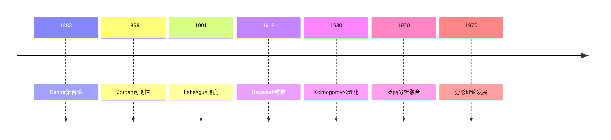
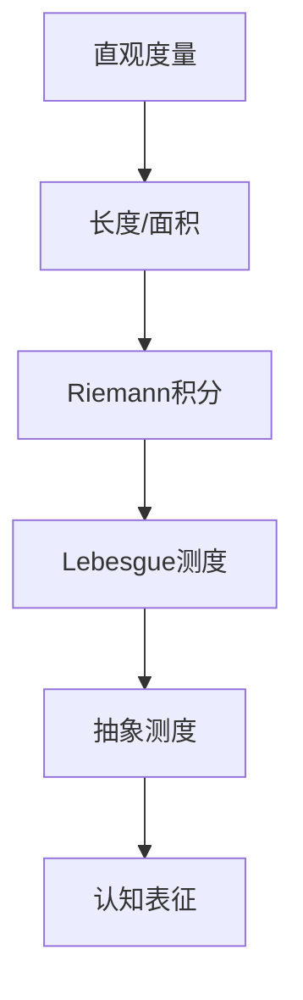
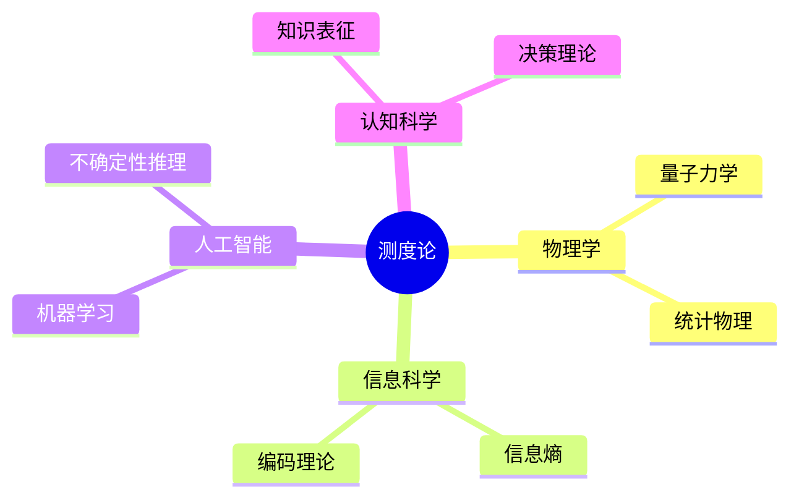

# 测度论的批判性分析

## 目录

- [测度论的批判性分析](#测度论的批判性分析)
  - [目录](#目录)
  - [理论基础与历史发展](#理论基础与历史发展)
    - [历史脉络](#历史脉络)
    - [关键人物贡献](#关键人物贡献)
  - [核心定理与形式化证明](#核心定理与形式化证明)
    - [测度的基本性质](#测度的基本性质)
    - [Lebesgue测度构造](#lebesgue测度构造)
    - [Radon-Nikodym定理](#radon-nikodym定理)
  - [认知结构与表征](#认知结构与表征)
    - [认知层次的映射](#认知层次的映射)
    - [认知结构的形式化表征](#认知结构的形式化表征)
  - [跨学科联系](#跨学科联系)
    - [与其他数学分支的关联](#与其他数学分支的关联)
    - [与现代科学的交互](#与现代科学的交互)
  - [哲学反思与批判](#哲学反思与批判)
    - [认识论维度](#认识论维度)
    - [方法论反思](#方法论反思)
  - [现代应用与前沿](#现代应用与前沿)
    - [人工智能领域](#人工智能领域)
    - [量子信息理论](#量子信息理论)
    - [复杂系统研究](#复杂系统研究)
  - [未来展望](#未来展望)

## 理论基础与历史发展

### 历史脉络

测度论的发展反映了数学思维从直观到抽象的演进：

### 关键人物贡献

1. **Lebesgue**：
   - 突破性地引入了外测度概念
   - 建立了积分理论新框架
   - 解决了Fourier级数收敛问题

2. **Kolmogorov**：
   - 公理化概率论
   - 建立测度论与概率论桥梁
   - 引入条件期望的严格定义

3. **Hausdorff**：
   - 发展分数维概念
   - 构造非可测集合
   - 拓展测度空间理论

## 核心定理与形式化证明

### 测度的基本性质

**定义**：设$(X,\mathcal{M},\mu)$为测度空间，$\mu$满足：

1. 非负性：$\forall A \in \mathcal{M}, \mu(A) \geq 0$
2. 空集测度为零：$\mu(\emptyset) = 0$
3. 可数可加性：对互不相交的可测集列$\{A_n\}_{n=1}^{\infty}$，有：

$$\mu(\bigcup_{n=1}^{\infty} A_n) = \sum_{n=1}^{\infty} \mu(A_n)$$

### Lebesgue测度构造

**定理**：在$\mathbb{R}^n$上，存在唯一的测度$m$满足：

1. 平移不变性
2. 对区间$[a,b]$，$m([a,b]) = b-a$
3. 可数可加性

**证明概要**：

1. 定义外测度：$m^*(E) = \inf\{\sum_{i=1}^{\infty}l(I_i): E \subset \bigcup_{i=1}^{\infty}I_i\}$
2. 验证Caratheodory可测性条件
3. 证明唯一性通过测度的性质推导

### Radon-Nikodym定理

**定理**：设$\mu,\nu$为$\sigma$-有限测度，若$\nu \ll \mu$，则存在非负可测函数$f$使得：

$$\nu(E) = \int_E f d\mu$$

这一定理建立了绝对连续测度间的关系，对概率论和泛函分析有深远影响。

## 认知结构与表征

测度论反映了人类对"大小"概念的抽象化过程：

### 认知层次的映射

测度论中的概念层级与人类认知发展阶段存在对应：

1. **具象阶段**：
   - 直观几何测度（长度、面积、体积）
   - 有限可加性理解
   - 离散计数概念

2. **过渡阶段**：
   - Riemann可积性
   - 有限维空间度量
   - 集合论基础

3. **抽象阶段**：
   - Lebesgue测度
   - 可数可加性
   - 抽象空间测度

### 认知结构的形式化表征

测度论提供了形式化人类认知过程的数学工具：

| 认知特征 | 测度论对应 | 形式化表示 |
|---------|-----------|------------|
| 分类能力 | 可测性 | $\sigma$-代数 |
| 量化判断 | 测度值 | $\mu(A)$ |
| 概括推理 | 可数可加性 | $\mu(\cup A_i) = \sum \mu(A_i)$ |
| 不确定性 | 概率测度 | $P(A) \in [0,1]$ |

## 跨学科联系

### 与其他数学分支的关联

1. **泛函分析**：
   - Lebesgue积分理论
   - 算子理论
   - Banach空间

2. **概率论**：
   - 概率测度
   - 随机过程
   - 大数定律

3. **分形理论**：
   - Hausdorff维数
   - 自相似测度
   - 分形几何

### 与现代科学的交互

## 哲学反思与批判

### 认识论维度

1. **可测性的局限**：
   - 非可测集的存在暗示认知边界
   - 测度零集合的哲学意义
   - 连续统假设与测度论

2. **无穷性处理**：
   - 可数无穷与不可数无穷
   - 测度的完备化过程
   - 极限概念的认知基础

### 方法论反思

1. **抽象化过程**：
   - 从具象到抽象的认知跨越
   - 公理化方法的优势与局限
   - 直观与形式化的张力

2. **统一性与多样性**：
   - 不同测度的存在必要性
   - 测度选择的主观性
   - 普适性与特殊性的平衡

## 现代应用与前沿

### 人工智能领域

1. **深度学习**：
   - 特征空间的测度理论
   - 神经网络的泛化理论
   - 不确定性量化

2. **概率编程**：
   - 测度论基础
   - 贝叶斯推断
   - 随机过程建模

### 量子信息理论

1. **量子测度**：
   - 非交换测度理论
   - 量子概率
   - 量子纠缠的度量

2. **量子计算**：
   - 量子态空间
   - 测量理论
   - 退相干现象

### 复杂系统研究

1. **动态系统**：
   - 不变测度
   - 遍历理论
   - 混沌现象

2. **网络科学**：
   - 图上的测度
   - 复杂网络度量
   - 动态网络演化

## 未来展望

1. **理论发展**：
   - 非交换几何中的测度
   - 无穷维空间测度理论
   - 分形测度新方法

2. **应用拓展**：
   - 量子计算中的测度问题
   - 人工智能的不确定性度量
   - 复杂系统的统计描述

3. **跨学科整合**：
   - 认知科学的数学基础
   - 信息论的测度论解释
   - 物理学的测度论框架

测度论作为数学基础理论，其发展历程展现了人类思维从具象到抽象的跨越。
它不仅提供了严格的数学工具，也为我们理解认知过程和自然现象提供了独特视角。
在未来，随着科技发展和跨学科研究的深入，测度论将继续发挥其基础性作用，并在新的领域展现其价值。
